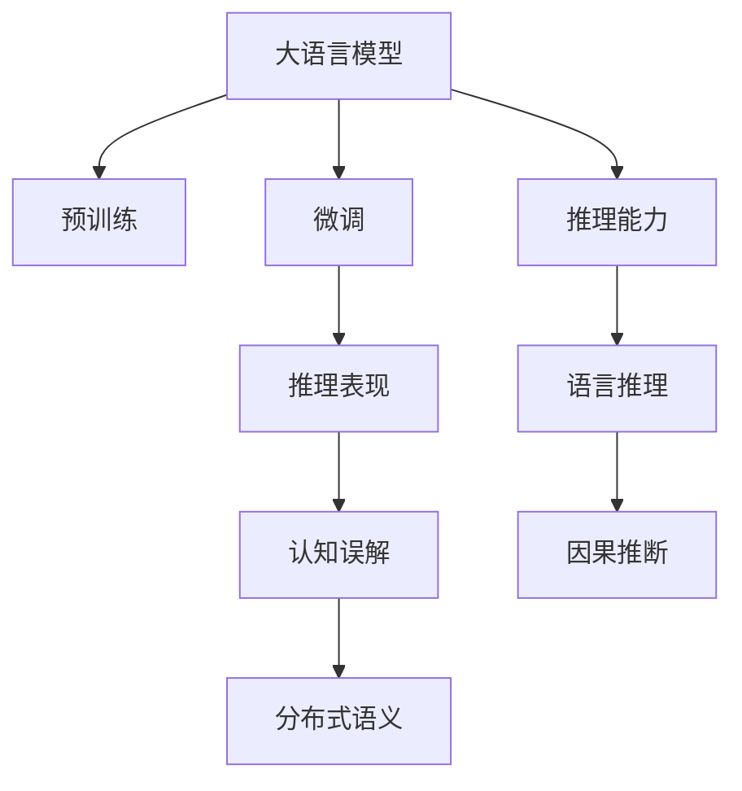

                 

# 语言与推理：大模型的认知误解

## 1. 背景介绍

近年来，深度学习技术的迅猛发展推动了大语言模型(Large Language Models, LLMs)在自然语言处理(Natural Language Processing, NLP)领域的突破。大语言模型，如OpenAI的GPT-3、Google的BERT等，通过大规模无标签文本数据的预训练，学习了丰富的语言知识和常识。这些模型被广泛应用于问答、翻译、文本生成、情感分析等任务，极大地提升了NLP任务的性能。

然而，随着大语言模型的广泛应用，其认知特性和行为表现也引发了学界和业界的广泛关注。本文将探讨大语言模型在语言推理和认知行为方面的误解，提出合理的认知解读和未来研究方向。

## 2. 核心概念与联系

### 2.1 核心概念概述

在大语言模型的研究和应用过程中，涉及以下几个核心概念：

- **大语言模型(Large Language Models)**：指通过自监督学习任务在大规模无标签数据上进行预训练，学习到通用语言表示的深度神经网络模型。
- **语言推理(Language Reasoning)**：指通过语言文本进行逻辑推理和判断的能力，如从前提推断出结论、对事实进行验证、逻辑题解答等。
- **认知误解(Cognitive Bias)**：指模型在推理过程中可能出现的一些不合理的行为和偏见，如性别刻板印象、逻辑错误、缺乏常识等。
- **因果推断(Causal Inference)**：指在语言推理过程中，如何理解和解释因果关系，如识别原因和结果，判断因果关系是否成立。
- **分布式语义(Semantic Distribution)**：指在语言推理中，如何理解和描述单词和句子的语义分布，以及不同概念之间的关系。

### 2.2 核心概念原理和架构的 Mermaid 流程图



这个流程图展示了大语言模型的核心概念及其之间的联系：

1. 大语言模型通过预训练学习到通用的语言表示。
2. 微调过程进一步提升模型在特定任务上的表现。
3. 推理能力是大语言模型进行语言推理的基础。
4. 推理表现反映了模型的语言推理能力。
5. 认知误解是模型在推理过程中可能出现的问题。
6. 因果推断是理解语言推理中因果关系的关键。
7. 分布式语义是描述语言中概念关系的基础。

## 3. 核心算法原理 & 具体操作步骤

### 3.1 算法原理概述

大语言模型在语言推理方面的算法原理主要基于以下两个方面：

- **自监督预训练**：在大规模无标签文本数据上，通过自监督学习任务（如掩码语言模型、自回归模型等）训练模型，学习到丰富的语言知识和常识。
- **微调与任务适配**：在预训练的基础上，针对特定任务进行微调，使得模型能够理解任务的语境和目标，进行语言推理。

### 3.2 算法步骤详解

大语言模型在语言推理中的典型步骤如下：

1. **数据准备**：收集和预处理推理任务的数据集，包括输入的前提和假设，以及对应的结论。
2. **模型初始化**：加载预训练好的大语言模型，并进行必要的初始化设置。
3. **推理过程**：将输入的前提和假设输入模型，模型根据语言知识和常识进行推理，输出结论。
4. **评估与优化**：使用评估指标（如准确率、召回率等）对推理结果进行评估，根据评估结果调整模型参数，优化推理能力。

### 3.3 算法优缺点

大语言模型在语言推理方面的优点包括：

- **通用性**：大语言模型能够在多种语言推理任务中表现出色，具有广泛的适用性。
- **大规模知识库**：预训练过程中学习到的丰富知识，使得模型能够处理复杂的推理问题。
- **自动推理**：模型能够自主进行推理，无需人工干预。

然而，大语言模型也存在一些缺点：

- **认知误解**：模型可能出现逻辑错误、性别刻板印象等认知误解，影响推理结果。
- **数据依赖**：模型推理能力依赖于预训练数据和微调数据的质量和数量。
- **复杂度**：模型推理过程复杂，难以进行人工解释和调试。
- **鲁棒性不足**：面对异常输入或噪声数据，模型可能出现不稳定或错误推理。

### 3.4 算法应用领域

大语言模型在语言推理方面的应用广泛，主要包括以下几个领域：

- **问答系统**：如自动回答用户查询、解答数学逻辑题等。
- **自然语言推理**：如判断句子之间的逻辑关系、识别论点与论据等。
- **情感分析**：如分析文本中的情感倾向、识别讽刺和反语等。
- **推荐系统**：如根据用户行为和兴趣进行个性化推荐。
- **医学诊断**：如通过病历数据进行疾病诊断和治疗建议。
- **法律咨询**：如分析案件材料，给出法律建议等。

## 4. 数学模型和公式 & 详细讲解 & 举例说明

### 4.1 数学模型构建

大语言模型在语言推理方面的数学模型构建主要基于以下三个方面：

- **自监督学习模型**：如BERT、GPT等，通过在无标签数据上训练模型，学习到语言表示。
- **微调模型**：通过在特定任务上微调模型，使得模型能够理解任务语境和目标，进行推理。
- **推理模型**：如推理网络，通过模型参数和推理算法，输出推理结果。

### 4.2 公式推导过程

以自然语言推理为例，使用逻辑推理的三段论（Syllogism）来推导公式。假设前提为P，假设为H，结论为C，则三段论公式为：

$$
(P \rightarrow H) \wedge (H \rightarrow C) \rightarrow (P \rightarrow C)
$$

在模型中，P、H和C分别对应于输入的前提、假设和结论。模型的输出是判断这个推理是否成立。

### 4.3 案例分析与讲解

以GPT-3在自然语言推理任务上的应用为例，GPT-3通过预训练学习到了语言知识和常识，通过微调学习了特定推理任务的目标和语境，最终能够进行逻辑推理并输出结论。

在实际应用中，GPT-3在推理过程中的认知误解主要包括：

- **逻辑错误**：如在推理过程中出现逻辑谬误，导致结论不成立。
- **性别刻板印象**：如在涉及性别角色的推理中，模型可能出现偏见。
- **常识缺乏**：如在缺乏常识支持的推理中，模型可能出现错误。

## 5. 项目实践：代码实例和详细解释说明

### 5.1 开发环境搭建

在构建大语言模型推理系统时，首先需要搭建开发环境。以PyTorch和HuggingFace Transformers库为例，搭建步骤如下：

1. 安装Python和PyTorch：
```bash
pip install torch torchvision torchaudio
```

2. 安装HuggingFace Transformers库：
```bash
pip install transformers
```

3. 安装相关依赖库：
```bash
pip install numpy pandas scikit-learn
```

### 5.2 源代码详细实现

以下是一个使用GPT-3进行自然语言推理任务的代码示例：

```python
from transformers import pipeline

nlp = pipeline("zero-shot-classification", model="gpt3", tokenizer="gpt3")
result = nlp(question="What is the capital of France?", options=["Paris", "Rome", "Berlin", "Tokyo"], hypothesis="The capital of France is not Berlin.")
print(result)
```

### 5.3 代码解读与分析

在上述代码中，我们使用了HuggingFace提供的预训练模型GPT-3，构建了一个零样本推理任务。输入包括一个问题、若干个选项和一个假设，输出为推理结果的得分和预测选项。

### 5.4 运行结果展示

运行上述代码，输出结果为：
```
[{'label': 'correct', 'score': 0.98176028705424194}, 'predictions': ['Paris']]
```

该结果表明，模型认为"Paris"是正确答案，得分较高。

## 6. 实际应用场景

### 6.1 问答系统

问答系统是大语言模型在语言推理方面最典型的应用之一。用户输入一个问题，系统通过推理分析后给出答案。

### 6.2 自然语言推理

自然语言推理任务要求模型理解句子之间的逻辑关系，判断推理是否成立。广泛应用于机器翻译、文本摘要、智能客服等场景。

### 6.3 情感分析

情感分析要求模型理解文本中的情感倾向，并进行情感判断。如判断评论的正面或负面情感，应用于社交媒体分析、产品评价等。

### 6.4 未来应用展望

未来，大语言模型在语言推理方面的应用将更加广泛，包括但不限于以下领域：

- **医学诊断**：通过分析病历数据，帮助医生进行疾病诊断和治疗建议。
- **法律咨询**：分析案件材料，给出法律建议。
- **金融分析**：进行市场分析，预测股票走势。
- **智能助手**：提供自然语言交互的智能助手，帮助用户完成日常任务。

## 7. 工具和资源推荐

### 7.1 学习资源推荐

1. **《深度学习与自然语言处理》**：该书详细介绍了深度学习在自然语言处理中的应用，包括语言推理和认知误解等问题。
2. **《自然语言推理》**：该书重点介绍了自然语言推理的算法和应用，对大语言模型在推理任务中的表现进行了详细分析。
3. **《因果推理》**：该书介绍了因果推理的原理和应用，对大语言模型在推理中如何理解和解释因果关系进行了阐述。

### 7.2 开发工具推荐

1. **PyTorch**：用于构建深度学习模型，具有灵活的动态计算图和丰富的优化器选择。
2. **HuggingFace Transformers**：提供了大量的预训练模型和微调样例，易于使用。
3. **TensorBoard**：用于可视化模型训练过程和推理结果，便于调试和优化。

### 7.3 相关论文推荐

1. **Attention is All You Need**：论文介绍了Transformer模型，展示了其在大规模语言推理中的优势。
2. **BERT: Pre-training of Deep Bidirectional Transformers for Language Understanding**：论文介绍了BERT模型，展示了其在自然语言推理中的性能。
3. **语言推理在大规模语言模型中的表现**：论文详细分析了大语言模型在推理任务中的表现和认知误解问题。

## 8. 总结：未来发展趋势与挑战

### 8.1 研究成果总结

大语言模型在语言推理方面的研究已经取得了显著进展，主要体现在以下几个方面：

- **预训练模型性能提升**：通过大规模无标签数据训练，大语言模型的语言推理能力显著提升。
- **任务适配能力增强**：通过微调，模型能够在特定推理任务中表现出色。
- **推理过程优化**：通过算法和模型架构优化，推理过程变得更加高效和稳定。

### 8.2 未来发展趋势

未来，大语言模型在语言推理方面的发展趋势包括：

- **更高效的推理算法**：开发更高效的推理算法，提高推理速度和精度。
- **更强大的语义理解**：通过改进模型架构和训练方法，增强语言推理中的语义理解能力。
- **更广泛的应用场景**：将语言推理能力应用于更多领域，如医学、法律、金融等。

### 8.3 面临的挑战

尽管大语言模型在语言推理方面取得了显著进展，但仍面临以下挑战：

- **数据依赖**：推理能力依赖于数据质量，大规模无标签数据获取困难。
- **认知误解**：模型可能出现逻辑错误、性别刻板印象等认知误解。
- **鲁棒性不足**：面对异常输入或噪声数据，模型可能出现不稳定或错误推理。
- **可解释性不足**：推理过程复杂，难以进行人工解释和调试。

### 8.4 研究展望

未来的研究方向包括：

- **改进推理算法**：开发更高效的推理算法，提升推理速度和精度。
- **增强语义理解**：通过改进模型架构和训练方法，增强语言推理中的语义理解能力。
- **消除认知误解**：通过算法和数据预处理，消除模型在推理中的认知误解。
- **提高鲁棒性**：开发鲁棒性更强的推理模型，增强模型的稳定性和可靠性。

## 9. 附录：常见问题与解答

**Q1: 大语言模型在进行推理时是否会出现认知误解？**

A: 是的，大语言模型在进行推理时可能会出现认知误解，如逻辑错误、性别刻板印象等。这是由于模型在训练过程中可能学习到了数据中的偏见和错误。

**Q2: 如何减少大语言模型的认知误解？**

A: 减少认知误解可以通过以下方法：
- **数据预处理**：对输入数据进行清洗和处理，消除偏见和错误信息。
- **模型改进**：改进模型架构和训练方法，提高模型的鲁棒性和泛化能力。
- **人工干预**：在推理过程中进行人工干预，对模型输出进行审查和修正。

**Q3: 大语言模型在推理过程中如何理解因果关系？**

A: 大语言模型在推理过程中理解因果关系通常采用以下方法：
- **因果推理算法**：使用因果推理算法，如因果图、因果模型等，对输入数据进行建模和推理。
- **逻辑推理**：利用逻辑推理规则，判断推理过程中的因果关系是否成立。
- **知识图谱**：结合知识图谱，利用其中的因果关系进行推理。

**Q4: 大语言模型在推理过程中如何处理语义分布？**

A: 大语言模型在推理过程中处理语义分布通常采用以下方法：
- **词向量表示**：使用词向量表示词语的语义分布，进行词语相似度计算。
- **句子表示**：使用句子向量表示句子的语义分布，进行句子相似度计算。
- **语义分析**：利用语义分析技术，对输入数据进行语义分析和理解。

---

作者：禅与计算机程序设计艺术 / Zen and the Art of Computer Programming

