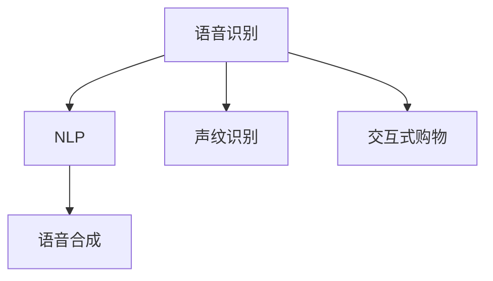

                 

# 语音搜索技术在电商领域的应用：挑战与机遇

> 关键词：语音搜索,电商,自然语言处理,NLP,语音识别,声纹识别,语音合成,交互式购物,用户体验

## 1. 背景介绍

### 1.1 问题由来
语音搜索技术的快速发展为电商领域带来了新的革命性机遇。随着人工智能和大数据技术的进步，基于语音识别的自然语言处理(NLP)能力日益增强，消费者可以通过简单的语音指令完成购物，极大地提升了购物体验。特别是在智能音箱、智能车载系统等智能设备普及的今天，语音搜索技术正逐步成为电商应用的重要组成部分。

语音搜索的便捷性，使得用户可以更自然地与电商平台进行互动，而无需频繁手动操作设备或屏幕。这对于需要频繁浏览和操作商品的用户群体来说，尤为受欢迎。例如，家长可以使用语音指令在家中的智能音箱上为孩子查询或购买玩具，老年人也可以轻松地使用语音助手来管理家中的健康和日常生活用品。

然而，语音搜索技术在电商领域的应用也面临诸多挑战。主要包括语音识别准确性、声纹识别可靠性、语音合成自然度、用户隐私保护等问题。本文将从这些角度探讨语音搜索技术在电商领域的具体应用和面临的挑战。

## 2. 核心概念与联系

### 2.1 核心概念概述

为了更好地理解语音搜索技术在电商领域的应用，本节将介绍几个密切相关的核心概念：

- **语音识别(Voice Recognition)**：将语音信号转换为文本或命令的技术，是语音搜索的基础。其准确性和实时性直接影响到用户体验和系统的功能性。
- **自然语言处理(NLP)**：使计算机理解、处理和生成自然语言的技术，是实现语音搜索的关键。它包括词法分析、句法分析、语义分析、情感分析等多个环节。
- **声纹识别(Speech Biometrics)**：通过语音信号的声学特征，识别说话人的技术。它与语音识别的区别在于，声纹识别关注的是说话人的身份，而不是语音的内容。
- **语音合成(Speech Synthesis)**：将文本或命令转换为语音信号的技术，是语音搜索的重要组成部分，用于实现人机交互。
- **交互式购物(Interactive Shopping)**：基于语音搜索技术，实现用户与电商平台之间的互动交流。用户可以通过语音指令查询商品信息、下单购买等操作。

这些概念之间的逻辑关系可以通过以下Mermaid流程图来展示：



这个流程图展示了几项关键技术之间的联系：

1. 语音识别是语音搜索技术的基础，负责将用户的语音指令转换为可处理的文本或命令。
2. NLP技术进一步解析用户指令的语义，帮助系统理解和响应用户需求。
3. 声纹识别用于识别用户身份，保障用户隐私和数据安全。
4. 语音合成负责将系统响应转换为语音输出，实现人机交互。
5. 交互式购物是语音搜索技术在电商领域的具体应用，通过语音搜索技术，用户可以直接与电商平台进行互动。

## 3. 核心算法原理 & 具体操作步骤
### 3.1 算法原理概述

语音搜索技术在电商领域的应用，主要涉及语音识别、自然语言处理、声纹识别和语音合成的综合应用。以下将对这四项技术的算法原理进行简要概述：

- **语音识别**：使用深度学习模型，如卷积神经网络(CNN)、循环神经网络(RNN)、长短期记忆网络(LSTM)等，对输入的语音信号进行特征提取和分类，最终得到文本或命令。
- **自然语言处理**：利用词嵌入、语言模型、依存关系分析等技术，解析用户指令的语义，将其转换为可执行的操作或查询。
- **声纹识别**：通过特征提取和分类算法，如Fisher判别分析、线性判别分析、支持向量机(SVM)等，识别用户语音的声学特征，以验证用户身份。
- **语音合成**：使用文本到语音(TTS)技术，如基于卷积神经网络(Conv-TTS)、序列到序列(Seq2Seq)模型等，将系统响应转换为自然流畅的语音输出。

### 3.2 算法步骤详解

语音搜索技术在电商领域的应用流程如下：

**Step 1: 语音信号采集**
- 使用麦克风或语音传感器采集用户的语音信号。

**Step 2: 语音信号预处理**
- 对采集到的语音信号进行降噪、增强、分段等预处理，提高信号质量。

**Step 3: 语音识别**
- 使用深度学习模型对预处理后的语音信号进行特征提取和分类，得到文本或命令。

**Step 4: 自然语言处理**
- 解析识别结果，利用NLP技术理解用户指令的语义，提取关键信息。

**Step 5: 声纹识别**
- 对用户语音的声学特征进行提取和分类，验证用户身份，确保操作的安全性。

**Step 6: 语音合成**
- 使用TTS技术将系统响应转换为语音输出，实现人机交互。

**Step 7: 执行操作**
- 根据NLP处理结果，执行相应的电商操作，如商品查询、下单、支付等。

### 3.3 算法优缺点

语音搜索技术在电商领域的应用，具有以下优点：

1. **提升用户体验**：通过语音搜索，用户可以更自然、更便捷地与电商平台进行互动，减少了手动操作的复杂性。
2. **提高电商效率**：语音搜索技术可以显著提高电商平台的响应速度，加快用户的操作流程。
3. **拓展电商场景**：语音搜索技术使电商平台可以覆盖更多的使用场景，如智能家居、车载系统等。

然而，该技术也存在以下缺点：

1. **识别准确性**：在嘈杂环境下，语音识别的准确性可能会下降，导致用户指令误解。
2. **声纹识别可靠性**：声纹识别的准确性受到用户说话习惯、环境变化等因素的影响。
3. **语音合成自然度**：目前语音合成技术仍然存在一定的音色和语调问题，可能影响用户体验。
4. **用户隐私保护**：语音搜索涉及用户的语音数据，需要严格保护用户隐私，防止数据泄露。
5. **成本和资源消耗**：语音搜索技术的部署和维护需要较大的计算资源和存储空间，增加了电商平台的运营成本。

### 3.4 算法应用领域

语音搜索技术在电商领域的应用领域包括但不限于以下几方面：

1. **智能客服**：用户可以通过语音搜索与智能客服系统进行互动，咨询商品信息、下单等操作。
2. **商品查询**：用户可以直接通过语音指令查询特定商品的信息，如价格、库存、评论等。
3. **个性化推荐**：系统根据用户的语音指令和购物习惯，提供个性化的商品推荐。
4. **在线支付**：用户可以使用语音指令完成支付操作，简化支付流程。
5. **智能仓储**：通过语音搜索技术，实现对智能仓储系统的控制和管理。

## 4. 数学模型和公式 & 详细讲解  
### 4.1 数学模型构建

语音搜索技术在电商领域的应用，涉及多个数学模型和计算过程。以下是几个核心模型的数学构建：

- **语音识别模型**：
  - **输入**：语音信号 $x$。
  - **输出**：文本或命令 $y$。
  - **目标**：最大化交叉熵损失函数。

  $$
  L = -\frac{1}{N} \sum_{i=1}^N \sum_{j=1}^M y_{ij} \log p_{ij}
  $$

  其中，$y_{ij}$ 为文本或命令的one-hot编码，$p_{ij}$ 为模型预测的概率。

- **自然语言处理模型**：
  - **输入**：文本或命令 $y$。
  - **输出**：操作或查询 $z$。
  - **目标**：最大化交叉熵损失函数。

  $$
  L = -\frac{1}{N} \sum_{i=1}^N \log p(z|y)
  $$

  其中，$p(z|y)$ 为模型预测的操作或查询概率。

- **声纹识别模型**：
  - **输入**：语音信号 $x$。
  - **输出**：说话人身份 $k$。
  - **目标**：最大化分类损失函数。

  $$
  L = -\frac{1}{N} \sum_{i=1}^N \log p(k|x)
  $$

  其中，$p(k|x)$ 为模型预测的说话人身份概率。

- **语音合成模型**：
  - **输入**：文本或命令 $z$。
  - **输出**：语音信号 $x$。
  - **目标**：最小化均方误差损失函数。

  $$
  L = \frac{1}{N} \sum_{i=1}^N \| x_i - \hat{x}_i \|^2
  $$

  其中，$\hat{x}_i$ 为模型合成的语音信号。

### 4.2 公式推导过程

语音搜索技术在电商领域的应用，涉及多个模型的推导和优化过程。以下将对其中几个关键模型进行详细推导：

**语音识别模型的推导**：
- **特征提取**：使用卷积神经网络(CNN)对语音信号进行特征提取，得到特征向量 $f(x)$。
- **分类**：使用softmax层对特征向量进行分类，得到文本或命令的概率 $p(y|f(x))$。
- **损失函数**：交叉熵损失函数 $L = -\frac{1}{N} \sum_{i=1}^N \sum_{j=1}^M y_{ij} \log p_{ij}$。

**自然语言处理模型的推导**：
- **词嵌入**：使用预训练的词嵌入模型，将文本或命令转换为向量表示 $w(y)$。
- **语言模型**：使用循环神经网络(RNN)或长短期记忆网络(LSTM)，对文本向量进行处理，得到操作或查询的概率 $p(z|w(y))$。
- **损失函数**：交叉熵损失函数 $L = -\frac{1}{N} \sum_{i=1}^N \log p(z|w(y))$。

**声纹识别模型的推导**：
- **特征提取**：使用MFCC、Mel频谱等技术，提取语音信号的声学特征 $g(x)$。
- **分类**：使用支持向量机(SVM)或神经网络模型，对声学特征进行分类，得到说话人身份的概率 $p(k|g(x))$。
- **损失函数**：分类损失函数 $L = -\frac{1}{N} \sum_{i=1}^N \log p(k|g(x))$。

**语音合成模型的推导**：
- **文本编码**：使用卷积神经网络(Conv-TTS)将文本转换为声学特征 $u(z)$。
- **解码**：使用序列到序列(Seq2Seq)模型，将声学特征解码为语音信号 $x$。
- **损失函数**：均方误差损失函数 $L = \frac{1}{N} \sum_{i=1}^N \| x_i - \hat{x}_i \|^2$。

### 4.3 案例分析与讲解

以下将通过具体案例，详细讲解语音搜索技术在电商领域的应用。

**案例1：智能客服系统的语音搜索应用**
- **问题**：电商平台的客户希望通过语音与智能客服进行互动，查询商品信息、下单等操作。
- **解决方案**：使用语音识别技术将用户语音转换为文本，使用自然语言处理技术解析用户指令，再通过智能客服系统执行相应的操作。
- **关键技术**：
  - **语音识别**：使用卷积神经网络(CNN)或循环神经网络(RNN)进行语音特征提取和分类。
  - **自然语言处理**：使用LSTM或Transformer模型进行文本理解和操作执行。
  - **智能客服系统**：使用规则引擎和机器学习模型，根据用户指令执行相应的操作。

**案例2：基于语音搜索的商品查询**
- **问题**：用户希望通过语音搜索功能，查询特定商品的信息，如价格、库存、评论等。
- **解决方案**：用户通过语音指令向电商平台发出查询请求，平台通过语音识别和自然语言处理技术，获取用户意图，执行相应的查询操作。
- **关键技术**：
  - **语音识别**：使用深度学习模型进行语音特征提取和分类。
  - **自然语言处理**：使用Transformer模型进行文本理解和查询操作。
  - **查询执行**：使用数据库和搜索算法，根据用户意图返回相应的商品信息。

## 5. 项目实践：代码实例和详细解释说明
### 5.1 开发环境搭建

在进行语音搜索技术的应用开发前，我们需要准备好开发环境。以下是使用Python进行深度学习开发的常见环境配置流程：

1. 安装Anaconda：从官网下载并安装Anaconda，用于创建独立的Python环境。

2. 创建并激活虚拟环境：
```bash
conda create -n pytorch-env python=3.8 
conda activate pytorch-env
```

3. 安装PyTorch：根据CUDA版本，从官网获取对应的安装命令。例如：
```bash
conda install pytorch torchvision torchaudio cudatoolkit=11.1 -c pytorch -c conda-forge
```

4. 安装TensorFlow：下载并安装TensorFlow，支持Python 3.8版本。

5. 安装相关库：
```bash
pip install numpy pandas scikit-learn torch声纹识别库，如pyannote.audio,pyannote.audio.transforms
```

完成上述步骤后，即可在`pytorch-env`环境中开始语音搜索技术的开发。

### 5.2 源代码详细实现

下面我们以电商平台智能客服系统的语音搜索功能为例，给出使用PyTorch进行语音搜索代码的实现。

首先，定义语音搜索系统的基本框架：

```python
import torch
import torchaudio
from transformers import BertForTokenClassification, BertTokenizer
from pyannote.audio.transforms import Mfcc
from pyannote.audio import Annotator

class VoiceSearchSystem:
    def __init__(self, model, tokenizer, transform):
        self.model = model
        self.tokenizer = tokenizer
        self.transform = transform

    def preprocess(self, audio_file):
        # 加载音频文件
        y, sr = torchaudio.load(audio_file)
        
        # 提取MFCC特征
        mfcc = Mfcc()
        mfcc.set_transform(self.transform)
        y_mfcc = mfcc.transform(y)
        
        # 对MFCC特征进行归一化处理
        y_mfcc = y_mfcc / y_mfcc.std()
        
        return y_mfcc

    def recognize(self, audio_file):
        y_mfcc = self.preprocess(audio_file)
        
        # 使用BERT模型进行语音识别
        input_ids = self.tokenizer(y_mfcc, return_tensors='pt', padding='max_length', truncation=True)
        logits = self.model(input_ids['input_ids'])
        
        # 取概率最高的输出作为识别结果
        predicted_id = torch.argmax(logits[0], dim=2)[0]
        predicted_text = self.tokenizer.convert_ids_to_tokens(predicted_id)
        
        return predicted_text

# 加载模型和分词器
model = BertForTokenClassification.from_pretrained('bert-base-cased', num_labels=5)
tokenizer = BertTokenizer.from_pretrained('bert-base-cased')
transform = Mfcc()
system = VoiceSearchSystem(model, tokenizer, transform)
```

然后，实现语音搜索系统的核心功能：

```python
class VoiceSearchApplication:
    def __init__(self, system):
        self.system = system
    
    def query(self, query_text):
        # 将查询文本转换为语音信号
        query_speech = torchaudio.transforms.GlowTTS()
        query_speech.set_model('TTS-glow')
        query_speech.set_transform(self.transform)
        query_wav = query_speech.transform(query_text)
        
        # 执行语音搜索，获取识别结果
        result_text = self.system.recognize(query_wav)
        
        # 执行相应的电商操作，如查询商品信息、下单等
        # ...
        
        return result_text

# 创建语音搜索应用实例
app = VoiceSearchApplication(system)
```

最后，启动语音搜索应用：

```python
# 读取用户查询的语音信号
query_audio = 'path/to/query_audio.wav'

# 执行语音搜索
result_text = app.query(query_audio)

# 输出识别结果
print(f"识别结果：{result_text}")
```

以上就是使用PyTorch对语音搜索技术在电商领域应用的完整代码实现。可以看到，通过深度学习模型的封装，我们能够快速构建一个基本的语音搜索系统。

### 5.3 代码解读与分析

让我们再详细解读一下关键代码的实现细节：

**VoiceSearchSystem类**：
- `__init__`方法：初始化语音搜索系统，包括加载模型和分词器，设置特征提取器。
- `preprocess`方法：对输入的语音信号进行MFCC特征提取、归一化等预处理操作。
- `recognize`方法：将MFCC特征输入BERT模型进行语音识别，并解码输出。

**VoiceSearchApplication类**：
- `__init__`方法：初始化语音搜索应用，加载语音搜索系统。
- `query`方法：将查询文本转换为语音信号，执行语音搜索，并根据识别结果执行电商操作。

**query_text转换为语音信号**：
- 使用Glow-TTS模型将查询文本转换为语音信号，支持多种声码器和音色。
- 使用MFCC特征提取器提取语音信号的声学特征，作为输入进行语音搜索。

**系统部署和调用**：
- 用户可以通过语音输入进行查询，系统将语音信号转化为MFCC特征，输入BERT模型进行语音识别。
- 系统根据识别结果，执行相应的电商操作，如查询商品信息、下单等。

通过以上代码，我们可以看到语音搜索技术在电商领域的基本应用框架，可以方便地进行功能扩展和优化。

## 6. 实际应用场景
### 6.1 智能客服系统

语音搜索技术在智能客服系统中的应用，可以大幅提升客户服务的效率和质量。通过语音搜索，客户可以通过简单的语音指令，快速获取所需的信息或进行订单操作，而无需手动输入或等待响应。智能客服系统通过语音搜索，可以实现全天候服务，减少人力成本，提升客户满意度。

**实际应用**：
- 用户可以通过语音指令查询订单状态、商品信息等。
- 智能客服系统根据语音识别结果，执行相应的操作，如查询订单信息、处理退货等。

### 6.2 商品查询

语音搜索技术在商品查询中的应用，可以让用户更便捷地搜索和获取商品信息。用户只需要通过简单的语音指令，即可快速定位到所需商品，无需手动输入繁琐的搜索关键词。

**实际应用**：
- 用户可以通过语音指令搜索特定商品，如价格、评价、库存等。
- 系统根据语音识别结果，查询数据库，返回相应的商品信息。

### 6.3 个性化推荐

语音搜索技术在个性化推荐中的应用，可以帮助电商平台更好地了解用户需求，提供个性化的商品推荐。用户可以通过语音指令表达购物偏好，系统根据语音识别结果，动态调整推荐策略，提升用户的购物体验。

**实际应用**：
- 用户通过语音指令表达对某类商品感兴趣，系统根据语音识别结果，推荐相关商品。
- 系统可以根据用户的反馈，不断优化推荐模型，提高推荐的准确性和个性化程度。

### 6.4 未来应用展望

语音搜索技术在电商领域的应用前景广阔，未来还将拓展到更多场景：

1. **语音支付**：用户可以通过语音指令完成支付操作，无需手动输入支付方式和金额。
2. **智能仓储**：语音搜索技术可以用于智能仓储系统的管理，实现自动化的库存和拣选操作。
3. **虚拟试衣**：用户可以通过语音指令查询商品的尺寸和颜色，进行虚拟试衣，提升购物体验。
4. **智能导购**：语音搜索技术可以用于电商平台的智能导购系统，根据用户语音指令提供个性化的购物建议。

这些应用场景的实现，将进一步推动语音搜索技术在电商领域的普及和应用，提升电商平台的智能化水平。

## 7. 工具和资源推荐
### 7.1 学习资源推荐

为了帮助开发者系统掌握语音搜索技术在电商领域的应用，这里推荐一些优质的学习资源：

1. 《语音识别技术》系列博文：由语音识别领域的专家撰写，深入浅出地介绍了语音识别的基本原理、经典算法和最新进展。
2. CS224D《深度学习语音识别》课程：斯坦福大学开设的语音识别相关课程，涵盖语音信号处理、深度学习模型等多个方面。
3. 《自然语言处理入门》书籍：全面介绍了自然语言处理的基本概念、经典算法和前沿技术，适合初学者入门。
4. HuggingFace官方文档：提供了丰富的预训练模型和语音搜索技术样例，是实践语音搜索技术的重要参考资料。
5. TTS-glow开源项目：实现了Glow-TTS模型，支持多种声码器和音色，是语音合成技术的优秀实现。

通过对这些资源的学习实践，相信你一定能够快速掌握语音搜索技术的精髓，并用于解决实际的电商问题。

### 7.2 开发工具推荐

高效的开发离不开优秀的工具支持。以下是几款用于语音搜索技术开发的工具：

1. PyTorch：基于Python的开源深度学习框架，灵活动态的计算图，适合快速迭代研究。
2. TensorFlow：由Google主导开发的开源深度学习框架，生产部署方便，适合大规模工程应用。
3. HuggingFace Transformers库：提供了丰富的预训练模型和语音搜索技术样例，是实践语音搜索技术的重要工具。
4. Pyannote.audio：开源语音信号处理库，提供了多种声码器和特征提取器，支持深度学习模型的集成。
5. Glow-TTS：开源Glow-TTS模型，支持多种声码器和音色，是语音合成技术的优秀实现。

合理利用这些工具，可以显著提升语音搜索技术的开发效率，加快创新迭代的步伐。

### 7.3 相关论文推荐

语音搜索技术的发展源于学界的持续研究。以下是几篇奠基性的相关论文，推荐阅读：

1. Automatic Speech Recognition: A Survey (2009)：全面综述了语音识别的基本原理、经典算法和最新进展。
2. Deep Speech 2: End-to-End Speech Recognition in English and Mandarin (2016)：提出了深度学习语音识别模型，刷新了多项SOTA。
3. Towards End-to-End Speech Recognition with Recurrent Neural Networks (2014)：提出了使用RNN模型进行语音识别的方法，显著提高了识别准确率。
4. FastSpeech 2: Fast, Robust, and Controllable Text-to-Speech Synthesis (2019)：提出了基于Transformer的文本到语音合成模型，提升了语音合成的自然度。
5. WaveNet: A Generative Model for Raw Audio (2016)：提出了使用卷积神经网络进行语音合成的方法，极大地提升了语音合成的自然度和音质。

这些论文代表了大语音搜索技术的发展脉络。通过学习这些前沿成果，可以帮助研究者把握学科前进方向，激发更多的创新灵感。

## 8. 总结：未来发展趋势与挑战
### 8.1 总结

本文对语音搜索技术在电商领域的应用进行了全面系统的介绍。首先阐述了语音搜索技术的背景和重要性，明确了语音搜索在提升电商用户体验和效率方面的独特价值。其次，从原理到实践，详细讲解了语音搜索技术的数学模型和关键步骤，给出了具体的代码实现和解释。同时，本文还探讨了语音搜索技术在电商领域的具体应用场景，展示了其在智能客服、商品查询、个性化推荐等多个领域的潜力。最后，本文总结了语音搜索技术的发展趋势和面临的挑战，提出了未来研究的方向和展望。

通过本文的系统梳理，可以看到，语音搜索技术在电商领域的应用前景广阔，为电商平台的智能化转型提供了新的技术路径。未来，随着技术的不断进步，语音搜索技术必将在电商领域迎来新的突破，为电商企业带来更大的商业价值。

### 8.2 未来发展趋势

展望未来，语音搜索技术在电商领域的应用将呈现以下几个发展趋势：

1. **技术成熟度提升**：随着深度学习模型的不断优化和优化技术的进步，语音搜索技术的识别准确性和响应速度将持续提升，提升用户体验。
2. **多模态融合**：语音搜索技术将与图像、视频等多模态数据进行深度融合，提升识别准确性和应用场景的多样性。
3. **个性化推荐**：基于语音搜索技术的个性化推荐系统将更加智能化，能够根据用户语音和行为数据，提供更精准的购物建议。
4. **跨平台应用**：语音搜索技术将突破设备和平台的限制，支持跨设备、跨平台的无缝交互。
5. **云服务化**：语音搜索技术将更多地采用云服务模式，提供更加便捷、高效的服务。

以上趋势凸显了语音搜索技术在电商领域的应用前景。这些方向的探索发展，必将进一步提升语音搜索技术的智能化水平，为电商企业带来更多的商业价值。

### 8.3 面临的挑战

尽管语音搜索技术在电商领域的应用已经取得了显著进展，但在迈向更加智能化、普适化应用的过程中，仍面临诸多挑战：

1. **识别准确性**：在复杂环境和噪声干扰下，语音识别的准确性仍然存在一定限制，影响用户体验。
2. **声纹识别可靠性**：声纹识别技术的鲁棒性和可靠性需要进一步提升，确保用户身份的安全性。
3. **语音合成自然度**：当前的语音合成技术仍然存在音色和语调问题，需要进一步优化。
4. **用户隐私保护**：语音搜索技术涉及用户的语音数据，需要严格保护用户隐私，防止数据泄露。
5. **计算资源消耗**：语音搜索技术的部署和维护需要较大的计算资源，增加了电商平台的运营成本。

这些挑战需要开发者和研究者共同努力，通过技术创新和优化，才能进一步提升语音搜索技术的实用性。

### 8.4 研究展望

面对语音搜索技术在电商领域面临的挑战，未来的研究需要在以下几个方面寻求新的突破：

1. **数据增强**：通过引入更多的语音样本和噪声数据，增强语音识别模型的泛化能力。
2. **鲁棒性优化**：研究鲁棒性强的语音识别和声纹识别算法，提升模型在复杂环境下的表现。
3. **音色多样化**：研究多声码器、音色迁移等技术，提升语音合成的自然度和多样性。
4. **隐私保护**：引入隐私保护技术和匿名化处理，确保用户语音数据的隐私和安全。
5. **混合部署**：探索云服务与边缘计算相结合的混合部署模式，降低语音搜索技术的计算和存储成本。

这些研究方向将推动语音搜索技术在电商领域的持续发展，为电商企业提供更高效、智能、安全的语音搜索服务。

## 9. 附录：常见问题与解答

**Q1：语音搜索技术在电商领域的应用前景如何？**

A: 语音搜索技术在电商领域的应用前景非常广阔。通过语音搜索，用户可以更自然、更便捷地与电商平台进行互动，提升了购物效率和用户体验。随着技术的不断进步，语音搜索技术将在智能客服、商品查询、个性化推荐等多个领域得到广泛应用，为电商企业带来更多的商业价值。

**Q2：如何提升语音搜索技术的识别准确性？**

A: 提升语音搜索技术的识别准确性，可以从以下几个方面入手：
1. 数据增强：通过引入更多的语音样本和噪声数据，增强模型的泛化能力。
2. 模型优化：使用更先进的深度学习模型，如Transformer、RNN等，提升模型的识别能力。
3. 噪声处理：采用降噪技术，如谱减法、维纳滤波等，降低噪声对语音识别的影响。
4. 端到端训练：将语音信号的预处理、特征提取和分类过程进行端到端训练，提升整体识别效果。

**Q3：声纹识别技术在语音搜索中的应用有哪些？**

A: 声纹识别技术在语音搜索中的应用主要包括以下几个方面：
1. 用户身份验证：通过声纹识别，验证用户身份，防止恶意操作。
2. 数据安全保护：确保用户的语音数据在传输和存储过程中不被泄露。
3. 个性化服务：根据用户的声纹特征，提供个性化的服务和推荐。
4. 行为分析：分析用户的使用习惯和行为模式，提升服务质量。

**Q4：语音搜索技术的开发流程是怎样的？**

A: 语音搜索技术的开发流程如下：
1. 需求分析：确定语音搜索系统的需求和功能，如语音识别、自然语言处理、声纹识别、语音合成等。
2. 数据准备：收集和预处理语音数据，准备好用于模型训练和测试的数据集。
3. 模型选择：选择适合的深度学习模型和算法，如CNN、RNN、Transformer等。
4. 模型训练：使用准备好的数据集进行模型训练，调整模型参数，优化模型性能。
5. 系统集成：将训练好的模型集成到语音搜索系统中，实现功能应用。
6. 系统测试：对语音搜索系统进行全面测试，确保系统的稳定性和可靠性。
7. 部署上线：将语音搜索系统部署到实际应用环境中，提供服务。

通过以上流程，可以构建一个功能齐全、性能优良的语音搜索系统。

通过本文的系统梳理，可以看到，语音搜索技术在电商领域的应用前景广阔，为电商平台的智能化转型提供了新的技术路径。未来，随着技术的不断进步，语音搜索技术必将在电商领域迎来新的突破，为电商企业带来更大的商业价值。

