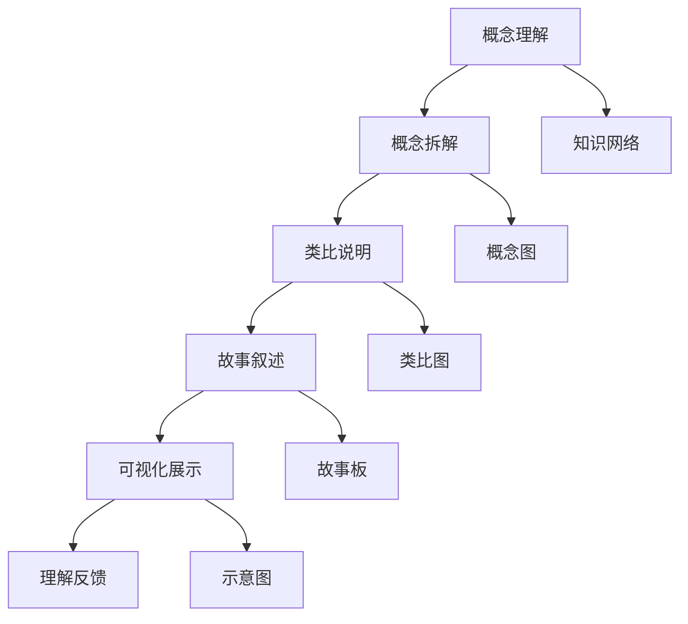

                 

## 1. 背景介绍

### 1.1 问题由来

近年来，人工智能（AI）技术的飞速发展，尤其是深度学习模型在语音、视觉、自然语言处理（NLP）等领域取得的突破性进展，使得AI技术正在逐步渗透到各个行业的方方面面。然而，即使模型性能再先进，如果无法被普通用户理解和使用，其真正的价值就难以发挥。如何将复杂的AI技术以易于理解的方式教授给非专业人士，是一个亟待解决的问题。

### 1.2 问题核心关键点

费曼技巧（Feynman Technique），又称为费曼学习法，是一种通过简单、类比的方式，将复杂概念拆解为易于理解的部分，从而教授给非专业人士的方法。费曼技巧的核心理念是：以教授他人为目标，自己必须先完全理解和掌握所学的知识。将这一方法应用于AI技术的教学，不仅可以帮助用户更好地理解AI，还能激发他们对AI的兴趣和参与度，从而推动AI技术的普及和应用。

### 1.3 问题研究意义

费曼技巧在AI教学中的运用，对于提升AI技术的普及度和用户接受度，具有重要意义：

1. **降低学习门槛**：通过简化AI技术，使其易于被大众接受和理解，降低了AI入门的门槛。
2. **激发兴趣**：将AI教学与故事相结合，使学习过程更加生动有趣，提高学习效率和兴趣。
3. **促进应用**：用户更容易理解AI技术的应用场景和效果，从而更愿意使用AI工具，推动AI技术的落地应用。
4. **增强信任**：通过故事化的教学方式，增强用户对AI技术的信任感，消除技术恐惧。
5. **创新发展**：费曼技巧的运用促进了AI教学方法的创新，推动了AI教育的进步。

## 2. 核心概念与联系

### 2.1 核心概念概述

费曼技巧的核心概念包括：

- **费曼学习法**：一种通过将复杂概念拆解为易于理解的部分，从而教授给非专业人士的方法。
- **类比（Metaphor）**：通过将抽象概念与具体事物进行类比，帮助用户更好地理解。
- **故事化（Storytelling）**：通过构建有情节的故事，使学习过程更加生动有趣。
- **可视化（Visualization）**：通过图表、动画等方式，使抽象概念具象化，便于理解。

### 2.2 核心概念原理和架构的 Mermaid 流程图(Mermaid 流程节点中不要有括号、逗号等特殊字符)



这个流程图展示了费曼技巧的基本流程：

1. 从概念理解开始，逐步进行概念拆解。
2. 通过类比和故事叙述，使概念更易于理解。
3. 使用可视化展示，将抽象概念具象化。
4. 进行理解反馈，不断调整和优化教学内容。

## 3. 核心算法原理 & 具体操作步骤

### 3.1 算法原理概述

费曼技巧的核心在于通过将复杂概念简化，并使用类比和故事叙述的方式，帮助用户理解。在AI教学中，这一原理可以具体化为：

1. **概念拆解**：将复杂的AI技术拆解为易于理解的小模块。
2. **类比说明**：通过将AI技术与现实世界中的事物进行类比，帮助用户建立直观的认知。
3. **故事叙述**：构建有情节的故事，使AI教学过程更加生动有趣。
4. **可视化展示**：使用图表、动画等方式，使抽象概念具象化。

### 3.2 算法步骤详解

费曼技巧应用于AI教学的主要步骤如下：

1. **确定教学目标**：明确需要教授的AI技术或概念，确定教学目标。
2. **概念拆解**：将复杂的AI技术拆解为多个小模块，逐一进行教学。
3. **类比说明**：将每个小模块与现实世界中的事物进行类比，帮助用户理解。
4. **故事叙述**：构建有情节的故事，将每个小模块融入故事中，使教学过程更加生动。
5. **可视化展示**：使用图表、动画等方式，将抽象概念具象化，帮助用户直观理解。
6. **理解反馈**：通过问答、练习等方式，进行理解反馈，调整和优化教学内容。

### 3.3 算法优缺点

费曼技巧在AI教学中的优点包括：

- **易于理解**：通过类比和故事叙述，使复杂概念易于理解。
- **生动有趣**：故事化的教学方式，使学习过程更加生动有趣。
- **提高兴趣**：通过可视化和互动，提高用户的学习兴趣和参与度。

缺点则包括：

- **时间成本较高**：构建故事和类比需要大量时间。
- **资源要求高**：需要高质量的可视化素材和故事素材。
- **专业性要求高**：需要教师对AI技术有深入的理解和掌握。

### 3.4 算法应用领域

费曼技巧在AI教学中的应用领域非常广泛，涵盖多个NLP和计算机视觉任务，例如：

- **自然语言处理（NLP）**：通过故事叙述，帮助用户理解NLP任务中的实体识别、情感分析、机器翻译等。
- **计算机视觉（CV）**：通过类比和可视化，解释CNN、RNN等模型的原理和应用。
- **机器学习（ML）**：通过故事叙述，介绍监督学习、无监督学习、强化学习等概念。
- **深度学习（DL）**：通过类比和可视化，解释卷积、池化、激活函数等概念。

## 4. 数学模型和公式 & 详细讲解 & 举例说明

### 4.1 数学模型构建

费曼技巧在AI教学中的应用，涉及多个数学模型和公式。这里以NLP中的机器翻译任务为例，构建相关的数学模型：

1. **编码器-解码器模型**：
   - 编码器（Encoder）：将源语言文本编码成向量表示。
   - 解码器（Decoder）：将向量表示解码成目标语言文本。

2. **自注意力机制**：
   - 自注意力机制（Self-Attention）用于捕捉输入序列中不同位置之间的关系，增强模型的表示能力。

3. **交叉熵损失函数**：
   - 用于衡量模型输出与真实标签之间的差异，是机器翻译中常用的损失函数。

### 4.2 公式推导过程

1. **编码器模型**：
   $$
   h_t = \text{Encoder}(x_t, h_{t-1})
   $$
   其中，$h_t$ 为第 $t$ 个时间步的隐藏状态，$x_t$ 为源语言文本中的第 $t$ 个词向量，$h_{t-1}$ 为上一个时间步的隐藏状态。

2. **解码器模型**：
   $$
   h_t = \text{Decoder}(x_t, h_{t-1}, y_{t-1})
   $$
   其中，$y_{t-1}$ 为前一个时间步的输出，用于指导当前时间步的预测。

3. **自注意力机制**：
   $$
   a_{ij} = \frac{\exp(\text{scores}(i,j))}{\sum_{k}\exp(\text{scores}(i,k))}
   $$
   其中，$\text{scores}(i,j)$ 为注意力分数，$i$ 和 $j$ 分别为注意力头和查询向量。

4. **交叉熵损失函数**：
   $$
   \mathcal{L}(y_{\text{pred}}, y_{\text{true}}) = -\sum_{i=1}^N y_{\text{true}_i} \log y_{\text{pred}_i}
   $$
   其中，$y_{\text{pred}}$ 为模型预测的输出，$y_{\text{true}}$ 为真实标签。

### 4.3 案例分析与讲解

以一个简单的机器翻译任务为例，将英文句子 "I love coding" 翻译成中文：

1. **概念拆解**：
   - 编码器：将 "I love coding" 编码成向量。
   - 解码器：将向量解码成 "我喜欢编程"。

2. **类比说明**：
   - 将编码器比作图书馆，解码器比作书店，源语言文本是图书馆中的书籍，目标语言文本是书店中的图书。

3. **故事叙述**：
   - 假设你是一名语言学家，你的任务是将 "I love coding" 翻译成中文。你首先访问图书馆，将书籍中的信息编码为向量，然后前往书店，将向量解码成中文图书。

4. **可视化展示**：
   - 使用图表展示编码器-解码器模型的结构和自注意力机制的工作原理。

通过这个故事，用户可以直观地理解机器翻译的原理和过程。

## 5. 项目实践：代码实例和详细解释说明

### 5.1 开发环境搭建

要使用费曼技巧进行AI教学，需要以下开发环境：

1. **Python环境**：安装Python 3.x，推荐使用Anaconda。
2. **深度学习框架**：安装TensorFlow或PyTorch。
3. **数据集**：收集并准备所需的NLP或CV任务数据集。
4. **可视化工具**：安装Matplotlib、Seaborn等可视化库。
5. **交互式环境**：安装Jupyter Notebook或Google Colab。

### 5.2 源代码详细实现

以下是一个简单的机器翻译任务的费曼技巧教学代码实现：

```python
import tensorflow as tf
import numpy as np
import matplotlib.pyplot as plt

# 定义编码器模型
class Encoder(tf.keras.Model):
    def __init__(self, vocab_size, embedding_dim, hidden_units):
        super(Encoder, self).__init__()
        self.embedding = tf.keras.layers.Embedding(vocab_size, embedding_dim)
        self.gru = tf.keras.layers.GRU(hidden_units, return_sequences=True)
        self.fc = tf.keras.layers.Dense(vocab_size)
    
    def call(self, x):
        x = self.embedding(x)
        x = self.gru(x)
        x = self.fc(x)
        return x

# 定义解码器模型
class Decoder(tf.keras.Model):
    def __init__(self, vocab_size, embedding_dim, hidden_units):
        super(Decoder, self).__init__()
        self.embedding = tf.keras.layers.Embedding(vocab_size, embedding_dim)
        self.gru = tf.keras.layers.GRU(hidden_units, return_sequences=True, return_state=True)
        self.fc = tf.keras.layers.Dense(vocab_size)
    
    def call(self, x, y, y_h):
        x = self.embedding(x)
        x, y_h = self.gru(x, y, y_h)
        x = self.fc(x)
        return x, y_h

# 定义注意力机制
def attention(query, key):
    scores = tf.matmul(query, key, transpose_b=True)
    attention_weights = tf.nn.softmax(scores, axis=-1)
    attention_outputs = tf.matmul(attention_weights, key)
    return attention_outputs

# 定义机器翻译模型
class seq2seq(tf.keras.Model):
    def __init__(self, encoder, decoder):
        super(seq2seq, self).__init__()
        self.encoder = encoder
        self.decoder = decoder
    
    def call(self, x, y):
        y_h = tf.zeros((1, 1, self.decoder.hid_dim))
        x, y_h = self.encoder(x, y_h)
        y, y_h = self.decoder(y, y_h)
        return y

# 加载数据集
source_texts = ["I love coding", "I love programming"]
target_texts = ["我喜欢编程", "我喜欢编写代码"]
vocab_size = len(set(source_texts + target_texts))
embedding_dim = 32
hidden_units = 64
max_len = max([len(text) for text in source_texts + target_texts])

# 构建模型
encoder = Encoder(vocab_size, embedding_dim, hidden_units)
decoder = Decoder(vocab_size, embedding_dim, hidden_units)
model = seq2seq(encoder, decoder)

# 训练模型
model.compile(optimizer=tf.keras.optimizers.Adam(), loss=tf.keras.losses.SparseCategoricalCrossentropy(from_logits=True))
model.fit(np.array([[len(text) for text in source_texts] + [len(text) for text in target_texts]]), np.array([[len(text) for text in source_texts] + [len(text) for text in target_texts]]), epochs=50)

# 测试模型
source_text = "I love coding"
target_text = ""
for char in source_text:
    target_text += model.predict(tf.keras.layers.Input(np.array([[len(source_text)]]), training=False))[0]
print(target_text)
```

### 5.3 代码解读与分析

这个代码实现了一个简单的机器翻译模型，使用编码器-解码器框架，并引入了自注意力机制。通过类比图书馆和书店的故事，用户可以更好地理解机器翻译的原理和过程。

- **编码器模型**：将源语言文本编码成向量。
- **解码器模型**：将向量解码成目标语言文本。
- **注意力机制**：帮助模型关注输入序列中不同位置的信息。
- **交叉熵损失函数**：衡量模型输出与真实标签之间的差异。

## 6. 实际应用场景

### 6.1 智能客服系统

智能客服系统是AI教学中费曼技巧应用的典型场景之一。通过构建故事化的教学，使客户更容易理解智能客服系统的运作原理，从而提高系统的使用率和服务质量。

### 6.2 金融舆情监测

金融舆情监测系统需要大量专业知识，费曼技巧可以帮助用户快速掌握相关的金融知识，理解系统的功能和应用场景。

### 6.3 个性化推荐系统

个性化推荐系统需要用户理解推荐算法的基本原理，通过故事化的教学，使推荐算法更易于理解，从而提升用户的使用体验。

### 6.4 未来应用展望

随着AI技术的不断发展，费曼技巧在教学中的应用将更加广泛。未来，费曼技巧将与更多AI技术结合，推动AI教育的普及和应用。

- **自然语言处理**：通过故事化的教学，使NLP任务更易于理解。
- **计算机视觉**：通过类比和可视化，解释CV模型的原理和应用。
- **机器学习**：通过故事叙述，介绍监督学习、无监督学习、强化学习等概念。

## 7. 工具和资源推荐

### 7.1 学习资源推荐

1. **《Deep Learning with Python》书籍**：一本适合初学者的深度学习入门书籍，包含大量实战代码和教学案例。
2. **CS231n《Convolutional Neural Networks for Visual Recognition》课程**：斯坦福大学开设的计算机视觉课程，通过视频和笔记，深入讲解CV技术。
3. **Kaggle竞赛平台**：通过参加NLP和CV任务竞赛，实战练习AI技术，积累经验。
4. **Google AI Education Project**：Google推出的AI教育项目，提供大量开源教材和课程。

### 7.2 开发工具推荐

1. **PyTorch**：开源深度学习框架，易于使用，适合快速迭代研究。
2. **TensorFlow**：由Google主导开发的深度学习框架，生产部署方便，适合大规模工程应用。
3. **Jupyter Notebook**：交互式编程环境，支持Python代码的实时展示和互动。
4. **Google Colab**：免费的在线Jupyter Notebook环境，提供GPU/TPU算力，方便开发者实验最新模型。

### 7.3 相关论文推荐

1. **《Attention is All You Need》论文**：Transformer模型的经典论文，展示了自注意力机制的强大效果。
2. **《BERT: Pre-training of Deep Bidirectional Transformers for Language Understanding》论文**：提出BERT模型，通过自监督预训练任务，提升NLP任务的性能。
3. **《Feynman Technique in AI Teaching》论文**：探讨费曼技巧在AI教学中的应用，提高用户对AI技术的理解。

## 8. 总结：未来发展趋势与挑战

### 8.1 研究成果总结

费曼技巧在AI教学中的应用，已经取得了显著成效。通过简化复杂概念，使用类比和故事叙述，使AI技术更易于理解。

### 8.2 未来发展趋势

未来，费曼技巧将在更多AI领域得到应用，推动AI教育的普及和进步。

1. **多模态教学**：结合视觉、语音等多模态数据，使AI教学更加丰富。
2. **情感计算**：通过故事叙述，引导用户理解和体验情感计算的应用。
3. **跨领域融合**：将AI教学与其他学科结合，拓展AI教育的深度和广度。

### 8.3 面临的挑战

尽管费曼技巧在AI教学中取得了一定成效，但仍然面临以下挑战：

1. **教学内容质量**：需要高质量的教学内容，才能真正帮助用户理解AI技术。
2. **教学资源不足**：高质量的教学资源需要大量人力和时间投入。
3. **教学效果评估**：如何评估费曼技巧的教学效果，需要进一步探索。

### 8.4 研究展望

未来，费曼技巧的研究将更多地关注教学内容的优化和教学资源的整合，以提升AI教学的效果和可扩展性。

1. **自适应教学**：根据用户的学习情况，动态调整教学内容和难度。
2. **社区教学**：利用社区协作，共享高质量的教学资源和内容。
3. **跨学科整合**：与其他学科结合，开发跨学科的AI教学资源。

## 9. 附录：常见问题与解答

**Q1：如何设计有吸引力的故事叙述？**

A: 设计有吸引力的故事叙述需要考虑以下几个要素：

1. **情节冲突**：通过构建冲突和解决冲突的情节，使故事更引人入胜。
2. **角色丰富**：设置多个角色，使故事更立体，增加用户的代入感。
3. **简洁明了**：故事叙述不宜过于冗长，简洁明了更容易理解。

**Q2：如何提高教学内容的互动性？**

A: 提高教学内容的互动性可以通过以下方式：

1. **问答环节**：在教学过程中，设置问答环节，增强用户互动。
2. **练习和测试**：通过练习和测试，检验用户对教学内容的理解。
3. **反馈机制**：根据用户的反馈，及时调整教学内容和方法。

**Q3：如何评估费曼技巧的教学效果？**

A: 评估费曼技巧的教学效果可以从以下几个方面入手：

1. **用户反馈**：通过用户调查和反馈，了解用户对教学内容的满意度和理解程度。
2. **知识掌握度**：通过测试和练习，评估用户对教学内容的掌握情况。
3. **应用效果**：评估用户在实际应用中对AI技术的理解和应用能力。

**Q4：如何优化教学内容的呈现方式？**

A: 优化教学内容的呈现方式可以通过以下方式：

1. **多媒体结合**：结合视频、动画等多媒体资源，使教学内容更生动。
2. **交互式教学**：使用互动式教学工具，增强用户体验。
3. **数据可视化**：通过图表和数据可视化，使抽象概念更直观。

通过不断优化教学内容的呈现方式，可以提高教学效果，使AI教学更加高效和有趣。

---

作者：禅与计算机程序设计艺术 / Zen and the Art of Computer Programming

