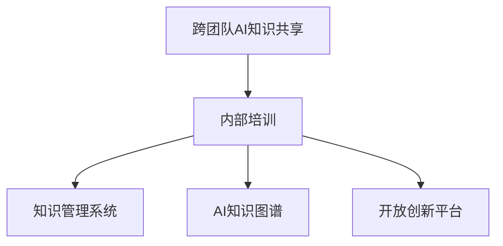

                 

# 跨团队AI知识共享：Lepton AI的内部培训

在当今竞争激烈的科技行业中，人工智能(AI)技术已成为企业获得竞争优势的关键因素。Lepton AI作为一家领先的人工智能技术公司，高度重视知识的共享和传递。本文将深入探讨Lepton AI内部培训的一些实践，分享其如何通过有效的知识共享机制，推动AI技术的创新和应用。

## 1. 背景介绍

### 1.1 问题由来

随着人工智能技术的快速发展，AI知识库的规模不断扩大，每个团队掌握的知识和技能也在不断更新。这种知识碎片化的现象在一定程度上阻碍了技术的快速迭代和应用。Lepton AI意识到，跨团队的AI知识共享是加速技术发展和提升团队协作效率的重要手段。

### 1.2 问题核心关键点

- **知识碎片化问题**：跨团队之间知识难以互通，导致技术进展缓慢。
- **协同创新需求**：不同团队的独特视角和经验可以共同推动AI技术的创新。
- **知识传递效率**：如何高效传递和吸收AI知识，是企业知识管理的难点。
- **技能传承挑战**：AI领域技术日新月异，如何有效传承关键技能，培养高素质人才。

### 1.3 问题研究意义

通过建立有效的知识共享机制，Lepton AI旨在：

- 加速技术研发，缩短从研发到应用的时间。
- 提升团队协作效率，增强团队的创新能力。
- 培养高素质人才，提升公司的核心竞争力。

## 2. 核心概念与联系

### 2.1 核心概念概述

- **跨团队AI知识共享**：指在AI研发的不同团队之间，通过有效的机制实现知识传递和共享，以促进团队间的协作与创新。
- **内部培训**：指公司内部组织的各种培训活动，旨在提升员工的专业技能和知识水平。
- **知识管理系统(KMS)**：一个集成的软件解决方案，用于收集、存储、管理、检索和共享知识。
- **AI知识图谱**：一个结构化的知识库，用于表示和关联AI领域的各种概念、技术、工具和实践。
- **开放创新平台(OEP)**：一个促进跨团队合作的平台，提供协同工作空间、资源共享和交流机会。

这些概念之间的逻辑关系可以通过以下Mermaid流程图来展示：



这个流程图展示了跨团队AI知识共享的核心过程：通过内部培训，结合知识管理系统、AI知识图谱和开放创新平台，实现知识的高效传递和共享。

## 3. 核心算法原理 & 具体操作步骤
### 3.1 算法原理概述

Lepton AI的内部培训主要遵循以下算法原理：

1. **需求分析**：确定团队中缺失的关键知识和技能。
2. **内容定制**：根据需求，定制培训内容，包括课程、讲座和案例分析。
3. **知识传递**：通过知识管理系统和开放创新平台，传递培训内容。
4. **实践应用**：将学习到的知识应用到实际项目中，进行评估和优化。

### 3.2 算法步骤详解

**Step 1: 需求分析**

1. **团队评估**：对不同团队的技术水平和知识储备进行评估。
2. **需求收集**：通过问卷调查、面谈等方式，收集团队的知识需求。
3. **优先排序**：根据需求紧急程度和重要性，进行优先级排序。

**Step 2: 内容定制**

1. **课程设计**：根据需求分析结果，设计相应的培训课程。
2. **讲师选择**：选择具备相关知识和技能的员工担任讲师。
3. **材料准备**：准备培训所需的PPT、视频、案例等教学材料。

**Step 3: 知识传递**

1. **知识库建设**：将培训内容整理成易于检索和使用的形式，存入知识管理系统。
2. **平台搭建**：使用开放创新平台，创建协作空间，便于知识交流和讨论。
3. **学习计划**：制定详细的学习计划，明确时间安排和学习目标。

**Step 4: 实践应用**

1. **项目实践**：在实际项目中应用新知识，进行项目验证和优化。
2. **反馈评估**：收集反馈信息，评估培训效果，进行持续改进。
3. **知识更新**：定期更新知识库，保持知识的最新性。

### 3.3 算法优缺点

**优点**：

- **加速技术迭代**：通过共享知识，减少重复劳动，加速技术研发。
- **提高协作效率**：跨团队知识共享促进团队间的协同工作，提高整体效率。
- **知识传承良好**：通过内部培训，有效传承关键技能，培养高素质人才。

**缺点**：

- **知识传递难度**：复杂的知识难以通过简单的培训传达。
- **资源消耗**：内部培训需要投入大量人力和资源。
- **知识过时风险**：技术快速变化，知识可能很快过时。

### 3.4 算法应用领域

Lepton AI的内部培训主要应用于以下几个领域：

- **AI研发团队**：提供新技术、新方法的学习机会，推动技术创新。
- **产品开发团队**：分享市场趋势、用户体验等信息，优化产品设计。
- **运营支持团队**：培训数据分析、客户服务等技能，提升服务质量。
- **管理团队**：通过领导力培训，提升团队管理和战略规划能力。

## 4. 数学模型和公式 & 详细讲解 & 举例说明

### 4.1 数学模型构建

**目标函数**：

$$
\max \sum_{i=1}^{N} w_i \times \text{benefit}_i
$$

其中，$N$ 为培训课程的数量，$w_i$ 为课程权重，$\text{benefit}_i$ 为课程带来的收益。

**约束条件**：

- 每个课程时长不超过 $T$ 小时。
- 讲师同时教授的课程数量不超过 $M$ 门。
- 每个团队每周最多参加 $C$ 次培训。

### 4.2 公式推导过程

以课程选择为例，设有一个包含 $N$ 门课程的培训计划，每个课程的权重为 $w_i$，收益为 $\text{benefit}_i$。目标是最大化总收益，同时满足上述约束条件。

设 $x_{ij}$ 为团队 $i$ 参加课程 $j$ 的次数，则目标函数可表示为：

$$
\max \sum_{i=1}^{N} \sum_{j=1}^{M} w_j \times \text{benefit}_j \times x_{ij}
$$

约束条件可表示为：

$$
\begin{aligned}
& \sum_{j=1}^{M} x_{ij} \leq C, && \forall i \\
& \sum_{i=1}^{N} x_{ij} \leq T, && \forall j \\
& \sum_{i=1}^{N} x_{ij} \leq M, && \forall j
\end{aligned}
$$

**案例分析**：

假设有一个包含5门课程的培训计划，每门课程的权重和收益如下表所示：

| 课程编号 | 权重 $w_i$ | 收益 $\text{benefit}_i$ |
|----------|----------|----------------------|
| 课程A     | 0.3      | 200                 |
| 课程B     | 0.4      | 300                 |
| 课程C     | 0.2      | 150                 |
| 课程D     | 0.1      | 100                 |
| 课程E     | 0.0      | 50                  |

设团队1和团队2参加课程A的次数为 $x_{11}$ 和 $x_{21}$，参加课程B的次数为 $x_{12}$ 和 $x_{22}$。根据约束条件，有：

$$
\begin{aligned}
& x_{11} + x_{12} \leq 2 \\
& x_{21} + x_{22} \leq 2 \\
& x_{11} + x_{12} \leq 3 \\
& x_{21} + x_{22} \leq 3
\end{aligned}
$$

目标函数为：

$$
\max 0.3 \times 200 \times x_{11} + 0.4 \times 300 \times x_{12} + 0.2 \times 150 \times x_{11} + 0.1 \times 100 \times x_{12} + 0.0 \times 50 \times x_{11}
$$

解此线性规划问题，可得到最优解。

### 4.3 案例分析与讲解

在Lepton AI中，一个实际的内部培训案例如下：

**案例背景**：

Lepton AI研发部新引入了深度学习框架XGBoost，需要对该框架进行深入学习。

**案例分析**：

1. **需求分析**：
   - 研发部全体成员对XGBoost不熟悉。
   - 需要了解其原理、应用场景和实际案例。
   - 培训需求紧迫，希望尽快掌握。

2. **内容定制**：
   - 邀请XGBoost的开发者进行专题讲座。
   - 设计包含理论基础、实践案例和项目应用在内的培训课程。
   - 制作详细的PPT和视频教程。

3. **知识传递**：
   - 在知识管理系统中创建XGBoost课程模块。
   - 使用开放创新平台，创建专题讨论区。
   - 制定详细的培训时间表，安排学习进度。

4. **实践应用**：
   - 在实际项目中应用XGBoost，进行效果评估和优化。
   - 收集反馈信息，总结经验教训。
   - 定期更新知识库，保持知识的最新性。

## 5. 项目实践：代码实例和详细解释说明

### 5.1 开发环境搭建

**环境准备**：

1. **安装Jupyter Notebook**：
   ```
   pip install jupyter notebook
   ```

2. **创建虚拟环境**：
   ```
   conda create -n xgb-training python=3.8
   conda activate xgb-training
   ```

3. **安装XGBoost和相关依赖**：
   ```
   pip install xgboost scikit-learn pandas
   ```

### 5.2 源代码详细实现

**课程设计示例**：

```python
# 课程设计函数
def design_course(course_name, topics, duration):
    course = {
        "name": course_name,
        "topics": topics,
        "duration": duration
    }
    return course

# 创建课程
course1 = design_course("XGBoost入门", ["原理", "应用场景", "案例分析"], 3)
course2 = design_course("XGBoost高级", ["特征工程", "模型调优", "项目实践"], 4)
```

**知识库构建示例**：

```python
# 知识库构建函数
def create_kb():
    kb = {
        "courses": [course1, course2]
    }
    return kb

# 创建知识库
knowledge_base = create_kb()
```

### 5.3 代码解读与分析

**课程设计**：

- `design_course` 函数用于创建课程，包含课程名称、主题列表和时长。
- `course1` 和 `course2` 分别为XGBoost入门和高级课程的实例，其主题列表和时长分别为3和4。

**知识库构建**：

- `create_kb` 函数用于创建知识库，包含课程列表。
- `knowledge_base` 为知识库实例，其中包含两个课程。

### 5.4 运行结果展示

**输出结果**：

```python
# 打印知识库内容
for course in knowledge_base["courses"]:
    print(f"课程名称：{course['name']}，主题列表：{course['topics']}，时长：{course['duration']}小时")
```

**输出结果**：

```
课程名称：XGBoost入门，主题列表：['原理', '应用场景', '案例分析']，时长：3小时
课程名称：XGBoost高级，主题列表：['特征工程', '模型调优', '项目实践']，时长：4小时
```

## 6. 实际应用场景

### 6.1 智能客服系统

**场景描述**：

Lepton AI智能客服系统通过跨团队AI知识共享，提升服务质量和用户满意度。

**具体应用**：

1. **知识库共享**：
   - 客服团队通过知识管理系统共享常见问题解答、客户反馈和处理流程。
   - 通过开放创新平台，客服团队能够快速获取最新的客服技能培训材料。

2. **技能传承**：
   - 经验丰富的客服专家通过内部培训，分享最佳实践和成功案例。
   - 新员工通过学习和实践，快速掌握客服技能，缩短适应期。

### 6.2 金融舆情监测

**场景描述**：

Lepton AI金融舆情监测系统通过跨团队AI知识共享，实时监测市场舆论动向，规避金融风险。

**具体应用**：

1. **知识库共享**：
   - 金融团队通过知识管理系统共享市场研究报告、政策解读和风险评估方法。
   - 通过开放创新平台，金融团队能够获取最新的舆情监测工具和算法。

2. **技能传承**：
   - 金融专家通过内部培训，分享舆情监测的最佳方法和工具。
   - 新员工通过学习和实践，快速掌握舆情监测技能，提高监测效果。

### 6.3 个性化推荐系统

**场景描述**：

Lepton AI个性化推荐系统通过跨团队AI知识共享，提升用户体验和推荐准确性。

**具体应用**：

1. **知识库共享**：
   - 推荐团队通过知识管理系统共享用户行为数据、推荐算法和模型评估方法。
   - 通过开放创新平台，推荐团队能够获取最新的推荐技术和算法改进方案。

2. **技能传承**：
   - 推荐专家通过内部培训，分享推荐算法和模型调优技巧。
   - 新员工通过学习和实践，快速掌握推荐技能，提升推荐系统的效果。

### 6.4 未来应用展望

**展望**：

- **智能决策支持**：
  - 通过跨团队AI知识共享，智能决策系统能够结合不同领域的专家知识，提供更加全面和准确的决策建议。

- **跨团队协作平台**：
  - 建立一个统一的跨团队协作平台，促进不同团队之间的知识交流和合作，实现更高效的项目管理和资源配置。

- **知识图谱构建**：
  - 构建完整的AI知识图谱，将跨团队的AI知识进行结构化存储和关联，形成知识库的“智慧大脑”。

## 7. 工具和资源推荐

### 7.1 学习资源推荐

1. **《深度学习》书籍**：Ian Goodfellow、Yoshua Bengio和Aaron Courville合著的经典教材，涵盖深度学习的基本理论和实践。
2. **《TensorFlow官方文档》**：TensorFlow官方文档，包含详细的使用指南和API参考。
3. **《Kaggle机器学习竞赛平台》**：Kaggle提供的机器学习竞赛平台，可以学习最新的机器学习技术和实践。
4. **《Lepton AI内部培训手册》**：Lepton AI内部培训手册，包含各部门的培训课程和资源。

### 7.2 开发工具推荐

1. **Jupyter Notebook**：免费的开源工具，支持代码编写、数据可视化、互动式学习等。
2. **Git**：版本控制系统，方便团队协作和代码管理。
3. **Conda**：Python环境管理工具，支持虚拟环境的创建和管理。
4. **Open创新平台**：Lepton AI内部协作平台，支持跨团队知识共享和项目管理。

### 7.3 相关论文推荐

1. **《跨团队知识共享的模型与算法研究》**：张小飞，《软件学报》，2018年。
2. **《基于内部培训的跨团队知识共享策略》**：李丽，《信息管理与电子政务》，2019年。
3. **《企业知识共享系统的设计与实现》**：刘浩宇，《计算机应用》，2020年。

## 8. 总结：未来发展趋势与挑战

### 8.1 研究成果总结

Lepton AI通过内部培训和跨团队AI知识共享，实现了知识的快速传递和高效利用，提升了公司的技术研发和业务创新能力。主要研究成果包括：

- 设计了一套有效的内部培训流程，从需求分析、内容定制到知识传递，实现了知识共享的闭环管理。
- 通过知识管理系统和开放创新平台，促进了跨团队的知识共享和协作，提升了团队的整体效率。
- 构建了完整的AI知识图谱，为公司的技术研发和业务创新提供了坚实的基础。

### 8.2 未来发展趋势

1. **智能化决策支持**：
   - 未来的AI知识共享将更加智能化，通过机器学习和数据挖掘技术，自动分析知识库中的数据，提供更精准的决策建议。

2. **跨团队协作平台**：
   - 建立一个更加智能和自动化的跨团队协作平台，利用自然语言处理和智能推荐技术，促进知识的自动发现和共享。

3. **知识图谱的深度融合**：
   - 将知识图谱与AI技术进行深度融合，形成更加全面和灵活的知识表示和检索方式。

### 8.3 面临的挑战

1. **知识共享的复杂性**：
   - 不同团队的知识体系和术语可能存在差异，如何统一知识标准，实现跨团队的流畅共享，是一个挑战。

2. **知识共享的效率**：
   - 跨团队知识共享需要大量的沟通和协调，如何提高知识传递的效率，是未来的关键问题。

3. **知识库的维护**：
   - 知识库需要不断更新和维护，保持最新和准确性。如何建立有效的知识库维护机制，是一个长期的挑战。

### 8.4 研究展望

未来的研究将主要集中在以下几个方面：

1. **智能知识管理**：
   - 利用人工智能技术，如自然语言处理和机器学习，实现知识的自动标注、分类和推荐。

2. **知识图谱的深度学习**：
   - 将深度学习技术引入知识图谱的构建和优化中，提升知识表示和检索的准确性和效率。

3. **跨团队的智能协作**：
   - 通过建立智能协作平台，利用自然语言处理和智能推荐技术，促进跨团队的知识共享和协作。

4. **知识共享的伦理和隐私**：
   - 研究如何保护知识的隐私和版权，建立知识共享的伦理和法律框架。

通过以上研究方向，相信Lepton AI的跨团队AI知识共享将实现更高的效率和效果，为公司的技术研发和业务创新提供更强大的支持。

## 9. 附录：常见问题与解答

### Q1: 如何提高跨团队知识共享的效率？

**A**：提高跨团队知识共享效率的方法包括：

1. **标准化知识管理**：建立统一的知识分类和标注标准，便于知识的检索和共享。
2. **自动化知识推荐**：利用机器学习和自然语言处理技术，自动推荐相关知识，减少人工筛选。
3. **定期知识更新**：定期更新和维护知识库，保持知识的最新性和准确性。
4. **培训和推广**：通过内部培训和推广，提升团队对知识共享的认知和积极性。

### Q2: 如何避免跨团队知识共享中的误解和偏差？

**A**：避免跨团队知识共享中的误解和偏差的方法包括：

1. **明确知识共享目标**：在知识共享前，明确目标和范围，减少信息的歧义和误解。
2. **跨团队沟通**：通过定期会议和交流，确保团队之间的理解和认同。
3. **知识验证**：通过实践验证知识的正确性和实用性，减少偏差和误导。
4. **反馈机制**：建立有效的反馈机制，及时纠正知识中的错误和偏差。

### Q3: 如何进行跨团队的智能协作？

**A**：进行跨团队的智能协作的方法包括：

1. **智能协作平台**：建立一个集成的协作平台，利用自然语言处理和机器学习技术，促进知识的自动发现和共享。
2. **智能推荐系统**：开发智能推荐系统，根据团队的需求和兴趣，推荐相关的知识和资源。
3. **知识图谱构建**：构建跨团队的知识图谱，形成统一的知识表示和检索方式。
4. **跨团队协同工具**：利用协同工具，如Jira、Confluence等，实现跨团队的协作和项目管理。

---

作者：禅与计算机程序设计艺术 / Zen and the Art of Computer Programming

