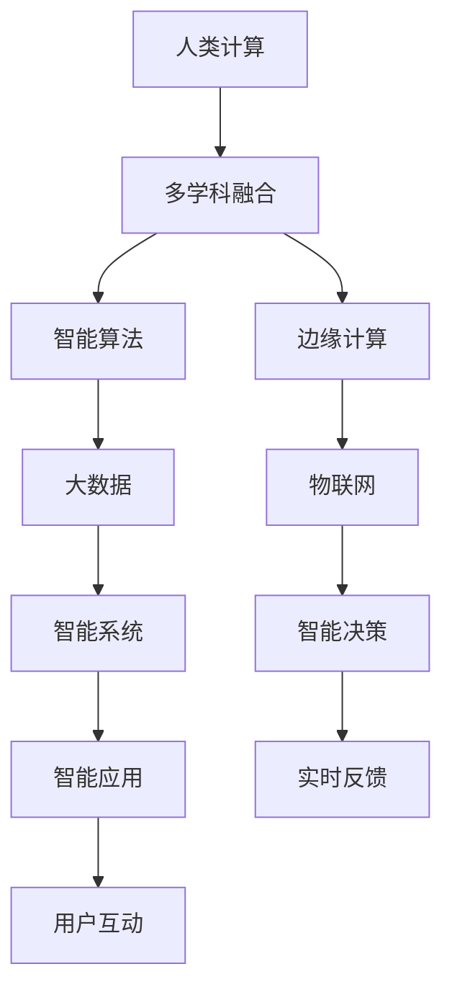

                 

# 跨越学科边界：人类计算的多元化应用

> 关键词：人类计算, 多学科融合, 智能算法, 边缘计算, 机器学习, 大数据, 物联网

## 1. 背景介绍

随着科学技术的飞速发展，人类计算已经突破了传统认知，形成了多元化、跨学科的应用范式。这种范式不仅推动了科技前沿的突破，也在实际应用中展现出巨大的价值和潜力。本文将深入探讨人类计算的多元化应用，通过对其核心概念、关键技术、应用场景及未来发展趋势的系统梳理，为读者提供全面的理解与启发。

## 2. 核心概念与联系

### 2.1 核心概念概述

为了理解人类计算的多元化应用，需要首先明确一些关键概念：

- **人类计算**：基于人类智慧与技术手段相结合的计算方式，融合了数据处理、算法设计、知识图谱构建等多种方法，体现了智慧与计算的深度融合。
- **多学科融合**：将不同学科的知识、方法、技术进行交叉应用，形成协同创新，推动新科学发现和新技术突破。
- **智能算法**：利用机器学习、深度学习、强化学习等算法，实现高效、智能的数据处理和模型训练。
- **边缘计算**：在数据源附近进行计算和数据处理，降低延迟，提高计算效率。
- **大数据**：涉及数据收集、存储、分析和利用的综合概念，强调数据规模和质量对决策的重要性。
- **物联网(IoT)**：将各种物理设备和设施通过网络实现互联，实现智能化管理和服务。

这些概念相互联系，共同构成了人类计算的多元化应用框架，推动了科技与社会的深度融合。

### 2.2 核心概念原理和架构的 Mermaid 流程图(Mermaid 流程节点中不要有括号、逗号等特殊字符)



这个流程图展示了人类计算的多元化应用中各概念之间的联系：

1. **人类计算**通过**多学科融合**整合不同学科知识，并利用**智能算法**构建高效计算模型。
2. **边缘计算**在**大数据**集成的基础上，在数据源附近进行计算，保证低延迟和高效性。
3. **物联网**通过**智能系统**实现设备间互联，支持**智能决策**和**实时反馈**，提升用户体验和系统性能。

## 3. 核心算法原理 & 具体操作步骤

### 3.1 算法原理概述

人类计算的多元化应用中，核心算法包括智能算法、大数据处理、边缘计算优化等。

- **智能算法**：利用机器学习和深度学习技术，构建预测、分类、聚类等模型，提升计算效率和准确性。
- **大数据处理**：通过分布式计算、数据挖掘、数据融合等技术，对海量数据进行高效存储和分析，提取有用信息。
- **边缘计算优化**：结合设备端计算和云平台协同，实现高效的数据处理和实时响应，提升系统性能和用户体验。

### 3.2 算法步骤详解

人类计算的多元化应用通常包括以下关键步骤：

1. **需求分析与数据准备**：明确应用需求，收集和预处理相关数据。
2. **模型构建与训练**：选择合适的算法模型，利用训练数据进行模型训练。
3. **系统部署与集成**：将训练好的模型部署到实际应用场景，与边缘计算、物联网等技术集成。
4. **性能优化与调优**：根据实际应用反馈，调整模型参数，优化系统性能。
5. **系统监控与维护**：实时监控系统运行状态，定期维护，确保系统稳定运行。

### 3.3 算法优缺点

人类计算的多元化应用具有以下优点：

- **高效性**：通过智能化算法和大数据处理，实现高效计算和实时响应。
- **协同性**：多学科融合使得系统能够整合各种资源，发挥整体优势。
- **可扩展性**：边缘计算和物联网技术能够实现分布式协同，支持系统规模扩展。

然而，这种应用方式也存在一些挑战：

- **数据质量要求高**：需要高质量、结构化的数据输入，否则模型效果难以保证。
- **技术门槛高**：涉及多种技术手段，对开发人员的技术水平要求较高。
- **系统复杂度高**：系统结构复杂，需要持续的维护和优化。

### 3.4 算法应用领域

人类计算的多元化应用已经广泛应用于多个领域，以下是几个典型的应用场景：

1. **智慧城市**：通过物联网技术实现城市基础设施智能化管理，提升城市运行效率和市民生活质量。
2. **智能制造**：利用大数据和智能算法优化生产流程，实现智能化的制造管理和服务。
3. **健康医疗**：通过智能算法和大数据处理，实现疾病预测、诊断和治疗的智能化，提升医疗服务质量。
4. **金融科技**：利用大数据和机器学习技术，进行风险评估、欺诈检测和智能投顾，提升金融服务水平。
5. **智能交通**：通过边缘计算和物联网技术，实现交通流量预测、智能调度，提升交通管理效率。

## 4. 数学模型和公式 & 详细讲解 & 举例说明（备注：数学公式请使用latex格式，latex嵌入文中独立段落使用 $$，段落内使用 $)
### 4.1 数学模型构建

在人类计算的多元化应用中，数学模型构建是关键步骤之一。以下是一个简单的数学模型构建示例：

假设有一组数据集 $D=\{(x_i,y_i)\}_{i=1}^N$，其中 $x_i$ 为输入，$y_i$ 为输出，需要构建一个线性回归模型：

$$
y_i = \theta_0 + \theta_1x_i + \epsilon_i
$$

其中 $\theta_0$ 和 $\theta_1$ 为模型参数，$\epsilon_i$ 为噪声。

### 4.2 公式推导过程

通过最小二乘法，求解最优参数 $\theta_0$ 和 $\theta_1$：

$$
\theta_0, \theta_1 = \arg\min_{\theta_0, \theta_1} \sum_{i=1}^N (y_i - \theta_0 - \theta_1x_i)^2
$$

通过求导，得到参数的闭式解：

$$
\hat{\theta}_1 = \frac{\sum_{i=1}^N(x_i-\bar{x})(y_i-\bar{y})}{\sum_{i=1}^N(x_i-\bar{x})^2}
$$

$$
\hat{\theta}_0 = \bar{y} - \hat{\theta}_1\bar{x}
$$

其中 $\bar{x}=\frac{1}{N}\sum_{i=1}^Nx_i$，$\bar{y}=\frac{1}{N}\sum_{i=1}^Ny_i$。

### 4.3 案例分析与讲解

以下是一个简单的线性回归案例，利用Python实现：

```python
import numpy as np
from sklearn.linear_model import LinearRegression

# 生成数据
x = np.linspace(0, 10, 100)
y = 2*x + np.random.normal(0, 1, 100)

# 构建模型
model = LinearRegression()
model.fit(x.reshape(-1, 1), y)

# 预测
x_test = np.linspace(0, 10, 10)
y_pred = model.predict(x_test.reshape(-1, 1))

print("模型参数：", model.coef_, model.intercept_)
print("预测结果：", y_pred)
```

通过这个简单的案例，可以看到线性回归模型的构建和预测过程。

## 5. 项目实践：代码实例和详细解释说明

### 5.1 开发环境搭建

为了进行项目实践，首先需要搭建开发环境。以下是Python环境搭建步骤：

1. 安装Python：从官网下载并安装Python 3.x版本。
2. 安装Anaconda：从官网下载并安装Anaconda，用于创建和管理Python环境。
3. 创建虚拟环境：
```bash
conda create --name project_env python=3.8
conda activate project_env
```

### 5.2 源代码详细实现

以下是一个基于TensorFlow的线性回归模型实现：

```python
import tensorflow as tf
import numpy as np

# 定义模型
def linear_regression(x, y, learning_rate=0.01, epochs=1000):
    # 定义变量
    theta = tf.Variable(tf.zeros([1]))
    y_pred = tf.multiply(theta, x)
    mse = tf.reduce_mean(tf.square(y_pred - y))
    optimizer = tf.train.GradientDescentOptimizer(learning_rate)
    train_op = optimizer.minimize(mse)
    
    # 训练模型
    with tf.Session() as sess:
        sess.run(tf.global_variables_initializer())
        for i in range(epochs):
            _, loss = sess.run([train_op, mse])
            if i % 100 == 0:
                print("Epoch {0}: Loss = {1}".format(i, loss))
        return sess.run(theta)

# 生成数据
x = np.linspace(0, 10, 100)
y = 2*x + np.random.normal(0, 1, 100)

# 训练模型
theta = linear_regression(x, y)

print("模型参数：", theta)
```

### 5.3 代码解读与分析

这段代码实现了一个简单的线性回归模型，利用TensorFlow进行参数优化和训练。

- `tf.Variable`：定义模型参数，初始化为0。
- `tf.multiply`：计算预测值 $y_{\text{pred}}$。
- `tf.reduce_mean`：计算均方误差。
- `tf.train.GradientDescentOptimizer`：定义优化器，使用梯度下降法更新参数。
- `tf.Session`：创建会话，运行计算图。
- `sess.run(tf.global_variables_initializer())`：初始化变量。
- `train_op`：定义训练操作。
- `sess.run(train_op)`：执行训练操作。
- `sess.run(mse)`：计算损失函数。

## 6. 实际应用场景

### 6.1 智能制造

智能制造是典型的人类计算应用场景之一。通过大数据分析和智能算法，可以实现生产流程的优化和智能化管理。

- **设备监控与维护**：利用传感器数据和机器学习算法，实时监控设备状态，预测设备故障，实现预防性维护。
- **生产调度与优化**：通过数据分析和优化算法，实现生产调度的优化，提升生产效率。
- **质量控制**：利用视觉识别和机器学习算法，检测产品质量，实现自动化质量控制。

### 6.2 智慧医疗

智慧医疗是另一个典型应用场景。通过大数据和智能算法，可以实现疾病的预测、诊断和治疗的智能化。

- **疾病预测**：利用历史病历和机器学习算法，预测患者患病的可能性，提供早期干预措施。
- **诊断支持**：利用图像识别和自然语言处理技术，辅助医生进行诊断。
- **治疗优化**：利用数据挖掘和优化算法，制定个性化的治疗方案。

### 6.3 智能交通

智能交通应用场景中，通过边缘计算和物联网技术，实现交通流量预测、智能调度，提升交通管理效率。

- **交通流量预测**：利用历史交通数据和预测算法，预测未来交通流量，优化交通管理。
- **智能调度**：通过数据分析和优化算法，实现交通信号的智能调控，提升通行效率。
- **安全监测**：利用传感器和边缘计算，实现交通安全的实时监测和预警。

## 7. 工具和资源推荐

### 7.1 学习资源推荐

为了帮助开发者掌握人类计算的多元化应用，以下是一些推荐的学习资源：

1. **《Python数据科学手册》**：讲解Python在数据科学和机器学习中的应用。
2. **《深度学习》**：Ian Goodfellow等人的经典著作，详细介绍了深度学习的基础和应用。
3. **Coursera和Udacity**：提供多门深度学习和大数据相关的课程，涵盖从基础到进阶的内容。
4. **TensorFlow官方文档**：TensorFlow的官方文档，提供全面的API和教程。
5. **Kaggle**：数据科学和机器学习竞赛平台，提供大量数据集和模型，供学习和研究使用。

### 7.2 开发工具推荐

以下是一些推荐的人类计算开发工具：

1. **Python**：Python是最流行的编程语言之一，广泛应用于数据科学和机器学习领域。
2. **Anaconda**：用于管理Python环境和安装第三方库的工具。
3. **Jupyter Notebook**：提供交互式环境，方便代码调试和实验。
4. **TensorFlow**：Google开发的深度学习框架，功能强大，社区活跃。
5. **PyTorch**：Facebook开发的深度学习框架，易于使用，生态系统完善。

### 7.3 相关论文推荐

人类计算的多元化应用涉及多个学科的交叉，以下是一些推荐的论文：

1. **《智能算法与数据挖掘》**：介绍机器学习、深度学习等智能算法和数据挖掘技术。
2. **《大数据时代》**：Lynne Preuss等人的著作，详细介绍了大数据的概念、技术和应用。
3. **《物联网：从概念到应用》**：介绍物联网技术及其在智能系统中的应用。
4. **《边缘计算：理论与实践》**：Juan Guerrero-Sanchez等人的著作，详细介绍了边缘计算的技术和应用。

## 8. 总结：未来发展趋势与挑战

### 8.1 研究成果总结

人类计算的多元化应用已经在多个领域取得显著成果，推动了科技和社会的发展。主要成果包括：

- **智能算法**：机器学习和深度学习技术在多个领域得到广泛应用，提升了计算效率和准确性。
- **大数据处理**：通过分布式计算和大数据技术，实现了海量数据的存储和分析，提取有用信息。
- **边缘计算**：通过边缘计算和物联网技术，实现了实时计算和数据处理，提升了系统效率。

### 8.2 未来发展趋势

展望未来，人类计算的多元化应用将呈现以下发展趋势：

1. **技术融合加速**：人工智能、大数据、边缘计算等技术的深度融合，将推动更多新应用的产生。
2. **智能化水平提升**：通过智能算法和大数据处理，实现更高级别的智能化和自动化。
3. **跨领域协同**：不同领域的知识和技术的协同应用，将推动更多创新和突破。
4. **数据驱动决策**：通过大数据分析和智能算法，实现更科学、更高效的数据驱动决策。
5. **人机协同增强**：通过人类计算和人工智能的结合，实现更高效、更智能的人机协同。

### 8.3 面临的挑战

尽管人类计算的多元化应用取得了显著成果，但仍面临以下挑战：

1. **数据隐私和安全**：大规模数据处理带来了数据隐私和安全的挑战。
2. **算法透明性和可解释性**：复杂算法和模型的可解释性不足，难以理解其内部机制。
3. **计算资源需求高**：大规模数据和复杂算法对计算资源的需求高，限制了应用范围。
4. **技术门槛高**：涉及多种技术和算法，对开发人员的技术水平要求较高。
5. **模型训练成本高**：大规模数据集和复杂模型的训练成本高，限制了应用范围。

### 8.4 研究展望

未来，人类计算的多元化应用需要在以下方向进行深入研究：

1. **数据隐私和安全**：开发更加安全、可靠的数据处理和存储技术，保护用户隐私。
2. **算法透明性和可解释性**：开发更透明、可解释的算法和模型，提高其可信度和应用价值。
3. **计算资源优化**：优化计算资源使用，降低大规模数据处理和复杂模型训练的成本。
4. **技术融合创新**：推动不同技术和学科的深度融合，实现更多创新应用。
5. **人机协同优化**：提升人机协同的效率和智能化水平，推动更多智能化应用。

总之，人类计算的多元化应用正在迅速发展，未来的发展趋势令人期待。通过积极应对挑战，不断推动技术创新，人类计算必将在更多领域大放异彩。

## 9. 附录：常见问题与解答

**Q1：什么是人类计算？**

A: 人类计算是指将人类智慧与技术手段相结合，实现高效、智能的计算过程。通过多学科融合，利用智能算法和大数据处理，提升计算效率和决策能力。

**Q2：人类计算与人工智能有什么区别？**

A: 人工智能强调自动化和智能决策，通过算法和模型实现数据处理和智能推理。而人类计算强调跨学科融合和技术手段的综合应用，通过数据驱动和智能化技术实现高效计算和决策。

**Q3：人类计算的优缺点有哪些？**

A: 优点包括高效性、协同性、可扩展性等，可以处理大规模数据和复杂问题。缺点包括数据隐私和安全问题、技术门槛高、计算资源需求高等，需要综合考虑和应对。

**Q4：如何利用人类计算构建智能系统？**

A: 通过数据收集、预处理、模型构建、训练、部署和优化等步骤，利用智能算法和大数据处理，构建高效、智能的系统。需要考虑多学科融合、技术选型、系统优化等因素。

**Q5：人类计算的未来发展方向是什么？**

A: 未来人类计算将更加注重技术融合、智能化水平提升、数据驱动决策、人机协同优化等方面。通过多学科协同和持续创新，推动更多应用场景的发展和突破。

作者：禅与计算机程序设计艺术 / Zen and the Art of Computer Programming

