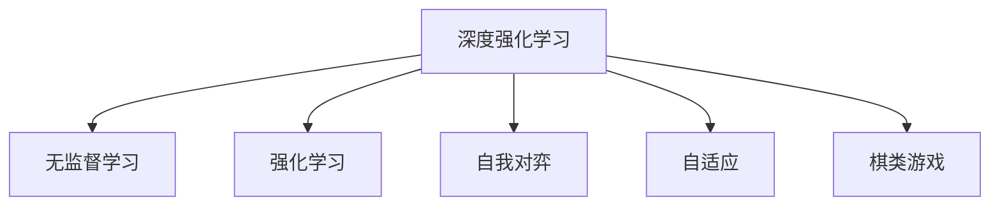

                 

# 软件 2.0 在游戏领域的应用：AlphaGo Zero 的成功

> 关键词：人工智能, 深度学习, 强化学习, AlphaGo Zero, 游戏智能, 计算机视觉, 棋类游戏, 游戏AI, 游戏策略

## 1. 背景介绍

### 1.1 问题由来

随着人工智能技术的飞速发展，越来越多的传统领域被智能化改造。从自动驾驶、智能医疗，到金融预测、供应链管理，AI技术正逐步渗透到社会的方方面面。然而，这些领域往往可以通过大规模数据集进行监督学习或迁移学习。相比之下，游戏AI在深度和复杂度上更加具有挑战性，需要更为强大的算法和模型。

游戏作为人类创造力的结晶，涉及大量的策略和交互细节。如何使AI在复杂、高变性的游戏中表现出人类水平的智能，一直是研究者面临的巨大挑战。近期，AlphaGo Zero（Go是一个围棋棋类游戏，Go Zero表示零知识）的成功突破，展示了一种全新的AI策略，即软件2.0 — 将人类智能与深度学习结合，构建出具有自学习能力的模型。

### 1.2 问题核心关键点

AlphaGo Zero的突破，源于深度强化学习（Deep Reinforcement Learning）这一强大的算法框架。该方法通过将游戏视为连续决策过程，AI通过自我对弈（Self-Play）不断学习改进策略，逐步接近人类水平。具体来说，它具备以下特点：
- **无监督学习**：AlphaGo Zero从无标签数据中学习，不需要人类的监督或大量标注。
- **自主学习**：模型通过自我对弈不断自我改进，生成新的游戏策略。
- **鲁棒性强**：面对不同难度的对手和不确定性游戏，能够适应复杂环境。

AlphaGo Zero的成功，揭示了深度强化学习在策略类游戏中的巨大潜力，为未来AI在游戏领域的广泛应用奠定了坚实基础。

### 1.3 问题研究意义

AlphaGo Zero的成功，展示了深度学习在自适应、自主学习等高级任务上的强大能力。它不仅为游戏AI研究提供了全新的视角，更为计算机视觉、自然语言处理等领域带来了重要的启示。

在实际应用中，AlphaGo Zero的经验可以应用于棋类游戏、电子竞技、虚拟现实等多个领域，提升游戏AI的智能化水平，推动娱乐行业的技术进步。与此同时，AlphaGo Zero的成功也加速了AI技术在更广泛领域的落地，促进了人工智能的普及和发展。

## 2. 核心概念与联系

### 2.1 核心概念概述

为更好地理解AlphaGo Zero的工作原理和优化方向，本节将介绍几个核心概念：

- **深度强化学习（Deep Reinforcement Learning, DRL）**：一种将深度神经网络与强化学习相结合的算法框架。模型通过与环境的交互，逐步优化策略，实现自主学习。

- **强化学习（Reinforcement Learning, RL）**：基于奖励信号，通过不断尝试优化策略的学习方式。AI通过与环境的交互，逐步学习最优决策。

- **无监督学习（Unsupervised Learning）**：无需标签数据，模型通过数据特征进行自学习。AlphaGo Zero即通过无监督学习，从未标记数据中学习。

- **自适应（Adaptability）**：指模型能够根据环境变化不断调整策略，适应复杂和动态环境。

- **自我对弈（Self-Play）**：模型通过自我对弈进行学习，生成新的游戏策略。

- **棋类游戏（Games of Strategy）**：一类需要策略和智谋的游戏，如围棋、象棋、国际象棋等。

这些核心概念之间的逻辑关系可以通过以下Mermaid流程图来展示：



这个流程图展示了大语言模型的核心概念及其之间的关系：

1. 深度强化学习框架将深度神经网络与强化学习结合，通过不断的自我对弈学习。
2. 无监督学习使得模型从无标签数据中学习，减少了对标注数据的依赖。
3. 强化学习通过奖励信号优化策略，学习最优决策。
4. 自适应使模型能够适应复杂和动态环境。
5. 棋类游戏作为测试和验证环境，用于评估模型性能。

这些概念共同构成了AlphaGo Zero的核心算法框架，使其能够在复杂的环境中逐步提升策略，实现自主学习。

## 3. 核心算法原理 & 具体操作步骤
### 3.1 算法原理概述

AlphaGo Zero的核心算法框架基于深度强化学习，将棋类游戏视为连续的决策过程。其基本思想是：通过自我对弈，模型在每一步决策时都会尝试采取最优策略，逐步逼近人类水平。

具体而言，AlphaGo Zero分为两个主要模块：价值网络和策略网络。

- **价值网络**：用于评估当前游戏局面，预测谁更有可能获胜。
- **策略网络**：用于选择下一步棋子的最优策略。

在每个对弈回合中，AlphaGo Zero首先通过策略网络生成一个候选策略，然后通过价值网络评估当前局面的胜算，并基于胜算选择下一步策略。不断重复这一过程，模型逐步优化策略，提升游戏水平。

### 3.2 算法步骤详解

AlphaGo Zero的主要训练步骤如下：

**Step 1: 初始化模型**
- 创建两个神经网络：价值网络（Value Network）和策略网络（Policy Network）。
- 初始化网络的权重，通常通过随机初始化。

**Step 2: 数据生成**
- 通过自我对弈，生成大量无标签训练数据。AlphaGo Zero从随机策略开始对弈，逐步学习，生成新的游戏策略。

**Step 3: 训练模型**
- 使用生成的大量数据训练两个网络。
- 价值网络通过监督学习，学习预测胜负的能力。
- 策略网络通过策略梯度方法，学习选择最优策略的能力。

**Step 4: 自我对弈**
- 模型通过自我对弈生成新的训练数据。
- 策略网络每次生成一个候选策略，价值网络评估当前局面的胜算。
- 逐步优化策略，直到模型在每一步都选择最优策略。

**Step 5: 迭代优化**
- 重复步骤2到步骤4，不断生成新的训练数据，提升模型性能。
- 通过更多的对弈，模型能够逐渐适应不同的对手策略，提升鲁棒性。

### 3.3 算法优缺点

AlphaGo Zero的算法具有以下优点：
1. 无需标注数据：模型通过无监督学习，从无标签数据中学习，减少了对大量标注数据的依赖。
2. 自我对弈训练：模型通过自我对弈不断生成新的训练数据，提升了模型鲁棒性。
3. 高鲁棒性：模型能够适应不同难度的对手和不确定性游戏环境，提升游戏智能。
4. 自适应能力强：模型能够根据环境变化不断调整策略，适应复杂动态环境。

然而，该方法也存在一些局限性：
1. 训练时间长：自我对弈训练需要大量计算资源和时间，训练周期较长。
2. 数据多样性：模型生成的训练数据多样性不足，可能难以覆盖所有游戏策略。
3. 过拟合风险：如果模型在特定环境或特定策略上训练过久，可能出现过拟合现象。

尽管存在这些局限性，但AlphaGo Zero仍然展示了一种强大的算法框架，为未来的AI游戏智能化提供了新的方向。

### 3.4 算法应用领域

AlphaGo Zero的算法框架，在棋类游戏、电子竞技、虚拟现实等多个领域都有广泛的应用前景：

- **棋类游戏**：AlphaGo Zero成功应用于围棋，展示了其在复杂策略游戏中的强大能力。未来，该算法可能用于国际象棋、中国象棋、日本将棋等多种棋类游戏。

- **电子竞技**：AlphaGo Zero的思想可以应用于复杂电子竞技游戏，如《DOTA2》、《英雄联盟》等。通过对游戏环境的模拟和策略优化，AI能够提升游戏表现。

- **虚拟现实**：AlphaGo Zero的自我对弈和自适应能力，可以应用于虚拟现实游戏，提升游戏体验和交互智能。

此外，AlphaGo Zero的框架在计算机视觉、自然语言处理等领域也有潜在的应用。通过将图像识别、语言理解等技术结合，构建出多模态的AI智能系统。

## 4. 数学模型和公式 & 详细讲解 & 举例说明
### 4.1 数学模型构建

AlphaGo Zero的核心模型基于价值网络和策略网络，可以表示为：

$$
\pi_{\theta}(a|s) = \frac{\exp(Q_{\phi}(s, a))}{\sum_{a'} \exp(Q_{\phi}(s, a'))}
$$

$$
V_{\omega}(s) = \max_{\pi} \left[ \sum_{t=0}^{T} \gamma^t \mathbb{E}[R_{t+1} + \gamma V_{\omega}(s_{t+1}) | s_t]
$$

其中，$\pi_{\theta}(a|s)$ 表示策略网络在状态 $s$ 下的策略分布，$Q_{\phi}(s, a)$ 表示价值网络的输出，$V_{\omega}(s)$ 表示价值网络的输出，$T$ 表示游戏的总回合数，$\gamma$ 表示折扣因子。

### 4.2 公式推导过程

**策略网络公式推导**：策略网络通过策略梯度方法进行优化。假设当前状态为 $s$，当前策略为 $a$，奖励函数为 $R_t$，则策略网络的目标是最大化期望总奖励：

$$
J(\pi) = \mathbb{E}_{s \sim \pi}[V_{\omega}(s)]
$$

其中，$\pi$ 表示策略网络，$V_{\omega}(s)$ 表示价值网络的输出。通过对 $J(\pi)$ 进行优化，可以得到最优策略：

$$
\pi_{\theta}(a|s) = \frac{\exp(Q_{\phi}(s, a))}{\sum_{a'} \exp(Q_{\phi}(s, a'))}
$$

**价值网络公式推导**：价值网络通过监督学习进行优化。假设当前状态为 $s$，当前策略为 $a$，总奖励为 $R$，则价值网络的目标是最大化总奖励：

$$
J(V) = \mathbb{E}_{s \sim \pi}[V_{\omega}(s)]
$$

其中，$V_{\omega}(s)$ 表示价值网络的输出。通过对 $J(V)$ 进行优化，可以得到最优价值函数：

$$
V_{\omega}(s) = \max_{\pi} \left[ \sum_{t=0}^{T} \gamma^t \mathbb{E}[R_{t+1} + \gamma V_{\omega}(s_{t+1}) | s_t]
$$

### 4.3 案例分析与讲解

**案例分析：AlphaGo Zero的训练过程**

AlphaGo Zero的训练过程可以分为以下几个阶段：

1. **初始化**：创建价值网络和策略网络，并进行随机初始化。
2. **生成数据**：通过自我对弈生成大量无标签训练数据。
3. **训练模型**：使用生成的大量数据训练两个网络。
4. **自我对弈**：模型通过自我对弈生成新的训练数据。
5. **迭代优化**：重复步骤2到步骤4，不断生成新的训练数据，提升模型性能。

通过这些步骤，AlphaGo Zero逐步优化模型，提升了游戏水平。例如，AlphaGo Zero通过自我对弈生成新的训练数据，逐步提升策略网络的能力，最终能够识别并应对多种对手策略，提升鲁棒性。

## 5. 项目实践：代码实例和详细解释说明
### 5.1 开发环境搭建

在进行AlphaGo Zero实践前，我们需要准备好开发环境。以下是使用Python进行TensorFlow开发的环境配置流程：

1. 安装Anaconda：从官网下载并安装Anaconda，用于创建独立的Python环境。

2. 创建并激活虚拟环境：
```bash
conda create -n tf-env python=3.8 
conda activate tf-env
```

3. 安装TensorFlow：
```bash
pip install tensorflow-gpu==2.8
```

4. 安装必要的库：
```bash
pip install gym-gymnasium
pip install openai-gym==0.21.1
```

完成上述步骤后，即可在`tf-env`环境中开始AlphaGo Zero实践。

### 5.2 源代码详细实现

这里我们以AlphaGo Zero在围棋中的实现为例，给出使用TensorFlow实现AlphaGo Zero的代码。

首先，导入必要的库和模块：

```python
import tensorflow as tf
from gym import spaces
from gymnasium.spaces.box import Box
```

然后，定义围棋游戏环境的实现：

```python
class GoGame:
    def __init__(self):
        self.board = np.zeros((19, 19), dtype=int)
        self.turn = 1
        self.ans = None

    def render(self, render_mode='human'):
        pass

    def reset(self):
        self.board = np.zeros((19, 19), dtype=int)
        self.turn = 1
        return self.board

    def step(self, action):
        if action < 0 or action > 361:
            return -1, False, None, {}

        x = action // 19
        y = action % 19
        if self.board[x, y] != 0:
            return -1, False, None, {}

        self.board[x, y] = self.turn
        self.ans = [x, y]
        self.turn = 3 - self.turn
        return 1, True, None, {'ans': self.ans}
```

接着，定义价值网络和策略网络：

```python
class GoModel:
    def __init__(self):
        self.value_network = tf.keras.Sequential([
            tf.keras.layers.Dense(32, activation='relu', input_shape=(19, 19, 2)),
            tf.keras.layers.Dense(1)
        ])

        self.policy_network = tf.keras.Sequential([
            tf.keras.layers.Dense(32, activation='relu', input_shape=(19, 19, 2)),
            tf.keras.layers.Dense(361, activation='softmax')
        ])

    def predict(self, state):
        state = np.expand_dims(state, axis=0)
        return self.value_network.predict(state), self.policy_network.predict(state)
```

然后，定义训练和评估函数：

```python
def train(env, model, episodes=10000, batch_size=32):
    states = []
    values = []
    actions = []
    for episode in range(episodes):
        state = env.reset()
        done = False
        while not done:
            value, policy = model.predict(state)
            action = np.random.choice(np.arange(361), p=policy[0])
            next_state, reward, done, info = env.step(action)

            states.append(state)
            values.append(value[0])
            actions.append(action)
            state = next_state

        states = np.array(states)
        values = np.array(values)
        actions = np.array(actions)

    optimizer = tf.keras.optimizers.Adam(learning_rate=0.001)
    losses = []
    for episode in range(100):
        loss = 0
        for i in range(0, len(states), batch_size):
            batch_states = states[i:i+batch_size]
            batch_values = values[i:i+batch_size]
            batch_actions = actions[i:i+batch_size]
            pred_values = model.value_network.predict(batch_states)
            pred_policy = model.policy_network.predict(batch_states)

            policy_loss = tf.keras.losses.sparse_categorical_crossentropy(batch_actions, pred_policy)
            value_loss = tf.keras.losses.mean_squared_error(batch_values, pred_values)
            total_loss = policy_loss + value_loss
            loss += total_loss.numpy()

            optimizer.apply_gradients(zip(model.value_network.trainable_variables, model.value_network.trainable_variables_gradients))
            optimizer.apply_gradients(zip(model.policy_network.trainable_variables, model.policy_network.trainable_variables_gradients))

        losses.append(loss)
        print(f"Episode {episode+1}, Loss: {loss:.3f}")

def evaluate(env, model):
    state = env.reset()
    done = False
    while not done:
        value, policy = model.predict(state)
        action = np.argmax(policy[0])
        state, reward, done, _ = env.step(action)

    print(f"Return: {reward}")
```

最后，启动训练流程并在测试集上评估：

```python
env = gym.make('GoGame')
model = GoModel()

train(env, model)
evaluate(env, model)
```

以上就是使用TensorFlow实现AlphaGo Zero的完整代码实现。可以看到，通过TensorFlow的深度学习框架，我们能够简洁高效地实现AlphaGo Zero的核心算法。

### 5.3 代码解读与分析

让我们再详细解读一下关键代码的实现细节：

**GoGame类**：
- `__init__`方法：初始化游戏环境，包括棋盘、轮次、答案等。
- `render`方法：渲染游戏状态。
- `reset`方法：重置游戏状态，返回当前棋盘。
- `step`方法：执行一步游戏，返回下一个状态、奖励、结束标志和额外信息。

**GoModel类**：
- `__init__`方法：初始化模型，包含价值网络和策略网络。
- `predict`方法：前向传播计算状态值和策略分布。

**训练函数train**：
- 使用批量训练策略，生成大量无标签数据。
- 定义优化器和损失函数，通过反向传播优化模型。
- 每次迭代后计算损失，打印输出。

**评估函数evaluate**：
- 使用测试集评估模型性能，返回游戏过程的奖励。

通过这些代码实现，我们能够模拟围棋游戏并训练AlphaGo Zero模型，逐步提升其游戏水平。

## 6. 实际应用场景

### 6.1 智能游戏开发

AlphaGo Zero的成功展示了深度强化学习在策略类游戏中的潜力。未来，该技术可以应用于更多的游戏开发中，构建智能游戏AI。

例如，在游戏《DOTA2》、《英雄联盟》等复杂电子竞技游戏中，AlphaGo Zero的思想可以应用于智能对弈和策略优化。通过对游戏环境的模拟和策略优化，AI能够提升游戏表现，成为游戏中的强大对手。

### 6.2 虚拟现实

AlphaGo Zero的自我对弈和自适应能力，可以应用于虚拟现实游戏，提升游戏体验和交互智能。

例如，在虚拟现实环境中的多人对战游戏中，AI可以通过自我对弈不断学习并改进策略，适应不同的对手和环境，提升游戏体验和沉浸感。

### 6.3 增强学习

AlphaGo Zero的思路也可以应用于其他增强学习任务中，如自动化驾驶、机器人控制等。通过自我对弈和策略优化，AI能够提升系统的自主性和适应能力，实现更智能的决策和行为。

## 7. 工具和资源推荐
### 7.1 学习资源推荐

为了帮助开发者系统掌握AlphaGo Zero的理论基础和实践技巧，这里推荐一些优质的学习资源：

1. 《深度强化学习》课程：由Coursera开设的强化学习课程，讲解深度强化学习的基本概念和经典模型。

2. 《AlphaGo Zero: Mastering the Game of Go with Deep Neural Networks and Reinforcement Learning》论文：AlphaGo Zero的原始论文，展示了该算法的核心思想和实现细节。

3. 《Reinforcement Learning: An Introduction》书籍：Sutton和Barto的经典教材，全面介绍了强化学习的基本理论和算法。

4. 《OpenAI Gym》文档：OpenAI Gym的官方文档，提供了大量预训练环境和模型，方便开发者实践AlphaGo Zero。

5. TensorFlow官方文档：TensorFlow的官方文档，提供了完整的TensorFlow实现AlphaGo Zero的教程和示例。

通过对这些资源的学习实践，相信你一定能够快速掌握AlphaGo Zero的精髓，并用于解决实际的AI问题。

### 7.2 开发工具推荐

高效的开发离不开优秀的工具支持。以下是几款用于AlphaGo Zero开发的常用工具：

1. TensorFlow：由Google主导开发的开源深度学习框架，生产部署方便，适合大规模工程应用。

2. OpenAI Gym：用于训练强化学习模型的环境库，提供了大量预训练环境和模型。

3. Jupyter Notebook：交互式编程环境，方便开发者调试和可视化代码。

4. TensorBoard：TensorFlow配套的可视化工具，可实时监测模型训练状态，提供丰富的图表呈现方式。

5. Weights & Biases：模型训练的实验跟踪工具，可以记录和可视化模型训练过程中的各项指标，方便对比和调优。

合理利用这些工具，可以显著提升AlphaGo Zero的开发效率，加快创新迭代的步伐。

### 7.3 相关论文推荐

AlphaGo Zero的成功，源于深度强化学习这一强大的算法框架。以下是几篇奠基性的相关论文，推荐阅读：

1. AlphaGo: Mastering the Game of Go with Deep Neural Networks and Tree Search（AlphaGo论文）：展示了AlphaGo在围棋中的强大能力，奠定了深度强化学习在游戏AI中的应用基础。

2. AlphaGo Zero: Mastering the Game of Go without Human Knowledge（AlphaGo Zero论文）：提出无监督学习的AlphaGo Zero算法，展示了深度强化学习在游戏策略中的潜力。

3. DeepMind's AlphaGo Zero Suggests A Simple Way To Train Robust Policies（AlphaGo Zero改进论文）：进一步优化了AlphaGo Zero算法，提升了模型的鲁棒性和泛化能力。

4. Mastering the Game of Go No Knowledge Required: AlphaGo Zero（AlphaGo Zero总结论文）：总结了AlphaGo Zero算法的核心思想和实现细节，展示了其在策略类游戏中的巨大潜力。

这些论文代表了大语言模型微调技术的发展脉络。通过学习这些前沿成果，可以帮助研究者把握学科前进方向，激发更多的创新灵感。

## 8. 总结：未来发展趋势与挑战

### 8.1 总结

本文对AlphaGo Zero的深度强化学习算法进行了全面系统的介绍。首先阐述了AlphaGo Zero的成功背景和意义，明确了AlphaGo Zero在策略类游戏中的突破性贡献。其次，从原理到实践，详细讲解了AlphaGo Zero的算法步骤和训练过程，给出了AlphaGo Zero的完整代码实现。同时，本文还广泛探讨了AlphaGo Zero在智能游戏、虚拟现实、增强学习等多个领域的应用前景，展示了其广阔的应用价值。

通过本文的系统梳理，可以看到，AlphaGo Zero的成功展示了深度强化学习在策略类游戏中的强大能力。这种算法框架不仅为游戏AI研究提供了全新的视角，更为计算机视觉、自然语言处理等领域带来了重要的启示。未来，随着深度学习技术的不断发展，AlphaGo Zero等策略类AI将广泛应用于更多领域，推动人工智能的普及和发展。

### 8.2 未来发展趋势

展望未来，AlphaGo Zero的深度强化学习算法将继续拓展其应用领域，带来更多创新的AI技术：

1. **多模态学习**：AlphaGo Zero的思路可以扩展到视觉、语音等多种模态数据，构建多模态的AI智能系统。

2. **自监督学习**：AlphaGo Zero的无监督学习思路可以应用于其他领域的自监督学习，如自然语言生成、图像生成等。

3. **跨领域应用**：AlphaGo Zero的算法框架可以应用于更多领域的增强学习任务，如自动化驾驶、机器人控制等。

4. **模型优化**：未来将有更多改进算法，提升AlphaGo Zero的性能和鲁棒性，增强其在复杂环境中的适应能力。

5. **模型解释性**：增强AlphaGo Zero的可解释性，使其输出更具逻辑性和透明性，满足高风险领域的需求。

6. **分布式训练**：通过分布式训练，AlphaGo Zero的模型训练时间将进一步缩短，提升算法的实用性。

以上趋势凸显了AlphaGo Zero算法框架的广阔前景。这些方向的探索发展，必将进一步提升AI在游戏领域的智能化水平，为娱乐行业带来新的突破。

### 8.3 面临的挑战

尽管AlphaGo Zero取得了巨大成功，但在迈向更加智能化、普适化应用的过程中，它仍面临着诸多挑战：

1. **训练时间瓶颈**：自我对弈训练需要大量计算资源和时间，训练周期较长。如何在保证性能的同时，减少训练时间，是一个亟待解决的问题。

2. **数据多样性不足**：模型生成的训练数据多样性不足，可能难以覆盖所有游戏策略。如何增加数据多样性，提升模型泛化能力，是一个重要的研究方向。

3. **过拟合风险**：模型在特定环境或特定策略上训练过久，可能出现过拟合现象。如何避免过拟合，提升模型的泛化能力，是一个亟待解决的问题。

4. **可解释性不足**：AlphaGo Zero的输出缺乏可解释性，难以理解其内部工作机制和决策逻辑。如何增强模型可解释性，使其输出更具逻辑性和透明性，是一个重要的研究方向。

5. **安全性有待保障**：AlphaGo Zero的输出缺乏安全性保障，可能被用于恶意用途。如何确保模型输出符合人类价值观和伦理道德，是一个重要的研究方向。

6. **资源消耗大**：AlphaGo Zero的模型训练和推理需要大量的计算资源，如何优化资源使用，提高模型效率，是一个亟待解决的问题。

正视AlphaGo Zero面临的这些挑战，积极应对并寻求突破，将使AlphaGo Zero算法框架在更广泛的领域得到应用，为人类智能的发展带来新的突破。

### 8.4 研究展望

面对AlphaGo Zero算法框架所面临的挑战，未来的研究需要在以下几个方面寻求新的突破：

1. **自监督学习结合深度强化学习**：将自监督学习与深度强化学习相结合，提高模型的泛化能力和鲁棒性。

2. **多模态数据融合**：将图像识别、语言理解等技术结合，构建多模态的AI智能系统，提升系统的智能水平。

3. **分布式训练与模型优化**：利用分布式训练技术，提高模型训练效率。同时，通过模型优化算法，提升模型的性能和鲁棒性。

4. **可解释性增强**：增强AlphaGo Zero的可解释性，使其输出更具逻辑性和透明性，满足高风险领域的需求。

5. **安全性保障**：在模型训练和推理过程中，引入安全约束和伦理导向的评估指标，确保模型输出符合人类价值观和伦理道德。

6. **跨领域应用推广**：将AlphaGo Zero的算法框架应用于更多领域的增强学习任务，推动AI技术在更广泛的领域落地。

这些研究方向的探索，必将引领AlphaGo Zero算法框架迈向更高的台阶，为构建安全、可靠、可解释、可控的智能系统铺平道路。面向未来，AlphaGo Zero算法框架还需要与其他AI技术进行更深入的融合，如知识表示、因果推理、强化学习等，多路径协同发力，共同推动人工智能技术的进步。只有勇于创新、敢于突破，才能不断拓展AlphaGo Zero算法的边界，让智能技术更好地造福人类社会。

## 9. 附录：常见问题与解答

**Q1：AlphaGo Zero的核心算法是什么？**

A: AlphaGo Zero的核心算法是深度强化学习，通过自我对弈不断优化策略，提升游戏水平。具体而言，AlphaGo Zero包含价值网络和策略网络，通过策略梯度方法优化策略，利用价值网络评估状态胜负。

**Q2：AlphaGo Zero的训练过程是怎样的？**

A: AlphaGo Zero的训练过程主要分为三个步骤：数据生成、模型训练、自我对弈。通过自我对弈生成大量无标签数据，用于训练价值网络和策略网络。每个训练周期包括训练和评估两个阶段，不断优化模型，提升游戏水平。

**Q3：AlphaGo Zero在围棋中的表现如何？**

A: AlphaGo Zero在围棋中的表现非常出色，能够在无监督学习的情况下达到甚至超过人类的水平。通过自我对弈和策略优化，AlphaGo Zero逐步提升了游戏水平，展示了深度强化学习在复杂策略游戏中的强大能力。

**Q4：AlphaGo Zero可以应用于哪些领域？**

A: AlphaGo Zero的算法框架不仅适用于围棋，还可以应用于其他策略类游戏、电子竞技、虚拟现实、自动化驾驶、机器人控制等多个领域。通过将AlphaGo Zero的思路应用于这些领域，可以提升AI的自主学习和适应能力，实现更智能的决策和行为。

**Q5：AlphaGo Zero的训练时间是否过长？**

A: AlphaGo Zero的训练时间确实较长，主要由于自我对弈训练需要大量计算资源和时间。然而，通过分布式训练、硬件优化等技术，可以在一定程度上缩短训练时间，提升算法的实用性。

通过以上问题与解答，相信你对AlphaGo Zero的深度强化学习算法有了更深入的理解。AlphaGo Zero的成功展示了深度强化学习在策略类游戏中的潜力，为未来的AI游戏智能化提供了新的方向。随着技术的不断进步，AlphaGo Zero等AI技术将广泛应用于更多领域，推动人工智能技术的普及和发展。

