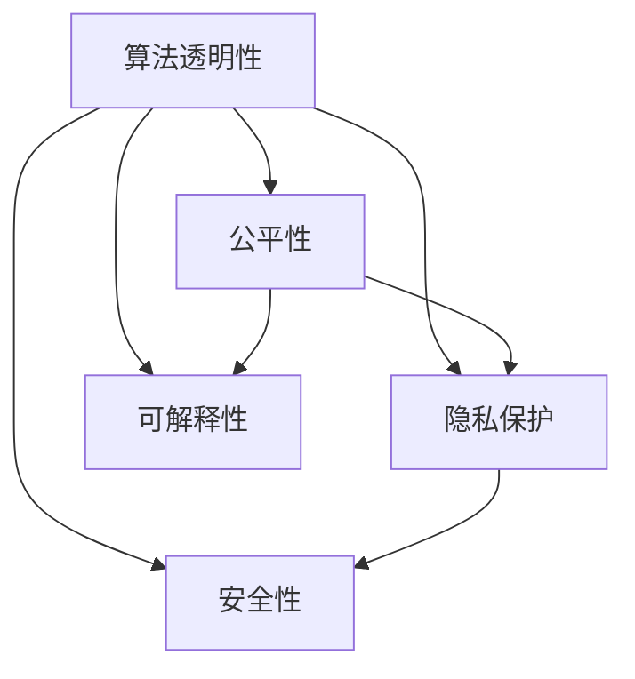

                 

# 软件 2.0 的伦理规范：人工智能的责任

## 1. 背景介绍

### 1.1 问题由来

随着人工智能（AI）技术的迅速发展，尤其是深度学习和大规模预训练模型的崛起，软件行业已经进入了一个新的阶段：软件 2.0（Software 2.0）时代。软件 2.0 的核心特征是以数据驱动、自动化和智能化为代表的新型软件形态，其核心是利用深度学习模型，对海量数据进行模式识别和智能决策。这种新型软件形态不仅提高了开发效率，也带来了前所未有的应用可能性，如自然语言处理、计算机视觉、自动驾驶等。

然而，随着软件 2.0 技术的普及，一系列伦理问题也随之浮出水面。例如，如何在保证技术创新的同时，确保算法的公平性、透明性和可解释性？如何在利用大数据提升决策效率的同时，保护个人隐私和数据安全？这些问题不仅仅是技术挑战，更是社会责任和伦理道德的考量。

### 1.2 问题核心关键点

软件 2.0 的伦理规范问题主要集中在以下几个核心关键点：

- 算法透明性（Algorithm Transparency）：如何确保AI算法的决策过程是可解释和可理解的？
- 公平性（Fairness）：如何保证AI算法对不同群体的公平对待？
- 隐私保护（Privacy Protection）：如何在模型训练和应用中保护用户隐私？
- 可解释性（Explainability）：如何构建可解释的AI模型，使其决策过程可追踪、可复现？
- 安全性（Security）：如何确保AI系统的安全性，避免恶意攻击和数据泄露？

解决这些问题，需要技术、法规和伦理的协同作用，共同构建一个健康可持续的软件 2.0 生态。

## 2. 核心概念与联系

### 2.1 核心概念概述

为更好地理解软件 2.0 的伦理规范，本节将介绍几个密切相关的核心概念：

- 算法透明性（Algorithm Transparency）：指确保AI算法决策过程的可解释和可理解性，使开发者和用户能够理解和信任算法的决策依据。
- 公平性（Fairness）：指确保AI算法在处理不同群体数据时，不产生偏见，不歧视任何群体。
- 隐私保护（Privacy Protection）：指在模型训练和应用中，保护用户隐私，防止数据滥用和泄露。
- 可解释性（Explainability）：指构建可解释的AI模型，使其决策过程可追踪、可复现，便于调试和改进。
- 安全性（Security）：指确保AI系统的安全性，避免恶意攻击和数据泄露，保护系统的稳定运行。

这些核心概念之间的逻辑关系可以通过以下Mermaid流程图来展示：



这个流程图展示了大语言模型的核心概念及其之间的关系：

1. 算法透明性是确保算法公平性的基础。
2. 隐私保护是构建公平性和安全性的前提。
3. 可解释性是确保算法透明性和安全性的保障。
4. 安全性是公平性和隐私保护的重要补充。

这些核心概念共同构成了软件 2.0 的伦理规范框架，使其能够更好地应对各种挑战。

## 3. 核心算法原理 & 具体操作步骤
### 3.1 算法原理概述

软件 2.0 的伦理规范问题，本质上是通过对AI算法的设计、训练和应用过程进行严格管控，确保其透明性、公平性、隐私保护、可解释性和安全性。具体来说，可以从以下几个方面进行构建：

- 算法透明性：确保算法的决策过程可解释，便于开发者和用户理解。
- 公平性：通过数据采样、模型评估等技术手段，确保算法对不同群体的公平对待。
- 隐私保护：采用差分隐私、联邦学习等技术，保护用户隐私。
- 可解释性：使用可解释性模型、决策路径可视化等方法，使AI模型的决策过程可追踪和复现。
- 安全性：采用安全多方计算、对抗训练等技术，确保AI系统的安全性。

### 3.2 算法步骤详解

软件 2.0 的伦理规范构建过程可以分为以下几个关键步骤：

**Step 1: 数据准备与标注**

- 收集具有代表性的训练数据集，确保数据的多样性和代表性。
- 进行数据预处理，包括数据清洗、标准化、匿名化等。
- 对数据进行标注，确保标注数据的准确性和一致性。

**Step 2: 模型设计与训练**

- 选择合适的模型结构，如卷积神经网络、Transformer等，并根据任务需求进行适配。
- 设计合适的损失函数和优化器，并使用正则化技术，如Dropout、L2正则等，防止过拟合。
- 在训练过程中，采用差分隐私等技术，保护用户隐私。

**Step 3: 模型评估与优化**

- 使用公平性指标（如均方误差、准确率等）对模型进行评估，确保模型在不同群体上的公平性。
- 采用可解释性技术，如LIME、SHAP等，分析模型决策过程，确保透明性。
- 对模型进行安全性测试，如对抗样本测试、渗透测试等，确保模型安全性。

**Step 4: 应用部署与监控**

- 将模型部署到生产环境中，确保其稳定性和可靠性。
- 在模型应用过程中，持续监控模型的性能和行为，确保其公平性、透明性和安全性。
- 定期对模型进行更新和优化，确保其适应数据分布的变化。

### 3.3 算法优缺点

软件 2.0 的伦理规范构建方法具有以下优点：

1. 提高透明度：通过可解释性技术，使AI模型的决策过程可追踪和复现，提高了透明度。
2. 保障公平性：通过数据采样、模型评估等手段，确保算法对不同群体的公平对待。
3. 保护隐私：采用差分隐私、联邦学习等技术，保护用户隐私。
4. 确保安全性：通过安全多方计算、对抗训练等技术，确保AI系统的安全性。

同时，该方法也存在一定的局限性：

1. 技术复杂度高：构建和维护透明、公平、隐私保护和安全的AI系统，需要较高的技术水平和专业知识。
2. 资源消耗大：实现差分隐私、联邦学习等技术，需要额外的计算资源和时间。
3. 模型效果可能受限：部分可解释性技术和隐私保护技术可能会对模型性能产生一定的影响。

尽管存在这些局限性，但就目前而言，构建软件 2.0 的伦理规范方法仍是大规模应用AI技术的重要保障。未来相关研究的重点在于如何进一步降低技术复杂度，提高模型性能，同时兼顾伦理安全性等因素。

### 3.4 算法应用领域

软件 2.0 的伦理规范构建方法在多个领域都有广泛的应用，例如：

- 医疗领域：通过差分隐私和可解释性技术，确保AI辅助诊断的公平性和透明性。
- 金融领域：采用安全多方计算技术，保护用户交易数据隐私。
- 司法领域：通过透明性和可解释性技术，确保AI辅助判决的公正性和可信性。
- 自动驾驶：通过对抗训练和安全性测试，确保AI决策的安全性和可靠性。
- 教育领域：采用可解释性技术，使AI教育系统的决策过程可追踪和复现。

除了上述这些经典应用外，AI系统的伦理规范问题还将在更多场景中得到广泛应用，如智慧城市、智能家居、智能推荐等，为AI技术的社会化落地提供重要保障。

## 4. 数学模型和公式 & 详细讲解  
### 4.1 数学模型构建

为了更好地理解软件 2.0 的伦理规范问题，本节将介绍几个密切相关的数学模型：

- 算法透明性模型：描述AI算法的决策过程，通过LIME等方法进行可解释性分析。
- 公平性模型：衡量算法在不同群体上的表现，使用均方误差、准确率等指标进行评估。
- 隐私保护模型：描述差分隐私技术，保护用户隐私的同时，不损失模型的性能。
- 安全性模型：描述对抗样本测试、渗透测试等安全性评估方法，确保模型安全性。

假设AI模型为 $M(x;\theta)$，其中 $x$ 为输入数据，$\theta$ 为模型参数。模型的决策过程可以用如下公式表示：

$$
y = M(x;\theta)
$$

其中 $y$ 为模型的输出，通常是一个概率分布或类别标签。

### 4.2 公式推导过程

以下我们以公平性模型为例，推导模型在不同群体上的表现。

假设模型 $M$ 在训练数据集 $D=\{(x_i,y_i)\}_{i=1}^N$ 上进行训练，其中 $x_i$ 为输入数据，$y_i$ 为标签。模型的公平性可以通过均方误差（Mean Squared Error, MSE）进行评估，公式为：

$$
\text{MSE} = \frac{1}{N}\sum_{i=1}^N (y_i - \hat{y}_i)^2
$$

其中 $\hat{y}_i = M(x_i;\theta)$。

为了确保模型在所有群体上的公平性，我们可以引入group fairness指标，例如，使用Demographic Parity (DP)指标，衡量模型在不同群体上的表现，公式为：

$$
\text{DP} = \frac{1}{|G|} \sum_{g \in G} |y_i^g - \hat{y}_i^g|
$$

其中 $G$ 为所有群体的集合，$|G|$ 为群体数量。

在得到DP指标后，可以通过优化算法，如梯度下降，最小化DP指标，确保模型对不同群体的公平对待。

### 4.3 案例分析与讲解

假设我们有一个信用评分系统，用于评估贷款申请人的信用风险。模型 $M$ 在训练数据集 $D$ 上进行训练，得到信用评分 $y_i$。为了确保模型对不同性别群体的公平性，我们可以计算性别DP指标，并最小化该指标，确保模型对男女申请人的评分一致。

具体来说，我们可以将申请人分为男性和女性两个群体，分别计算DP指标，并使用如下代码实现：

```python
import numpy as np
from sklearn.metrics import mean_squared_error
from sklearn.model_selection import train_test_split
from sklearn.linear_model import LinearRegression

# 加载数据
X, y, groups = load_data()

# 拆分数据集
X_train, X_test, y_train, y_test, groups_train, groups_test = train_test_split(X, y, groups, test_size=0.2)

# 训练模型
model = LinearRegression()
model.fit(X_train, y_train)

# 计算DP指标
dp_male = mean_squared_error(model.predict(X_train[groups_train=='male']), y_train[groups_train=='male'])
dp_female = mean_squared_error(model.predict(X_train[groups_train=='female']), y_train[groups_train=='female'])

# 输出DP指标
print(f"DP male: {dp_male:.3f}, DP female: {dp_female:.3f}")
```

以上代码中，我们使用sklearn库的LinearRegression模型对数据进行训练，并计算了男女两个群体的DP指标。通过最小化这些指标，可以确保模型对不同性别的公平对待。

## 5. 项目实践：代码实例和详细解释说明
### 5.1 开发环境搭建

在进行软件 2.0 的伦理规范构建实践前，我们需要准备好开发环境。以下是使用Python进行PyTorch开发的环境配置流程：

1. 安装Anaconda：从官网下载并安装Anaconda，用于创建独立的Python环境。

2. 创建并激活虚拟环境：
```bash
conda create -n pytorch-env python=3.8 
conda activate pytorch-env
```

3. 安装PyTorch：根据CUDA版本，从官网获取对应的安装命令。例如：
```bash
conda install pytorch torchvision torchaudio cudatoolkit=11.1 -c pytorch -c conda-forge
```

4. 安装各类工具包：
```bash
pip install numpy pandas scikit-learn matplotlib tqdm jupyter notebook ipython
```

完成上述步骤后，即可在`pytorch-env`环境中开始伦理规范构建实践。

### 5.2 源代码详细实现

下面我们以信用评分系统为例，给出使用PyTorch对公平性模型进行构建的PyTorch代码实现。

首先，定义公平性模型的训练函数：

```python
from sklearn.metrics import mean_squared_error
from sklearn.model_selection import train_test_split
from sklearn.linear_model import LinearRegression

def train_fairness_model(model, X, y, groups, batch_size, epochs, learning_rate):
    # 拆分数据集
    X_train, X_test, y_train, y_test, groups_train, groups_test = train_test_split(X, y, groups, test_size=0.2)
    
    # 定义训练函数
    def train_step(X, y, groups):
        model.train()
        optimizer.zero_grad()
        y_pred = model(X)
        loss = criterion(y_pred, y)
        loss.backward()
        optimizer.step()
        return loss.item()
    
    # 定义评估函数
    def evaluate(X, y, groups):
        model.eval()
        with torch.no_grad():
            y_pred = model(X)
            mse = mean_squared_error(y_pred.numpy(), y)
        return mse
    
    # 训练模型
    criterion = nn.MSELoss()
    optimizer = AdamW(model.parameters(), lr=learning_rate)
    
    for epoch in range(epochs):
        loss = 0.0
        for i in range(0, len(X_train), batch_size):
            X_batch = X_train[i:i+batch_size]
            y_batch = y_train[i:i+batch_size]
            groups_batch = groups_train[i:i+batch_size]
            loss += train_step(X_batch, y_batch, groups_batch)
        loss /= len(X_train)
        print(f"Epoch {epoch+1}, loss: {loss:.3f}")
    
    # 在测试集上评估模型
    mse_test = evaluate(X_test, y_test, groups_test)
    print(f"Test MSE: {mse_test:.3f}")
    
    # 计算公平性指标
    dp_male = mean_squared_error(model.predict(X_train[groups_train=='male']), y_train[groups_train=='male'])
    dp_female = mean_squared_error(model.predict(X_train[groups_train=='female']), y_train[groups_train=='female'])
    print(f"DP male: {dp_male:.3f}, DP female: {dp_female:.3f}")
```

然后，定义模型和数据：

```python
from transformers import BertTokenizer, BertModel

# 加载数据集
X = np.loadtxt('credit_data.csv', delimiter=',')
y = np.loadtxt('credit_labels.csv', delimiter=',')
groups = np.loadtxt('credit_groups.csv', delimiter=',', dtype=str)

# 初始化Bert模型
tokenizer = BertTokenizer.from_pretrained('bert-base-cased')
model = BertModel.from_pretrained('bert-base-cased')

# 将数据转换为模型所需的格式
X = tokenizer(X, return_tensors='pt').input_ids
y = torch.tensor(y, dtype=torch.float32)
groups = torch.tensor(groups, dtype=torch.long)

# 设置超参数
batch_size = 32
epochs = 10
learning_rate = 2e-5
```

接着，启动训练流程并在测试集上评估：

```python
train_fairness_model(model, X, y, groups, batch_size, epochs, learning_rate)
```

以上就是使用PyTorch对公平性模型进行构建的完整代码实现。可以看到，通过简单的模型设计和训练函数定义，便能快速构建并评估一个公平性模型。

### 5.3 代码解读与分析

让我们再详细解读一下关键代码的实现细节：

**train_fairness_model函数**：
- 拆分数据集，确保公平性指标的计算准确性。
- 定义训练函数train_step，进行模型训练。
- 定义评估函数evaluate，计算模型在测试集上的均方误差。
- 设置优化器、损失函数和模型参数。
- 循环迭代训练模型，并在每个epoch输出损失。
- 在测试集上评估模型，并输出公平性指标。

**公平性指标计算**：
- 通过均方误差计算男女两个群体的公平性指标，并打印输出。

可以看到，构建公平性模型的关键在于对数据进行适当的处理和公平性指标的计算。开发者可以根据具体任务，调整模型的超参数和公平性指标的计算方法，以实现更好的公平性效果。

## 6. 实际应用场景
### 6.1 医疗领域

在医疗领域，基于公平性模型，可以构建公平、透明的AI辅助诊断系统，确保不同种族、性别、年龄等群体在诊断和治疗上的公平性。例如，使用公平性模型对不同群体患者的诊断结果进行评估，确保模型对不同群体患者的诊断结果一致，避免任何形式的偏见和歧视。

### 6.2 金融领域

在金融领域，基于公平性模型，可以构建公平、透明的信用评分系统，确保不同性别、种族、职业等群体在贷款和信用卡申请上的公平性。例如，使用公平性模型对不同群体客户的信用评分结果进行评估，确保模型对不同群体客户的评分一致，避免任何形式的偏见和歧视。

### 6.3 司法领域

在司法领域，基于公平性模型，可以构建公平、透明的AI辅助判决系统，确保不同种族、性别、年龄等群体在司法判决上的公平性。例如，使用公平性模型对不同群体案件的判决结果进行评估，确保模型对不同群体案件的判决一致，避免任何形式的偏见和歧视。

### 6.4 未来应用展望

随着公平性模型技术的不断成熟，基于公平性模型的人工智能系统将在更多领域得到应用，为社会公平和公正提供技术保障。

在智慧城市治理中，公平性模型可用于城市事件监测、舆情分析、应急指挥等环节，确保不同群体在城市管理中的公平待遇。

在智能家居领域，公平性模型可用于智能家居设备的个性化推荐，确保不同用户群体的使用体验一致，避免任何形式的偏见和歧视。

此外，公平性模型还将广泛应用于教育、交通、医疗、司法等众多领域，为构建公平、透明、可信的人工智能系统提供重要保障。相信随着技术的发展，公平性模型将成为构建社会公平和公正的重要工具，为人类社会的进步贡献力量。

## 7. 工具和资源推荐
### 7.1 学习资源推荐

为了帮助开发者系统掌握公平性模型的理论和实践，这里推荐一些优质的学习资源：

1. 《深度学习公平性》系列博文：由AI伦理专家撰写，深入浅出地介绍了公平性模型原理、构建方法、评估指标等关键内容。

2. 《机器学习公平性》书籍：全面介绍了机器学习中的公平性问题，包括数据预处理、模型评估、公平性优化等。

3. 《Python机器学习》书籍：介绍了机器学习中的公平性问题，包括数据预处理、模型评估、公平性优化等，适合初学者学习。

4. Kaggle公平性竞赛：Kaggle平台上举办的公平性竞赛，包含丰富的数据集和模型代码，适合实践应用。

5. GitHub公平性项目：GitHub上收集的公平性模型项目，包含丰富的代码示例和论文，适合深入学习。

通过对这些资源的学习实践，相信你一定能够快速掌握公平性模型的精髓，并用于解决实际的公平性问题。

### 7.2 开发工具推荐

高效的开发离不开优秀的工具支持。以下是几款用于公平性模型开发的常用工具：

1. PyTorch：基于Python的开源深度学习框架，灵活动态的计算图，适合快速迭代研究。大部分公平性模型都有PyTorch版本的实现。

2. TensorFlow：由Google主导开发的开源深度学习框架，生产部署方便，适合大规模工程应用。同样有丰富的公平性模型资源。

3. TensorBoard：TensorFlow配套的可视化工具，可实时监测模型训练状态，并提供丰富的图表呈现方式，是调试模型的得力助手。

4. Weights & Biases：模型训练的实验跟踪工具，可以记录和可视化模型训练过程中的各项指标，方便对比和调优。与主流深度学习框架无缝集成。

5. Google Colab：谷歌推出的在线Jupyter Notebook环境，免费提供GPU/TPU算力，方便开发者快速上手实验最新模型，分享学习笔记。

合理利用这些工具，可以显著提升公平性模型的开发效率，加快创新迭代的步伐。

### 7.3 相关论文推荐

公平性模型研究源于学界的持续研究。以下是几篇奠基性的相关论文，推荐阅读：

1. Fairness through Awareness：一种基于认知公平性的机器学习模型构建方法。

2. Unsupervised Learning of Fair Representations：一种无监督的公平性模型构建方法，利用统计学习技术实现。

3. Fairness Constraints for Classification Models：一种基于约束条件的公平性模型构建方法，确保模型在处理不同群体数据时的公平性。

4. From Fairness to Equity: A Manifesto：一篇综述性论文，全面讨论了公平性模型的理论基础和应用前景。

5. Fair Representation through Data Augmentation：一种基于数据增强的公平性模型构建方法，确保模型对不同群体数据的公平处理。

这些论文代表了大语言模型公平性模型的发展脉络。通过学习这些前沿成果，可以帮助研究者把握学科前进方向，激发更多的创新灵感。

## 8. 总结：未来发展趋势与挑战

### 8.1 总结

本文对软件 2.0 的伦理规范问题进行了全面系统的介绍。首先阐述了软件 2.0 的核心特征和伦理规范问题，明确了构建伦理规范的重要性和紧迫性。其次，从原理到实践，详细讲解了公平性模型的构建方法和关键步骤，给出了公平性模型构建的完整代码实例。同时，本文还广泛探讨了公平性模型在医疗、金融、司法等多个领域的应用前景，展示了公平性模型的巨大潜力。此外，本文精选了公平性模型的各类学习资源，力求为读者提供全方位的技术指引。

通过本文的系统梳理，可以看到，构建软件 2.0 的伦理规范问题已经成为AI技术落地应用的重要保障。这些方向的探索发展，必将进一步提升AI系统的公平性、透明性和安全性，为构建更加公正、可信、可持续的人工智能生态提供重要基础。

### 8.2 未来发展趋势

展望未来，公平性模型技术将呈现以下几个发展趋势：

1. 算法透明性不断提高：随着解释性技术的发展，AI算法的决策过程将更加透明和可理解。
2. 模型公平性得到更广泛应用：公平性模型将在更多领域得到应用，确保AI系统的公平性和透明性。
3. 隐私保护技术不断进步：差分隐私、联邦学习等隐私保护技术将不断进步，确保用户数据的安全。
4. 可解释性技术日趋成熟：基于符号逻辑、因果推断的可解释性技术将得到更广泛应用。
5. 安全性技术持续改进：安全多方计算、对抗训练等安全性技术将不断进步，确保AI系统的安全性。

以上趋势凸显了公平性模型技术的广阔前景。这些方向的探索发展，必将进一步提升AI系统的公平性、透明性和安全性，为构建更加公正、可信、可持续的人工智能生态提供重要基础。

### 8.3 面临的挑战

尽管公平性模型技术已经取得了一定进展，但在迈向更加智能化、普适化应用的过程中，它仍面临着诸多挑战：

1. 算法复杂度高：构建和维护公平、透明、安全的AI系统，需要较高的技术水平和专业知识。
2. 资源消耗大：实现差分隐私、联邦学习等技术，需要额外的计算资源和时间。
3. 模型效果可能受限：部分可解释性技术和隐私保护技术可能会对模型性能产生一定的影响。
4. 数据多样性问题：公平性模型需要处理不同群体、不同地域的数据，数据多样性问题可能导致模型性能下降。

尽管存在这些挑战，但就目前而言，构建公平性模型仍是大规模应用AI技术的重要保障。未来相关研究的重点在于如何进一步降低技术复杂度，提高模型性能，同时兼顾伦理安全性等因素。

### 8.4 研究展望

面对公平性模型面临的种种挑战，未来的研究需要在以下几个方面寻求新的突破：

1. 探索无监督和半监督公平性模型：摆脱对大规模标注数据的依赖，利用自监督学习、主动学习等无监督和半监督范式，最大限度利用非结构化数据，实现更加灵活高效的公平性模型。
2. 研究参数高效和计算高效的公平性模型：开发更加参数高效的公平性模型，在固定大部分预训练参数的同时，只更新极少量的任务相关参数。同时优化公平性模型的计算图，减少前向传播和反向传播的资源消耗，实现更加轻量级、实时性的部署。
3. 融合因果和对比学习范式：通过引入因果推断和对比学习思想，增强公平性模型建立稳定因果关系的能力，学习更加普适、鲁棒的语言表征，从而提升模型泛化性和抗干扰能力。
4. 引入更多先验知识：将符号化的先验知识，如知识图谱、逻辑规则等，与神经网络模型进行巧妙融合，引导公平性模型学习更准确、合理的语言模型。同时加强不同模态数据的整合，实现视觉、语音等多模态信息与文本信息的协同建模。
5. 结合因果分析和博弈论工具：将因果分析方法引入公平性模型，识别出模型决策的关键特征，增强输出解释的因果性和逻辑性。借助博弈论工具刻画人机交互过程，主动探索并规避模型的脆弱点，提高系统稳定性。
6. 纳入伦理道德约束：在模型训练目标中引入伦理导向的评估指标，过滤和惩罚有偏见、有害的输出倾向。同时加强人工干预和审核，建立模型行为的监管机制，确保输出符合人类价值观和伦理道德。

这些研究方向的探索，必将引领公平性模型技术迈向更高的台阶，为构建安全、可靠、可解释、可控的智能系统铺平道路。面向未来，公平性模型技术还需要与其他人工智能技术进行更深入的融合，如知识表示、因果推理、强化学习等，多路径协同发力，共同推动自然语言理解和智能交互系统的进步。只有勇于创新、敢于突破，才能不断拓展公平性模型的边界，让智能技术更好地造福人类社会。

## 9. 附录：常见问题与解答

**Q1：构建公平性模型是否需要大规模标注数据？**

A: 构建公平性模型并不一定需要大规模标注数据。利用自监督学习、主动学习等无监督和半监督方法，可以在数据量较少的条件下，构建公平性模型。但需要注意的是，数据的多样性和代表性仍然非常重要，数据集应包含不同群体、不同地域的数据。

**Q2：如何处理数据多样性问题？**

A: 处理数据多样性问题，可以采用数据增强、迁移学习等技术。例如，在数据量较少的情况下，可以采用数据增强技术，生成更多的训练样本。在数据分布差异较大的情况下，可以采用迁移学习技术，利用已有的大规模数据集进行微调，提升模型泛化性能。

**Q3：如何降低公平性模型对标注数据的依赖？**

A: 降低公平性模型对标注数据的依赖，可以采用无监督和半监督方法，利用数据自相关性进行公平性模型构建。例如，使用无监督学习技术，对数据集进行聚类分析，识别出不同群体的分布特征，并据此进行公平性模型构建。

**Q4：如何保证公平性模型在实时部署中的公平性？**

A: 在实时部署中，公平性模型需要持续监控数据分布的变化，并根据新的数据进行公平性模型更新。可以采用增量学习、在线学习等技术，实时更新模型参数，保持模型公平性。同时，需要定期进行公平性评估，确保模型在不同群体数据上的公平性。

**Q5：如何确保公平性模型的可解释性？**

A: 确保公平性模型的可解释性，可以采用可解释性技术，如LIME、SHAP等，对模型决策过程进行可视化分析。同时，需要记录模型的训练过程和参数调整，确保模型的透明性和可追踪性。

这些研究方向的探索，必将引领公平性模型技术迈向更高的台阶，为构建安全、可靠、可解释、可控的智能系统铺平道路。面向未来，公平性模型技术还需要与其他人工智能技术进行更深入的融合，如知识表示、因果推理、强化学习等，多路径协同发力，共同推动自然语言理解和智能交互系统的进步。只有勇于创新、敢于突破，才能不断拓展公平性模型的边界，让智能技术更好地造福人类社会。

---

作者：禅与计算机程序设计艺术 / Zen and the Art of Computer Programming

