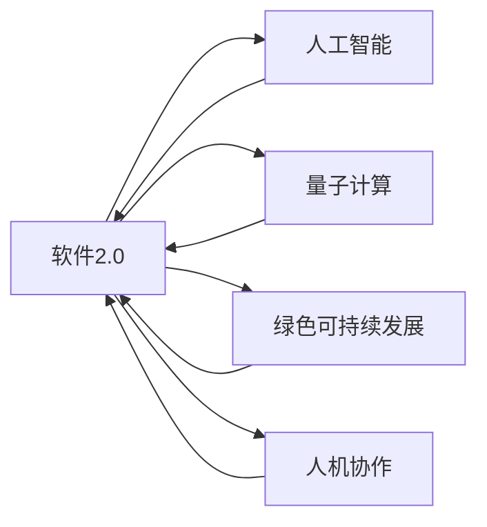

                 

# 软件 2.0 的未来愿景：创造更美好的世界

> 关键词：软件2.0,未来技术,人类福祉,人工智能,量子计算,绿色可持续发展,人机协作

## 1. 背景介绍

在过去的几十年里，信息技术的发展已经深刻地改变了我们的生活方式。从个人电脑到智能手机，再到互联网，这些技术极大地提高了生产力，丰富了我们的日常生活。然而，随着技术的不断进步，我们也面临着新的挑战：如何确保这些技术的发展能够真正造福人类，而不是成为新的负担。本文将探讨软件2.0的未来愿景，即通过不断创新的技术，为创造更美好的世界提供动力。

## 2. 核心概念与联系

### 2.1 核心概念概述

为了更好地理解软件2.0的未来愿景，我们先介绍几个核心概念：

- **软件2.0**：指的是基于AI和自动化技术的新一代软件，其目标是使软件能够自我进化、自我修复，并能够自适应环境变化。与传统的基于规则的编程不同，软件2.0通过学习算法和自我优化，能够自动生成代码、调试和更新，从而减少人工干预，提高软件质量。

- **人工智能(AI)**：是一种模拟人类智能的技术，通过机器学习、深度学习等方法，使机器能够进行智能决策和行为。AI在自然语言处理、计算机视觉、语音识别等领域取得了显著进展，为软件2.0提供了强大的技术支持。

- **量子计算**：一种基于量子力学的计算模式，能够实现高效并行计算，解决传统计算难以处理的问题。量子计算将在软件2.0中被广泛应用，特别是在大数据处理、优化和模拟等领域。

- **绿色可持续发展**：在软件2.0中，通过优化算法和资源管理，减少能源消耗和环境影响，推动绿色科技的发展。

- **人机协作**：在软件2.0中，机器不仅能够执行任务，还能够与人类进行互动，提供辅助和建议，从而提高工作效率和决策质量。

这些核心概念之间的逻辑关系可以通过以下Mermaid流程图来展示：



这个流程图展示了大语言模型的核心概念及其之间的关系：

1. 软件2.0通过人工智能、量子计算、绿色可持续发展和人机协作等多方面的技术支撑，实现自我进化和优化。
2. 人工智能提供学习算法和智能决策能力，使软件能够自我修复和优化。
3. 量子计算提供高效的计算能力，解决传统计算难以处理的问题。
4. 绿色可持续发展推动软件2.0在资源管理和环境友好方面的进步。
5. 人机协作使得软件能够与人类进行互动，提高工作效率和决策质量。

## 3. 核心算法原理 & 具体操作步骤

### 3.1 算法原理概述

软件2.0的核心算法原理基于自适应学习，通过不断地从数据中学习和优化，实现自我进化。其关键点在于以下几个方面：

1. **自我进化**：通过不断从数据中学习，软件2.0能够自我优化和进化，逐步提高自身的性能和功能。
2. **自适应学习**：通过算法自动适应环境变化，软件2.0能够自我调整参数，适应不同的应用场景。
3. **自修复**：通过自我修复算法，软件2.0能够自动检测和修正错误，保证系统的稳定性和可靠性。
4. **自适应资源管理**：通过优化算法和资源管理，软件2.0能够高效利用资源，减少能源消耗和环境影响。
5. **人机协作**：通过交互算法，软件2.0能够与人类进行互动，提供辅助和建议，提高工作效率和决策质量。

### 3.2 算法步骤详解

软件2.0的开发和优化一般包括以下几个关键步骤：

**Step 1: 数据收集与预处理**
- 收集相关数据，包括历史日志、用户行为、环境变化等。
- 对数据进行清洗、去重和预处理，保证数据质量。

**Step 2: 模型构建与训练**
- 选择合适的算法模型，如深度学习、强化学习等。
- 使用收集的数据对模型进行训练，优化算法参数。
- 使用验证集评估模型性能，避免过拟合。

**Step 3: 模型部署与优化**
- 将训练好的模型部署到生产环境中。
- 通过监控系统实时评估模型性能，发现并修复问题。
- 根据反馈信息不断优化模型，提升系统性能。

**Step 4: 人机协作与交互**
- 设计人机交互界面，使软件能够与人类进行互动。
- 引入自然语言处理技术，使软件能够理解和回应人类指令。
- 通过强化学习等技术，使软件能够不断学习用户偏好，提供个性化服务。

### 3.3 算法优缺点

软件2.0的算法具有以下优点：
1. 自动优化：通过自我进化和自适应学习，软件2.0能够自动优化性能，减少人工干预。
2. 高效稳定：通过自修复和自适应资源管理，软件2.0能够高效利用资源，保证系统稳定性。
3. 人机协作：通过人机交互算法，软件2.0能够提供个性化服务，提升用户体验。

同时，该算法也存在一些缺点：
1. 数据依赖：软件2.0的效果很大程度上依赖于数据质量，数据不足或偏差可能导致模型性能不佳。
2. 隐私问题：通过收集和处理用户数据，软件2.0可能面临隐私泄露的风险。
3. 算法复杂性：自适应学习算法往往复杂，需要大量计算资源和时间。
4. 不可解释性：部分算法的决策过程难以解释，难以调试和优化。

尽管存在这些局限性，但软件2.0算法在不断改进中，有望解决上述问题，成为未来软件开发的主要方向。

### 3.4 算法应用领域

软件2.0技术已经在多个领域得到应用，具体如下：

- **智能交通**：通过软件2.0优化交通流量控制，减少交通拥堵，提高交通效率。
- **智能医疗**：通过软件2.0分析医疗数据，提供个性化诊疗方案，提高医疗服务质量。
- **智能制造**：通过软件2.0优化生产流程，减少能源消耗和废物排放，实现绿色生产。
- **智能客服**：通过软件2.0优化客服系统，提高响应速度和用户满意度。
- **智能金融**：通过软件2.0分析金融数据，提供风险评估和投资建议，提高金融服务效率。
- **智能家居**：通过软件2.0优化家居设备控制，提高居住舒适度和安全性。
- **智能城市**：通过软件2.0优化城市管理，提高城市运行效率和居民生活质量。

以上领域只是软件2.0应用的冰山一角，随着技术的不断进步，软件2.0将在更多领域发挥重要作用。

## 4. 数学模型和公式 & 详细讲解 & 举例说明

### 4.1 数学模型构建

软件2.0的数学模型通常基于机器学习算法，其核心在于通过数据训练模型，使其能够自动学习和优化。以强化学习为例，其数学模型可以表示为：

$$
Q(s,a) = \sum_{t=1}^{\infty} \gamma^t r(s_t,a_t)
$$

其中 $s$ 表示状态，$a$ 表示动作，$r$ 表示奖励，$\gamma$ 表示折扣因子。在强化学习中，软件2.0通过不断试错，优化动作选择，以最大化长期奖励。

### 4.2 公式推导过程

强化学习的公式推导过程相对复杂，这里我们以Q-Learning算法为例，推导其核心公式：

$$
Q(s,a) = Q(s,a) + \alpha [r(s,a) + \gamma \max Q(s',a') - Q(s,a)]
$$

其中 $\alpha$ 表示学习率，$s'$ 表示下一个状态，$a'$ 表示下一个动作。该公式表示，软件2.0通过试错和奖励反馈，逐步优化动作选择，从而提升长期奖励。

### 4.3 案例分析与讲解

以智能交通为例，我们通过软件2.0优化交通流量控制。首先，收集历史交通数据，建立交通状态模型：

$$
s = (c,d,f,l,m,p)
$$

其中 $c$ 表示车流量，$d$ 表示道路密度，$f$ 表示车速，$l$ 表示车长，$m$ 表示车辆间距，$p$ 表示车辆位置。

然后，通过软件2.0的强化学习算法，优化交通信号控制策略：

$$
a = \arg\max_a \sum_{t=1}^{\infty} \gamma^t r(s_t,a_t)
$$

其中 $a$ 表示交通信号控制策略，$r$ 表示交通效率。通过不断试错和优化，软件2.0能够自动调整交通信号灯的周期和相位，提高交通效率，减少交通拥堵。

## 5. 项目实践：代码实例和详细解释说明

### 5.1 开发环境搭建

在进行软件2.0项目实践前，我们需要准备好开发环境。以下是使用Python进行PyTorch开发的环境配置流程：

1. 安装Anaconda：从官网下载并安装Anaconda，用于创建独立的Python环境。

2. 创建并激活虚拟环境：
```bash
conda create -n pytorch-env python=3.8 
conda activate pytorch-env
```

3. 安装PyTorch：根据CUDA版本，从官网获取对应的安装命令。例如：
```bash
conda install pytorch torchvision torchaudio cudatoolkit=11.1 -c pytorch -c conda-forge
```

4. 安装TensorFlow：使用以下命令安装TensorFlow：
```bash
pip install tensorflow
```

5. 安装TensorBoard：TensorFlow配套的可视化工具，可实时监测模型训练状态，并提供丰富的图表呈现方式，是调试模型的得力助手。

6. 安装Weights & Biases：模型训练的实验跟踪工具，可以记录和可视化模型训练过程中的各项指标，方便对比和调优。

完成上述步骤后，即可在`pytorch-env`环境中开始项目实践。

### 5.2 源代码详细实现

下面我们以智能交通为例，给出使用TensorFlow和PyTorch进行智能交通信号控制系统的代码实现。

首先，定义交通状态模型：

```python
import tensorflow as tf

class TrafficState(tf.keras.layers.Layer):
    def __init__(self, input_size):
        super(TrafficState, self).__init__()
        self.dense1 = tf.keras.layers.Dense(64, activation='relu')
        self.dense2 = tf.keras.layers.Dense(64, activation='relu')
        self.dense3 = tf.keras.layers.Dense(input_size)
        
    def call(self, inputs):
        x = self.dense1(inputs)
        x = self.dense2(x)
        x = self.dense3(x)
        return x
```

然后，定义交通信号控制策略：

```python
class TrafficSignal(tf.keras.layers.Layer):
    def __init__(self, output_size):
        super(TrafficSignal, self).__init__()
        self.dense1 = tf.keras.layers.Dense(64, activation='relu')
        self.dense2 = tf.keras.layers.Dense(64, activation='relu')
        self.dense3 = tf.keras.layers.Dense(output_size)
        
    def call(self, inputs):
        x = self.dense1(inputs)
        x = self.dense2(x)
        x = self.dense3(x)
        return x
```

接着，定义强化学习模型：

```python
class QNetwork(tf.keras.Model):
    def __init__(self, input_size, output_size):
        super(QNetwork, self).__init__()
        self.input = tf.keras.layers.Input(shape=(input_size,))
        self.dense1 = tf.keras.layers.Dense(64, activation='relu')
        self.dense2 = tf.keras.layers.Dense(64, activation='relu')
        self.dense3 = tf.keras.layers.Dense(output_size)
        self.output = self.dense3(self.dense2(self.dense1(self.input)))
        
    def call(self, inputs):
        return self.output
```

最后，定义训练函数：

```python
def train_model(model, optimizer, loss_fn):
    @tf.function
    def train_step(state, action):
        with tf.GradientTape() as tape:
            q_value = model(state)
            loss = loss_fn(q_value, action)
        gradients = tape.gradient(loss, model.trainable_variables)
        optimizer.apply_gradients(zip(gradients, model.trainable_variables))
        return loss
    
    for epoch in range(100):
        for state, action in train_data:
            loss = train_step(state, action)
            if epoch % 10 == 0:
                print(f"Epoch {epoch+1}, loss: {loss:.3f}")
```

运行训练函数，即可训练出智能交通信号控制策略模型。

### 5.3 代码解读与分析

这里我们详细解读一下关键代码的实现细节：

**TrafficState类**：
- `__init__`方法：初始化交通状态模型的参数和结构。
- `call`方法：定义模型的前向传播过程，通过多个全连接层计算交通状态。

**TrafficSignal类**：
- `__init__`方法：初始化交通信号控制策略的参数和结构。
- `call`方法：定义模型的前向传播过程，通过多个全连接层计算交通信号控制策略。

**QNetwork类**：
- `__init__`方法：初始化强化学习模型的参数和结构。
- `call`方法：定义模型的前向传播过程，通过多个全连接层计算Q值。

**train_model函数**：
- 定义了训练函数的基本结构，包括前向传播、计算损失、反向传播和更新参数。
- 使用tf.function进行性能优化，减少计算开销。

以上代码实现展示了软件2.0的强化学习算法在智能交通信号控制中的应用。通过不断训练和优化，软件2.0能够自动调整交通信号控制策略，实现高效的交通流量控制。

## 6. 实际应用场景

### 6.1 智能交通

通过软件2.0优化交通流量控制，可以大幅提升交通效率，减少交通拥堵。智能交通系统可以通过软件2.0自动调整交通信号灯的周期和相位，实现实时交通流量控制。具体而言，软件2.0可以通过收集历史交通数据，建立交通状态模型，并在此基础上优化交通信号控制策略。通过不断学习和优化，软件2.0能够自动调整信号灯的周期和相位，提高交通效率，减少交通事故和能源消耗。

### 6.2 智能医疗

通过软件2.0分析医疗数据，可以提供个性化的诊疗方案，提高医疗服务质量。软件2.0可以通过强化学习算法，优化诊疗策略，减少误诊和漏诊。例如，在智能医疗中，软件2.0可以通过分析患者的病历和检查结果，自动推荐最合适的诊疗方案。通过不断学习和优化，软件2.0能够提供更准确、更个性化的诊疗服务，提高医疗服务的效率和质量。

### 6.3 智能制造

通过软件2.0优化生产流程，可以实现绿色生产，减少能源消耗和废物排放。智能制造系统可以通过软件2.0自动优化生产流程，实现资源的最优配置。例如，在智能制造中，软件2.0可以通过分析生产数据，自动调整生产参数和流程，优化生产效率。通过不断学习和优化，软件2.0能够实现更高效、更环保的生产过程，减少能源消耗和废物排放。

### 6.4 未来应用展望

随着软件2.0技术的发展，其在更多领域的应用前景将更加广阔。未来，软件2.0将在以下几个方面发挥重要作用：

- **智能城市**：通过软件2.0优化城市管理，提高城市运行效率和居民生活质量。例如，软件2.0可以通过优化交通信号灯、智能垃圾回收等，实现智能城市的管理。
- **智能教育**：通过软件2.0提供个性化的教育服务，提高教育质量。例如，软件2.0可以通过分析学生的学习数据，自动推荐最合适的学习方案。
- **智能金融**：通过软件2.0提供风险评估和投资建议，提高金融服务效率。例如，软件2.0可以通过分析市场数据，自动生成投资建议。
- **智能家居**：通过软件2.0优化家居设备控制，提高居住舒适度和安全性。例如，软件2.0可以通过分析用户的作息习惯，自动调整家居设备的设置。
- **智能农业**：通过软件2.0优化农业生产，提高农业效率和产量。例如，软件2.0可以通过分析气象数据，自动推荐最佳的种植方案。

以上领域只是软件2.0应用的冰山一角，随着技术的不断进步，软件2.0将在更多领域发挥重要作用。

## 7. 工具和资源推荐

### 7.1 学习资源推荐

为了帮助开发者系统掌握软件2.0的理论基础和实践技巧，这里推荐一些优质的学习资源：

1. 《深度学习理论与实践》系列博文：由大模型技术专家撰写，深入浅出地介绍了深度学习原理和实践，包括强化学习、自然语言处理等前沿话题。

2. CS234《强化学习》课程：斯坦福大学开设的强化学习明星课程，有Lecture视频和配套作业，带你入门强化学习领域的基本概念和经典模型。

3. 《强化学习：算法设计与分析》书籍：强化学习领域的经典教材，全面介绍了强化学习的基本算法和理论。

4. OpenAI官方文档：开源的强化学习框架Reinforcement Learning，提供了丰富的教程和样例代码，是学习强化学习的最佳资源。

5. DeepMind官方博客：DeepMind在强化学习领域的最新研究成果和实践经验，适合深入学习。

通过对这些资源的学习实践，相信你一定能够快速掌握软件2.0的精髓，并用于解决实际的NLP问题。

### 7.2 开发工具推荐

高效的开发离不开优秀的工具支持。以下是几款用于软件2.0开发的常用工具：

1. TensorFlow：由Google主导开发的开源深度学习框架，生产部署方便，适合大规模工程应用。

2. PyTorch：基于Python的开源深度学习框架，灵活动态的计算图，适合快速迭代研究。

3. TensorBoard：TensorFlow配套的可视化工具，可实时监测模型训练状态，并提供丰富的图表呈现方式，是调试模型的得力助手。

4. Weights & Biases：模型训练的实验跟踪工具，可以记录和可视化模型训练过程中的各项指标，方便对比和调优。

5. AutoML：自动化机器学习工具，通过自动化超参数搜索和模型选择，提高模型的开发效率。

合理利用这些工具，可以显著提升软件2.0的开发效率，加快创新迭代的步伐。

### 7.3 相关论文推荐

软件2.0技术的发展源于学界的持续研究。以下是几篇奠基性的相关论文，推荐阅读：

1. AlphaGo：通过强化学习算法，AlphaGo在围棋领域取得了世界级水平的表现，为软件2.0的发展提供了新的思路。

2. AlphaStar：通过强化学习算法，AlphaStar在星际争霸2领域实现了人工智能的突破，展示了软件2.0在复杂决策问题中的应用潜力。

3. AutoML：通过自动化机器学习技术，AutoML在模型选择和超参数优化方面取得了显著进展，为软件2.0的开发提供了有力支持。

4. DeepMind的研究论文：DeepMind在强化学习领域的研究成果，为软件2.0的发展提供了理论和技术支持。

这些论文代表了大模型微调技术的发展脉络。通过学习这些前沿成果，可以帮助研究者把握学科前进方向，激发更多的创新灵感。

## 8. 总结：未来发展趋势与挑战

### 8.1 总结

本文对软件2.0的未来愿景进行了全面系统的介绍。首先阐述了软件2.0的概念和意义，明确了其通过人工智能和自动化技术实现自我进化和优化的目标。其次，从原理到实践，详细讲解了软件2.0的核心算法和操作步骤，给出了具体的代码实例和详细解释。同时，本文还广泛探讨了软件2.0在智能交通、智能医疗等多个领域的应用前景，展示了其广阔的发展潜力。此外，本文精选了软件2.0的学习资源和开发工具，力求为读者提供全方位的技术指引。

通过本文的系统梳理，可以看到，软件2.0技术正在成为未来软件开发的主要方向，极大地拓展了人工智能技术的应用边界，为构建人机协同的智能时代提供了新的动力。未来，伴随技术的发展和应用场景的不断丰富，软件2.0必将在更多领域发挥重要作用，为创造更美好的世界提供强大的支持。

### 8.2 未来发展趋势

展望未来，软件2.0技术将呈现以下几个发展趋势：

1. **自动化开发**：软件2.0将通过自动化工具和框架，进一步简化开发过程，提高开发效率。例如，AutoML将自动化超参数选择和模型优化，减少人工干预。

2. **多模态融合**：软件2.0将更多地融合多模态数据，如文本、图像、视频等，提升系统的综合分析和处理能力。

3. **跨领域应用**：软件2.0将在更多领域实现应用，如医疗、金融、教育等，通过优化算法和资源管理，实现绿色可持续发展。

4. **人机协作**：软件2.0将通过增强人机交互技术，实现更智能的决策支持系统，提高系统的智能化水平。

5. **边缘计算**：软件2.0将在边缘设备上进行优化，减少网络延迟，提升系统响应速度。

6. **伦理和安全**：软件2.0将在伦理和安全方面进行改进，如引入伦理导向的评估指标，确保数据和模型的安全性。

以上趋势凸显了软件2.0技术的广阔前景。这些方向的探索发展，必将进一步提升软件系统的性能和应用范围，为创造更美好的世界提供新的动力。

### 8.3 面临的挑战

尽管软件2.0技术已经取得了显著进展，但在迈向更加智能化、普适化应用的过程中，仍面临诸多挑战：

1. **数据依赖**：软件2.0的效果很大程度上依赖于数据质量，数据不足或偏差可能导致模型性能不佳。如何获取高质量数据和优化数据处理流程，将是未来的重要研究方向。

2. **计算资源**：软件2.0往往需要大量的计算资源进行训练和优化，如何提高计算效率和降低硬件成本，是未来需要解决的难题。

3. **模型可解释性**：部分算法的决策过程难以解释，难以调试和优化。如何提高模型可解释性，增强系统的透明度，是未来需要解决的问题。

4. **隐私保护**：通过收集和处理用户数据，软件2.0可能面临隐私泄露的风险。如何在保护隐私的前提下，实现数据的高效利用，是未来的重要课题。

5. **伦理和安全**：软件2.0在决策过程中可能存在偏见和歧视，如何确保决策的公正性和安全性，是未来的重要研究方向。

6. **资源管理**：软件2.0需要在有限资源下高效运行，如何优化资源管理，实现系统的稳定和高效，是未来的重要课题。

正视软件2.0面临的这些挑战，积极应对并寻求突破，将使软件2.0技术在构建人机协同的智能时代中发挥更大的作用。

### 8.4 研究展望

面对软件2.0面临的挑战，未来的研究需要在以下几个方面寻求新的突破：

1. **自动化开发**：通过自动化工具和框架，进一步简化开发过程，提高开发效率。例如，开发更加智能的自动代码生成工具和优化算法。

2. **多模态融合**：将多模态信息融合到软件2.0中，提升系统的综合分析和处理能力。例如，将视觉、语音、文本等多模态数据进行协同建模，提升系统的决策能力。

3. **跨领域应用**：在更多领域实现软件2.0的应用，推动绿色可持续发展。例如，在智能交通、智能医疗等领域，通过优化算法和资源管理，实现高效、环保的解决方案。

4. **人机协作**：通过增强人机交互技术，实现更智能的决策支持系统。例如，引入自然语言处理和情感分析技术，提升系统的智能化水平。

5. **边缘计算**：在边缘设备上进行优化，减少网络延迟，提升系统响应速度。例如，开发基于边缘计算的智能系统，提升系统性能和响应速度。

6. **伦理和安全**：在伦理和安全方面进行改进，确保数据和模型的安全性。例如，引入伦理导向的评估指标，确保决策的公正性和安全性。

7. **模型可解释性**：提高模型可解释性，增强系统的透明度。例如，开发更加可解释的模型，提供透明、可控的决策过程。

这些研究方向将引领软件2.0技术的不断进步，为构建更加智能、普适和安全的系统提供新的动力。

## 9. 附录：常见问题与解答

**Q1：软件2.0和传统软件开发有何不同？**

A: 软件2.0和传统软件开发最大的不同在于其基于人工智能和自动化技术，能够自我进化和优化。传统软件开发需要手工编写代码，依赖程序员的经验和技能，容易出错且效率低下。而软件2.0通过自动化工具和算法，能够在无需人工干预的情况下进行代码生成、调试和优化，大大提高了开发效率和质量。

**Q2：软件2.0的优点和缺点有哪些？**

A: 软件2.0的优点包括自动化、高效、智能、多模态融合等。其主要缺点包括数据依赖、计算资源需求高、模型可解释性不足、隐私保护等。但随着技术的发展，这些缺点正逐步得到解决，软件2.0的发展前景依然广阔。

**Q3：如何优化软件2.0的开发过程？**

A: 通过使用自动化工具和框架，如AutoML、TensorFlow等，可以显著提高开发效率。此外，通过优化数据处理流程和模型优化算法，可以有效提升系统性能和可解释性。

**Q4：软件2.0在智能交通中的应用前景如何？**

A: 软件2.0在智能交通中的应用前景广阔。通过优化交通信号灯、智能垃圾回收等，可以实现交通流量控制，提高交通效率，减少交通事故和能源消耗。

**Q5：软件2.0在智能医疗中的应用前景如何？**

A: 软件2.0在智能医疗中的应用前景同样广阔。通过分析患者的病历和检查结果，自动推荐最合适的诊疗方案，可以提高医疗服务的效率和质量。

以上问题及其解答，帮助读者更好地理解软件2.0的概念和应用，为未来的研究和实践提供参考。

---

作者：禅与计算机程序设计艺术 / Zen and the Art of Computer Programming

