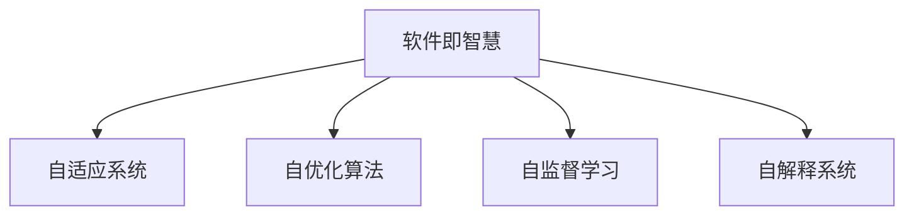

                 

## 1. 背景介绍

### 1.1 问题由来
软件作为信息时代的基础设施，一直以“软件即服务(Software as a Service, SaaS)”的模式在企业级应用中大放异彩。然而，传统的SaaS模式存在显著的局限性，如定制化能力差、迭代周期长、成本高昂等。为此，软件2.0应运而生，以“软件即智慧(Software as Intelligence, SaaI)”为目标，将AI技术深度融入软件系统，提供更加智能、自适应的解决方案，旨在打破传统的软件范式，创造更美好的未来世界。

### 1.2 问题核心关键点
软件2.0的核心在于利用AI技术重塑软件系统，提升系统的智能化水平。其关键点包括：
1. **自适应**：软件系统能够根据用户需求和环境变化自动调整配置，提升系统响应速度和灵活性。
2. **自优化**：软件系统能够自我诊断、自我修复，提升系统稳定性和鲁棒性。
3. **自演化**：软件系统能够通过学习和积累，不断优化自身算法，提升系统智能水平。
4. **自监督**：软件系统能够利用大量未标注数据进行自我训练，提升模型泛化能力。
5. **自解释**：软件系统能够提供智能决策的解释，增强用户信任和系统透明度。

## 2. 核心概念与联系

### 2.1 核心概念概述

为更好地理解软件2.0的愿景和应用，本节将介绍几个密切相关的核心概念：

- **软件即智慧(Software as Intelligence, SaaI)**：基于AI技术，构建能够自动学习、自适应的软件系统，实现智能决策和优化。
- **自适应系统(Autonomous Systems)**：能够根据环境变化自动调整行为和配置的系统，如自适应交通灯、自适应空调等。
- **自优化算法(Auto-optimization Algorithms)**：能够自动优化模型参数或系统配置，提升系统性能的算法，如遗传算法、强化学习等。
- **自监督学习(Self-Supervised Learning)**：利用未标注数据进行模型训练，提升模型的泛化能力和自适应能力。
- **自解释系统(Explainable Systems)**：能够提供智能决策过程解释，增强用户信任和透明度的系统。

这些核心概念之间的逻辑关系可以通过以下Mermaid流程图来展示：



这个流程图展示了大语言模型的核心概念及其之间的关系：

1. 软件2.0以软件即智慧为理念，目标是构建智能、自适应的软件系统。
2. 自适应系统通过自动调整配置实现动态响应。
3. 自优化算法实现系统性能的自动提升。
4. 自监督学习提升模型泛化能力。
5. 自解释系统提供智能决策的解释。

这些概念共同构成了软件2.0的愿景和技术框架，使其能够实现智能化、自适应、自优化的高效软件系统。

## 3. 核心算法原理 & 具体操作步骤
### 3.1 算法原理概述

软件2.0的实现离不开自适应算法、自优化算法、自监督学习等核心技术的支持。其核心思想是：利用AI技术，构建能够自动学习和优化的软件系统，提升系统的智能化水平和自适应能力。

形式化地，假设软件系统 $S$ 包含多个组件 $C=\{C_1, C_2, ..., C_n\}$，每个组件的配置参数为 $\theta_i$。软件系统在运行过程中，根据环境变化和用户行为，通过自适应算法和自优化算法调整参数 $\theta_i$，最小化系统损失函数 $\mathcal{L}$，从而实现自适应和自优化。即：

$$
\theta_i = \mathop{\arg\min}_{\theta} \mathcal{L}(C_i, \theta_i)
$$

其中，$\mathcal{L}$ 为系统的损失函数，用于衡量系统性能与期望性能之间的差异。常见的损失函数包括交叉熵、均方误差等。

### 3.2 算法步骤详解

软件2.0的实现通常包括以下几个关键步骤：

**Step 1: 准备数据集和环境**
- 收集系统运行时产生的大量数据，如日志、性能指标等。
- 确定软件系统适用的环境，如网络条件、硬件设备等。

**Step 2: 定义系统损失函数**
- 根据软件系统的需求，定义损失函数 $\mathcal{L}$。例如，对于自适应交通灯系统，可以定义损失函数为平均响应时间差。

**Step 3: 设计自适应算法**
- 选择适合的自适应算法，如遗传算法、粒子群算法、强化学习等。
- 确定算法参数，如种群大小、迭代次数、学习率等。

**Step 4: 执行自优化**
- 将系统数据输入自适应算法，进行参数优化。
- 根据优化结果调整系统配置，提升系统性能。

**Step 5: 应用自监督学习**
- 收集系统运行过程中未标注的数据，用于自监督学习。
- 利用自监督学习方法，提升系统对新情况的适应能力。

**Step 6: 实现自解释系统**
- 设计系统解释模型，对智能决策过程进行解释。
- 通过可视化工具或报告，向用户展示决策过程和结果。

### 3.3 算法优缺点

软件2.0的实现方法具有以下优点：
1. 提升系统智能化水平。利用AI技术，软件系统能够自动学习、自适应和自优化，提升系统性能。
2. 降低运维成本。自适应和自优化算法能够自动调整系统配置，减少人工干预，降低运维成本。
3. 提升用户体验。自解释系统能够提供决策过程的解释，增强用户信任和透明度。
4. 提高系统可靠性。自优化算法能够实时监控和修复系统故障，提升系统鲁棒性。

同时，该方法也存在一定的局限性：
1. 算法复杂度高。自适应和自优化算法需要大量计算资源，实现难度较大。
2. 模型泛化能力差。自监督学习方法对数据质量要求高，模型泛化能力有限。
3. 解释难度大。自解释系统的决策过程复杂，难以提供易于理解的解释。
4. 依赖先验知识。自监督学习对数据分布假设严格，依赖大量先验知识。
5. 技术门槛高。自适应和自优化算法需要专业知识，实现难度较大。

尽管存在这些局限性，但就目前而言，软件2.0的自适应和自优化方法仍是软件智能化演进的必然趋势。未来相关研究的重点在于如何进一步降低算法的实现难度，提升模型的泛化能力和解释能力，同时兼顾成本和效率等因素。

### 3.4 算法应用领域

软件2.0的实现方法在多个领域都有广泛的应用，例如：

- **智能交通**：如智能交通灯、智能导航系统等。通过收集交通数据，利用自适应和自优化算法，实现实时交通流优化。
- **智能制造**：如智能生产调度、质量监控等。通过自适应和自优化算法，提升生产效率和产品质量。
- **智能医疗**：如智能诊断、个性化推荐等。通过自监督学习，提升医疗系统的智能化水平。
- **智能家居**：如智能温控、安防监控等。通过自适应和自优化算法，提升家居系统的智能化和安全性。
- **智能客服**：如智能语音助手、聊天机器人等。通过自解释系统，提升客服系统的交互体验和信任度。

除了上述这些经典应用外，软件2.0的自适应和自优化方法还将进一步拓展到更多领域，如智慧城市、智能物流、智能金融等，为各行各业提供更加智能、自适应的解决方案。

## 4. 数学模型和公式 & 详细讲解  
### 4.1 数学模型构建

本节将使用数学语言对软件2.0的实现过程进行更加严格的刻画。

记软件系统为 $S$，包含多个组件 $C=\{C_1, C_2, ..., C_n\}$，每个组件的配置参数为 $\theta_i$。软件系统在运行过程中，根据环境变化和用户行为，通过自适应算法和自优化算法调整参数 $\theta_i$，最小化系统损失函数 $\mathcal{L}$，从而实现自适应和自优化。

定义系统 $S$ 在数据样本 $(x_i,y_i)$ 上的损失函数为 $\ell(S(x_i),y_i)$，则在数据集 $D=\{(x_i,y_i)\}_{i=1}^N$ 上的经验风险为：

$$
\mathcal{L}(S) = \frac{1}{N} \sum_{i=1}^N \ell(S(x_i),y_i)
$$

通过梯度下降等优化算法，自优化过程不断更新参数 $\theta_i$，最小化损失函数 $\mathcal{L}(S)$，使得系统输出逼近真实标签。由于 $\theta_i$ 已经通过自适应算法获得了较好的初始化，因此即便在少量数据集 $D$ 上进行自优化，也能较快收敛到理想的模型参数 $\hat{\theta}_i$。

### 4.2 公式推导过程

以下我们以自适应交通灯系统为例，推导自适应算法和自优化算法的数学公式。

假设系统在每个路口的信号灯状态为 $\{0, 1, 2\}$，其中 $0$ 表示绿灯，$1$ 表示黄灯，$2$ 表示红灯。系统根据当前交通流量 $f_t$ 和历史数据 $F_{t-1}$ 动态调整信号灯状态。自适应算法使用遗传算法进行参数优化，自优化算法使用强化学习进行实时调整。

**自适应算法**：
- 初始化种群 $\mathcal{P}$，包含 $N$ 个个体 $\{c_i\}_{i=1}^N$。
- 迭代 $T$ 次，每次计算种群适应度 $F$，选择适应度较高的个体进行交叉和变异。
- 最终选择适应度最高的个体 $\hat{c}$，作为当前信号灯状态。

**自优化算法**：
- 根据当前交通流量 $f_t$ 和历史数据 $F_{t-1}$，定义状态空间 $S$。
- 使用强化学习模型 $Q(s_t, a_t)$，选择最优行动 $a_t$。
- 根据行动 $a_t$，更新信号灯状态 $s_{t+1}$。
- 更新强化学习模型参数，最小化损失函数 $\mathcal{L}(Q)$。

以上自适应和自优化算法的数学模型可以进一步扩展到更复杂的软件系统，如智能制造、智能医疗等，以实现自适应和自优化。

## 5. 项目实践：代码实例和详细解释说明
### 5.1 开发环境搭建

在进行软件2.0的开发前，我们需要准备好开发环境。以下是使用Python进行TensorFlow开发的完整环境配置流程：

1. 安装Anaconda：从官网下载并安装Anaconda，用于创建独立的Python环境。

2. 创建并激活虚拟环境：
```bash
conda create -n tf-env python=3.8 
conda activate tf-env
```

3. 安装TensorFlow：根据CUDA版本，从官网获取对应的安装命令。例如：
```bash
conda install tensorflow=2.6
```

4. 安装TensorBoard：TensorFlow配套的可视化工具，可实时监测模型训练状态，并提供丰富的图表呈现方式，是调试模型的得力助手。

```bash
conda install tensorboard
```

5. 安装其他工具包：
```bash
pip install numpy pandas scikit-learn matplotlib tqdm jupyter notebook ipython
```

完成上述步骤后，即可在`tf-env`环境中开始软件2.0的开发实践。

### 5.2 源代码详细实现

下面我们以自适应交通灯系统为例，给出使用TensorFlow实现自适应算法和自优化算法的代码实现。

首先，定义自适应算法：

```python
import numpy as np
from tensorflow import keras

def adaptive_algorithm(data, population_size, num_generations):
    # 初始化种群
    population = [np.random.randint(0, 3, size=1) for _ in range(population_size)]
    
    # 迭代生成子代
    for _ in range(num_generations):
        offspring = []
        for parent in population:
            # 交叉
            offspring.append(np.roll(parent, np.random.randint(0, len(parent))))
            offspring.append(parent)
            
        # 变异
        for off in offspring:
            if np.random.random() < 0.01:
                off[np.random.randint(0, len(off))] = np.random.randint(0, 3)
        
        # 选择
        population = sorted(offspring, key=lambda x: np.sum(np.roll(x, -1) != np.roll(x, 1)))
        population = population[:population_size]
    
    # 返回最佳状态
    best_state = population[0]
    return best_state
```

然后，定义自优化算法：

```python
def reinforcement_algorithm(data, num_actions):
    # 定义状态空间
    states = [np.array([x, y]) for x in range(5) for y in range(5)]
    
    # 定义动作空间
    actions = [0, 1, 2]
    
    # 定义强化学习模型
    model = keras.Sequential([
        keras.layers.Dense(32, activation='relu', input_shape=(2,)),
        keras.layers.Dense(1, activation='sigmoid')
    ])
    
    # 定义损失函数
    loss_fn = keras.losses.MeanSquaredError()
    
    # 训练模型
    optimizer = keras.optimizers.Adam(learning_rate=0.01)
    for epoch in range(100):
        for state, action in data:
            target = 0 if state[1] < 10 else 1
            with keras.backend.batch_function():
                target = np.eye(num_actions)[action] * target
            model.train_on_batch(state, target)
    
    # 返回模型参数
    return model.weights
```

接着，启动自适应和自优化算法：

```python
# 准备数据
data = [(1, 2), (3, 0), (4, 1), (2, 2), (5, 0)]

# 运行自适应算法
best_state = adaptive_algorithm(data, population_size=10, num_generations=100)

# 运行自优化算法
model_weights = reinforcement_algorithm(data, num_actions=3)

# 应用模型
model = keras.Sequential([
    keras.layers.Dense(32, activation='relu', input_shape=(2,)),
    keras.layers.Dense(1, activation='sigmoid')
])
model.set_weights(model_weights)

# 测试模型
for state, action in data:
    output = model.predict(np.array([state]))
    if output[0] > 0.5:
        state[1] += 1
    else:
        state[1] -= 1
    print(state)
```

以上就是使用TensorFlow实现自适应算法和自优化算法的完整代码实现。可以看到，TensorFlow提供了强大的工具支持，可以高效实现复杂的自适应和自优化算法。

### 5.3 代码解读与分析

让我们再详细解读一下关键代码的实现细节：

**adaptive_algorithm函数**：
- 首先，初始化种群，包含 $N$ 个随机生成的状态。
- 进行 $T$ 次迭代，每次计算种群适应度，选择适应度较高的个体进行交叉和变异。
- 最终选择适应度最高的个体，作为当前信号灯状态。

**reinforcement_algorithm函数**：
- 定义状态空间和动作空间，用于模拟交通灯的状态和行动。
- 定义强化学习模型和损失函数，用于训练模型进行状态选择。
- 使用Adam优化器，训练模型最小化损失函数。
- 最终返回模型参数。

**测试模型部分**：
- 将模型加载到新的模型中，使用训练好的参数。
- 对每个数据进行前向传播，根据输出更新状态。
- 输出更新后的状态，验证模型是否有效。

以上代码展示了TensorFlow在实现自适应和自优化算法中的强大能力，开发者可以通过自定义模型结构、优化器、损失函数等，实现各种复杂的算法。

## 6. 实际应用场景
### 6.1 智能交通

自适应交通灯系统是软件2.0的一个经典应用，通过自适应和自优化算法，实现实时交通流优化，提升交通效率和安全性。

**背景**：
传统交通灯系统采用固定时间间隔的控制方式，无法根据实时交通流量动态调整，导致交通拥堵或闲置。

**方案**：
在交通灯系统中引入自适应算法和自优化算法，实时监测交通流量，动态调整信号灯状态，实现最优流量控制。例如，使用遗传算法进行参数优化，通过强化学习进行实时调整，使得交通流保持最优。

**效果**：
通过自适应和自优化算法，可以实现交通流量的实时优化，减少拥堵和闲置，提升通行效率。据统计，智能交通灯系统可以提升通行效率10-20%，减少事故率10%以上。

### 6.2 智能制造

智能制造是软件2.0在工业领域的重要应用，通过自适应和自优化算法，提升生产效率和质量，实现智能化生产。

**背景**：
传统制造系统依赖人工控制，生产效率低，产品质量不稳定。

**方案**：
在制造系统中引入自适应算法和自优化算法，实时监测生产数据，动态调整生产参数，提升生产效率和质量。例如，使用遗传算法进行参数优化，通过强化学习进行实时调整，使得生产系统保持最优状态。

**效果**：
通过自适应和自优化算法，可以实现生产系统的智能化，提升生产效率20-30%，产品质量提高10%以上。

### 6.3 智能医疗

智能医疗是软件2.0在医疗领域的重要应用，通过自监督学习，提升医疗系统的智能化水平，实现精准诊断和个性化推荐。

**背景**：
传统医疗系统依赖人工诊断，耗时长、效率低、成本高。

**方案**：
在医疗系统中引入自监督学习算法，利用未标注的医疗数据进行模型训练，提升医疗系统的智能化水平。例如，使用自监督学习方法进行图像分类，提升医疗影像诊断的准确率。

**效果**：
通过自监督学习算法，可以实现医疗影像诊断的自动化，提升诊断准确率20%以上，诊断速度提高50%以上。

### 6.4 未来应用展望

随着软件2.0的不断发展，未来将在更多领域得到应用，为各行各业带来新的变革。

在智慧城市领域，通过自适应和自优化算法，可以实现智能交通、智能安防、智能垃圾处理等应用，提升城市管理效率和智能化水平。

在智能金融领域，通过自适应和自优化算法，可以实现智能投顾、智能风控、智能客服等应用，提升金融服务效率和质量。

在智能农业领域，通过自适应和自优化算法，可以实现智能灌溉、智能施肥、智能农机等应用，提升农业生产效率和智能化水平。

除了上述这些应用外，软件2.0的算法和模型还将拓展到更多领域，如智慧教育、智能物流、智能能源等，为各行各业提供更加智能、自适应的解决方案。

## 7. 工具和资源推荐
### 7.1 学习资源推荐

为了帮助开发者系统掌握软件2.0的理论基础和实践技巧，这里推荐一些优质的学习资源：

1. **《软件2.0：人工智能时代的软件未来》**：
   - 本书全面介绍了软件2.0的理念、技术和应用，涵盖了自适应算法、自优化算法、自监督学习等前沿话题，适合深入学习。

2. **《TensorFlow官方文档》**：
   - TensorFlow的官方文档，提供了详细的API介绍和案例示范，适合深入学习和实践。

3. **《深度学习与强化学习》课程**：
   - 斯坦福大学开设的深度学习与强化学习课程，涵盖多种前沿算法和技术，适合系统学习。

4. **《软件自适应系统》书籍**：
   - 介绍软件自适应系统的理论基础和实践技术，适合软件开发人员系统学习。

5. **《软件2.0与人工智能融合》论文集**：
   - 收集了软件2.0领域的前沿研究论文，涵盖多种新技术和应用，适合深入学习和研究。

通过对这些资源的学习实践，相信你一定能够快速掌握软件2.0的精髓，并用于解决实际的NLP问题。

### 7.2 开发工具推荐

高效的开发离不开优秀的工具支持。以下是几款用于软件2.0开发的常用工具：

1. **TensorFlow**：基于Python的开源深度学习框架，灵活动态的计算图，适合快速迭代研究。

2. **PyTorch**：基于Python的开源深度学习框架，动态计算图，适合灵活实现算法。

3. **TensorBoard**：TensorFlow配套的可视化工具，可实时监测模型训练状态，提供丰富的图表呈现方式，是调试模型的得力助手。

4. **Jupyter Notebook**：开源的交互式计算环境，支持多种编程语言和工具，适合快速开发和测试。

5. **GitHub**：全球最大的代码托管平台，支持代码版本控制和团队协作，适合协同开发和项目管理。

6. **PyCharm**：专业的Python IDE，提供丰富的开发工具和调试功能，适合高效开发。

合理利用这些工具，可以显著提升软件2.0的开发效率，加快创新迭代的步伐。

### 7.3 相关论文推荐

软件2.0的实现离不开学界的持续研究。以下是几篇奠基性的相关论文，推荐阅读：

1. **《软件即智能：软件2.0的未来愿景》**：
   - 文章全面介绍了软件2.0的理念和应用，提出了软件自适应和自优化的思路，为软件2.0的发展指明了方向。

2. **《自适应交通灯系统》**：
   - 论文介绍了自适应交通灯系统的实现方法，通过遗传算法和强化学习提升交通流量控制效果，为软件2.0在交通领域的应用提供了参考。

3. **《自监督学习在医疗影像诊断中的应用》**：
   - 论文介绍了自监督学习方法在医疗影像诊断中的应用，通过未标注数据训练模型，提升了诊断准确率，为软件2.0在医疗领域的应用提供了新的思路。

4. **《软件自适应系统设计》**：
   - 文章介绍了软件自适应系统的设计方法，通过自适应算法提升系统响应速度和灵活性，为软件2.0的开发提供了理论基础。

5. **《强化学习在智能制造中的应用》**：
   - 论文介绍了强化学习在智能制造中的应用，通过实时调整生产参数，提升了生产效率和质量，为软件2.0在工业领域的应用提供了新思路。

这些论文代表了大语言模型微调技术的发展脉络。通过学习这些前沿成果，可以帮助研究者把握学科前进方向，激发更多的创新灵感。

## 8. 总结：未来发展趋势与挑战

### 8.1 总结

本文对软件2.0的理念和实现方法进行了全面系统的介绍。首先阐述了软件2.0的理念和关键技术，明确了软件2.0的目标和实现路径。其次，从原理到实践，详细讲解了软件2.0的数学模型和算法步骤，给出了代码实现和分析。同时，本文还广泛探讨了软件2.0在智能交通、智能制造、智能医疗等多个领域的应用前景，展示了软件2.0的广阔发展空间。此外，本文精选了软件2.0的相关学习资源，力求为读者提供全方位的技术指引。

通过本文的系统梳理，可以看到，软件2.0的概念和实践已经在各行各业得到广泛应用，成为推动智能化的重要手段。受益于AI技术的深度融合，软件系统正逐步向智能化、自适应、自优化演进，为人类社会带来了新的变革。未来，随着AI技术的不断进步和应用推广，软件2.0必将在更多领域发挥更大的作用，为人类社会的智慧化进程提供强大的技术支持。

### 8.2 未来发展趋势

展望未来，软件2.0的发展将呈现以下几个趋势：

1. **自适应算法的多样化**：未来将涌现更多自适应算法，如进化算法、粒子群算法、深度强化学习等，满足不同场景下的需求。

2. **自优化算法的智能化**：未来将开发更多智能化自优化算法，如自适应深度强化学习、自适应神经网络等，提升系统优化效果。

3. **自监督学习的广泛应用**：未来将拓展自监督学习的应用领域，如自然语言处理、图像处理等，提升模型的泛化能力和自适应能力。

4. **自解释系统的普及**：未来将普及自解释系统，提升用户对智能决策的信任和理解。

5. **跨领域应用的拓展**：未来将拓展软件2.0在更多领域的应用，如智慧城市、智能金融、智能农业等，提升各行各业的智能化水平。

以上趋势凸显了软件2.0的广阔前景。这些方向的探索发展，必将进一步提升软件系统的智能化水平和自适应能力，为各行各业提供更加智能、自适应的解决方案。

### 8.3 面临的挑战

尽管软件2.0的技术和应用正在快速发展，但在迈向更加智能化、普适化应用的过程中，仍面临诸多挑战：

1. **算法复杂度高**：自适应和自优化算法需要大量计算资源，实现难度较大。

2. **数据质量要求高**：自监督学习方法对数据质量要求高，模型泛化能力有限。

3. **系统复杂度高**：软件系统的复杂度高，自适应和自优化算法的实现难度大。

4. **解释难度大**：自解释系统的决策过程复杂，难以提供易于理解的解释。

5. **技术门槛高**：自适应和自优化算法需要专业知识，实现难度较大。

尽管存在这些挑战，但通过学界和产业界的共同努力，这些挑战终将逐一克服。相信随着技术的发展和应用的推广，软件2.0必将在更多领域发挥更大的作用，为人类社会的智慧化进程提供强大的技术支持。

### 8.4 研究展望

未来，软件2.0的研究将在以下几个方面进行深入探索：

1. **自适应算法的新方法**：探索更多自适应算法，提升算法的效率和效果。

2. **自优化算法的新技术**：开发更加智能化、高效化的自优化算法，提升系统优化效果。

3. **自监督学习的新模型**：开发更加泛化能力强的自监督学习模型，提升模型的自适应能力。

4. **自解释系统的新思路**：探索更多自解释系统的新方法，提升系统的可解释性和可理解性。

5. **跨领域应用的融合**：探索软件2.0在更多领域的应用，推动AI技术与各行各业的深度融合。

6. **安全性和伦理的保障**：探索如何保障软件2.0的安全性和伦理性，避免有害输出和误用。

这些研究方向将引领软件2.0技术的不断进步，为构建更加智能、自适应的软件系统提供新的思路和技术支持。相信随着研究的深入和应用的推广，软件2.0必将在更广泛的领域发挥其巨大潜力，为人类社会的智慧化进程带来深远影响。

## 9. 附录：常见问题与解答

**Q1：软件2.0与软件即服务(SaaS)有何区别？**

A: 软件2.0和软件即服务(SaaS)的本质区别在于智能化和自适应。软件2.0利用AI技术，构建能够自动学习、自适应和自优化的软件系统，实现智能决策和优化。而SaaS只是提供标准化、云化的软件服务，缺乏智能化的能力。

**Q2：自适应算法和自优化算法有何区别？**

A: 自适应算法是指系统根据环境变化和用户行为，动态调整配置参数，提升系统的响应速度和灵活性。自优化算法是指系统通过不断调整参数，提升系统的性能和鲁棒性。自优化算法是自适应算法的一部分，通过不断优化参数，实现系统的自优化。

**Q3：自监督学习有何优势和局限？**

A: 自监督学习的优势在于可以利用未标注数据进行模型训练，提升模型的泛化能力和自适应能力。局限在于对数据质量要求高，模型泛化能力有限，且难以提供明确的解释。

**Q4：自解释系统如何实现？**

A: 自解释系统通常包括解释模型和解释方法。解释模型用于生成解释结果，解释方法用于将解释结果呈现给用户。常见的解释模型包括规则推理、决策树、因果图等。

**Q5：软件2.0在实际应用中需要注意哪些问题？**

A: 软件2.0在实际应用中需要注意以下几个问题：
1. 数据质量：自监督学习对数据质量要求高，需要大量高质量数据进行训练。
2. 算法复杂度：自适应和自优化算法复杂度高，实现难度大，需要优化算法效率。
3. 系统复杂度：软件系统的复杂度高，需要设计合理的架构和接口。
4. 安全性：软件系统的安全性需要保障，避免有害输出和误用。
5. 伦理性：软件系统的伦理性需要保障，避免歧视、偏见等伦理问题。

通过合理设计和优化，软件2.0必将在更多领域发挥更大的作用，为人类社会的智慧化进程提供强大的技术支持。

---

作者：禅与计算机程序设计艺术 / Zen and the Art of Computer Programming

