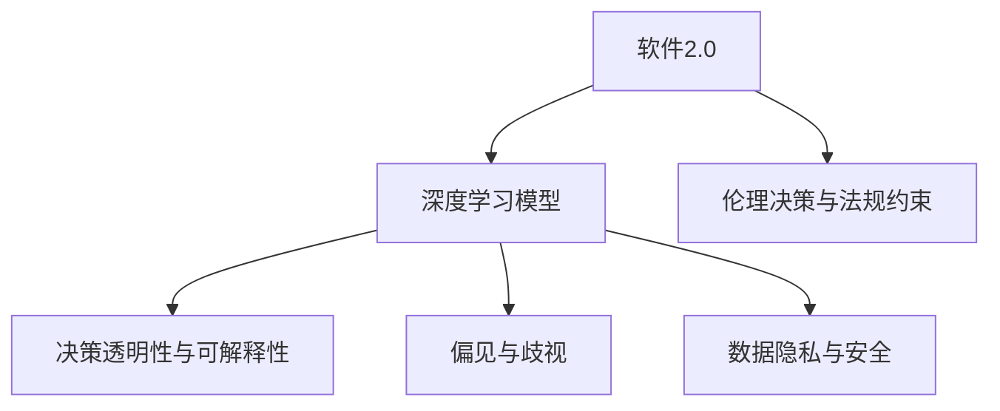

                 

## 1. 背景介绍

### 1.1 问题由来

随着人工智能(AI)技术的飞速发展，尤其是深度学习模型的突破，我们正处在由软件1.0向软件2.0转变的关键时期。所谓软件2.0，就是指基于深度学习模型和数据驱动的软件系统。这种系统具有自我学习、自我优化的能力，能够不断适应环境变化，提升自身性能。

但这种能力也带来了新的伦理困境。软件2.0系统不仅仅是工具，更像是“智能生物”，拥有自我意识和行动能力。如何在保障其智能能力的同时，避免其给社会带来不利影响，成为迫切需要解决的课题。

### 1.2 问题核心关键点

软件2.0的伦理困境主要体现在以下几个方面：

- **数据隐私与安全**：软件2.0系统通常依赖大量数据进行训练和优化，数据隐私与安全问题凸显。
- **决策透明性与可解释性**：基于深度学习模型的决策过程复杂且不透明，难以解释和验证。
- **偏见与歧视**：训练数据可能存在偏见，导致模型输出也具有歧视性。
- **误用与滥用**：软件2.0系统的强大能力可能被恶意利用，对社会产生负面影响。
- **伦理决策与法规约束**：如何对软件2.0系统进行伦理约束和法规监管，是亟待解决的问题。

## 2. 核心概念与联系

### 2.1 核心概念概述

为更好地理解软件2.0系统面临的伦理困境，本节将介绍几个密切相关的核心概念：

- **软件2.0**：基于深度学习模型的智能软件系统，能够自我学习、自我优化，具有类似于人类的智能能力。

- **深度学习模型**：由多层神经网络构成的模型，通过大量数据训练，能够自动提取特征、进行预测或分类等任务。

- **决策透明性与可解释性**：指软件系统决策过程的逻辑性和可解释性，便于用户理解和使用。

- **偏见与歧视**：指软件系统因训练数据存在偏见而产生的不公平输出。

- **数据隐私与安全**：指保护个人数据不被非法获取、使用和泄露的问题。

- **伦理决策与法规约束**：指对软件系统进行伦理和法规约束，避免其行为对社会产生不利影响。

这些核心概念之间的逻辑关系可以通过以下Mermaid流程图来展示：



这个流程图展示出软件2.0系统的核心概念及其之间的关系：

1. 软件2.0系统的智能能力依赖于深度学习模型。
2. 深度学习模型因训练数据偏见可能输出歧视性结果。
3. 数据隐私和安全问题伴随深度学习模型训练和使用过程始终存在。
4. 决策透明性和可解释性是保障软件2.0系统可信性的关键。
5. 伦理决策和法规约束是限制软件2.0系统行为的基础。

## 3. 核心算法原理 & 具体操作步骤
### 3.1 算法原理概述

软件2.0系统的核心算法原理是基于深度学习模型的自适应学习能力。通过在大规模数据上进行训练，模型能够自动学习特征和模式，进行决策和分类等任务。

具体来说，假设我们有一个深度学习模型 $M$，输入为 $x$，输出为 $y$，则模型的训练过程可以表示为：

$$
M = \arg\min_{\theta} \frac{1}{N} \sum_{i=1}^N \ell(y_i, M(x_i))
$$

其中，$\ell$ 为损失函数，$\theta$ 为模型参数。

### 3.2 算法步骤详解

软件2.0系统的训练和优化一般包括以下几个关键步骤：

**Step 1: 数据准备**

- 收集并标注训练数据，确保数据质量和多样性。
- 清洗数据，去除噪声和异常值，保证模型训练的有效性。
- 划分训练集、验证集和测试集，用于模型训练、调参和测试。

**Step 2: 模型构建**

- 选择合适的深度学习框架和模型结构。
- 设计损失函数和优化器，如交叉熵损失、Adam优化器等。
- 设定超参数，如学习率、批大小等，进行模型训练。

**Step 3: 训练过程**

- 使用训练集进行前向传播和反向传播，计算损失函数。
- 根据优化器更新模型参数，逐步减少损失。
- 周期性在验证集上评估模型性能，避免过拟合。
- 重复上述步骤直至模型收敛或达到预设迭代次数。

**Step 4: 模型评估**

- 在测试集上评估模型性能，如准确率、召回率等指标。
- 对模型进行解释，如特征重要性、决策路径等，提高透明性。
- 检测模型偏见和歧视，进行必要的调整。

### 3.3 算法优缺点

软件2.0系统具有以下优点：

- **自适应能力强**：能够不断从新数据中学习，提升自身性能。
- **处理能力强**：能够处理大规模、高维度数据，解决复杂任务。
- **效果显著**：在图像识别、自然语言处理等任务上，取得领先水平的效果。

但同时也存在一些缺点：

- **数据依赖性高**：训练效果高度依赖训练数据的质量和数量。
- **不可解释性**：模型内部逻辑复杂，难以解释决策过程。
- **偏见问题**：训练数据可能存在偏见，导致模型输出也具有歧视性。
- **隐私与安全问题**：模型训练和使用涉及大量数据，数据隐私与安全问题凸显。
- **伦理挑战**：强大的智能能力可能被恶意利用，对社会产生不利影响。

## 4. 数学模型和公式 & 详细讲解
### 4.1 数学模型构建

软件2.0系统基于深度学习模型的自适应学习能力，其数学模型通常包括输入层、若干隐层和输出层。以全连接神经网络为例，其数学模型可以表示为：

$$
\mathcal{M} = \{f_\theta \mid f_\theta(x) = \sigma(W_l f_{\theta_{l-1}}(x) + b_l), l=1,...,L\}
$$

其中，$x$ 为输入向量，$\theta$ 为模型参数，$\sigma$ 为激活函数，$W$ 和 $b$ 为权重和偏置向量。

### 4.2 公式推导过程

以二分类任务为例，假设模型输出为 $f_\theta(x)$，真实标签为 $y \in \{0,1\}$，则二分类交叉熵损失函数为：

$$
\ell(f_\theta(x), y) = -[y\log f_\theta(x) + (1-y)\log(1-f_\theta(x))]
$$

其梯度为：

$$
\nabla_\theta \ell = -[yf_\theta(x)-y(1-f_\theta(x))]\nabla_\theta f_\theta(x)
$$

其中，$\nabla_\theta f_\theta(x)$ 表示 $f_\theta(x)$ 对 $\theta$ 的导数。

在实际训练中，通常使用随机梯度下降（SGD）等优化算法，其更新公式为：

$$
\theta_{t+1} = \theta_t - \eta \nabla_\theta \ell
$$

其中，$\eta$ 为学习率。

### 4.3 案例分析与讲解

以图像分类为例，假设有一张图像 $x$，模型输出为 $f_\theta(x)$，真实标签为 $y$。模型训练过程如下：

1. 前向传播：将图像 $x$ 输入模型，得到输出 $f_\theta(x)$。
2. 计算损失：计算交叉熵损失 $\ell(f_\theta(x), y)$。
3. 反向传播：计算损失函数对模型参数的梯度 $\nabla_\theta \ell$。
4. 参数更新：使用随机梯度下降等优化算法，更新模型参数。

重复上述过程，直至模型收敛或达到预设迭代次数。

## 5. 项目实践：代码实例和详细解释说明
### 5.1 开发环境搭建

在进行软件2.0系统开发前，我们需要准备好开发环境。以下是使用Python和TensorFlow进行开发的流程：

1. 安装Anaconda：从官网下载并安装Anaconda，用于创建独立的Python环境。

2. 创建并激活虚拟环境：
```bash
conda create -n tf-env python=3.8 
conda activate tf-env
```

3. 安装TensorFlow和Keras：
```bash
pip install tensorflow==2.6.0 keras==2.6.0
```

4. 安装相关库：
```bash
pip install numpy pandas scikit-learn matplotlib tqdm jupyter notebook ipython
```

完成上述步骤后，即可在`tf-env`环境中开始开发。

### 5.2 源代码详细实现

以下是一个使用TensorFlow进行图像分类的示例代码：

```python
import tensorflow as tf
from tensorflow import keras

# 加载数据集
(x_train, y_train), (x_test, y_test) = keras.datasets.mnist.load_data()

# 数据预处理
x_train = x_train.reshape(x_train.shape[0], 28, 28, 1).astype('float32') / 255
x_test = x_test.reshape(x_test.shape[0], 28, 28, 1).astype('float32') / 255

# 定义模型
model = keras.Sequential([
    keras.layers.Conv2D(32, (3,3), activation='relu', input_shape=(28, 28, 1)),
    keras.layers.MaxPooling2D((2, 2)),
    keras.layers.Flatten(),
    keras.layers.Dense(10, activation='softmax')
])

# 编译模型
model.compile(optimizer='adam',
              loss='sparse_categorical_crossentropy',
              metrics=['accuracy'])

# 训练模型
model.fit(x_train, y_train, epochs=5, validation_data=(x_test, y_test))

# 评估模型
test_loss, test_acc = model.evaluate(x_test, y_test, verbose=2)
print('\nTest accuracy:', test_acc)
```

在代码中，我们首先加载了MNIST数据集，并对数据进行了预处理。然后定义了一个包含卷积层、池化层和全连接层的神经网络模型，并编译了模型。接下来，我们使用训练集对模型进行了5个epoch的训练，并在测试集上评估了模型性能。

### 5.3 代码解读与分析

**数据加载与预处理**：
- 使用Keras内置的`mnist.load_data`加载MNIST数据集。
- 将图像数据展平为一维数组，并进行归一化处理，使其值域在[0,1]之间。

**模型定义**：
- 定义了一个包含卷积层、池化层和全连接层的神经网络模型。卷积层用于提取图像特征，池化层用于降维，全连接层进行分类。

**模型编译与训练**：
- 使用Adam优化器和交叉熵损失函数编译模型。
- 使用训练集对模型进行5个epoch的训练，并在验证集上评估模型性能。

**模型评估**：
- 使用测试集对模型进行评估，输出测试集上的准确率。

## 6. 实际应用场景
### 6.1 智能医疗系统

软件2.0系统在智能医疗系统中有着广泛的应用前景。通过深度学习模型，系统能够自动分析医学影像、病历等数据，辅助医生进行疾病诊断和治疗决策。

在实际应用中，可以收集大量医学数据，构建深度学习模型，并在新数据上进行微调，提升模型在特定疾病诊断上的准确率。同时，通过引入图像分割、自然语言处理等技术，系统能够处理和分析不同类型的医疗数据，提供全方位的诊疗支持。

### 6.2 金融风险控制

金融风险控制是软件2.0系统的重要应用领域。通过深度学习模型，系统能够实时监控市场动态，预测股票价格、信用风险等金融指标。

在实际应用中，可以构建深度学习模型，使用历史金融数据进行训练，预测未来市场走势和风险变化。同时，结合文本分析、情感识别等技术，系统能够对新闻、社交媒体等非结构化数据进行实时分析，辅助决策。

### 6.3 智能推荐系统

智能推荐系统是软件2.0系统的另一个重要应用。通过深度学习模型，系统能够根据用户历史行为和兴趣，推荐个性化的商品、文章等。

在实际应用中，可以构建深度学习模型，使用用户行为数据进行训练，预测用户对不同商品或内容的偏好。同时，结合内容分析、协同过滤等技术，系统能够生成更加多样化和精准的推荐结果。

### 6.4 未来应用展望

随着深度学习技术的不断进步，软件2.0系统将在更多领域得到应用，为各行各业带来变革性影响。

在智慧交通领域，通过深度学习模型，系统能够实时分析交通数据，优化交通流量，提升城市交通管理效率。

在智能家居领域，通过深度学习模型，系统能够理解用户行为，提供个性化的家居控制和建议，提升生活品质。

在智能制造领域，通过深度学习模型，系统能够实时监控生产过程，预测设备故障，提高生产效率和质量。

此外，在环保、教育、公共安全等众多领域，软件2.0系统也将不断涌现，为人类社会的发展注入新的动力。

## 7. 工具和资源推荐
### 7.1 学习资源推荐

为了帮助开发者系统掌握深度学习技术，这里推荐一些优质的学习资源：

1. 《深度学习》（Ian Goodfellow等著）：深度学习领域的经典教材，详细介绍了深度学习的原理和算法。

2. 《TensorFlow实战》（张燕军等著）：TensorFlow应用的实战指南，涵盖从基础到高级的各类应用场景。

3. 《Python深度学习》（Francois Chollet著）：Keras应用的实战指南，适合初学者快速上手深度学习。

4. 《TensorFlow官方文档》：TensorFlow的官方文档，提供完整的API和示例代码，是学习TensorFlow的重要资料。

5. 《PyTorch官方文档》：PyTorch的官方文档，提供完整的API和示例代码，是学习PyTorch的重要资料。

通过对这些资源的学习实践，相信你一定能够快速掌握深度学习技术的精髓，并用于解决实际的工程问题。

### 7.2 开发工具推荐

高效的开发离不开优秀的工具支持。以下是几款用于深度学习开发的常用工具：

1. TensorFlow：由Google主导开发的开源深度学习框架，生产部署方便，适合大规模工程应用。

2. PyTorch：由Facebook主导开发的开源深度学习框架，灵活动态的计算图，适合快速迭代研究。

3. Keras：高层次的神经网络API，简单易用，适合初学者和快速原型开发。

4. Weights & Biases：模型训练的实验跟踪工具，可以记录和可视化模型训练过程中的各项指标，方便对比和调优。

5. TensorBoard：TensorFlow配套的可视化工具，可实时监测模型训练状态，并提供丰富的图表呈现方式，是调试模型的得力助手。

合理利用这些工具，可以显著提升深度学习模型的开发效率，加快创新迭代的步伐。

### 7.3 相关论文推荐

深度学习技术的发展源于学界的持续研究。以下是几篇奠基性的相关论文，推荐阅读：

1. AlexNet: ImageNet Classification with Deep Convolutional Neural Networks：提出深度卷积神经网络，开启了深度学习在计算机视觉领域的应用。

2. Deep Residual Learning for Image Recognition：提出残差网络，解决深度神经网络训练中的梯度消失问题。

3. Attention Is All You Need：提出Transformer模型，开启自然语言处理领域的预训练大模型时代。

4. Google's BERT: A Pre-training Approach for Natural Language Processing：提出BERT模型，引入基于掩码的自监督预训练任务，刷新了多项NLP任务SOTA。

5. Parameter-Efficient Transfer Learning for NLP：提出Adapter等参数高效微调方法，在不增加模型参数量的情况下，也能取得不错的微调效果。

6. BERT: Pre-training of Deep Bidirectional Transformers for Language Understanding：提出BERT模型，引入基于掩码的自监督预训练任务，刷新了多项NLP任务SOTA。

这些论文代表了大规模深度学习模型的发展脉络。通过学习这些前沿成果，可以帮助研究者把握学科前进方向，激发更多的创新灵感。

## 8. 总结：未来发展趋势与挑战
### 8.1 总结

本文对基于深度学习模型的软件2.0系统的开发进行了全面系统的介绍。首先阐述了软件2.0系统在各个领域的广泛应用，明确了其在智能决策和自动化处理中的重要作用。其次，从原理到实践，详细讲解了深度学习模型的训练过程，给出了代码实现和运行结果。同时，本文还广泛探讨了软件2.0系统在实际应用中面临的伦理困境，展示了其在数据隐私、决策透明性、偏见与歧视等方面的挑战。

通过本文的系统梳理，可以看到，基于深度学习模型的软件2.0系统在各个领域具有巨大的潜力，但其智能能力的背后也伴随着诸多伦理和法律问题。如何在保障智能能力的同时，避免其对社会带来不利影响，将是未来研究的重点方向。

### 8.2 未来发展趋势

展望未来，深度学习技术的不断发展，将推动软件2.0系统在更多领域得到应用。

1. **自适应能力更强**：未来的深度学习模型将具备更强的自我优化能力，能够不断从新数据中学习，提升性能。
2. **跨领域能力更广**：未来的深度学习模型将具备更强的跨领域迁移能力，能够在不同领域间进行无缝衔接。
3. **处理能力更强**：未来的深度学习模型将能够处理更大规模、更复杂的数据，解决更多领域内的任务。
4. **决策透明性更高**：未来的深度学习模型将具备更高的决策透明性，能够提供更好的解释和可解释性。
5. **伦理约束更强**：未来的深度学习模型将受到更强的伦理约束和法规监管，避免对社会产生不利影响。

这些趋势将进一步提升深度学习模型的智能能力和应用范围，为各行各业带来更高效的自动化解决方案。

### 8.3 面临的挑战

尽管深度学习技术取得了显著进展，但在迈向更加智能化、普适化应用的过程中，其仍然面临许多挑战：

1. **数据隐私与安全**：深度学习模型的训练和应用涉及大量数据，数据隐私和安全问题凸显。如何在保障数据隐私的同时，保证模型的性能和鲁棒性，是一大难题。

2. **模型复杂度**：深度学习模型的复杂性导致其难以解释和调试。如何在模型复杂度与可解释性之间找到平衡，是当前的重要研究方向。

3. **偏见与歧视**：训练数据可能存在偏见，导致模型输出也具有歧视性。如何在模型训练和应用过程中避免偏见和歧视，需要更多的数据和算法改进。

4. **资源消耗**：深度学习模型的计算和存储需求巨大，如何在资源有限的情况下，最大化模型的性能和效率，是一大挑战。

5. **伦理和法律问题**：深度学习模型的强大能力可能被恶意利用，对社会产生不利影响。如何在保障智能能力的同时，避免其行为对社会产生不利影响，需要更多的伦理和法律规范。

6. **公平性与多样性**：深度学习模型可能对某些群体产生不公平的影响，如何确保模型的公平性和多样性，是一大挑战。

这些挑战将推动深度学习技术的不断改进，促进其健康、可持续发展。

### 8.4 研究展望

面对深度学习技术面临的诸多挑战，未来的研究需要在以下几个方面寻求新的突破：

1. **数据隐私与安全技术**：开发更加高效的数据隐私保护技术，确保数据在训练和应用过程中的安全。

2. **模型可解释性技术**：开发更好的模型解释方法，增强模型的可解释性和可调试性。

3. **公平性约束技术**：设计更加公平的模型训练和评估方法，避免模型输出中的偏见和歧视。

4. **资源优化技术**：开发更高效的模型压缩和优化方法，减少计算和存储资源的消耗。

5. **伦理与法律规范**：制定更加完善的伦理和法律规范，保障深度学习模型的合法合规使用。

这些研究方向的探索，必将引领深度学习技术的持续进步，为各行各业带来更高效的自动化解决方案，同时也保障其社会责任和伦理价值。

## 9. 附录：常见问题与解答

**Q1：深度学习模型是否适用于所有应用场景？**

A: 深度学习模型在许多领域取得了显著效果，但并非适用于所有应用场景。对于那些需要高精度、高鲁棒性、低延迟的应用场景，深度学习模型可能不是最优选择。例如，实时控制系统需要高精度和低延迟，此时传统的逻辑控制方法可能更为合适。

**Q2：如何应对深度学习模型的偏见与歧视问题？**

A: 偏见与歧视问题通常源于训练数据的不平衡和多样性不足。为解决这一问题，可以采取以下措施：
1. 收集多样化的训练数据，确保数据覆盖不同群体和场景。
2. 使用数据增强和对抗样本技术，增加数据多样性。
3. 设计公平性约束指标，如性别、年龄、种族等，避免模型输出中的歧视性。
4. 进行模型解释和可解释性研究，提高模型的透明性和可解释性。

**Q3：如何提高深度学习模型的决策透明性与可解释性？**

A: 提高模型透明性和可解释性是当前深度学习研究的重要方向。可以通过以下措施：
1. 使用可解释性技术，如LIME、SHAP等，解释模型的预测结果。
2. 设计可解释性模型，如线性模型、决策树等，提高模型透明性。
3. 使用知识图谱、规则库等外部知识，增强模型的可解释性。
4. 引入因果推理方法，解释模型决策的逻辑和原因。

**Q4：深度学习模型在实际应用中面临哪些资源瓶颈？**

A: 深度学习模型在实际应用中面临以下资源瓶颈：
1. 计算资源：深度学习模型需要大量的计算资源进行训练和推理，尤其是在大规模数据和复杂模型的情况下。
2. 存储资源：深度学习模型的参数量巨大，需要大量的存储空间进行存储和管理。
3. 网络带宽：深度学习模型的计算和数据传输需要大量的网络带宽，尤其是在分布式计算和多节点通信的情况下。
4. 内存资源：深度学习模型的计算过程需要大量的内存资源进行存储和处理。

**Q5：如何在深度学习模型的开发中实现资源优化？**

A: 在深度学习模型的开发中，可以通过以下措施实现资源优化：
1. 使用模型压缩技术，减少模型参数量和计算量。
2. 使用量化技术，将浮点模型转化为定点模型，减少存储和计算资源消耗。
3. 使用分布式计算技术，将模型计算分布在多个节点上进行，提高计算效率。
4. 使用混合精度训练技术，减少计算资源消耗，提高训练速度。

通过这些措施，可以在保障深度学习模型性能的同时，优化其资源消耗，提升其应用效率。

**Q6：深度学习模型在实际应用中面临哪些伦理问题？**

A: 深度学习模型在实际应用中面临以下伦理问题：
1. 数据隐私与安全：深度学习模型涉及大量数据，数据隐私和安全问题凸显。
2. 决策透明性与可解释性：深度学习模型的决策过程复杂且不透明，难以解释和验证。
3. 偏见与歧视：训练数据可能存在偏见，导致模型输出也具有歧视性。
4. 误用与滥用：深度学习模型的强大能力可能被恶意利用，对社会产生不利影响。
5. 伦理决策与法规约束：深度学习模型的应用需要遵守伦理和法律规范，避免其行为对社会产生不利影响。

**Q7：如何对深度学习模型进行伦理约束和法规监管？**

A: 对深度学习模型进行伦理约束和法规监管，可以采取以下措施：
1. 制定伦理和法律规范，确保模型的合法合规使用。
2. 引入伦理审查和评估机制，对模型的决策过程进行伦理审查。
3. 引入透明性和可解释性技术，增强模型的透明性和可解释性。
4. 引入公平性和多样性约束，避免模型输出中的偏见和歧视。
5. 引入可控性和安全性技术，确保模型的行为可控和安全。

这些措施将有助于保障深度学习模型的伦理价值和社会责任，确保其健康、可持续发展。

---

作者：禅与计算机程序设计艺术 / Zen and the Art of Computer Programming

