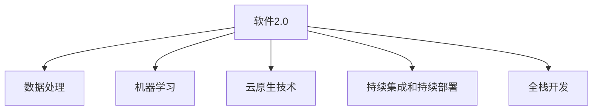

                 

# 软件2.0时代的程序员技能要求

## 1. 背景介绍

### 1.1 问题由来

随着软件2.0时代的到来，程序员的工作模式和技能要求正在发生深刻变革。软件开发从传统的基于静态规则和设计的工作，转变为更加动态、数据驱动的开发过程。软件开发不仅是代码的编写和维护，更涉及到对数据的理解和处理，对用户需求的洞察和响应。

在这一背景下，软件工程师需要掌握更多的跨学科知识，具备更高的技术深度和广度。仅仅掌握一种编程语言和框架已无法满足复杂多变的开发需求。因此，了解软件2.0时代的新技能要求，对于程序员的长期发展和职业成长具有重要意义。

### 1.2 问题核心关键点

软件2.0时代对程序员技能要求的核心关键点包括：
- **数据处理和分析能力**：数据已成为软件开发的灵魂，程序员需要具备处理大规模数据、进行数据分析和数据可视化的能力。
- **编程语言和框架多样性**：掌握多种编程语言和框架，能够适应不同的项目需求和技术栈。
- **云原生技术**：云计算和容器化技术的普及，使得云原生技术成为软件开发的重要组成部分，如微服务、Docker、Kubernetes等。
- **机器学习和人工智能**：结合机器学习和人工智能技术，提升软件系统的智能化水平，如自动测试、推荐系统、语音识别等。
- **前端和后端协同开发**：前端和后端技术的不断融合，要求程序员能够进行全栈开发，提供端到端的应用体验。
- **持续集成和持续部署**：DevOps文化推动软件开发进入持续集成和持续部署阶段，要求程序员具备自动化部署和持续优化能力。

## 2. 核心概念与联系

### 2.1 核心概念概述

软件2.0时代的核心概念包括：

- **软件2.0**：以数据为核心的软件开发模式，强调对数据的处理、分析和应用，数据驱动的决策和优化。
- **数据处理**：从数据采集、清洗、存储到分析和可视化，掌握数据处理的全流程。
- **机器学习**：使用算法和模型从数据中学习知识，提升系统性能和智能化水平。
- **云原生技术**：基于容器化和微服务的软件开发方式，提供弹性、可扩展的解决方案。
- **持续集成和持续部署**：通过自动化手段，持续改进软件质量，快速发布新功能。
- **全栈开发**：掌握前端和后端技术，提供一体化的解决方案。

这些概念之间的逻辑关系可以通过以下Mermaid流程图来展示：



这个流程图展示了软件2.0时代的核心概念及其之间的关系：

1. 软件2.0是整个软件开发的框架，数据处理、机器学习、云原生技术、持续集成和持续部署、全栈开发都是其组成部分。
2. 数据处理是软件2.0的基础，机器学习进一步提升数据处理的智能化水平。
3. 云原生技术为软件2.0提供了弹性、可扩展的技术支撑。
4. 持续集成和持续部署保证了软件开发的效率和质量。
5. 全栈开发是软件2.0时代的重要趋势，前端和后端技术的融合进一步提升了用户体验。

## 3. 核心算法原理 & 具体操作步骤
### 3.1 算法原理概述

软件2.0时代的核心算法原理主要围绕数据处理和机器学习展开。以下是几个关键算法和原理的概述：

- **数据清洗与预处理**：对原始数据进行去重、去噪、归一化等操作，以提高数据的可用性和质量。
- **特征工程**：从原始数据中提取有意义的特征，为后续的机器学习模型训练做准备。
- **监督学习与无监督学习**：利用标注数据训练机器学习模型，或在无标注数据上进行模式识别和聚类。
- **深度学习模型**：使用神经网络模型处理复杂数据，提升预测和分类能力。

### 3.2 算法步骤详解

以下是机器学习模型训练的详细操作步骤：

**Step 1: 数据准备**
- 收集和整理数据，包括清洗、去重、归一化等预处理步骤。
- 将数据划分为训练集和测试集，并进行交叉验证。

**Step 2: 模型选择与设计**
- 根据任务类型选择适合的机器学习模型，如线性回归、决策树、支持向量机等。
- 设计模型架构，确定输入特征、输出标签和训练方式。

**Step 3: 训练模型**
- 使用训练集数据，通过梯度下降等优化算法最小化损失函数。
- 监控训练过程中的性能指标，如准确率、召回率、F1值等。

**Step 4: 模型评估**
- 使用测试集数据对模型进行评估，计算各种指标以衡量模型的泛化能力。
- 根据评估结果调整模型参数，进行超参数优化。

**Step 5: 模型部署**
- 将训练好的模型保存为模型文件，部署到生产环境中。
- 集成到自动化部署工具，实现持续集成和持续部署。

### 3.3 算法优缺点

软件2.0时代机器学习算法的优缺点如下：

**优点**：
- **高效性**：能够处理大规模数据，提升数据驱动决策的效率。
- **准确性**：利用复杂模型和算法，提升预测和分类的准确性。
- **自动化**：通过自动化的模型训练和部署，减少人为干预和错误。

**缺点**：
- **计算资源要求高**：训练复杂模型需要大量的计算资源，如GPU、TPU等。
- **数据依赖性强**：模型效果依赖于高质量的数据，数据不足或噪声问题可能影响效果。
- **模型解释性差**：复杂模型往往难以解释其内部决策机制，存在一定的"黑盒"问题。

### 3.4 算法应用领域

机器学习算法广泛应用于软件2.0时代的各个领域：

- **金融风控**：通过机器学习模型进行信用评估、欺诈检测、市场预测等。
- **医疗诊断**：利用深度学习模型进行图像识别、病灶分析、疾病预测等。
- **推荐系统**：通过协同过滤和协同矩阵分解等算法，提升用户体验和满意度。
- **智能客服**：结合自然语言处理和机器学习技术，提升客户服务质量。
- **智慧城市**：通过数据分析和机器学习，提升城市管理效率和公共服务水平。

## 4. 数学模型和公式 & 详细讲解 & 举例说明
### 4.1 数学模型构建

在机器学习模型中，常用的数学模型包括线性回归、逻辑回归、决策树、随机森林、支持向量机、神经网络等。以线性回归模型为例，其基本形式为：

$$ y = \theta^T x + b $$

其中 $y$ 为输出标签，$x$ 为输入特征向量，$\theta$ 为模型参数，$b$ 为偏置项。

### 4.2 公式推导过程

线性回归模型的推导过程如下：

假设训练集中有 $n$ 个样本，每个样本有 $m$ 个特征 $(x_{i1}, x_{i2}, ..., x_{im})$ 和对应的标签 $y_i$。我们的目标是通过这些样本训练一个线性回归模型 $y = \theta^T x + b$。

对于每个样本 $i$，我们构造损失函数：

$$ L = \frac{1}{2n} \sum_{i=1}^n (y_i - (\theta^T x_i + b))^2 $$

最小化损失函数，通过梯度下降算法更新参数 $\theta$ 和 $b$：

$$ \theta = \theta - \alpha (\frac{\partial L}{\partial \theta}) $$
$$ b = b - \alpha (\frac{\partial L}{\partial b}) $$

其中 $\alpha$ 为学习率，控制每次参数更新的幅度。

### 4.3 案例分析与讲解

以房价预测为例，假设我们有一个包含房屋特征（面积、房间数等）和房价的数据集。我们可以将特征表示为向量 $x$，房价表示为标签 $y$。训练一个线性回归模型，通过最小化损失函数来预测新房屋的房价。

```python
import numpy as np
from sklearn.linear_model import LinearRegression
from sklearn.metrics import mean_squared_error

# 假设有一个包含50个样本的数据集
X = np.array([[100, 3], [200, 4], [150, 2], ...]).T
y = np.array([100000, 200000, 150000, ...])

# 创建线性回归模型
model = LinearRegression()

# 训练模型
model.fit(X, y)

# 预测新房屋房价
new_x = np.array([[180, 4]])
pred_y = model.predict(new_x)

# 评估模型性能
print('Mean Squared Error:', mean_squared_error(y, pred_y))
```

通过上述代码，我们可以训练一个线性回归模型，用于预测新房屋的房价。模型训练过程中，通过最小化损失函数来更新模型参数，预测新房屋的房价时，使用训练好的模型进行预测，并计算均方误差评估模型性能。

## 5. 项目实践：代码实例和详细解释说明
### 5.1 开发环境搭建

在软件2.0时代，开发环境搭建的重要性日益凸显。以下是使用Python和Jupyter Notebook搭建开发环境的详细步骤：

1. 安装Anaconda：从官网下载并安装Anaconda，用于创建独立的Python环境。
```bash
conda create -n pyenv python=3.8 
conda activate pyenv
```

2. 安装必要的库：安装Python的科学计算库，如NumPy、Pandas、Scikit-learn等。
```bash
conda install numpy pandas scikit-learn
```

3. 安装Jupyter Notebook：
```bash
conda install jupyter notebook
```

4. 启动Jupyter Notebook：
```bash
jupyter notebook
```

在Jupyter Notebook中，可以编写Python代码、展示输出结果、进行数据可视化等。

### 5.2 源代码详细实现

以下是一个使用Python和Scikit-learn库进行房价预测的示例代码：

```python
import numpy as np
from sklearn.linear_model import LinearRegression
from sklearn.metrics import mean_squared_error

# 假设有一个包含50个样本的数据集
X = np.array([[100, 3], [200, 4], [150, 2], ...]).T
y = np.array([100000, 200000, 150000, ...])

# 创建线性回归模型
model = LinearRegression()

# 训练模型
model.fit(X, y)

# 预测新房屋房价
new_x = np.array([[180, 4]])
pred_y = model.predict(new_x)

# 评估模型性能
print('Mean Squared Error:', mean_squared_error(y, pred_y))
```

**代码解读与分析**：
- 使用NumPy创建输入特征和标签数组。
- 创建线性回归模型，并使用训练集数据进行训练。
- 使用训练好的模型对新房屋的特征进行预测，并计算均方误差。

### 5.3 代码解读与分析

在上述代码中，我们使用了Scikit-learn库中的LinearRegression模型进行房价预测。代码的每一部分都有明确的注释，便于理解。

- `numpy`库用于创建和处理数据。
- `LinearRegression`模型用于线性回归训练和预测。
- `mean_squared_error`函数用于评估模型性能。

## 6. 实际应用场景
### 6.1 智能推荐系统

智能推荐系统是软件2.0时代的重要应用场景之一。通过机器学习模型对用户行为和偏好进行分析和预测，为用户推荐个性化的商品和服务。

在实现过程中，我们需要收集用户的历史行为数据，包括浏览、购买、评价等行为，并提取相关特征。使用机器学习模型对用户特征和商品特征进行匹配，计算用户对商品的兴趣程度，从而生成推荐列表。

### 6.2 智能客服

智能客服系统通过自然语言处理和机器学习技术，提升客户服务质量和效率。系统能够理解客户的需求，自动生成回复，甚至进行情感分析，及时发现和处理客户的不满情绪。

在智能客服系统的开发中，我们需要收集和处理大量的客户对话数据，使用机器学习模型对客户语言进行分析和理解，从而生成自动回复和对话策略。

### 6.3 医疗诊断

医疗诊断是软件2.0时代的重要应用场景，通过机器学习模型对医疗数据进行分析和预测，辅助医生进行诊断和治疗决策。

在医疗诊断中，我们需要收集和处理大量的医疗数据，包括病历、影像、实验室检查结果等。使用机器学习模型对数据进行分析和预测，判断患者的病情和治疗方案。

### 6.4 金融风控

金融风控是软件2.0时代的另一个重要应用场景。通过机器学习模型对客户信用数据、交易数据进行分析，判断客户的信用风险和交易行为，从而降低金融风险。

在金融风控中，我们需要收集和处理大量的金融数据，包括贷款申请、信用卡消费、交易记录等。使用机器学习模型对数据进行分析和预测，评估客户的信用风险和交易行为，制定相应的风控策略。

## 7. 工具和资源推荐
### 7.1 学习资源推荐

软件2.0时代的程序员需要掌握跨学科的知识，以下是一些推荐的学习资源：

- **《Python数据分析实战》**：介绍Python在数据处理、数据分析和可视化中的应用。
- **《机器学习实战》**：介绍机器学习的基本概念、算法和实现。
- **《深度学习入门》**：介绍深度学习的基本原理和应用。
- **《数据科学导论》**：介绍数据科学的基本概念和技能。
- **《自然语言处理综论》**：介绍自然语言处理的基本技术和应用。

### 7.2 开发工具推荐

软件开发工具的选择对程序员的效率和效果有很大影响，以下是一些推荐的软件开发工具：

- **Jupyter Notebook**：用于编写和展示Python代码，支持数据可视化和交互式计算。
- **PyCharm**：一款流行的Python IDE，提供了丰富的开发工具和调试功能。
- **Visual Studio Code**：一款轻量级的代码编辑器，支持多种编程语言和插件。
- **Git**：版本控制工具，支持分布式协作开发和代码管理。
- **Docker**：容器化技术，支持应用在不同环境下的部署和运维。

### 7.3 相关论文推荐

软件2.0时代的核心技术论文涵盖了机器学习、深度学习、数据科学等领域。以下是一些推荐的论文：

- **《深度学习》**：斯坦福大学的机器学习课程，介绍了深度学习的基本概念和应用。
- **《TensorFlow 2.0实战》**：介绍TensorFlow 2.0的使用和应用。
- **《Kaggle机器学习竞赛指南》**：介绍了机器学习竞赛的流程和技巧。
- **《Scikit-learn文档》**：Scikit-learn库的官方文档，提供了丰富的机器学习算法和应用实例。

## 8. 总结：未来发展趋势与挑战
### 8.1 研究成果总结

软件2.0时代对程序员技能要求的研究和实践，主要集中在以下几个方面：

- **数据处理**：掌握数据清洗、数据预处理、数据可视化等技能。
- **机器学习**：掌握机器学习模型的选择、训练和评估。
- **云计算和容器化**：掌握云原生技术、持续集成和持续部署等技能。
- **全栈开发**：掌握前端和后端技术，提供一体化的解决方案。

这些研究和实践不仅丰富了程序员的技能要求，也为软件开发提供了新的思路和方法。

### 8.2 未来发展趋势

软件2.0时代的未来发展趋势包括：

- **数据驱动**：数据驱动将成为软件开发的重要方向，程序员需要具备更强的数据分析和处理能力。
- **智能化**：机器学习和人工智能技术的应用将进一步提升软件系统的智能化水平。
- **云计算和容器化**：云原生技术将成为软件开发的重要基础，持续集成和持续部署将更广泛应用。
- **全栈开发**：前端和后端技术的融合将进一步增强用户体验和系统性能。

### 8.3 面临的挑战

尽管软件2.0时代带来了诸多机遇，但也面临一些挑战：

- **数据质量**：数据质量和处理难度较大，数据依赖性较强。
- **模型复杂性**：机器学习模型结构复杂，难以解释其内部机制。
- **资源消耗**：机器学习模型训练和推理需要大量的计算资源。
- **安全性和隐私**：数据安全和隐私保护成为重要问题，需要严格的数据管理和处理。

### 8.4 研究展望

未来，软件2.0时代的研究方向包括：

- **数据治理**：建立数据治理机制，保障数据质量和隐私。
- **模型解释性**：提升机器学习模型的可解释性，增强决策透明度。
- **自动化**：开发自动化工具，提升软件开发的效率和质量。
- **智能交互**：结合自然语言处理和机器学习技术，提升人机交互质量。
- **跨学科融合**：结合跨学科知识，推动软件开发和应用的创新。

## 9. 附录：常见问题与解答

**Q1：如何提升数据处理能力？**

A: 提升数据处理能力需要掌握数据清洗、数据预处理、数据可视化等技能。可以使用Python中的Pandas、NumPy等库进行数据处理，使用Matplotlib、Seaborn等库进行数据可视化。

**Q2：机器学习模型如何选择？**

A: 选择合适的机器学习模型需要根据任务类型和数据特点进行选择。一般来说，线性回归适合简单回归任务，决策树和随机森林适合分类任务，支持向量机适合高维数据分类任务。

**Q3：如何进行模型训练和评估？**

A: 模型训练和评估需要使用机器学习库，如Scikit-learn、TensorFlow等。一般使用交叉验证和均方误差等指标进行模型评估，通过超参数优化提高模型性能。

**Q4：如何提高机器学习模型的可解释性？**

A: 提高机器学习模型的可解释性需要采用可解释性模型，如决策树、线性回归等。还可以使用特征可视化、局部可解释模型等方法，提升模型的可解释性。

**Q5：如何实现自动化开发和部署？**

A: 实现自动化开发和部署需要使用持续集成和持续部署工具，如Jenkins、Travis CI等。通过自动化测试、自动化部署等技术，提升开发和部署效率。

通过以上学习和实践，相信你能够更好地掌握软件2.0时代的技能要求，提升自己在软件开发中的竞争力和创新能力。

