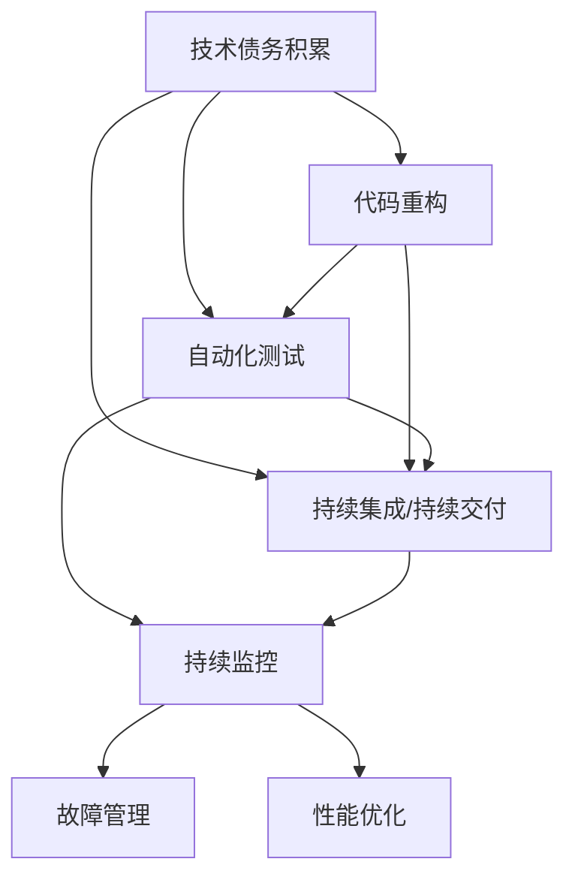

                 

# 软件2.0的技术债务管理策略

## 1. 背景介绍

### 1.1 问题由来
随着软件行业的发展，“技术债务”(Tech Debt)这一概念逐渐成为业界关注的焦点。技术债务，通常指在软件开发过程中，由于急于求成、代码质量欠佳等原因，导致未来需要额外时间和资源进行技术维护和改进的债务。这一现象在快速迭代和敏捷开发的大背景下尤为普遍。

### 1.2 问题核心关键点
技术债务的显著特征在于其累积性和潜在的破坏性。长期积累的技术债务会引发代码质量下降、维护成本增加、项目延期等严重问题，阻碍软件系统的健康发展。为有效管理技术债务，首先需要理解其成因和影响，然后通过系统化的策略进行预防和治理。

## 2. 核心概念与联系

### 2.1 核心概念概述

技术债务管理（Tech Debt Management）是指通过一系列方法、工具和策略，识别、分析和降低软件系统中的技术债务，保持软件系统健康、高效运转的过程。其核心在于预防、早期识别和快速修复，避免技术债务的积累和蔓延。

软件2.0是业界关于未来软件演进方向的共识，强调自动化、可维护性、可扩展性和安全性。在软件2.0中，技术债务管理将变得尤为重要，因为自动化水平和持续集成/持续交付（CI/CD）成为常态。

### 2.2 核心概念原理和架构的 Mermaid 流程图



该图展示了大规模软件开发中的关键概念及其相互关系：技术债务的积累可能导致代码重构、自动化测试和持续集成/持续交付的实施。持续监控和故障管理有助于快速发现和修复问题，性能优化则进一步提升系统性能和稳定性。

## 3. 核心算法原理 & 具体操作步骤

### 3.1 算法原理概述

技术债务管理算法旨在通过自动化和持续监控手段，识别并解决软件系统中的技术债务问题。其核心原理包括：

- 自动发现问题：利用代码分析和静态分析工具，自动发现代码质量问题、潜在故障等技术债务。
- 优先级排序：根据技术债务的严重程度和影响范围，对问题进行优先级排序。
- 快速修复：针对高优先级问题，优先进行代码重构、性能优化等修复工作。
- 持续监控：通过持续集成和监控系统，实时跟踪技术债务变化情况，确保系统健康。

### 3.2 算法步骤详解

技术债务管理算法通常包括以下步骤：

1. **需求分析**：分析项目需求，识别关键业务流程和核心功能。
2. **风险评估**：评估项目的潜在风险和挑战，识别可能的代码质量问题和性能瓶颈。
3. **自动发现问题**：利用静态代码分析工具，如SonarQube、Pylint等，自动发现代码中的技术债务。
4. **优先级排序**：根据技术债务的严重程度和影响范围，对问题进行优先级排序。
5. **自动化修复**：针对高优先级问题，采用自动化工具进行代码重构和性能优化。
6. **持续监控和反馈**：通过持续集成和监控系统，实时跟踪技术债务变化情况，收集反馈信息，进一步优化技术债务管理策略。

### 3.3 算法优缺点

技术债务管理算法的优点包括：

- 自动化程度高：利用自动化工具提高技术债务发现和修复的效率。
- 实时监控：通过持续集成和监控系统，实时跟踪技术债务变化，及时响应。
- 数据驱动：基于实际数据和分析结果进行决策，科学合理。

然而，该算法也存在一些缺点：

- 初始投资大：需要引入和配置自动化工具，初始投入较高。
- 技术复杂：涉及多种工具和技术的集成，实施难度较大。
- 依赖持续投入：技术债务管理是一个长期过程，需要持续投入和维护。

### 3.4 算法应用领域

技术债务管理算法广泛应用于各种软件开发项目，特别是在大型、复杂系统的构建和维护过程中。以下是几个典型的应用场景：

- **Web开发**：对于高流量、高并发需求的Web应用，技术债务管理尤为重要。
- **移动应用**：移动应用快速迭代，代码质量问题频发，技术债务管理能有效提升应用性能和稳定性。
- **企业系统**：企业系统复杂度高，功能丰富，技术债务管理有助于保障系统的健康运行。
- **大数据处理**：大数据处理对性能和扩展性要求高，技术债务管理可提升系统的可维护性和效率。

## 4. 数学模型和公式 & 详细讲解 & 举例说明

### 4.1 数学模型构建

技术债务管理算法可构建以下数学模型：

设软件系统的技术债务总额为 $T$，某时刻识别出的技术债务总额为 $T_0$，已修复的技术债务总额为 $R$，新增的技术债务总额为 $N$。则有：

$$
T = T_0 + R + N
$$

其中，$R$ 可视为技术债务管理的效果，$N$ 为系统运行过程中新增的技术债务。

### 4.2 公式推导过程

根据上述模型，我们可以推导出技术债务管理的效果：

1. **识别和修复技术债务**：通过代码分析工具自动发现技术债务 $N$，并由开发团队进行修复 $R$。
2. **监控和评估**：实时监控系统运行状态，统计新增的技术债务 $N$ 和已修复的技术债务 $R$。
3. **优化策略**：根据监控结果，调整技术债务管理策略，优化 $N$ 和 $R$ 的比例。

### 4.3 案例分析与讲解

假设某Web应用的技术债务总额为 $T_0 = 100$。某月新增技术债务 $N_1 = 20$，修复技术债务 $R_1 = 15$。则技术债务总额变为：

$$
T_1 = 100 + 20 - 15 = 105
$$

若下月新增技术债务 $N_2 = 10$，修复技术债务 $R_2 = 20$，则技术债务总额变为：

$$
T_2 = 105 + 10 - 20 = 95
$$

可以看出，通过有效的技术债务管理，$T$ 值逐渐减小，系统健康度提升。

## 5. 项目实践：代码实例和详细解释说明

### 5.1 开发环境搭建

技术债务管理算法的实现需要依赖多个开发工具和环境。以下是一个基本的开发环境搭建步骤：

1. **安装开发环境**：确保开发环境满足最新版本的Python和必要的库（如Pip、pipenv）。
2. **配置自动化工具**：安装和配置自动化工具，如SonarQube、Jenkins、Slack等，实现代码分析和持续集成。
3. **数据收集和存储**：设置数据收集机制，使用数据库或日志系统记录技术债务数据，如代码质量问题、性能瓶颈等。

### 5.2 源代码详细实现

以下是一个基于Python的技术债务管理算法实现示例：

```python
import sonarqube  # 导入SonarQube分析模块
from jenkins import Jenkins  # 导入Jenkins API模块

# 配置SonarQube
sonar = sonarqube.SonarQube('http://sonarqube.com', 'user', 'password')

# 获取代码质量报告
report = sonar.get_project('project_name')
debt_count = report['technicalDebt']

# 配置Jenkins
jenkins = Jenkins('http://jenkins.com', 'user', 'password')

# 定义技术债务阈值
debt_threshold = 50

# 判断是否触发修复操作
if debt_count > debt_threshold:
    jenkins.create_job('fix_debt', 'python')
```

### 5.3 代码解读与分析

上述代码展示了技术债务管理的核心逻辑：

1. **获取代码质量报告**：通过SonarQube获取项目的技术债务数据。
2. **设定技术债务阈值**：根据项目需求，设定技术债务的警戒线。
3. **触发修复操作**：当技术债务超过阈值时，自动触发Jenkins修复操作。

代码的简洁性和可读性体现了技术债务管理算法的自动化特性。

### 5.4 运行结果展示

运行上述代码后，可以在Jenkins上创建自动化修复任务，自动执行代码重构和性能优化。通过持续监控和反馈，可以实时跟踪技术债务的变化情况，确保系统健康。

## 6. 实际应用场景

### 6.1 Web开发

对于Web应用，技术债务管理尤为重要。Web应用的快速迭代和频繁更新，使得代码质量问题频发。通过技术债务管理算法，可及时发现和修复代码问题，提升应用性能和稳定性。

### 6.2 移动应用

移动应用开发周期短、更新快，代码质量问题难以全面覆盖。技术债务管理算法可有效识别和修复代码问题，提升应用质量和用户体验。

### 6.3 企业系统

企业系统复杂度高，功能丰富，技术债务管理有助于保障系统的健康运行。通过持续监控和修复，可有效提升系统稳定性和可靠性。

### 6.4 大数据处理

大数据处理对性能和扩展性要求高，技术债务管理可提升系统的可维护性和效率。通过持续优化和监控，可有效降低技术债务，提升系统性能。

## 7. 工具和资源推荐

### 7.1 学习资源推荐

为了帮助开发者系统掌握技术债务管理的理论基础和实践技巧，这里推荐一些优质的学习资源：

1. 《软件2.0：未来软件开发之道》：介绍软件2.0的发展趋势和最佳实践，包含技术债务管理的核心策略。
2. 《持续交付：软件研发精进之道》：深入讲解持续交付、持续集成等DevOps实践，包含技术债务管理的具体案例。
3. 《SonarQube权威指南》：详细阐述SonarQube的使用方法，提供代码质量分析和技术债务管理工具。
4. 《DevOps实践指南》：涵盖DevOps的核心实践，包括持续集成、持续交付、持续监控等技术债务管理相关内容。
5. 《Jenkins权威指南》：详细介绍Jenkins的使用方法，包含持续集成和自动化修复工具的实现技巧。

通过对这些资源的学习实践，相信你一定能够快速掌握技术债务管理的精髓，并用于解决实际的开发问题。

### 7.2 开发工具推荐

高效的技术债务管理离不开优秀的工具支持。以下是几款常用的技术债务管理工具：

1. **SonarQube**：开源的代码质量分析工具，支持多种编程语言，可自动发现代码中的技术债务问题。
2. **Jenkins**：开源的持续集成和持续交付工具，支持自动化任务和修复操作，确保代码质量。
3. **Slack**：实时沟通工具，用于技术债务管理的监控和反馈。
4. **GitLab**：集成了持续集成、代码审查等功能的项目管理工具，提供完整的技术债务管理支持。
5. **GitHub**：开源代码托管平台，提供代码分析和持续集成功能，帮助管理技术债务。

合理利用这些工具，可以显著提升技术债务管理的效率，降低开发成本，提高代码质量。

### 7.3 相关论文推荐

技术债务管理的研究源于学界的持续探索。以下是几篇具有代表性的相关论文，推荐阅读：

1. 《Technical Debt Management in Software Development》：对技术债务管理进行了全面的文献综述，提出了多种技术债务管理策略。
2. 《Code Smells and Technical Debt: A Study of Open Source Java Projects》：通过实证研究，分析了代码异味与技术债务的关系，提出了改进措施。
3. 《Technical Debt in Software Engineering: Costs and Consequences》：介绍了技术债务的概念、类型和影响，提供了具体的管理策略。
4. 《A Survey of Software Architecture and Technical Debt in Big Data Technologies》：分析了大数据技术中技术债务的特点和应对措施。
5. 《Debt Management in Software Development: A Systematic Review》：对技术债务管理的研究现状进行了系统总结，提供了最新的研究成果。

这些论文代表了大规模软件开发中技术债务管理的最新进展，为后续研究提供了重要参考。

## 8. 总结：未来发展趋势与挑战

### 8.1 总结

本文对技术债务管理的理论基础和实践方法进行了全面系统的介绍。首先阐述了技术债务管理的背景和重要性，明确了其在软件2.0演进中的关键作用。其次，从原理到实践，详细讲解了技术债务管理的数学模型和核心步骤，提供了代码实现的示例。同时，本文还广泛探讨了技术债务管理在Web开发、移动应用、企业系统、大数据处理等多个领域的应用前景，展示了技术债务管理的广泛应用潜力。此外，本文精选了技术债务管理的各类学习资源和开发工具，力求为开发者提供全方位的技术指引。

通过本文的系统梳理，可以看到，技术债务管理在软件开发中具有重要的地位。通过合理运用自动化工具和持续监控手段，可以有效预防和降低技术债务，保持软件系统的健康和高效运行。未来，伴随技术债务管理方法的持续演进，必将进一步提升软件系统的稳定性和可维护性，为软件2.0的实现提供有力保障。

### 8.2 未来发展趋势

展望未来，技术债务管理技术将呈现以下几个发展趋势：

1. **自动化程度提高**：自动化工具将进一步普及和优化，提升技术债务管理的效率和精度。
2. **数据驱动决策**：基于大数据和人工智能技术，进行更科学的技术债务分析和优化。
3. **跨领域应用**：技术债务管理将从软件开发扩展到更多的工程领域，如基础设施、安全等领域。
4. **生态系统完善**：更多的开源工具和平台将支持技术债务管理，形成一个完整的技术生态系统。
5. **技术债务溯源**：引入区块链等技术，实现技术债务的追溯和审计，增强系统的透明性和可控性。

这些趋势凸显了技术债务管理技术的广阔前景。通过不断探索和实践，技术债务管理必将在未来的软件开发中发挥更大的作用，为构建健康、高效、可持续的软件系统奠定坚实基础。

### 8.3 面临的挑战

尽管技术债务管理技术已经取得了显著进展，但在实际应用过程中仍面临诸多挑战：

1. **初始投入大**：技术债务管理涉及多种工具和技术的集成，初始投入和维护成本较高。
2. **持续改进难**：技术债务管理需要持续进行，容易因忽视或资源不足而停滞。
3. **数据质量问题**：技术债务管理依赖数据收集和分析，数据质量直接影响分析结果。
4. **文化障碍**：技术债务管理需要全员参与，涉及开发、运维等多个团队，文化障碍可能影响效果。
5. **工具依赖性**：技术债务管理高度依赖自动化工具，工具的选择和配置对效果有直接影响。

### 8.4 研究展望

为了克服这些挑战，未来的研究需要在以下几个方面寻求新的突破：

1. **引入人工智能技术**：利用机器学习和数据分析技术，提升技术债务管理的精度和效率。
2. **优化工具生态系统**：推动开源社区和商业工具的协同发展，提供更多的技术债务管理工具和平台。
3. **加强文化建设**：推广技术债务管理的理念和实践，建立跨团队、跨部门的协同机制。
4. **引入区块链技术**：利用区块链的可追溯性和透明性，实现技术债务的持续跟踪和审计。
5. **推动标准化**：制定技术债务管理的行业标准，促进不同系统和工具之间的互操作性。

这些研究方向的探索，必将引领技术债务管理技术迈向更高的台阶，为软件开发质量的提升提供有力支撑。面向未来，技术债务管理技术需要与更多技术相结合，共同推动软件2.0的实现和发展。

## 9. 附录：常见问题与解答

**Q1：技术债务管理是否可以适用于所有软件开发项目？**

A: 技术债务管理适用于绝大多数软件开发项目，特别是复杂度较高、更新频繁的项目。对于小规模、低复杂度的项目，技术债务管理的效果可能不如预期。

**Q2：如何确定技术债务管理的优先级？**

A: 技术债务管理的优先级排序应根据技术债务的严重程度、影响范围和修复难度进行综合评估。通常，高风险、高影响的技术债务应优先处理，确保系统的稳定性和安全性。

**Q3：如何平衡技术债务管理和开发进度？**

A: 技术债务管理应纳入项目计划，合理分配时间和资源。可以通过自动化工具提高技术债务发现和修复的效率，减少对开发进度的影响。

**Q4：技术债务管理是否需要持续进行？**

A: 技术债务管理是一个持续的过程，应定期进行技术债务分析和修复。随着系统的运行和需求的变更，技术债务也会不断变化，持续管理才能保持系统的健康和高效。

**Q5：技术债务管理如何与持续集成/持续交付（CI/CD）结合？**

A: 技术债务管理应与CI/CD流程紧密结合，通过自动化工具和持续监控，及时发现和修复技术债务。持续集成和持续交付可以帮助技术债务管理自动化，提升效率和效果。

总之，技术债务管理在软件2.0演进中具有重要的地位，通过合理运用自动化工具和持续监控手段，可以有效预防和降低技术债务，保持软件系统的健康和高效运行。面向未来，技术债务管理技术需要与更多技术相结合，共同推动软件2.0的实现和发展。

