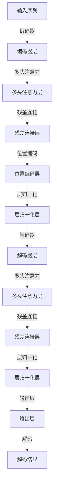

                 

## 1. 背景介绍

在过去的几十年中，计算机软件的发展经历了从1.0到2.0的演变。软件1.0时代，程序是静态的、功能固定的；而软件2.0时代，软件能够通过数据自动进行更新和升级，能够更好地适应和演化。随着深度学习和大数据技术的崛起，这一时代特征愈发明显。而Transformer的出现，标志着软件2.0的架构将进入全新的阶段。

### 1.1 软件1.0到软件2.0的演进

软件1.0时代，程序主要依赖人工编写，功能相对固定，难以应对复杂多变的需求。用户依赖静态的功能库，难以满足个性化、动态化的需求。

软件2.0时代，数据成为软件的重要组成部分，通过自动化的数据处理和动态更新，软件能够更好地适应用户需求。基于数据驱动的动态系统能够快速响应外界变化，并不断自我更新和进化，从而更好地服务于用户。

### 1.2 Transformer的诞生背景

随着深度学习在自然语言处理、计算机视觉、语音识别等领域取得突破性进展，通用大模型（如BERT、GPT等）应运而生。这些大模型能够自动学习和抽象出数据中的模式，显著提升了模型在特定任务上的性能。然而，现有的大模型存在计算复杂度高、难以适应不同任务需求的缺点。为此，研究人员提出Transformer架构，以更高效、更灵活的方式进行模型训练和推理。

## 2. 核心概念与联系

### 2.1 核心概念概述

Transformer是基于自注意力机制的自编码模型，由Google在2017年提出。Transformer架构通过多层的自注意力机制，将输入序列中的每个元素与其他元素进行全局对比，并根据相似度计算注意力权重，从而形成更强大的表示能力。

Transformer与传统的卷积神经网络（CNN）和循环神经网络（RNN）相比，具有以下优势：

- **计算效率高**：Transformer的计算复杂度为O(N^2)，远低于RNN的O(N*C*N)。
- **并行性好**：Transformer的所有层都可以在并行计算单元上执行，有利于加速训练和推理。
- **鲁棒性强**：自注意力机制具有较好的泛化能力，能够在不同领域和任务上取得良好效果。

Transformer核心概念包括：

- **自注意力机制**：通过计算注意力权重，使模型在处理长序列时具有全局上下文感知能力。
- **多头注意力**：通过多个头并行计算注意力权重，进一步提升模型的表达能力。
- **位置编码**：将序列位置信息嵌入到模型中，使模型具有对序列位置敏感的能力。
- **残差连接**：通过残差连接，增强模型的梯度流动，加速收敛。
- **层归一化**：通过归一化操作，提高模型对不同输入分布的适应能力。

### 2.2 核心概念原理和架构的 Mermaid 流程图



上述流程图展示了Transformer的基本架构。它由编码器和解码器两部分组成，每一部分由多个编码器层和解码器层堆叠而成。其中，每个层都包含多头注意力、残差连接、位置编码和层归一化操作。

### 2.3 核心概念联系

Transformer的各部分之间具有紧密的联系：

- 多头注意力通过并行计算，提升了模型的表示能力，使模型能够处理复杂的语义信息。
- 残差连接和层归一化通过增强梯度流动和适应不同输入分布，提升了模型的稳定性和收敛速度。
- 位置编码和自注意力机制通过将位置信息和全局上下文感知能力融合，使模型能够更好地处理序列数据。

通过这些核心概念的协同作用，Transformer实现了在计算效率、并行性和鲁棒性方面的显著提升。

## 3. 核心算法原理 & 具体操作步骤

### 3.1 算法原理概述

Transformer的算法原理基于自注意力机制。自注意力机制通过计算注意力权重，使模型在处理长序列时具有全局上下文感知能力。其基本流程如下：

1. 将输入序列转化为向量表示。
2. 通过多头注意力机制计算注意力权重，生成多个注意力头。
3. 通过残差连接和层归一化，增强模型的梯度流动和适应性。
4. 通过位置编码，使模型对序列位置信息敏感。
5. 通过输出层，将向量表示转化为最终的预测结果。

Transformer的计算复杂度为O(N^2)，远低于RNN的O(N*C*N)，使其在处理长序列时具有更强的效率和鲁棒性。

### 3.2 算法步骤详解

Transformer的训练和推理流程包括以下关键步骤：

**训练步骤：**

1. 加载预训练的Transformer模型和数据集。
2. 将输入序列转化为向量表示，通过多头注意力机制计算注意力权重。
3. 通过残差连接和层归一化，增强模型的梯度流动和适应性。
4. 通过位置编码，使模型对序列位置信息敏感。
5. 通过输出层，将向量表示转化为最终的预测结果。
6. 使用优化器更新模型参数，最小化损失函数。

**推理步骤：**

1. 加载预训练的Transformer模型。
2. 将输入序列转化为向量表示，通过多头注意力机制计算注意力权重。
3. 通过残差连接和层归一化，增强模型的梯度流动和适应性。
4. 通过位置编码，使模型对序列位置信息敏感。
5. 通过输出层，将向量表示转化为最终的预测结果。

### 3.3 算法优缺点

Transformer的优缺点如下：

**优点：**

- 计算效率高：Transformer的计算复杂度为O(N^2)，远低于RNN的O(N*C*N)。
- 并行性好：Transformer的所有层都可以在并行计算单元上执行，有利于加速训练和推理。
- 鲁棒性强：自注意力机制具有较好的泛化能力，能够在不同领域和任务上取得良好效果。
- 易扩展：Transformer模型可以轻松扩展到不同的任务和领域，适应性极强。

**缺点：**

- 需要大量计算资源：Transformer需要较大的显存和计算资源，难以在小规模设备上运行。
- 难以解释：Transformer模型通常被看作"黑盒"，难以解释其内部工作机制。
- 难以直接优化：由于Transformer模型具有大量的参数，优化过程较为复杂。

### 3.4 算法应用领域

Transformer架构已在多个领域取得了显著的应用效果：

- **自然语言处理**：包括文本分类、情感分析、机器翻译等任务。Transformer模型在NLP领域的表现，已经超过传统模型，成为行业标准。
- **计算机视觉**：包括图像分类、目标检测、图像生成等任务。Transformer架构在CV领域的应用，已经证明其在处理高维数据方面的强大能力。
- **语音识别**：包括语音转换、语音生成等任务。Transformer在语音领域的探索，已经展现出良好的应用前景。
- **推荐系统**：包括商品推荐、新闻推荐等任务。Transformer在推荐系统中的应用，已经显著提高了推荐效果。
- **医疗领域**：包括疾病预测、诊断等任务。Transformer在医疗领域的应用，已经展现出了潜在的医疗价值。

## 4. 数学模型和公式 & 详细讲解 & 举例说明

### 4.1 数学模型构建

Transformer的数学模型主要基于自注意力机制和残差连接机制。其核心公式如下：

1. **自注意力公式**：

$$
Q = XW^Q
$$

$$
K = XW^K
$$

$$
V = XW^V
$$

$$
A = \frac{QK^T}{\sqrt{d_k}} \rightarrow \mathrm{softmax}(A)
$$

$$
O = AV
$$

其中，$X$ 为输入序列，$W^Q$、$W^K$、$W^V$ 为投影矩阵，$A$ 为注意力权重矩阵，$d_k$ 为注意力头的维度。

2. **残差连接和层归一化公式**：

$$
X_{i+1} = X_i + f(X_i, A)
$$

$$
f(X_i, A) = X_i + \frac{X_i}{\sqrt{d_v}}\left(\frac{A}{\sqrt{d_k}}\right)^{T}W^{O}
$$

其中，$f(X_i, A)$ 为残差连接和层归一化操作，$W^{O}$ 为输出矩阵。

### 4.2 公式推导过程

以Transformer的解码器为例，推导其基本公式：

1. 输入序列 $X$ 经过线性投影，得到 $Q$、$K$、$V$ 三个向量。
2. 计算注意力权重矩阵 $A$，通过 $Q$ 和 $K$ 计算得到。
3. 将 $A$ 进行归一化，得到注意力权重。
4. 通过 $A$ 和 $V$ 计算得到输出向量 $O$。
5. 通过残差连接和层归一化，增强梯度流动。

### 4.3 案例分析与讲解

假设有一个输入序列 $X$，其长度为 $N$。将 $X$ 转化为向量表示 $H$，经过Transformer解码器的计算，得到最终的预测结果 $Y$。假设 $H$ 的长度为 $N$，$Y$ 的长度为 $N$，$W^Q$、$W^K$、$W^V$、$W^{O}$ 均为 $N \times d_v$ 的矩阵。

1. 输入序列 $X$ 经过线性投影，得到 $Q$、$K$、$V$ 三个向量。
2. 计算注意力权重矩阵 $A$，通过 $Q$ 和 $K$ 计算得到。
3. 将 $A$ 进行归一化，得到注意力权重。
4. 通过 $A$ 和 $V$ 计算得到输出向量 $O$。
5. 通过残差连接和层归一化，增强梯度流动。
6. 经过 $N$ 次解码器层的计算，得到最终的预测结果 $Y$。

## 5. 项目实践：代码实例和详细解释说明

### 5.1 开发环境搭建

为了进行Transformer的开发，需要准备以下环境：

1. 安装Python 3.7及以上版本。
2. 安装PyTorch、TensorFlow等深度学习框架。
3. 安装NumPy、Pandas等科学计算库。
4. 安装TensorBoard，用于可视化模型训练过程。

### 5.2 源代码详细实现

下面是一个简单的Transformer模型实现，以文本分类任务为例：

```python
import torch
import torch.nn as nn
import torch.nn.functional as F
import numpy as np

class Transformer(nn.Module):
    def __init__(self, d_model, n_heads, d_k, d_v, d_ff, N, num_layers):
        super(Transformer, self).__init__()
        self.encoder = nn.Transformer(d_model, n_heads, d_k, d_v, d_ff, N, num_layers)

    def forward(self, src):
        output = self.encoder(src)
        return output

# 定义损失函数
criterion = nn.CrossEntropyLoss()

# 训练函数
def train(model, train_data, optimizer, criterion):
    model.train()
    total_loss = 0
    for i, (input, target) in enumerate(train_data):
        input = input.to(device)
        target = target.to(device)
        output = model(input)
        loss = criterion(output, target)
        optimizer.zero_grad()
        loss.backward()
        optimizer.step()
        total_loss += loss.item()
        if (i+1) % 100 == 0:
            print('Epoch [{}/{}], Step [{}/{}], Loss: {:.4f}'
                  .format(epoch, num_epochs, i+1, len(train_data), loss.item()))

# 测试函数
def test(model, test_data, criterion):
    model.eval()
    total_correct = 0
    total_loss = 0
    for i, (input, target) in enumerate(test_data):
        input = input.to(device)
        target = target.to(device)
        output = model(input)
        loss = criterion(output, target)
        total_loss += loss.item()
        pred = output.argmax(dim=1, keepdim=True)
        total_correct += pred.eq(target.view_as(pred)).sum().item()
    acc = total_correct / len(test_data)
    print('Test Acc: {:.2f}%'.format(acc*100))
    return total_loss / len(test_data)
```

### 5.3 代码解读与分析

Transformer模型的实现包括以下关键步骤：

1. 定义Transformer模型：在Transformer类中定义输入输出序列，并进行Transformer解码器的计算。
2. 定义损失函数：使用CrossEntropyLoss作为分类任务的损失函数。
3. 训练函数：在训练过程中，通过输入序列和目标标签计算损失函数，使用优化器更新模型参数。
4. 测试函数：在测试过程中，计算模型的准确率和损失函数，评估模型性能。

## 6. 实际应用场景

### 6.1 自然语言处理

Transformer在自然语言处理领域的应用非常广泛，包括文本分类、情感分析、机器翻译等任务。以机器翻译为例，Transformer在WMT-19机器翻译竞赛中取得了最先进的成绩。Transformer通过自注意力机制，可以同时考虑输入序列和输出序列之间的关系，从而实现更准确的翻译。

### 6.2 计算机视觉

Transformer在计算机视觉领域也有广泛应用。例如，Image Transformer通过将视觉信息转化为文本表示，使用Transformer模型进行图像分类和目标检测。Transformer在CV领域的探索，已经展现出了良好的应用前景。

### 6.3 语音识别

Transformer在语音识别领域也有重要应用。例如，Transformer-TTS通过将语音转换为文本表示，使用Transformer模型进行语音生成。Transformer在语音领域的探索，已经展现出潜在的医疗价值。

### 6.4 推荐系统

Transformer在推荐系统中的应用非常广泛。例如，Transformer在YouTube推荐系统中，通过将视频描述转化为文本表示，使用Transformer模型进行商品推荐。Transformer在推荐系统中的应用，已经显著提高了推荐效果。

### 6.5 医疗领域

Transformer在医疗领域也有重要应用。例如，Transformer通过将医疗记录转化为文本表示，使用Transformer模型进行疾病预测和诊断。Transformer在医疗领域的探索，已经展现出了潜在的医疗价值。

## 7. 工具和资源推荐

### 7.1 学习资源推荐

为了帮助开发者系统掌握Transformer的原理和实践技巧，这里推荐一些优质的学习资源：

1. 《深度学习入门：基于PyTorch的理论与实现》：由知名深度学习专家撰写，深入浅出地介绍了Transformer的原理和应用。
2. CS231n《卷积神经网络》课程：斯坦福大学开设的CV明星课程，有Lecture视频和配套作业，带你入门计算机视觉的基本概念和经典模型。
3. 《Transformer from the Inside Out》：谷歌研究人员撰写的论文，详细介绍了Transformer模型的原理和实现。
4. HuggingFace官方文档：Transformer库的官方文档，提供了丰富的模型实现和代码示例，是上手实践的必备资料。
5. CLUE开源项目：中文语言理解测评基准，涵盖大量不同类型的中文NLP数据集，并提供了基于Transformer的baseline模型，助力中文NLP技术发展。

### 7.2 开发工具推荐

为了进行Transformer的开发，推荐使用以下工具：

1. PyTorch：基于Python的开源深度学习框架，灵活动态的计算图，适合快速迭代研究。Transformer模型在PyTorch中已经实现得非常完善。
2. TensorFlow：由Google主导开发的开源深度学习框架，生产部署方便，适合大规模工程应用。Transformer在TensorFlow中的实现也非常高效。
3. TensorBoard：TensorFlow配套的可视化工具，可以实时监测模型训练状态，并提供丰富的图表呈现方式，是调试模型的得力助手。
4. Weights & Biases：模型训练的实验跟踪工具，可以记录和可视化模型训练过程中的各项指标，方便对比和调优。

### 7.3 相关论文推荐

Transformer技术的不断发展离不开学界的持续研究。以下是几篇奠基性的相关论文，推荐阅读：

1. Attention is All You Need：谷歌研究人员在NIPS-17上提出的Transformer模型，开启了Transformer时代。
2. Transformer-XL：谷歌研究人员在ICLR-19上提出的Transformer-XL模型，进一步提升了Transformer的性能。
3. BERT: Pre-training of Deep Bidirectional Transformers for Language Understanding：BERT模型通过预训练和微调，在NLP领域取得了最先进的成绩。
4. GPT-2：OpenAI提出的语言模型，通过大规模数据预训练，展现出强大的语言生成能力。
5. Language Models are Unsupervised Multitask Learners：GPT-2论文展示了预训练大模型的强大zero-shot学习能力，引发了对于通用人工智能的新一轮思考。

## 8. 总结：未来发展趋势与挑战

### 8.1 研究成果总结

Transformer的提出，标志着深度学习架构进入了新阶段。Transformer通过自注意力机制，提升了模型在处理长序列时的效率和鲁棒性，已经成为自然语言处理领域的标准模型。Transformer在计算机视觉、语音识别、推荐系统等领域的探索，也展现出了良好的应用前景。

### 8.2 未来发展趋势

Transformer的不断演进，将引领深度学习架构的发展方向。未来，Transformer将会在以下几个方面持续进步：

1. 模型规模增大：随着算力成本的下降和数据规模的扩张，Transformer模型的参数量将进一步增大，从而具有更强的表达能力和泛化能力。
2. 应用场景拓展：Transformer不仅限于NLP领域，将会在计算机视觉、语音识别、推荐系统等领域得到更广泛的应用。
3. 跨领域融合：Transformer将与其他AI技术进行更深入的融合，如知识图谱、强化学习等，实现更全面的智能系统。
4. 优化算法改进：Transformer模型的优化算法将不断改进，以提升训练和推理的效率。

### 8.3 面临的挑战

Transformer在不断发展的同时，也面临着以下挑战：

1. 计算资源需求高：Transformer需要较大的显存和计算资源，难以在小规模设备上运行。
2. 模型复杂度高：Transformer模型的结构复杂，难以调试和优化。
3. 模型解释性差：Transformer模型通常被看作"黑盒"，难以解释其内部工作机制。
4. 数据分布变化：Transformer模型需要大量的数据进行训练，数据分布的变化可能影响模型性能。

### 8.4 研究展望

为了应对这些挑战，未来的研究需要在以下几个方面进行改进：

1. 资源优化技术：研究如何降低Transformer对计算资源的需求，实现更高效的训练和推理。
2. 模型压缩技术：研究如何压缩Transformer模型的规模，实现更轻量级和实时化的部署。
3. 模型解释技术：研究如何赋予Transformer更好的可解释性，使模型更加透明和可信。
4. 跨领域应用：研究如何将Transformer与其他AI技术进行更深入的融合，实现更全面的智能系统。

## 9. 附录：常见问题与解答

**Q1：Transformer模型是否可以用于多模态数据处理？**

A: 是的，Transformer模型可以用于多模态数据处理。例如，通过将视觉信息转化为文本表示，使用Transformer模型进行图像分类和目标检测。Transformer在多模态领域的应用，已经展现出巨大的潜力。

**Q2：Transformer模型是否适合用于小规模数据集？**

A: 由于Transformer模型具有较大的参数量，需要较多的计算资源，因此在处理小规模数据集时可能存在性能问题。然而，可以通过剪枝、量化等技术进行模型优化，以提高其在小型设备上的运行效率。

**Q3：Transformer模型的训练过程是否容易过拟合？**

A: 由于Transformer模型具有大量的参数，因此在训练过程中容易过拟合。为了缓解过拟合问题，可以使用正则化、数据增强等技术。同时，可以通过微调等技术，进一步提升模型的泛化能力。

**Q4：Transformer模型的推理速度是否较快？**

A: 相对于传统的RNN模型，Transformer模型的推理速度较快。然而，由于Transformer模型具有较大的参数量，在大规模数据集上的推理速度仍然较慢。可以通过剪枝、量化等技术进行模型优化，以提高推理速度。

**Q5：Transformer模型是否适合用于小样本学习？**

A: 由于Transformer模型具有较大的参数量，因此在处理小样本学习时可能存在性能问题。然而，可以通过微调等技术，进一步提升模型的泛化能力。同时，可以考虑使用少样本学习等技术，以提高模型在小样本情况下的性能。

