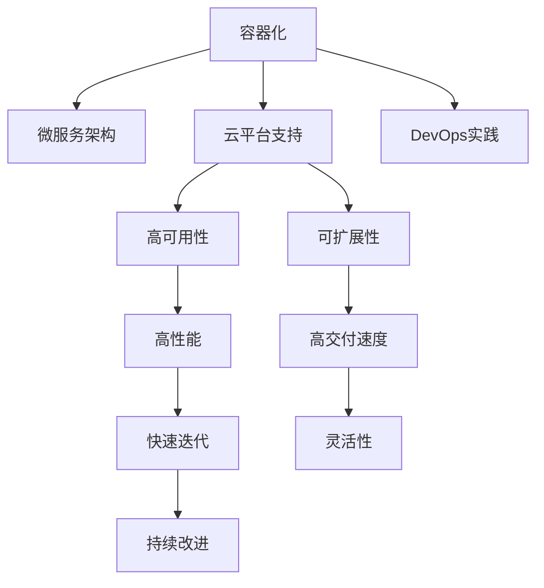

                 

# 软件2.0的高可移植性

> 关键词：软件可移植性, 代码复用, 云计算, 分布式系统, 微服务架构, DevOps, 容器化, Kubernetes

## 1. 背景介绍

### 1.1 问题由来

随着信息技术的发展，软件开发范式经历了从软件1.0到软件2.0的演进。软件1.0时代，开发者主要关注代码的编译和链接，强调本地环境和部署。然而，这种基于本地的开发和部署模式，存在诸多局限：

- **环境依赖性强**：不同项目之间环境差异巨大，难以复用。
- **部署复杂度高**：需要针对不同操作系统和硬件进行繁琐的部署和配置。
- **扩展性差**：系统难以进行水平扩展，业务模块无法独立部署和升级。

软件2.0时代，随着云计算和容器技术的兴起，软件开发的关注点从编译、链接转向了代码复用和部署，强调了开发与生产环境的分离，以及云平台的高效性和灵活性。这一变革带来了高可移植性的软件开发范式，使得软件应用更易在多种环境下快速部署和扩展。

### 1.2 问题核心关键点

软件2.0时代的高可移植性，其核心在于通过容器化、微服务、云平台等技术手段，将应用程序和其运行环境解耦，实现更高效、更灵活的软件部署与扩展。具体来说，它包括以下几个关键点：

- **容器化技术**：通过Docker等容器技术，将应用和其依赖打包为容器镜像，确保运行环境的一致性和可移植性。
- **微服务架构**：将大型应用拆分为一组独立运行、可互操作的服务，提升系统的灵活性和扩展性。
- **云平台支持**：借助云平台如AWS、Azure、Google Cloud等，实现应用的弹性伸缩和负载均衡。
- **DevOps实践**：通过持续集成(CI)、持续部署(CD)、自动化测试等DevOps实践，提高软件的交付速度和质量。

这些关键技术共同构成了软件2.0的高可移植性，为软件应用的跨平台、跨环境、跨团队协作提供了有力支持。

## 2. 核心概念与联系

### 2.1 核心概念概述

为了更好地理解软件2.0的高可移植性，本节将介绍几个密切相关的核心概念：

- **容器化**：通过将应用和其依赖打包为容器镜像，确保运行环境的一致性和可移植性。
- **微服务架构**：将大型应用拆分为一组独立运行、可互操作的服务，提升系统的灵活性和扩展性。
- **云平台**：提供弹性计算、存储、网络等基础设施服务，支持应用的高可用性和可扩展性。
- **DevOps**：通过自动化、持续集成、持续部署等实践，提高软件的交付速度和质量。

这些核心概念之间的逻辑关系可以通过以下Mermaid流程图来展示：



这个流程图展示了大语言模型的核心概念及其之间的关系：

1. 容器化和微服务架构为云平台提供了灵活、高效的资源管理手段，实现了应用的弹性伸缩和负载均衡。
2. DevOps实践通过自动化和持续交付，提升了软件的交付速度和质量，支持云平台的高效管理。
3. 云平台提供了高可用性和可扩展性，保障了应用的稳定性和可靠性。
4. 高性能、灵活性和快速迭代性，使得应用能够更好地适应市场变化，持续改进。

## 3. 核心算法原理 & 具体操作步骤
### 3.1 算法原理概述

软件2.0的高可移植性，本质上是通过一系列技术手段，实现了应用和其运行环境的解耦，确保应用在不同环境下的高效运行和快速部署。其核心思想包括：

- **环境隔离**：通过容器化技术，将应用和其依赖隔离在一个虚拟的运行环境中，确保环境的一致性和可移植性。
- **服务解耦**：将大型应用拆分为一组独立运行、可互操作的服务，提升系统的灵活性和扩展性。
- **资源管理**：借助云平台，实现应用的弹性计算、存储和网络资源管理，支持应用的高可用性和可扩展性。
- **持续交付**：通过DevOps实践，实现软件的自动化、持续集成和持续部署，提高交付速度和质量。

这些技术手段共同构建了软件2.0的高可移植性，使得软件应用能够更好地适应不同的环境和需求，提升开发和运维的效率。

### 3.2 算法步骤详解

软件2.0的高可移植性实现过程一般包括以下几个关键步骤：

**Step 1: 容器化应用**

- 将应用及其依赖打包为容器镜像，使用Docker等容器引擎进行管理和部署。
- 使用Dockerfile定义容器构建规则，指定应用运行所需的依赖和配置。
- 构建容器镜像并推送至云平台镜像仓库。

**Step 2: 拆分服务模块**

- 将应用拆分为一组独立的服务模块，每个服务独立运行、可互操作。
- 设计服务间的通信协议，如REST API、gRPC等，确保服务间的稳定交互。
- 将服务模块进行版本控制，支持持续开发和迭代。

**Step 3: 搭建云平台**

- 选择合适的云平台，如AWS、Azure、Google Cloud等。
- 配置云平台的基础设施，如虚拟机、存储、负载均衡等。
- 安装和管理容器引擎，支持容器镜像的部署和运行。

**Step 4: 实施DevOps实践**

- 配置持续集成系统，如Jenkins、GitLab CI等，自动构建和测试容器镜像。
- 配置持续部署系统，如Spinnaker、Jenkins Pipeline等，自动化部署容器镜像。
- 实施自动化测试，如单元测试、集成测试、性能测试等，确保软件质量。

**Step 5: 部署和管理服务**

- 将容器镜像部署到云平台，使用Kubernetes等容器编排工具管理服务。
- 配置Kubernetes集群，设置服务的资源分配和负载均衡。
- 监控和优化服务性能，确保服务的高可用性和可扩展性。

以上是软件2.0高可移植性实现的一般流程。在实际应用中，还需要针对具体项目的需求，对各个环节进行优化设计，如改进容器镜像大小、优化服务模块设计、引入更多的云平台服务、调整DevOps实践流程等，以进一步提升系统的性能和可靠性。

### 3.3 算法优缺点

软件2.0的高可移植性具有以下优点：

1. **环境隔离**：通过容器化，确保应用在不同环境中的运行一致性，避免了环境依赖性的问题。
2. **服务解耦**：将应用拆分为独立服务，提升了系统的灵活性和扩展性，便于团队协同开发。
3. **资源管理**：借助云平台，实现了资源的弹性管理和高效利用，提升了系统的可扩展性和可用性。
4. **持续交付**：通过自动化和持续交付，提高了软件的交付速度和质量，缩短了市场响应时间。

同时，这种技术范式也存在一些局限性：

1. **学习曲线陡峭**：对容器化和云平台技术需要一定的学习和掌握成本。
2. **性能损耗**：容器化带来了一定的性能损耗，需要通过优化容器镜像和配置进行优化。
3. **管理复杂度**：系统管理的复杂度增加，需要专业的运维团队进行管理。
4. **成本较高**：云平台的使用需要一定的初始投入，特别是在大规模应用的情况下。

尽管存在这些局限性，但就目前而言，软件2.0的高可移植性已成为主流软件开发范式，广泛应用于企业级系统、云原生应用、微服务架构等场景。未来，相关技术的持续演进和优化，将进一步降低其使用门槛，提升应用的高可移植性。

### 3.4 算法应用领域

软件2.0的高可移植性在多个领域得到了广泛应用，包括但不限于：

- **企业级系统**：通过容器化和微服务架构，构建稳定、灵活的企业级应用，提升业务运行效率。
- **云原生应用**：借助云平台，实现应用的弹性计算、存储和网络资源管理，支持应用的快速部署和扩展。
- **微服务架构**：将大型应用拆分为独立运行的服务，提升系统的灵活性和扩展性，支持高并发和海量数据处理。
- **DevOps实践**：通过自动化和持续交付，提高软件的交付速度和质量，支持快速的市场响应和迭代改进。

此外，软件2.0的高可移植性还广泛应用于数字化转型、人工智能、物联网、大数据等多个领域，为传统行业数字化升级提供了有力支持。

## 4. 数学模型和公式 & 详细讲解 & 举例说明

### 4.1 数学模型构建

软件2.0的高可移植性涉及多个技术层面，包括容器化、微服务、云平台、DevOps等。以下分别从这些层面构建数学模型：

**容器化模型**：
- 容器镜像的大小：$Size_{image} = \text{Application size} + \text{Dependencies size} + \text{Config size}$
- 容器化部署的成本：$Cost_{deploy} = \text{Resource cost} \times \text{Deployment scale}$

**微服务模型**：
- 服务模块的数量：$N_{services} = \text{Total function points} / \text{Function points per service}$
- 服务间的通信延迟：$Delay_{communication} = \text{Service count} \times \text{Communication latency}$

**云平台模型**：
- 弹性计算的性能：$Performance_{elastic} = \text{Computing power} \times \text{Scalability factor}$
- 存储的可扩展性：$Scalability_{storage} = \text{Storage capacity} \times \text{Scalability factor}$

**DevOps模型**：
- 持续交付的周期：$Cycle_{CI/CD} = \text{Code change time} + \text{Testing time} + \text{Deployment time}$
- 软件交付的质量：$Quality_{delivered} = \text{Passing rate of automated tests} \times \text{Code review quality}$

### 4.2 公式推导过程

以下以容器化模型和微服务模型为例，推导其数学公式：

**容器化模型**：
- **容器镜像大小计算**：
  $$
  Size_{image} = \text{Application size} + \text{Dependencies size} + \text{Config size}
  $$
  其中，$\text{Application size}$表示应用本身的代码大小，$\text{Dependencies size}$表示应用依赖的大小，$\text{Config size}$表示应用的配置文件大小。

- **容器化部署成本计算**：
  $$
  Cost_{deploy} = \text{Resource cost} \times \text{Deployment scale}
  $$
  其中，$\text{Resource cost}$表示云平台资源的使用成本，$\text{Deployment scale}$表示应用的部署规模。

**微服务模型**：
- **服务模块数量计算**：
  $$
  N_{services} = \text{Total function points} / \text{Function points per service}
  $$
  其中，$\text{Total function points}$表示整个应用的函数点数量，$\text{Function points per service}$表示每个服务的函数点数量。

- **服务间通信延迟计算**：
  $$
  Delay_{communication} = \text{Service count} \times \text{Communication latency}
  $$
  其中，$\text{Service count}$表示服务模块的数量，$\text{Communication latency}$表示服务间通信的延迟时间。

### 4.3 案例分析与讲解

假设有一个大型电商平台，需要构建一个高可移植性、高性能的云原生应用。具体实现步骤如下：

**Step 1: 容器化应用**
- 应用由前端和后端组成，分别打包为Docker镜像。
- 定义Dockerfile，包括应用依赖和配置文件。
- 使用Docker Push命令将镜像推送至云平台镜像仓库。

**Step 2: 拆分服务模块**
- 将应用拆分为前端服务、后端服务、数据库服务等独立的服务。
- 设计REST API作为服务间的通信协议。
- 将服务模块进行版本控制，使用Git进行管理。

**Step 3: 搭建云平台**
- 在AWS上创建虚拟机，安装Docker引擎。
- 配置负载均衡器，支持服务的访问和负载均衡。
- 使用Kubernetes集群管理服务的资源分配和部署。

**Step 4: 实施DevOps实践**
- 配置Jenkins CI，自动化构建和测试Docker镜像。
- 配置Spinnaker CD，自动化部署Docker镜像。
- 实施单元测试和集成测试，确保软件质量。

**Step 5: 部署和管理服务**
- 将Docker镜像部署至Kubernetes集群，启动服务。
- 配置Kubernetes集群，设置服务的资源分配和负载均衡。
- 使用Prometheus和Grafana监控服务性能，优化资源使用。

通过以上步骤，该电商平台构建了一个高可移植性、高性能的云原生应用，实现了服务的弹性伸缩和负载均衡，提升了系统的灵活性和扩展性。

## 5. 项目实践：代码实例和详细解释说明

### 5.1 开发环境搭建

在进行软件2.0高可移植性实践前，我们需要准备好开发环境。以下是使用Python和Docker进行开发的环境配置流程：

1. 安装Anaconda：从官网下载并安装Anaconda，用于创建独立的Python环境。

2. 创建并激活虚拟环境：
```bash
conda create -n py3k python=3.8 
conda activate py3k
```

3. 安装Docker：从官网下载并安装Docker，并确保服务启动。

4. 编写Dockerfile：定义应用及其依赖的打包规则，如下所示：

```Dockerfile
FROM python:3.8-slim
WORKDIR /app
COPY requirements.txt .
RUN pip install --no-cache-dir -r requirements.txt
COPY . .
EXPOSE 8080
CMD ["python", "app.py"]
```

5. 构建容器镜像：
```bash
docker build -t myapp .
```

6. 运行容器镜像：
```bash
docker run -d -p 8080:8080 myapp
```

完成上述步骤后，即可在`py3k`环境中开始容器化实践。

### 5.2 源代码详细实现

这里我们以一个简单的Web应用为例，给出使用Docker进行容器化的Python代码实现。

首先，编写应用代码：

```python
from flask import Flask
app = Flask(__name__)

@app.route('/')
def index():
    return 'Hello, World!'

if __name__ == '__main__':
    app.run(host='0.0.0.0', port=8080)
```

然后，创建Dockerfile：

```Dockerfile
FROM python:3.8-slim
WORKDIR /app
COPY requirements.txt .
RUN pip install --no-cache-dir -r requirements.txt
COPY . .
EXPOSE 8080
CMD ["python", "app.py"]
```

最后，使用Docker run命令启动应用：

```bash
docker run -d -p 8080:8080 myapp
```

完成以上步骤后，应用即可以作为一个容器镜像运行，实现了环境的隔离和一致性。

### 5.3 代码解读与分析

让我们再详细解读一下关键代码的实现细节：

**Dockerfile**：
- `FROM`指令：指定基础镜像为`python:3.8-slim`。
- `WORKDIR`指令：设置工作目录为`/app`，确保所有命令都在这个目录下执行。
- `COPY`指令：将`requirements.txt`文件和应用代码复制到容器中。
- `RUN`指令：安装Python依赖。
- `EXPOSE`指令：指定应用监听的端口为8080。
- `CMD`指令：指定启动应用的命令。

**应用代码**：
- 定义一个Flask应用，监听8080端口，返回一个简单的"Hello, World!"页面。

通过Docker化实现，应用的运行环境和依赖被完全封装在一个容器中，确保了环境的一致性和可移植性。开发者可以更专注于应用的开发，而不必担心环境配置问题。

## 6. 实际应用场景
### 6.1 智能客服系统

基于软件2.0高可移植性的智能客服系统，能够实现7x24小时不间断服务，快速响应客户咨询，用自然流畅的语言解答各类常见问题。系统采用微服务架构，将问题解答服务、用户管理服务、日志分析服务等模块独立部署，确保了系统的灵活性和扩展性。同时，借助云平台的高可用性和弹性计算能力，系统能够自动应对高峰期流量，确保服务的稳定性和可靠性。

### 6.2 金融舆情监测

金融舆情监测系统需要实时监测市场舆论动向，以便及时应对负面信息传播，规避金融风险。系统采用容器化技术，将数据采集、数据处理、情感分析服务等模块独立部署，确保了各模块的稳定性和可靠性。同时，通过云平台提供的弹性计算资源，系统能够实时处理海量数据，识别舆情变化趋势，快速响应异常情况。

### 6.3 个性化推荐系统

个性化推荐系统需要根据用户的浏览、点击、评论等行为数据，推荐最符合用户兴趣的个性化内容。系统采用微服务架构，将用户行为分析服务、推荐引擎服务、数据存储服务等模块独立部署，确保了各模块的高效性和可扩展性。同时，借助云平台提供的弹性计算和存储资源，系统能够快速处理海量数据，生成个性化的推荐结果。

### 6.4 未来应用展望

随着软件2.0高可移植性技术的不断发展，其在更多领域的应用前景将更加广阔：

- **医疗领域**：通过容器化和微服务架构，构建稳定、灵活的医院管理系统，提升医疗服务的智能化水平，辅助医生诊疗，加速新药开发进程。
- **教育领域**：采用微服务架构，构建智能化的教育平台，因材施教，促进教育公平，提高教学质量。
- **智慧城市治理**：通过容器化和云平台技术，构建智能化的城市管理系统，提高城市管理的自动化和智能化水平，构建更安全、高效的未来城市。

此外，在企业生产、社会治理、文娱传媒等众多领域，基于软件2.0高可移植性的人工智能应用也将不断涌现，为各行各业提供新的技术支持。相信随着技术的不断进步，软件2.0高可移植性必将在更多场景中发挥作用，推动各行业数字化转型升级。

## 7. 工具和资源推荐
### 7.1 学习资源推荐

为了帮助开发者系统掌握软件2.0高可移植性的理论基础和实践技巧，这里推荐一些优质的学习资源：

1. 《Kubernetes: Up and Running》：本书深入浅出地介绍了Kubernetes的原理和实践，是学习容器编排和云平台管理的经典之作。
2. 《Microservices Patterns: Application Architecture with Microservices》：本书系统总结了微服务架构的模式和最佳实践，适合开发和架构师参考。
3. 《DevOps: The Planning Phase》：本书详细介绍了DevOps实践的各个阶段和工具，帮助开发者提升软件的交付速度和质量。
4. 《Docker Cookbook》：这本书提供了大量的Docker实践案例，适合新手快速上手。
5. 《Cloud Computing: Principles and Paradigms》：这本书从原理到实践，全面介绍了云平台的运作机制和应用场景。

通过对这些资源的学习实践，相信你一定能够快速掌握软件2.0高可移植性的精髓，并用于解决实际的NLP问题。

### 7.2 开发工具推荐

高效的开发离不开优秀的工具支持。以下是几款用于软件2.0高可移植性开发的常用工具：

1. Docker：基于Docker的容器化技术，确保应用在不同环境中的运行一致性，降低环境依赖性。
2. Kubernetes：基于Kubernetes的容器编排技术，实现应用的弹性计算和负载均衡，支持高可用性和可扩展性。
3. Jenkins：基于Jenkins的持续集成系统，实现代码的自动化构建和测试，提高开发效率。
4. GitLab CI/CD：基于GitLab的持续交付系统，实现代码的自动化部署和监控，提升软件交付速度。
5. AWS、Azure、Google Cloud：提供弹性计算、存储、网络等基础设施服务，支持应用的快速部署和扩展。

合理利用这些工具，可以显著提升软件2.0高可移植性任务的开发效率，加快创新迭代的步伐。

### 7.3 相关论文推荐

软件2.0高可移植性技术的发展源于学界的持续研究。以下是几篇奠基性的相关论文，推荐阅读：

1. "Containers at Scale: Kubernetes Hosted Multi-Cloud Containers"：论文介绍了Kubernetes在多云环境中的应用，展示了其高可移植性和弹性计算能力。
2. "Microservices: A Personal Perspective"：作者James Lewis系统总结了微服务架构的优缺点，提出了微服务的未来发展方向。
3. "CI/CD is the newOps"：这篇文章探讨了DevOps与传统运维的差异，强调了持续集成和持续交付的重要性。
4. "Implementing the Twelve-Factor App: Cloud Platforms, Microservices, and Containers"：这篇文章介绍了十二因素应用架构的原理和实践，适合开发和架构师参考。

这些论文代表了大语言模型微调技术的发展脉络。通过学习这些前沿成果，可以帮助研究者把握学科前进方向，激发更多的创新灵感。

## 8. 总结：未来发展趋势与挑战

### 8.1 总结

本文对软件2.0高可移植性进行全面系统的介绍。首先阐述了软件2.0时代的高可移植性，明确了容器化、微服务、云平台、DevOps等技术手段的重要性。其次，从原理到实践，详细讲解了高可移植性的数学模型和关键步骤，给出了高可移植性任务开发的完整代码实例。同时，本文还广泛探讨了高可移植性在智能客服、金融舆情、个性化推荐等多个行业领域的应用前景，展示了高可移植性范式的巨大潜力。此外，本文精选了高可移植性的学习资源，力求为读者提供全方位的技术指引。

通过本文的系统梳理，可以看到，软件2.0高可移植性已经成为软件开发的主流范式，极大地拓展了应用的软件开发和部署边界，提升了开发和运维的效率。未来，伴随高可移植性技术的持续演进和优化，其应用范围将更加广泛，为各行各业带来更深远的变革。

### 8.2 未来发展趋势

展望未来，软件2.0高可移植性将呈现以下几个发展趋势：

1. **环境隔离更加细粒度**：通过更细粒度的环境隔离技术，如容器镜像分层、服务模块独立部署等，进一步提升应用的稳定性。
2. **服务解耦更加灵活**：采用更加灵活的服务解耦技术，如API网关、服务网格等，实现服务的动态路由和负载均衡。
3. **云平台更加普适**：借助更加普适的云平台服务，如Serverless、FaaS等，实现更高效的资源管理和更灵活的应用部署。
4. **DevOps更加自动化**：通过更自动化的DevOps实践，如代码扫描、安全测试、环境自构建等，进一步提升软件的交付速度和质量。
5. **应用更加智能化**：将人工智能技术融入高可移植性系统，实现更智能的运维、更高效的资源管理、更个性化的用户服务。

这些趋势凸显了软件2.0高可移植性技术的广阔前景。这些方向的探索发展，将进一步提升应用的可移植性和智能化水平，推动各行业的数字化转型升级。

### 8.3 面临的挑战

尽管软件2.0高可移植性技术已经取得了瞩目成就，但在迈向更加智能化、普适化应用的过程中，它仍面临着诸多挑战：

1. **学习曲线陡峭**：对容器化和云平台技术需要一定的学习和掌握成本，尤其是在大规模应用的情况下。
2. **性能损耗**：容器化带来了一定的性能损耗，需要通过优化容器镜像和配置进行优化。
3. **管理复杂度**：系统管理的复杂度增加，需要专业的运维团队进行管理。
4. **成本较高**：云平台的使用需要一定的初始投入，特别是在大规模应用的情况下。
5. **安全性问题**：容器化环境下的安全性问题，如漏洞利用、攻击等，需要更多的管理和防护措施。

尽管存在这些挑战，但就目前而言，软件2.0高可移植性已成为主流软件开发范式，广泛应用于企业级系统、云原生应用、微服务架构等场景。未来，相关技术的持续演进和优化，将进一步降低其使用门槛，提升应用的可移植性。

### 8.4 研究展望

面对软件2.0高可移植性所面临的种种挑战，未来的研究需要在以下几个方面寻求新的突破：

1. **容器镜像优化**：通过更高效的镜像构建和压缩技术，降低容器镜像的大小和部署成本。
2. **服务模块设计**：采用更灵活、更细粒度的服务模块设计，提升系统的灵活性和扩展性。
3. **云平台性能**：通过更高效的云平台资源管理，提升应用的性能和可靠性。
4. **DevOps自动化**：通过更自动化的DevOps实践，提高软件的交付速度和质量。
5. **安全性保障**：采用更严格的安全防护措施，确保应用的安全性。

这些研究方向将推动软件2.0高可移植性技术的进一步发展和完善，为构建安全、可靠、可扩展的智能化系统铺平道路。面向未来，高可移植性技术还需要与其他人工智能技术进行更深入的融合，如知识表示、因果推理、强化学习等，多路径协同发力，共同推动自然语言理解和智能交互系统的进步。只有勇于创新、敢于突破，才能不断拓展软件系统的边界，让智能技术更好地造福人类社会。

## 9. 附录：常见问题与解答

**Q1：软件2.0高可移植性是否适用于所有软件开发项目？**

A: 软件2.0高可移植性适用于大多数软件开发项目，尤其是大型、复杂、多团队协作的系统。但对于一些规模较小、依赖简单的项目，使用传统的开发和部署方式可能更为合适。

**Q2：采用软件2.0高可移植性需要投入哪些额外的资源？**

A: 采用软件2.0高可移植性需要投入额外的容器化技术、云平台服务、DevOps工具等资源，可能会增加初始投入和维护成本。但这些成本可以随着项目的成熟和规模的扩大而摊薄，长期来看可能带来更高的收益。

**Q3：如何评估软件2.0高可移植性系统的性能和可扩展性？**

A: 评估软件2.0高可移植性系统的性能和可扩展性，需要从多个维度进行测试，包括：
1. 容器镜像大小和部署成本。
2. 服务模块的数量和通信延迟。
3. 云平台提供的资源弹性。
4. DevOps实践的自动化程度和交付速度。
5. 系统的稳定性和可用性。

通过综合评估这些指标，可以全面了解系统的性能和可扩展性，及时发现和解决问题。

**Q4：如何优化软件2.0高可移植性系统的资源使用？**

A: 优化软件2.0高可移植性系统的资源使用，可以从以下几个方面入手：
1. 容器镜像的大小和构建效率。
2. 服务模块的拆分和组合。
3. 云平台的资源配置和弹性管理。
4. DevOps实践的自动化程度和工具选择。
5. 系统的监控和优化策略。

通过优化这些环节，可以最大化利用资源，提升系统的性能和可靠性。

**Q5：如何保障软件2.0高可移植性系统的安全性？**

A: 保障软件2.0高可移植性系统的安全性，可以从以下几个方面入手：
1. 容器镜像的安全扫描和验证。
2. 云平台的安全配置和管理。
3. DevOps实践的安全审计和防护。
4. 系统的安全监控和告警机制。

通过全面保障系统各个环节的安全性，可以确保应用的安全稳定运行。

---

作者：禅与计算机程序设计艺术 / Zen and the Art of Computer Programming

