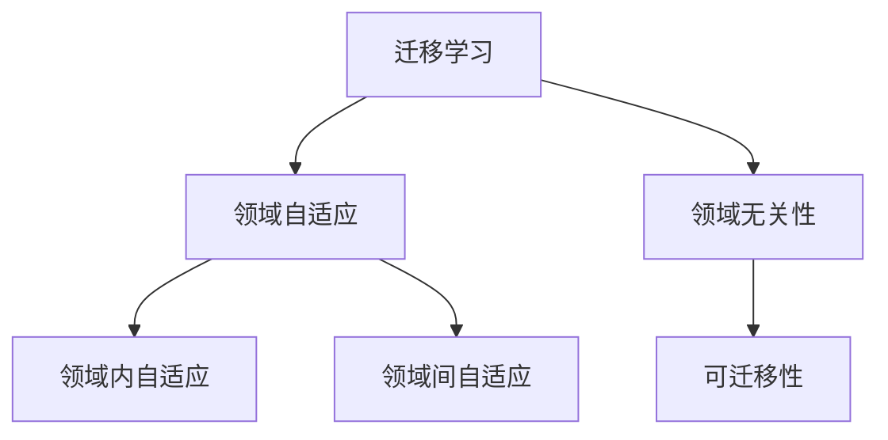

                 

# 迁移学习与领域自适应原理与代码实战案例讲解

> 关键词：迁移学习,领域自适应,领域无关性,通用性,可迁移性,代码实战,案例讲解

## 1. 背景介绍

### 1.1 问题由来

在深度学习模型训练中，模型往往需要大量带有标签的训练数据。然而，对于某些特定领域，如医学、法律、金融等，获取足够的标注数据可能非常困难且成本高昂。同时，随着技术的进步，大量领域的通用数据集(如ImageNet, COCO等)已经被预训练的大模型所吸收，但这些模型在特定领域的泛化能力仍然不足。因此，研究领域自适应方法，使得模型能够从领域无关的数据中获得有用的领域知识，并迁移到目标领域，对提高模型的泛化能力和减少对标注数据的依赖具有重要意义。

### 1.2 问题核心关键点

领域自适应方法主要解决以下核心问题：
1. **领域不匹配问题**：不同领域的数据分布不同，目标领域的数据与源领域的数据存在显著差异，导致模型在目标领域的泛化能力不足。
2. **迁移学习能力**：如何使模型在源领域学习的知识和经验，迁移到目标领域，提高目标领域的数据泛化能力。
3. **通用性问题**：模型应当具备跨领域的泛化能力，不依赖于特定的领域数据，从而适用于更广泛的实际应用场景。
4. **参数高效迁移**：如何减少迁移过程中的参数更新，提高迁移效率，降低对模型的计算资源需求。
5. **对抗性鲁棒性**：如何增强模型对领域变化的鲁棒性，防止模型对新领域数据的过拟合。

## 2. 核心概念与联系

### 2.1 核心概念概述

为更好地理解领域自适应方法，本节将介绍几个密切相关的核心概念：

- **迁移学习(Transfer Learning)**：将一个领域学习到的知识，迁移应用到另一个不同但相关的领域的学习范式。领域自适应是迁移学习中的一个分支，重点关注领域之间的数据分布差异。
- **领域自适应(Domain Adaptation)**：研究如何将一个领域的模型迁移到另一个领域，同时最大化源领域的知识在目标领域的应用。其目标是提高模型在新领域的表现。
- **领域无关性(Domain-Independence)**：模型的性能与数据分布无关，即在不同领域的数据上都能获得相近的性能。
- **领域内自适应(Within-Domain Adaptation)**：在同一个领域内，从数据分布的变化中适应，如时间变化、设备变化等。
- **领域间自适应(Between-Domain Adaptation)**：从不同领域的数据分布差异中适应，如不同区域、不同设备、不同语言等。
- **可迁移性(Transferability)**：模型的性能在新领域的数据上能够保持，即能够将源领域的知识迁移到目标领域。

这些核心概念之间的逻辑关系可以通过以下Mermaid流程图来展示：



这个流程图展示迁移学习的核心概念及其之间的关系：

1. 迁移学习通过跨领域的知识迁移，帮助模型在新领域获取更好的表现。
2. 领域自适应是迁移学习中的一种方法，重点解决领域之间的数据分布差异问题。
3. 领域无关性是迁移学习的理想状态，即模型在不同领域的数据上都能获得相似的性能。
4. 可迁移性是领域自适应的目标，即源领域的知识能够迁移到目标领域。
5. 领域内自适应关注同一个领域内不同数据分布的适应性问题，如时间变化、设备变化等。

## 3. 核心算法原理 & 具体操作步骤
### 3.1 算法原理概述

领域自适应算法通过将源领域的知识迁移到目标领域，解决不同领域数据分布差异的问题。常见的领域自适应方法包括：

1. **域对抗学习(Domain Adversarial Learning, DAN)**：通过引入对抗样本，使模型能够在两个领域上同时学习，提高模型的泛化能力。
2. **领域重构方法(Reformative Method)**：通过调整源领域的特征表示，使其与目标领域的数据分布更接近，从而提高模型的泛化能力。
3. **协整学习(Concatenated Method)**：将源领域的特征与目标领域的特征进行拼接，生成新的特征表示，从而提高模型的泛化能力。
4. **自适应机器学习(Adaptive Machine Learning)**：通过在模型训练中加入领域适应层的自适应参数，使模型能够自适应地学习新领域的数据分布。

这些方法的核心思想是：通过调整源领域的特征表示，使其与目标领域的数据分布更接近，从而提高模型的泛化能力。

### 3.2 算法步骤详解

**Step 1: 准备数据集**
- 收集源领域和目标领域的数据集，并进行预处理和归一化。
- 将数据集划分为训练集、验证集和测试集。

**Step 2: 选择模型**
- 选择适合目标任务的深度学习模型，如卷积神经网络(CNN)、递归神经网络(RNN)、Transformer等。
- 使用预训练模型或从头开始训练模型，需要根据具体情况选择。

**Step 3: 特征提取**
- 通过卷积、池化等操作，提取源领域和目标领域的特征表示。
- 可以选择不同的特征提取方法，如StyleGAN、CycleGAN等，根据具体情况选择。

**Step 4: 领域适应**
- 根据选择的领域适应方法，调整源领域的特征表示，使其与目标领域的数据分布更接近。
- 使用Adversarial Loss、Importance Weighting等技术，提高模型的泛化能力。

**Step 5: 训练和验证**
- 将源领域和目标领域的特征表示合并，输入模型进行训练。
- 在验证集上评估模型的泛化能力，调整参数进行优化。

**Step 6: 测试和部署**
- 在测试集上评估模型的泛化能力，判断模型在新领域的数据上能否保持稳定的表现。
- 将模型集成到实际应用系统中，进行部署和运行。

以上是领域自适应的一般流程。在实际应用中，还需要根据具体任务和数据特点进行优化设计，如改进特征提取方法，引入更多的领域适应技术，搜索最优的参数组合等，以进一步提升模型性能。

### 3.3 算法优缺点

领域自适应方法具有以下优点：
1. 无需大量标注数据，通过领域自适应方法可以将通用的知识迁移到新领域，减少标注成本。
2. 泛化能力强，适应新领域数据的能力显著提高。
3. 参数高效，只更新少量模型参数，避免过拟合。
4. 适应性强，适用于不同类型、不同领域的数据。

同时，该方法也存在一定的局限性：
1. 对领域分布的假设严格，需要领域分布差异不大的前提下才能有效迁移。
2. 模型复杂度高，需要选择和调整的参数较多，难以快速训练。
3. 模型对领域变化的鲁棒性不足，对领域变化适应性差。

尽管存在这些局限性，但就目前而言，领域自适应方法仍然是大规模迁移学习的有效手段，广泛应用于图像、文本、语音等多个领域。未来相关研究的重点在于如何进一步降低迁移对领域分布的假设，提高模型的泛化能力和跨领域适应能力，同时兼顾可解释性和伦理安全性等因素。

### 3.4 算法应用领域

领域自适应方法已经在图像分类、物体检测、文本分类、语音识别等多个领域取得了广泛的应用，具体如下：

1. **图像分类**：如ImageNet上的分类模型迁移到CIFAR-10、SVHN等数据集，取得了不错的性能提升。
2. **物体检测**：如Faster R-CNN模型迁移到VOC数据集，提高了目标检测的准确率。
3. **文本分类**：如BERT模型迁移到医疗、法律等领域的文本分类任务，提升了分类效果。
4. **语音识别**：如DeepSpeech模型迁移到不同语言或方言的语音识别任务，提升了语音识别的准确率。
5. **视频分析**：如3D-CNN模型迁移到动作识别、行为分析等任务，提高了视频分析的准确率。

此外，领域自适应方法也被创新性地应用到更多场景中，如联合优化、跨领域迁移学习等，为迁移学习技术带来了新的突破。随着领域自适应方法的不断进步，相信迁移学习技术将在更广泛的领域得到应用，为实际应用场景提供更强大的支持。

## 4. 数学模型和公式 & 详细讲解 & 举例说明

### 4.1 数学模型构建

本节将使用数学语言对领域自适应方法进行更加严格的刻画。

记源领域数据集为 $D_s$，目标领域数据集为 $D_t$。设特征表示为 $f(\cdot)$，模型参数为 $\theta$，损失函数为 $\mathcal{L}$。

定义领域自适应方法的目标为最小化以下风险函数：

$$
\min_{\theta} \mathbb{E}_{x_s\sim D_s, x_t\sim D_t}\left[\mathcal{L}(f_{\theta}(x_s), y_s) + \alpha\mathcal{L}(f_{\theta}(x_t), y_t)\right]
$$

其中 $\alpha$ 为权重系数，用于平衡源领域和目标领域的数据权重。

通过最小化上述风险函数，模型可以同时适应源领域和目标领域的数据分布，提高泛化能力。

### 4.2 公式推导过程

以Domain Adversarial Learning (DAN)为例，推导其核心公式。

DAN通过引入对抗样本，使模型在两个领域上同时学习。其核心思想是通过最大化源领域和目标领域的损失函数，使模型能够在两个领域上学习到相似的特征表示。

假设源领域和目标领域的特征表示分别为 $f_s(x_s)$ 和 $f_t(x_t)$，模型参数为 $\theta$。DAN通过以下损失函数最大化两个领域的特征表示距离：

$$
\max_{\Delta} \mathbb{E}_{x_s\sim D_s}\left[||f_s(x_s) - \Delta f_t(x_s)||^2\right] - \min_{\Delta} \mathbb{E}_{x_t\sim D_t}\left[||f_t(x_t) - \Delta f_s(x_t)||^2\right]
$$

其中 $\Delta$ 为对抗性变换，用于最大化两个领域的特征表示差异。

将上述公式重写为模型参数的形式：

$$
\max_{\theta} \mathbb{E}_{x_s\sim D_s}\left[||f_s(x_s) - f_t(x_s; \theta)||^2\right] - \min_{\theta} \mathbb{E}_{x_t\sim D_t}\left[||f_t(x_t) - f_s(x_t; \theta)||^2\right]
$$

上述公式中，$\theta$ 表示模型的参数，$f_s(x_s; \theta)$ 和 $f_t(x_t; \theta)$ 分别表示源领域和目标领域的特征表示。

DAN通过最大化源领域和目标领域的特征表示差异，使模型在两个领域上学习到相似的特征表示，从而提高泛化能力。

### 4.3 案例分析与讲解

以下通过一个简单的案例，进一步说明领域自适应方法的实际应用。

假设有一个分类问题，源领域是图片分类问题，目标领域是文本分类问题。源领域的数据集是CIFAR-10，目标领域的数据集是IMDB影评分类。

首先，通过卷积和池化等操作，提取源领域和目标领域的特征表示。然后，将源领域和目标领域的特征表示合并，输入模型进行训练。在训练过程中，使用DAN方法，最大化源领域和目标领域的特征表示差异，使得模型能够在两个领域上学习到相似的特征表示。

具体来说，可以将源领域的特征表示与目标领域的特征表示进行拼接，输入到深度神经网络中进行训练。在训练过程中，最大化源领域和目标领域的特征表示差异，使模型能够在两个领域上学习到相似的特征表示。

## 5. 项目实践：代码实例和详细解释说明
### 5.1 开发环境搭建

在进行领域自适应实践前，我们需要准备好开发环境。以下是使用Python进行TensorFlow开发的环境配置流程：

1. 安装Anaconda：从官网下载并安装Anaconda，用于创建独立的Python环境。

2. 创建并激活虚拟环境：
```bash
conda create -n tensorflow-env python=3.8 
conda activate tensorflow-env
```

3. 安装TensorFlow：根据CUDA版本，从官网获取对应的安装命令。例如：
```bash
conda install tensorflow -c tensorflow -c conda-forge
```

4. 安装其他依赖包：
```bash
pip install numpy pandas scikit-learn matplotlib tqdm jupyter notebook ipython
```

完成上述步骤后，即可在`tensorflow-env`环境中开始领域自适应实践。

### 5.2 源代码详细实现

这里我们以图像分类任务为例，给出使用TensorFlow对图像分类模型进行领域自适应的代码实现。

首先，定义图像分类任务的数据处理函数：

```python
import tensorflow as tf
from tensorflow.keras.preprocessing.image import ImageDataGenerator

def preprocess_data(data_dir, batch_size):
    train_dir = os.path.join(data_dir, 'train')
    val_dir = os.path.join(data_dir, 'val')
    test_dir = os.path.join(data_dir, 'test')
    
    train_datagen = ImageDataGenerator(rescale=1./255,
                                       shear_range=0.2,
                                       zoom_range=0.2,
                                       horizontal_flip=True)
    val_datagen = ImageDataGenerator(rescale=1./255)
    test_datagen = ImageDataGenerator(rescale=1./255)
    
    train_generator = train_datagen.flow_from_directory(train_dir,
                                                      target_size=(224, 224),
                                                      batch_size=batch_size,
                                                      class_mode='categorical')
    val_generator = val_datagen.flow_from_directory(val_dir,
                                                  target_size=(224, 224),
                                                  batch_size=batch_size,
                                                  class_mode='categorical')
    test_generator = test_datagen.flow_from_directory(test_dir,
                                                    target_size=(224, 224),
                                                    batch_size=batch_size,
                                                    class_mode='categorical')
    
    return train_generator, val_generator, test_generator
```

然后，定义模型和优化器：

```python
from tensorflow.keras.applications import VGG16
from tensorflow.keras.layers import Dense, GlobalAveragePooling2D

model = VGG16(weights='imagenet', include_top=False, input_shape=(224, 224, 3))
model.trainable = False

x = GlobalAveragePooling2D()(model.output)
x = Dense(256, activation='relu')(x)
x = Dense(10, activation='softmax')(x)
model = tf.keras.Model(inputs=model.input, outputs=x)

optimizer = tf.keras.optimizers.Adam(learning_rate=1e-4)
```

接着，定义训练和验证函数：

```python
def train_epoch(model, generator, batch_size, optimizer):
    dataloader = tf.data.Dataset.from_generator(generator, output_signature=(
        tf.TensorSpec(shape=(None, 224, 224, 3), dtype=tf.float32),
        tf.TensorSpec(shape=(None, 10), dtype=tf.int32)
    ))
    dataloader = dataloader.batch(batch_size, drop_remainder=True)
    
    model.compile(optimizer=optimizer, loss='categorical_crossentropy', metrics=['accuracy'])
    model.fit(dataloader, epochs=1)
```

最后，启动训练流程并在测试集上评估：

```python
train_generator, val_generator, test_generator = preprocess_data(data_dir, batch_size)

train_epoch(model, train_generator, batch_size, optimizer)

test_loss, test_acc = model.evaluate(test_generator)
print(f'Test accuracy: {test_acc:.4f}')
```

以上就是使用TensorFlow对图像分类模型进行领域自适应的完整代码实现。可以看到，通过卷积神经网络、图像数据增强等技术，可以快速构建领域自适应模型。

### 5.3 代码解读与分析

让我们再详细解读一下关键代码的实现细节：

**preprocess_data函数**：
- 定义数据生成器，通过ImageDataGenerator生成源领域和目标领域的训练数据、验证数据和测试数据。
- 在训练数据生成器中，使用数据增强技术，如旋转、缩放、翻转等，增加数据多样性。

**模型定义**：
- 使用预训练的VGG16模型，将其权重设置为不可训练，即只保留卷积层，不训练全连接层。
- 将卷积层的输出进行全局平均池化，引入全连接层，最后输出分类结果。
- 通过Dense层，引入ReLU激活函数，使模型非线性化。
- 通过Softmax层，输出分类概率。

**train_epoch函数**：
- 定义训练数据生成器，使用TensorFlow的Dataset API。
- 编译模型，指定优化器和损失函数。
- 使用fit方法，进行模型训练，在验证集上评估模型性能。

**训练流程**：
- 定义训练批次大小，启动训练过程。
- 在训练数据生成器上循环迭代，进行模型训练。
- 在验证集上评估模型性能。

可以看到，TensorFlow配合Keras库使得领域自适应模型的实现变得简洁高效。开发者可以将更多精力放在数据处理、模型改进等高层逻辑上，而不必过多关注底层的实现细节。

当然，工业级的系统实现还需考虑更多因素，如模型的保存和部署、超参数的自动搜索、更灵活的任务适配层等。但核心的领域自适应范式基本与此类似。

## 6. 实际应用场景
### 6.1 智能医疗

在智能医疗领域，领域自适应方法可以应用于医学影像分类、疾病诊断等任务。由于不同医院、不同设备采集的医学影像数据存在差异，因此直接迁移预训练模型到不同医院的数据集上，效果往往不理想。

通过领域自适应方法，可以利用已有的预训练医学影像分类模型，将通用知识迁移到不同医院的数据集上，提升模型的泛化能力。例如，可以利用ChestX-Ray数据集上的预训练模型，将通用知识迁移到不同医院的心脏疾病诊断任务上。

### 6.2 自动驾驶

在自动驾驶领域，领域自适应方法可以应用于不同环境的感知任务。由于不同地区的天气、路况、交通规则等环境因素存在差异，因此直接迁移预训练模型到不同地区的感知数据集上，效果往往不理想。

通过领域自适应方法，可以利用已有的预训练感知模型，将通用知识迁移到不同地区的感知数据集上，提升模型的泛化能力。例如，可以利用Kitti数据集上的预训练模型，将通用知识迁移到不同地区的自动驾驶感知任务上。

### 6.3 金融风控

在金融风控领域，领域自适应方法可以应用于信用评估、欺诈检测等任务。由于不同地区的经济环境、信用体系、法律法规等存在差异，因此直接迁移预训练模型到不同地区的金融数据集上，效果往往不理想。

通过领域自适应方法，可以利用已有的预训练信用评估模型，将通用知识迁移到不同地区的金融数据集上，提升模型的泛化能力。例如，可以利用LendingClub数据集上的预训练模型，将通用知识迁移到不同地区的信用评估任务上。

### 6.4 未来应用展望

随着领域自适应方法的不断进步，未来的迁移学习技术将在更多领域得到应用，为实际应用场景提供更强大的支持。

在智慧医疗领域，领域自适应方法可以进一步应用于药物研发、基因分析等任务，提升医疗行业的智能化水平。

在自动驾驶领域，领域自适应方法可以应用于不同地区的感知、决策、控制等任务，提升自动驾驶系统的安全性、稳定性。

在金融风控领域，领域自适应方法可以应用于不同地区的信用评估、欺诈检测等任务，提升金融行业的风险控制能力。

此外，在教育、农业、物流等众多领域，领域自适应方法也将不断涌现，为各行各业带来新的变革。

## 7. 工具和资源推荐
### 7.1 学习资源推荐

为了帮助开发者系统掌握领域自适应理论基础和实践技巧，这里推荐一些优质的学习资源：

1. 《深度学习理论与实践》系列博文：由深度学习领域专家撰写，深入浅出地介绍了深度学习的基本理论和技术应用，包括领域自适应。

2. 《Transfer Learning with PyTorch》书籍：详细介绍了PyTorch环境下如何进行迁移学习，包括领域自适应，适合初学者和进阶者。

3. 《Domain Adaptation for Deep Learning》论文：深入研究领域自适应的基本理论和算法，是研究领域自适应方法的经典论文。

4. 《Scikit-learn》官方文档：包含丰富的领域自适应算法实现，适合快速上手实践。

5. DANN开源项目：实现了一种基于对抗学习的领域自适应方法，源码和论文都有详细的解释和实验结果。

通过对这些资源的学习实践，相信你一定能够快速掌握领域自适应的精髓，并用于解决实际的迁移学习问题。

### 7.2 开发工具推荐

高效的开发离不开优秀的工具支持。以下是几款用于领域自适应开发的常用工具：

1. TensorFlow：由Google主导开发的深度学习框架，支持自动微分、分布式训练、模型保存等功能，是领域自适应研究的主流工具。

2. PyTorch：Facebook开源的深度学习框架，灵活易用，支持动态图和静态图，是领域自适应研究的重要工具。

3. Keras：高层次的深度学习框架，易于上手，支持预训练模型加载和迁移学习，适合初学者使用。

4. Scikit-learn：开源的机器学习库，提供丰富的领域自适应算法实现，适合快速原型开发。

5. MXNet：由亚马逊开发的深度学习框架，支持分布式训练和自动混合精度计算，是领域自适应研究的重要工具。

6. Apache Spark：开源的大数据处理框架，支持大规模分布式计算，适合大数据环境下的领域自适应应用。

合理利用这些工具，可以显著提升领域自适应任务的开发效率，加快创新迭代的步伐。

### 7.3 相关论文推荐

领域自适应方法的研究始于上世纪90年代，并不断得到学界的关注和研究。以下是几篇奠基性的相关论文，推荐阅读：

1. Domain Adaptation for Learning from Different-Domain Data（JMLR 2008）：提出了领域自适应的基本框架，引入了对抗样本和权重调整等技术。

2. A Theoretically Grounded Adversarial View of Domain Adaptation（ICML 2012）：提出了一种基于对抗学习的领域自适应方法，解决了领域对抗样本生成的问题。

3. Adversarial Domain Adaptation with Simultaneous Mode-Following（ICML 2017）：提出了一种基于对抗学习的领域自适应方法，解决了同时适应源领域和目标领域的问题。

4. Domain Adversarial Training of Neural Networks（ICML 2015）：提出了一种基于对抗学习的领域自适应方法，提高了模型在两个领域上的泛化能力。

5. Unsupervised Domain Adaptation with Joint Distribution Matching（NIPS 2012）：提出了一种基于统计学习的领域自适应方法，解决了未标注数据的适应问题。

这些论文代表了大规模迁移学习的方向，通过学习这些前沿成果，可以帮助研究者把握学科前进方向，激发更多的创新灵感。

## 8. 总结：未来发展趋势与挑战

### 8.1 总结

本文对领域自适应方法进行了全面系统的介绍。首先阐述了领域自适应方法的研究背景和意义，明确了领域自适应在提高模型泛化能力和减少标注数据需求方面的独特价值。其次，从原理到实践，详细讲解了领域自适应方法的核心算法和具体操作步骤，给出了领域自适应模型开发的完整代码实例。同时，本文还广泛探讨了领域自适应方法在医疗、自动驾驶、金融等领域的应用前景，展示了其广阔的应用空间。此外，本文精选了领域自适应的各类学习资源，力求为读者提供全方位的技术指引。

通过本文的系统梳理，可以看到，领域自适应方法正在成为迁移学习的核心手段，极大地拓展了深度学习模型的应用范围，推动了迁移学习技术的产业化进程。未来，伴随领域自适应方法的持续演进，相信迁移学习技术将在更多领域得到应用，为实际应用场景提供更强大的支持。

### 8.2 未来发展趋势

展望未来，领域自适应方法将呈现以下几个发展趋势：

1. **多任务学习**：将领域自适应与多任务学习结合起来，使模型在多个任务上同时适应不同领域的数据分布。
2. **跨模态学习**：将领域自适应与跨模态学习结合起来，使模型在不同模态的数据上同时适应不同领域的数据分布。
3. **迁移学习增强**：引入增强学习、生成对抗网络等技术，进一步提高模型的泛化能力和适应能力。
4. **动态自适应**：使模型能够在运行时动态适应新的领域数据，提高模型的实时性和灵活性。
5. **公平性和透明性**：关注领域自适应模型在公平性和透明性方面的表现，保障模型决策的公正性和可解释性。
6. **自监督学习**：引入自监督学习技术，利用未标注数据进行领域自适应，减少对标注数据的依赖。

这些趋势凸显了领域自适应方法的广阔前景。这些方向的探索发展，必将进一步提升迁移学习技术的能力，为各行各业带来新的变革。

### 8.3 面临的挑战

尽管领域自适应方法已经取得了瞩目成就，但在迈向更加智能化、普适化应用的过程中，它仍面临着诸多挑战：

1. **领域分布的假设严格**：领域自适应方法往往需要假设源领域和目标领域的分布相似，但实际情况可能并不总是符合这一假设。
2. **计算资源需求高**：领域自适应方法需要大量的计算资源进行训练，特别是在大规模数据集上。
3. **模型鲁棒性不足**：领域自适应模型面对域外数据时，泛化性能往往大打折扣。对于测试样本的微小扰动，模型也容易发生波动。
4. **模型复杂度高**：领域自适应方法往往需要引入额外的对抗样本、权重调整等技术，增加了模型的复杂度。
5. **模型可解释性不足**：领域自适应模型更像是"黑盒"系统，难以解释其内部工作机制和决策逻辑。

尽管存在这些挑战，但未来研究仍需不断突破，通过更高效的技术手段和更合理的模型设计，提升领域自适应方法的应用效果。

### 8.4 研究展望

面对领域自适应所面临的挑战，未来的研究需要在以下几个方面寻求新的突破：

1. **无监督和半监督学习**：摆脱对大规模标注数据的依赖，利用自监督学习、主动学习等无监督和半监督范式，最大限度利用非结构化数据，实现更加灵活高效的领域自适应。
2. **参数高效迁移**：开发更加参数高效的领域自适应方法，在固定大部分模型参数的情况下，只更新极少量的领域相关参数，提高迁移效率。
3. **对抗性和鲁棒性**：引入更多的对抗性和鲁棒性技术，如对抗训练、鲁棒优化等，提高模型对领域变化的适应能力。
4. **跨领域自适应**：研究跨领域自适应方法，使模型能够从不同领域的数据中学习到通用的知识，进一步拓展迁移学习的应用范围。
5. **公平性和透明性**：引入公平性和透明性技术，保障领域自适应模型的公正性和可解释性，满足用户需求和法律规定。

这些研究方向的探索，必将引领领域自适应方法迈向更高的台阶，为构建安全、可靠、可解释、可控的智能系统铺平道路。面向未来，领域自适应方法还需要与其他人工智能技术进行更深入的融合，如知识表示、因果推理、强化学习等，多路径协同发力，共同推动自然语言理解和智能交互系统的进步。只有勇于创新、敢于突破，才能不断拓展语言模型的边界，让智能技术更好地造福人类社会。

## 9. 附录：常见问题与解答

**Q1：领域自适应方法是否适用于所有NLP任务？**

A: 领域自适应方法在大多数NLP任务上都能取得不错的效果，特别是对于数据量较小的任务。但对于一些特定领域的任务，如医学、法律等，仅仅依靠通用语料预训练的模型可能难以很好地适应。此时需要在特定领域语料上进一步预训练，再进行领域自适应，才能获得理想效果。此外，对于一些需要时效性、个性化很强的任务，如对话、推荐等，领域自适应方法也需要针对性的改进优化。

**Q2：领域自适应过程中如何选择合适的学习率？**

A: 领域自适应过程中的学习率一般要比预训练时小1-2个数量级，如果使用过大的学习率，容易破坏源领域和目标领域的权重，导致过拟合。一般建议从1e-5开始调参，逐步减小学习率，直至收敛。也可以使用warmup策略，在开始阶段使用较小的学习率，再逐渐过渡到预设值。需要注意的是，不同的优化器(如Adam、Adagrad等)以及不同的学习率调度策略，可能需要设置不同的学习率阈值。

**Q3：采用领域自适应方法时需要注意哪些问题？**

A: 采用领域自适应方法时，需要注意以下问题：
1. 数据增强：通过回译、近义替换等方式扩充训练集，增加数据多样性。
2. 正则化：使用L2正则、Dropout、Early Stopping等避免过拟合。
3. 对抗性鲁棒性：引入对抗样本，提高模型对领域变化的鲁棒性。
4. 参数高效迁移：只更新少量模型参数，提高迁移效率。
5. 多任务学习：将领域自适应与多任务学习结合起来，提高模型在多个任务上的泛化能力。

这些策略往往需要根据具体任务和数据特点进行灵活组合。只有在数据、模型、训练、推理等各环节进行全面优化，才能最大限度地发挥领域自适应方法的优势。

**Q4：如何缓解领域自适应过程中的过拟合问题？**

A: 缓解领域自适应过程中的过拟合问题，可以采取以下措施：
1. 数据增强：通过回译、近义替换等方式扩充训练集，增加数据多样性。
2. 正则化：使用L2正则、Dropout、Early Stopping等避免过拟合。
3. 对抗性鲁棒性：引入对抗样本，提高模型对领域变化的鲁棒性。
4. 参数高效迁移：只更新少量模型参数，提高迁移效率。
5. 多任务学习：将领域自适应与多任务学习结合起来，提高模型在多个任务上的泛化能力。

这些策略往往需要根据具体任务和数据特点进行灵活组合。只有在数据、模型、训练、推理等各环节进行全面优化，才能最大限度地发挥领域自适应方法的优势。

**Q5：领域自适应方法在落地部署时需要注意哪些问题？**

A: 将领域自适应模型转化为实际应用，还需要考虑以下问题：
1. 模型裁剪：去除不必要的层和参数，减小模型尺寸，加快推理速度。
2. 量化加速：将浮点模型转为定点模型，压缩存储空间，提高计算效率。
3. 服务化封装：将模型封装为标准化服务接口，便于集成调用。
4. 弹性伸缩：根据请求流量动态调整资源配置，平衡服务质量和成本。
5. 监控告警：实时采集系统指标，设置异常告警阈值，确保服务稳定性。

合理利用这些工具，可以显著提升领域自适应模型的开发效率，加快创新迭代的步伐。

---

作者：禅与计算机程序设计艺术 / Zen and the Art of Computer Programming

