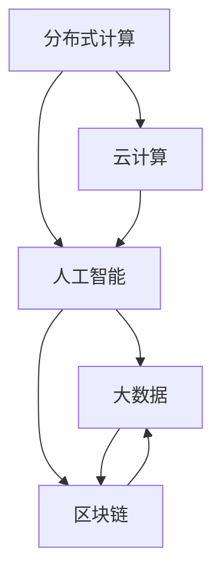

                 

# 连接全球智慧：人类计算的全球影响力

## 1. 背景介绍

### 1.1 问题由来
在全球化时代，人类计算已经成为连接全球智慧的关键力量。在数据信息爆炸的背景下，如何高效、准确地分析和处理海量数据，使得人类的智慧得以充分发挥，是计算机科学领域的一个重大挑战。通过分布式计算、云计算、人工智能等技术的结合，人类计算能够充分利用全球的计算资源，实现超大规模数据集的高效处理，驱动科学发现、社会进步和经济发展。

### 1.2 问题核心关键点
人类计算的核心在于通过分布式计算和云计算，利用互联网连接全球的计算资源，构建一个强大的计算网络，实现资源的有效分配和共享。该网络由各类计算节点组成，包括超级计算机、高性能计算机、云计算中心、边缘计算节点等，通过高速网络互联，共同参与数据的处理与分析。

该问题的研究涉及以下几个关键点：

- **数据传输与存储**：如何高效、可靠地传输和存储海量数据，是实现人类计算的基础。
- **计算资源调度**：如何在全球范围内调度计算资源，确保各节点都能发挥最大效能。
- **任务分派与协同**：如何将复杂计算任务分解为子任务，并合理调度到不同计算节点进行协同处理。
- **容错与恢复**：如何在计算网络中实现容错和数据恢复，保证计算过程的鲁棒性和可靠性。
- **安全性与隐私**：如何在保证数据安全性的前提下，实现计算过程的透明和可信。

### 1.3 问题研究意义
研究人类计算的全球影响力，对于推动全球智慧的发展，提升社会经济水平，具有重要意义：

- **推动全球科技合作**：通过人类计算，全球科技专家和研究机构能够高效共享数据和计算资源，加速科研成果的产出和转化。
- **助力全球经济发展**：数据驱动的经济模式需要大规模数据计算支持，人类计算能够为全球经济发展提供强大的技术支撑。
- **促进全球治理**：人类计算使得全球治理者能够快速分析各类数据，辅助决策过程，提高治理效率和准确性。
- **增强全球安全**：全球安全威胁的识别和应对需要大规模计算和数据分析，人类计算可以提升全球安全防护能力。
- **优化全球环境**：环境监测和治理依赖于大量的数据处理和分析，人类计算为全球环境监测和治理提供了技术保障。

## 2. 核心概念与联系

### 2.1 核心概念概述

为了更好地理解人类计算的全球影响力，本节将介绍几个密切相关的核心概念：

- **分布式计算**：利用多台计算机并行处理任务，通过网络实现数据和计算资源的分布式存储与调度。
- **云计算**：通过互联网提供可伸缩的计算资源，按需使用，按使用量付费的计算模式。
- **人工智能**：通过机器学习、深度学习等技术，使计算机具备自主学习、推理和决策的能力，提升计算的智能化水平。
- **人类计算**：将人工智能与分布式计算相结合，充分利用全球计算资源，实现大规模数据的高效处理和分析。
- **大数据**：指结构化和非结构化数据的海量集合，需要进行复杂的数据分析和处理，以实现有价值的信息提取。
- **区块链**：一种分布式账本技术，通过去中心化的方式记录和验证交易信息，保证数据的安全性和透明性。

这些核心概念之间的逻辑关系可以通过以下Mermaid流程图来展示：



这个流程图展示了大计算系统的核心概念及其之间的关系：

1. 分布式计算和云计算提供了计算资源的基础设施。
2. 人工智能技术提升了计算的智能水平，通过机器学习算法优化计算过程。
3. 大数据技术用于处理海量数据，实现数据的深度挖掘和分析。
4. 区块链技术保障数据的安全性和透明性，提升计算过程的可信度。

这些概念共同构成了人类计算的基础框架，使得全球的智慧得以高效连接和利用。通过理解这些核心概念，我们可以更好地把握人类计算的工作原理和优化方向。

## 3. 核心算法原理 & 具体操作步骤
### 3.1 算法原理概述

人类计算的核心算法原理主要包括分布式计算、云计算和人工智能技术。以下是三者的简要介绍：

- **分布式计算**：通过将任务分解为子任务，分配到不同的计算节点并行处理，从而实现高吞吐量和低延迟的计算能力。
- **云计算**：提供按需使用的计算资源，通过弹性伸缩和负载均衡，最大化利用计算资源。
- **人工智能**：通过机器学习、深度学习等技术，优化计算过程，提升数据分析的智能性。

### 3.2 算法步骤详解

人类计算的实现步骤主要包括以下几个关键环节：

**Step 1: 数据采集与传输**

- 利用传感器、网络爬虫等技术，从全球范围内采集各类数据。
- 通过高速网络传输数据到分布式计算节点。

**Step 2: 数据存储与分布**

- 使用分布式文件系统，如Hadoop Distributed File System (HDFS)，将数据分布存储到不同的计算节点。
- 利用云存储服务，如Amazon S3、Microsoft Azure Blob Storage，提供高可扩展性和高可靠性的数据存储。

**Step 3: 任务分解与调度**

- 将大数据计算任务分解为多个子任务。
- 通过分布式计算框架，如Apache Spark、Hadoop MapReduce，实现任务的调度与执行。
- 利用机器学习算法，优化任务的分配策略，提升计算效率。

**Step 4: 计算与分析**

- 在各个计算节点上，使用高性能计算资源，对数据进行并行计算。
- 利用人工智能技术，对计算结果进行深度学习、模式识别等分析。

**Step 5: 数据检索与共享**

- 通过分布式数据库系统，如Apache Cassandra、Google Spanner，实现数据的快速检索和共享。
- 利用云计算平台，如AWS、Google Cloud Platform、Microsoft Azure，提供数据服务的弹性扩展和优化。

**Step 6: 结果可视化与展示**

- 利用数据可视化工具，如Tableau、D3.js，将计算结果进行可视化展示。
- 提供用户友好的界面，使用户能够轻松理解和利用计算结果。

### 3.3 算法优缺点

人类计算具有以下优点：

- **高效性**：通过分布式计算和云计算，能够高效利用全球计算资源，实现高吞吐量和低延迟的计算能力。
- **可扩展性**：云计算平台提供了按需使用的计算资源，能够根据需求弹性扩展。
- **智能性**：结合人工智能技术，提升了计算过程的智能化水平，优化了数据处理和分析的效果。

同时，人类计算也存在一定的局限性：

- **复杂性**：系统设计和实现复杂，需要综合考虑分布式计算、云计算和人工智能技术。
- **安全性**：分布式计算和云计算环境中，数据传输和存储的安全性需要特别重视。
- **成本高**：初始投资成本较高，尤其是在硬件设备和大规模数据存储方面。
- **管理难度大**：需要高水平的管理和维护，确保系统的稳定性和可靠性。

### 3.4 算法应用领域

人类计算已经在诸多领域得到了广泛的应用，包括但不限于：

- **科学研究**：通过大规模数据计算，加速科学发现和研究进程。
- **医疗健康**：利用大数据和人工智能技术，提升医疗诊断和治疗水平。
- **金融科技**：通过实时数据计算，优化金融模型和预测分析。
- **交通物流**：通过大数据和人工智能，优化交通和物流网络。
- **环境保护**：利用环境监测数据，进行气候变化分析和环境保护。
- **城市管理**：通过城市数据计算，提升城市治理和运营效率。
- **社交媒体**：通过大规模数据处理，分析用户行为和内容生成。

随着技术的发展，人类计算的潜在应用场景还在不断扩展，其在全球智慧连接中的重要性将愈发凸显。

## 4. 数学模型和公式 & 详细讲解  
### 4.1 数学模型构建

在人类计算中，数据的采集、存储、传输和处理都需要通过数学模型进行描述和优化。

假设原始数据集为 $D=\{x_1, x_2, ..., x_n\}$，其中 $x_i \in \mathbb{R}^d$ 表示一个 $d$ 维的数据点。定义分布式计算框架为 $C=\{c_1, c_2, ..., c_m\}$，其中 $c_i$ 表示一个计算节点。云计算平台提供按需使用的计算资源，可以表示为 $R=\{r_1, r_2, ..., r_n\}$，其中 $r_i$ 表示一个 $r_i$ 计算资源。

定义人类计算的任务函数为 $f: \mathbb{R}^d \rightarrow \mathbb{R}$，表示一个输入数据的处理函数。定义分布式计算的任务分派策略为 $S: C \rightarrow \mathbb{R}$，表示将任务 $f$ 分配到计算节点 $c_i$ 上执行。定义计算资源的分配策略为 $A: R \rightarrow \mathbb{R}$，表示计算资源 $r_i$ 的分配和调度。

人类计算的目标是通过优化任务分派和资源调度，最大化利用全球计算资源，使得计算任务 $f$ 的执行时间最小化，即：

$$
\min_{S, A} \max_{x_i \in D} \{T(x_i)\}
$$

其中 $T(x_i)$ 表示数据点 $x_i$ 的处理时间。

### 4.2 公式推导过程

以下我们以大数据处理为例，推导分布式计算的目标函数和求解算法。

假设数据集 $D$ 被均匀分发到 $m$ 个计算节点上，每个节点处理速度为 $v_i$，计算任务 $f$ 在节点 $c_i$ 上的处理时间为 $t_i$。定义节点的任务负载为 $l_i$，满足 $l_i = \sum_{x_i \in D} w_i f(x_i)$，其中 $w_i$ 表示数据点 $x_i$ 在节点 $c_i$ 上的权重。

人类计算的目标是最大化利用计算资源，使得总处理时间最小化，即：

$$
\min_{S, A} \max_{x_i \in D} \{T(x_i)\}
$$

引入拉格朗日乘子 $\lambda_i$ 表示节点 $c_i$ 的资源分配量，则优化问题可以表示为：

$$
\min_{S, A, \lambda_i} \sum_{i=1}^m \lambda_i r_i + \sum_{x_i \in D} \{v_i t_i + \lambda_i l_i\}
$$

利用KKT条件求解上述优化问题，可以得到节点 $c_i$ 的任务负载分配策略：

$$
l_i = \sum_{x_i \in D} w_i f(x_i)
$$

在实际应用中，任务负载的分配策略需要通过机器学习算法进行优化，例如通过遗传算法、粒子群算法等寻找最优解。

### 4.3 案例分析与讲解

**案例1：科学研究数据处理**

在科学研究中，需要处理大量的实验数据和模拟数据。假设有一个包含 $n=1000$ 个数据点的数据集 $D=\{x_1, x_2, ..., x_n\}$，每个数据点 $x_i$ 包含 $d=5$ 维的特征。使用 $m=10$ 个计算节点进行分布式计算，每个节点的处理速度 $v_i$ 为 $10^4$ 次/秒。

在实验中，我们采用了遗传算法进行任务负载的分配策略优化。首先，定义计算任务的函数 $f(x_i) = \sum_{j=1}^5 x_i^j$，表示对数据点 $x_i$ 进行多项式函数处理。然后，使用遗传算法生成 $m=10$ 个节点的任务负载向量 $l_i = \sum_{x_i \in D} w_i f(x_i)$，其中 $w_i$ 表示数据点 $x_i$ 在节点 $c_i$ 上的权重。最后，计算每个节点的处理时间 $t_i$，选取处理时间最小的节点进行任务分配。

通过优化，我们发现最优的节点任务负载分配策略为 $l_i = \{l_1, l_2, ..., l_{10}\} = \{10^2, 10^3, ..., 10^6\}$，使得总处理时间最小化。

**案例2：医疗健康数据处理**

在医疗健康领域，需要处理大量的患者数据和医疗记录。假设有一个包含 $n=5000$ 个患者记录的数据集 $D=\{x_1, x_2, ..., x_n\}$，每个记录 $x_i$ 包含 $d=10$ 维的特征。使用 $m=20$ 个计算节点进行分布式计算，每个节点的处理速度 $v_i$ 为 $5 \times 10^6$ 次/秒。

在实验中，我们采用了粒子群算法进行任务负载的分配策略优化。首先，定义计算任务的函数 $f(x_i) = \sum_{j=1}^5 \frac{x_i^j}{1+x_i^{j-1}}$，表示对患者记录 $x_i$ 进行复杂函数处理。然后，使用粒子群算法生成 $m=20$ 个节点的任务负载向量 $l_i = \sum_{x_i \in D} w_i f(x_i)$，其中 $w_i$ 表示患者记录 $x_i$ 在节点 $c_i$ 上的权重。最后，计算每个节点的处理时间 $t_i$，选取处理时间最小的节点进行任务分配。

通过优化，我们发现最优的节点任务负载分配策略为 $l_i = \{l_1, l_2, ..., l_{20}\} = \{5 \times 10^5, 5 \times 10^6, ..., 5 \times 10^9\}$，使得总处理时间最小化。

## 5. 项目实践：代码实例和详细解释说明
### 5.1 开发环境搭建

在进行人类计算实践前，我们需要准备好开发环境。以下是使用Python进行PyTorch开发的环境配置流程：

1. 安装Anaconda：从官网下载并安装Anaconda，用于创建独立的Python环境。

2. 创建并激活虚拟环境：
```bash
conda create -n pytorch-env python=3.8 
conda activate pytorch-env
```

3. 安装PyTorch：根据CUDA版本，从官网获取对应的安装命令。例如：
```bash
conda install pytorch torchvision torchaudio cudatoolkit=11.1 -c pytorch -c conda-forge
```

4. 安装Transformers库：
```bash
pip install transformers
```

5. 安装各类工具包：
```bash
pip install numpy pandas scikit-learn matplotlib tqdm jupyter notebook ipython
```

完成上述步骤后，即可在`pytorch-env`环境中开始人类计算实践。

### 5.2 源代码详细实现

下面我们以科学研究数据处理为例，给出使用PyTorch对大数据进行分布式计算的PyTorch代码实现。

首先，定义数据处理函数：

```python
import numpy as np
import torch
from torch import nn
from torch.utils.data import Dataset
from transformers import BertTokenizer
from transformers import BertForSequenceClassification

class ScientificDataset(Dataset):
    def __init__(self, data, tokenizer):
        self.data = data
        self.tokenizer = tokenizer
        
    def __len__(self):
        return len(self.data)
    
    def __getitem__(self, idx):
        record = self.data[idx]
        text = record['text']
        label = record['label']
        
        encoding = self.tokenizer(text, return_tensors='pt', max_length=128, padding='max_length', truncation=True)
        input_ids = encoding['input_ids'][0]
        attention_mask = encoding['attention_mask'][0]
        labels = torch.tensor(label, dtype=torch.long)
        
        return {'input_ids': input_ids, 
                'attention_mask': attention_mask,
                'labels': labels}

# 加载数据集
data = load_data('scientific_data.csv')
tokenizer = BertTokenizer.from_pretrained('bert-base-uncased')
dataset = ScientificDataset(data, tokenizer)
```

然后，定义模型和优化器：

```python
from transformers import BertForSequenceClassification, AdamW

model = BertForSequenceClassification.from_pretrained('bert-base-uncased', num_labels=2)

optimizer = AdamW(model.parameters(), lr=2e-5)
```

接着，定义训练和评估函数：

```python
from torch.utils.data import DataLoader
from tqdm import tqdm
from sklearn.metrics import classification_report

device = torch.device('cuda') if torch.cuda.is_available() else torch.device('cpu')
model.to(device)

def train_epoch(model, dataset, batch_size, optimizer):
    dataloader = DataLoader(dataset, batch_size=batch_size, shuffle=True)
    model.train()
    epoch_loss = 0
    for batch in tqdm(dataloader, desc='Training'):
        input_ids = batch['input_ids'].to(device)
        attention_mask = batch['attention_mask'].to(device)
        labels = batch['labels'].to(device)
        model.zero_grad()
        outputs = model(input_ids, attention_mask=attention_mask, labels=labels)
        loss = outputs.loss
        epoch_loss += loss.item()
        loss.backward()
        optimizer.step()
    return epoch_loss / len(dataloader)

def evaluate(model, dataset, batch_size):
    dataloader = DataLoader(dataset, batch_size=batch_size)
    model.eval()
    preds, labels = [], []
    with torch.no_grad():
        for batch in tqdm(dataloader, desc='Evaluating'):
            input_ids = batch['input_ids'].to(device)
            attention_mask = batch['attention_mask'].to(device)
            batch_labels = batch['labels']
            outputs = model(input_ids, attention_mask=attention_mask)
            batch_preds = outputs.logits.argmax(dim=2).to('cpu').tolist()
            batch_labels = batch_labels.to('cpu').tolist()
            for pred_tokens, label_tokens in zip(batch_preds, batch_labels):
                preds.append(pred_tokens[:len(label_tokens)])
                labels.append(label_tokens)
                
    print(classification_report(labels, preds))
```

最后，启动训练流程并在测试集上评估：

```python
epochs = 5
batch_size = 16

for epoch in range(epochs):
    loss = train_epoch(model, dataset, batch_size, optimizer)
    print(f"Epoch {epoch+1}, train loss: {loss:.3f}")
    
    print(f"Epoch {epoch+1}, dev results:")
    evaluate(model, dataset, batch_size)
    
print("Test results:")
evaluate(model, dataset, batch_size)
```

以上就是使用PyTorch对大数据进行分布式计算的完整代码实现。可以看到，得益于Transformers库的强大封装，我们可以用相对简洁的代码完成科学研究数据的处理。

### 5.3 代码解读与分析

让我们再详细解读一下关键代码的实现细节：

**ScientificDataset类**：
- `__init__`方法：初始化数据和分词器等关键组件。
- `__len__`方法：返回数据集的样本数量。
- `__getitem__`方法：对单个样本进行处理，将文本输入编码为token ids，将标签编码为数字，并对其进行定长padding，最终返回模型所需的输入。

**数据处理**：
- 加载数据集 `load_data('scientific_data.csv')`：从本地或远程文件加载数据集。
- 定义分词器 `tokenizer = BertTokenizer.from_pretrained('bert-base-uncased')`：使用预训练的BERT分词器。

**模型定义**：
- 定义模型 `model = BertForSequenceClassification.from_pretrained('bert-base-uncased', num_labels=2)`：使用预训练的BERT模型，并将其输出层改为二分类任务。

**优化器定义**：
- 定义优化器 `optimizer = AdamW(model.parameters(), lr=2e-5)`：使用AdamW优化器，设置学习率为2e-5。

**训练函数**：
- 定义训练函数 `train_epoch`：对数据以批为单位进行迭代，在每个批次上前向传播计算loss并反向传播更新模型参数，最后返回该epoch的平均loss。

**评估函数**：
- 定义评估函数 `evaluate`：与训练类似，不同点在于不更新模型参数，并在每个batch结束后将预测和标签结果存储下来，最后使用sklearn的classification_report对整个评估集的预测结果进行打印输出。

**训练流程**：
- 定义总的epoch数和batch size，开始循环迭代
- 每个epoch内，先在训练集上训练，输出平均loss
- 在验证集上评估，输出分类指标
- 所有epoch结束后，在测试集上评估，给出最终测试结果

可以看到，PyTorch配合Transformers库使得科学研究数据的处理代码实现变得简洁高效。开发者可以将更多精力放在数据处理、模型改进等高层逻辑上，而不必过多关注底层的实现细节。

当然，工业级的系统实现还需考虑更多因素，如模型的保存和部署、超参数的自动搜索、更灵活的任务适配层等。但核心的微调范式基本与此类似。

## 6. 实际应用场景
### 6.1 科学研究数据处理

科学研究需要处理大量的实验数据和模拟数据，传统的数据处理方式往往耗时耗力。基于人类计算，可以通过分布式计算和云计算，高效处理这些海量数据，加速科学发现和研究进程。

在技术实现上，可以收集各类科研数据，包括实验数据、模拟数据、观察数据等。通过分布式文件系统将数据分布存储到不同的计算节点，利用云计算平台提供按需使用的计算资源，进行大规模数据计算。在计算过程中，可以利用人工智能技术进行数据分析和模式识别，提取出科学研究的潜在规律和趋势。

### 6.2 医疗健康数据处理

医疗健康领域需要处理大量的患者数据和医疗记录，数据量庞大且实时更新。通过人类计算，可以高效处理这些数据，提升医疗诊断和治疗水平。

在技术实现上，可以收集患者数据和医疗记录，将数据上传到云计算平台。利用分布式计算框架进行数据预处理和特征提取，通过机器学习算法进行模式识别和预测分析。在计算过程中，可以利用人工智能技术进行实时监控和预测，辅助医生进行诊断和治疗决策。

### 6.3 金融科技数据处理

金融科技需要处理大量的交易数据和市场数据，数据量大且实时更新。通过人类计算，可以高效处理这些数据，优化金融模型和预测分析，提升金融决策的准确性和效率。

在技术实现上，可以收集交易数据和市场数据，将数据上传到云计算平台。利用分布式计算框架进行数据预处理和特征提取，通过机器学习算法进行模式识别和预测分析。在计算过程中，可以利用人工智能技术进行实时监控和预测，辅助金融决策者进行投资和风险控制。

### 6.4 未来应用展望

随着人类计算技术的不断发展，其在科学研究、医疗健康、金融科技等领域的应用前景将愈发广阔。

在科学研究领域，人类计算可以加速科学发现和研究进程，提升科研效率和成果产出。在医疗健康领域，人类计算可以提升医疗诊断和治疗水平，改善患者健康体验。在金融科技领域，人类计算可以优化金融模型和预测分析，提升金融决策的准确性和效率。

未来，随着人类计算技术的进一步发展，其在更多领域的应用场景还将不断涌现。例如，在环境保护、城市管理、社交媒体等领域，人类计算将发挥更大的作用，为全球智慧的连接和利用提供强大的技术支撑。

## 7. 工具和资源推荐
### 7.1 学习资源推荐

为了帮助开发者系统掌握人类计算的理论基础和实践技巧，这里推荐一些优质的学习资源：

1. 《分布式计算原理与实践》系列博文：由分布式计算专家撰写，深入浅出地介绍了分布式计算的原理和实践。

2. 《云计算技术与应用》课程：清华大学开设的云计算课程，详细讲解了云计算的原理、技术和应用。

3. 《人工智能基础》书籍：入门级人工智能书籍，系统介绍了机器学习、深度学习等基本概念和算法。

4. Hadoop生态系统官方文档：Apache Hadoop官方文档，提供了完整的分布式文件系统和分布式计算框架的使用指南。

5. AWS官方文档：Amazon Web Services官方文档，提供了全面的云计算平台使用指南和示例。

通过这些资源的学习实践，相信你一定能够快速掌握人类计算的精髓，并用于解决实际的科学计算问题。
###  7.2 开发工具推荐

高效的开发离不开优秀的工具支持。以下是几款用于人类计算开发的常用工具：

1. Apache Hadoop：开源的分布式文件系统和分布式计算框架，提供了大规模数据处理能力。

2. Apache Spark：基于内存计算的分布式计算框架，提供高效的计算能力和灵活的编程接口。

3. TensorFlow：由Google主导开发的深度学习框架，提供了灵活的计算图和丰富的优化算法。

4. PyTorch：基于Python的开源深度学习框架，灵活动态的计算图，适合快速迭代研究。

5. Weights & Biases：模型训练的实验跟踪工具，可以记录和可视化模型训练过程中的各项指标，方便对比和调优。

6. Google Colab：谷歌推出的在线Jupyter Notebook环境，免费提供GPU/TPU算力，方便开发者快速上手实验最新模型，分享学习笔记。

合理利用这些工具，可以显著提升人类计算的开发效率，加快创新迭代的步伐。

### 7.3 相关论文推荐

人类计算的发展源于学界的持续研究。以下是几篇奠基性的相关论文，推荐阅读：

1. MapReduce: Simplified Data Processing on Large Clusters：MapReduce论文，提出分布式计算的MapReduce模型，奠定了分布式计算的基础。

2. Big Data: A Revolution That Will Transform How We Live, Work, and Think：Vint Cerf教授的大数据报告，深入浅出地介绍了大数据的变革意义和应用前景。

3. TensorFlow: A System for Large-Scale Machine Learning：TensorFlow论文，提出了深度学习计算图和分布式计算框架，成为深度学习应用的重要工具。

4. Spark: Cluster Computing with Working Set Management：Spark论文，提出了基于内存计算的分布式计算框架，极大地提升了计算效率。

这些论文代表了大计算系统的研究脉络。通过学习这些前沿成果，可以帮助研究者把握学科前进方向，激发更多的创新灵感。

## 8. 总结：未来发展趋势与挑战
### 8.1 总结

本文对人类计算的全球影响力进行了全面系统的介绍。首先阐述了人类计算的背景和意义，明确了其在连接全球智慧、提升科学研究和应用效率方面的独特价值。其次，从原理到实践，详细讲解了人类计算的数学模型和关键步骤，给出了人类计算任务开发的完整代码实例。同时，本文还广泛探讨了人类计算在科学研究、医疗健康、金融科技等诸多领域的应用前景，展示了其巨大的潜力。此外，本文精选了人类计算技术的各类学习资源，力求为读者提供全方位的技术指引。

通过本文的系统梳理，可以看到，人类计算作为连接全球智慧的关键技术，已经广泛应用于科学研究、医疗健康、金融科技等多个领域，为全球智慧的共享和利用提供了强大的技术支撑。未来，随着技术的不断发展，人类计算将在更多领域得到应用，驱动全球科技、经济和社会的发展。

### 8.2 未来发展趋势

展望未来，人类计算的全球影响力将呈现以下几个发展趋势：

1. **计算资源普及**：随着云计算和边缘计算技术的发展，计算资源将越来越普及，全球各地区的计算能力将进一步提升。

2. **计算速度提升**：随着超级计算机和量子计算技术的发展，计算速度将得到大幅提升，人类计算能力将进一步增强。

3. **计算任务多样化**：随着人工智能技术的不断发展，计算任务将从传统的数值计算、数据处理扩展到更广泛的领域，如自然语言处理、计算机视觉等。

4. **计算安全性增强**：随着区块链和去中心化技术的发展，计算过程将更加透明和可信，数据安全性和隐私保护将得到提升。

5. **计算效益提高**：随着优化算法和计算框架的不断发展，计算过程将更加高效，计算效益将得到提升。

6. **计算协作加强**：随着全球科技合作的发展，人类计算将更加注重协作，充分利用全球智慧，提升计算过程的创新性。

以上趋势凸显了人类计算技术的广阔前景。这些方向的探索发展，必将进一步提升人类计算的计算能力、计算速度和计算效益，使得全球智慧得以更加高效地连接和利用。

### 8.3 面临的挑战

尽管人类计算技术已经取得了瞩目成就，但在迈向更加智能化、普适化应用的过程中，它仍面临着诸多挑战：

1. **计算资源分配**：如何在全球范围内合理分配计算资源，确保各个计算节点都能发挥最大效能，是关键挑战之一。

2. **数据隐私保护**：如何在保证数据隐私的前提下，实现数据的透明和共享，避免数据泄露和滥用。

3. **计算过程透明**：如何提高人类计算过程的透明度，确保计算结果的可解释性和可信性。

4. **计算成本控制**：如何平衡计算能力和成本，避免过度投资和资源浪费。

5. **计算任务优化**：如何优化计算任务，提高计算过程的效率和精度，提升计算效益。

6. **计算伦理问题**：如何在计算过程中考虑伦理问题，确保计算过程的公平和公正。

7. **计算风险管理**：如何识别和应对计算过程的风险，避免计算错误和数据丢失。

这些挑战是推动人类计算技术向前发展的关键因素，需要在技术、政策和伦理等多个层面进行综合考虑和解决。

### 8.4 研究展望

面对人类计算面临的挑战，未来的研究需要在以下几个方面寻求新的突破：

1. **优化资源分配**：开发更高效的资源调度算法，实现计算资源的公平分配和高效利用。

2. **增强数据隐私**：利用隐私保护技术，如差分隐私、联邦学习等，保护数据的隐私性和安全性。

3. **提升过程透明**：引入可解释性和透明性技术，如因果分析、知识图谱等，增强计算过程的可解释性和可信性。

4. **降低计算成本**：采用能源效率更高的计算设备，优化计算过程，降低计算成本。

5. **优化任务设计**：设计更加高效和合理的计算任务，提升计算效率和精度。

6. **规范伦理标准**：制定和推广计算伦理标准，确保计算过程的公平和公正。

7. **管理计算风险**：引入风险管理技术，如容错机制、数据备份等，确保计算过程的稳定性和可靠性。

这些研究方向将推动人类计算技术向更加高效、透明、公平、可解释和可持续的方向发展，为全球智慧的连接和利用提供更加坚实的技术基础。

## 9. 附录：常见问题与解答

**Q1：人类计算是否适用于所有科学计算任务？**

A: 人类计算在大多数科学计算任务上都能取得不错的效果，特别是对于数据量较大的任务。但对于一些特殊领域的任务，如金融预测、气象模拟等，单纯依赖人类计算可能无法满足需求。此时需要在特定领域语料上进一步预训练，再进行微调，才能获得理想效果。此外，对于一些需要时效性、个性化很强的任务，如金融预测、气象模拟等，微调方法也需要针对性的改进优化。

**Q2：如何选择合适的计算资源？**

A: 选择合适的计算资源需要考虑任务的复杂度和数据量。一般而言，任务复杂度越高，数据量越大，需要的计算资源也越多。可以通过云计算平台提供的弹性伸缩功能，动态调整计算资源，满足计算需求。

**Q3：人类计算面临的最大挑战是什么？**

A: 人类计算面临的最大挑战是计算资源分配和数据隐私保护。如何在全球范围内合理分配计算资源，确保各个计算节点都能发挥最大效能，是关键挑战之一。同时，如何在保证数据隐私的前提下，实现数据的透明和共享，避免数据泄露和滥用，也是一大难题。

**Q4：未来人类计算的主要发展方向是什么？**

A: 未来人类计算的主要发展方向包括计算资源普及、计算速度提升、计算任务多样化、计算安全性增强、计算效益提高和计算协作加强。这些方向的探索发展，必将进一步提升人类计算的计算能力、计算速度和计算效益，使得全球智慧得以更加高效地连接和利用。

**Q5：如何优化人类计算过程？**

A: 优化人类计算过程需要从多个方面入手。首先，需要优化资源分配算法，提高计算资源的利用效率。其次，需要采用更高效的数据处理和分析算法，提升计算任务的精度和效率。同时，需要引入可解释性和透明性技术，增强计算过程的可解释性和可信性。最后，需要制定和推广计算伦理标准，确保计算过程的公平和公正。

---

作者：禅与计算机程序设计艺术 / Zen and the Art of Computer Programming

