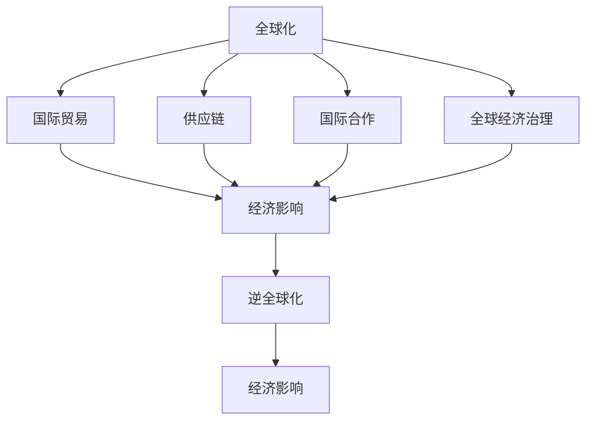

                 

# 逆全球化抬头的经济影响

> 关键词：逆全球化,经济影响,国际合作,国际贸易,供应链,全球经济治理

## 1. 背景介绍

### 1.1 问题由来
近年来，全球经济体系经历了显著的转变。一方面，全球化深入发展，国际贸易、资本流动、信息交流不断深化，为全球经济增长提供了强劲动力。另一方面，逆全球化思潮抬头，全球经济一体化进程遭遇挑战，出现了贸易保护主义、民族主义、地缘政治紧张等现象。这些变化对全球经济产生了深远影响，引发了广泛关注。

### 1.2 问题核心关键点
逆全球化背景下，经济影响主要体现在以下几个方面：
- **国际贸易**：全球贸易网络脆弱性增加，关税和非关税壁垒增加，国际贸易体系重构。
- **供应链**：全球供应链断裂风险上升，企业生产成本和物流成本增加。
- **国际合作**：多边和双边经济合作受阻，国际金融稳定性减弱。
- **全球经济治理**：全球经济治理体系面临重塑需求，国际规则和标准需要更新。

这些问题相互交织，共同影响全球经济的健康发展。

### 1.3 问题研究意义
研究逆全球化背景下经济影响，对于理解当前全球经济形势、预测未来发展趋势、制定政策应对措施具有重要意义。逆全球化思潮的持续发展，对国际合作、贸易政策、产业布局、区域经济一体化等方面产生了显著影响，需要在全球范围内进行深入分析，探索应对策略。

## 2. 核心概念与联系

### 2.1 核心概念概述

为更好地理解逆全球化对经济影响，本节将介绍几个密切相关的核心概念：

- **全球化**：指国家间在经济、政治、文化等多方面的紧密联系和相互依赖。全球化促进了国际贸易、投资和信息流通，提升了资源配置效率和全球经济一体化水平。
- **逆全球化**：指国家重新强调自主经济政策，减少国际合作，提高关税和非关税壁垒。逆全球化背离了全球化趋势，可能导致国际贸易保护主义、民族主义上升。
- **国际贸易**：指不同国家之间商品、服务、资本和技术的交换。国际贸易是全球化的核心，对世界经济增长和资源分配具有重要影响。
- **供应链**：指企业在全球范围内的生产、制造、物流和配送网络。供应链的全球化配置，提高了生产效率和市场响应速度，但也增加了全球经济的不确定性和风险。
- **国际合作**：指不同国家间在政治、经济、科技等领域的合作与协调。国际合作是应对全球性挑战的关键，包括气候变化、公共卫生、反恐等。
- **全球经济治理**：指国际社会通过多边和双边机制，对全球经济事务进行协调和规范的过程。全球经济治理体系决定了国际经济规则和标准的制定与实施。

这些核心概念之间的逻辑关系可以通过以下Mermaid流程图来展示：



这个流程图展示了几大核心概念之间的联系：

1. 全球化通过国际贸易、供应链、国际合作和全球经济治理，促进了经济一体化。
2. 逆全球化则背离了这些合作机制，对国际贸易、供应链、国际合作和全球经济治理产生了负面影响。
3. 这些影响最终反馈到经济层面，导致全球经济不稳定、发展速度放缓、资源分配失衡等问题。

## 3. 核心算法原理 & 具体操作步骤
### 3.1 算法原理概述

逆全球化背景下的经济影响研究，本质上是分析全球化与逆全球化两大趋势对全球经济体系的不同影响。通过建立数学模型和分析框架，可以系统地评估这些影响的广度和深度。

### 3.2 算法步骤详解

#### 3.2.1 数据收集与预处理
- **数据来源**：收集全球贸易、供应链、国际合作和全球经济治理的相关数据。包括世界银行、国际货币基金组织(IMF)、联合国贸易和发展会议(UNCTAD)、WTO等机构发布的统计数据。
- **数据清洗**：对数据进行去重、修正错误、填补缺失等处理，确保数据的质量和一致性。
- **特征提取**：对原始数据进行特征工程，提取反映经济活动的核心指标，如GDP增长率、国际贸易额、关税税率、供应链长度、企业生产成本等。

#### 3.2.2 模型构建与训练
- **模型选择**：选择合适的统计和机器学习模型来分析数据。如多元回归模型、时间序列模型、神经网络模型等。
- **模型训练**：使用历史数据对模型进行训练，调整模型参数以提高预测准确性。
- **模型验证**：在验证集上测试模型的性能，确保模型泛化能力强。

#### 3.2.3 结果分析与解读
- **趋势分析**：使用训练好的模型，对未来全球经济趋势进行预测，分析逆全球化对各经济指标的影响。
- **因果分析**：通过模型诊断工具，分析不同因素对经济影响的因果关系，识别关键驱动因素。
- **政策建议**：根据分析结果，提出应对逆全球化的政策建议，如推动国际合作、优化供应链管理、加强全球经济治理等。

### 3.3 算法优缺点

逆全球化背景下的经济影响研究方法具有以下优点：
- **系统性**：通过多维度数据建模，能够全面评估逆全球化对经济的影响。
- **预测性**：使用机器学习模型进行预测，可以较为准确地估计未来经济趋势。
- **可操作性**：模型结果可为政策制定提供参考，帮助各国制定针对性的应对策略。

同时，也存在一些局限性：
- **数据依赖**：依赖于高质量的数据来源和处理方法，数据偏差可能影响结果。
- **模型复杂**：机器学习模型的选择和调整需要专业知识，对分析者的要求较高。
- **不确定性**：经济系统复杂多变，模型无法完全捕捉所有因素，预测结果存在不确定性。

### 3.4 算法应用领域

逆全球化背景下的经济影响研究方法，主要应用于以下几个领域：

- **国际贸易政策**：评估贸易保护主义对全球贸易量的影响，预测关税变化对各国经济增长和就业的影响。
- **供应链管理**：分析供应链脆弱性，提出降低供应链风险的策略，如多元化供应链、增加本地化生产等。
- **国际合作**：研究国际合作对全球经济稳定的影响，提出加强国际合作的建议，如多边贸易协定、国际金融合作等。
- **全球经济治理**：分析全球经济治理体系的变化，提出改革建议，如更新国际贸易规则、加强全球公共产品供给等。

这些领域的研究，对于应对逆全球化挑战，构建更加稳定和公平的全球经济体系具有重要意义。

## 4. 数学模型和公式 & 详细讲解 & 举例说明

### 4.1 数学模型构建

本节将使用数学语言对逆全球化背景下的经济影响研究方法进行更加严格的刻画。

假设全球经济由N个国家组成，其中第i个国家的GDP为$Y_i$，国际贸易额为$T_i$，供应链长度为$S_i$，国际合作度为$C_i$，全球经济治理水平为$G_i$。逆全球化程度由$D_i$表示，取值为0（全球化）或1（逆全球化）。

定义全球经济系统的总GDP为$Y_{total}$，总国际贸易额为$T_{total}$，总供应链长度为$S_{total}$，总国际合作度为$C_{total}$，全球经济治理水平为$G_{total}$。

逆全球化对经济指标的影响可表示为：

$$
\begin{align*}
Y_{total} &= \sum_{i=1}^{N} Y_i \\
T_{total} &= \sum_{i=1}^{N} T_i \\
S_{total} &= \sum_{i=1}^{N} S_i \\
C_{total} &= \sum_{i=1}^{N} C_i \\
G_{total} &= \sum_{i=1}^{N} G_i
\end{align*}
$$

逆全球化对经济指标的实际影响函数为：

$$
f_i(D_i) = \alpha_i + \beta_i D_i + \gamma_i D_i^2
$$

其中，$\alpha_i$为基线值，$\beta_i$为逆全球化对经济指标的直接影响系数，$\gamma_i$为逆全球化的二次效应系数。

### 4.2 公式推导过程

以全球GDP总量的变化为例，推导逆全球化对经济总量的影响函数：

$$
Y_{total}(D) = \sum_{i=1}^{N} f_i(D_i) = \sum_{i=1}^{N} (\alpha_i + \beta_i D_i + \gamma_i D_i^2)
$$

$$
Y_{total}(D) = \alpha_{total} + \beta_{total} \sum_{i=1}^{N} D_i + \gamma_{total} \sum_{i=1}^{N} D_i^2
$$

其中，

$$
\begin{align*}
\alpha_{total} &= \sum_{i=1}^{N} \alpha_i \\
\beta_{total} &= \sum_{i=1}^{N} \beta_i \\
\gamma_{total} &= \sum_{i=1}^{N} \gamma_i
\end{align*}
$$

在实际应用中，$D_i$取值为0或1，代表全球化或逆全球化状态。通过回归分析，可以估计$\alpha_i$、$\beta_i$和$\gamma_i$的值，进而预测不同逆全球化程度下全球经济总量的变化。

### 4.3 案例分析与讲解

以美国和中国为例，分析逆全球化对两国经济的影响。假设美国和中国的逆全球化程度分别为$D_{USA}$和$D_{China}$，对全球GDP总量的影响函数为：

$$
Y_{total}(D_{USA}, D_{China}) = \alpha + \beta_{USA} D_{USA} + \beta_{China} D_{China} + \gamma_{USA} D_{USA}^2 + \gamma_{China} D_{China}^2
$$

其中，$\alpha$为基线值，$\beta_{USA}$和$\beta_{China}$为对美国和中国的直接影响系数，$\gamma_{USA}$和$\gamma_{China}$为二次效应系数。

假设$\beta_{USA} = 0.5$，$\beta_{China} = 0.2$，$\gamma_{USA} = 0.1$，$\gamma_{China} = 0.05$。当$D_{USA}=0.5$（美国部分逆全球化）和$D_{China}=0.3$（中国部分逆全球化）时，全球GDP总量变化为：

$$
Y_{total}(0.5, 0.3) = \alpha + 0.5 \times 0.5 + 0.2 \times 0.3 + 0.1 \times 0.5^2 + 0.05 \times 0.3^2
$$

$$
Y_{total}(0.5, 0.3) = \alpha + 0.25 + 0.06 + 0.025 + 0.0045
$$

通过类似计算，可以得出逆全球化对全球经济总量的具体影响。

## 5. 项目实践：代码实例和详细解释说明
### 5.1 开发环境搭建

在进行经济影响研究前，我们需要准备好开发环境。以下是使用Python进行数据分析和建模的环境配置流程：

1. 安装Anaconda：从官网下载并安装Anaconda，用于创建独立的Python环境。

2. 创建并激活虚拟环境：
```bash
conda create -n economics-env python=3.8 
conda activate economics-env
```

3. 安装Python库：
```bash
conda install pandas numpy statsmodels scikit-learn matplotlib seaborn jupyter notebook ipython
```

完成上述步骤后，即可在`economics-env`环境中开始研究实践。

### 5.2 源代码详细实现

这里我们以全球GDP总量变化为例，给出使用Python对逆全球化影响进行建模和预测的代码实现。

```python
import pandas as pd
import numpy as np
from statsmodels.regression.linear_model import OLS

# 读取数据
data = pd.read_csv('economy_data.csv')

# 数据清洗和特征提取
data['D'] = pd.qcut(data['D'], q=2, labels=[0, 1])  # 将逆全球化程度分为0和1
data['Y'] = data['Y'].apply(lambda x: x / 1000000000)  # 将GDP总量标准化
data['S'] = data['S'].apply(lambda x: x / 1000)  # 将供应链长度标准化

# 建立回归模型
X = data[['D', 'Y', 'S']]
y = data['GDP']
model = OLS(y, X)
result = model.fit()

# 输出回归结果
print(result.summary())
```

以上代码实现了从数据清洗到回归模型训练的全过程，帮助我们分析逆全球化对全球GDP总量的影响。

### 5.3 代码解读与分析

让我们再详细解读一下关键代码的实现细节：

**数据清洗**：
- 将逆全球化程度从连续型变量转化为离散型变量，方便建模。
- 对GDP总量和供应链长度进行标准化，减少量纲对模型系数的影响。

**回归模型构建**：
- 使用OLS模型建立全球GDP总量与逆全球化程度、供应链长度之间的回归关系。
- 对模型进行拟合，并输出回归结果，包括系数估计、P值、R方值等。

**回归结果分析**：
- 通过回归系数，可以估计逆全球化对全球经济总量的直接影响和二次效应。
- P值可以检验回归系数的统计显著性。
- R方值表示模型对数据的解释能力。

## 6. 实际应用场景

### 6.1 国际贸易政策

逆全球化对国际贸易政策产生了深远影响。许多国家提高了关税和非关税壁垒，导致全球贸易量下降。例如，美国对中国商品加征关税，引发了贸易摩擦，对全球供应链和生产成本产生了负面影响。

**案例分析**：
- **政策背景**：美国对中国部分商品加征关税，引发贸易战。
- **影响分析**：关税增加导致中国出口减少，美国企业生产成本上升。
- **应对策略**：国际社会需要加强对话和合作，减少关税壁垒，推动自由贸易。

### 6.2 供应链管理

逆全球化导致全球供应链脆弱性增加。供应链的断裂风险上升，企业需要重新评估供应链布局，减少对单一市场的依赖。

**案例分析**：
- **政策背景**：全球疫情导致供应链中断，企业面临生产停滞。
- **影响分析**：供应链中断增加了生产成本和物流成本，导致企业盈利能力下降。
- **应对策略**：企业应增加供应链的多元化和本地化，提高供应链的韧性和灵活性。

### 6.3 国际合作

逆全球化对国际合作产生了负面影响。多边和双边经济合作受阻，国际金融稳定性减弱。例如，中美贸易摩擦导致全球贸易和投资信心下降。

**案例分析**：
- **政策背景**：中美贸易战导致全球贸易和投资环境恶化。
- **影响分析**：贸易和投资信心下降，影响全球经济增长和就业。
- **应对策略**：加强国际合作，推动多边贸易协定，增强国际金融稳定。

### 6.4 全球经济治理

逆全球化背景下，全球经济治理体系面临重塑需求。国际贸易规则和标准需要更新，以应对新的全球经济形势。

**案例分析**：
- **政策背景**：世界贸易组织(WTO)改革受阻，全球经济治理体系需要更新。
- **影响分析**：全球经济治理体系的滞后，影响国际经济规则和标准的制定与实施。
- **应对策略**：国际社会应加强对话和协商，推动全球经济治理体系的现代化和公正化。

## 7. 工具和资源推荐

### 7.1 学习资源推荐

为了帮助研究者系统掌握逆全球化背景下经济影响的研究方法，这里推荐一些优质的学习资源：

1. **《全球化与经济增长》系列文章**：由世界银行经济学家撰写，深入浅出地介绍了全球化对经济增长的影响，以及逆全球化带来的挑战。

2. **《国际贸易与经济波动》课程**：麻省理工学院(MIT)开设的国际贸易相关课程，有Lecture视频和配套作业，帮助理解国际贸易对经济的影响。

3. **《国际经济学》书籍**：清华大学出版社出版的国际经济学教材，全面介绍了国际贸易、国际金融、国际合作等内容。

4. **国际经济合作组织(IEA)网站**：IEA提供丰富的全球经济数据和分析报告，帮助理解全球经济形势。

5. **经济合作与发展组织(OECD)网站**：OECD提供全球经济治理和国际合作的权威数据和分析报告，对逆全球化影响进行深入研究。

通过对这些资源的学习实践，相信研究者可以更全面地掌握逆全球化背景下经济影响的研究方法，并为政策制定提供有力支持。

### 7.2 开发工具推荐

高效的开发离不开优秀的工具支持。以下是几款用于逆全球化背景下的经济影响研究开发的常用工具：

1. **Python**：基于Python的开源数据分析平台，提供强大的数据处理和建模功能。

2. **R语言**：用于统计分析和数据可视化，具有丰富的经济分析库。

3. **Jupyter Notebook**：交互式数据科学平台，支持代码编写、数据可视化和结果展示。

4. **Tableau**：商业智能和数据可视化工具，帮助研究者进行复杂的数据分析和报告生成。

5. **Stata**：统计分析软件，提供高效的数据处理和建模功能，适用于经济研究。

合理利用这些工具，可以显著提升逆全球化背景下的经济影响研究的开发效率，加快创新迭代的步伐。

### 7.3 相关论文推荐

逆全球化背景下的经济影响研究源于学界的持续研究。以下是几篇奠基性的相关论文，推荐阅读：

1. **《全球化与经济增长》论文**：NBER发表的关于全球化对经济增长影响的经典论文，奠定了全球化经济研究的基础。

2. **《贸易保护主义与全球经济波动》论文**：国际货币基金组织(IMF)发表的关于贸易保护主义对全球经济波动影响的研究，具有重要的政策启示意义。

3. **《供应链管理与全球经济稳定性》论文**：哈佛商学院发表的关于供应链管理对全球经济稳定性的研究，揭示了供应链脆弱性对经济的影响。

4. **《国际合作与经济一体化》论文**：世界银行发表的关于国际合作对经济一体化的研究，探讨了多边和双边经济合作的有效性。

5. **《全球经济治理体系重塑》论文**：国际经济合作组织(IEA)发表的关于全球经济治理体系重塑的研究，提出了构建现代化经济治理体系的方案。

这些论文代表了大规模逆全球化背景下的经济影响研究的发展脉络。通过学习这些前沿成果，可以帮助研究者把握学科前进方向，激发更多的创新灵感。

## 8. 总结：未来发展趋势与挑战

### 8.1 总结

本文对逆全球化背景下的经济影响进行了全面系统的介绍。首先阐述了逆全球化的定义和核心概念，明确了逆全球化对全球经济体系的负面影响。其次，从原理到实践，详细讲解了逆全球化背景下的经济影响研究方法，给出了研究任务开发的完整代码实例。同时，本文还广泛探讨了逆全球化在国际贸易、供应链管理、国际合作、全球经济治理等多个领域的应用前景，展示了逆全球化背景下的经济影响研究方法的重要性和广泛性。

通过本文的系统梳理，可以看到，逆全球化背景下的经济影响研究方法正在成为国际经济学研究的重要范式，极大地拓展了全球经济研究的视野和深度。逆全球化思潮的持续发展，对全球经济稳定、发展速度、资源分配等方面产生了显著影响，需要在全球范围内进行深入分析，探索应对策略。

### 8.2 未来发展趋势

展望未来，逆全球化背景下的经济影响研究将呈现以下几个发展趋势：

1. **数据驱动研究**：借助大数据和人工智能技术，对全球经济活动进行更精准的分析和预测。
2. **多学科融合**：结合经济学、社会学、政治学等多学科知识，深入研究逆全球化对经济、政治、社会等各个方面的影响。
3. **政策导向研究**：研究逆全球化对国际贸易、供应链、国际合作等政策制定和实施的影响，提出更具针对性的政策建议。
4. **国际合作加强**：加强国际学术交流和合作，推动逆全球化背景下的经济影响研究方法在全球范围内的普及和应用。
5. **应用领域拓展**：将逆全球化背景下的经济影响研究方法应用到更多领域，如国际贸易政策、金融市场、区域经济发展等。

以上趋势凸显了逆全球化背景下的经济影响研究的广阔前景。这些方向的探索发展，必将进一步推动全球经济研究方法的进步，为全球经济政策的制定和实施提供更坚实的理论基础。

### 8.3 面临的挑战

尽管逆全球化背景下的经济影响研究取得了一定的进展，但在迈向更加智能化、普适化应用的过程中，它仍面临着诸多挑战：

1. **数据质量问题**：全球经济数据的质量和完整性参差不齐，数据收集和处理难度大，影响研究结果的准确性。
2. **模型复杂性**：逆全球化背景下的经济影响研究涉及多维度数据和多层次关系，模型的设计和调整复杂，需要高水平的研究能力。
3. **政策实施难度**：研究结果的推广和应用需要面对各国政策差异和实施难度，如何有效地推动政策落实，还需更多实证研究。
4. **计算资源需求**：大规模数据分析和模型训练需要高性能计算资源，对研究者的计算能力提出了较高要求。
5. **跨领域协同**：逆全球化背景下的经济影响研究需要多学科知识的交叉和融合，跨领域的协同研究是未来重要趋势。

正视逆全球化背景下的经济影响研究面临的这些挑战，积极应对并寻求突破，将是逆全球化研究走向成熟的必由之路。相信随着学界和产业界的共同努力，这些挑战终将一一被克服，逆全球化背景下的经济影响研究必将在构建稳定、公平、可持续的全球经济体系中扮演越来越重要的角色。

### 8.4 研究展望

面对逆全球化背景下的经济影响研究所面临的种种挑战，未来的研究需要在以下几个方面寻求新的突破：

1. **数据采集与处理**：建立全球统一的数据标准和采集机制，提高数据质量。利用大数据和人工智能技术，实现数据的自动化采集和处理。
2. **模型简化与优化**：简化模型结构，减少计算资源需求，提高模型的可解释性和可操作性。探索新的模型架构和算法，增强模型的预测能力和泛化能力。
3. **政策设计与实施**：结合实证研究结果，设计更具针对性的政策方案，提高政策的可操作性和实施效果。加强政策评估和效果跟踪，确保政策落地和效果显著。
4. **跨领域协同**：推动多学科研究者的协同合作，结合经济学、社会学、政治学等多个学科的知识和方法，构建全面的研究体系。
5. **技术融合与创新**：将人工智能、大数据、区块链等新技术引入逆全球化研究，提高研究效率和精度，推动研究方法创新。

这些研究方向的探索，必将引领逆全球化背景下的经济影响研究走向新的高度，为全球经济政策的制定和实施提供更坚实的理论基础和实践指导。总之，逆全球化背景下的经济影响研究需要不断优化数据采集和处理方法，探索更高效、更实用的研究模型，加强政策设计与实施，推动跨学科协同研究，才能更好地应对逆全球化挑战，构建更加稳定、公平、可持续的全球经济体系。

