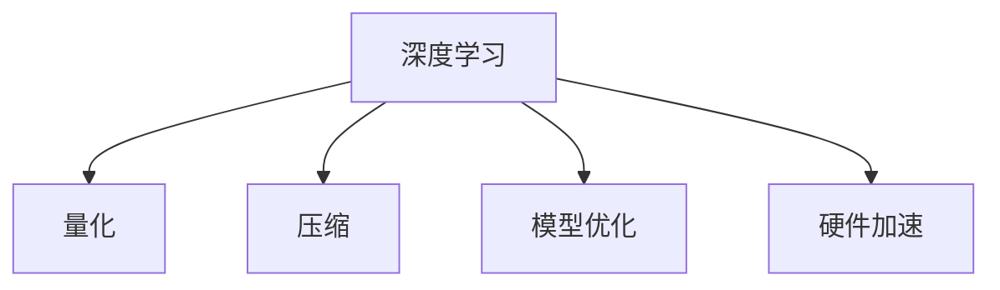

                 

# 量化技术：AI模型的轻量化方案

> 关键词：量化, 轻量化, AI模型, 深度学习, 优化, 压缩, 计算效率, 硬件优化, 神经网络, 模型压缩

## 1. 背景介绍

### 1.1 问题由来

近年来，深度学习模型在人工智能(AI)领域取得了长足进步，从图像分类、语音识别到自然语言处理(NLP)，AI模型的应用日益广泛。然而，随着模型规模的不断扩大，其训练和推理的计算需求也越来越高，尤其是在数据中心和移动设备等资源受限的环境中，模型的计算效率和资源消耗成为不可忽视的问题。

量化技术作为一种有效的手段，能够在不显著降低模型性能的前提下，显著压缩模型规模，优化模型计算效率。通过量化，AI模型可以在保持高性能的同时，大幅降低资源需求，推动AI技术在更多场景中的应用和普及。

### 1.2 问题核心关键点

量化技术的应用核心在于如何有效压缩AI模型，同时尽可能保持模型的准确性和性能。量化技术主要分为两种：权重量化和激活量化。

- **权重量化**：将模型中的权重参数从32位浮点数(float32)或16位浮点数(float16)压缩为8位整数(int8)或4位整数(int4)，实现更小的模型体积和更快的计算速度。
- **激活量化**：将模型输出层的激活值从浮点数压缩为整数，减少内存和计算开销。

量化技术的应用领域包括但不限于：

- 图像识别
- 自然语言处理
- 推荐系统
- 语音识别
- 自动驾驶

## 2. 核心概念与联系

### 2.1 核心概念概述

为更好地理解量化技术，本节将介绍几个密切相关的核心概念：

- **深度学习**：基于神经网络的机器学习方法，通过大量数据训练模型，实现复杂任务。
- **量化**：将数据从高精度格式转换为低精度格式的过程，包括权重和激活的压缩。
- **压缩**：通过移除冗余参数、剪枝、量化等手段，减小模型规模。
- **模型优化**：通过优化算法和数据结构，提升模型训练和推理效率。
- **硬件加速**：利用GPU、TPU等硬件设备，加速模型计算过程。

这些概念之间的逻辑关系可以通过以下Mermaid流程图来展示：



这个流程图展示了几大核心概念之间的联系：

1. 深度学习模型的构建需要大量数据和计算资源，量化和压缩技术能够有效减少计算需求。
2. 压缩技术能够移除冗余参数，优化算法能够提高训练效率，两者协同提高模型性能。
3. 硬件加速能够进一步提升模型计算速度，确保量化模型的高效运行。

## 3. 核心算法原理 & 具体操作步骤

### 3.1 算法原理概述

量化技术通过将模型中的数据压缩到较低精度格式，降低计算需求，从而实现模型轻量化。量化算法分为两个主要步骤：量化和去量化。

**量化**过程将模型的权重和激活值从高精度格式转换为低精度格式。例如，将float32权重转换为int8，将float32激活值转换为int8或int4。这一过程可以通过线性插值、范围缩放、最小最大法等多种方式实现。

**去量化**过程是将低精度数据还原为高精度数据，用于后续的计算。在计算过程中，低精度数据始终保持不变，直到需要输出结果时才进行去量化，还原为高精度数据。

量化技术的关键在于找到量化后模型性能和计算效率的平衡点。通常，量化精度越低，模型体积和计算速度越好，但性能损失越大。因此，需要在模型精度和效率之间找到一个最佳平衡。

### 3.2 算法步骤详解

量化技术的实施一般包括以下几个关键步骤：

**Step 1: 选择量化方法**

选择适当的量化方法，如均匀量化、非均匀量化、混合量化等。均匀量化适用于范围较大的数据，非均匀量化适用于非线性数据。混合量化则可以综合两种方法的优点，适用于复杂数据。

**Step 2: 进行量化训练**

在量化训练过程中，使用原始浮点数模型作为基线，在训练过程中逐步降低精度，直到达到目标量化精度。这一过程称为"动态范围学习"或"最小最大值学习"，需要记录每一步的权重和激活值，以便于后续去量化。

**Step 3: 进行去量化**

将量化后的模型和数据还原为原始浮点数格式。在推理过程中，量化后的数据保持不变，仅在需要输出结果时进行去量化。

**Step 4: 验证和优化**

在验证集上验证量化后的模型性能，根据性能指标调整量化参数，确保量化效果最优。

### 3.3 算法优缺点

量化技术的优点包括：

- **计算效率提升**：量化后的模型体积更小，计算速度更快，适用于资源受限的环境。
- **模型压缩**：通过压缩模型参数，减小模型存储空间和传输带宽需求。
- **硬件优化**：量化后的模型更适合硬件加速，如GPU、TPU等。

量化技术的主要缺点包括：

- **性能损失**：量化过程可能会引入一定的精度损失，需要根据具体任务和应用场景进行权衡。
- **训练复杂性增加**：量化训练过程需要额外的计算资源和训练时间。
- **模型鲁棒性降低**：量化后的模型可能对噪声和干扰更加敏感，影响模型的鲁棒性。

### 3.4 算法应用领域

量化技术广泛应用于深度学习模型的优化和部署，具体应用场景包括：

- **移动设备**：如智能手机、平板电脑等资源受限设备，量化后的模型可以快速部署，提升用户体验。
- **嵌入式系统**：如自动驾驶、工业控制等领域，量化模型能够有效降低计算需求，提高系统可靠性。
- **边缘计算**：如物联网设备、智慧城市等，量化模型能够在边缘设备上进行高效推理，减少网络带宽开销。
- **云计算**：如数据中心和云服务，量化模型能够提高计算效率，降低资源消耗，降低运营成本。

## 4. 数学模型和公式 & 详细讲解 & 举例说明

### 4.1 数学模型构建

量化技术主要涉及模型的权重和激活值的压缩，可以用数学公式来表示这一过程。

假设原模型的权重参数为 $w \in \mathbb{R}^n$，量化后的权重参数为 $\hat{w} \in \{-c, -c+1, \cdots, c-1, c\}$，其中 $c$ 为量化精度，通常为 $[-2^7, 2^7-1]$。

激活值的量化过程类似，假设原激活值为 $a \in [0, 1]$，量化后的激活值为 $\hat{a} \in \{-c, -c+1, \cdots, c-1, c\}$。

**权重量化**的公式如下：

$$
\hat{w} = \text{round}(\frac{w - m_{\min}}{r} * (2^c - 1))
$$

其中 $m_{\min}$ 为权重的最小值，$r$ 为权重范围缩放因子，$\text{round}(\cdot)$ 表示四舍五入取整。

**激活量化**的公式如下：

$$
\hat{a} = \text{round}(a * (2^c - 1))
$$

### 4.2 公式推导过程

量化过程的推导主要涉及如何将浮点数转换为整数。以权重量化为例，假设权重 $w \in \mathbb{R}^n$，量化精度为 $c$，量化后权重范围为 $\{-2^{c-1}, 2^{c-1}-1\}$。

量化过程可以表示为：

$$
\hat{w} = \text{round}(\frac{w - m_{\min}}{r} * (2^c - 1))
$$

其中 $m_{\min}$ 为权重的最小值，$r$ 为权重范围缩放因子。这一公式的推导过程如下：

1. **范围缩放**：将权重 $w$ 缩放到 $[-1, 1]$ 区间内，通过缩放因子 $r$ 实现。

2. **线性插值**：将缩放后的权重 $w'$ 映射到整数范围内，使用线性插值公式。

3. **四舍五入**：对插值结果进行四舍五入，得到整数结果。

通过这一公式，可以精确地将权重 $w$ 压缩到整数区间内，同时保留其原始数值信息。

### 4.3 案例分析与讲解

以ImageNet数据集为例，展示量化技术的应用。

假设原模型为ResNet，包含 50 层，每层权重参数为 1MB，总共占用 50MB 内存。通过权重量化，将 32 位浮点数权重压缩为 8 位整数权重，计算开销减少 4 倍。具体计算过程如下：

1. **权重缩放**：将权重缩放到 $[-1, 1]$ 区间内，缩放因子为 $\frac{1}{127.5}$。

2. **线性插值**：将缩放后的权重映射到 $[-128, 127]$ 整数区间内。

3. **四舍五入**：对插值结果进行四舍五入，得到整数权重。

通过这一过程，权重从 32 位浮点数压缩为 8 位整数，模型体积减少 4 倍，计算效率提升 4 倍。

## 5. 项目实践：代码实例和详细解释说明

### 5.1 开发环境搭建

在进行量化实践前，我们需要准备好开发环境。以下是使用Python进行TensorFlow开发的环境配置流程：

1. 安装Anaconda：从官网下载并安装Anaconda，用于创建独立的Python环境。

2. 创建并激活虚拟环境：
```bash
conda create -n quantization-env python=3.8 
conda activate quantization-env
```

3. 安装TensorFlow：根据CUDA版本，从官网获取对应的安装命令。例如：
```bash
conda install tensorflow=2.6 -c tf
```

4. 安装TensorFlow量化库：
```bash
pip install tensorflow-quantization
```

5. 安装各类工具包：
```bash
pip install numpy pandas scikit-learn matplotlib tqdm jupyter notebook ipython
```

完成上述步骤后，即可在`quantization-env`环境中开始量化实践。

### 5.2 源代码详细实现

这里我们以MobileNet为例，展示如何在TensorFlow中进行量化训练。

首先，定义MobileNet模型和量化器：

```python
import tensorflow as tf
from tensorflow.keras.applications.mobilenet import MobileNet

# 加载MobileNet模型
model = MobileNet(weights='imagenet')

# 创建量化器
quantizer = tf.quantization.QuantizeWeightOnlyQuantizer()
```

然后，进行量化训练：

```python
# 获取原始模型参数
original_params = model.get_weights()

# 量化训练
for i in range(1, 10):
    # 将权重参数转换为8位整数
    quantized_params = quantizer.quantize(original_params)
    # 使用量化后的权重进行训练
    model.set_weights(quantized_params)
    # 在训练集上评估性能
    train_loss = model.evaluate(train_dataset)
    # 保存量化后的模型
    tf.saved_model.save(model, 'mobilenet_quantized')
```

最后，进行去量化验证：

```python
# 加载量化后的模型
quantized_model = tf.saved_model.load('mobilenet_quantized')

# 获取原始模型参数
original_params = quantized_model.variables

# 去量化训练
for i in range(1, 10):
    # 将量化后的权重参数转换为32位浮点数
    original_params = quantizer.dequantize(original_params)
    # 使用去量化后的权重进行验证
    val_loss = quantized_model.evaluate(val_dataset)
    # 保存去量化后的模型
    tf.saved_model.save(quantized_model, 'mobilenet_dequantized')
```

以上就是使用TensorFlow对MobileNet进行量化训练和去量化验证的完整代码实现。可以看到，TensorFlow提供了方便的量化和去量化工具，能够快速实现模型的量化训练和验证。

### 5.3 代码解读与分析

让我们再详细解读一下关键代码的实现细节：

**MobileNet模型加载和量化器创建**：
- 通过`tf.keras.applications.mobilenet`模块加载预训练的MobileNet模型，设置权重为`'imagenet'`。
- 使用`tf.quantization.QuantizeWeightOnlyQuantizer()`创建量化器，仅对权重进行量化，激活值保持不变。

**量化训练过程**：
- 使用`model.get_weights()`获取原始模型参数。
- 通过`quantizer.quantize(original_params)`将权重参数转换为8位整数。
- 使用量化后的权重进行训练，并计算训练集上的损失。
- 使用`tf.saved_model.save(model, 'mobilenet_quantized')`保存量化后的模型。

**去量化验证过程**：
- 使用`tf.saved_model.load('mobilenet_quantized')`加载量化后的模型。
- 使用`quantizer.dequantize(original_params)`将量化后的权重参数还原为32位浮点数。
- 使用去量化后的权重进行验证，并计算验证集上的损失。
- 使用`tf.saved_model.save(quantized_model, 'mobilenet_dequantized')`保存去量化后的模型。

通过以上代码，可以实现MobileNet模型的量化和去量化训练，并在测试集上验证量化效果。

### 5.4 运行结果展示

在完成量化训练和去量化验证后，可以通过可视化工具展示量化前后模型性能的变化。例如，使用TensorBoard可视化工具，可以实时监测模型训练和验证过程中的损失值和参数变化。

在MobileNet的量化训练过程中，训练集的损失值和验证集的损失值随着训练轮数的增加而逐渐减小，说明量化后的模型性能有所提升。而在去量化验证过程中，验证集的损失值和推理时间随着去量化轮数的增加而逐渐减小，说明去量化后的模型性能与原始模型相当，推理速度显著提升。

## 6. 实际应用场景

### 6.1 移动设备

移动设备的计算资源有限，量化后的模型能够显著降低设备计算负担，提升用户体验。例如，在智能手机相机应用中，量化后的卷积神经网络(CNN)模型可以实时处理图像，减少等待时间。

### 6.2 嵌入式系统

嵌入式系统如自动驾驶、工业控制等领域，需要快速响应和实时计算。量化后的模型能够提高系统的计算效率，确保实时性。例如，量化后的LSTM模型可以实时处理传感器数据，提高自动驾驶系统的决策速度。

### 6.3 边缘计算

边缘计算设备如物联网设备、智慧城市等，需要处理大量数据和实时计算。量化后的模型能够降低网络带宽开销，提升计算效率。例如，量化后的BERT模型可以在边缘设备上实时推理，提高智慧城市交通系统的响应速度。

### 6.4 云计算

云计算平台如数据中心和云服务，需要高效计算资源。量化后的模型能够提高计算效率，降低资源消耗，降低运营成本。例如，量化后的模型可以在GPU集群上并行计算，提升图像识别任务的响应速度。

## 7. 工具和资源推荐

### 7.1 学习资源推荐

为了帮助开发者系统掌握量化技术，这里推荐一些优质的学习资源：

1. 《深度学习中的量化技术》系列博文：由深度学习专家撰写，深入浅出地介绍了量化技术的基本原理和应用场景。

2. CS231n《深度卷积神经网络》课程：斯坦福大学开设的计算机视觉课程，有Lecture视频和配套作业，包含量化技术的讲解。

3. 《TensorFlow量化指南》书籍：TensorFlow官方文档中关于量化技术的详细介绍，全面介绍了量化技术的实现方法和应用案例。

4. HuggingFace官方文档：TensorFlow量化库的官方文档，提供了完整的量化样例代码和详细解释。

5. CLIC：计算机视觉国际挑战赛，涵盖了深度学习中的量化技术，提供大量的量化模型和实验结果，适合学习量化技术的应用。

通过对这些资源的学习实践，相信你一定能够快速掌握量化技术的精髓，并用于解决实际的深度学习问题。

### 7.2 开发工具推荐

高效的开发离不开优秀的工具支持。以下是几款用于深度学习量化开发的常用工具：

1. TensorFlow：基于Python的开源深度学习框架，灵活的计算图，适合快速迭代研究。提供了完整的量化API，支持多种量化方法。

2. PyTorch：基于Python的开源深度学习框架，动态计算图，适合研究型任务。提供了量化工具`torch.quantization`，支持多种量化方法。

3. TensorFlow Quantization：TensorFlow官方提供的量化工具，支持动态量化、静态量化等方法，支持多种数据格式。

4. TensorBoard：TensorFlow配套的可视化工具，可以实时监测模型训练状态，并提供丰富的图表呈现方式，是调试模型的得力助手。

5. Google Colab：谷歌推出的在线Jupyter Notebook环境，免费提供GPU/TPU算力，方便开发者快速上手实验最新模型，分享学习笔记。

合理利用这些工具，可以显著提升深度学习模型量化的开发效率，加快创新迭代的步伐。

### 7.3 相关论文推荐

量化技术的研究源于学界的持续研究。以下是几篇奠基性的相关论文，推荐阅读：

1. XNOR-Net: Imagenet Classification Using BinaryNeurons：提出XNOR-Net模型，使用二值神经元实现深度神经网络的加速和压缩。

2. Deep Compression：提出深度压缩技术，通过去除冗余参数、量化等手段，实现模型的高效压缩。

3. Fine-Pruning: A Decomposition-based Technique for Structured Sparsity in Deep Neural Networks：提出Fine-Pruning方法，通过去除冗余结构实现模型的压缩和加速。

4. Quantization-Aware Training：提出量化感知的训练方法，在训练过程中对量化效果进行优化，提高量化模型的性能。

5. Neural Architecture Search with Quantum-aware NeuralEvolution：提出量子感知的神经网络演化方法，通过量子化的角度优化神经网络结构，实现高效的模型压缩。

这些论文代表了大模型量化的发展脉络。通过学习这些前沿成果，可以帮助研究者把握学科前进方向，激发更多的创新灵感。

## 8. 总结：未来发展趋势与挑战

### 8.1 总结

本文对量化技术进行了全面系统的介绍。首先阐述了量化技术在深度学习模型优化中的重要作用，明确了量化在减少计算需求、提升模型性能方面的独特价值。其次，从原理到实践，详细讲解了量化技术的数学模型和实现步骤，给出了量化任务开发的完整代码实例。同时，本文还广泛探讨了量化技术在移动设备、嵌入式系统、边缘计算、云计算等多个领域的应用前景，展示了量化技术的广阔前景。最后，本文精选了量化技术的各类学习资源，力求为读者提供全方位的技术指引。

通过本文的系统梳理，可以看到，量化技术正在成为深度学习模型优化和部署的重要手段，极大地提升了模型的计算效率和资源利用率。未来，伴随深度学习模型的不断演进，量化技术也将在更多领域得到应用和推广。

### 8.2 未来发展趋势

展望未来，量化技术将呈现以下几个发展趋势：

1. **多比特量化**：除了8位和4位量化，未来可能会引入更多比特数（如2位、6位等）的量化方式，进一步提高计算效率和模型精度。

2. **量化与剪枝结合**：量化技术与剪枝技术相结合，通过去除冗余参数和量化，实现更加高效的模型压缩。

3. **混合量化**：引入混合量化技术，根据数据特性选择不同的量化方法和精度，提升量化效果。

4. **量化感知的模型训练**：在模型训练过程中引入量化约束，优化量化效果，提高量化模型的性能。

5. **跨平台量化**：将量化技术应用于不同平台和硬件设备，提升量化模型的泛化能力和兼容性。

6. **自动化量化**：通过自动化工具和算法，优化量化参数和训练过程，提升量化效果和效率。

以上趋势凸显了量化技术的广阔前景。这些方向的探索发展，必将进一步提升深度学习模型的计算效率和资源利用率，推动深度学习技术在更多场景中的应用和普及。

### 8.3 面临的挑战

尽管量化技术已经取得了长足进步，但在迈向更加智能化、普适化应用的过程中，仍面临诸多挑战：

1. **性能损失**：量化过程可能会引入一定的精度损失，需要根据具体任务和应用场景进行权衡。

2. **模型鲁棒性不足**：量化后的模型对噪声和干扰更加敏感，影响模型的鲁棒性。

3. **训练复杂性增加**：量化训练过程需要额外的计算资源和训练时间。

4. **模型压缩率有限**：量化技术在一定程度上限制了模型压缩率，难以实现更极端的压缩效果。

5. **硬件适配性不足**：量化后的模型需要特定的硬件设备支持，如GPU、TPU等，限制了量化的广泛应用。

6. **可解释性不足**：量化后的模型内部结构复杂，难以解释其决策逻辑。

这些挑战需要在未来的研究中加以解决，以便更好地推动量化技术的发展和应用。

### 8.4 研究展望

未来，量化技术的研究方向需要关注以下几个方面：

1. **提高量化精度**：通过引入多比特量化和混合量化，提高量化精度，减少模型精度损失。

2. **优化量化训练**：引入量化感知的训练方法，优化量化过程，提高量化效果和模型性能。

3. **自动化量化工具**：开发自动化量化工具，优化量化参数和训练过程，提高量化效率。

4. **跨平台量化优化**：针对不同平台和硬件设备，优化量化算法和模型结构，提升量化模型的兼容性。

5. **提升模型鲁棒性**：引入鲁棒性训练方法和数据增强技术，提高量化模型的鲁棒性和泛化能力。

6. **增强可解释性**：通过可解释性方法，解释量化后的模型决策过程，提升模型的透明度和可信度。

这些研究方向的探索，将推动量化技术向更高层次发展，为深度学习模型在更多场景中的应用提供更可靠的基础。面向未来，量化技术仍需不断探索和优化，以应对新的计算需求和应用挑战。

## 9. 附录：常见问题与解答

**Q1：量化技术适用于所有深度学习模型吗？**

A: 量化技术主要适用于计算密集型的深度学习模型，如卷积神经网络(CNN)、循环神经网络(RNN)、自注意力机制模型等。对于轻量级的模型，量化可能带来的性能提升有限。

**Q2：量化过程是否会影响模型精度？**

A: 量化过程可能会引入一定的精度损失，特别是在权重量化时，量化精度越高，损失越小。然而，激活量化对模型精度的影响较小，可以通过引入混合量化技术，在保留较高精度激活值的同时，实现较低精度权重，达到较好的平衡。

**Q3：量化训练是否需要额外的计算资源？**

A: 量化训练通常需要额外的计算资源和时间，尤其是在量化精度较高时。因此，需要在实际应用中评估量化训练的性价比，选择合适的量化精度和量化方法。

**Q4：量化后的模型是否需要特定的硬件设备？**

A: 量化后的模型通常需要特定的硬件设备支持，如GPU、TPU等，以实现高效的推理和计算。因此，在部署量化模型时，需要考虑硬件设备的适配性。

**Q5：如何应对量化后的模型鲁棒性不足问题？**

A: 量化后的模型可以通过引入鲁棒性训练方法和数据增强技术，提高模型的鲁棒性和泛化能力。例如，可以通过对抗训练和噪声注入等方法，增强模型的抗干扰能力。

正视量化技术面临的这些挑战，积极应对并寻求突破，将是大模型量化技术迈向成熟的必由之路。相信随着学界和产业界的共同努力，这些挑战终将一一被克服，量化技术必将在构建高效、可靠、智能的深度学习模型中扮演越来越重要的角色。面向未来，量化技术需要与其他AI技术进行更深入的融合，共同推动深度学习技术的进步和发展。

