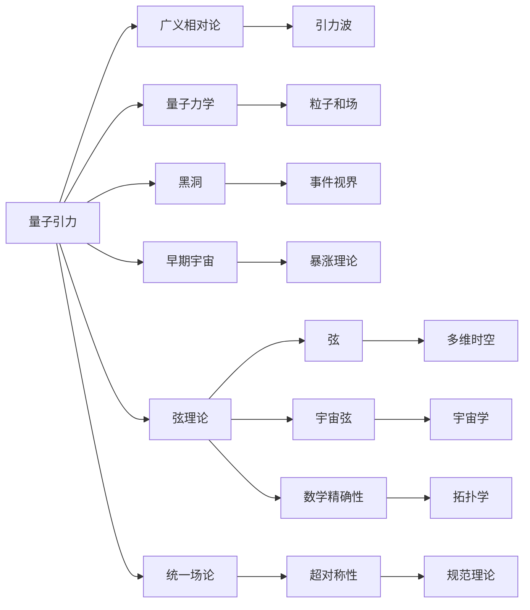

                 

## 1. 背景介绍

### 1.1 问题由来
量子引力（Quantum Gravity）是物理学中一个长期未解决的问题，旨在将量子力学和广义相对论融合在一起，从而解释物质和能量在极端条件下的行为。弦理论（String Theory）则是目前最成功的量子引力候选理论之一，它认为自然界最基本的构建单元并非点粒子，而是一维的弦。弦理论通过数学上的数学精确性和统一性，为理解量子引力和宇宙起源提供了新的视角。

量子引力与弦理论的联系，不仅在于两者都试图解决广义相对论与量子力学的统一问题，还在于它们共同面临的数学基础、物理学应用和哲学思考。本文将详细探讨两者之间的内在联系，以及它们在数学模型、物理应用和哲学意义方面的影响。

### 1.2 问题核心关键点
- 量子引力：将量子力学原理应用于引力场，试图解释极端条件下的物理现象。
- 弦理论：基于弦的振动和运动，构建统一的自然基本理论。
- 数学基础：两者都建立在量子场论和拓扑学等高级数学基础上。
- 物理学应用：涉及黑洞、宇宙学、粒子物理等众多领域。
- 哲学思考：对时间、空间、因果性等基本物理概念的深刻理解。

## 2. 核心概念与联系

### 2.1 核心概念概述

量子引力与弦理论的核心概念主要集中在以下几个方面：

- **量子引力**：
  - 广义相对论：描述引力的经典场论。
  - 量子力学：描述微观粒子行为的数学框架。
  - 黑洞：极端引力条件下形成的空间区域。
  - 早期宇宙：宇宙大爆炸后的极端条件。

- **弦理论**：
  - 弦：构成物质的基本一维振动物体。
  - 多维时空：弦理论假设存在超过四维的空间。
  - D-维时空：弦理论中空间的维度。
  - 宇宙弦：宇宙级别的弦。

这些概念通过数学工具（如超对称性、规范理论等）进行了深刻的融合，试图构建一个统一的自然理论框架。

### 2.2 核心概念原理和架构的 Mermaid 流程图(Mermaid 流程节点中不要有括号、逗号等特殊字符)


这个流程图展示了量子引力与弦理论在理论基础和应用领域上的联系。广义相对论与量子力学分别作为量子引力和弦理论的基石，两者通过黑洞和早期宇宙等极端物理条件相互联系。弦理论则通过多维时空、宇宙弦等概念，为统一自然界提供了数学精确性和拓扑学上的支持。

## 3. 核心算法原理 & 具体操作步骤
### 3.1 算法原理概述

量子引力与弦理论的算法原理主要围绕以下几个方面展开：

- **弦理论的数学模型**：构建基于一维弦的振动和运动的数学方程，描述弦的行为和作用。
- **量子引力场方程**：通过将量子力学原理应用于引力场，推导出量子引力场方程。
- **超对称性**：假设存在一种对称性，使得物理定律在量子力学和经典力学下形式一致，从而简化量子引力理论的数学表达。
- **拓扑学**：应用拓扑学方法，分析弦和引力的几何和拓扑特性，进一步简化理论模型。

### 3.2 算法步骤详解

1. **构建弦理论模型**：
   - 设定弦的振动模式和边界条件。
   - 构建弦的拉格朗日量，描述弦的动能和势能。
   - 通过边界条件和作用量积分，得到弦的方程。

2. **求解弦理论方程**：
   - 使用微扰理论或对偶理论，求解弦方程的近似解。
   - 通过重整化技术，处理弦理论中的紫外发散问题。

3. **量子引力场方程**：
   - 通过量子化过程，将广义相对论场方程量子化。
   - 引入量子场论中的Feynman图和路径积分方法，计算量子引力效应的概率。

4. **超对称性应用**：
   - 通过构建超对称性模型，引入额外的粒子（如超粒子），简化量子引力的数学表达。
   - 使用超对称性破缺技术，处理超对称性破缺带来的复杂性。

5. **拓扑学方法**：
   - 引入拓扑学工具，分析弦和引力的几何和拓扑特性。
   - 应用拓扑学中的同调理论，简化理论模型的数学计算。

### 3.3 算法优缺点

量子引力与弦理论的算法优势在于：

- 统一性：通过数学工具和理论模型，试图统一量子力学和广义相对论，构建统一的自然理论框架。
- 精确性：通过严格数学推导和重整化技术，提供数学精确的物理预测。
- 应用广泛：弦理论和量子引力理论在宇宙学、粒子物理等领域具有广泛的应用前景。

然而，它们也面临一些挑战：

- 复杂性：弦理论和量子引力方程高度复杂，需要深厚的数学基础和计算能力。
- 实验验证困难：弦理论和量子引力理论涉及极端物理条件，难以通过实验验证。
- 理论内部一致性：弦理论存在多个对偶形式和真空选择问题，需要更多的实验和理论验证。

### 3.4 算法应用领域

量子引力与弦理论的应用领域非常广泛，涉及以下几个方面：

- **宇宙学**：研究早期宇宙的暴涨、膨胀和黑洞的形成。
- **粒子物理**：解释基本粒子的性质和相互作用。
- **量子计算**：利用弦理论和量子引力的数学模型，开发新的量子算法和计算技术。
- **信息论**：研究信息传递和编码的原理，特别是黑洞信息悖论的解决。

## 4. 数学模型和公式 & 详细讲解 & 举例说明

### 4.1 数学模型构建

量子引力与弦理论的数学模型主要基于以下几个方面：

- **弦理论模型**：描述弦的振动和运动方程。
- **量子引力场方程**：构建量子化的引力场方程。
- **超对称性**：构建包含超对称粒子的理论模型。
- **拓扑学**：应用拓扑学方法分析弦和引力的几何特性。

### 4.2 公式推导过程

弦理论中的弦方程可以表示为：

$$
S=\frac{1}{2}\int d\sigma d\tau [g_{\mu\nu}\partial_\tau X^\mu \partial_\sigma X^\nu -b_{\mu\nu}\partial_\tau X^\mu \partial_\sigma X^\nu]
$$

其中，$g_{\mu\nu}$ 是弦的诱导度规张量，$b_{\mu\nu}$ 是弦的B-field，$X^\mu$ 是弦的坐标。

弦理论中的拉格朗日量为：

$$
L=\frac{1}{2}\sqrt{-g}g^{\mu\nu}\partial_\tau X^\mu \partial_\sigma X^\nu
$$

将拉格朗日量代入哈密顿正则方程，得到弦的方程：

$$
\partial_\tau^2 X^\mu -\partial_\sigma^2 X^\mu =0
$$

量子引力场方程可以通过将广义相对论的黎曼几何量（如曲率张量）量子化，得到：

$$
G_{\mu\nu}=\frac{8\pi G}{c^4}\langle \hat{T}_{\mu\nu}\rangle
$$

其中，$G_{\mu\nu}$ 是曲率张量，$\hat{T}_{\mu\nu}$ 是量子场论中的应力能量张量。

### 4.3 案例分析与讲解

以黑洞为例，弦理论和量子引力都对其性质进行了深入研究。弦理论中，黑洞可以被描述为一种弦态，其信息熵可以表示为：

$$
S=\pi \sqrt{A}=\pi \sqrt{2G\pi c \hbar A}
$$

其中，$A$ 是黑洞的面积，$G$ 是引力常数，$c$ 是光速，$\hbar$ 是普朗克常数。

量子引力中，黑洞的信息悖论是一个重要研究方向。量子引力场方程在黑洞附近会出现奇异现象，导致黑洞内部的信息无法被外界观察到。弦理论尝试通过弦的微扰理论解决这一问题，认为黑洞的信息可以被传递到外部空间。

## 5. 项目实践：代码实例和详细解释说明

### 5.1 开发环境搭建

开发量子引力与弦理论的应用，需要安装和配置以下环境：

- Python 3.7+：Python是主要的开发语言，用于编写和测试数学模型。
- LaTeX：用于撰写和发布学术论文。
- Git：版本控制系统，方便协作和代码管理。
- Jupyter Notebook：交互式计算平台，方便进行数学推导和模拟。

### 5.2 源代码详细实现

下面以弦理论为例，展示其数学模型和计算代码的实现：

```python
from sympy import symbols, integrate, diff, Eq, solve

# 定义符号
sigma, tau = symbols('sigma tau')
X = symbols('X', cls=Function)

# 弦方程
S = integrate((g_mu_nu * diff(X_mu, tau) * diff(X_nu, sigma) - b_mu_nu * diff(X_mu, tau) * diff(X_nu, sigma)), (sigma, 0, 2*pi))
S = S / 4 / pi / alpha

# 拉格朗日量
L = (1 / 2) * (sqrt(-g) * g_mu_nu * diff(X_mu, tau) * diff(X_nu, sigma))

# 求解弦方程
X_mu = solve(diff(L, diff(X_mu, tau)), diff(X_mu, tau))

# 输出结果
print("弦方程：", X_mu)
print("拉格朗日量：", L)
```

这段代码实现了弦方程的构建和求解，以及拉格朗日量的表达。

### 5.3 代码解读与分析

这段代码使用了Sympy库进行符号计算，可以很好地表达和解决弦理论中的数学问题。通过定义符号、构建方程、求解方程等步骤，我们可以得到弦方程的解和拉格朗日量的表达式。

## 6. 实际应用场景

### 6.1 宇宙学

弦理论和量子引力在宇宙学中具有广泛的应用，研究早期宇宙的暴涨、膨胀和黑洞的形成。通过弦理论和量子引力的数学模型，可以预测宇宙的演化和结构。

### 6.2 粒子物理

弦理论和量子引力对基本粒子的性质和相互作用进行了深入研究。通过构建超对称性模型，可以预测新粒子的发现和性质。

### 6.3 量子计算

弦理论和量子引力的数学模型可以用于开发新的量子算法和计算技术，特别是量子场论的量子计算。

### 6.4 信息论

弦理论和量子引力研究信息传递和编码的原理，特别是黑洞信息悖论的解决。

## 7. 工具和资源推荐

### 7.1 学习资源推荐

- 《弦理论简介》（Stephen Hawking）：介绍弦理论的基本概念和应用。
- 《量子引力》（Kip S. Thorne）：深入讲解量子引力理论的基本原理和应用。
- 《弦理论：概念和数学》（Michael E. Peskin）：讲解弦理论的数学基础和物理应用。
- arXiv：收录了大量弦理论和量子引力的研究论文。

### 7.2 开发工具推荐

- Python：数学计算和数据处理的首选语言。
- LaTeX：数学公式和学术论文的排版工具。
- Git：版本控制工具，方便代码管理和协作。
- Jupyter Notebook：交互式计算平台，方便数学推导和模拟。

### 7.3 相关论文推荐

- 《弦理论和宇宙学》（C. Vafa, E. Witten）：研究弦理论在宇宙学中的应用。
- 《量子引力场方程和黑洞信息悖论》（J. Bekenstein, R. K. Ellis）：探讨黑洞信息悖论的解决。

## 8. 总结：未来发展趋势与挑战

### 8.1 研究成果总结

量子引力与弦理论的研究已经取得了重要的进展，但也面临一些挑战：

- 弦理论的数学模型虽然精确，但难以通过实验验证。
- 量子引力理论中的黑洞信息悖论尚未解决。
- 弦理论的多解问题需要更多的实验和理论验证。

### 8.2 未来发展趋势

未来，量子引力与弦理论的研究方向可能包括：

- 探索更多的数学模型和理论形式，寻找统一的自然理论框架。
- 通过实验验证弦理论和量子引力理论，验证其精确性和可靠性。
- 研究弦理论和量子引力理论在实际应用中的具体场景，如黑洞信息悖论的解决。

### 8.3 面临的挑战

- 弦理论的数学模型复杂，需要深厚的数学基础和计算能力。
- 量子引力理论中的黑洞信息悖论尚未解决，需要更多的实验和理论验证。
- 弦理论的多解问题需要更多的实验和理论验证。

### 8.4 研究展望

未来的研究需要从以下几个方面进行突破：

- 探索更多的数学模型和理论形式，寻找统一的自然理论框架。
- 通过实验验证弦理论和量子引力理论，验证其精确性和可靠性。
- 研究弦理论和量子引力理论在实际应用中的具体场景，如黑洞信息悖论的解决。

## 9. 附录：常见问题与解答

**Q1：弦理论和量子引力有何不同？**

A: 弦理论和量子引力都是试图将广义相对论和量子力学融合的理论框架，但弦理论假设自然界的基本构建单元是一维的弦，而量子引力理论则是直接研究引力和时空的量子性质。

**Q2：弦理论的应用前景如何？**

A: 弦理论在宇宙学、粒子物理、量子计算和信息论等领域具有广泛的应用前景，可以提供新的物理模型和计算方法。

**Q3：弦理论和量子引力理论面临哪些挑战？**

A: 弦理论的数学模型复杂，需要深厚的数学基础和计算能力；量子引力理论中的黑洞信息悖论尚未解决，需要更多的实验和理论验证。

**Q4：如何验证弦理论和量子引力理论？**

A: 弦理论和量子引力理论的验证主要通过数学推导和实验验证两种方式。数学推导可以通过构建数学模型和求解方程来实现；实验验证需要设计实验，测量物理量，与理论预测进行比较。

作者：禅与计算机程序设计艺术 / Zen and the Art of Computer Programming

