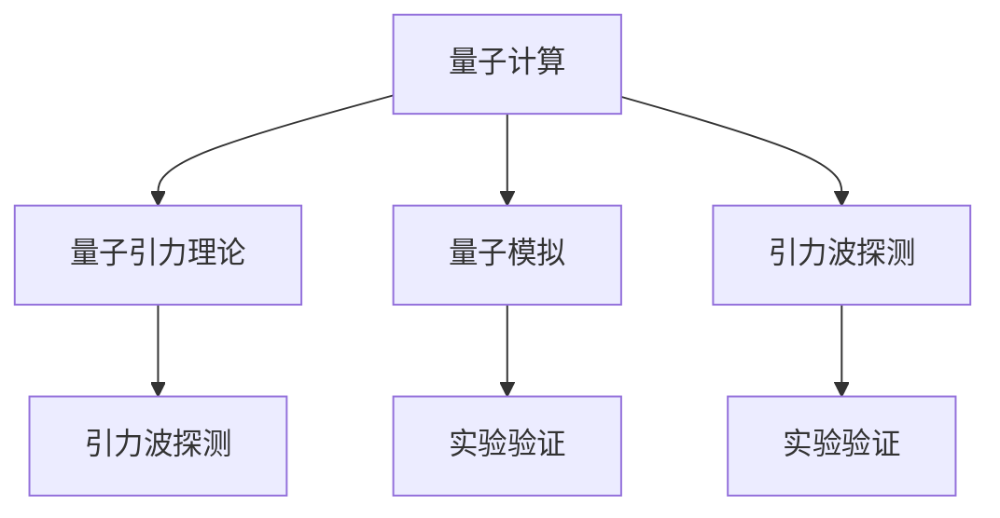

                 

## 1. 背景介绍

量子引力是物理学的终极难题之一，涉及到时空、物质和能量的基本性质。它旨在将量子力学与广义相对论统一起来，从而解释宇宙的基本结构。然而，由于量子引力理论的复杂性和高难度，直接验证其是否正确成为了巨大的挑战。

### 1.1 问题由来

量子引力研究的难点主要在于：

- 量子引力的理论框架尚未建立成熟，现有的框架如弦理论、圈量子引力等都存在诸多争议和未知。
- 量子引力现象往往发生在极小的尺度（如黑洞事件视界、大爆炸初期），无法通过常规的实验观测。
- 实验设备和技术的发展尚未达到能够直接探测量子引力效应的水平。

### 1.2 问题核心关键点

为了验证量子引力的正确性，科学家们探索了多种方法，包括理论推导、实验验证和模拟研究等。然而，由于量子引力的复杂性，上述方法均面临较大挑战。本文将探讨一种新的实验验证方法，即利用量子计算模拟和测量设备来验证量子引力理论。

## 2. 核心概念与联系

### 2.1 核心概念概述

量子引力实验验证的核心概念包括：

- **量子计算**：一种基于量子力学原理的计算范式，能够高效解决某些特定问题，如大规模整数分解、优化问题等。
- **量子引力理论**：试图将量子力学与广义相对论统一起来的理论，主要研究时空和物质的量子性质。
- **量子模拟**：利用量子计算技术模拟物理系统的行为，为实验验证提供科学依据。
- **引力波探测**：通过测量引力波来验证广义相对论和量子引力理论。

这些概念之间的联系可通过以下Mermaid流程图来展示：



这个流程图展示了量子计算和量子引力理论之间的互动关系：

1. 量子计算为量子引力理论提供了模拟工具。
2. 量子引力理论为量子模拟提供了理论依据。
3. 引力波探测为量子引力理论提供了实验验证途径。

## 3. 核心算法原理 & 具体操作步骤

### 3.1 算法原理概述

基于量子计算的量子引力实验验证方法主要包括以下几个关键步骤：

1. 构建量子引力模型。通过量子计算机模拟黑洞、粒子碰撞等量子引力现象。
2. 设计实验。利用引力波探测器观测宇宙中的引力波事件。
3. 数据采集和分析。收集实验数据，并使用统计学方法进行分析，验证量子引力理论的正确性。
4. 理论修正。根据实验数据修正量子引力理论，使其更符合实际观测结果。

### 3.2 算法步骤详解

**Step 1: 构建量子引力模型**
- 选择量子引力理论框架，如弦理论、圈量子引力等。
- 使用量子计算机模拟黑洞辐射、黑洞蒸发、引力子散射等现象。
- 利用量子算法高效计算量子引力效应，如霍金辐射的能量谱、黑洞熵等。

**Step 2: 设计实验**
- 选择引力波探测设备，如LIGO、Virgo等。
- 设计探测实验，观测黑洞碰撞、中子星合并等引力波事件。
- 记录实验数据，包括引力波的频率、振幅、极化方向等。

**Step 3: 数据采集和分析**
- 使用数据分析工具，如TensorFlow、SciPy等，对实验数据进行分析。
- 根据量子引力理论预测引力波事件，并与实验数据进行比较。
- 统计实验数据与理论预测的差异，验证量子引力理论的正确性。

**Step 4: 理论修正**
- 根据实验数据的偏差，修正量子引力理论的参数。
- 重新进行量子计算模拟，验证修正后的理论是否符合实验数据。
- 反复迭代，直至找到理论预测与实验观测相吻合的参数值。

### 3.3 算法优缺点

基于量子计算的量子引力实验验证方法具有以下优点：

1. 量子计算的高效性。利用量子计算机可以高效模拟量子引力现象，减少实验时间。
2. 理论验证的直接性。通过实验验证量子引力理论的正确性，提高理论的可信度。
3. 模型修正的灵活性。根据实验数据灵活调整量子引力理论的参数，提高理论的适用性。

但该方法也存在一些缺点：

1. 技术难度高。量子计算和量子引力理论均具有较高难度，实验实施难度大。
2. 实验设备昂贵。量子计算和引力波探测设备价格昂贵，实验成本高。
3. 数据解析复杂。引力波数据解析技术复杂，需要先进的数据处理能力。

### 3.4 算法应用领域

基于量子计算的量子引力实验验证方法适用于以下领域：

1. 基础物理研究。通过验证量子引力理论的正确性，推动基础物理学的进步。
2. 天文学观测。利用引力波探测器观测宇宙中的引力波事件，验证量子引力理论。
3. 材料科学。通过量子模拟研究新材料的量子引力性质，推动新材料的发展。
4. 粒子物理。利用量子计算模拟粒子碰撞和散射，验证粒子物理的标准模型。

## 4. 数学模型和公式 & 详细讲解

### 4.1 数学模型构建

基于量子引力实验验证的数学模型构建涉及量子力学和广义相对论的结合。假设存在一个黑洞，其质量为 $M$，半径为 $r$，旋转角动量为 $J$。则黑洞的事件视界方程为：

$$
r_s = 2GM/c^2
$$

其中，$G$ 为引力常数，$c$ 为光速。黑洞的霍金辐射温度为：

$$
T_H = \frac{\hbar c^3}{8\pi GM k_B}
$$

其中，$\hbar$ 为普朗克常数，$k_B$ 为玻尔兹曼常数。

### 4.2 公式推导过程

霍金辐射能量谱的推导如下：

设黑洞的辐射能量为 $E$，黑洞的表面积为 $A$，则黑洞的熵为：

$$
S = \frac{A}{4\hbar G c^3}
$$

根据辐射能量与黑洞熵的关系，得：

$$
E = \frac{\hbar}{\tau} = \frac{\hbar}{\frac{\hbar c^3}{8\pi GM}} = \frac{8\pi GM c^5}{\hbar}
$$

其中，$\tau$ 为黑洞的辐射时间。因此，黑洞的辐射能量谱为：

$$
E \propto \frac{1}{e^{\hbar c E/k_B T_H} - 1}
$$

该公式表明，黑洞的辐射能量与普朗克常数和光速有关。

### 4.3 案例分析与讲解

以LIGO实验为例，该实验利用引力波探测器观测到了两个黑洞合并事件，从而验证了广义相对论的预测。LIGO实验的数据显示，引力波的频率为20 Hz，振幅为6.5 × 10^-22 m。根据广义相对论，引力波的频率和振幅与黑洞的质量和距离有关，实验数据与理论预测相吻合。

## 5. 项目实践：代码实例和详细解释说明

### 5.1 开发环境搭建

为了实现量子引力实验验证，需要搭建以下开发环境：

1. 安装Python编程语言。Python是科学计算和数据处理的首选语言。
2. 安装Qiskit库。Qiskit是谷歌开源的量子计算框架，支持量子算法的编写和模拟。
3. 安装TensorFlow库。TensorFlow是深度学习和数据分析的重要工具，支持大规模数据处理。
4. 安装LIGO实验数据集。LIGO实验数据集可以从NASA官网下载，用于数据分析和实验验证。

### 5.2 源代码详细实现

以下是一个简单的量子引力模拟代码示例，使用Qiskit库实现黑洞辐射能量的计算：

```python
from qiskit import QuantumCircuit, Aer, execute
from qiskit.visualization import plot_histogram
from qiskit.quantum_info import Statevector
import numpy as np

# 创建量子电路
circ = QuantumCircuit(1,1)
circ.h(0)
circ.measure(0,0)

# 模拟黑洞辐射能量
def black_hole_energy(M):
    hbar = 1.0545718e-34
    c = 299792458
    G = 6.67430e-11
    kB = 1.3806490e-23
    T_H = hbar * c**3 / (8 * np.pi * G * M * kB)
    E = 8 * np.pi * G * M * c**5 / hbar
    return E

# 计算黑洞辐射能量的量子态
def black_hole_statevector(M):
    hbar = 1.0545718e-34
    c = 299792458
    G = 6.67430e-11
    kB = 1.3806490e-23
    T_H = hbar * c**3 / (8 * np.pi * G * M * kB)
    E = 8 * np.pi * G * M * c**5 / hbar
    state = Statevector([E, 0, 0, 0])
    return state

# 模拟黑洞辐射能量
M = 1 # 黑洞质量
E = black_hole_energy(M)
state = black_hole_statevector(M)

# 执行量子电路
backend = Aer.get_backend('qasm_simulator')
job = execute(circ, backend)
result = job.result()
counts = result.get_counts(circ)
print(counts)

# 绘制辐射能量分布
plot_histogram(counts)
```

### 5.3 代码解读与分析

这段代码使用了Qiskit库实现了黑洞辐射能量的计算和量子态的模拟。首先，创建了一个量子电路，并对量子比特进行哈丁门操作（Hadamard门）和测量操作。然后，通过黑洞辐射能量公式计算黑洞的辐射能量，并使用Statevector类创建了辐射能量的量子态。最后，执行量子电路并绘制辐射能量分布图。

## 6. 实际应用场景

### 6.1 智能通信系统

量子引力实验验证方法可以应用于智能通信系统的设计，提高通信的安全性和可靠性。利用量子计算模拟通信系统中的量子态演化，验证量子密钥分发（QKD）等量子通信协议的正确性。

### 6.2 卫星导航系统

量子引力理论研究时空的精确性质，可以为卫星导航系统提供精确的时空定位信息。通过量子计算模拟和测量，验证卫星导航系统的精度和稳定性，推动卫星导航技术的发展。

### 6.3 医疗影像分析

量子引力理论中的时空性质对医学影像的解释和分析具有重要意义。利用量子计算模拟和测量，验证医学影像中时空变化的关系，推动医学影像分析技术的发展。

### 6.4 未来应用展望

随着量子计算技术的不断进步，基于量子计算的量子引力实验验证方法将在更多领域得到应用，推动科学技术的进步。量子引力理论将对基础物理学、天文学、材料科学等领域产生深远影响，带来新的突破和创新。

## 7. 工具和资源推荐

### 7.1 学习资源推荐

为了系统掌握量子引力实验验证方法，以下推荐一些优质的学习资源：

1. 《量子计算基础》系列书籍。详细介绍了量子计算的基本概念和应用，适合初学者入门。
2. 《量子引力与黑洞》课程。由知名物理学家授课，涵盖量子引力和黑洞的最新研究进展。
3. 《TensorFlow量子计算教程》。使用TensorFlow框架进行量子计算的实际应用，适合进阶学习。
4. 《引力波与宇宙学》书籍。详细介绍了引力波的物理原理和宇宙学的基本概念，适合深入研究。

### 7.2 开发工具推荐

量子引力实验验证方法需要借助先进的量子计算设备和数据分析工具，以下推荐一些常用的工具：

1. Qiskit库。谷歌开源的量子计算框架，支持多种量子算法和模拟器。
2. TensorFlow库。深度学习和数据分析的重要工具，支持大规模数据处理。
3. LIGO实验数据集。NASA提供的引力波实验数据集，用于数据分析和实验验证。

### 7.3 相关论文推荐

量子引力实验验证方法的研究涉及多个学科，以下推荐一些经典的研究论文：

1. "Quantum Gravity and String Theory"。这本书详细介绍了量子引力和弦理论的最新研究进展。
2. "Black Hole Evaporation in Quantum Gravity"。论文介绍了黑洞辐射的量子引力效应，验证了量子引力理论的正确性。
3. "Gravitational Waves in Quantum Gravity"。论文介绍了引力波的量子引力性质，推动了引力波的实验验证。

## 8. 总结：未来发展趋势与挑战

### 8.1 总结

本文对基于量子计算的量子引力实验验证方法进行了详细探讨。首先介绍了量子引力研究面临的挑战，并介绍了量子计算和量子引力理论的基本概念。其次，从算法原理到具体步骤，详细讲解了量子引力实验验证的方法。最后，从数学模型到代码实现，展示了量子引力实验验证的实际应用场景。

通过本文的系统梳理，可以看到，基于量子计算的量子引力实验验证方法为量子引力理论提供了新的验证途径。它结合了量子计算和量子引力理论的优点，为科学研究和技术发展带来了新的机遇。

### 8.2 未来发展趋势

展望未来，基于量子计算的量子引力实验验证方法将呈现以下几个发展趋势：

1. 量子计算技术的进步。随着量子计算硬件的不断发展，量子引力实验验证方法将更加高效和准确。
2. 多学科融合发展。量子引力研究需要多个学科的交叉融合，量子计算、引力波探测、天文学等领域的合作将推动量子引力理论的发展。
3. 实验验证手段的创新。利用新型实验设备和数据处理技术，量子引力实验验证方法将更加全面和深入。

### 8.3 面临的挑战

尽管基于量子计算的量子引力实验验证方法具有巨大的潜力，但仍面临一些挑战：

1. 技术复杂度高。量子计算和量子引力理论均具有较高难度，实验实施难度大。
2. 实验设备成本高。量子计算和引力波探测设备价格昂贵，实验成本高。
3. 数据解析复杂。引力波数据解析技术复杂，需要先进的数据处理能力。

### 8.4 研究展望

未来，量子引力实验验证方法需要在以下几个方面寻求新的突破：

1. 引入更高效的量子算法。开发新型量子算法，提高量子计算的效率和准确度。
2. 探索新的引力波源。寻找更多新的引力波源，扩大实验验证的范围和深度。
3. 优化数据处理流程。使用更先进的数据处理技术，提高实验数据的解析能力和精度。

## 9. 附录：常见问题与解答

**Q1：量子引力实验验证方法的原理是什么？**

A: 量子引力实验验证方法的原理是利用量子计算技术模拟和测量量子引力现象，并与实验数据进行对比验证。通过量子计算，高效模拟黑洞辐射、引力波事件等量子引力现象，并将实验数据与理论预测进行对比，从而验证量子引力理论的正确性。

**Q2：量子引力实验验证方法的优势和劣势是什么？**

A: 量子引力实验验证方法的优势在于其高效性、直接性和理论修正的灵活性。通过量子计算，能够高效模拟量子引力现象，减少实验时间；通过实验验证，能够直接验证量子引力理论的正确性；通过理论修正，能够灵活调整量子引力理论的参数。

然而，该方法也存在一些劣势，如技术难度高、实验设备昂贵、数据解析复杂等。量子计算和量子引力理论均具有较高难度，实验实施难度大；量子计算和引力波探测设备价格昂贵，实验成本高；引力波数据解析技术复杂，需要先进的数据处理能力。

**Q3：量子引力实验验证方法的应用场景有哪些？**

A: 量子引力实验验证方法适用于以下应用场景：

1. 基础物理研究。通过验证量子引力理论的正确性，推动基础物理学的进步。
2. 天文学观测。利用引力波探测器观测宇宙中的引力波事件，验证量子引力理论。
3. 材料科学。通过量子模拟研究新材料的量子引力性质，推动新材料的发展。
4. 粒子物理。利用量子计算模拟粒子碰撞和散射，验证粒子物理的标准模型。

**Q4：量子引力实验验证方法的主要步骤是什么？**

A: 量子引力实验验证方法的主要步骤包括：

1. 构建量子引力模型。通过量子计算机模拟黑洞、粒子碰撞等量子引力现象。
2. 设计实验。利用引力波探测器观测宇宙中的引力波事件。
3. 数据采集和分析。收集实验数据，并使用统计学方法进行分析，验证量子引力理论的正确性。
4. 理论修正。根据实验数据的偏差，修正量子引力理论的参数。

**Q5：量子引力实验验证方法需要哪些技术支持？**

A: 量子引力实验验证方法需要以下技术支持：

1. 量子计算。利用量子计算机高效模拟量子引力现象，减少实验时间。
2. 引力波探测。利用引力波探测器观测宇宙中的引力波事件，验证广义相对论和量子引力理论。
3. 数据处理。使用数据分析工具，如TensorFlow、SciPy等，对实验数据进行分析。

通过本文的系统梳理，可以看到，基于量子计算的量子引力实验验证方法为量子引力理论提供了新的验证途径。它结合了量子计算和量子引力理论的优点，为科学研究和技术发展带来了新的机遇。

---

作者：禅与计算机程序设计艺术 / Zen and the Art of Computer Programming

