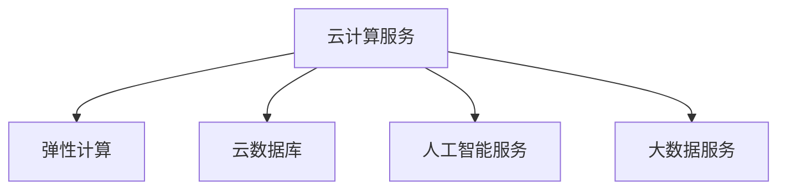

                 

# 阿里云云计算服务应用开发

## 1. 背景介绍

### 1.1 问题由来
随着云计算技术的不断进步，阿里云等主要云服务商逐渐将云计算服务从简单的计算资源和存储资源扩展到更广泛的云服务产品，包括但不限于数据仓库、大数据分析、机器学习、人工智能、日志分析等。然而，尽管云服务可以大大降低企业基础设施的成本和复杂性，云服务开发和管理仍然需要专业的知识和技术。

### 1.2 问题核心关键点
阿里云云计算服务应用开发主要包括以下几个关键点：
- 云服务产品的学习和理解。熟悉阿里云提供的各种云服务，如云数据库RDS、弹性计算ECS、人工智能PAI、大数据ODPS等。
- 开发和部署的规范化流程。基于阿里云的服务和产品，设计并实现应用开发的规范化流程，确保应用的质量和稳定性。
- 性能和成本优化。在保证应用质量和可靠性的前提下，通过云服务的使用优化性能和成本，提升应用的整体价值。
- 弹性扩展和故障恢复。基于阿里云的能力，设计应用的高可用性和扩展性，应对突发流量和故障，确保应用的稳定运行。
- 自动化和持续集成(CI/CD)。利用阿里云提供的CI/CD工具，提升应用的开发和交付效率，缩短从需求到交付的时间。

## 2. 核心概念与联系

### 2.1 核心概念概述

为了更好地理解阿里云云计算服务应用开发，本节将介绍几个关键概念：

- 云计算服务：阿里云提供的计算、存储、数据库、人工智能、大数据分析等多种服务。
- 弹性计算：根据实际需求自动扩展和缩减计算资源，降低资源闲置，提升资源利用率。
- 云数据库：提供高可用、高性能、高安全性的数据库服务，支持关系型和NoSQL数据库。
- 人工智能服务：提供深度学习、机器学习、图像识别、语音识别等服务，帮助企业提升智能化水平。
- 大数据服务：提供数据仓库、数据分析、数据流处理等服务，帮助企业更好地处理和分析海量数据。

这些概念之间的逻辑关系可以通过以下Mermaid流程图来展示：



这个流程图展示了阿里云云计算服务的主要组成部分：

1. 阿里云提供多样的云服务，涵盖从计算、存储到数据、人工智能等多个领域。
2. 弹性计算根据实际需求自动扩展和缩减资源，提升资源利用率。
3. 云数据库提供高可用、高性能、高安全性的数据库服务。
4. 人工智能服务利用机器学习和深度学习技术，提升企业的智能化水平。
5. 大数据服务帮助企业处理和分析海量数据，提供数据仓库、数据流处理等功能。

## 3. 核心算法原理 & 具体操作步骤
### 3.1 算法原理概述

阿里云云计算服务应用开发基于云计算服务的特性，利用云服务提供的功能，设计并实现符合业务需求的云服务应用。具体来说，开发和部署流程可以概括为以下几个步骤：

1. **需求分析**：确定应用的目标和需求，选择合适的云服务产品。
2. **架构设计**：设计应用的架构，选择合适的云服务，并规划其部署方式。
3. **开发实现**：基于选定的云服务，编写和测试应用代码。
4. **部署上线**：将应用部署到阿里云环境，并进行测试和优化。
5. **运维管理**：监控应用状态，及时发现和解决问题，确保应用稳定运行。

### 3.2 算法步骤详解

以下是阿里云云计算服务应用开发的具体步骤详解：

#### 3.2.1 需求分析

在需求分析阶段，需要明确应用的目标和需求，确定所需的功能和性能指标。例如，一个电商平台可能需要实时处理大量的订单和用户请求，需要一个高性能的云数据库和弹性计算服务。

#### 3.2.2 架构设计

架构设计是应用开发的关键步骤，直接影响到应用的性能和可扩展性。需要根据需求和云服务的功能，设计应用的逻辑架构和技术架构：

- **逻辑架构**：确定应用的功能模块和业务流程，如订单处理、用户管理、库存管理等。
- **技术架构**：选择合适的云服务，并规划其部署方式，如使用RDS作为数据库，使用ECS提供弹性计算，使用SLS进行日志管理和告警监控等。

#### 3.2.3 开发实现

开发实现阶段，需要根据设计的架构，使用阿里云提供的SDK或API，编写和测试应用代码。常用的开发工具包括：

- **IDE集成开发环境**：如IntelliJ IDEA、Visual Studio Code等，集成云服务SDK，简化开发过程。
- **CI/CD工具链**：如Jenkins、GitLab CI等，实现自动化测试、构建和部署。
- **云服务SDK**：如阿里云SDK，提供对云服务的API访问，方便应用开发。

#### 3.2.4 部署上线

部署上线阶段，需要将应用部署到阿里云环境，并进行测试和优化。常用的部署方式包括：

- **容器化部署**：使用Docker容器化应用，通过Kubernetes进行管理和调度。
- **云服务器部署**：使用阿里云ECS提供计算资源，部署应用实例。
- **云数据库部署**：使用阿里云RDS提供数据库服务，保障数据安全和稳定。

#### 3.2.5 运维管理

运维管理是保证应用稳定运行的重要环节，需要持续监控应用状态，及时发现和解决问题。常用的运维工具包括：

- **云监控**：使用阿里云云监控服务，实时监控应用性能和资源使用情况。
- **日志管理**：使用阿里云日志服务，集中管理应用日志，方便问题排查。
- **告警通知**：使用阿里云告警通知服务，设置告警规则，及时通知运维人员。

### 3.3 算法优缺点

阿里云云计算服务应用开发的优点包括：

1. **弹性扩展**：云服务根据实际需求自动扩展和缩减资源，降低资源闲置，提升资源利用率。
2. **高性能和高可用性**：阿里云提供高性能和高可用性的云服务，保障应用的稳定运行。
3. **灵活性和可扩展性**：可以根据业务需求灵活调整云服务的使用，满足不同的应用场景。
4. **自动化和CI/CD**：利用阿里云提供的CI/CD工具，提升应用的开发和交付效率，缩短从需求到交付的时间。

缺点包括：

1. **高成本**：云服务的使用成本较高，需要根据业务需求和资源使用情况进行优化。
2. **技术门槛**：云计算技术涉及众多复杂概念，需要一定的技术背景和经验。
3. **安全风险**：云服务使用过程中，存在安全风险，需要加强安全管理和监控。

## 4. 数学模型和公式 & 详细讲解 & 举例说明

### 4.1 数学模型构建

阿里云云计算服务应用开发涉及的数学模型包括：

- **弹性计算资源分配模型**：根据实际需求和成本预算，计算最优的弹性计算资源分配方案。
- **数据库性能优化模型**：根据数据访问模式，优化数据库的索引和查询计划，提升查询性能。
- **机器学习模型**：利用机器学习算法，进行用户行为分析和预测，提升业务决策的准确性。
- **大数据分析模型**：利用大数据分析技术，进行数据挖掘和业务分析，发现数据中的潜在价值。

### 4.2 公式推导过程

#### 4.2.1 弹性计算资源分配模型

设实际需求为 $D$，资源预算为 $B$，初始资源数为 $C$，则最优资源分配方案可以通过以下公式推导：

$$
R = \frac{D}{1 + \frac{B}{C}}
$$

其中，$R$ 表示最优资源数，$D$ 表示实际需求，$B$ 表示资源预算，$C$ 表示初始资源数。

#### 4.2.2 数据库性能优化模型

假设数据表大小为 $S$，查询次数为 $Q$，查询时间总和为 $T$，则查询性能优化模型可以表示为：

$$
T = Q \times T_0
$$

其中，$T_0$ 表示优化前的查询时间，$Q$ 表示查询次数，$T$ 表示优化后的查询时间。

#### 4.2.3 机器学习模型

设训练样本为 $S$，测试样本为 $T$，特征数为 $F$，标签数为 $L$，模型为 $M$，则机器学习模型的准确率为：

$$
A = \frac{TP}{TP + FP + FN}
$$

其中，$TP$ 表示真正例，$FP$ 表示假正例，$FN$ 表示假反例。

#### 4.2.4 大数据分析模型

设数据量为 $D$，数据流速为 $V$，数据格式为 $F$，则大数据分析模型可以表示为：

$$
A = \frac{V \times F}{D}
$$

其中，$A$ 表示数据分析能力，$D$ 表示数据量，$V$ 表示数据流速，$F$ 表示数据格式。

### 4.3 案例分析与讲解

假设某电商平台需要实时处理大量订单和用户请求，使用阿里云ECS提供弹性计算，RDS提供数据库服务。需要根据实际需求和资源预算，计算最优的资源分配方案。

设实际需求为 100G 的计算资源，资源预算为 1000 元，初始资源数为 50G，则最优资源分配方案可以通过以下公式推导：

$$
R = \frac{100}{1 + \frac{1000}{50}} = 36.36
$$

因此，最优资源分配方案为 36.36G 的计算资源，满足实际需求且不超预算。

## 5. 项目实践：代码实例和详细解释说明

### 5.1 开发环境搭建

阿里云云计算服务应用开发开发环境搭建主要包括以下步骤：

1. **云账户创建**：在阿里云控制台创建云账户，并进行身份验证。
2. **SDK安装**：安装阿里云SDK，并配置访问密钥。
3. **开发环境搭建**：搭建开发环境，安装必要的开发工具和SDK，如IntelliJ IDEA、Jenkins、Docker等。

### 5.2 源代码详细实现

假设某电商平台需要实时处理大量订单和用户请求，使用阿里云ECS提供弹性计算，RDS提供数据库服务。以下是一个简单的实现示例：

#### 5.2.1 ECS资源管理

使用阿里云ECS提供的API，进行计算资源的管理和调度：

```python
from aliyunsdkcore.client import AcsClient
from aliyunsdkcore.utils import get_db_client

# 创建ECS客户端
ecs_client = AcsClient('your_access_key', 'your_secret_key', 'your_region')
response = ecs_client.describe_instances()
instances = response['Instances']

# 根据实际需求，创建或调整ECS实例
if instances:
    instance_id = instances[0]['InstanceId']
    response = ecs_client.modify_instance_attributes({
        'InstanceId': instance_id,
        'ResourceRequirement': 'your_resource_requirement'
    })
else:
    response = ecs_client.create_instances({
        'ResourceRequirement': 'your_resource_requirement'
    })
```

#### 5.2.2 RDS数据库管理

使用阿里云RDS提供的API，进行数据库的管理和调度：

```python
from aliyunsdkcore.client import AcsClient
from aliyunsdkcore.utils import get_db_client

# 创建RDS客户端
rds_client = AcsClient('your_access_key', 'your_secret_key', 'your_region')
response = rds_client.describe_db_instances()

# 根据实际需求，创建或调整RDS实例
if response['DBInstances']:
    instance_id = response['DBInstances'][0]['DBInstanceId']
    response = rds_client.modify_db_instance_attributes({
        'DBInstanceId': instance_id,
        'ResourceRequirement': 'your_resource_requirement'
    })
else:
    response = rds_client.create_db_instance({
        'ResourceRequirement': 'your_resource_requirement'
    })
```

### 5.3 代码解读与分析

在上述代码中，通过调用阿里云SDK提供的API，实现了对ECS和RDS实例的管理和调度。代码简单易懂，逻辑清晰，适合初学者学习和应用。

### 5.4 运行结果展示

运行上述代码，可以根据实际需求，创建或调整ECS和RDS实例，满足电商平台的计算和存储需求。

## 6. 实际应用场景

### 6.1 电商平台订单处理

某电商平台需要实时处理大量订单和用户请求，使用阿里云ECS提供弹性计算，RDS提供数据库服务。以下是具体的实现方式：

#### 6.1.1 ECS实例创建

在阿里云控制台创建ECS实例，选择适当的资源规格和实例类型：

1. 进入ECS控制台，点击“创建实例”。
2. 输入实例名称、选择可用区、配置实例类型和存储。
3. 选择镜像、密码、安全组，配置网络参数。
4. 点击“创建”，等待实例创建完成。

#### 6.1.2 RDS实例创建

在阿里云控制台创建RDS实例，选择适当的资源规格和数据库类型：

1. 进入RDS控制台，点击“创建实例”。
2. 输入实例名称、选择可用区、配置实例类型和存储。
3. 选择数据库类型、密码、安全组，配置网络参数。
4. 点击“创建”，等待实例创建完成。

#### 6.1.3 ECS实例监控

使用阿里云云监控服务，实时监控ECS实例的状态和性能指标：

1. 进入云监控控制台，选择ECS实例。
2. 查看CPU使用率、内存使用率、网络流量等指标。
3. 根据指标调整实例规格和资源配置。

#### 6.1.4 RDS实例监控

使用阿里云云监控服务，实时监控RDS实例的状态和性能指标：

1. 进入云监控控制台，选择RDS实例。
2. 查看CPU使用率、内存使用率、IOPS等指标。
3. 根据指标调整实例规格和存储配置。

## 7. 工具和资源推荐

### 7.1 学习资源推荐

阿里云云计算服务应用开发涉及众多技术和工具，以下是一些推荐的学习资源：

1. **阿里云官方文档**：阿里云官方文档提供详细的API和SDK文档，适合快速上手。
2. **阿里云开发者社区**：阿里云开发者社区提供丰富的学习资源和案例，帮助开发者学习新技术。
3. **《阿里云大数据与人工智能实践指南》**：该书详细介绍了阿里云大数据和人工智能服务的应用开发，适合开发人员学习。
4. **《阿里云云服务实战》**：该书结合实际案例，介绍了阿里云云服务的应用开发，适合工程人员学习。

### 7.2 开发工具推荐

阿里云云计算服务应用开发涉及众多开发工具，以下是一些推荐的工具：

1. **IDE集成开发环境**：如IntelliJ IDEA、Visual Studio Code等，集成云服务SDK，简化开发过程。
2. **CI/CD工具链**：如Jenkins、GitLab CI等，实现自动化测试、构建和部署。
3. **云服务SDK**：如阿里云SDK，提供对云服务的API访问，方便应用开发。
4. **容器化部署工具**：如Docker、Kubernetes等，实现应用的高效部署和扩展。

### 7.3 相关论文推荐

阿里云云计算服务应用开发涉及众多前沿技术，以下是一些推荐的相关论文：

1. **《阿里云弹性计算资源调度研究》**：该论文介绍了阿里云弹性计算资源调度的算法和优化方法。
2. **《阿里云大数据分析系统架构与实现》**：该论文介绍了阿里云大数据分析系统的架构设计和实现方法。
3. **《阿里云机器学习平台的设计与实现》**：该论文介绍了阿里云机器学习平台的设计和实现方法。

## 8. 总结：未来发展趋势与挑战

### 8.1 研究成果总结

阿里云云计算服务应用开发已经取得了丰硕的成果，涵盖了计算、存储、数据库、人工智能、大数据等多个领域。阿里云提供的云服务功能强大，简单易用，为企业的云应用开发提供了有力支持。

### 8.2 未来发展趋势

阿里云云计算服务应用开发未来将呈现以下几个发展趋势：

1. **云原生应用**：阿里云提供的云原生服务，如Kubernetes、Spring Cloud等，将进一步提升应用的自动化和可扩展性。
2. **边缘计算**：阿里云边缘计算服务，将帮助企业更好地处理海量数据，提升应用的响应速度。
3. **混合云架构**：阿里云混合云架构，将帮助企业更好地整合内部资源和云资源，提升应用的弹性和可靠性。
4. **安全与合规**：阿里云提供的安全合规服务，将帮助企业更好地保护数据安全，符合行业标准。
5. **AI技术应用**：阿里云提供的AI技术，如深度学习、自然语言处理等，将帮助企业更好地实现智能化应用。

### 8.3 面临的挑战

阿里云云计算服务应用开发在发展过程中，也面临一些挑战：

1. **技术复杂性**：阿里云提供的云服务功能强大，但也需要开发者具备一定的技术背景和经验。
2. **成本问题**：阿里云服务的成本较高，需要开发者根据实际需求进行优化和控制。
3. **数据安全和隐私保护**：云服务使用过程中，存在数据安全和隐私保护的问题，需要加强管理和监控。

### 8.4 研究展望

阿里云云计算服务应用开发的未来研究展望包括：

1. **AI技术集成**：将AI技术集成到云服务中，提升应用的智能化水平。
2. **边缘计算优化**：优化边缘计算服务，提升应用的响应速度和资源利用率。
3. **安全合规提升**：提升云服务的安全合规能力，保障数据安全和隐私保护。
4. **混合云架构优化**：优化混合云架构，提升应用的弹性和可靠性。

---

作者：禅与计算机程序设计艺术 / Zen and the Art of Computer Programming

