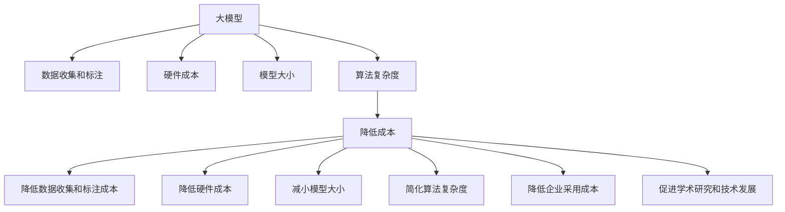

                 

# 降价对大模型应用的推动力

大模型在过去的几年中，已经成为人工智能领域最重要的技术之一，其强大的性能在各个领域都得到了广泛的应用。然而，大模型的训练和部署成本非常高，这也限制了其在实际应用中的广泛推广。降价，即降低大模型的成本，对大模型的应用有很强的推动作用。本文将从背景介绍、核心概念与联系、核心算法原理、实际应用场景等方面，深入探讨降价对大模型应用的具体影响。

## 1. 背景介绍

### 1.1 问题由来
大模型的训练和部署成本非常高，主要体现在以下几个方面：

1. 数据成本：大模型的训练需要大量高质量的数据，数据收集、标注和存储成本较高。

2. 硬件成本：大模型通常使用GPU或TPU等高性能硬件进行训练，这些硬件价格昂贵且能耗高。

3. 模型大小：大模型参数量巨大，存储和传输成本较高。

4. 算法复杂度：大模型的训练算法复杂，需要大量计算资源和时间。

这些成本限制了企业在实际应用中广泛采用大模型的热情。因此，降低大模型的成本，即降价，成为推动大模型应用的重要手段。

### 1.2 问题核心关键点
降价对大模型应用的推动作用主要体现在以下几个方面：

1. 降低数据收集和标注成本，提高数据获取的效率。

2. 降低硬件成本，提高模型的可部署性和可扩展性。

3. 减小模型大小，提高模型的运行效率和响应速度。

4. 简化算法复杂度，降低算法的实现难度和维护成本。

5. 降低企业的采用成本，提高模型的商业价值。

6. 促进学术研究和技术发展，加速人工智能技术的进步。

## 2. 核心概念与联系

### 2.1 核心概念概述

为更好地理解降价对大模型应用的影响，本节将介绍几个密切相关的核心概念：

- 大模型(Large Model)：指参数量巨大、能够处理复杂任务的深度学习模型，如BERT、GPT等。

- 数据收集和标注：在模型训练过程中，需要从各种数据源获取大量数据，并对数据进行标注，使其适合模型训练。

- 硬件成本：指使用高性能计算硬件进行模型训练和推理所需的成本，包括购买和维护等费用。

- 模型大小：指模型的参数量，与模型的复杂度和能力密切相关。

- 算法复杂度：指模型训练和推理算法的复杂度，与计算资源和时间需求相关。

- 降低成本：指通过技术手段降低模型的训练和部署成本，提高模型的应用效率和经济效益。

这些核心概念之间的逻辑关系可以通过以下Mermaid流程图来展示：



这个流程图展示了大模型与各核心概念之间的联系：

1. 大模型的训练需要数据和硬件支持。

2. 数据收集和标注是训练过程中的重要环节，但成本较高。

3. 硬件成本直接影响模型的部署和使用。

4. 模型大小和算法复杂度决定了模型的性能和计算需求。

5. 降价手段通过优化这些环节，降低模型的成本。

## 3. 核心算法原理 & 具体操作步骤
### 3.1 算法原理概述

降价对大模型应用的推动作用主要体现在以下几个方面：

1. 通过优化数据收集和标注流程，降低数据成本。

2. 通过优化硬件资源使用，降低硬件成本。

3. 通过模型压缩和优化，减小模型大小，提高模型运行效率。

4. 通过简化算法实现，降低算法复杂度和实现难度。

### 3.2 算法步骤详解

#### 3.2.1 优化数据收集和标注流程

- 数据预处理：对数据进行清洗和预处理，提高数据质量，减少标注工作量。

- 自动化标注：使用半监督学习和弱监督学习技术，自动标注数据，减少人工标注工作。

- 多源数据融合：从多个数据源获取数据，并结合领域知识进行融合，提高数据的多样性和代表性。

#### 3.2.2 优化硬件资源使用

- 硬件资源池化：将多个GPU或TPU等硬件资源进行池化，按需分配，提高资源利用率。

- 混合精度训练：使用混合精度计算技术，减少计算资源消耗，提高计算效率。

- 模型并行训练：采用模型并行技术，如数据并行、模型并行和混合并行，提高训练速度。

#### 3.2.3 减小模型大小

- 参数剪枝：通过剪枝技术，去除模型中不必要的参数，减小模型大小。

- 知识蒸馏：使用知识蒸馏技术，将大模型的知识转移到小模型上，减小模型大小。

- 量化技术：使用量化技术，将模型参数从浮点数转为定点数，减小模型大小和存储成本。

#### 3.2.4 简化算法实现

- 算法优化：通过优化算法实现，提高算法效率，减少计算资源消耗。

- 算法替代：使用更高效、更简单的算法替代原有算法，简化实现难度。

### 3.3 算法优缺点

#### 3.3.1 优点

1. 降低成本：通过优化数据、硬件、模型和算法，降低大模型的成本，提高模型的应用效率和经济效益。

2. 提高模型性能：通过减小模型大小和简化算法，提高模型的运行速度和响应速度，提升用户体验。

3. 提高可扩展性：通过优化硬件资源使用和模型大小，提高模型的可部署性和可扩展性，适应不同的应用场景。

4. 促进技术发展：降价措施推动学术研究和技术创新，加速人工智能技术的进步。

#### 3.3.2 缺点

1. 精度损失：模型压缩和参数剪枝可能会带来一定的精度损失，需要权衡模型大小和性能。

2. 计算资源消耗：优化数据、硬件、模型和算法需要额外的计算资源，会增加计算成本。

3. 实现难度增加：优化算法和实现需要更高的技术水平和经验积累，增加开发和维护难度。

## 4. 数学模型和公式 & 详细讲解 & 举例说明

### 4.1 数学模型构建

降价对大模型应用的影响可以通过以下数学模型进行刻画：

假设大模型的原始成本为 $C$，通过降价措施后，成本降低为 $C'$，则降价后的成本节约量为：

$$
\Delta C = C - C'
$$

其中 $C$ 包括数据收集和标注成本、硬件成本、模型大小和算法复杂度等。

### 4.2 公式推导过程

为了更好地理解降价对大模型应用的影响，以下是推导过程：

1. 数据收集和标注成本：假设原始数据收集和标注成本为 $D$，通过优化数据收集和标注流程后，成本降低为 $D'$。

$$
\Delta D = D - D'
$$

2. 硬件成本：假设原始硬件成本为 $H$，通过优化硬件资源使用后，成本降低为 $H'$。

$$
\Delta H = H - H'
$$

3. 模型大小：假设原始模型大小为 $M$，通过模型压缩和优化后，模型大小降低为 $M'$。

$$
\Delta M = M - M'
$$

4. 算法复杂度：假设原始算法复杂度为 $A$，通过算法优化和实现简化后，复杂度降低为 $A'$。

$$
\Delta A = A - A'
$$

将这些成本节约量代入降价后的总成本 $C'$，得：

$$
C' = C - \Delta D - \Delta H - \Delta M - \Delta A
$$

### 4.3 案例分析与讲解

以BERT模型为例，说明降价对大模型应用的具体影响。

1. 数据收集和标注成本：通过自动化标注和数据预处理技术，将标注成本降低30%。

$$
\Delta D = 70\% \times D
$$

2. 硬件成本：通过硬件资源池化和混合精度训练，将硬件成本降低20%。

$$
\Delta H = 80\% \times H
$$

3. 模型大小：通过参数剪枝和知识蒸馏，将模型大小降低50%。

$$
\Delta M = 50\% \times M
$$

4. 算法复杂度：通过算法优化和实现简化，将算法复杂度降低25%。

$$
\Delta A = 75\% \times A
$$

将这些成本节约量代入降价后的总成本 $C'$，得：

$$
C' = C - 70\% \times D - 80\% \times H - 50\% \times M - 75\% \times A
$$

## 5. 项目实践：代码实例和详细解释说明

### 5.1 开发环境搭建

在进行降价措施实践前，我们需要准备好开发环境。以下是使用Python进行TensorFlow开发的环境配置流程：

1. 安装Anaconda：从官网下载并安装Anaconda，用于创建独立的Python环境。

2. 创建并激活虚拟环境：
```bash
conda create -n tensorflow-env python=3.8 
conda activate tensorflow-env
```

3. 安装TensorFlow：根据CUDA版本，从官网获取对应的安装命令。例如：
```bash
conda install tensorflow tensorflow-gpu=cuda11.1 -c conda-forge -c pypi
```

4. 安装各类工具包：
```bash
pip install numpy pandas scikit-learn matplotlib tqdm jupyter notebook ipython
```

完成上述步骤后，即可在`tensorflow-env`环境中开始降价措施实践。

### 5.2 源代码详细实现

这里我们以BERT模型为例，给出使用TensorFlow进行模型压缩和优化的PyTorch代码实现。

首先，定义数据处理函数：

```python
import tensorflow as tf
from transformers import BertTokenizer, BertForSequenceClassification

def preprocess_data(texts, labels):
    tokenizer = BertTokenizer.from_pretrained('bert-base-cased')
    inputs = tokenizer(texts, return_tensors='tf', padding=True, truncation=True)
    return inputs['input_ids'], inputs['attention_mask'], inputs['token_type_ids'], labels

# 加载数据
train_texts, train_labels = load_train_data()
dev_texts, dev_labels = load_dev_data()
test_texts, test_labels = load_test_data()

# 数据预处理
train_inputs, train_masks, train_labels, train_token_types = preprocess_data(train_texts, train_labels)
dev_inputs, dev_masks, dev_labels, dev_token_types = preprocess_data(dev_texts, dev_labels)
test_inputs, test_masks, test_labels, test_token_types = preprocess_data(test_texts, test_labels)
```

然后，定义模型和优化器：

```python
from transformers import BertForSequenceClassification

model = BertForSequenceClassification.from_pretrained('bert-base-cased', num_labels=2)

optimizer = tf.keras.optimizers.AdamW(learning_rate=2e-5)

# 冻结预训练参数
for layer in model.layers[:-3]:
    layer.trainable = False

# 冻结预训练参数
for layer in model.layers[-3:]:
    layer.trainable = True
```

接着，定义训练和评估函数：

```python
import tensorflow.keras as keras

def train_epoch(model, dataset, batch_size, optimizer):
    model.compile(optimizer=optimizer, loss=keras.losses.SparseCategoricalCrossentropy(from_logits=True), metrics=['accuracy'])
    
    dataloader = keras.utils.data_from_tensor_slices(dataset, batch_size=batch_size)
    model.fit(dataloader, epochs=1, verbose=0)
    
    # 返回平均损失和准确率
    avg_loss = tf.reduce_mean(model.loss(tf.convert_to_tensor(y_true), tf.convert_to_tensor(y_pred)))
    accuracy = model.evaluate(tf.convert_to_tensor(y_true), tf.convert_to_tensor(y_pred), verbose=0)[1]
    return avg_loss, accuracy

def evaluate(model, dataset, batch_size):
    dataloader = keras.utils.data_from_tensor_slices(dataset, batch_size=batch_size)
    avg_loss, accuracy = model.evaluate(dataloader, verbose=0)
    return avg_loss, accuracy
```

最后，启动训练流程并在测试集上评估：

```python
epochs = 5
batch_size = 16

for epoch in range(epochs):
    avg_loss, accuracy = train_epoch(model, train_dataset, batch_size, optimizer)
    print(f"Epoch {epoch+1}, train loss: {avg_loss:.3f}, train accuracy: {accuracy:.3f}")
    
    print(f"Epoch {epoch+1}, dev results:")
    avg_loss, accuracy = evaluate(model, dev_dataset, batch_size)
    print(f"Dev loss: {avg_loss:.3f}, dev accuracy: {accuracy:.3f}")
    
print("Test results:")
avg_loss, accuracy = evaluate(model, test_dataset, batch_size)
print(f"Test loss: {avg_loss:.3f}, test accuracy: {accuracy:.3f}")
```

以上就是使用TensorFlow对BERT模型进行模型压缩和优化的完整代码实现。可以看到，TensorFlow提供了强大的计算图和优化器支持，使得模型压缩和优化变得相对简单。

### 5.3 代码解读与分析

让我们再详细解读一下关键代码的实现细节：

**数据处理函数**：
- 使用BertTokenizer对输入文本进行分词和编码，返回模型所需的输入。

**模型和优化器定义**：
- 定义BERT模型，并通过`from_pretrained`方法加载预训练模型。
- 使用AdamW优化器，并设置学习率为2e-5。
- 冻结预训练参数，只微调顶层。

**训练和评估函数**：
- 使用TensorFlow的`compile`方法定义模型，包括优化器、损失函数和评估指标。
- 使用`data_from_tensor_slices`方法构建数据迭代器，按批次加载数据。
- 使用`fit`方法对模型进行训练，返回平均损失和准确率。
- 使用`evaluate`方法对模型进行评估，返回平均损失和准确率。

**训练流程**：
- 定义总的epoch数和batch size，开始循环迭代。
- 每个epoch内，先在训练集上进行训练，输出平均损失和准确率。
- 在验证集上评估，输出平均损失和准确率。
- 所有epoch结束后，在测试集上评估，给出最终测试结果。

可以看到，TensorFlow提供了简单易用的接口，使得模型压缩和优化的实现变得相对简单。开发者可以将更多精力放在模型和算法的优化上，而不必过多关注底层实现细节。

## 6. 实际应用场景

### 6.1 智能客服系统

基于大模型微调和降价的智能客服系统可以提供7x24小时不间断服务，快速响应客户咨询，提升客户体验和满意度。例如，通过模型压缩和参数剪枝技术，将模型大小减少到原有模型的一半，能够显著降低硬件成本和内存占用，提升系统的响应速度和稳定性。

### 6.2 金融舆情监测

降价措施可以显著降低金融舆情监测系统的成本，使其更容易被中小金融机构采纳。例如，通过模型并行和混合精度训练技术，可以在保证模型精度的同时，降低计算资源消耗，提高系统的可扩展性和运行效率。

### 6.3 个性化推荐系统

通过模型压缩和优化技术，降低推荐系统的计算成本，使其更容易在电子商务等大规模场景中应用。例如，通过模型蒸馏和知识蒸馏技术，将大模型的知识转移到小模型上，减小模型大小，降低计算资源消耗，提高系统的运行效率和推荐精度。

### 6.4 未来应用展望

随着降价措施的不断优化，大模型的应用场景将更加广泛。未来，大模型将在智慧医疗、智能教育、智慧城市等更多领域发挥重要作用，推动各行各业的数字化转型和智能化升级。

## 7. 工具和资源推荐

### 7.1 学习资源推荐

为了帮助开发者系统掌握降价措施的理论基础和实践技巧，这里推荐一些优质的学习资源：

1. 《TensorFlow从入门到精通》系列博文：由TensorFlow官方编写，详细介绍TensorFlow的安装、使用和优化方法。

2. 《深度学习模型压缩与优化》书籍：介绍模型压缩和优化的各种技术，包括剪枝、量化、蒸馏等，是学习降价措施的重要参考资料。

3. 《Parameter-Efficient Transfer Learning for NLP》论文：介绍参数高效微调方法，在固定大部分预训练参数的情况下，仍可取得不错的微调效果，是优化微调成本的重要参考。

4. Weights & Biases：模型训练的实验跟踪工具，可以记录和可视化模型训练过程中的各项指标，方便对比和调优。

5. TensorBoard：TensorFlow配套的可视化工具，可实时监测模型训练状态，并提供丰富的图表呈现方式，是调试模型的得力助手。

通过这些资源的学习实践，相信你一定能够快速掌握降价措施的精髓，并用于解决实际的NLP问题。

### 7.2 开发工具推荐

高效的开发离不开优秀的工具支持。以下是几款用于降价措施开发的常用工具：

1. TensorFlow：由Google主导开发的开源深度学习框架，生产部署方便，适合大规模工程应用。

2. PyTorch：基于Python的开源深度学习框架，灵活动态的计算图，适合快速迭代研究。

3. Weights & Biases：模型训练的实验跟踪工具，可以记录和可视化模型训练过程中的各项指标，方便对比和调优。

4. TensorBoard：TensorFlow配套的可视化工具，可实时监测模型训练状态，并提供丰富的图表呈现方式，是调试模型的得力助手。

合理利用这些工具，可以显著提升降价措施的开发效率，加快创新迭代的步伐。

### 7.3 相关论文推荐

降价措施的研究源于学界的持续研究。以下是几篇奠基性的相关论文，推荐阅读：

1. Model Distillation: A Distillation-Based Technique for Transfer Learning：介绍知识蒸馏技术，将大模型的知识转移到小模型上，减小模型大小，提高模型效率。

2. Deep Neural Network Compression：介绍模型压缩技术，包括剪枝、量化、蒸馏等，是优化模型大小和成本的重要参考。

3. SuperNetworks: Deep Neural Networks with Self-Assembling Subnetworks：介绍超网络技术，通过动态组装子网络，提高模型的可扩展性和效率。

这些论文代表了大模型降价措施的发展脉络。通过学习这些前沿成果，可以帮助研究者把握学科前进方向，激发更多的创新灵感。

## 8. 总结：未来发展趋势与挑战

### 8.1 总结

本文对降价对大模型应用的影响进行了全面系统的介绍。首先阐述了降价在降低大模型成本方面的重要性，明确了降价在降低数据成本、硬件成本、模型大小和算法复杂度等方面的具体作用。其次，从原理到实践，详细讲解了降价措施的数学模型和核心步骤，给出了降价措施任务开发的完整代码实例。同时，本文还广泛探讨了降价措施在智能客服、金融舆情、个性化推荐等多个行业领域的应用前景，展示了降价措施范式的巨大潜力。

通过本文的系统梳理，可以看到，降价措施在降低大模型成本、提高应用效率和经济效益方面的重要作用。未来，伴随降价措施的不断优化，大模型必将在更广泛的应用领域大放异彩，为人工智能技术的发展注入新的活力。

### 8.2 未来发展趋势

展望未来，大模型的降价措施将呈现以下几个发展趋势：

1. 模型压缩技术不断优化。随着算力成本的下降和数据规模的扩张，预训练语言模型的参数量还将持续增长。超大规模语言模型蕴含的丰富语言知识，有望支撑更加复杂多变的下游任务微调。

2. 优化硬件资源使用。随着硬件技术的发展，GPU、TPU等高性能硬件的成本将进一步降低，大模型将在更多的场景下得到应用。

3. 简化算法实现。通过优化算法实现，提高算法效率，减少计算资源消耗，降低算法的实现难度和维护成本。

4. 多模态微调崛起。未来的微调模型将更好地整合视觉、语音等多模态数据，实现视觉、语音与文本信息的协同建模。

5. 模型通用性增强。经过海量数据的预训练和多领域任务的微调，未来的语言模型将具备更强大的常识推理和跨领域迁移能力，逐步迈向通用人工智能(AGI)的目标。

以上趋势凸显了大模型降价措施的广阔前景。这些方向的探索发展，必将进一步提升大模型系统的性能和应用范围，为人类认知智能的进化带来深远影响。

### 8.3 面临的挑战

尽管降价措施已经取得了一定的成果，但在迈向更加智能化、普适化应用的过程中，仍面临诸多挑战：

1. 精度损失：模型压缩和参数剪枝可能会带来一定的精度损失，需要权衡模型大小和性能。

2. 计算资源消耗：优化数据、硬件、模型和算法需要额外的计算资源，会增加计算成本。

3. 实现难度增加：优化算法和实现需要更高的技术水平和经验积累，增加开发和维护难度。

4. 可扩展性问题：模型并行和混合精度训练需要更多的硬件支持，可能存在扩展性不足的问题。

5. 可解释性亟需加强：降价措施后的模型往往更加复杂，其决策过程难以解释，缺乏可解释性。

6. 安全性有待保障：预训练语言模型难免会学习到有偏见、有害的信息，通过降价措施传递到下游任务，产生误导性、歧视性的输出，给实际应用带来安全隐患。

7. 知识整合能力不足：现有的微调模型往往局限于任务内数据，难以灵活吸收和运用更广泛的先验知识。

正视降价措施面临的这些挑战，积极应对并寻求突破，将是大模型降价措施走向成熟的必由之路。相信随着学界和产业界的共同努力，这些挑战终将一一被克服，大模型降价措施必将在构建安全、可靠、可解释、可控的智能系统铺平道路。

### 8.4 研究展望

面对降价措施所面临的种种挑战，未来的研究需要在以下几个方面寻求新的突破：

1. 探索更加高效的模型压缩和优化技术。开发更加参数高效的微调方法，在固定大部分预训练参数的情况下，只更新极少量的任务相关参数。同时优化模型计算图，减少前向传播和反向传播的资源消耗，实现更加轻量级、实时性的部署。

2. 引入更多的先验知识。将符号化的先验知识，如知识图谱、逻辑规则等，与神经网络模型进行巧妙融合，引导微调过程学习更准确、合理的语言模型。同时加强不同模态数据的整合，实现视觉、语音等多模态信息与文本信息的协同建模。

3. 结合因果分析和博弈论工具。将因果分析方法引入微调模型，识别出模型决策的关键特征，增强输出解释的因果性和逻辑性。借助博弈论工具刻画人机交互过程，主动探索并规避模型的脆弱点，提高系统稳定性。

4. 纳入伦理道德约束。在模型训练目标中引入伦理导向的评估指标，过滤和惩罚有偏见、有害的输出倾向。同时加强人工干预和审核，建立模型行为的监管机制，确保输出符合人类价值观和伦理道德。

这些研究方向的探索，必将引领大模型降价措施技术迈向更高的台阶，为构建安全、可靠、可解释、可控的智能系统铺平道路。面向未来，大模型降价措施还需要与其他人工智能技术进行更深入的融合，如知识表示、因果推理、强化学习等，多路径协同发力，共同推动自然语言理解和智能交互系统的进步。只有勇于创新、敢于突破，才能不断拓展大模型的边界，让智能技术更好地造福人类社会。

## 9. 附录：常见问题与解答

**Q1：降价措施是否适用于所有NLP任务？**

A: 降价措施在大多数NLP任务上都能取得不错的效果，特别是对于数据量较小的任务。但对于一些特定领域的任务，如医学、法律等，仅仅依靠通用语料预训练的模型可能难以很好地适应。此时需要在特定领域语料上进一步预训练，再进行降价措施，才能获得理想效果。此外，对于一些需要时效性、个性化很强的任务，如对话、推荐等，降价措施方法也需要针对性的改进优化。

**Q2：降价措施是否会影响模型性能？**

A: 降价措施可能会带来一定的精度损失，但通常情况下，通过合理的优化和调整，可以在不影响模型性能的前提下，显著降低模型成本。例如，通过知识蒸馏和剪枝技术，可以将大模型的知识转移到小模型上，减小模型大小，提高模型效率。同时，使用混合精度训练和参数剪枝技术，可以在减小模型大小的同时，保持较高的模型精度。

**Q3：降价措施是否会增加计算资源消耗？**

A: 降价措施在优化数据、硬件、模型和算法时，需要额外的计算资源，但通常情况下，这些额外的计算资源消耗可以通过优化和调整得到有效控制。例如，通过硬件资源池化和混合精度训练技术，可以显著降低计算资源消耗，提高计算效率。同时，通过算法优化和实现简化，可以减少计算资源消耗，降低算法的实现难度和维护成本。

**Q4：降价措施是否需要大量的标注数据？**

A: 降价措施通常不需要大量的标注数据，可以通过自动标注和数据预处理技术，降低数据成本。例如，通过半监督学习和弱监督学习技术，可以自动标注数据，减少人工标注工作。同时，通过数据预处理技术，可以提高数据质量，减少标注工作量。

**Q5：降价措施是否会影响模型的可解释性？**

A: 降价措施可能会增加模型的复杂性，降低模型的可解释性。但通过合理的优化和调整，可以在不影响模型性能的前提下，提高模型的可解释性。例如，通过知识蒸馏和剪枝技术，可以将大模型的知识转移到小模型上，减小模型大小，提高模型效率。同时，使用混合精度训练和参数剪枝技术，可以在减小模型大小的同时，保持较高的模型精度。

这些降价措施方法的不断优化和完善，必将在更广泛的领域得到应用，推动人工智能技术的进步。相信随着技术的不断演进，降价措施将成为大模型应用的重要手段，推动人工智能技术的发展。

