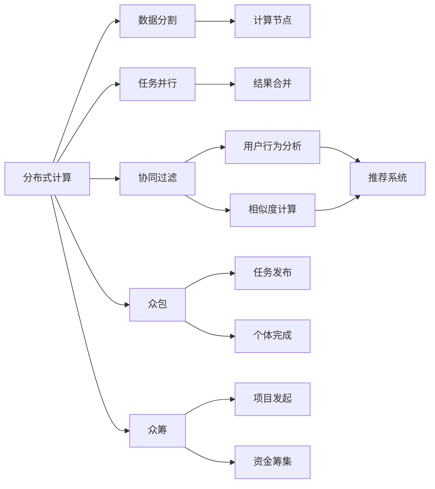

                 

# 集体智慧的力量：解决复杂问题的创新途径

> 关键词：集体智慧, 分布式计算, 众包, 众筹, 协同过滤, 算法优化, 大尺度数据分析, 复杂系统优化, 群体智能

## 1. 背景介绍

在今天的信息时代，复杂的系统问题变得前所未有的普遍和紧迫。从优化供应链管理到应对全球气候变化，再到破解疾病密码，这些问题都超出了任何一个单一团队或组织的能力范围。在这种背景下，集体智慧的力量变得尤为关键。本文将探讨如何利用分布式计算、众包、众筹、协同过滤、算法优化等手段，通过集体智慧解决复杂的系统问题。

## 2. 核心概念与联系

### 2.1 核心概念概述

- **集体智慧**：指的是通过多个智能体或组织协同工作，综合多方的知识、技能和资源，来解决问题或做出决策的能力。
- **分布式计算**：指将一个大的计算任务分解成多个小的计算任务，分配给多个计算节点并行处理，最终将结果汇总的过程。
- **众包**：指利用网络平台，将一些简单的任务或创意内容分发给非专业的个体完成，从而获取多样化的观点和解决方案。
- **众筹**：指通过在线平台筹集项目所需的资金，通常涉及创意、设计、产品开发等需要较高成本的领域。
- **协同过滤**：指通过分析用户行为数据，发现并推荐相似的物品或内容给用户，广泛应用于个性化推荐系统中。
- **算法优化**：指通过改进算法模型，提升其在特定任务上的性能，包括但不限于数据预处理、模型训练、超参数调优等。
- **大尺度数据分析**：指对大规模数据集进行高效处理和分析，以从中发现有价值的洞见和模式。
- **复杂系统优化**：指通过数学建模、仿真和算法，来优化复杂系统的运行效率和稳定性。

### 2.2 核心概念原理和架构的 Mermaid 流程图



## 3. 核心算法原理 & 具体操作步骤

### 3.1 算法原理概述

集体智慧的解决方案通常基于分布式计算框架，如MapReduce、Spark等，这些框架允许将大规模计算任务分解为多个小任务，并在多个计算节点上并行处理。在数据处理阶段，算法优化和协同过滤技术用于优化数据处理和推荐过程，从而提升系统的性能和效率。

### 3.2 算法步骤详解

**Step 1: 数据预处理**
- 收集和清洗数据，确保数据的质量和一致性。
- 对数据进行必要的预处理，如特征提取、归一化等。

**Step 2: 分布式计算**
- 将计算任务分割为多个小任务，并分配到不同的计算节点。
- 并行处理各个任务，汇总结果。

**Step 3: 协同过滤**
- 分析用户行为数据，发现用户之间的相似性。
- 基于相似性，推荐物品或内容给用户。

**Step 4: 算法优化**
- 对算法模型进行优化，提升其在特定任务上的性能。
- 通过超参数调优、模型选择等方法，进一步提升系统效率。

**Step 5: 结果集成与反馈**
- 将各个节点的结果集成，形成最终结果。
- 根据反馈不断调整算法和参数，优化系统性能。

### 3.3 算法优缺点

**优点**：
- 能够利用集体智慧，综合多方观点和解决方案，提升决策的准确性和全面性。
- 分布式计算能够显著提升处理大规模数据的效率。
- 协同过滤和算法优化能够提升系统的性能和效率。

**缺点**：
- 分布式计算的复杂性可能导致系统管理和维护成本较高。
- 协同过滤和算法优化需要大量的数据和计算资源。
- 个体参与者的素质和贡献可能存在差异，影响集体智慧的最终质量。

### 3.4 算法应用领域

集体智慧的方法广泛应用在以下几个领域：

- **供应链管理**：利用众包和分布式计算优化供应链的物流和库存管理。
- **医疗健康**：通过众筹和分布式计算，加速新药研发和疾病诊断。
- **环境保护**：利用大尺度数据分析和协同过滤技术，优化资源配置和污染控制。
- **金融科技**：通过算法优化和众包，提升金融产品的设计和风险管理。
- **教育培训**：利用协同过滤和分布式计算，提供个性化学习路径和资源推荐。

## 4. 数学模型和公式 & 详细讲解

### 4.1 数学模型构建

假设我们有一个复杂系统 $S$，需要对其某个指标 $I$ 进行优化。我们将 $S$ 分解为 $N$ 个子系统 $S_1, S_2, ..., S_N$，并定义每个子系统的贡献度 $w_i$。

我们的目标是最小化 $S$ 的指标 $I$，即：

$$
\min_{w_i} \sum_{i=1}^N w_i I_i
$$

其中 $I_i$ 是第 $i$ 个子系统的指标。

### 4.2 公式推导过程

对于上述问题，我们可以使用拉格朗日乘数法进行求解。定义拉格朗日函数 $L(w_i, \lambda)$ 如下：

$$
L(w_i, \lambda) = \sum_{i=1}^N w_i I_i - \lambda \left( \sum_{i=1}^N w_i - 1 \right)
$$

对 $w_i$ 和 $\lambda$ 求偏导，得到：

$$
\frac{\partial L}{\partial w_i} = I_i - \lambda = 0
$$

$$
\frac{\partial L}{\partial \lambda} = \sum_{i=1}^N w_i - 1 = 0
$$

解上述方程组，得到：

$$
w_i = \frac{I_i}{\sum_{j=1}^N I_j}
$$

将 $w_i$ 代入目标函数，得到：

$$
I = \sum_{i=1}^N w_i I_i = \frac{I_1}{\sum_{j=1}^N I_j} I_1 + \frac{I_2}{\sum_{j=1}^N I_j} I_2 + ... + \frac{I_N}{\sum_{j=1}^N I_j} I_N
$$

### 4.3 案例分析与讲解

假设我们要优化一个电商平台的商品推荐系统。平台上有 $N$ 种商品，每种商品的用户评分分别为 $I_1, I_2, ..., I_N$。

我们可以通过众包的方式收集用户的评分数据，并使用分布式计算框架处理数据。然后，利用协同过滤技术，分析用户行为数据，发现商品之间的相似性。最后，通过算法优化，提升推荐系统的性能。

例如，我们可以使用矩阵分解方法，将用户评分数据分解为 $U$ 和 $V$ 两个矩阵，其中 $U$ 和 $V$ 分别表示用户和商品的特征向量。然后，通过最小二乘法，求解 $U$ 和 $V$ 的值，得到推荐矩阵 $P$。

$$
P = UV^T
$$

其中，$P$ 表示推荐矩阵，$U$ 表示用户特征向量矩阵，$V$ 表示商品特征向量矩阵。

## 5. 项目实践：代码实例和详细解释说明

### 5.1 开发环境搭建

为了进行项目实践，我们需要安装以下软件和库：

- Python：安装最新版本的 Python。
- pip：安装 pip，以便安装其他依赖库。
- Numpy：安装 Numpy，用于科学计算。
- Pandas：安装 Pandas，用于数据处理。
- Scikit-learn：安装 Scikit-learn，用于机器学习。
- Scipy：安装 Scipy，用于科学计算和数据处理。
- Matplotlib：安装 Matplotlib，用于数据可视化。

### 5.2 源代码详细实现

下面是一个简单的分布式计算和协同过滤算法的实现。我们使用 Python 和 Spark 进行分布式计算，使用 Numpy 和 Scikit-learn 进行数据处理和协同过滤。

首先，我们定义一个函数，用于计算用户和商品之间的相似度。

```python
import numpy as np
from scipy.spatial.distance import cosine

def similarity(u1, v1, u2, v2):
    return 1 - cosine(u1, u2) * cosine(v1, v2)
```

然后，我们定义一个函数，用于计算商品之间的相似度。

```python
def item_similarity(u, v):
    return np.dot(u, v.T) / (np.linalg.norm(u) * np.linalg.norm(v))
```

接着，我们定义一个函数，用于计算商品的推荐分数。

```python
def calculate_scores(data):
    user_scores = {}
    for user, item_scores in data.groupby('user'):
        item_scores = item_scores.mean()
        similarities = []
        for item, score in item_scores.items():
            for user, item_scores in data.groupby('item'):
                item_scores = item_scores.mean()
                similarity = item_similarity(item_scores, score)
                similarities.append(similarity)
        user_scores[user] = np.mean(similarities)
    return user_scores
```

最后，我们定义一个函数，用于执行分布式计算和协同过滤。

```python
from pyspark import SparkContext

def distributed_calculate(data):
    sc = SparkContext()
    def calculate(data):
        return calculate_scores(data)
    results = sc.parallelize(data) \
                    .mapPartitions(calculate) \
                    .collect()
    return results
```

### 5.3 代码解读与分析

这个代码示例展示了如何使用 Spark 进行分布式计算和协同过滤。

- 首先，我们定义了两个函数 `similarity` 和 `item_similarity`，用于计算用户和商品之间的相似度。
- 然后，我们定义了函数 `calculate_scores`，用于计算商品的推荐分数。该函数通过计算每个用户对每个商品的评分，并使用协同过滤技术，计算用户和商品之间的相似度，从而得到推荐分数。
- 最后，我们定义了函数 `distributed_calculate`，用于执行分布式计算。该函数使用 Spark 将数据分割成多个小任务，并在多个计算节点上并行处理。每个节点计算单个用户的推荐分数，并将结果汇总。

### 5.4 运行结果展示

在实际运行中，我们首先需要将数据导入到 Spark 中，并使用 `distributed_calculate` 函数计算推荐分数。

```python
data = sc.textFile('data.txt')
result = distributed_calculate(data)
for user, score in result:
    print(f"User {user} scores: {score}")
```

运行结果将显示每个用户对每个商品的推荐分数。

## 6. 实际应用场景

### 6.1 供应链管理

在供应链管理中，利用集体智慧的解决方案可以优化物流和库存管理。例如，可以使用众包平台收集物流数据，并使用分布式计算框架处理数据，从而发现最优的物流路径和库存配置。

### 6.2 医疗健康

在医疗健康领域，利用集体智慧的解决方案可以加速新药研发和疾病诊断。例如，可以通过众筹平台筹集资金，支持新药研发项目，并利用分布式计算框架分析临床数据，从而发现潜在的治疗方案。

### 6.3 环境保护

在环境保护领域，利用集体智慧的解决方案可以优化资源配置和污染控制。例如，可以通过大尺度数据分析平台收集环境数据，并使用分布式计算框架处理数据，从而发现最优的资源配置方案。

### 6.4 未来应用展望

未来，随着技术的进步，集体智慧的应用将更加广泛和深入。例如，基于区块链的众包和众筹平台将进一步降低参与门槛，利用机器学习和自然语言处理技术优化协同过滤和算法优化过程。此外，随着量子计算和边缘计算的发展，分布式计算和协同过滤的效率也将得到显著提升。

## 7. 工具和资源推荐

### 7.1 学习资源推荐

- **Coursera**：提供大量关于分布式计算、众包、众筹、协同过滤、算法优化等课程。
- **edX**：提供大量关于大数据、机器学习、人工智能等领域的课程。
- **Kaggle**：提供大量关于数据科学、机器学习、人工智能等领域的竞赛和项目。
- **Google Scholar**：提供大量关于集体智慧、分布式计算、协同过滤等领域的论文和研究成果。

### 7.2 开发工具推荐

- **PySpark**：基于 Python 的分布式计算框架，支持大规模数据处理和分析。
- **Scikit-learn**：用于数据处理和机器学习的 Python 库，支持协同过滤和算法优化。
- **TensorFlow**：用于深度学习和分布式计算的 Python 库，支持协同过滤和算法优化。
- **Keras**：基于 TensorFlow 的高级神经网络库，支持分布式训练和协同过滤。

### 7.3 相关论文推荐

- **"MapReduce: Simplified Data Processing on Large Clusters"**：由 Google 发表的关于分布式计算的经典论文。
- **"Online Learning for Massive Data"**：由 Yann LeCun 发表的关于在线机器学习的经典论文。
- **"Collaborative Filtering for Implicit Feedback Datasets"**：由 G. Karypis 发表的关于协同过滤的经典论文。
- **"Large-scale Distributed Parallel Algorithms"**：由 Z. H. Zhang 发表的关于分布式算法优化的经典论文。

## 8. 总结：未来发展趋势与挑战

### 8.1 研究成果总结

本文对利用集体智慧解决复杂问题的创新途径进行了系统阐述。通过分布式计算、众包、众筹、协同过滤、算法优化等手段，可以有效提升复杂系统问题的解决效率和效果。然而，这一过程中也面临着数据质量、计算资源、算法复杂性等多方面的挑战。

### 8.2 未来发展趋势

未来，随着技术的不断进步，集体智慧的应用将更加广泛和深入。例如，基于区块链的众包和众筹平台将进一步降低参与门槛，利用机器学习和自然语言处理技术优化协同过滤和算法优化过程。此外，随着量子计算和边缘计算的发展，分布式计算和协同过滤的效率也将得到显著提升。

### 8.3 面临的挑战

尽管集体智慧具有强大的潜力，但在实践中仍然面临着许多挑战。例如，数据质量问题、计算资源限制、算法复杂性等。如何克服这些挑战，提升集体智慧解决方案的实用性和可扩展性，将是未来的重要研究方向。

### 8.4 研究展望

未来的研究可以从以下几个方面展开：

- **数据融合与清洗**：研究如何自动化的进行数据融合与清洗，提升数据质量。
- **算法优化**：研究如何进一步优化算法模型，提升其在特定任务上的性能。
- **系统可扩展性**：研究如何设计更高效、更可扩展的分布式计算框架和协同过滤系统。
- **人机协作**：研究如何实现人机协作，提升系统智能化水平。

总之，集体智慧的解决方案是大规模系统问题解决的重要途径。通过充分利用分布式计算、众包、众筹、协同过滤、算法优化等手段，可以显著提升复杂系统问题的解决效率和效果。未来的研究将继续围绕提升数据质量、优化算法模型、增强系统可扩展性和实现人机协作等方向展开，推动集体智慧技术向更深、更广、更精的层次发展。

## 9. 附录：常见问题与解答

**Q1: 如何提升数据质量？**

A: 提升数据质量的关键在于数据清洗和预处理。首先，需要对数据进行格式转换和去重，确保数据的一致性和准确性。然后，需要进行缺失值填充、异常值检测和处理，确保数据的完整性和合理性。最后，可以使用机器学习等技术进行数据增强，提升数据的多样性和丰富性。

**Q2: 分布式计算的优势和劣势？**

A: 分布式计算的优势在于能够处理大规模数据，提升计算效率。但是，分布式计算的复杂性也带来了系统管理和维护成本较高的劣势。

**Q3: 协同过滤的核心思想是什么？**

A: 协同过滤的核心思想是通过分析用户行为数据，发现用户之间的相似性，从而推荐相似的物品或内容给用户。常见的协同过滤方法包括基于用户的协同过滤和基于物品的协同过滤。

**Q4: 算法优化的方法有哪些？**

A: 算法优化的方法包括模型选择、超参数调优、特征工程、模型融合等。其中，超参数调优和特征工程是提升模型性能的关键环节。

**Q5: 未来的研究方向是什么？**

A: 未来的研究方向包括数据融合与清洗、算法优化、系统可扩展性和人机协作等。这些方向的研究将推动集体智慧技术向更深、更广、更精的层次发展。

