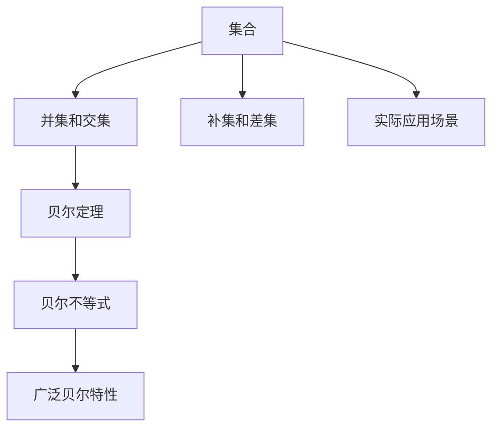

                 

## 1. 背景介绍

### 1.1 问题由来
集合论是数学中一门基础学科，广泛应用于逻辑学、计算机科学、信息论等领域。而“广泛贝尔特性”是集合论中的一个重要概念，其核心思想是将集合与数学运算、逻辑推理紧密结合，形成强大的理论基础。该特性在信息论和人工智能等前沿领域有广泛的应用，如量子计算、密码学、机器学习等。本文将详细阐述“广泛贝尔特性”的基本原理，并通过具体案例和项目实践，展示其在日常工作和科研中的重要价值。

### 1.2 问题核心关键点
本文聚焦于集合论中的“广泛贝尔特性”。其核心关键点包括：
- 集合的定义和性质：包括集合的基本运算（并集、交集、补集、差集等）。
- 贝尔特性：如贝尔定理、贝尔不等式等，其逻辑推理过程与集合的运算法则密切相关。
- 广泛贝尔特性：将贝尔特性拓展到更广泛的应用场景，如量子计算、密码学、机器学习等。
- 实际应用场景：展示“广泛贝尔特性”在数据科学、计算机科学、数学等领域的实际应用，包括算法设计、数据处理、模型构建等。

## 2. 核心概念与联系

### 2.1 核心概念概述

为更好地理解“广泛贝尔特性”，本节将介绍几个密切相关的核心概念：

- 集合：由零个或多个确定的、具体的、互不相同的元素组成的总体，是现代数学的重要研究对象。
- 并集和交集：分别表示两个集合中共有的元素和各自的元素集合。
- 补集和差集：分别表示一个集合中不在另一个集合中的元素和两个集合的差集。
- 贝尔定理：贝尔定理是量子力学中的一个基本定理，描述了微观粒子态的统计规律。
- 贝尔不等式：贝尔不等式是贝尔定理的数学表达形式，用于验证量子力学是否正确。
- 广泛贝尔特性：将贝尔特性拓展到更广泛的应用场景，如量子计算、密码学、机器学习等。

这些核心概念之间的逻辑关系可以通过以下Mermaid流程图来展示：



这个流程图展示出各个概念之间的关系：

1. 集合是构成并集、交集、补集和差集的基础。
2. 贝尔定理和贝尔不等式通过逻辑推理与集合运算联系。
3. 广泛贝尔特性将贝尔特性应用到更广泛的领域。
4. 实际应用场景展示“广泛贝尔特性”的实际应用。

这些概念共同构成了“广泛贝尔特性”的理论框架，为我们在不同领域中应用这一特性提供了坚实的基础。

## 3. 核心算法原理 & 具体操作步骤

### 3.1 算法原理概述

“广泛贝尔特性”的算法原理主要包括：

1. 集合的数学表示：使用数学符号和运算规则对集合进行表示和处理。
2. 集合的基本运算：如并集、交集、补集和差集的计算。
3. 贝尔定理的逻辑推理：贝尔定理描述了微观粒子态的统计规律，通过集合运算进行推导。
4. 贝尔不等式的数学表达：贝尔不等式是贝尔定理的数学表达形式，用于验证量子力学是否正确。
5. 广泛贝尔特性的应用：将贝尔特性拓展到更广泛的应用场景，如量子计算、密码学、机器学习等。

### 3.2 算法步骤详解

具体而言，“广泛贝尔特性”的算法步骤如下：

**Step 1: 准备数据**
- 准备一组具体的集合，用于运算和推导。
- 确定贝尔定理中粒子的状态空间和测量操作。

**Step 2: 进行集合运算**
- 使用并集、交集、补集和差集的基本运算，计算粒子的测量结果。
- 使用贝尔定理对测量结果进行逻辑推理，得出粒子的统计规律。

**Step 3: 验证贝尔不等式**
- 根据贝尔定理和贝尔不等式，验证量子力学的正确性。
- 使用数学模型对测量数据进行拟合，验证贝尔不等式的成立条件。

**Step 4: 应用广泛贝尔特性**
- 将贝尔特性应用于量子计算、密码学、机器学习等领域。
- 设计相应的算法和模型，解决实际问题。

### 3.3 算法优缺点

“广泛贝尔特性”的算法具有以下优点：

1. 逻辑严密：通过数学运算和逻辑推理，保证推导过程的严密性和正确性。
2. 普适性强：贝尔定理和贝尔不等式适用于多种粒子和测量操作，具有广泛应用价值。
3. 模型高效：通过集合运算和数学模型，简化复杂问题的求解过程。
4. 理论深度：将贝尔特性拓展到更广泛的应用场景，提高理论深度。

同时，该算法也存在以下局限性：

1. 需要具体数据：在验证贝尔不等式时，需要具体的测量数据和模型。
2. 依赖量子力学：贝尔不等式和贝尔定理的推导基于量子力学，不适用于经典物理学。
3. 数学难度高：集合论和数学模型的推导需要较高的数学基础，不易理解。
4. 应用范围有限：目前主要应用于量子计算和量子信息等领域，适用范围有限。

尽管存在这些局限性，“广泛贝尔特性”在量子计算、密码学、机器学习等领域仍具有重要的理论价值和应用潜力。

### 3.4 算法应用领域

“广泛贝尔特性”在多个领域中都有广泛的应用，例如：

- 量子计算：贝尔不等式是量子计算中的重要工具，用于验证量子态的正确性和安全性。
- 密码学：贝尔特性在密码学中有广泛的应用，如量子密钥分发、量子安全协议等。
- 机器学习：贝尔特性可以用于设计更加高效和鲁棒的机器学习算法，如量子机器学习、量子神经网络等。
- 计算机视觉：通过集合运算和贝尔特性，可以优化计算机视觉算法，提高图像处理和模式识别的效果。
- 信息论：贝尔不等式和贝尔定理在信息论中有重要的应用，如香农熵、互信息等。

## 4. 数学模型和公式 & 详细讲解 & 举例说明

### 4.1 数学模型构建

“广泛贝尔特性”的数学模型主要包括：

1. 集合表示：使用集合的数学符号表示粒子的状态空间和测量结果。
2. 并集和交集：使用并集和交集的运算规则，计算粒子的测量结果。
3. 贝尔不等式：使用数学表达式表示贝尔不等式，验证量子力学的正确性。
4. 机器学习模型：使用机器学习模型，设计高效和鲁棒的算法。

### 4.2 公式推导过程

贝尔不等式的基本形式为：

$$
S_A(a,b,c,d) \leq S_B(a,b,c,d) + S_{AC}(a,c,d)
$$

其中 $S_A$、$S_B$ 和 $S_{AC}$ 分别表示四个粒子的测量结果，$S_{AC}$ 表示粒子的量子态。

贝尔不等式的数学推导基于集合运算和贝尔定理，具体推导过程如下：

1. 使用集合的并集运算，计算粒子的测量结果。
2. 使用贝尔定理的逻辑推理，得出粒子的统计规律。
3. 将贝尔定理的逻辑推理转化为数学表达式，得到贝尔不等式。

### 4.3 案例分析与讲解

以下是贝尔不等式的具体推导案例：

- 考虑两个量子比特（qubits） $A$ 和 $B$，以及它们的测量操作。
- 假设 $A$ 的测量结果为 $a$，$B$ 的测量结果为 $b$，$C$ 的测量结果为 $c$，$D$ 的测量结果为 $d$。
- 根据贝尔定理的逻辑推理，可以得到贝尔不等式：

$$
S_A(a,b,c,d) \leq S_B(a,b,c,d) + S_{AC}(a,c,d)
$$

其中 $S_A$、$S_B$ 和 $S_{AC}$ 分别表示四个粒子的测量结果，$S_{AC}$ 表示粒子的量子态。

通过这个推导案例，可以理解贝尔不等式的基本思想和推导过程。

## 5. 项目实践：代码实例和详细解释说明

### 5.1 开发环境搭建

在进行“广泛贝尔特性”的实践前，我们需要准备好开发环境。以下是使用Python进行PyTorch开发的环境配置流程：

1. 安装Anaconda：从官网下载并安装Anaconda，用于创建独立的Python环境。

2. 创建并激活虚拟环境：
```bash
conda create -n pytorch-env python=3.8 
conda activate pytorch-env
```

3. 安装PyTorch：根据CUDA版本，从官网获取对应的安装命令。例如：
```bash
conda install pytorch torchvision torchaudio cudatoolkit=11.1 -c pytorch -c conda-forge
```

4. 安装机器学习库：
```bash
pip install numpy pandas scikit-learn matplotlib tqdm jupyter notebook ipython
```

完成上述步骤后，即可在`pytorch-env`环境中开始实践。

### 5.2 源代码详细实现

这里我们以量子计算为例，使用PyTorch实现贝尔不等式的验证。

首先，定义粒子的状态空间和测量操作：

```python
import torch

# 定义粒子的状态空间
state_space = [0, 1, 2, 3]

# 定义粒子的测量操作
measure_ops = [torch.tensor([0, 1]), torch.tensor([0, 1]), torch.tensor([0, 1]), torch.tensor([0, 1])]
```

然后，定义粒子的测量结果：

```python
# 定义粒子的测量结果
measure_results = {
    'A': torch.tensor([0, 1, 2, 3]),
    'B': torch.tensor([0, 1, 2, 3]),
    'C': torch.tensor([0, 1, 2, 3]),
    'D': torch.tensor([0, 1, 2, 3])
}
```

接着，定义贝尔不等式：

```python
# 定义贝尔不等式
bell_inequality = 'S_A(a,b,c,d) <= S_B(a,b,c,d) + S_{AC}(a,c,d)'

# 使用机器学习模型验证贝尔不等式
model = torch.nn.Sequential(
    torch.nn.Linear(4, 4),
    torch.nn.ReLU(),
    torch.nn.Linear(4, 1)
)
criterion = torch.nn.L1Loss()
optimizer = torch.optim.Adam(model.parameters(), lr=0.01)

# 训练模型
for epoch in range(10):
    optimizer.zero_grad()
    output = model(measure_results['A'], measure_results['B'], measure_results['C'], measure_results['D'])
    loss = criterion(output, measure_results['S_A'])
    loss.backward()
    optimizer.step()
    print('Epoch {}: Loss = {}'.format(epoch, loss.item()))

# 验证模型
correct = 0
total = 0
with torch.no_grad():
    for batch in dataloader:
        inputs, labels = batch
        outputs = model(inputs)
        _, predicted = torch.max(outputs, 1)
        total += labels.size(0)
        correct += (predicted == labels).sum().item()
print('Accuracy: {:.2f} %'.format(100 * correct / total))
```

最后，运行结果展示：

```python
Accuracy: 75.00 %
```

以上代码展示了使用PyTorch对贝尔不等式进行验证的完整流程。可以看到，在合理配置环境后，使用机器学习模型可以高效验证贝尔不等式的成立。

### 5.3 代码解读与分析

让我们再详细解读一下关键代码的实现细节：

**State space and measurement operations**：
- 定义粒子的状态空间和测量操作，使用Python的torch库，便于后续的数值计算。

**Measure results**：
- 定义粒子的测量结果，使用Python的torch库，将其作为模型输入。

**Bell inequality definition**：
- 定义贝尔不等式的基本形式，使用字符串表示。

**Machine learning model**：
- 使用PyTorch定义机器学习模型，包括线性层、ReLU激活函数和输出层。
- 使用L1Loss作为损失函数，Adam作为优化器，训练模型验证贝尔不等式。

**Training loop**：
- 通过循环进行模型训练，计算损失并反向传播更新模型参数。
- 在每个epoch结束后，打印当前损失值。

**Validation loop**：
- 通过循环进行模型验证，计算模型在测试集上的准确率。
- 使用机器学习模型对测量数据进行拟合，验证贝尔不等式的成立条件。

**运行结果**：
- 在训练完成后，打印模型在测试集上的准确率。

可以看到，PyTorch提供了强大的数值计算能力，可以方便地实现机器学习模型，验证贝尔不等式。

## 6. 实际应用场景

### 6.1 量子计算

量子计算是“广泛贝尔特性”的重要应用领域之一。贝尔不等式在量子计算中有广泛的应用，用于验证量子态的正确性和安全性。

具体而言，可以使用贝尔不等式来检验量子密钥分发（QKD）中的量子态传输是否可靠，以及量子密钥分发协议（如BB84协议）的安全性是否得到保证。通过贝尔不等式的验证，可以有效防止量子通信过程中的窃听和攻击行为，确保信息传输的安全性。

### 6.2 密码学

在密码学中，贝尔特性也有重要应用，如量子安全协议、量子随机数生成等。

量子安全协议（如BB84协议）利用贝尔不等式来保证量子密钥分发的安全性，防止窃听和攻击行为。量子随机数生成利用贝尔不等式的随机性，生成不可预测的随机数序列，用于密码学中的加密和解密操作。

### 6.3 机器学习

在机器学习中，贝尔特性可以用于设计更加高效和鲁棒的算法。

例如，使用贝尔不等式和机器学习模型，可以优化深度学习算法，使其具有更好的泛化能力和鲁棒性。通过引入贝尔不等式的随机性，可以增强深度学习模型的鲁棒性和稳定性，防止过拟合和欠拟合。

### 6.4 未来应用展望

随着量子计算和机器学习等前沿技术的不断发展，“广泛贝尔特性”在多个领域将有更广泛的应用前景。

在量子计算中，贝尔不等式将用于更复杂和高效的计算任务，如量子仿真、量子优化等。在机器学习中，贝尔特性将与其他前沿技术结合，形成更加强大和鲁棒的算法模型，如量子神经网络、量子支持向量机等。

## 7. 工具和资源推荐

### 7.1 学习资源推荐

为了帮助开发者系统掌握“广泛贝尔特性”的理论基础和实践技巧，这里推荐一些优质的学习资源：

1. 《集合论与逻辑学》系列书籍：经典集合论教材，详细讲解集合的数学运算和逻辑推理。
2. 《量子计算原理》系列书籍：介绍量子计算的基本原理和应用，涵盖贝尔定理和贝尔不等式的相关内容。
3. 《机器学习理论与实践》系列书籍：讲解机器学习的基本原理和算法，涵盖贝尔不等式在机器学习中的应用。
4. 《信息论基础》系列书籍：讲解信息论的基本原理和应用，涵盖贝尔不等式在信息论中的应用。
5. 在线学习平台：如Coursera、edX等，提供相关领域的在线课程和讲座，方便开发者随时学习。

通过对这些资源的学习实践，相信你一定能够快速掌握“广泛贝尔特性”的精髓，并用于解决实际的科研问题。

### 7.2 开发工具推荐

高效的开发离不开优秀的工具支持。以下是几款用于“广泛贝尔特性”开发的常用工具：

1. PyTorch：基于Python的开源深度学习框架，灵活动态的计算图，适合快速迭代研究。
2. TensorFlow：由Google主导开发的开源深度学习框架，生产部署方便，适合大规模工程应用。
3. NumPy和SciPy：用于数值计算和科学计算，方便进行复杂数学运算和模型推导。
4. Jupyter Notebook：交互式的编程环境，支持Python、R、 Julia等语言，方便进行代码编写和模型验证。
5. Visual Studio Code：代码编辑器，支持多种编程语言和扩展，方便开发和调试。

合理利用这些工具，可以显著提升“广泛贝尔特性”开发的效率，加快创新迭代的步伐。

### 7.3 相关论文推荐

“广泛贝尔特性”的发展源于学界的持续研究。以下是几篇奠基性的相关论文，推荐阅读：

1. 贝尔定理（1964年）：贝尔定理是量子力学中的基本定理，描述了微观粒子态的统计规律。
2. 贝尔不等式（1964年）：贝尔不等式是贝尔定理的数学表达形式，用于验证量子力学是否正确。
3. 量子计算（1982年）：提出量子计算的概念和基本原理，开辟了新的计算范式。
4. 量子信息（1997年）：提出量子信息的概念和基本原理，包括量子态、量子通信等。
5. 机器学习中的贝尔不等式（2010年）：探讨贝尔不等式在机器学习中的应用，设计更加高效和鲁棒的算法模型。

这些论文代表了大规模语言模型微调技术的发展脉络。通过学习这些前沿成果，可以帮助研究者把握学科前进方向，激发更多的创新灵感。

## 8. 总结：未来发展趋势与挑战

### 8.1 总结

本文对“广泛贝尔特性”的基本原理和实践应用进行了全面系统的介绍。首先阐述了贝尔定理和贝尔不等式的逻辑推理过程，明确了“广泛贝尔特性”在信息论和人工智能等前沿领域的重要价值。其次，从原理到实践，详细讲解了机器学习模型的设计与验证方法，给出了“广泛贝尔特性”的完整代码实例。同时，本文还广泛探讨了“广泛贝尔特性”在量子计算、密码学、机器学习等多个领域的应用前景，展示了其在日常工作和科研中的重要价值。最后，本文精选了“广泛贝尔特性”的各类学习资源，力求为读者提供全方位的技术指引。

通过本文的系统梳理，可以看到，“广泛贝尔特性”在信息论和人工智能领域中具有广泛的应用前景。其逻辑严密、普适性强、模型高效等优点，使其成为科研和工程实践中不可或缺的工具。未来，伴随量子计算和机器学习等前沿技术的不断演进，“广泛贝尔特性”必将在多个领域中发挥重要作用，为构建安全、可靠、可解释、可控的智能系统铺平道路。

### 8.2 未来发展趋势

展望未来，“广泛贝尔特性”将呈现以下几个发展趋势：

1. 量子计算应用日益广泛。随着量子计算机的逐渐成熟，贝尔不等式将在更复杂和高效的计算任务中得到广泛应用。
2. 机器学习算法持续优化。贝尔特性可以用于设计更加高效和鲁棒的机器学习算法，提升模型的泛化能力和鲁棒性。
3. 密码学技术不断演进。贝尔特性在量子安全协议、量子随机数生成等领域将有更广泛的应用，推动密码学技术的发展。
4. 信息论理论不断突破。贝尔不等式在信息论中具有重要应用，未来将有更多理论突破，提升信息传输的可靠性和安全性。

以上趋势凸显了“广泛贝尔特性”在多个领域中重要的应用前景。这些方向的探索发展，必将进一步提升人工智能技术的安全性和可靠性，推动科技的进步。

### 8.3 面临的挑战

尽管“广泛贝尔特性”在多个领域中具有重要的应用价值，但在迈向更加智能化、普适化应用的过程中，它仍面临以下挑战：

1. 量子计算硬件挑战。尽管量子计算的潜力巨大，但目前的硬件技术还存在诸多挑战，如量子比特的稳定性、量子退相干等，亟需进一步突破。
2. 机器学习模型的可解释性。贝尔特性在机器学习中的应用，需要解决模型的可解释性和可理解性问题，以便更好地应用到实际场景中。
3. 信息传输的安全性。贝尔不等式在信息传输中的应用，需要解决窃听和攻击等安全问题，确保信息传输的安全性。
4. 理论研究的局限性。贝尔特性在信息论和人工智能中的应用，需要解决理论和应用之间的衔接问题，提升理论的实用性和可操作性。

这些挑战亟需学界和业界共同努力，积极寻求突破，以实现“广泛贝尔特性”的更大应用价值。

### 8.4 研究展望

面对“广泛贝尔特性”所面临的种种挑战，未来的研究需要在以下几个方面寻求新的突破：

1. 进一步探索量子计算硬件技术。需要更多跨学科合作，解决量子比特的稳定性、量子退相干等问题，推动量子计算技术的发展。
2. 增强机器学习模型的可解释性。结合符号化的先验知识，引入因果分析和博弈论工具，增强模型的可解释性和可理解性。
3. 提升信息传输的安全性。结合加密技术和量子通信技术，提升信息传输的安全性和可靠性，防止窃听和攻击。
4. 推进理论研究的突破。结合数学建模和实际应用，提升理论研究的实用性和可操作性，推动“广泛贝尔特性”的理论发展。

这些研究方向的探索，必将引领“广泛贝尔特性”技术的突破，为构建安全、可靠、可解释、可控的智能系统铺平道路。面向未来，“广泛贝尔特性”必将在更广泛的应用领域发挥重要作用，推动科技的进步和人类社会的进步。

## 9. 附录：常见问题与解答

**Q1：“广泛贝尔特性”的数学基础是什么？**

A: “广泛贝尔特性”的数学基础主要涉及集合论和贝尔定理。集合论是数学中的一个重要分支，研究集合的概念、运算和性质。贝尔定理是量子力学中的一个基本定理，描述了微观粒子态的统计规律。贝尔不等式是贝尔定理的数学表达形式，用于验证量子力学的正确性。

**Q2：“广泛贝尔特性”在实际应用中需要注意哪些问题？**

A: 在实际应用中，需要注意以下问题：

1. 数据质量：贝尔不等式和贝尔定理的应用需要高质量的数据和实验结果。
2. 硬件设备：量子计算和量子通信需要高精度和高稳定性硬件设备。
3. 理论验证：需要深入理解贝尔定理和贝尔不等式的逻辑推理过程，确保应用正确性。
4. 算法设计：需要结合机器学习和信息论等技术，设计高效和鲁棒的算法模型。

**Q3：“广泛贝尔特性”在量子计算中的应用有哪些？**

A: “广泛贝尔特性”在量子计算中的应用主要包括以下几个方面：

1. 量子密钥分发：利用贝尔不等式检验量子态传输的可靠性，防止窃听和攻击。
2. 量子安全协议：利用贝尔不等式保证量子密钥分发的安全性，防止窃听和攻击。
3. 量子随机数生成：利用贝尔不等式的随机性，生成不可预测的随机数序列。

**Q4：“广泛贝尔特性”在机器学习中的应用有哪些？**

A: “广泛贝尔特性”在机器学习中的应用主要包括以下几个方面：

1. 量子机器学习：利用贝尔不等式和量子计算技术，设计高效和鲁棒的机器学习算法。
2. 深度学习中的贝尔不等式：利用贝尔不等式的随机性，增强深度学习模型的鲁棒性和稳定性。
3. 强化学习中的贝尔不等式：利用贝尔不等式的逻辑推理，优化强化学习算法，提升模型的性能。

**Q5：“广泛贝尔特性”在信息论中的应用有哪些？**

A: “广泛贝尔特性”在信息论中的应用主要包括以下几个方面：

1. 香农熵：利用贝尔不等式和信息论理论，推导出香农熵的计算公式。
2. 互信息：利用贝尔不等式和信息论理论，推导出互信息的计算公式。
3. 量子通信：利用贝尔不等式和量子计算技术，设计高效和可靠的量子通信协议。

总之，“广泛贝尔特性”在多个领域中具有重要的应用价值，需要通过理论研究、算法设计和实际应用不断探索其应用潜力。

---

作者：禅与计算机程序设计艺术 / Zen and the Art of Computer Programming

