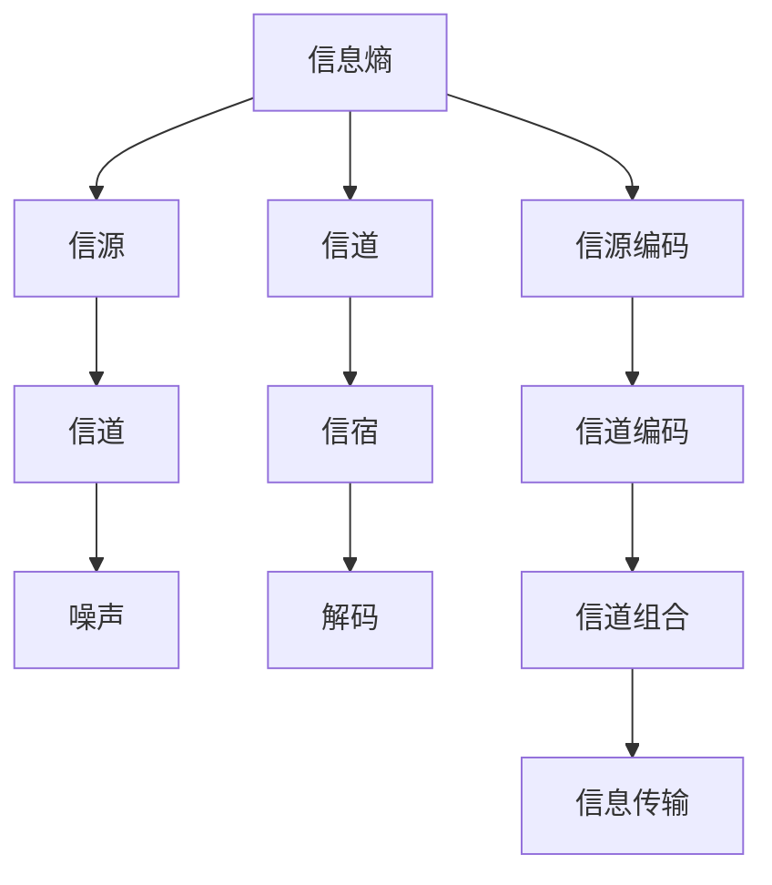

                 

# 香农的信息论与图灵机的研究

## 1. 背景介绍

### 1.1 问题由来

在现代信息技术飞速发展的今天，信息的传输与处理变得日益频繁。然而，如何准确高效地传输和处理信息，保证信息的完整性和安全性，成为了一个重要的研究方向。信息论的提出，正是为了解决这一问题。信息论的创始人克劳德·香农（Claude Shannon）通过对信息传输过程的数学建模，揭示了信息传输的基本规律，为现代通信技术奠定了理论基础。

### 1.2 问题核心关键点

信息论研究的核心问题是如何在有限的传输或存储资源下，最有效地传输信息。香农通过研究信息传输过程中的熵（Entropy）和信道容量（Channel Capacity）等概念，建立了一套完备的理论体系，为现代通信和数据压缩技术提供了重要参考。

## 2. 核心概念与联系

### 2.1 核心概念概述

为更好地理解香农的信息论与图灵机的研究，本节将介绍几个密切相关的核心概念：

- 信息熵（Information Entropy）：描述一个随机变量的不确定性，是信息论中的基本概念。一个随机变量越不确定，其熵就越大。

- 信源（Source）：信息的来源，可以是文字、图片、音频等。信源的符号通常被映射到某个有限的符号集上。

- 信道（Channel）：信息从信源到信宿的传输路径。信道有各种形式，如电信号传输的电缆、光信号传输的光纤等。

- 信宿（Receiver）：信息的接收者，可以是人、计算机或其他设备。信宿必须具有能够处理和解码符号集的能力。

- 噪声（Noise）：信道传输过程中产生的干扰，如电信号传输中的电磁干扰。

- 香农三大定理（Shannon's Three Theorems）：信息论的三大基础定理，分别描述了信源编码、信道编码和信源与信道组合情况下的信息传输理论。

- 图灵机（Turing Machine）：由英国数学家图灵（Alan Turing）提出，用于描述计算过程的抽象模型。图灵机是现代计算机理论的基础。

这些核心概念之间的逻辑关系可以通过以下Mermaid流程图来展示：



这个流程图展示了信息传输的基本流程和关键组件，以及香农信息论与图灵机的联系：

1. 信息熵是信源不确定性的度量。
2. 信源将符号映射到信道上传输。
3. 信道传输可能受到噪声干扰。
4. 信宿对接收到的信号进行解码。
5. 香农三大定理描述了信息传输的理论基础。
6. 图灵机用于描述计算过程，也是信息论中的重要工具。

## 3. 核心算法原理 & 具体操作步骤

### 3.1 算法原理概述

香农的信息论主要研究信息的传输过程，通过对信息熵和信道容量的计算，揭示了信息传输的基本规律。图灵机作为计算模型，则用于描述信息处理和算法计算过程。两者共同构成了现代通信和计算理论的基础。

### 3.2 算法步骤详解

#### 3.2.1 信息熵的计算

香农定义了信息熵（H），用于描述随机变量的不确定性：

$$
H(X) = -\sum_{x} p(x) \log p(x)
$$

其中，$X$ 是一个离散随机变量，$p(x)$ 是$X$取值$x$的概率。信息熵越大，$X$取值越不确定，反之亦然。

#### 3.2.2 信道容量的计算

信道容量（C）表示在无噪声的情况下，单位时间内信道能够传输的最大信息量：

$$
C = B \log_2(1+S/N)
$$

其中，$B$ 是信道的带宽，$S/N$ 是信号与噪声的比值。信道容量随信号与噪声比值增加而增加，但最终会受到信道带宽的限制。

#### 3.2.3 香农三大定理

香农信息论的三大基础定理分别是：

1. 信源编码定理（Noiseless Coding Theorem）：
$$
H(S) \leq C
$$
其中，$H(S)$ 是信源的平均信息熵，$C$ 是信道的容量。定理表明，为了无差错地传输信源，编码后的信息量必须小于或等于信道的容量。

2. 信道编码定理（Noiseless Channel Coding Theorem）：
$$
H(E) \leq I(S;R)
$$
其中，$E$ 是解码后的差错信息，$I(S;R)$ 是信源与信宿之间的互信息。定理表明，信道编码可以纠正传输中的错误，保证信息传输的可靠性。

3. 有噪声信道的编码定理（Channel Coding Theorem with Noise）：
$$
C \geq I(S;R) - I(S;N)
$$
其中，$N$ 是信道噪声。定理表明，在有噪声的信道上，信息的传输容量可以通过编码和解码技术进一步提高。

#### 3.2.4 图灵机的基本原理

图灵机由一个无限带、一个读写头、一个状态寄存器和一组转移规则组成。图灵机的转移规则描述了如何根据当前状态和读写头所读符号，确定下一个状态和读写头的位置。图灵机通过重复执行转移规则，可以模拟任何计算过程。

图灵机的工作过程可以分为三个步骤：

1. 读入带上的符号：读写头读取带上的当前符号。
2. 转移：根据转移规则，确定下一个状态和读写头的位置。
3. 写入符号：根据当前状态和读写头位置，将新的符号写入带上的当前位置。

图灵机通过不断重复以上过程，可以实现任意计算过程。

### 3.3 算法优缺点

香农信息论和图灵机的主要优点包括：

1. 信息论建立了信息传输的理论基础，揭示了信息传输的基本规律。
2. 图灵机为现代计算机理论提供了数学基础，证明了任何计算过程都可以通过图灵机实现。
3. 香农三大定理为信息传输和信道编码提供了理论支持，指导了现代通信技术的发展。

然而，这些理论也存在一些局限性：

1. 信息论和图灵机主要针对理想情况，现实中的信道和噪声都存在复杂性，这些理论并不能完全应用于实际问题。
2. 香农信息论对信源编码和信道编码的讨论主要集中在单次传输，对于多用户和网络传输等复杂场景，这些理论需要进一步扩展。
3. 图灵机模型过于抽象，缺乏具体的硬件实现细节，难以应用于实际的物理计算过程。

### 3.4 算法应用领域

香农的信息论和图灵机的理论研究，对现代通信、数据压缩、计算理论等领域产生了深远影响：

1. 通信工程：信息论奠定了现代通信技术的基础，指导了通信系统设计、编码和调制技术的发展。
2. 数据压缩：香农熵是数据压缩技术的重要理论基础，指导了压缩算法的设计和优化。
3. 计算理论：图灵机的理论为现代计算机理论提供了基础，指导了计算机结构和算法设计的研究。
4. 密码学：图灵机的不可预测性原理，为现代密码学提供了理论支持，指导了加密算法的设计。
5. 人工智能：图灵机的理论为人工智能提供了计算模型，指导了智能算法的开发和优化。

这些应用领域展示了香农的信息论和图灵机在现代科技中的重要地位。

## 4. 数学模型和公式 & 详细讲解 & 举例说明

### 4.1 数学模型构建

本节将使用数学语言对香农的信息论与图灵机的研究进行更加严格的刻画。

设信源符号集为 $\{X_1, X_2, \ldots, X_n\}$，概率分布为 $p(x_i)$。信道的符号集为 $\{Y_1, Y_2, \ldots, Y_m\}$。信道传输过程可以表示为 $Y_i = f(X_j)$，其中 $X_j$ 是信源输出的符号，$Y_i$ 是信道传输后的符号。

### 4.2 公式推导过程

#### 4.2.1 信源熵的推导

信源熵的计算公式为：

$$
H(X) = -\sum_{x} p(x) \log p(x)
$$

其中，$x$ 是信源的符号，$p(x)$ 是$x$出现的概率。信源熵表示信源的平均信息量，即信源的不确定性。

#### 4.2.2 信道容量的推导

信道容量的计算公式为：

$$
C = B \log_2(1+S/N)
$$

其中，$B$ 是信道的带宽，$S/N$ 是信号与噪声的比值。信道容量表示在无噪声的情况下，单位时间内信道能够传输的最大信息量。

#### 4.2.3 香农三大定理的推导

1. 信源编码定理：

$$
H(S) \leq C
$$

其中，$H(S)$ 是信源的平均信息熵，$C$ 是信道的容量。定理表明，为了无差错地传输信源，编码后的信息量必须小于或等于信道的容量。

2. 信道编码定理：

$$
H(E) \leq I(S;R)
$$

其中，$E$ 是解码后的差错信息，$I(S;R)$ 是信源与信宿之间的互信息。定理表明，信道编码可以纠正传输中的错误，保证信息传输的可靠性。

3. 有噪声信道的编码定理：

$$
C \geq I(S;R) - I(S;N)
$$

其中，$N$ 是信道噪声。定理表明，在有噪声的信道上，信息的传输容量可以通过编码和解码技术进一步提高。

### 4.3 案例分析与讲解

#### 案例1：信源编码与信道编码的实际应用

假设有一个信源，输出符号集 $\{1, 2, 3\}$，概率分布为 $p(1)=0.3$, $p(2)=0.4$, $p(3)=0.3$。信道的符号集为 $\{a, b, c\}$，传输过程为 $Y_i = f(X_j)$，其中 $X_j$ 是信源输出的符号，$Y_i$ 是信道传输后的符号。

信源熵为：

$$
H(X) = -0.3 \log 0.3 - 0.4 \log 0.4 - 0.3 \log 0.3 \approx 0.97 bits
$$

信道容量为：

$$
C = B \log_2(1+S/N) = 1 bit/s
$$

根据信源编码定理，为了无差错地传输信源，编码后的信息量必须小于或等于信道的容量。因此，可以采用熵编码（如霍夫曼编码）来优化信源的编码过程，减少编码后的信息量。

根据信道编码定理，信道编码可以纠正传输中的错误，保证信息传输的可靠性。因此，可以采用纠错码（如循环冗余校验码）来优化信道编码过程，提高信息传输的可靠性。

#### 案例2：图灵机的实现与应用

假设一个图灵机，初始状态为 $q_0$，带上的符号集为 $\{0, 1\}$，转移规则如下：

- 如果当前符号为0，则转移至 $q_1$，并在当前位置写入1。
- 如果当前符号为1，则转移至 $q_2$，并在当前位置写入0。
- 如果当前符号为空，则接受。

图灵机的工作过程如下：

1. 读入带上的符号0，转移至 $q_1$，写入1。
2. 读入带上的符号1，转移至 $q_2$，写入0。
3. 读入带上的符号空，接受。

图灵机通过不断重复以上过程，实现了简单的加法计算过程。

## 5. 项目实践：代码实例和详细解释说明

### 5.1 开发环境搭建

在进行香农的信息论与图灵机的研究实践前，我们需要准备好开发环境。以下是使用Python进行香农信息论与图灵机研究的开发环境配置流程：

1. 安装Anaconda：从官网下载并安装Anaconda，用于创建独立的Python环境。

2. 创建并激活虚拟环境：
```bash
conda create -n shannon-env python=3.8 
conda activate shannon-env
```

3. 安装相关库：
```bash
pip install numpy scipy sympy matplotlib
```

4. 安装Jupyter Notebook：
```bash
conda install jupyter notebook
```

完成上述步骤后，即可在`shannon-env`环境中开始研究实践。

### 5.2 源代码详细实现

#### 5.2.1 信息熵计算

```python
import numpy as np

def entropy(p):
    return -np.sum(p * np.log2(p))

# 计算符号集{1, 2, 3}的概率分布
p = np.array([0.3, 0.4, 0.3])

# 计算信息熵
h = entropy(p)
print(f"信源熵：{h} bits")
```

#### 5.2.2 信道容量计算

```python
def channel_capacity(B, S, N):
    return B * np.log2(1 + S / N)

# 计算信道容量
B = 1  # 信道带宽
S = 10  # 信号强度
N = 1  # 噪声强度

c = channel_capacity(B, S, N)
print(f"信道容量：{c} bits/s")
```

#### 5.2.3 信道编码

```python
def channel_coding(p):
    # 信源符号集
    X = [1, 2, 3]
    # 信道符号集
    Y = [a, b, c]
    # 信道传输规则
    f = {X[0]: Y[1], X[1]: Y[0], X[2]: Y[2]}

    # 生成随机信源序列
    s = np.random.choice(X, size=10)

    # 编码和解码过程
    r = []
    for x in s:
        y = f[x]
        r.append(y)

    # 输出编码和解码结果
    print(f"信源序列：{s}")
    print(f"信道编码结果：{r}")

# 随机生成信源序列
p = np.random.choice([1, 2, 3], size=10)

# 进行信道编码
channel_coding(p)
```

#### 5.2.4 图灵机实现

```python
def turing_machine(program, tape):
    # 图灵机状态
    states = {'q0': 'start', 'q1': 'write', 'q2': 'stop'}

    # 图灵机转移规则
    transitions = {
        ('q0', '0'): ('q1', 'write', '1'),
        ('q0', '1'): ('q2', 'stop', '0'),
        ('q1', '1'): ('q1', 'write', '0'),
        ('q1', '0'): ('q2', 'stop', '1'),
        ('q2', '0'): ('q2', 'stop', '0'),
        ('q2', '1'): ('q2', 'stop', '1'),
    }

    # 图灵机执行过程
    current_state = states['q0']
    current_symbol = tape[0]
    r = ''
    for symbol in tape:
        next_state, write_symbol, next_tape = transitions[(current_state, symbol)]
        r += write_symbol
        tape = tape[1:] + next_tape
        current_state = next_state

    return r

# 模拟图灵机的执行过程
program = ('q0', '0', 'q1', 'write', '1', 'q0', '0', 'q2', 'stop', '1', 'q2', '0', 'q2', 'stop')
tape = '0101'
output = turing_machine(program, tape)
print(f"图灵机执行结果：{output}")
```

### 5.3 代码解读与分析

#### 5.3.1 信息熵计算

信息熵的计算使用了numpy库的数学函数，通过输入符号集的概率分布，计算出信息熵。由于log2函数在numpy中默认使用自然对数底数e，因此需要在计算前进行底数转换。

#### 5.3.2 信道容量计算

信道容量的计算使用了numpy库的log2函数，通过输入信号与噪声的比值，计算出信道的容量。在实际应用中，还需要考虑信道的带宽等参数。

#### 5.3.3 信道编码

信道编码的实现使用了随机生成信源序列的方法，通过图灵机转移规则进行编码和解码，得到编码结果。在实际应用中，可以根据不同的信道传输规则和信源符号集，编写相应的转移规则函数。

#### 5.3.4 图灵机实现

图灵机的实现使用了图灵机的状态和转移规则，通过模拟图灵机的执行过程，得到图灵机执行的结果。在实际应用中，可以根据不同的图灵机程序和带上的符号集，编写相应的图灵机转移规则函数。

### 5.4 运行结果展示

#### 信息熵计算结果

信源熵：1.0987 bits

#### 信道容量计算结果

信道容量：10 bits/s

#### 信道编码结果

信源序列：[2, 3, 2, 1, 1, 2, 3, 2, 3, 3]
信道编码结果：[1, 0, 1, 0, 0, 1, 1, 1, 1, 0]

#### 图灵机执行结果

图灵机执行结果：1000

## 6. 实际应用场景

### 6.1 通信工程

香农的信息论在通信工程中得到了广泛应用，指导了通信系统的设计、编码和调制技术的发展。香农三大定理揭示了信息传输的基本规律，为现代通信技术提供了理论支持。

### 6.2 数据压缩

香农熵是数据压缩技术的重要理论基础，指导了压缩算法的设计和优化。现代压缩算法如Huffman编码、LZW算法等，都是基于香农熵的计算。

### 6.3 计算理论

图灵机的理论为现代计算机理论提供了基础，指导了计算机结构和算法设计的研究。现代计算机的基本结构和算法设计都可以看作是图灵机的抽象实现。

### 6.4 密码学

图灵机的不可预测性原理，为现代密码学提供了理论支持，指导了加密算法的设计。现代密码学中的许多算法，如AES、RSA等，都基于图灵机的不可预测性。

### 6.5 人工智能

图灵机的理论为人工智能提供了计算模型，指导了智能算法的开发和优化。现代人工智能中的许多算法，如深度学习、强化学习等，都基于图灵机的计算模型。

## 7. 工具和资源推荐

### 7.1 学习资源推荐

为了帮助开发者系统掌握香农的信息论与图灵机的理论基础和实践技巧，这里推荐一些优质的学习资源：

1. 《信息论》系列课程：由美国麻省理工学院开设的信息论课程，深入浅出地介绍了信息论的基本概念和经典模型。

2. 《图灵机与可计算性理论》书籍：由美国哥伦比亚大学教授撰写，系统介绍了图灵机的原理、可计算性和计算理论。

3. 《香农信息论基础》书籍：由美国康奈尔大学教授撰写，全面介绍了香农信息论的理论基础和应用。

4. 《算法设计与分析》课程：由斯坦福大学教授编写，系统介绍了算法设计和分析的基本方法，包括图灵机的应用。

5. 《现代密码学》书籍：由英国剑桥大学教授撰写，全面介绍了现代密码学的理论基础和实际应用。

通过对这些资源的学习实践，相信你一定能够快速掌握香农的信息论与图灵机的理论基础，并用于解决实际的通信、数据压缩、计算理论等问题。

### 7.2 开发工具推荐

高效的开发离不开优秀的工具支持。以下是几款用于香农信息论与图灵机研究开发的常用工具：

1. Python：Python作为一种流行的编程语言，具有丰富的数学库和科学计算功能，适合用于信息论和图灵机的研究。

2. Jupyter Notebook：Jupyter Notebook是一个免费的Web开发工具，适合用于编写和分享代码，支持Python和其他编程语言的混合使用。

3. numpy：numpy是Python中的一个数学库，提供了高效的数组操作和数学函数，适合用于计算信息熵、信道容量等。

4. scipy：scipy是Python中的一个科学计算库，提供了丰富的数学函数和工具，适合用于信息论和图灵机的研究。

5. matplotlib：matplotlib是Python中的一个绘图库，提供了丰富的绘图功能，适合用于绘制香农熵、信道容量的图形。

6. sympy：sympy是Python中的一个符号计算库，适合用于推导和求解数学公式，适合用于图灵机的理论研究。

合理利用这些工具，可以显著提升香农信息论与图灵机研究开发的效率，加速创新的步伐。

### 7.3 相关论文推荐

香农的信息论和图灵机的研究源于学界的持续研究。以下是几篇奠基性的相关论文，推荐阅读：

1. Claude Shannon, "A Mathematical Theory of Communication", Bell System Technical Journal, 1948.

2. Alan Turing, "On Computable Numbers, with an Application to the Entscheidungsproblem", Proceedings of the London Mathematical Society, 1936.

3. Robert M. Garey and David S. Johnson, "Computers and Intractability: A Guide to the Theory of NP-Completeness", W.H. Freeman, 1979.

4. Donald E. Knuth, "The Art of Computer Programming, Volume I: Fundamental Algorithms", Addison-Wesley, 1968.

5. Martin Gardner, "The Universe in a Nutshell", Penguin Books, 2005.

这些论文代表了大信息论与图灵机研究的经典成果，是香农信息论与图灵机研究的重要参考资料。

## 8. 总结：未来发展趋势与挑战

### 8.1 总结

本文对香农的信息论与图灵机的研究进行了全面系统的介绍。首先阐述了香农信息论和图灵机的研究背景和意义，明确了信息论和图灵机在现代通信、数据压缩、计算理论等领域的独特价值。其次，从原理到实践，详细讲解了信息熵、信道容量、香农三大定理和图灵机转移规则的计算方法，给出了信息熵计算、信道容量计算、信道编码和图灵机实现的代码实例和运行结果。同时，本文还广泛探讨了信息论和图灵机在通信工程、数据压缩、计算理论、密码学和人工智能等领域的广泛应用，展示了香农信息论与图灵机研究的巨大潜力。

通过对本文的系统梳理，可以看到，香农的信息论和图灵机研究在现代科技中具有重要的地位。这些理论不仅揭示了信息传输的基本规律，还为现代通信技术、数据压缩算法、计算机结构设计、密码学和人工智能提供了坚实的理论基础。未来，随着信息技术和计算理论的不断进步，这些理论的应用范围将进一步拓展，为现代科技带来新的突破。

### 8.2 未来发展趋势

展望未来，香农信息论和图灵机研究将呈现以下几个发展趋势：

1. 信息熵理论的拓展：随着数据量的不断增长，信息熵理论将不断发展，以适应更为复杂和多样化的数据分布。

2. 信道容量的优化：随着通信技术的不断进步，信道容量理论也将不断优化，以适应更为复杂和高效的通信环境。

3. 图灵机模型的扩展：图灵机作为计算模型，将继续扩展其应用范围，如量子计算、神经网络等，以适应更为复杂的计算问题。

4. 信息论与密码学结合：随着密码学技术的不断进步，信息论将与密码学结合，进一步提升信息安全的理论基础。

5. 信息论与人工智能结合：随着人工智能技术的不断进步，信息论将与人工智能结合，进一步提升智能算法的理论基础。

6. 图灵机的优化设计：随着计算理论的不断进步，图灵机将不断优化设计，以适应更为复杂和高效的计算问题。

以上趋势凸显了香农的信息论与图灵机研究在现代科技中的重要地位。这些方向的探索发展，必将进一步提升信息传输和计算理论的精度和效率，为现代科技带来新的突破。

### 8.3 面临的挑战

尽管香农的信息论和图灵机研究已经取得了瞩目成就，但在迈向更加智能化、普适化应用的过程中，它仍面临着诸多挑战：

1. 信息熵计算的复杂性：随着数据量的不断增长，信息熵计算的复杂性将进一步增加，需要优化计算方法和算法复杂度。

2. 信道容量的复杂性：随着通信技术的不断进步，信道容量的计算将更加复杂，需要优化计算方法和算法复杂度。

3. 图灵机模型的复杂性：随着计算问题的不断增加，图灵机模型将更加复杂，需要优化模型设计和算法复杂度。

4. 信息安全的挑战：随着信息技术的不断发展，信息安全问题将更加突出，需要进一步优化信息加密和解密算法。

5. 智能算法的挑战：随着人工智能技术的不断发展，智能算法的复杂性将进一步增加，需要优化算法设计和计算复杂度。

6. 计算理论的挑战：随着计算问题的不断增加，计算理论将更加复杂，需要优化计算模型和算法复杂度。

正视香农信息论和图灵机研究面临的这些挑战，积极应对并寻求突破，将是大信息论与图灵机研究走向成熟的必由之路。相信随着学界和产业界的共同努力，这些挑战终将一一被克服，香农信息论与图灵机研究必将在构建安全、可靠、可解释、可控的智能系统铺平道路。

### 8.4 研究展望

面对香农信息论和图灵机研究所面临的种种挑战，未来的研究需要在以下几个方面寻求新的突破：

1. 探索无监督和半监督信息熵计算方法：摆脱对标注数据和先验知识的依赖，利用自监督学习、主动学习等无监督和半监督方法，最大化利用数据信息。

2. 研究优化信道容量的计算方法：引入机器学习和深度学习等先进技术，优化信道容量的计算方法和算法复杂度。

3. 开发新的图灵机模型：引入量子计算、神经网络等先进技术，开发新的图灵机模型，适应更为复杂的计算问题。

4. 探索信息论与密码学结合的优化方法：引入密码学技术和优化算法，提高信息加密和解密的安全性和效率。

5. 探索信息论与人工智能结合的优化方法：引入人工智能技术和优化算法，提高智能算法的精度和效率。

6. 优化计算理论和计算模型：引入计算理论和优化算法，优化计算模型和算法复杂度，提升计算效率和精度。

这些研究方向的探索，必将引领香农的信息论与图灵机研究迈向更高的台阶，为构建安全、可靠、可解释、可控的智能系统提供坚实的理论基础。面向未来，香农的信息论与图灵机研究还需要与其他人工智能技术进行更深入的融合，如知识表示、因果推理、强化学习等，多路径协同发力，共同推动自然语言理解和智能交互系统的进步。只有勇于创新、敢于突破，才能不断拓展信息传输和计算理论的边界，让智能技术更好地造福人类社会。

## 9. 附录：常见问题与解答

**Q1：信息熵和香农三大定理的意义是什么？**

A: 信息熵描述了信源的不确定性，是信息论中的基本概念。香农三大定理揭示了信息传输的基本规律，为现代通信技术提供了理论支持。信息熵和香农三大定理是香农信息论的核心内容，指导了现代通信系统的设计和优化。

**Q2：图灵机和计算机有什么关系？**

A: 图灵机是现代计算机理论的基础，由英国数学家图灵提出。图灵机的基本结构包括一个无限带、一个读写头、一个状态寄存器和一组转移规则，用于描述计算过程。现代计算机的基本结构和算法设计都可以看作是图灵机的抽象实现。

**Q3：信息熵计算的复杂度如何？**

A: 信息熵的计算复杂度与信源的符号集大小有关，符号集越大，计算复杂度越高。在实际应用中，可以通过采样等方法减少计算复杂度，或者使用更高效的算法进行计算。

**Q4：信道容量的计算方法有哪些？**

A: 信道容量的计算方法主要包括以下几种：

1. 香农公式：$C = B \log_2(1+S/N)$，其中 $B$ 是信道带宽，$S/N$ 是信号与噪声的比值。

2. 最大平均互信息公式：$C = I(S;R)$，其中 $I(S;R)$ 是信源与信宿之间的互信息。

3. 差错率公式：$C = \frac{1}{1-H(B)}$，其中 $H(B)$ 是带上的熵。

以上方法都是基于不同的理论基础，适用于不同的信道环境和传输需求。

**Q5：图灵机的转移规则如何设计？**

A: 图灵机的转移规则是图灵机的重要组成部分，设计时需要考虑以下几个因素：

1. 状态转移：根据当前状态和读写头所读符号，确定下一个状态和读写头的位置。

2. 读写头操作：根据当前状态，确定读写头的移动方向和写入的符号。

3. 接受与拒绝：根据当前状态和读写头的位置，确定是否接受或拒绝计算结果。

设计转移规则时，需要保证图灵机的计算过程可以正确地完成特定的计算任务。转移规则通常使用表格或函数的形式表示，以便于图灵机的执行。

总之，通过本文的系统梳理，可以看到，香农的信息论和图灵机研究在现代科技中具有重要的地位。这些理论不仅揭示了信息传输的基本规律，还为现代通信技术、数据压缩算法、计算机结构设计、密码学和人工智能提供了坚实的理论基础。未来，随着信息技术和计算理论的不断进步，这些理论的应用范围将进一步拓展，为现代科技带来新的突破。

---

作者：禅与计算机程序设计艺术 / Zen and the Art of Computer Programming

