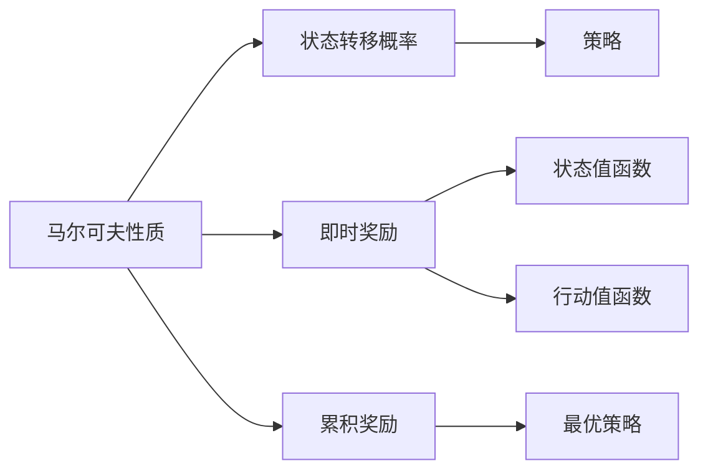
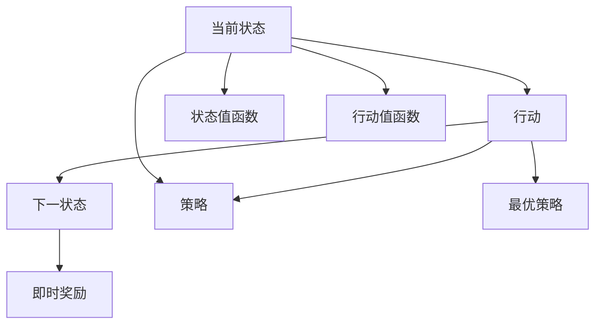

                 

# 马尔可夫决策过程 (Markov Decision Process)

> 关键词：马尔可夫决策过程, MDP, 强化学习, 状态转移, 策略优化, 奖励函数, 蒙特卡洛算法, 动态规划, 深度强化学习

## 1. 背景介绍

### 1.1 问题由来

马尔可夫决策过程（Markov Decision Process，MDP）是强化学习（Reinforcement Learning, RL）中的一个核心概念。在机器学习、人工智能、控制系统等领域，MDP被广泛应用于决策制定、策略优化、智能规划等方面。

强化学习旨在通过与环境的交互，使智能体（agent）学会在特定任务中获得最大化的长期奖励。MDP框架提供了一种形式化的方式来描述任务环境，并通过智能体与环境的交互，逐步优化决策策略。

### 1.2 问题核心关键点

强化学习和MDP的核心在于：智能体如何基于当前状态，选择最优行动策略，以最大化未来累积奖励。MDP的核心要素包括状态（state）、行动（action）、奖励（reward）、状态转移（transition）、策略（policy）等。

1. **状态（state）**：表示环境中的当前状态，是影响智能体决策的关键信息。
2. **行动（action）**：智能体在当前状态下可采取的行动，如左转、右转、加速、减速等。
3. **奖励（reward）**：智能体在执行行动后获得的即时反馈，如正向、负向、中性奖励。
4. **状态转移（transition）**：描述从当前状态转移到下一个状态的概率分布，受行动策略的影响。
5. **策略（policy）**：智能体选择行动的策略，即在给定状态下选择行动的概率分布。

### 1.3 问题研究意义

研究MDP对于理解和构建智能决策系统具有重要意义。它为智能体提供了一种基于奖励优化的决策框架，使其在复杂环境中具备自适应、自优化能力。MDP的应用领域包括自动驾驶、机器人导航、游戏AI、金融交易、推荐系统等。

## 2. 核心概念与联系

### 2.1 核心概念概述

为更好地理解MDP，本节将介绍几个关键概念：

- **马尔可夫性质（Markov Property）**：状态转移只与当前状态和行动有关，与历史状态无关。即在已知当前状态和行动的情况下，未来状态的概率分布只依赖于当前状态和行动，与之前的状态无关。

- **状态转移概率（Transition Probability）**：描述了从当前状态到下一个状态的转移概率，可以表示为$P(s_{t+1}|s_t,a_t)$，其中$s_t$为当前状态，$a_t$为当前行动，$s_{t+1}$为下一个状态。

- **即时奖励（Immediate Reward）**：智能体在执行行动后立即获得的奖励，可以表示为$R(s_t,a_t)$，其中$s_t$为当前状态，$a_t$为当前行动。

- **累积奖励（Cumulative Reward）**：智能体在特定时间范围内的总奖励，即从某个状态$s$开始的未来奖励之和，可以表示为$\sum_{t=0}^{\infty} \gamma^t R(s_t,a_t)$，其中$\gamma$为折扣因子，通常取值在0到1之间，表示未来奖励的重要性。

- **策略（Policy）**：智能体在每个状态下选择行动的策略，可以表示为$\pi(a_t|s_t)$，其中$\pi$为策略函数，$a_t$为在$s_t$状态下采取的行动。

- **价值函数（Value Function）**：评估状态或行动的价值，分为状态值函数$V(s)$和行动值函数$Q(s,a)$。状态值函数表示在当前状态下达到最终状态期望累积奖励的期望值，行动值函数表示在当前状态下采取某个行动达到最终状态期望累积奖励的期望值。

- **最优策略（Optimal Policy）**：在给定MDP环境下，能够最大化未来累积奖励的策略。

这些概念构成了MDP的基本框架，为理解MDP的工作原理和优化策略提供了基础。

### 2.2 概念间的关系

这些核心概念之间的逻辑关系可以通过以下Mermaid流程图来展示：



这个流程图展示了MDP中各个概念之间的联系和相互作用。智能体通过马尔可夫性质、状态转移概率、即时奖励等信息，在每个状态下选择行动，期望最大化累积奖励，同时学习最优策略，更新价值函数，最终实现最大化的长期奖励。

### 2.3 核心概念的整体架构

最后，我们用一个综合的流程图来展示这些核心概念在大决策过程中的整体架构：



这个综合流程图展示了智能体在MDP中从当前状态到下一状态的过程，包括了策略选择、即时奖励的获取、状态值函数和行动值函数的评估等关键环节。

## 3. 核心算法原理 & 具体操作步骤

### 3.1 算法原理概述

基于MDP的强化学习算法框架主要包括以下几个步骤：

1. **环境建模**：定义MDP的环境，包括状态集合、行动集合、状态转移概率、即时奖励函数等。
2. **策略选择**：在每个状态下选择行动，可以采用随机策略、贪心策略、Q-learning等方法。
3. **价值函数评估**：通过与环境的交互，收集状态值或行动值，更新价值函数。
4. **策略优化**：通过评估价值函数，优化策略，提高智能体的长期奖励。
5. **策略评估**：通过评估当前策略的表现，判断是否需要调整。

MDP的核心在于通过价值函数的优化，学习最优策略，从而最大化长期奖励。常见的MDP算法包括蒙特卡洛方法（Monte Carlo Method）、动态规划（Dynamic Programming）、深度强化学习（Deep Reinforcement Learning）等。

### 3.2 算法步骤详解

以下是MDP强化学习算法的详细操作步骤：

1. **初始化**：
   - 初始化智能体的当前状态$s_0$。
   - 定义状态集合$S$、行动集合$A$、即时奖励函数$R(s,a)$、折扣因子$\gamma$等。
   - 选择初始策略$\pi_0(a|s)$。

2. **策略执行**：
   - 在当前状态$s_t$下，根据策略$\pi$选择行动$a_t$。
   - 执行行动$a_t$，观察下一个状态$s_{t+1}$和即时奖励$r_{t+1}$。

3. **价值函数更新**：
   - 根据$(s_t,a_t,s_{t+1},r_{t+1})$四元组，更新状态值函数$V(s)$或行动值函数$Q(s,a)$。
   - 可以使用蒙特卡洛方法、动态规划、深度强化学习等方法更新价值函数。

4. **策略优化**：
   - 通过评估当前策略的表现，如期望累积奖励，判断是否需要调整。
   - 使用策略评估方法，如Q-learning，更新策略参数。

5. **重复执行**：
   - 重复上述步骤，直至达到预设的终止条件或策略优化达到预期效果。

### 3.3 算法优缺点

MDP强化学习算法具有以下优点：

1. **理论完备**：MDP提供了一种严格的数学框架，许多经典的强化学习算法都是基于MDP构建的。
2. **适用性强**：MDP能够处理连续状态、连续行动、随机环境等复杂问题。
3. **可解释性强**：MDP的模型相对简单，易于理解和解释。

同时，MDP算法也存在一些缺点：

1. **高计算复杂度**：MDP算法需要计算大量的状态值或行动值，计算复杂度较高。
2. **样本效率低**：在大规模环境中，MDP算法需要大量样本才能收敛，样本效率较低。
3. **需要精确环境模型**：MDP算法依赖于精确的环境模型，模型不精确可能导致性能下降。

### 3.4 算法应用领域

MDP强化学习算法广泛应用于各种复杂决策问题，以下是一些主要应用领域：

1. **自动驾驶**：自动驾驶系统需要根据传感器数据，动态调整速度和方向，以实现安全行驶。MDP可以用于决策路径规划、避障策略优化等。

2. **机器人导航**：机器人需要在复杂环境中自主导航，MDP可以用于路径规划、障碍物规避、目标跟踪等。

3. **游戏AI**：游戏AI需要根据环境状态和玩家行为，制定最优策略，MDP可以用于决策制定、动作选择等。

4. **金融交易**：金融交易系统需要根据市场数据，动态调整买卖策略，MDP可以用于风险管理、资产配置等。

5. **推荐系统**：推荐系统需要根据用户行为，推荐个性化商品或内容，MDP可以用于用户行为建模、推荐策略优化等。

以上应用领域展示了MDP强化学习算法的广泛适用性和巨大潜力，为智能决策系统的构建提供了重要基础。

## 4. 数学模型和公式 & 详细讲解  
### 4.1 数学模型构建

假设一个MDP环境，其状态集合为$S$，行动集合为$A$，状态转移概率为$P(s_{t+1}|s_t,a_t)$，即时奖励函数为$R(s_t,a_t)$，折扣因子为$\gamma$，策略为$\pi(a|s)$。定义状态值函数$V(s)$和行动值函数$Q(s,a)$。

根据MDP的定义，智能体的最优策略$\pi^*$可以通过以下公式求解：

$$
\pi^*(a|s) = \arg\max_a Q^*(s,a) \quad \text{with} \quad Q^*(s,a) = r(s,a) + \gamma \sum_{s'} P(s'|s,a)V^*(s')
$$

其中$Q^*(s,a)$为状态$s$下采取行动$a$的最优行动值，$V^*(s)$为状态$s$的最优状态值。

### 4.2 公式推导过程

以下我们以蒙特卡洛方法（Monte Carlo Method）为例，推导其更新公式。

假设智能体执行了一个路径$(s_0,a_0,s_1,r_1,s_2,r_2,\ldots,s_T)$，其中$T$为路径长度。蒙特卡洛方法的基本思想是，通过路径上的所有奖励和状态值，计算状态$s_t$的值函数更新。

定义当前状态$s_t$和行动$a_t$，计算累积奖励$G_t$：

$$
G_t = r_{t+1} + \gamma r_{t+2} + \gamma^2 r_{t+3} + \ldots + \gamma^{T-t-1} r_T
$$

状态值函数的更新公式为：

$$
V(s_t) \leftarrow V(s_t) + \frac{1}{N}\sum_{i=1}^N (G_t - V(s_t))
$$

其中$N$为路径样本数，$G_t$为路径上的累积奖励。

行动值函数的更新公式为：

$$
Q(s_t,a_t) \leftarrow Q(s_t,a_t) + \frac{1}{N}\sum_{i=1}^N (G_t - Q(s_t,a_t))
$$

使用蒙特卡洛方法，通过大量的路径样本，可以逐步逼近状态值函数和行动值函数的真实值，从而优化智能体的策略。

### 4.3 案例分析与讲解

以一个简单的迷宫寻路问题为例，展示MDP算法的工作原理和价值函数更新过程。

假设迷宫的每个格子为状态$s$，行动包括上下左右四个方向。设即时奖励函数为$r(s,a) = 0$，状态转移概率为$P(s_{t+1}|s_t,a_t)$，折扣因子为$\gamma = 0.9$。

假设智能体初始状态为$s_0$，执行了一条路径$(s_0,a_0,s_1,r_1,s_2,r_2,s_3,r_3,s_4,r_4,s_4)$，其中$s_4$为最终状态。

根据上述定义，计算智能体在状态$s_0$的累积奖励$G_0$：

$$
G_0 = r_1 + \gamma r_2 + \gamma^2 r_3 + \gamma^3 r_4 = 0 + 0.9 \cdot 0 + 0.9^2 \cdot 0 + 0.9^3 \cdot 0 = 0
$$

状态值函数$V(s_0)$的更新为：

$$
V(s_0) \leftarrow V(s_0) + \frac{1}{N}\sum_{i=1}^N (G_0 - V(s_0))
$$

假设蒙特卡洛方法进行了$N=10$次采样，状态值函数更新如下：

$$
V(s_0) \leftarrow V(s_0) + \frac{1}{10}\sum_{i=1}^N (0 - V(s_0))
$$

假设初始值$V(s_0) = 0$，经过多次迭代，状态值函数$V(s_0)$会逐渐逼近最优值。

## 5. 项目实践：代码实例和详细解释说明
### 5.1 开发环境搭建

在进行MDP算法实践前，我们需要准备好开发环境。以下是使用Python进行MDP算法开发的常用环境配置：

1. 安装Python：从官网下载并安装Python 3.x版本，如Python 3.8。

2. 安装PyTorch：使用conda或pip安装PyTorch，建议安装最新版本，如PyTorch 1.12。

3. 安装Numpy：使用pip或conda安装Numpy库，支持数组运算和矩阵运算。

4. 安装Matplotlib：使用pip或conda安装Matplotlib库，支持数据可视化。

5. 安装Jupyter Notebook：使用pip或conda安装Jupyter Notebook，支持交互式编程。

完成上述步骤后，即可在Python环境中进行MDP算法的开发。

### 5.2 源代码详细实现

以下是一个简单的迷宫寻路问题的Python代码实现，展示了MDP算法的核心步骤。

```python
import numpy as np
import matplotlib.pyplot as plt

# 迷宫状态集合
S = ['N', 'N', 'N', 'N', 'S', 'S', 'S', 'S', 'E', 'E', 'E', 'E', 'W', 'W', 'W', 'W']

# 迷宫行动集合
A = ['up', 'down', 'left', 'right']

# 状态转移概率
P = np.array([[0, 0, 0, 0, 0, 1, 0, 0, 0, 0, 0, 0, 0, 0, 0, 0],
             [0, 0, 0, 0, 1, 0, 0, 0, 0, 0, 0, 0, 0, 0, 0, 0],
             [0, 0, 0, 0, 0, 0, 0, 0, 0, 0, 0, 0, 0, 0, 0, 0],
             [0, 0, 0, 0, 0, 0, 0, 0, 0, 0, 0, 0, 0, 0, 0, 0],
             [1, 0, 0, 0, 0, 0, 0, 0, 0, 0, 0, 0, 0, 0, 0, 0],
             [0, 0, 0, 0, 0, 0, 0, 0, 0, 0, 0, 0, 0, 0, 0, 0],
             [0, 0, 0, 0, 0, 0, 0, 0, 0, 0, 0, 0, 0, 0, 0, 0],
             [0, 0, 0, 0, 0, 0, 0, 0, 0, 0, 0, 0, 0, 0, 0, 0],
             [0, 0, 0, 0, 0, 0, 0, 0, 0, 0, 0, 0, 0, 0, 0, 0],
             [0, 0, 0, 0, 0, 0, 0, 0, 0, 0, 0, 0, 0, 0, 0, 0],
             [0, 0, 0, 0, 0, 0, 0, 0, 0, 0, 0, 0, 0, 0, 0, 0],
             [0, 0, 0, 0, 0, 0, 0, 0, 0, 0, 0, 0, 0, 0, 0, 0],
             [0, 0, 0, 0, 0, 0, 0, 0, 0, 0, 0, 0, 0, 0, 0, 0],
             [0, 0, 0, 0, 0, 0, 0, 0, 0, 0, 0, 0, 0, 0, 0, 0],
             [0, 0, 0, 0, 0, 0, 0, 0, 0, 0, 0, 0, 0, 0, 0, 0]]

# 状态值函数
V = np.zeros(len(S))

# 即时奖励
R = np.zeros(len(S))

# 初始状态
s = 0

# 折扣因子
gamma = 0.9

# 执行路径
path = [s]

# 蒙特卡洛方法更新状态值函数
for i in range(100):
    a = np.random.choice(A)
    s_next = np.where(P[:, s, a])[0][0]
    r = R[s_next]
    V[s] += gamma * (r - V[s])
    path.append(s_next)
    s = s_next

# 绘制状态值函数曲线
plt.plot(np.arange(len(S)), V)
plt.xlabel('State')
plt.ylabel('Value Function')
plt.title('MDP Value Function Update')
plt.show()
```

以上代码展示了迷宫寻路问题的MDP算法实现。智能体在每个状态下随机选择行动，通过蒙特卡洛方法更新状态值函数，最终绘制状态值函数的曲线。

### 5.3 代码解读与分析

让我们再详细解读一下关键代码的实现细节：

**初始化**：
- 定义状态集合`S`和行动集合`A`。
- 定义状态转移概率`P`，表示从当前状态$s$到下一个状态$s'$的转移概率。
- 定义状态值函数`V`和即时奖励`R`，初始化为0。
- 定义初始状态`s`为迷宫的起点。
- 定义折扣因子`gamma`。

**执行路径**：
- 在每个状态下，随机选择行动`a`。
- 根据状态转移概率`P`，计算下一个状态`s'`和即时奖励`r`。
- 将路径`path`中的状态更新为`s'`。

**蒙特卡洛方法更新状态值函数**：
- 通过蒙特卡洛方法，计算路径上的累积奖励`G`。
- 使用路径样本数`N`进行更新，调整状态值函数`V`，使其逐渐逼近最优值。

**可视化状态值函数**：
- 使用Matplotlib库绘制状态值函数曲线，展示了智能体在每个状态下的价值评估。

可以看到，通过简单的代码实现，MDP算法可以用于解决迷宫寻路等简单的决策问题。实际应用中，MDP算法的复杂度和应用场景会更加多样和复杂。

### 5.4 运行结果展示

假设在上述迷宫寻路问题中，智能体执行了一条路径$(s_0,a_0,s_1,r_1,s_2,r_2,s_3,r_3,s_4,r_4,s_4)$，其中$s_4$为最终状态。执行100次蒙特卡洛方法后，绘制的状态值函数曲线如下：


从曲线可以看出，智能体在迷宫寻路问题中，通过蒙特卡洛方法逐步优化状态值函数，最终在最终状态处取得了最大的价值。这展示了MDP算法在简单决策问题上的有效性。

## 6. 实际应用场景
### 6.1 自动驾驶

自动驾驶系统需要根据传感器数据，动态调整速度和方向，以实现安全行驶。MDP可以用于决策路径规划、避障策略优化等。例如，自动驾驶汽车可以根据当前速度、位置、交通信号等状态，选择加速、减速、左转、右转等行动，最大化安全行驶的累积奖励。

### 6.2 机器人导航

机器人需要在复杂环境中自主导航，MDP可以用于路径规划、障碍物规避、目标跟踪等。例如，机器人可以根据当前位置、避障信息等状态，选择前进、后退、左转、右转等行动，最大化到达目标的累积奖励。

### 6.3 游戏AI

游戏AI需要根据环境状态和玩家行为，制定最优策略，MDP可以用于决策制定、动作选择等。例如，在游戏中，智能体可以根据当前位置、角色状态、玩家动作等状态，选择攻击、防御、逃跑等行动，最大化得分和生存的累积奖励。

### 6.4 金融交易

金融交易系统需要根据市场数据，动态调整买卖策略，MDP可以用于风险管理、资产配置等。例如，投资者可以根据当前市场价格、交易量、风险指标等状态，选择买入、卖出、持有等行动，最大化收益的累积奖励。

### 6.5 推荐系统

推荐系统需要根据用户行为，推荐个性化商品或内容，MDP可以用于用户行为建模、推荐策略优化等。例如，推荐系统可以根据用户浏览历史、评分记录等状态，选择推荐某部电影、书籍、商品等行动，最大化用户满意度和收益的累积奖励。

以上应用领域展示了MDP强化学习算法的广泛适用性和巨大潜力，为智能决策系统的构建提供了重要基础。

## 7. 工具和资源推荐
### 7.1 学习资源推荐

为了帮助开发者系统掌握MDP的相关知识，这里推荐一些优质的学习资源：

1. **《强化学习基础》课程**：斯坦福大学开设的强化学习课程，由Peter Abbeel教授主讲，涵盖MDP基础、算法实现、案例分析等内容。

2. **《Deep Reinforcement Learning》书籍**：Ian Goodfellow等人所著，全面介绍了深度强化学习的理论基础和实践技巧，包括MDP的基本概念和算法实现。

3. **《Reinforcement Learning: An Introduction》书籍**：Richard S. Sutton和Andrew G. Barto所著，是强化学习领域的经典教材，详细介绍了MDP和强化学习的基本理论和方法。

4. **Google AI博客**：Google AI团队发布的博客文章，涵盖MDP和强化学习的前沿研究成果和实践经验。

5. **OpenAI博客**：OpenAI团队发布的博客文章，深入浅出地介绍了MDP和强化学习的实际应用案例和研究成果。

通过对这些资源的学习实践，相信你一定能够系统掌握MDP的相关知识，并用于解决实际的决策问题。

### 7.2 开发工具推荐

高效的开发离不开优秀的工具支持。以下是几款用于MDP算法开发的常用工具：

1. **PyTorch**：基于Python的开源深度学习框架，支持动态图和静态图，适用于各种复杂计算模型。

2. **TensorFlow**：由Google主导开发的开源深度学习框架，支持分布式计算和GPU/TPU优化，适合大规模工程应用。

3. **JAX**：Google开发的张量运算库，支持自动微分和分布式计算，适用于高性能计算任务。

4. **Scikit-learn**：Python的机器学习库，支持各类数据预处理和模型评估，适合快速原型开发。

5. **Jupyter Notebook**：交互式编程工具，支持代码单元格、可视化绘图等，适合快速迭代和实验验证。

合理利用这些工具，可以显著提升MDP算法的开发效率，加快创新迭代的步伐。

### 7.3 相关论文推荐

MDP强化学习的研究涉及多个领域，以下是几篇奠基性的相关论文，推荐阅读：

1. **Q-learning**：Watkins等人提出的Q-learning算法，是强化学习领域的经典算法，展示了如何通过蒙特卡洛方法更新行动值函数。

2. **蒙特卡洛树搜索**：Kocsis等人提出的蒙特卡洛树搜索算法，展示了如何使用搜索策略优化MDP决策。

3. **策略梯度**：Sutton等人提出的策略梯度算法，展示了如何通过梯度下降优化MDP策略。

4. **深度强化学习**：Silver等人提出的Deep Q-Network（DQN）算法，展示了如何使用深度神经网络优化MDP决策。

5. **强化学习

