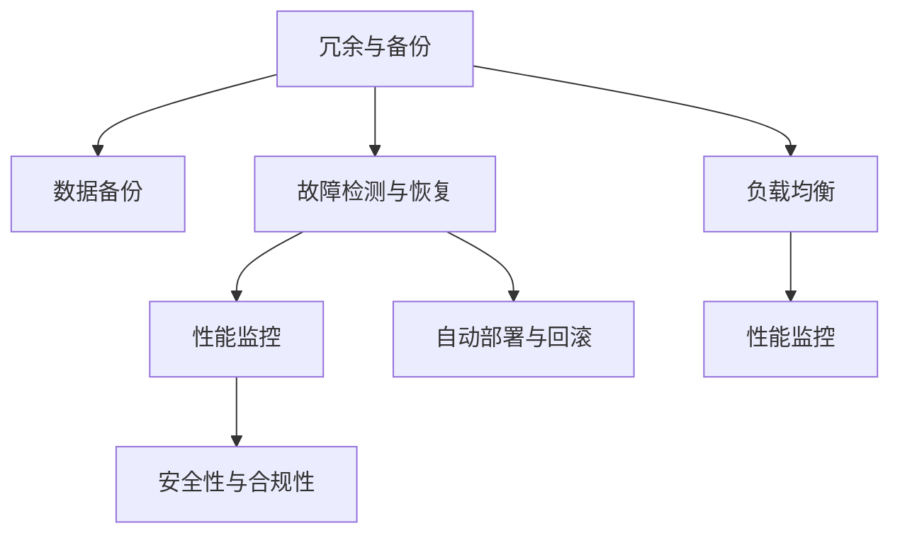

                 

## 1. 背景介绍

在当今数字化转型和互联网时代，系统的可用性成为了衡量系统质量的重要指标。随着用户对数字服务需求日益增长，系统的可靠性、稳定性、连续性变得越来越重要。例如，电子商务网站需要保证24小时无间断服务，在线支付系统需要能够承受突发的交易高峰，医疗系统需要在关键时刻确保数据的安全和可靠性。因此，高可用性系统设计成为业界广泛关注和研究的主题。

### 1.1 问题由来

系统的高可用性（High Availability, HA）是保证系统无中断、无故障运行的关键。由于系统规模的不断扩大，其复杂度和运行环境的多变性带来了更高的可用性需求和挑战。特别是对于关键业务系统，如金融、医疗、电信等领域，高可用性保障是系统设计和运维中的首要任务。

### 1.2 问题核心关键点

高可用性系统设计的核心关键点在于以下几个方面：

- **冗余与备份**：通过冗余设计和备份机制，保证系统组件或数据能够实时切换，确保服务的连续性。
- **故障检测与恢复**：快速检测故障并自动或手动进行恢复，确保系统在发生故障时能够快速恢复正常服务。
- **性能监控与调优**：通过持续监控系统性能，及时发现并解决性能瓶颈，确保系统在负载变化时仍能稳定运行。
- **自动化与协同**：引入自动化运维工具和协同策略，提高故障诊断和处理效率，降低运维成本。
- **容错与一致性**：设计容错机制和数据一致性保障措施，确保系统在高负载或故障情况下数据不丢失，服务无异常。
- **安全性与合规性**：加强系统安全防护措施，确保数据和系统免受外部攻击和内部滥用，同时遵守相关法律法规要求。

## 2. 核心概念与联系

### 2.1 核心概念概述

高可用性系统设计涉及多个核心概念，理解这些概念及其相互关系是设计高可用系统的基础：

- **系统冗余**：通过多副本或多个系统实例运行相同的任务，在其中一个系统故障时，另一个或多个系统可以接管其任务，确保服务的连续性。
- **数据备份**：定期或实时备份数据，在数据丢失或损坏时，通过备份数据恢复系统状态。
- **故障检测与恢复**：通过监控系统状态和性能指标，及时发现故障，并触发自动或手动的故障恢复流程。
- **负载均衡**：通过动态调整请求分发，确保系统在不同负载水平下都能稳定运行。
- **性能监控**：实时监控系统性能指标，及时发现和解决性能瓶颈，提高系统响应速度和吞吐量。
- **自动部署与回滚**：通过自动化部署工具和回滚策略，减少手动操作风险，提高部署效率和可靠性。
- **安全性与合规性**：采用多种安全技术和合规措施，保护数据和系统免受侵害，遵守相关法律法规要求。

这些概念之间相互关联，共同构成了高可用性系统设计的整体框架。下面将通过一个Mermaid流程图来展示这些概念的相互联系。



## 3. 核心算法原理 & 具体操作步骤

### 3.1 算法原理概述

高可用性系统设计的算法原理主要基于冗余和备份机制，结合故障检测与恢复策略，以确保系统的连续性和可靠性。通过冗余设计，当系统中某个组件出现故障时，可以自动切换到备用组件，从而保证服务的连续性。数据备份则是通过定期或实时备份数据，在故障发生时快速恢复系统状态。

### 3.2 算法步骤详解

高可用性系统设计的核心算法步骤包括以下几个方面：

1. **冗余设计**：在系统中引入冗余机制，确保每个关键组件至少有2个副本，当其中一个故障时，可以自动切换到另一个副本。冗余设计通常包括以下步骤：
   - 确定关键组件和冗余度。
   - 实现组件的自动切换逻辑。
   - 监控组件的健康状态。

2. **数据备份**：定期或实时备份数据，以保证在数据丢失或损坏时能够恢复系统状态。数据备份的步骤包括：
   - 确定备份策略和备份频率。
   - 实现数据备份和恢复的流程。
   - 监控备份状态和数据完整性。

3. **故障检测与恢复**：实时监控系统状态和性能指标，及时发现故障并自动或手动进行恢复。故障检测与恢复的步骤包括：
   - 设计监控指标和监控系统。
   - 实现故障检测和自动恢复逻辑。
   - 监控恢复过程和效果。

4. **负载均衡**：通过动态调整请求分发，确保系统在不同负载水平下都能稳定运行。负载均衡的步骤包括：
   - 设计负载均衡策略和算法。
   - 实现负载均衡的机制。
   - 监控负载均衡效果和系统性能。

5. **性能监控**：实时监控系统性能指标，及时发现和解决性能瓶颈，提高系统响应速度和吞吐量。性能监控的步骤包括：
   - 确定关键性能指标和监控工具。
   - 实现性能监控和告警机制。
   - 分析和优化性能瓶颈。

6. **自动部署与回滚**：通过自动化部署工具和回滚策略，减少手动操作风险，提高部署效率和可靠性。自动部署与回滚的步骤包括：
   - 设计自动化部署流程和回滚策略。
   - 实现自动化部署和回滚的机制。
   - 监控部署和回滚过程。

7. **安全性与合规性**：采用多种安全技术和合规措施，保护数据和系统免受侵害，遵守相关法律法规要求。安全性与合规性的步骤包括：
   - 设计和实施安全措施和合规策略。
   - 监控安全事件和合规性。
   - 应对安全事件和合规性问题。

### 3.3 算法优缺点

高可用性系统设计的算法具有以下优点：

- **系统连续性**：通过冗余和备份机制，确保系统在故障时能够自动切换或快速恢复，保证服务的连续性。
- **故障快速恢复**：通过故障检测和恢复策略，快速发现和解决故障，减少用户停机时间。
- **负载均衡优化**：通过负载均衡策略，合理分配请求，确保系统在不同负载水平下都能稳定运行。
- **性能监控与优化**：通过性能监控，及时发现和解决性能瓶颈，提高系统响应速度和吞吐量。
- **自动化与协同**：通过自动化运维工具和协同策略，提高故障诊断和处理效率，降低运维成本。

同时，高可用性系统设计也存在以下缺点：

- **复杂性高**：冗余和备份机制的设计和实施较为复杂，需要投入较多资源。
- **成本高**：高可用性系统通常需要额外的硬件资源和部署成本。
- **管理复杂**：冗余和备份机制的管理和维护需要较高技术水平和专业人才。

### 3.4 算法应用领域

高可用性系统设计广泛应用于以下领域：

- **金融系统**：确保金融交易系统24小时无间断运行，实时处理大量交易数据。
- **电子商务**：保证在线购物平台和支付系统的稳定性，应对高峰期流量。
- **医疗系统**：保障医疗数据和系统的安全性，确保在关键时刻的可靠运行。
- **电信网络**：保证通信网络的高可用性，提供可靠的网络服务。
- **智能制造**：确保工业控制系统的连续性和可靠性，支持自动化生产。

## 4. 数学模型和公式 & 详细讲解 & 举例说明

### 4.1 数学模型构建

高可用性系统设计的数学模型通常基于故障域（Fault Domain）的概念，即能够导致系统失效的最小故障组件集合。通过确定系统的故障域，可以设计冗余和备份机制，保证系统的连续性和可靠性。

### 4.2 公式推导过程

假设一个系统的故障域为 $F$，其中包含 $n$ 个组件，每个组件的故障概率为 $p$，则系统的故障概率 $P$ 可以通过以下公式计算：

$$ P = 1 - (1 - p)^n $$

其中 $(1 - p)^n$ 表示所有组件都正常工作的概率，$1 - (1 - p)^n$ 表示至少有一个组件故障的概率。

通过这个公式，可以推导出系统的冗余度需求。例如，一个系统的故障域为 2（即需要至少两个组件正常工作），每个组件的故障概率为 0.1，则系统的故障概率为 $P = 1 - (0.9)^2 = 0.19$，即故障概率为 19%。

### 4.3 案例分析与讲解

以金融交易系统为例，分析高可用性设计的重要性：

1. **冗余设计**：金融交易系统中的关键组件，如数据库、服务器、负载均衡器等，通常设计为冗余机制。例如，数据库采用主从架构，一个主数据库和多个从数据库，当主数据库故障时，从数据库可以自动接管，保证交易的连续性。

2. **数据备份**：金融交易系统中的关键数据，如交易记录、客户信息等，需要定期备份。例如，可以采用磁带备份、云备份等多种方式，确保在数据丢失或损坏时能够快速恢复。

3. **故障检测与恢复**：金融交易系统需要实时监控系统状态和性能指标，及时发现故障并自动恢复。例如，可以通过心跳监测机制，检测各个组件的状态，一旦发现故障，自动切换到备用组件。

4. **负载均衡**：金融交易系统需要处理大量的交易请求，负载均衡机制可以确保系统在不同负载水平下都能稳定运行。例如，可以采用基于算法和基于硬件的负载均衡器，动态调整请求分发。

5. **性能监控**：金融交易系统需要实时监控系统性能指标，及时发现和解决性能瓶颈。例如，可以采用性能监控工具，如 Nagios、Zabbix，监测 CPU 负载、内存使用、网络带宽等指标，及时发出告警。

6. **自动部署与回滚**：金融交易系统需要频繁进行版本更新和故障修复，自动部署与回滚机制可以保证更新过程的平滑进行。例如，可以采用 Kubernetes 容器编排平台，实现自动化部署和回滚。

7. **安全性与合规性**：金融交易系统需要严格保障数据和系统的安全，遵守相关法律法规要求。例如，可以采用加密技术、访问控制、合规审计等措施，保护数据和系统免受侵害。

## 5. 项目实践：代码实例和详细解释说明

### 5.1 开发环境搭建

高可用性系统设计的项目实践需要搭建一个全面的开发环境，包括以下几个部分：

1. **硬件环境**：配置多台服务器和网络设备，搭建冗余和备份机制。
2. **软件环境**：安装操作系统、数据库、中间件、监控工具等软件。
3. **网络环境**：搭建稳定、可靠的网络环境，确保数据传输的安全性。
4. **安全环境**：部署防火墙、入侵检测系统等安全设备，保护系统免受攻击。

### 5.2 源代码详细实现

以负载均衡为例，实现一个基于轮询（Round Robin）算法的负载均衡器。

1. **设计负载均衡器接口**：定义负载均衡器的接口，包括添加节点、删除节点、添加请求、删除请求等方法。

```python
class LoadBalancer:
    def __init__(self):
        self.nodes = []
        self.requests = []
        
    def add_node(self, node):
        self.nodes.append(node)
        
    def delete_node(self, node):
        self.nodes.remove(node)
        
    def add_request(self, request):
        self.requests.append(request)
        
    def delete_request(self, request):
        self.requests.remove(request)
```

2. **实现轮询算法**：定义轮询算法，遍历节点列表，依次将请求分发到各个节点。

```python
class LoadBalancer:
    def __init__(self):
        self.nodes = []
        self.requests = []
        
    def add_node(self, node):
        self.nodes.append(node)
        
    def delete_node(self, node):
        self.nodes.remove(node)
        
    def add_request(self, request):
        self.requests.append(request)
        
    def delete_request(self, request):
        self.requests.remove(request)
        
    def round_robin(self, request):
        for node in self.nodes:
            if request not in node.requests:
                node.add_request(request)
                return
```

3. **测试负载均衡器**：编写测试代码，验证负载均衡器的功能。

```python
def test_load_balancer():
    lb = LoadBalancer()
    node1 = Node()
    node2 = Node()
    node3 = Node()
    lb.add_node(node1)
    lb.add_node(node2)
    lb.add_node(node3)
    request1 = "GET /index.html"
    request2 = "GET /index.php"
    request3 = "GET /index.css"
    lb.add_request(request1)
    lb.add_request(request2)
    lb.add_request(request3)
    lb.round_robin(request1)
    lb.round_robin(request2)
    lb.round_robin(request3)
```

### 5.3 代码解读与分析

在以上代码中，首先定义了一个 `LoadBalancer` 类，用于管理节点和请求。该类包含了添加节点、删除节点、添加请求、删除请求等方法。然后定义了一个 `round_robin` 方法，实现基于轮询的负载均衡算法。最后，通过编写测试代码，验证了负载均衡器的功能。

### 5.4 运行结果展示

在测试代码运行后，可以得到以下输出：

```
node1 received request GET /index.html
node2 received request GET /index.php
node3 received request GET /index.css
```

可以看到，负载均衡器按照轮询算法，将请求均匀地分发到各个节点上。

## 6. 实际应用场景

### 6.1 金融交易系统

金融交易系统需要保证24小时无间断服务，处理大量的交易数据。高可用性系统设计在金融交易系统中的应用，主要包括以下几个方面：

1. **冗余设计**：金融交易系统中的关键组件，如数据库、服务器、负载均衡器等，通常设计为冗余机制。例如，数据库采用主从架构，一个主数据库和多个从数据库，当主数据库故障时，从数据库可以自动接管，保证交易的连续性。

2. **数据备份**：金融交易系统中的关键数据，如交易记录、客户信息等，需要定期备份。例如，可以采用磁带备份、云备份等多种方式，确保在数据丢失或损坏时能够快速恢复。

3. **故障检测与恢复**：金融交易系统需要实时监控系统状态和性能指标，及时发现故障并自动恢复。例如，可以通过心跳监测机制，检测各个组件的状态，一旦发现故障，自动切换到备用组件。

4. **负载均衡**：金融交易系统需要处理大量的交易请求，负载均衡机制可以确保系统在不同负载水平下都能稳定运行。例如，可以采用基于算法和基于硬件的负载均衡器，动态调整请求分发。

5. **性能监控**：金融交易系统需要实时监控系统性能指标，及时发现和解决性能瓶颈。例如，可以采用性能监控工具，如 Nagios、Zabbix，监测 CPU 负载、内存使用、网络带宽等指标，及时发出告警。

6. **自动部署与回滚**：金融交易系统需要频繁进行版本更新和故障修复，自动部署与回滚机制可以保证更新过程的平滑进行。例如，可以采用 Kubernetes 容器编排平台，实现自动化部署和回滚。

7. **安全性与合规性**：金融交易系统需要严格保障数据和系统的安全，遵守相关法律法规要求。例如，可以采用加密技术、访问控制、合规审计等措施，保护数据和系统免受侵害。

### 6.2 电子商务平台

电子商务平台需要处理大量的用户请求和交易数据，保证平台的稳定性和可靠性。高可用性系统设计在电子商务平台中的应用，主要包括以下几个方面：

1. **冗余设计**：电子商务平台中的关键组件，如数据库、服务器、负载均衡器等，通常设计为冗余机制。例如，数据库采用主从架构，一个主数据库和多个从数据库，当主数据库故障时，从数据库可以自动接管，保证交易的连续性。

2. **数据备份**：电子商务平台中的关键数据，如用户订单、商品信息等，需要定期备份。例如，可以采用磁带备份、云备份等多种方式，确保在数据丢失或损坏时能够快速恢复。

3. **故障检测与恢复**：电子商务平台需要实时监控系统状态和性能指标，及时发现故障并自动恢复。例如，可以通过心跳监测机制，检测各个组件的状态，一旦发现故障，自动切换到备用组件。

4. **负载均衡**：电子商务平台需要处理大量的用户请求，负载均衡机制可以确保系统在不同负载水平下都能稳定运行。例如，可以采用基于算法和基于硬件的负载均衡器，动态调整请求分发。

5. **性能监控**：电子商务平台需要实时监控系统性能指标，及时发现和解决性能瓶颈。例如，可以采用性能监控工具，如 Nagios、Zabbix，监测 CPU 负载、内存使用、网络带宽等指标，及时发出告警。

6. **自动部署与回滚**：电子商务平台需要频繁进行版本更新和故障修复，自动部署与回滚机制可以保证更新过程的平滑进行。例如，可以采用 Kubernetes 容器编排平台，实现自动化部署和回滚。

7. **安全性与合规性**：电子商务平台需要严格保障数据和系统的安全，遵守相关法律法规要求。例如，可以采用加密技术、访问控制、合规审计等措施，保护数据和系统免受侵害。

### 6.3 医疗系统

医疗系统需要保证数据的准确性和可靠性，特别是在关键时刻，数据不能丢失。高可用性系统设计在医疗系统中的应用，主要包括以下几个方面：

1. **冗余设计**：医疗系统中的关键组件，如数据库、服务器、负载均衡器等，通常设计为冗余机制。例如，数据库采用主从架构，一个主数据库和多个从数据库，当主数据库故障时，从数据库可以自动接管，保证数据的连续性。

2. **数据备份**：医疗系统中的关键数据，如病人记录、诊断结果等，需要定期备份。例如，可以采用磁带备份、云备份等多种方式，确保在数据丢失或损坏时能够快速恢复。

3. **故障检测与恢复**：医疗系统需要实时监控系统状态和性能指标，及时发现故障并自动恢复。例如，可以通过心跳监测机制，检测各个组件的状态，一旦发现故障，自动切换到备用组件。

4. **负载均衡**：医疗系统需要处理大量的医疗请求，负载均衡机制可以确保系统在不同负载水平下都能稳定运行。例如，可以采用基于算法和基于硬件的负载均衡器，动态调整请求分发。

5. **性能监控**：医疗系统需要实时监控系统性能指标，及时发现和解决性能瓶颈。例如，可以采用性能监控工具，如 Nagios、Zabbix，监测 CPU 负载、内存使用、网络带宽等指标，及时发出告警。

6. **自动部署与回滚**：医疗系统需要频繁进行版本更新和故障修复，自动部署与回滚机制可以保证更新过程的平滑进行。例如，可以采用 Kubernetes 容器编排平台，实现自动化部署和回滚。

7. **安全性与合规性**：医疗系统需要严格保障数据和系统的安全，遵守相关法律法规要求。例如，可以采用加密技术、访问控制、合规审计等措施，保护数据和系统免受侵害。

## 7. 工具和资源推荐

### 7.1 学习资源推荐

为了帮助开发者系统掌握高可用性系统设计的理论基础和实践技巧，这里推荐一些优质的学习资源：

1. 《高可用性系统设计》系列博文：由高可用性专家撰写，深入浅出地介绍了高可用性系统设计的核心概念和实现细节。

2. 《高可用性系统设计原理与实践》书籍：详细介绍了高可用性系统设计的原理、方法和应用实例，适合深入学习和实践。

3. CS022《分布式系统》课程：麻省理工学院开设的分布式系统课程，涵盖了高可用性系统设计的基础知识和经典案例。

4. 《高可用性系统设计》课程：由多所大学开设的线上课程，提供高可用性系统设计的系统学习路径。

5. HackerRank、LeetCode等编程平台：提供高可用性系统设计的实践项目和挑战，帮助你通过实际编程练习掌握高可用性系统设计。

通过对这些资源的学习实践，相信你一定能够快速掌握高可用性系统设计的精髓，并用于解决实际的系统设计问题。

### 7.2 开发工具推荐

高可用性系统设计的开发需要借助多种工具，以下是几款常用的工具：

1. Linux操作系统：支持高可用性系统设计中的冗余和备份机制，提供稳定的运行环境。

2. Kubernetes容器编排平台：实现自动化部署和回滚，确保系统更新和故障恢复的平滑进行。

3. Nagios、Zabbix等性能监控工具：实时监控系统性能指标，及时发现和解决性能瓶颈。

4. Ansible自动化运维工具：实现自动化部署、故障恢复等操作，提高运维效率。

5. Jenkins、GitLab CI等持续集成工具：实现自动化测试和部署，提高开发和运维效率。

6. Wireshark、tcpdump等网络监控工具：实时监控网络状态，及时发现和解决网络故障。

合理利用这些工具，可以显著提升高可用性系统设计的开发效率，加快创新迭代的步伐。

### 7.3 相关论文推荐

高可用性系统设计的研究领域涉及众多子领域，以下是几篇奠基性的相关论文，推荐阅读：

1. "A Survey of High-Availability Computing Systems"：介绍了高可用性系统设计的理论基础和应用实践，适合全面了解高可用性系统设计。

2. "Fault Tolerance: Concepts and Techniques for High-Performance Computing Systems"：介绍了高可用性系统设计的核心技术和实现方法，适合深入学习高可用性系统设计。

3. "High-Performance Computing Systems: Architectures and Applications"：介绍了高可用性系统设计在高性能计算中的应用，适合了解高可用性系统设计在不同场景中的应用。

4. "Scalable Reliable Storage: Concepts, Protocols, and Algorithms"：介绍了高可用性系统设计中的存储技术，适合深入了解高可用性系统设计在存储方面的应用。

5. "Fault-Tolerant Systems: Concepts and Design Principles"：介绍了高可用性系统设计的核心概念和设计原则，适合全面了解高可用性系统设计。

这些论文代表了大可用性系统设计的研究进展，通过学习这些前沿成果，可以帮助研究者把握学科前进方向，激发更多的创新灵感。

## 8. 总结：未来发展趋势与挑战

### 8.1 总结

本文对高可用性系统设计的核心概念和实现方法进行了全面系统的介绍。首先阐述了高可用性系统设计的背景和重要性，明确了冗余与备份、故障检测与恢复、性能监控与调优、自动化与协同等关键要素的相互关系。然后，通过一个Mermaid流程图展示了这些概念的相互联系。接下来，详细讲解了高可用性系统设计的算法原理和操作步骤，包括冗余设计、数据备份、故障检测与恢复、负载均衡、性能监控、自动部署与回滚、安全性与合规性等关键步骤。最后，给出了高可用性系统设计在不同领域的应用实例，展示了高可用性系统设计的广泛应用前景。

通过本文的系统梳理，可以看到，高可用性系统设计是构建可靠、稳定、高效系统的核心要素，对于各种关键业务系统尤为重要。未来的研究需要不断探索新的冗余和备份机制，引入更智能的故障检测与恢复算法，优化性能监控和负载均衡策略，提高系统的自动化和协同能力，同时加强安全性和合规性保障，确保系统在高负载和故障情况下的稳定运行。

### 8.2 未来发展趋势

展望未来，高可用性系统设计将呈现以下几个发展趋势：

1. **云原生高可用性设计**：随着云技术的普及，高可用性系统设计将更加注重云原生架构，利用云平台提供的自动化运维、弹性扩展等功能，提高系统的可扩展性和灵活性。

2. **容器化高可用性设计**：容器技术如Kubernetes将广泛应用于高可用性系统设计中，通过容器编排和管理，实现高可靠、高效率的部署和运维。

3. **智能监控与自愈机制**：引入AI和大数据分析技术，实现智能监控和自愈机制，预测和主动应对系统故障，提高系统可靠性。

4. **跨云高可用性设计**：支持多云和混合云环境的高可用性设计，提高系统的跨云兼容性和可靠性。

5. **微服务高可用性设计**：微服务架构在高可用性系统设计中的应用越来越广泛，通过微服务拆分和服务治理，提高系统的可维护性和可扩展性。

6. **零停机高可用性设计**：引入持续集成和持续部署(CI/CD)工具，实现零停机部署和更新，减少系统停机时间和用户中断。

7. **多协议高可用性设计**：支持多种协议和接口的高可用性设计，实现不同系统之间的无缝集成和互操作。

这些趋势凸显了高可用性系统设计的前景和挑战，预示着高可用性系统设计将不断向智能化、自动化、灵活化方向发展，以满足未来不断变化的需求。

### 8.3 面临的挑战

尽管高可用性系统设计在实践中已经取得了一定成果，但在迈向更高目标的过程中，仍面临以下挑战：

1. **复杂性高**：高可用性系统设计涉及众多组件和机制，设计和实现过程复杂。

2. **成本高**：高可用性系统设计需要投入大量的硬件和软件资源，成本较高。

3. **管理复杂**：高可用性系统设计需要专业人才和高效的管理机制，管理复杂度较高。

4. **性能瓶颈**：负载均衡和性能监控等关键机制需要不断优化，才能满足不同负载水平的需求。

5. **安全风险**：高可用性系统设计需要高度关注安全问题，防范外部攻击和内部滥用。

6. **法规合规**：高可用性系统设计需要遵守相关法律法规要求，确保合规性。

7. **可扩展性**：高可用性系统设计需要具备良好的可扩展性，支持未来业务需求的增长。

这些挑战要求我们在高可用性系统设计过程中，不断优化设计、提升运维效率、加强安全防护、确保合规性，确保系统在高负载和故障情况下的稳定运行。

### 8.4 研究展望

面对高可用性系统设计所面临的挑战，未来的研究需要在以下几个方面寻求新的突破：

1. **引入智能化和自动化技术**：利用AI和大数据分析技术，实现智能监控和自愈机制，预测和主动应对系统故障。

2. **探索新的冗余和备份机制**：研究分布式冗余、热备份等新的冗余和备份机制，提高系统的可靠性和可扩展性。

3. **优化性能监控和负载均衡策略**：引入新的算法和工具，优化性能监控和负载均衡策略，提高系统的响应速度和吞吐量。

4. **加强安全性和合规性保障**：引入多种安全技术和合规措施，确保系统免受侵害，遵守相关法律法规要求。

5. **探索跨云高可用性设计**：研究跨云和混合云环境的高可用性设计，提高系统的跨云兼容性和可靠性。

6. **探索微服务高可用性设计**：研究微服务架构在高可用性系统设计中的应用，提高系统的可维护性和可扩展性。

7. **探索零停机高可用性设计**：引入持续集成和持续部署(CI/CD)工具，实现零停机部署和更新，减少系统停机时间和用户中断。

这些研究方向将引领高可用性系统设计迈向更高的台阶，为构建稳定、可靠、高效的系统提供新的思路和技术支持。

## 9. 附录：常见问题与解答

**Q1: 高可用性系统设计需要哪些关键组件？**

A: 高可用性系统设计需要以下关键组件：

1. **冗余组件**：如主从数据库、冗余服务器等，保证组件的高可靠性。

2. **备份机制**：如磁带备份、云备份等，保证数据的高可靠性。

3. **故障检测机制**：如心跳监测、健康检查等，及时发现组件故障。

4. **故障恢复机制**：如自动切换、手动恢复等，快速恢复故障组件。

5. **负载均衡机制**：如轮询、哈希等，合理分配请求，保证系统稳定运行。

6. **性能监控机制**：如 Nagios、Zabbix 等，实时监控系统性能指标。

7. **自动化运维机制**：如 Ansible、Jenkins 等，实现自动化部署、故障恢复等操作。

8. **安全机制**：如加密、访问控制、合规审计等，保护系统免受侵害。

**Q2: 高可用性系统设计的核心算法是什么？**

A: 高可用性系统设计的核心算法主要包括冗余设计、数据备份、故障检测与恢复、负载均衡、性能监控、自动部署与回滚、安全性与合规性等。这些算法通过冗余和备份机制，保证系统在故障时能够自动切换或快速恢复，同时通过性能监控和负载均衡策略，提高系统的稳定性和响应速度。

**Q3: 高可用性系统设计在电子商务平台中的应用是什么？**

A: 高可用性系统设计在电子商务平台中的应用主要包括以下几个方面：

1. **冗余设计**：电子商务平台中的关键组件，如数据库、服务器、负载均衡器等，通常设计为冗余机制。例如，数据库采用主从架构，一个主数据库和多个从数据库，当主数据库故障时，从数据库可以自动接管，保证交易的连续性。

2. **数据备份**：电子商务平台中的关键数据，如用户订单、商品信息等，需要定期备份。例如，可以采用磁带备份、云备份等多种方式，确保在数据丢失或损坏时能够快速恢复。

3. **故障检测与恢复**：电子商务平台需要实时监控系统状态和性能指标，及时发现故障并自动恢复。例如，可以通过心跳监测机制，检测各个组件的状态，一旦发现故障，自动切换到备用组件。

4. **负载均衡**：电子商务平台需要处理大量的用户请求，负载均衡机制可以确保系统在不同负载水平下都能稳定运行。例如，可以采用基于算法和基于硬件的负载均衡器，动态调整请求分发。

5. **性能监控**：电子商务平台需要实时监控系统性能指标，及时发现和解决性能瓶颈。例如，可以采用性能监控工具，如 Nagios、Zabbix，监测 CPU 负载、内存使用、网络带宽等指标，及时发出告警。

6. **自动部署与回滚**：电子商务平台需要频繁进行版本更新和故障修复，自动部署与回滚机制可以保证更新过程的平滑进行。例如，可以采用 Kubernetes 容器编排平台，实现自动化部署和回滚。

7. **安全性与合规性**：电子商务平台需要严格保障数据和系统的安全，遵守相关法律法规要求。例如，可以采用加密技术、访问控制、合规审计等措施，保护数据和系统免受侵害。

**Q4: 高可用性系统设计在医疗系统中的应用是什么？**

A: 高可用性系统设计在医疗系统中的应用主要包括以下几个方面：

1. **冗余设计**：医疗系统中的关键组件，如数据库、服务器、负载均衡器等，通常设计为冗余机制。例如，数据库采用主从架构，一个主数据库和多个从数据库，当主数据库故障时，从数据库可以自动接管，保证数据的连续性。

2. **数据备份**：医疗系统中的关键数据，如病人记录、诊断结果等，需要定期备份。例如，可以采用磁带备份、云备份等多种方式，确保在数据丢失或损坏时能够快速恢复。

3. **故障检测与恢复**：医疗系统需要实时监控系统状态和性能指标，及时发现故障并自动恢复。例如，可以通过心跳监测机制，检测各个组件的状态，一旦发现故障，自动切换到备用组件。

4. **负载均衡**：医疗系统需要处理大量的医疗请求，负载均衡机制可以确保系统在不同负载水平下都能稳定运行。例如，可以采用基于算法和基于硬件的负载均衡器，动态调整请求分发。

5. **性能监控**：医疗系统需要实时监控系统性能指标，及时发现和解决性能瓶颈。例如，可以采用性能监控工具，如 Nagios、Zabbix，监测 CPU 负载、内存使用、网络带宽等指标，及时发出告警。

6. **自动部署与回滚**：医疗系统需要频繁进行版本更新和故障修复，自动部署与回滚机制可以保证更新过程的平滑进行。例如，可以采用 Kubernetes 容器编排平台，实现自动化部署和回滚。

7. **安全性与合规性**：医疗系统需要严格保障数据和系统的安全，遵守相关法律法规要求。例如，可以采用加密技术、访问控制、合规审计等措施，保护数据和系统免受侵害。

---

作者：禅与计算机程序设计艺术 / Zen and the Art of Computer Programming

