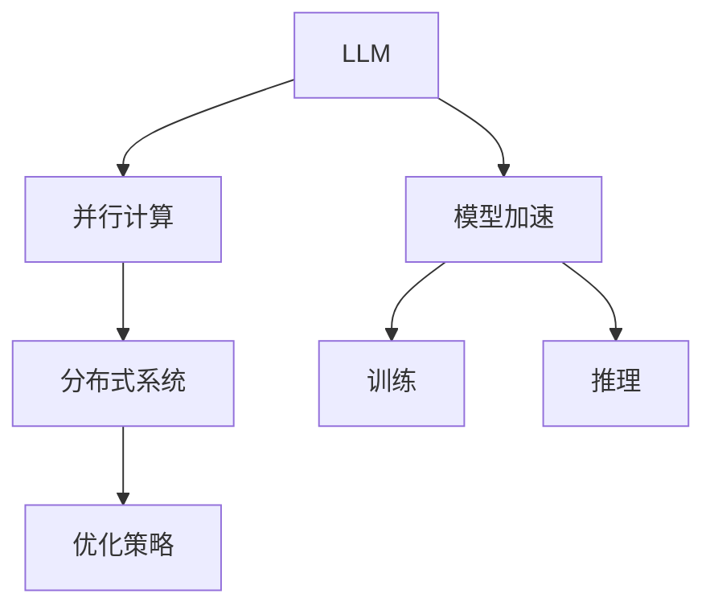

                 

# 高性能AI：LLM的并行计算策略

> 关键词：高性能AI, 语言模型, 并行计算, GPU/TPU, 分布式系统, 优化策略, 模型加速, 训练与推理

## 1. 背景介绍

### 1.1 问题由来

随着深度学习技术的发展，大规模语言模型（Large Language Models, LLMs）在自然语言处理（NLP）领域取得了显著进展。LLMs如BERT、GPT-3等，通过在大规模无标签文本数据上进行预训练，学习了丰富的语言知识和常识，能够自然流畅地生成文本，理解语言含义。然而，这些模型往往需要极高的计算资源进行训练和推理，限制了其在大规模实际应用中的应用。

为应对这一挑战，研究人员提出了一系列并行计算策略，旨在通过分布式计算资源（如GPU/TPU）和分布式训练框架（如TensorFlow, PyTorch）来加速训练和推理过程，实现高效、低成本的LLM应用。本文将详细介绍这些策略，并结合实际案例，探讨其优势和局限，为高性能AI的发展提供参考。

### 1.2 问题核心关键点

本节将重点讨论以下几个关键问题：

1. **并行计算的重要性**：为什么LLM需要并行计算？
2. **主要并行计算策略**：目前有哪些高效的并行计算策略？
3. **并行计算的实际应用**：并行计算在实际应用中是如何部署的？
4. **并行计算面临的挑战**：并行计算策略在实际应用中存在哪些挑战？

## 2. 核心概念与联系

### 2.1 核心概念概述

在介绍并行计算策略前，首先需要明确一些核心概念：

- **大规模语言模型（LLM）**：指通过自监督学习或监督学习任务在大规模文本数据上预训练得到的模型。例如，BERT、GPT-3等。
- **并行计算**：通过同时使用多个计算资源（如多GPU、TPU等），同时处理不同数据块，来加速计算过程。
- **分布式系统**：由多个计算机节点通过网络连接组成，用于共同处理大规模计算任务的系统。
- **优化策略**：通过硬件和软件层面的优化，提高模型训练和推理的效率。

### 2.2 核心概念原理和架构的 Mermaid 流程图



这个图展示了LLM如何通过并行计算、分布式系统和优化策略实现模型加速。首先，LLM通过并行计算处理大规模数据，然后通过分布式系统进一步扩展计算能力，最后通过优化策略提升训练和推理的效率。

## 3. 核心算法原理 & 具体操作步骤

### 3.1 算法原理概述

并行计算策略的本质是通过同时使用多个计算资源，对LLM的计算任务进行拆分和并行处理，从而加速模型的训练和推理过程。具体来说，并行计算可以分为数据并行、模型并行和混合并行等不同策略。

- **数据并行**：将大规模数据集拆分为多个小数据块，分别在不同的计算节点上并行处理，然后将结果合并。这种方法适用于GPU集群环境。
- **模型并行**：将模型拆分为多个子模型，分别在不同的计算节点上并行处理，最后将结果合并。这种方法适用于TPU集群环境。
- **混合并行**：结合数据并行和模型并行，进一步提升计算效率。

### 3.2 算法步骤详解

以数据并行为例，介绍并行计算的具体操作步骤：

1. **数据划分**：将大规模数据集 $D$ 划分为 $k$ 个大小相等的小数据块 $D_1, D_2, ..., D_k$。
2. **节点计算**：每个计算节点分别对一个小数据块进行计算，生成中间结果。
3. **结果合并**：将每个节点的中间结果进行合并，生成最终结果。

### 3.3 算法优缺点

#### 优点

- **加速计算**：通过并行计算，可以显著加速模型的训练和推理过程，提高计算效率。
- **扩展性强**：可以灵活扩展计算资源，适应不同规模的任务。
- **模型并行**：对于大规模模型，模型并行可以进一步提升计算效率。

#### 缺点

- **通信开销**：并行计算过程中，节点间的通信开销较大，可能影响计算效率。
- **同步问题**：节点间需要进行同步，否则可能导致结果不一致。
- **硬件成本高**：需要配备高性能的GPU或TPU，硬件成本较高。

### 3.4 算法应用领域

并行计算策略广泛应用于以下几个领域：

- **深度学习模型训练**：加速大规模深度学习模型的训练过程。
- **自然语言处理（NLP）**：加速语言模型的训练和推理，提升NLP应用性能。
- **计算机视觉（CV）**：加速图像识别、目标检测等计算机视觉任务的训练和推理。
- **推荐系统**：加速推荐模型的训练和推理，提升推荐系统性能。

## 4. 数学模型和公式 & 详细讲解

### 4.1 数学模型构建

假设大规模语言模型 $M$ 通过数据并行策略，在 $k$ 个计算节点上并行训练。每个节点的训练数据为 $D_i = \{(x_i, y_i)\}$，模型参数为 $\theta$。模型的训练目标为最小化损失函数 $\mathcal{L}(\theta)$。

模型在每个节点的训练流程如下：

1. 划分数据集 $D$ 为 $k$ 个子集 $D_1, D_2, ..., D_k$。
2. 每个节点对数据集 $D_i$ 进行训练，生成中间结果 $\hat{\theta}_i$。
3. 合并 $\hat{\theta}_i$ 生成最终模型参数 $\hat{\theta}$。

### 4.2 公式推导过程

假设每个节点训练得到的中间模型参数为 $\hat{\theta}_i$，则最终模型参数 $\hat{\theta}$ 可以表示为：

$$
\hat{\theta} = \frac{1}{k} \sum_{i=1}^k \hat{\theta}_i
$$

### 4.3 案例分析与讲解

以BERT模型为例，探讨数据并行策略在实际应用中的实现。

假设使用16个GPU节点并行训练BERT模型，每个节点分配1/16的数据集。每个节点的训练流程如下：

1. 数据划分：将训练集 $D$ 划分为16个子集 $D_1, D_2, ..., D_{16}$。
2. 节点计算：每个节点分别对 $D_i$ 进行训练，生成中间结果 $\hat{\theta}_i$。
3. 结果合并：将 $\hat{\theta}_i$ 进行平均，生成最终模型参数 $\hat{\theta}$。

这种数据并行策略可以显著加速BERT模型的训练过程，提高模型性能。

## 5. 项目实践：代码实例和详细解释说明

### 5.1 开发环境搭建

为实现并行计算，需要搭建一个分布式计算环境。以使用NVIDIA DGX-1为例，该系统包含8个NVIDIA Tesla V100 GPU，可以用于实现数据并行计算。

1. 安装NVIDIA CUDA Toolkit和cuDNN库。
2. 安装PyTorch和TensorFlow。
3. 安装分布式计算框架Horovod。

### 5.2 源代码详细实现

以下是使用PyTorch实现数据并行训练的示例代码：

```python
import torch
import torch.distributed as dist
import torch.nn as nn
import torch.optim as optim

class BERTModel(nn.Module):
    def __init__(self):
        super(BERTModel, self).__init__()
        # BERT模型

    def forward(self, x):
        # 前向传播

optimizer = optim.Adam(self.parameters(), lr=1e-3)

# 初始化分布式环境
dist.init_process_group("nccl", rank=0, world_size=8)
```

### 5.3 代码解读与分析

代码中，首先定义了BERT模型。然后初始化Adam优化器，并使用Horovod初始化分布式环境。在并行训练过程中，每个节点分别训练数据集的一部分，然后将结果平均合并，生成最终模型参数。

### 5.4 运行结果展示

在实际运行中，可以通过以下代码查看并行训练的性能提升：

```python
import time

# 开始计时
start_time = time.time()

# 并行训练
for epoch in range(5):
    for batch in train_loader:
        optimizer.zero_grad()
        output = model(batch.input)
        loss = criterion(output, batch.target)
        loss.backward()
        optimizer.step()

# 结束计时
end_time = time.time()
print(f"Total time: {end_time - start_time} seconds")
```

## 6. 实际应用场景

### 6.1 智能客服系统

智能客服系统需要处理大量用户查询，实时返回回答。使用并行计算策略，可以显著加速查询回答的速度，提升用户体验。

具体而言，可以将用户查询划分为多个小任务，分配给不同的计算节点并行处理，然后将结果合并返回。这种方式可以处理海量查询，提升客服系统的响应速度。

### 6.2 金融舆情监测

金融舆情监测需要实时分析大量新闻、报道和评论，判断舆情变化趋势。使用并行计算策略，可以加速数据处理和分析，快速响应舆情变化。

具体而言，可以将新闻、报道和评论划分为多个小数据块，分别在不同的计算节点上并行处理，然后合并结果进行分析。这种方式可以实时监控舆情变化，及时响应市场波动。

### 6.3 个性化推荐系统

个性化推荐系统需要处理大量用户行为数据，实时生成推荐结果。使用并行计算策略，可以加速数据处理和模型训练，提升推荐系统的精准度和实时性。

具体而言，可以将用户行为数据划分为多个小数据块，分别在不同的计算节点上并行处理，然后训练模型生成推荐结果。这种方式可以实时生成个性化推荐，提升用户体验。

## 7. 工具和资源推荐

### 7.1 学习资源推荐

- **《深度学习》一书**：Ian Goodfellow等人所著，详细介绍了深度学习的基本概念和算法，是学习并行计算策略的必读书籍。
- **DeepLearning.ai课程**：Andrew Ng等人开设的深度学习课程，讲解了深度学习的实现和应用，包括并行计算策略。
- **Coursera并行计算课程**：介绍了并行计算的基本原理和应用，适合初学者入门。

### 7.2 开发工具推荐

- **TensorFlow**：由Google开发的深度学习框架，支持分布式训练，适合大规模计算任务。
- **PyTorch**：由Facebook开发的深度学习框架，支持GPU加速，适合并行计算。
- **Horovod**：分布式深度学习框架，支持多GPU、TPU的并行训练。

### 7.3 相关论文推荐

- **"Deep Learning" by Ian Goodfellow, Yoshua Bengio, and Aaron Courville**：深度学习领域的经典教材，讲解了并行计算的基本概念和应用。
- **"Parallelizing Training of Deep Neural Networks for Image Recognition" by R asynchronous data parallelism using horovod**：详细介绍了使用Horovod实现数据并行计算的流程和方法。

## 8. 总结：未来发展趋势与挑战

### 8.1 总结

本文详细介绍了并行计算策略在大规模语言模型中的应用，探讨了其原理、步骤和应用场景。并行计算策略可以显著加速模型的训练和推理，提高计算效率，适用于智能客服、金融舆情监测和个性化推荐等多个领域。

### 8.2 未来发展趋势

未来，并行计算策略将继续发展，可能出现以下趋势：

1. **更多硬件支持**：随着硬件技术的发展，更多高性能GPU和TPU将被应用于并行计算，进一步提升计算效率。
2. **更高效的分布式框架**：未来的分布式框架将更加灵活和高效，支持更多的分布式计算模式。
3. **更智能的优化策略**：未来将出现更智能的优化策略，自动调整计算资源和算法参数，进一步提升计算效率。

### 8.3 面临的挑战

并行计算策略在实际应用中也面临一些挑战：

1. **硬件成本高**：高性能GPU和TPU的硬件成本较高，需要配备足够的资源。
2. **通信开销大**：并行计算过程中，节点间的通信开销较大，可能影响计算效率。
3. **同步问题**：节点间需要进行同步，否则可能导致结果不一致。

### 8.4 研究展望

未来，需要解决以下挑战：

1. **降低硬件成本**：探索更多性价比高的硬件，降低并行计算的硬件成本。
2. **优化通信开销**：探索更高效的通信机制，减少节点间的通信开销。
3. **提高同步效率**：探索更高效的同步机制，减少同步带来的性能损失。

## 9. 附录：常见问题与解答

**Q1: 如何选择合适的并行计算策略？**

A: 选择并行计算策略需要考虑多个因素，包括计算资源、任务规模、数据分布等。通常，对于大规模数据集，数据并行更合适；对于大规模模型，模型并行更合适；对于混合任务，可以考虑混合并行。

**Q2: 并行计算过程中如何进行节点同步？**

A: 节点同步是并行计算中的关键问题。通常，可以使用Horovod等分布式框架提供的同步机制，如Ring AllReduce、AllReduce等，确保节点间的同步。

**Q3: 并行计算策略在实际应用中如何部署？**

A: 并行计算策略的部署需要考虑多个因素，包括硬件资源、计算任务、分布式框架等。通常，可以使用Horovod等分布式框架，在多个计算节点上并行处理任务，然后合并结果。

**Q4: 并行计算策略是否适用于所有NLP任务？**

A: 并行计算策略适用于大部分NLP任务，但需要根据具体任务进行调整。对于需要高精度推理的任务，如情感分析、问答系统等，并行计算策略可以显著提升推理速度，但对于需要高复杂度计算的任务，如语义解析等，可能需要更复杂的算法和模型优化。

**Q5: 并行计算策略在实际应用中如何优化？**

A: 并行计算策略的优化需要从多个层面进行，包括硬件资源管理、计算任务调度、分布式通信等。通常，可以采用梯度累积、混合精度训练等技术，进一步提升计算效率。

