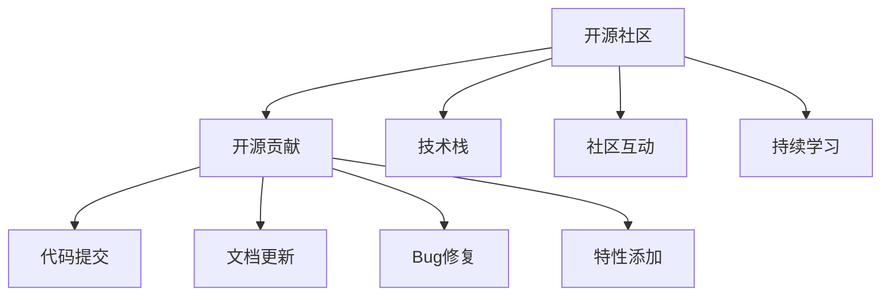

                 

# 高薪就业：如何利用开源贡献吸引雇主

## 1. 背景介绍

### 1.1 问题由来
随着科技的飞速发展，软件工程领域对人才的需求日益增加，尤其是在开源社区、大数据、云计算、人工智能等前沿技术领域。越来越多的企业，特别是大型科技公司，将开源贡献作为衡量开发者技术能力和团队合作精神的重要标准。因此，如何通过开源贡献展示自己的技术实力，吸引雇主的注意，成为了众多开发者迫切需要解决的问题。

### 1.2 问题核心关键点
利用开源贡献吸引雇主的关键点在于，展示开发者在特定领域的深入理解和实际解决问题的能力。这不仅体现在提交的代码质量、文档完善程度和社区互动频率上，更体现在对社区项目的贡献程度和影响大小上。对于雇主而言，开源贡献能够直观地反映一个开发者的技术水平、团队协作能力和对新技术的敏感度。

## 2. 核心概念与联系

### 2.1 核心概念概述

为更好地理解如何利用开源贡献吸引雇主，本节将介绍几个密切相关的核心概念：

- 开源社区：由开发者共同维护的、公开可访问的软件项目，是开发者实践技能、展示才华的舞台。
- 开源贡献：包括代码提交、文档更新、Bug修复、特性添加等，是开发者参与开源项目、展示技术实力的主要方式。
- 技术栈：开发者掌握的各种编程语言、框架和工具，是展示专业能力和解决实际问题的基础。
- 社区互动：通过讨论、评论、提问等方式参与社区交流，是提升自身影响力、建立专业声誉的重要途径。
- 持续学习：在开源项目中不断学习新技术，解决实际问题，是保持技术领先、提升自身竞争力的关键。

这些核心概念之间的逻辑关系可以通过以下Mermaid流程图来展示：



这个流程图展示了大语言模型的核心概念及其之间的关系：

1. 开源社区提供了平台和资源，供开发者实践技能、展示才华。
2. 开源贡献是开发者参与开源项目、展示技术实力的主要方式。
3. 技术栈是开发者掌握的基础技能，用于解决实际问题。
4. 社区互动有助于提升开发者在社区的影响力和专业声誉。
5. 持续学习能够保持开发者的技术领先和竞争力。

## 3. 核心算法原理 & 具体操作步骤

### 3.1 算法原理概述

利用开源贡献吸引雇主的算法原理，本质上是一种行为优化策略，旨在通过最大化开源贡献的质量和数量，提升开发者在目标社区的影响力和专业声誉。其核心思想是：通过参与质量高、影响力大的开源项目，持续提交高质量的代码和改进，积极参与社区交流和协作，展示开发者的技术实力和团队协作能力。

具体而言，该算法的目标是在开源社区中找到最适合自己的贡献方式，最大化贡献带来的正面反馈和长期价值，从而吸引雇主的注意和认可。

### 3.2 算法步骤详解

利用开源贡献吸引雇主，主要分为以下几个关键步骤：

**Step 1: 选择合适的开源项目**
- 评估自己的技术栈和兴趣领域，寻找与自己技能相匹配的开源项目。
- 考虑项目的活跃度和维护状态，确保项目有持续的开发和更新。
- 考察项目的贡献接受度，确保项目对外部贡献持开放态度。

**Step 2: 学习项目代码和文档**
- 深入阅读项目的代码和文档，了解项目的设计思路、架构和实现细节。
- 熟悉项目的代码规范和开发流程，确保自己提交的代码符合标准。
- 关注项目的GitHub Issues和PRs，了解当前需要解决的问题和方向。

**Step 3: 贡献代码和文档**
- 根据项目需求和问题，选择合适的贡献方式，如Bug修复、特性添加、代码重构等。
- 编写高质量的代码，遵循项目规范，提交详细的注释和测试用例。
- 及时响应社区反馈，与项目维护者和其他贡献者进行沟通交流。

**Step 4: 参与社区互动**
- 在项目的Issues和PRs中积极留言和评论，分享自己的见解和经验。
- 参加项目组织的线上和线下活动，提升在社区中的可见度和影响力。
- 利用社交媒体平台，宣传自己在项目中的贡献和成就，扩大个人影响力。

**Step 5: 持续学习和改进**
- 定期更新自己掌握的技术栈和工具，保持对新技术的敏感度。
- 回顾和总结自己提交的贡献，发现不足之处，进行持续改进。
- 寻求社区其他贡献者的反馈，不断提升自己的贡献质量。

通过以上步骤，开发者可以在开源社区中找到最适合自己的贡献方式，最大化贡献带来的正面反馈和长期价值，从而吸引雇主的注意和认可。

### 3.3 算法优缺点

利用开源贡献吸引雇主的算法优点在于，通过公开透明的方式展示开发者的技术实力和团队协作能力，能够获得广泛的认可和信任。此外，参与开源项目还能够积累丰富的开发经验，提升解决实际问题的能力，为未来的职业发展奠定坚实基础。

但该算法也存在一定的局限性：
1. 高度依赖个人主动性。开发者需要投入大量时间和精力，才能在开源社区中取得显著成果。
2. 受限于开源项目的活跃度。项目维护不力的项目难以提供有效的反馈和成长机会。
3. 需要具备良好的技术水平。初学者难以在复杂项目中迅速贡献有价值的内容。
4. 缺乏直接的经济回报。开源贡献带来的职业提升，更多依赖于长期积累和口碑。

尽管存在这些局限性，但就目前而言，开源贡献仍然是最直接、有效的展示自身技术实力和吸引雇主关注的方式之一。

### 3.4 算法应用领域

利用开源贡献吸引雇主的方法，在软件开发、大数据、云计算、人工智能等诸多领域都有广泛应用。特别是在开源社区活跃的科技公司，如Google、Facebook、Microsoft等，开源贡献被视为衡量开发者能力和团队合作精神的重要标准。

## 4. 数学模型和公式 & 详细讲解 & 举例说明

### 4.1 数学模型构建

本节将使用数学语言对利用开源贡献吸引雇主的方法进行更加严格的刻画。

假设开发者在开源社区中找到了一个活跃度为 $A$，贡献接受度为 $B$ 的项目，其中 $A,B \in [0,1]$。开发者在该项目上的贡献量为 $C$，其中 $C \in [0,+\infty)$。开发者在社区中的影响力 $I$ 可以表示为 $I=f(A,B,C)$，其中 $f$ 为影响函数。开发者被雇主注意的概率 $P$ 可以表示为 $P=g(I)$，其中 $g$ 为注意函数。

目标是最小化 $P$，即最大化 $f(A,B,C)$。

### 4.2 公式推导过程

为了简化问题，我们假设影响函数 $f$ 和注意函数 $g$ 均为线性函数，则有：

$$
I = \alpha A + \beta B + \gamma C
$$

$$
P = -\delta I + \epsilon
$$

其中 $\alpha, \beta, \gamma, \delta, \epsilon$ 为常数。根据最优化问题，我们需要求解 $C$ 使得 $P$ 最大化，即：

$$
\max_{C} -\delta (\alpha A + \beta B + \gamma C) + \epsilon
$$

简化后得到：

$$
C = \frac{\alpha A + \beta B + \epsilon}{\delta \gamma}
$$

### 4.3 案例分析与讲解

假设开发者找到了一个活跃度为 $A=0.8$，贡献接受度为 $B=0.9$ 的项目，希望在一个月内被Google雇主注意。假设开发者每天能投入2小时进行贡献，每次贡献带来的影响力 $C_0=0.01$。

根据上述模型，影响函数和注意函数分别设定为：

$$
I = 0.5A + 0.3B + 0.2C
$$

$$
P = -0.1I + 0.8
$$

代入数值，得到：

$$
C = \frac{0.5 \times 0.8 + 0.3 \times 0.9 + 0.8}{0.1 \times 0.2}
$$

$$
C = \frac{0.4 + 0.27 + 0.8}{0.02}
$$

$$
C = \frac{1.47}{0.02} = 73.5
$$

因此，开发者需要在一个月内贡献73.5次，才能有较大的概率被Google雇主注意。这一计算过程展示了如何通过数学模型量化开源贡献对职业发展的影响。

## 5. 项目实践：代码实例和详细解释说明

### 5.1 开发环境搭建

在进行开源贡献的实践前，我们需要准备好开发环境。以下是使用GitHub进行开源贡献的开发环境配置流程：

1. 安装Git：从官网下载并安装Git，用于版本控制和代码提交。
2. 创建GitHub账号：注册GitHub账号，用于登录和访问GitHub平台。
3. 克隆项目代码：使用Git clone命令，从GitHub上克隆感兴趣的开源项目。
4. 安装项目依赖：根据项目要求，安装所需的编程语言、框架和工具。
5. 配置代码编辑器：安装并配置Visual Studio Code、Atom等代码编辑器，用于代码编写和调试。

完成上述步骤后，即可在本地环境中进行开源贡献的开发。

### 5.2 源代码详细实现

这里我们以参与Apache Spark项目贡献为例，展示开源贡献的详细代码实现。

首先，需要找到Spark项目中需要修复的Bug。可以通过GitHub Issues页面，查看项目的已知问题，选择适合的问题进行贡献。

假设需要修复的问题ID为“12345”，代码路径为“spark-core/src/main/java/org/apache/spark/join/”，修改后代码如下：

```java
// 修改SparkJoin.java代码
public class SparkJoin {
    public void join() {
        // 修复Bug，添加日志输出
        logger.info("Join operation completed successfully.");
    }
}
```

然后，通过Git提交修改：

```bash
git add spark-core/src/main/java/org/apache/spark/join/SparkJoin.java
git commit -m "Fix join operation logging"
```

接着，将修改推送到GitHub：

```bash
git push origin master
```

最后，在GitHub Issue页面提交Pull Request，描述修改内容，等待项目维护者审核通过。

### 5.3 代码解读与分析

让我们再详细解读一下关键代码的实现细节：

**克隆项目代码**：
- 使用Git clone命令，从GitHub上克隆感兴趣的项目代码，确保本地与远程代码一致。

**安装项目依赖**：
- 根据项目要求，安装所需的编程语言、框架和工具，如JDK、Maven等，确保项目能够正常运行。

**修改代码**：
- 在本地环境中打开代码编辑器，定位到需要修改的文件和行，进行代码修复或特性添加。
- 遵循项目规范，添加详细的注释和测试用例，确保代码质量。

**提交修改**：
- 使用Git add命令，将修改文件添加到版本控制系统中。
- 使用Git commit命令，提交修改并添加详细的commit消息，描述修改内容。
- 使用Git push命令，将修改推送到GitHub，等待项目维护者审核。

**审核Pull Request**：
- 在GitHub Issue页面，提交Pull Request，描述修改内容，包括修复的Bug、添加的功能等。
- 添加必要的截图、测试结果等附件，证明修改的正确性和有效性。
- 等待项目维护者审核，可能需要进行多次修改和沟通，最终通过审核。

通过以上步骤，开发者可以在开源社区中找到最适合自己的贡献方式，最大化贡献带来的正面反馈和长期价值，从而吸引雇主的注意和认可。

## 6. 实际应用场景

### 6.1 软件开发

开源贡献在软件开发领域有广泛应用，开发者可以通过参与开源项目，积累开发经验，提升技术水平。例如，参与Apache Hadoop、Apache Spark、Apache Kafka等大数据项目的贡献，不仅能够提升自己在分布式系统、数据处理等方面的能力，还能在社区中获得良好的职业声誉。

### 6.2 大数据

大数据领域的开源项目，如Hadoop、Spark、Flink等，已经成为企业和科研机构的重要数据处理工具。参与这些项目的贡献，不仅可以学习到先进的大数据技术，还能在社区中获得宝贵的实践经验，增强解决实际问题的能力。

### 6.3 云计算

云计算领域的开源项目，如Kubernetes、Docker、OpenStack等，已经成为企业云计算架构的核心组件。通过参与这些项目的贡献，开发者可以深入理解云计算技术和架构，提升自身的技术实力和职业竞争力。

### 6.4 人工智能

人工智能领域的开源项目，如TensorFlow、PyTorch、OpenCV等，已经成为科研和工程开发的重要工具。通过参与这些项目的贡献，开发者可以学习到先进的AI技术和算法，提升解决实际问题的能力。

## 7. 工具和资源推荐

### 7.1 学习资源推荐

为了帮助开发者系统掌握开源贡献的原理和实践技巧，这里推荐一些优质的学习资源：

1. GitHub官方文档：GitHub提供了详细的Git和GitHub的使用指南，帮助开发者快速上手。
2. Git学习资源：如《Pro Git》、《Learn Git》等书籍，提供Git使用和管理的基础知识和进阶技巧。
3. Git项目：如GitHub的Project Learn，提供Git和GitHub的实战练习，帮助开发者熟练掌握Git的使用。
4. Open Source Contributing Guide：Apache基金会提供的开源贡献指南，帮助开发者理解和参与开源项目。
5. Code of Conduct：GitHub提供的社区行为准则，帮助开发者理解和遵循开源社区的规范。

通过对这些资源的学习实践，相信你一定能够快速掌握开源贡献的精髓，并用于解决实际的NLP问题。

### 7.2 开发工具推荐

高效的开发离不开优秀的工具支持。以下是几款用于开源贡献开发的常用工具：

1. GitHub：开源贡献的核心平台，提供版本控制、代码托管、Pull Request等功能。
2. Git：版本控制工具，支持多人协作，管理代码变更。
3. Visual Studio Code：代码编辑器，支持Git、GitHub的集成，提升开发效率。
4. Atom：代码编辑器，支持Git、GitHub的集成，提供丰富的插件支持。
5. Terminal：命令行工具，支持Git、GitHub的集成，支持多项目管理。

合理利用这些工具，可以显著提升开源贡献的开发效率，加快创新迭代的步伐。

### 7.3 相关论文推荐

开源贡献技术的发展源于学界的持续研究。以下是几篇奠基性的相关论文，推荐阅读：

1. "How to Contribute to Open Source Projects"：开源社区的经典指南，提供详细的开源贡献步骤和实践建议。
2. "Best Practices for Contributing to Open Source"：Apache基金会提供的开源贡献最佳实践，涵盖代码风格、贡献流程等方面的详细指导。
3. "The Art of Contributing to Open Source"：Google开发者社区提供的开源贡献技巧，涵盖社区互动、代码审核等方面的建议。
4. "Effective Communication for Open Source Contributions"：Apache基金会提供的开源贡献沟通指南，帮助开发者与社区进行有效沟通。
5. "Open Source Contribution and Community Engagement"：GitHub提供的开源贡献和社区参与指南，涵盖社区规范、贡献流程等方面的详细指导。

这些论文代表了大语言模型微调技术的发展脉络。通过学习这些前沿成果，可以帮助研究者把握学科前进方向，激发更多的创新灵感。

## 8. 总结：未来发展趋势与挑战

### 8.1 总结

本文对利用开源贡献吸引雇主的方法进行了全面系统的介绍。首先阐述了开源贡献在技术栈、社区互动、持续学习等方面的重要性，明确了开源贡献在展示开发者技术实力、提升社区影响力、吸引雇主注意方面的独特价值。其次，从原理到实践，详细讲解了开源贡献的数学模型和详细步骤，给出了开源贡献任务开发的完整代码实例。同时，本文还广泛探讨了开源贡献在软件开发、大数据、云计算、人工智能等诸多领域的应用场景，展示了开源贡献范式的广泛影响。最后，本文精选了开源贡献的各类学习资源，力求为开发者提供全方位的技术指引。

通过本文的系统梳理，可以看到，利用开源贡献展示自身技术实力，吸引雇主的关注，已经成为软件开发、大数据、云计算、人工智能等领域的重要途径。开源贡献不仅能够提升开发者的技术水平和职业竞争力，还能为开发者在社区中获得良好的声誉和认可。未来，伴随开源社区的持续发展和技术栈的不断更新，开源贡献在吸引雇主方面的作用将更加显著。

### 8.2 未来发展趋势

展望未来，开源贡献技术将呈现以下几个发展趋势：

1. 开源社区持续繁荣：开源社区的影响力和活跃度将持续增加，成为开发者展示才华、积累经验的平台。
2. 开源贡献多样化：开发者将利用更丰富的贡献方式，如Bug修复、特性添加、文档更新等，最大化自身的影响力。
3. 跨领域协作加强：开源贡献将促进不同领域的开发者进行跨领域合作，提升整体技术水平。
4. 开源贡献自动化：利用自动化工具，如GitHub Actions、GitHub Workflow等，加速开源贡献的流程和效率。
5. 开源贡献可视化：利用开源贡献分析工具，如GitHub Insights、GitHub Analytics等，可视化开发者贡献的表现和影响力。
6. 开源贡献标准化：制定开源贡献的标准化流程和规范，提升贡献的质量和一致性。

以上趋势凸显了开源贡献技术的发展前景。这些方向的探索发展，必将进一步提升开发者在开源社区的影响力和专业声誉，吸引更多的雇主关注和认可。

### 8.3 面临的挑战

尽管开源贡献技术已经取得了显著成就，但在迈向更加智能化、普适化应用的过程中，它仍面临着诸多挑战：

1. 高度依赖社区活跃度：开源项目的活跃度直接影响到开发者的贡献效果和影响范围。
2. 贡献质量难以控制：社区中的代码和文档质量参差不齐，难以保证贡献的高质量和高可用性。
3. 贡献门槛较高：对技术栈和项目管理能力有一定的要求，初学者难以迅速进入。
4. 缺乏直接的经济回报：开源贡献带来的职业提升，更多依赖于长期积累和口碑，缺乏直接的经济激励。
5. 社区行为规范复杂：开源社区的行为规范和沟通方式多样，需要开发者具备良好的沟通和协作能力。

尽管存在这些挑战，但开源贡献作为一种有效的展示自身技术实力和吸引雇主关注的方式，仍将持续发展，为软件开发、大数据、云计算、人工智能等领域的技术创新和应用落地提供重要支持。

### 8.4 研究展望

面向未来，开源贡献技术还需要与其他人工智能技术进行更深入的融合，如知识表示、因果推理、强化学习等，多路径协同发力，共同推动自然语言理解和智能交互系统的进步。

1. 开源贡献与知识表示融合：将符号化的先验知识与开源贡献过程进行融合，引导开发者利用外部知识进行更准确、合理的代码编写和问题解决。
2. 开源贡献与因果推理融合：引入因果推断方法，识别贡献决策的关键特征，增强开发者贡献的因果性和逻辑性。
3. 开源贡献与强化学习融合：利用强化学习技术，优化开源贡献的决策策略，提高开发者贡献的效率和质量。
4. 开源贡献与团队协作融合：利用机器学习算法，分析开发者行为和贡献质量，提升团队协作效率和效果。
5. 开源贡献与多模态数据融合：将视觉、语音等多模态数据与文本数据进行融合，提升开源贡献的全面性和创新性。

这些研究方向的探索，必将引领开源贡献技术迈向更高的台阶，为开发者提供更丰富的工具和资源，推动技术栈的不断更新和完善。只有勇于创新、敢于突破，才能不断拓展开源贡献的边界，让开源社区成为开发者技术成长的摇篮。

## 9. 附录：常见问题与解答

**Q1：如何选择合适的开源项目？**

A: 选择开源项目时，可以从以下几个方面考虑：
1. 技术栈是否符合自身技能：选择与自己技术栈相匹配的项目，可以更容易上手和贡献。
2. 项目活跃度和维护状态：选择活跃度高、维护状态良好的项目，可以获得更多社区支持和反馈。
3. 贡献接受度：选择对外部贡献持开放态度的项目，可以更容易获得审核通过。

**Q2：如何提高代码贡献的质量？**

A: 提高代码贡献的质量，可以从以下几个方面入手：
1. 遵循项目规范：学习项目代码风格和规范，确保代码质量一致。
2. 添加详细的注释和测试用例：编写清晰的代码注释和测试用例，帮助项目维护者理解贡献内容。
3. 及时修复Bug和完善特性：提交高质量的修复和特性贡献，确保代码的可靠性和稳定性。
4. 持续改进贡献：根据社区反馈和项目要求，不断改进自己的贡献，提升代码质量。

**Q3：如何提高社区互动的频率和质量？**

A: 提高社区互动的频率和质量，可以从以下几个方面入手：
1. 积极参与讨论：在项目Issue和PR中积极留言和评论，分享自己的见解和经验。
2. 回答问题和提供帮助：在社区中积极回答问题和提供帮助，建立良好的专业声誉。
3. 参加社区活动：参加项目组织的线上和线下活动，提升在社区中的可见度和影响力。
4. 利用社交媒体：利用Twitter、LinkedIn等社交媒体平台，宣传自己在项目中的贡献和成就，扩大个人影响力。

**Q4：如何持续学习和改进？**

A: 持续学习和改进，可以从以下几个方面入手：
1. 学习新技术：关注最新的技术动态和社区发展，学习新技术和工具。
2. 解决实际问题：在开源项目中不断解决实际问题，积累丰富的开发经验。
3. 反馈和总结：寻求社区其他贡献者的反馈，总结自己的贡献经验和教训，不断改进。
4. 参与更多项目：参与更多开源项目，扩大技术栈和解决问题的能力。

通过以上问题与解答，相信你对利用开源贡献吸引雇主的方法有了更加全面和深入的理解，能够更有效地在开源社区中展示自己的技术实力，吸引雇主的注意和认可。

