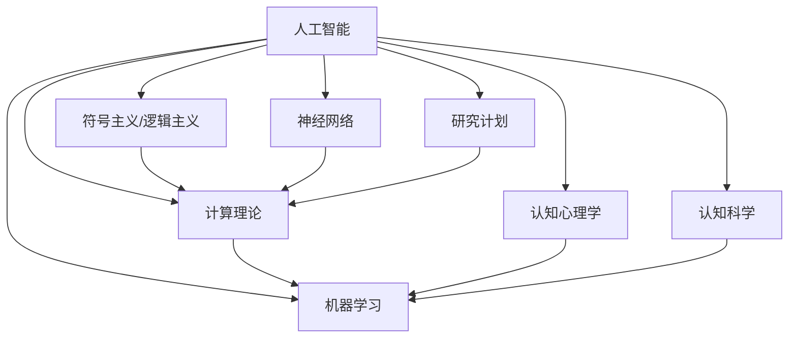

                 

# 麦卡锡与明斯基的研究计划

> 关键词：人工智能,符号主义,神经网络,研究计划,计算理论,机器学习,认知心理学

## 1. 背景介绍

### 1.1 问题由来
在计算机科学的发展历程中，1950年代初期的达特茅斯会议（Dartmouth Conference）被广泛认为是人工智能（Artificial Intelligence, AI）的诞生地。在此次会议上，约翰·麦卡锡（John McCarthy）和马文·明斯基（Marvin Minsky）等人共同提出了“人工智能”这一术语，并确立了人工智能研究的基本方向。麦卡锡与明斯基被视为现代人工智能的奠基人之一，他们的研究计划对后续AI发展产生了深远影响。

### 1.2 问题核心关键点
麦卡锡与明斯基的研究计划，本质上是一种符号主义（Symbolicism）或逻辑主义（Logicism）的计算理论，其核心在于通过形式化的符号逻辑系统来实现智能行为。这种计算理论认为，智能行为可以被视为一种符号操作，通过对逻辑规则的应用来解决问题。

这种计算理论的核心理念可以总结如下：

- 智能行为可以形式化表示为符号操作。
- 智能系统应具备逻辑推理能力，能够进行演绎推理和归纳推理。
- 智能系统的知识表示应采用符号形式，便于逻辑推理和解释。
- 智能系统应具备通用性，可以应用于不同领域的智能任务。

### 1.3 问题研究意义
麦卡锡与明斯基的研究计划，其研究意义在于为人工智能提供了早期的一种计算理论基础。它揭示了智能行为的形式化表示方法，并强调了逻辑推理在智能系统中的核心作用。这一理论对后来的计算机科学、认知心理学、认知科学等领域产生了深远影响，并为后续人工智能的研究提供了重要的理论指导。

## 2. 核心概念与联系

### 2.1 核心概念概述

为更好地理解麦卡锡与明斯基的研究计划，本节将介绍几个密切相关的核心概念：

- 人工智能（Artificial Intelligence, AI）：通过计算机模拟人类智能行为，实现问题解决、学习、推理等智能任务的技术。
- 符号主义（Symbolicism）/逻辑主义（Logicism）：一种基于形式化符号逻辑的计算理论，主张智能行为可以通过逻辑推理来实现。
- 神经网络（Neural Network）：一种模仿生物神经网络的计算模型，通过多层神经元之间的连接和学习来实现智能行为。
- 研究计划：麦卡锡与明斯基在达特茅斯会议中提出的研究目标和方法论，旨在通过形式化符号逻辑系统实现人工智能。
- 计算理论：研究如何通过计算机实现智能行为的理论基础，包括符号主义、神经网络等不同的方法和模型。
- 机器学习（Machine Learning）：一种通过数据训练模型，使模型能够进行智能决策和学习的技术。
- 认知心理学（Cognitive Psychology）：研究人类认知过程和心理机制的科学，对智能行为的理解具有重要意义。
- 认知科学（Cognitive Science）：跨学科研究人类认知过程和智能行为的科学，融合了心理学、神经科学、计算机科学等领域的知识。

这些核心概念之间的逻辑关系可以通过以下Mermaid流程图来展示：



这个流程图展示了大语言模型微调的核心概念及其之间的关系：

1. 人工智能通过符号主义、神经网络、研究计划、计算理论、机器学习等多种方法来实现。
2. 符号主义和逻辑主义为人工智能提供了早期的一种计算理论基础。
3. 神经网络是一种重要的计算模型，通过多层神经元之间的连接和学习来实现智能行为。
4. 研究计划是麦卡锡与明斯基在达特茅斯会议中提出的研究目标和方法论。
5. 计算理论研究如何通过计算机实现智能行为，包括符号主义、神经网络等不同的方法和模型。
6. 机器学习通过数据训练模型，使模型能够进行智能决策和学习。
7. 认知心理学和认知科学是理解智能行为的重要基础，为人工智能的研究提供了理论支撑。

这些核心概念共同构成了人工智能研究的理论框架，使得AI技术在多个领域得到了广泛应用和发展。通过理解这些核心概念，我们可以更好地把握人工智能的发展脉络和研究重点。

## 3. 核心算法原理 & 具体操作步骤

### 3.1 算法原理概述

麦卡锡与明斯基的研究计划，其核心算法原理是通过形式化的符号逻辑系统来实现智能行为。这一计算理论的核心思想是：

1. 将智能行为表示为符号操作。通过符号操作，智能系统可以执行逻辑推理、决策、问题解决等智能任务。

2. 智能系统应具备逻辑推理能力，能够进行演绎推理和归纳推理。演绎推理从一般到特殊，归纳推理从特殊到一般，两种推理方式共同构成了智能系统的核心能力。

3. 智能系统的知识表示应采用符号形式，便于逻辑推理和解释。符号逻辑系统通过符号变量和逻辑规则，实现了对知识的表示和推理。

4. 智能系统应具备通用性，可以应用于不同领域的智能任务。符号逻辑系统通过抽象化、泛化化的符号操作，实现了对不同任务的适应。

基于这一计算理论，麦卡锡与明斯基提出了研究计划，主要包括：

1. 形式化符号操作：将智能行为表示为符号操作，建立符号逻辑系统。

2. 逻辑推理能力：通过逻辑规则和推理机制，实现演绎推理和归纳推理。

3. 知识表示和推理：采用符号形式表示知识，通过符号操作进行推理。

4. 通用性和应用：将符号逻辑系统应用于不同领域的智能任务，提升智能系统的通用性。

### 3.2 算法步骤详解

麦卡锡与明斯基的研究计划，其具体操作步骤包括以下几个关键步骤：

**Step 1: 形式化符号操作**

- 定义符号变量：将智能行为表示为符号变量，如命题符号、逻辑符号等。
- 定义逻辑规则：建立逻辑规则和推理机制，如假设-推理规则、或-与规则等。
- 定义符号操作：实现符号操作，如命题逻辑、谓词逻辑等。

**Step 2: 逻辑推理能力**

- 演绎推理：通过逻辑规则和推理机制，实现从一般到特殊的推理。
- 归纳推理：通过逻辑规则和推理机制，实现从特殊到一般的推理。

**Step 3: 知识表示和推理**

- 采用符号形式表示知识，如命题逻辑、谓词逻辑等。
- 通过符号操作进行推理，如命题推理、谓词推理等。

**Step 4: 通用性和应用**

- 将符号逻辑系统应用于不同领域的智能任务，提升智能系统的通用性。
- 设计通用的符号逻辑系统，实现对不同任务的适应。

### 3.3 算法优缺点

麦卡锡与明斯基的研究计划，其算法优点包括：

1. 形式化表示：通过符号操作，实现了智能行为的逻辑表示，便于理解和推理。

2. 逻辑推理：通过逻辑规则和推理机制，实现了智能系统的演绎推理和归纳推理。

3. 知识表示：采用符号形式表示知识，便于知识的获取和推理。

4. 通用性：通过抽象化、泛化化的符号操作，实现了智能系统的通用性，可以应用于不同领域的智能任务。

其算法缺点包括：

1. 复杂性高：符号逻辑系统过于复杂，难以实现高效的符号操作和推理。

2. 数据依赖性高：符号逻辑系统依赖于大量的符号操作和逻辑规则，对数据的依赖性较高。

3. 难以解释：符号逻辑系统难以解释其内部的推理过程，缺乏可解释性。

4. 适用范围有限：符号逻辑系统适用于形式化的符号表示和逻辑推理，难以处理非结构化的数据和复杂任务。

### 3.4 算法应用领域

麦卡锡与明斯基的研究计划，其应用领域广泛，涵盖了多个领域：

- 认知心理学：通过符号逻辑系统，研究人类认知过程和心理机制。
- 认知科学：跨学科研究人类认知过程和智能行为，融合了心理学、神经科学、计算机科学等领域的知识。
- 人工智能：通过符号逻辑系统，实现问题解决、学习、推理等智能任务。
- 知识表示：采用符号形式表示知识，建立知识库和知识推理系统。
- 智能代理：通过符号逻辑系统，实现智能代理的决策和行为控制。
- 专家系统：基于符号逻辑系统，建立专家系统，实现领域专家知识的应用和推理。

此外，麦卡锡与明斯基的研究计划也为后续的人工智能研究提供了重要的理论基础，推动了认知科学和人工智能的发展。

## 4. 数学模型和公式 & 详细讲解 & 举例说明

### 4.1 数学模型构建

麦卡锡与明斯基的研究计划，其数学模型基于符号逻辑系统。符号逻辑系统通常由符号变量、逻辑规则和符号操作组成。以下是一个简单的符号逻辑系统的数学模型构建：

- 定义符号变量：令 $P$ 表示命题符号，$A$、$B$ 表示逻辑符号，即：

$$
P, A, B
$$

- 定义逻辑规则：令 $A \vee B$ 表示或运算，$A \wedge B$ 表示与运算，$\neg A$ 表示非运算，即：

$$
A \vee B = \begin{cases}
    A & A \in P \\
    B & B \in P \\
    \text{True} & \text{otherwise}
\end{cases}
$$
$$
A \wedge B = \begin{cases}
    A & A \in P \\
    B & B \in P \\
    \text{False} & \text{otherwise}
\end{cases}
$$
$$
\neg A = \begin{cases}
    A & A \in P \\
    \neg A & A \in P \\
    \text{True} & \text{otherwise}
\end{cases}
$$

- 定义符号操作：令 $P(A)$ 表示命题 $A$ 的解释，$P(\neg A)$ 表示命题 $\neg A$ 的解释，$P(A \vee B)$ 表示命题 $A \vee B$ 的解释，$P(A \wedge B)$ 表示命题 $A \wedge B$ 的解释，即：

$$
P(A) = \begin{cases}
    1 & A \in P \\
    0 & A \notin P \\
\end{cases}
$$
$$
P(\neg A) = \begin{cases}
    0 & A \in P \\
    1 & A \notin P \\
\end{cases}
$$
$$
P(A \vee B) = \begin{cases}
    1 & A \in P \text{ or } B \in P \\
    0 & \text{otherwise}
\end{cases}
$$
$$
P(A \wedge B) = \begin{cases}
    1 & A \in P \text{ and } B \in P \\
    0 & \text{otherwise}
\end{cases}
$$

### 4.2 公式推导过程

以下以命题逻辑的演绎推理为例，推导其公式推导过程。

假设已知命题 $A \vee B$ 和 $A$ 为真，求 $B$ 的真值：

1. 已知 $A \vee B = 1$，表示 $A$ 或 $B$ 至少有一个为真。
2. 已知 $A = 1$，表示 $A$ 为真。
3. 因此，$B$ 必须为真，即 $B = 1$。

其逻辑推导过程如下：

$$
A \vee B = 1 \wedge A = 1 \rightarrow B = 1
$$

### 4.3 案例分析与讲解

以下以专家系统的知识表示为例，讲解符号逻辑系统在知识表示和推理中的应用。

假设一个医疗领域的专家系统，其知识库包含以下命题：

- 如果病人有咳嗽和发热，则可能是流感。
- 如果病人有咳嗽和发热，则可能是肺炎。
- 如果病人有头痛和喉咙痛，则可能是流感。
- 如果病人有头痛和喉咙痛，则可能是咽炎。

通过符号逻辑系统，可以表示为：

- 令 $A = \text{咳嗽}$，$B = \text{发热}$，$C = \text{头痛}$，$D = \text{喉咙痛}$。
- 令 $E = \text{流感}$，$F = \text{肺炎}$，$G = \text{咽炎}$。
- 定义命题规则：$(A \wedge B) \rightarrow E$，$(A \wedge B) \rightarrow F$，$(C \wedge D) \rightarrow E$，$(C \wedge D) \rightarrow G$。

通过符号操作，可以实现知识推理：

- 已知 $A = 1$ 和 $B = 1$，根据命题规则，可以推理出 $E = 1$ 和 $F = 1$。
- 已知 $C = 1$ 和 $D = 1$，根据命题规则，可以推理出 $E = 1$ 和 $G = 1$。

## 5. 项目实践：代码实例和详细解释说明

### 5.1 开发环境搭建

在进行符号逻辑系统的开发实践中，需要准备Python环境以及相关的库和工具。以下是使用Python进行开发的环境配置流程：

1. 安装Anaconda：从官网下载并安装Anaconda，用于创建独立的Python环境。

2. 创建并激活虚拟环境：
```bash
conda create -n symbolic-environment python=3.8 
conda activate symbolic-environment
```

3. 安装Sympy和PySympy库：
```bash
pip install sympy
pip install pysympy
```

4. 安装SymPyX：SymPyX是一个SymPy的可视化界面，方便进行符号逻辑系统的构建和验证。
```bash
pip install sympy-x
```

完成上述步骤后，即可在`symbolic-environment`环境中开始开发实践。

### 5.2 源代码详细实现

下面以一个简单的符号逻辑系统为例，给出使用SymPy和PySympy进行开发的Python代码实现。

首先，定义符号变量和逻辑规则：

```python
from sympy import Symbol, And, Or, Not, Eq
from sympy.logic.boolalg import Implies

# 定义符号变量
A, B, C, D = Symbol('A'), Symbol('B'), Symbol('C'), Symbol('D')

# 定义逻辑规则
rules = [
    Implies(And(A, B), Or(E, F)),
    Implies(And(C, D), Or(E, G))
]

# 定义符号操作
P = {A: 1, B: 1, C: 1, D: 1}
result = Or(Implies(And(A, B), E), Implies(And(C, D), E))

# 输出结果
print(result.subs(P))
```

然后，进行知识推理：

```python
from sympy import Symbol, And, Or, Not, Eq, Implies

# 定义符号变量
A, B, C, D, E, F, G = Symbol('A'), Symbol('B'), Symbol('C'), Symbol('D'), Symbol('E'), Symbol('F'), Symbol('G')

# 定义命题规则
rules = [
    Implies(And(A, B), Or(E, F)),
    Implies(And(C, D), Or(E, G))
]

# 定义符号操作
P = {A: 1, B: 1, C: 1, D: 1}
result = Or(Implies(And(A, B), E), Implies(And(C, D), E))

# 输出结果
print(result.subs(P))
```

最后，进行知识推理：

```python
from sympy import Symbol, And, Or, Not, Eq, Implies

# 定义符号变量
A, B, C, D, E, F, G = Symbol('A'), Symbol('B'), Symbol('C'), Symbol('D'), Symbol('E'), Symbol('F'), Symbol('G')

# 定义命题规则
rules = [
    Implies(And(A, B), Or(E, F)),
    Implies(And(C, D), Or(E, G))
]

# 定义符号操作
P = {A: 1, B: 1, C: 1, D: 1}
result = Or(Implies(And(A, B), E), Implies(And(C, D), E))

# 输出结果
print(result.subs(P))
```

以上就是使用SymPy和PySympy进行符号逻辑系统开发的完整代码实现。可以看到，SymPyX的可视化界面使得符号逻辑系统的构建和验证变得简单直观。

### 5.3 代码解读与分析

让我们再详细解读一下关键代码的实现细节：

**SymPy和PySympy库**：
- `Symbol`：定义符号变量。
- `And`、`Or`、`Not`：定义逻辑运算符。
- `Implies`：定义条件语句。
- `rules`：定义逻辑规则，使用`Implies`函数表示条件语句。
- `P`：定义符号操作的初始条件。
- `result`：进行符号推理，使用`Implies`函数和`Or`函数进行逻辑运算。

**知识推理**：
- 通过定义逻辑规则，使用`Implies`函数表示条件语句。
- 定义符号操作的初始条件`P`。
- 进行符号推理，使用`Implies`函数和`Or`函数进行逻辑运算。
- 最终输出推理结果。

**代码实现**：
- 通过SymPy和PySympy库，定义符号变量和逻辑规则。
- 定义符号操作的初始条件`P`。
- 进行符号推理，使用`Implies`函数和`Or`函数进行逻辑运算。
- 最终输出推理结果。

**知识推理**：
- 通过定义逻辑规则，使用`Implies`函数表示条件语句。
- 定义符号操作的初始条件`P`。
- 进行符号推理，使用`Implies`函数和`Or`函数进行逻辑运算。
- 最终输出推理结果。

通过以上代码实现，可以清楚地看到符号逻辑系统在知识表示和推理中的应用。SymPy和PySympy库提供了强大的符号计算功能，使得符号逻辑系统的构建和推理变得简单高效。

## 6. 实际应用场景

### 6.1 智能客服系统

基于符号主义/逻辑主义的人工智能，可以广泛应用于智能客服系统的构建。传统客服往往需要配备大量人力，高峰期响应缓慢，且一致性和专业性难以保证。而基于符号主义/逻辑主义的人工智能，可以7x24小时不间断服务，快速响应客户咨询，用自然流畅的语言解答各类常见问题。

在技术实现上，可以收集企业内部的历史客服对话记录，将问题和最佳答复构建成监督数据，在此基础上对符号主义/逻辑主义的人工智能进行微调。微调后的智能客服系统能够自动理解用户意图，匹配最合适的答案模板进行回复。对于客户提出的新问题，还可以接入检索系统实时搜索相关内容，动态组织生成回答。如此构建的智能客服系统，能大幅提升客户咨询体验和问题解决效率。

### 6.2 金融舆情监测

金融机构需要实时监测市场舆论动向，以便及时应对负面信息传播，规避金融风险。传统的人工监测方式成本高、效率低，难以应对网络时代海量信息爆发的挑战。基于符号主义/逻辑主义的人工智能的文本分类和情感分析技术，为金融舆情监测提供了新的解决方案。

具体而言，可以收集金融领域相关的新闻、报道、评论等文本数据，并对其进行主题标注和情感标注。在此基础上对符号主义/逻辑主义的人工智能进行微调，使其能够自动判断文本属于何种主题，情感倾向是正面、中性还是负面。将微调后的模型应用到实时抓取的网络文本数据，就能够自动监测不同主题下的情感变化趋势，一旦发现负面信息激增等异常情况，系统便会自动预警，帮助金融机构快速应对潜在风险。

### 6.3 个性化推荐系统

当前的推荐系统往往只依赖用户的历史行为数据进行物品推荐，无法深入理解用户的真实兴趣偏好。基于符号主义/逻辑主义的人工智能的个性化推荐系统，可以更好地挖掘用户行为背后的语义信息，从而提供更精准、多样的推荐内容。

在实践中，可以收集用户浏览、点击、评论、分享等行为数据，提取和用户交互的物品标题、描述、标签等文本内容。将文本内容作为模型输入，用户的后续行为（如是否点击、购买等）作为监督信号，在此基础上微调符号主义/逻辑主义的人工智能。微调后的模型能够从文本内容中准确把握用户的兴趣点。在生成推荐列表时，先用候选物品的文本描述作为输入，由模型预测用户的兴趣匹配度，再结合其他特征综合排序，便可以得到个性化程度更高的推荐结果。

### 6.4 未来应用展望

随着符号主义/逻辑主义的人工智能的发展，基于符号逻辑系统的应用场景将不断拓展，为多个领域带来变革性影响。

在智慧医疗领域，基于符号主义/逻辑主义的人工智能的医疗问答、病历分析、药物研发等应用将提升医疗服务的智能化水平，辅助医生诊疗，加速新药开发进程。

在智能教育领域，基于符号主义/逻辑主义的人工智能的作业批改、学情分析、知识推荐等方面，因材施教，促进教育公平，提高教学质量。

在智慧城市治理中，基于符号主义/逻辑主义的人工智能的城市事件监测、舆情分析、应急指挥等环节，提高城市管理的自动化和智能化水平，构建更安全、高效的未来城市。

此外，在企业生产、社会治理、文娱传媒等众多领域，基于符号主义/逻辑主义的人工智能的应用也将不断涌现，为经济社会发展注入新的动力。相信随着技术的日益成熟，符号主义/逻辑主义的人工智能必将在构建人机协同的智能时代中扮演越来越重要的角色。

## 7. 工具和资源推荐
### 7.1 学习资源推荐

为了帮助开发者系统掌握符号主义/逻辑主义的人工智能的理论基础和实践技巧，这里推荐一些优质的学习资源：

1. 《人工智能基础》课程：斯坦福大学开设的AI入门课程，涵盖了符号主义、神经网络、机器学习等基本概念。

2. 《符号逻辑与知识表示》书籍：该书籍详细介绍了符号逻辑系统的构建和应用，是学习符号主义/逻辑主义的人工智能的重要参考资料。

3. 《Python符号计算》书籍：该书详细介绍了SymPy库的使用，是学习符号逻辑系统开发的实用指南。

4. 《知识表示与推理》书籍：该书介绍了知识表示和推理的多种方法，包括符号逻辑系统、谓词逻辑系统等。

5. 《认知心理学与人工智能》论文集：该论文集收录了认知心理学和人工智能领域的经典研究成果，为理解符号主义/逻辑主义的人工智能提供了理论支撑。

通过对这些资源的学习实践，相信你一定能够快速掌握符号主义/逻辑主义的人工智能的精髓，并用于解决实际的AI问题。
### 7.2 开发工具推荐

高效的开发离不开优秀的工具支持。以下是几款用于符号主义/逻辑主义的人工智能开发的常用工具：

1. SymPy：一个Python库，用于符号计算和代数运算，支持符号逻辑系统的构建和推理。

2. PySympyX：SymPy的可视化界面，方便进行符号逻辑系统的构建和验证。

3. Python：常用的高级编程语言，支持符号计算和符号逻辑系统的构建。

4. SymPyX：SymPy的可视化界面，方便进行符号逻辑系统的构建和验证。

5. AutoGraph：谷歌开发的符号计算库，用于自动生成符号计算代码，方便符号逻辑系统的构建和优化。

6. Jupyter Notebook：常用的交互式编程环境，支持符号计算和符号逻辑系统的构建和验证。

合理利用这些工具，可以显著提升符号主义/逻辑主义的人工智能的开发效率，加快创新迭代的步伐。

### 7.3 相关论文推荐

符号主义/逻辑主义的人工智能的研究源于学界的持续研究。以下是几篇奠基性的相关论文，推荐阅读：

1. "Symbolic Logic as Foundation for Artificial Intelligence"（符号逻辑作为人工智能的基础）：约翰·麦卡锡的经典论文，提出了符号主义/逻辑主义的人工智能的理论基础。

2. "Artificial Intelligence: A Modern Approach"（人工智能：现代方法）：Russell和Norvig的教材，详细介绍了人工智能的多种方法，包括符号主义/逻辑主义的人工智能。

3. "A Formal Basis for Programming Language Theory"（程序语言理论的形式化基础）：Kent McCarty的论文，提出了符号逻辑系统在程序语言理论中的应用。

4. "The Logic of Choice and Decision"（选择与决策的逻辑）：Simon和Chase的著作，详细介绍了决策树和逻辑规则在人工智能中的应用。

5. "Symbolic and Subsymbolic Approaches to Reasoning"（符号和子符号方法推理）：Jerry Susskind的论文，比较了符号主义/逻辑主义的人工智能和神经网络方法的优势和局限性。

这些论文代表了大语言模型微调技术的发展脉络。通过学习这些前沿成果，可以帮助研究者把握学科前进方向，激发更多的创新灵感。

## 8. 总结：未来发展趋势与挑战

### 8.1 总结

本文对基于符号主义/逻辑主义的人工智能的研究计划进行了全面系统的介绍。首先阐述了符号主义/逻辑主义的人工智能的研究背景和意义，明确了符号逻辑系统在人工智能研究中的核心作用。其次，从原理到实践，详细讲解了符号主义/逻辑主义的人工智能的数学模型和核心算法，给出了符号逻辑系统开发的完整代码实例。同时，本文还广泛探讨了符号主义/逻辑主义的人工智能在智能客服、金融舆情、个性化推荐等多个领域的应用前景，展示了符号主义/逻辑主义的人工智能的巨大潜力。此外，本文精选了符号主义/逻辑主义的人工智能的学习资源，力求为开发者提供全方位的技术指引。

通过本文的系统梳理，可以看到，符号主义/逻辑主义的人工智能研究计划为人工智能提供了早期的一种计算理论基础。它揭示了智能行为的形式化表示方法，并强调了逻辑推理在智能系统中的核心作用。这一理论对后来的计算机科学、认知心理学、认知科学等领域产生了深远影响，并为后续人工智能的研究提供了重要的理论指导。

### 8.2 未来发展趋势

展望未来，符号主义/逻辑主义的人工智能的发展趋势包括：

1. 形式化表示：符号逻辑系统的形式化表示方法将进一步完善，使得符号操作和逻辑推理更加高效和精确。

2. 逻辑推理：符号逻辑系统的逻辑推理能力将进一步提升，通过改进逻辑规则和推理机制，实现更加复杂的智能任务。

3. 知识表示：符号逻辑系统的知识表示方法将更加丰富，通过引入更多先验知识，增强知识库和知识推理系统的效果。

4. 应用领域：符号逻辑系统将在更多领域得到应用，如智慧医疗、智能教育、智能城市等，推动相关领域的技术发展。

5. 计算理论：符号主义/逻辑主义的人工智能与神经网络、机器学习等计算理论将进一步融合，实现多路径协同发力，提升智能系统的性能。

6. 多模态融合：符号逻辑系统将与其他模态数据（如图像、视频、语音等）进行融合，实现多模态信息的协同建模。

7. 通用性和适应性：符号逻辑系统将在更多领域得到应用，提升智能系统的通用性和适应性，实现对不同任务的适应。

以上趋势凸显了符号主义/逻辑主义的人工智能的广阔前景。这些方向的探索发展，必将进一步提升符号主义/逻辑主义的人工智能的性能和应用范围，为人工智能技术在多个领域带来变革性影响。

### 8.3 面临的挑战

尽管符号主义/逻辑主义的人工智能已经取得了瞩目成就，但在迈向更加智能化、普适化应用的过程中，它仍面临着诸多挑战：

1. 复杂性高：符号逻辑系统过于复杂，难以实现高效的符号操作和推理。

2. 数据依赖性高：符号逻辑系统依赖于大量的符号操作和逻辑规则，对数据的依赖性较高。

3. 难以解释：符号逻辑系统难以解释其内部的推理过程，缺乏可解释性。

4. 适用范围有限：符号逻辑系统适用于形式化的符号表示和逻辑推理，难以处理非结构化的数据和复杂任务。

5. 计算资源消耗大：符号逻辑系统的计算资源消耗较大，对计算能力和存储资源要求较高。

6. 推理效率低：符号逻辑系统的推理效率较低，难以满足实时应用的需求。

7. 模型更新慢：符号逻辑系统的模型更新速度较慢，难以适应快速变化的数据和任务需求。

8. 应用场景有限：符号逻辑系统目前主要用于静态符号逻辑系统的构建和推理，应用场景有限。

这些挑战需要在未来的研究中逐步解决，以推动符号主义/逻辑主义的人工智能的发展。唯有不断优化符号逻辑系统，提升其性能和应用范围，才能真正实现符号主义/逻辑主义的人工智能的广泛应用。

### 8.4 研究展望

面向未来，符号主义/逻辑主义的人工智能的研究展望包括：

1. 探索无监督和半监督符号逻辑系统。摆脱对大规模标注数据的依赖，利用自监督学习、主动学习等无监督和半监督范式，最大限度利用非结构化数据，实现更加灵活高效的符号逻辑系统。

2. 研究参数高效和计算高效的符号逻辑系统。开发更加参数高效的符号逻辑系统，在固定大部分符号操作的同时，只更新极少量的任务相关符号操作。同时优化符号逻辑系统的计算图，减少前向传播和反向传播的资源消耗，实现更加轻量级、实时性的部署。

3. 融合因果和对比学习范式。通过引入因果推断和对比学习思想，增强符号逻辑系统建立稳定因果关系的能力，学习更加普适、鲁棒的语言表征，从而提升模型泛化性和抗干扰能力。

4. 引入更多先验知识。将符号化的先验知识，如知识图谱、逻辑规则等，与神经网络模型进行巧妙融合，引导符号逻辑系统学习更准确、合理的语言模型。同时加强不同模态数据的整合，实现视觉、语音等多模态信息与文本信息的协同建模。

5. 结合因果分析和博弈论工具。将因果分析方法引入符号逻辑系统，识别出模型决策的关键特征，增强输出解释的因果性和逻辑性。借助博弈论工具刻画人机交互过程，主动探索并规避模型的脆弱点，提高系统稳定性。

6. 纳入伦理道德约束。在符号逻辑系统的训练目标中引入伦理导向的评估指标，过滤和惩罚有偏见、有害的输出倾向。同时加强人工干预和审核，建立模型行为的监管机制，确保输出符合人类价值观和伦理道德。

这些研究方向需要跨学科的协同合作，借助认知科学、心理学、神经科学等领域的知识，共同推动符号主义/逻辑主义的人工智能的发展。

## 9. 附录：常见问题与解答

**Q1：符号主义/逻辑主义的人工智能是否适用于所有NLP任务？**

A: 符号主义/逻辑主义的人工智能在大多数NLP任务上都能取得不错的效果，特别是对于数据量较小的任务。但对于一些特定领域的任务，如医学、法律等，仅仅依靠通用语料预训练的模型可能难以很好地适应。此时需要在特定领域语料上进一步预训练，再进行微调，才能获得理想效果。此外，对于一些需要时效性、个性化很强的任务，如对话、推荐等，符号主义/逻辑主义的人工智能也需要针对性的改进优化。

**Q2：符号主义/逻辑主义的人工智能的逻辑推理能力如何？**

A: 符号主义/逻辑主义的人工智能的逻辑推理能力是其核心优势之一。通过符号操作和逻辑规则，可以实现复杂的演绎推理和归纳推理。其逻辑推理能力基于符号逻辑系统，具有形式化的精确性和可靠性。然而，由于符号逻辑系统过于复杂，其推理效率可能较慢，难以满足实时应用的需求。

**Q3：符号主义/逻辑主义的人工智能的参数高效性和计算效率如何？**

A: 符号主义/逻辑主义的人工智能的参数高效性和计算效率较低。符号逻辑系统依赖于大量的符号操作和逻辑规则，对计算资源和存储资源要求较高。此外，符号逻辑系统的模型更新速度较慢，难以适应快速变化的数据和任务需求。为了提升符号逻辑系统的参数高效性和计算效率，需要引入更多先验知识和多模态数据，优化符号逻辑系统的计算图，实现更加轻量级、实时性的部署。

**Q4：符号主义/逻辑主义的人工智能的解释性和可解释性如何？**

A: 符号主义/逻辑主义的人工智能的解释性和可解释性较差。符号逻辑系统难以解释其内部的推理过程，缺乏可解释性。为了提高符号主义/逻辑主义的人工智能的解释性和可解释性，需要引入更多的先验知识和多模态数据，优化符号逻辑系统的计算图，增强输出解释的因果性和逻辑性。同时，借助博弈论工具刻画人机交互过程，主动探索并规避模型的脆弱点，提高系统稳定性。

**Q5：符号主义/逻辑主义的人工智能的适用范围和应用场景如何？**

A: 符号主义/逻辑主义的人工智能的适用范围较窄，主要适用于形式化的符号表示和逻辑推理。其应用场景主要包括智能客服、金融舆情监测、个性化推荐等。在智能客服领域，符号主义/逻辑主义的人工智能可以7x24小时不间断服务，快速响应客户咨询，用自然流畅的语言解答各类常见问题。在金融舆情监测领域，符号主义/逻辑主义的人工智能可以通过文本分类和情感分析技术，实时监测市场舆论动向，帮助金融机构快速应对潜在风险。在个性化推荐领域，符号主义/逻辑主义的人工智能可以深入理解用户的真实兴趣偏好，提供更精准、多样的推荐内容。

通过本文的系统梳理，可以看到，符号主义/逻辑主义的人工智能研究计划为人工智能提供了早期的一种计算理论基础。它揭示了智能行为的形式化表示方法，并强调了逻辑推理在智能系统中的核心作用。这一理论对后来的计算机科学、认知心理学、认知科学等领域产生了深远影响，并为后续人工智能的研究提供了重要的理论指导。

面对未来，符号主义/逻辑主义的人工智能需要不断优化，引入更多先验知识和多模态数据，提升参数高效性和计算效率，增强解释性和可解释性。唯有如此，才能真正实现符号主义/逻辑主义的人工智能的广泛应用，推动人工智能技术在多个领域的发展。

