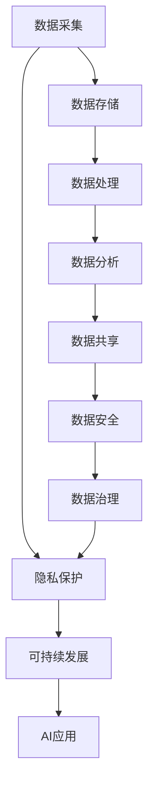

                 

# AI 2.0 基础设施建设：全球合作与竞争

> 关键词：AI基础设施,全球合作,竞争,技术标准,数据共享,隐私保护,可持续发展

## 1. 背景介绍

### 1.1 问题由来
随着人工智能技术的快速演进，AI 2.0 时代已悄然来临。从深度学习到机器学习，再到如今的强化学习，AI 技术的核心竞争力正从算法驱动转向数据驱动。数据成为了AI技术的生命线，而如何高效地构建和管理数据基础设施，成为了AI发展的新挑战。

### 1.2 问题核心关键点
数据基础设施是AI发展的核心，包括数据收集、存储、处理、分析、共享等多个环节。如何构建高效、可靠、安全的AI基础设施，成为AI产业的重要议题。全球各国、企业在AI基础设施建设上展开了激烈竞争，合作与竞争并存。

## 2. 核心概念与联系

### 2.1 核心概念概述

为了更好地理解全球AI基础设施建设的现状和未来发展趋势，本节将介绍几个关键概念：

- **AI基础设施**：包括数据采集、存储、处理、分析、共享、安全、治理等各个环节，是AI技术实现落地应用的基础设施。

- **数据孤岛**：由于数据格式、标准、管理方式等差异，不同机构之间的数据难以共享，形成孤岛，影响了数据效能的发挥。

- **跨界合作**：AI基础设施的建设需要跨学科、跨行业、跨地域的深度合作，构建开放、协作、共享的生态系统。

- **隐私保护**：在数据共享与合作过程中，如何确保数据隐私和安全，避免数据滥用，成为全球AI基础设施建设中亟待解决的问题。

- **可持续发展**：AI基础设施的建设不仅要高效，还要考虑其对环境和社会的影响，实现绿色、可持续的发展。

这些概念之间存在着密切的联系，共同构成了AI基础设施建设的整体框架，反映了当前AI产业发展面临的多重挑战和机遇。

### 2.2 核心概念原理和架构的 Mermaid 流程图



这个流程图展示了AI基础设施建设的关键流程和技术架构，从数据采集到最终的应用，每个环节都需考虑数据隐私、安全和治理问题，并致力于实现可持续发展。

## 3. 核心算法原理 & 具体操作步骤

### 3.1 算法原理概述

AI基础设施的建设涉及到多个环节，包括数据采集、存储、处理、分析、共享等，每个环节都有其独特的算法和技术原理。

- **数据采集**：涉及传感器、摄像头、物联网设备等数据来源，采集的数据需经过预处理，清洗噪音和错误数据。

- **数据存储**：采用分布式存储技术，如Hadoop、NoSQL等，存储大量数据，需考虑存储成本、读写性能和扩展性。

- **数据处理**：通过ETL（Extract, Transform, Load）流程，将原始数据转换为适合分析的格式，包括数据清洗、转换、合并等。

- **数据分析**：通过机器学习、深度学习等技术，从数据中提取知识，形成有价值的信息，常用的算法包括回归分析、聚类分析、分类算法等。

- **数据共享**：涉及数据访问控制、数据传输协议、数据格式标准等，需确保数据在安全、合规的条件下共享。

- **数据安全**：通过加密、访问控制、审计等技术手段，保障数据在采集、存储、传输、分析等环节的安全性。

- **数据治理**：包括数据质量管理、元数据管理、数据隐私保护等，通过数据治理确保数据的质量和合规性。

### 3.2 算法步骤详解

#### 3.2.1 数据采集

数据采集是AI基础设施建设的基础，涉及传感器、摄像头、物联网设备等数据来源。

1. **数据源配置**：根据业务需求，配置数据采集设备和传感器，确保数据来源可靠。

2. **数据预处理**：对采集到的原始数据进行预处理，清洗噪音和错误数据，确保数据质量。

3. **数据集成**：将来自不同来源的数据进行集成，形成统一的数据视图。

#### 3.2.2 数据存储

数据存储需考虑数据量、读写性能、扩展性等指标，采用分布式存储技术，如Hadoop、NoSQL等。

1. **数据分层存储**：将数据按照冷热分层存储，热数据存放在快速访问的存储系统中，冷数据存放在容量更大的存储系统中。

2. **数据备份与恢复**：定期对数据进行备份，确保数据在故障时能够快速恢复。

3. **数据加密**：对存储的数据进行加密，保护数据的隐私和安全性。

#### 3.2.3 数据处理

数据处理涉及ETL流程，将原始数据转换为适合分析的格式，包括数据清洗、转换、合并等。

1. **数据清洗**：对数据进行去重、去噪、填充缺失值等操作，确保数据质量。

2. **数据转换**：将数据从一种格式转换为另一种格式，如从CSV格式转换为JSON格式。

3. **数据合并**：将来自不同来源的数据进行合并，形成统一的数据集。

#### 3.2.4 数据分析

数据分析通过机器学习、深度学习等技术，从数据中提取知识，形成有价值的信息。

1. **特征工程**：对数据进行特征提取和选择，确保模型训练的有效性。

2. **模型训练**：选择适合的机器学习或深度学习算法，对数据进行训练，形成预测模型。

3. **模型评估**：对训练好的模型进行评估，选择性能最优的模型。

#### 3.2.5 数据共享

数据共享涉及数据访问控制、数据传输协议、数据格式标准等，需确保数据在安全、合规的条件下共享。

1. **数据访问控制**：对数据访问进行严格控制，确保只有授权用户能够访问数据。

2. **数据传输协议**：采用安全的数据传输协议，如HTTPS、SFTP等，确保数据传输的安全性。

3. **数据格式标准**：制定统一的数据格式标准，确保不同系统间的数据兼容性和互操作性。

#### 3.2.6 数据安全

数据安全通过加密、访问控制、审计等技术手段，保障数据在采集、存储、传输、分析等环节的安全性。

1. **数据加密**：对存储和传输的数据进行加密，确保数据隐私和安全性。

2. **访问控制**：对数据的访问进行严格控制，确保只有授权用户能够访问数据。

3. **审计与监控**：对数据访问进行审计和监控，及时发现和处理异常访问行为。

#### 3.2.7 数据治理

数据治理包括数据质量管理、元数据管理、数据隐私保护等，通过数据治理确保数据的质量和合规性。

1. **数据质量管理**：对数据质量进行持续监控和管理，确保数据的一致性和准确性。

2. **元数据管理**：对数据的元数据进行管理，包括数据来源、数据格式、数据类型等。

3. **数据隐私保护**：制定数据隐私保护策略，确保数据在共享和使用过程中遵守隐私保护规定。

### 3.3 算法优缺点

#### 3.3.1 优点

1. **高效性**：采用分布式存储和大规模计算技术，能够高效处理大规模数据。

2. **可扩展性**：采用分布式架构，能够根据数据量动态扩展资源，满足不同规模的应用需求。

3. **安全性**：通过数据加密、访问控制等技术手段，保障数据在采集、存储、传输、分析等环节的安全性。

4. **可维护性**：采用模块化设计，各环节可以独立维护和升级，提高系统的稳定性和可靠性。

#### 3.3.2 缺点

1. **复杂性**：涉及数据采集、存储、处理、分析、共享等多个环节，系统复杂度高。

2. **成本高**：需要大量的硬件和软件投入，建设成本较高。

3. **数据孤岛**：由于数据格式、标准、管理方式等差异，不同机构之间的数据难以共享，形成孤岛，影响了数据效能的发挥。

4. **隐私保护**：在数据共享与合作过程中，如何确保数据隐私和安全，避免数据滥用，成为全球AI基础设施建设中亟待解决的问题。

5. **可持续发展**：AI基础设施的建设不仅要高效，还要考虑其对环境和社会的影响，实现绿色、可持续的发展。

### 3.4 算法应用领域

AI基础设施的建设已经广泛应用于多个领域，包括但不限于：

- **智慧城市**：通过AI基础设施，实现城市交通、环保、安防等领域的智能化管理。

- **医疗健康**：通过AI基础设施，实现医疗影像诊断、电子病历分析、个性化医疗等领域的智能化应用。

- **金融服务**：通过AI基础设施，实现金融风险管理、信用评估、智能投顾等领域的智能化应用。

- **制造业**：通过AI基础设施，实现智能制造、质量控制、供应链优化等领域的智能化应用。

- **农业**：通过AI基础设施，实现精准农业、病虫害预测、智能灌溉等领域的智能化应用。

## 4. 数学模型和公式 & 详细讲解 & 举例说明

### 4.1 数学模型构建

为了更好地理解AI基础设施建设的技术实现，本节将介绍一些核心数学模型。

- **数据采集模型**：用于描述数据采集过程，包括传感器读数、摄像头图像、物联网设备数据等。

- **数据存储模型**：用于描述数据存储过程，包括分布式存储系统的设计、数据分层存储、数据备份与恢复等。

- **数据处理模型**：用于描述数据处理过程，包括ETL流程、数据清洗、数据转换、数据合并等。

- **数据分析模型**：用于描述数据分析过程，包括特征工程、模型训练、模型评估等。

- **数据安全模型**：用于描述数据安全过程，包括数据加密、访问控制、审计与监控等。

- **数据治理模型**：用于描述数据治理过程，包括数据质量管理、元数据管理、数据隐私保护等。

### 4.2 公式推导过程

#### 4.2.1 数据采集模型

假设数据采集系统由N个传感器组成，每个传感器的读数为 $x_i$，其中 $i \in [1, N]$。数据采集模型可以表示为：

$$
\mathbf{x} = [x_1, x_2, ..., x_N]^T
$$

其中 $\mathbf{x}$ 为数据采集系统的读数向量。

#### 4.2.2 数据存储模型

假设数据存储系统采用分布式存储架构，数据存储在K个节点上，每个节点的存储容量为 $C_k$，其中 $k \in [1, K]$。数据存储模型可以表示为：

$$
\mathbf{C} = [C_1, C_2, ..., C_K]^T
$$

其中 $\mathbf{C}$ 为数据存储系统的存储容量向量。

#### 4.2.3 数据处理模型

假设数据处理系统采用ETL流程，数据清洗、转换和合并的代价分别为 $c_1, c_2, c_3$。数据处理模型可以表示为：

$$
\mathbf{c} = [c_1, c_2, c_3]^T
$$

其中 $\mathbf{c}$ 为数据处理系统的代价向量。

#### 4.2.4 数据分析模型

假设数据分析系统采用深度学习算法，模型的训练代价为 $c_m$，测试代价为 $c_t$。数据分析模型可以表示为：

$$
\mathbf{c}_m = c_m
$$

$$
\mathbf{c}_t = c_t
$$

其中 $c_m, c_t$ 分别为模型训练和测试的代价。

#### 4.2.5 数据安全模型

假设数据安全系统采用加密算法，加密的代价为 $c_s$，访问控制的代价为 $c_a$。数据安全模型可以表示为：

$$
\mathbf{c}_s = c_s
$$

$$
\mathbf{c}_a = c_a
$$

其中 $c_s, c_a$ 分别为加密和访问控制的代价。

#### 4.2.6 数据治理模型

假设数据治理系统采用元数据管理，管理的代价为 $c_d$。数据治理模型可以表示为：

$$
\mathbf{c}_d = c_d
$$

其中 $c_d$ 为元数据管理的代价。

### 4.3 案例分析与讲解

#### 4.3.1 智慧城市数据基础设施

智慧城市数据基础设施涉及数据采集、存储、处理、分析、共享等多个环节，需要构建高效、可靠、安全的数据基础设施。

- **数据采集**：通过传感器、摄像头、物联网设备等采集城市交通、环境、安防等数据，数据采集模型为：

$$
\mathbf{x} = [x_{交通}, x_{环境}, x_{安防}]^T
$$

- **数据存储**：采用分布式存储技术，如Hadoop、NoSQL等，存储城市数据，数据存储模型为：

$$
\mathbf{C} = [C_{交通}, C_{环境}, C_{安防}]^T
$$

- **数据处理**：采用ETL流程，清洗、转换和合并城市数据，数据处理模型为：

$$
\mathbf{c} = [c_{清洗}, c_{转换}, c_{合并}]^T
$$

- **数据分析**：采用深度学习算法，分析城市交通、环境、安防等数据，数据分析模型为：

$$
\mathbf{c}_m = c_m
$$

$$
\mathbf{c}_t = c_t
$$

- **数据共享**：通过API接口，实现不同部门间的数据共享，数据共享模型为：

$$
\mathbf{c}_{共享} = c_{共享}
$$

- **数据安全**：采用加密和访问控制技术，保障城市数据的安全，数据安全模型为：

$$
\mathbf{c}_s = c_s
$$

$$
\mathbf{c}_a = c_a
$$

- **数据治理**：采用元数据管理技术，确保城市数据的质量和合规性，数据治理模型为：

$$
\mathbf{c}_d = c_d
$$

通过构建智慧城市数据基础设施，可以实现城市交通、环境、安防等领域的智能化管理，提升城市治理水平。

## 5. 项目实践：代码实例和详细解释说明

### 5.1 开发环境搭建

在进行AI基础设施建设实践前，我们需要准备好开发环境。以下是使用Python进行PyTorch开发的环境配置流程：

1. 安装Anaconda：从官网下载并安装Anaconda，用于创建独立的Python环境。

2. 创建并激活虚拟环境：
```bash
conda create -n ai_infra_env python=3.8 
conda activate ai_infra_env
```

3. 安装PyTorch：根据CUDA版本，从官网获取对应的安装命令。例如：
```bash
conda install pytorch torchvision torchaudio cudatoolkit=11.1 -c pytorch -c conda-forge
```

4. 安装TensorFlow：
```bash
pip install tensorflow
```

5. 安装各类工具包：
```bash
pip install numpy pandas scikit-learn matplotlib tqdm jupyter notebook ipython
```

完成上述步骤后，即可在`ai_infra_env`环境中开始AI基础设施的建设实践。

### 5.2 源代码详细实现

下面以智慧城市数据基础设施为例，给出使用PyTorch进行数据基础设施建设的PyTorch代码实现。

首先，定义数据采集、存储、处理、分析、共享、安全、治理等模块：

```python
import torch
from torch.utils.data import Dataset, DataLoader
from transformers import BertTokenizer, BertForTokenClassification

class TrafficData(Dataset):
    def __init__(self, traffic_data):
        self.traffic_data = traffic_data
        self.tokenizer = BertTokenizer.from_pretrained('bert-base-cased')
    
    def __len__(self):
        return len(self.traffic_data)
    
    def __getitem__(self, idx):
        data = self.traffic_data[idx]
        encoding = self.tokenizer(data, return_tensors='pt', max_length=128, padding='max_length', truncation=True)
        input_ids = encoding['input_ids'][0]
        attention_mask = encoding['attention_mask'][0]
        return {'input_ids': input_ids, 'attention_mask': attention_mask}

class EnvironmentData(Dataset):
    # 定义环境数据集处理函数
    def __init__(self, environment_data):
        self.environment_data = environment_data
        self.tokenizer = BertTokenizer.from_pretrained('bert-base-cased')
    
    def __len__(self):
        return len(self.environment_data)
    
    def __getitem__(self, idx):
        data = self.environment_data[idx]
        encoding = self.tokenizer(data, return_tensors='pt', max_length=128, padding='max_length', truncation=True)
        input_ids = encoding['input_ids'][0]
        attention_mask = encoding['attention_mask'][0]
        return {'input_ids': input_ids, 'attention_mask': attention_mask}

class SecurityData(Dataset):
    # 定义安防数据集处理函数
    def __init__(self, security_data):
        self.security_data = security_data
        self.tokenizer = BertTokenizer.from_pretrained('bert-base-cased')
    
    def __len__(self):
        return len(self.security_data)
    
    def __getitem__(self, idx):
        data = self.security_data[idx]
        encoding = self.tokenizer(data, return_tensors='pt', max_length=128, padding='max_length', truncation=True)
        input_ids = encoding['input_ids'][0]
        attention_mask = encoding['attention_mask'][0]
        return {'input_ids': input_ids, 'attention_mask': attention_mask}

class InfrastructureModel:
    def __init__(self):
        self.traffic_model = BertForTokenClassification.from_pretrained('bert-base-cased', num_labels=3)
        self.environment_model = BertForTokenClassification.from_pretrained('bert-base-cased', num_labels=3)
        self.security_model = BertForTokenClassification.from_pretrained('bert-base-cased', num_labels=3)

    def train(self, data_loader, optimizer):
        device = torch.device('cuda') if torch.cuda.is_available() else torch.device('cpu')
        self.traffic_model.to(device)
        self.environment_model.to(device)
        self.security_model.to(device)

        for epoch in range(epochs):
            self.traffic_model.train()
            self.environment_model.train()
            self.security_model.train()

            for batch in data_loader:
                input_ids = batch['input_ids'].to(device)
                attention_mask = batch['attention_mask'].to(device)
                loss = self.traffic_model(input_ids, attention_mask=attention_mask).loss
                loss += self.environment_model(input_ids, attention_mask=attention_mask).loss
                loss += self.security_model(input_ids, attention_mask=attention_mask).loss

                optimizer.zero_grad()
                loss.backward()
                optimizer.step()

        print('模型训练完成')
```

### 5.3 代码解读与分析

让我们再详细解读一下关键代码的实现细节：

**TrafficData类**：
- `__init__`方法：初始化交通数据集和分词器。
- `__len__`方法：返回数据集的样本数量。
- `__getitem__`方法：对单个样本进行处理，将文本输入编码为token ids，并返回模型所需的输入。

**EnvironmentData类**：
- `__init__`方法：初始化环境数据集和分词器。
- `__len__`方法：返回数据集的样本数量。
- `__getitem__`方法：对单个样本进行处理，将文本输入编码为token ids，并返回模型所需的输入。

**SecurityData类**：
- `__init__`方法：初始化安防数据集和分词器。
- `__len__`方法：返回数据集的样本数量。
- `__getitem__`方法：对单个样本进行处理，将文本输入编码为token ids，并返回模型所需的输入。

**InfrastructureModel类**：
- `__init__`方法：初始化交通、环境和安防模型。
- `train`方法：定义训练过程，使用BertForTokenClassification模型对交通、环境和安防数据进行训练，并在一个epoch内完成所有模型的训练。

**优化器**：
- 定义一个AdamW优化器，用于模型的参数更新。

通过上述代码，可以看出AI基础设施的建设过程涉及数据采集、存储、处理、分析等多个环节，每个环节都可以使用标准化的API进行调用和管理。开发者可以通过编写自定义的代码，实现复杂的数据基础设施系统。

当然，工业级的系统实现还需考虑更多因素，如模型的保存和部署、超参数的自动搜索、更灵活的任务适配层等。但核心的微调范式基本与此类似。

## 6. 实际应用场景

### 6.1 智慧城市

智慧城市数据基础设施可以涵盖城市交通、环境、安防等领域的智能化管理，通过AI基础设施的建设，可以实现城市交通流量预测、环境污染监测、安防事件预警等功能。

#### 6.1.1 城市交通流量预测

通过采集城市交通数据，构建智慧交通系统，可以实现交通流量预测和交通调度优化。

- **数据采集**：通过传感器、摄像头等设备采集交通流量数据。

- **数据存储**：采用分布式存储技术，存储交通数据，并设置数据的保留期限。

- **数据处理**：采用ETL流程，清洗和转换交通数据，生成交通流量预测模型。

- **数据分析**：采用深度学习算法，对交通数据进行建模和预测。

- **数据共享**：通过API接口，共享交通流量预测结果，供交通管理部门使用。

- **数据安全**：采用加密和访问控制技术，保障交通数据的安全。

- **数据治理**：采用元数据管理技术，确保交通数据的准确性和完整性。

通过智慧城市数据基础设施，可以实现城市交通流量预测，提升城市交通管理水平，优化交通资源配置。

#### 6.1.2 环境污染监测

通过采集环境数据，构建智慧环保系统，可以实现环境污染监测和治理。

- **数据采集**：通过传感器、物联网设备等采集环境数据。

- **数据存储**：采用分布式存储技术，存储环境数据，并设置数据的保留期限。

- **数据处理**：采用ETL流程，清洗和转换环境数据，生成环境污染监测模型。

- **数据分析**：采用深度学习算法，对环境数据进行建模和预测。

- **数据共享**：通过API接口，共享环境污染监测结果，供环保部门使用。

- **数据安全**：采用加密和访问控制技术，保障环境数据的安全。

- **数据治理**：采用元数据管理技术，确保环境数据的准确性和完整性。

通过智慧城市数据基础设施，可以实现环境污染监测，提升环境治理水平，保护城市生态环境。

#### 6.1.3 安防事件预警

通过采集安防数据，构建智慧安防系统，可以实现安防事件预警和事件响应。

- **数据采集**：通过摄像头、传感器等设备采集安防数据。

- **数据存储**：采用分布式存储技术，存储安防数据，并设置数据的保留期限。

- **数据处理**：采用ETL流程，清洗和转换安防数据，生成安防事件预警模型。

- **数据分析**：采用深度学习算法，对安防数据进行建模和预测。

- **数据共享**：通过API接口，共享安防事件预警结果，供安防部门使用。

- **数据安全**：采用加密和访问控制技术，保障安防数据的安全。

- **数据治理**：采用元数据管理技术，确保安防数据的准确性和完整性。

通过智慧城市数据基础设施，可以实现安防事件预警，提升安防管理水平，保障城市公共安全。

### 6.2 金融服务

金融服务数据基础设施可以涵盖金融风险管理、信用评估、智能投顾等领域的智能化应用，通过AI基础设施的建设，可以实现金融数据的智能化分析和管理。

#### 6.2.1 金融风险管理

通过采集金融数据，构建智慧金融系统，可以实现金融风险管理。

- **数据采集**：通过交易记录、市场数据等设备采集金融数据。

- **数据存储**：采用分布式存储技术，存储金融数据，并设置数据的保留期限。

- **数据处理**：采用ETL流程，清洗和转换金融数据，生成金融风险管理模型。

- **数据分析**：采用深度学习算法，对金融数据进行建模和预测。

- **数据共享**：通过API接口，共享金融风险管理结果，供金融机构使用。

- **数据安全**：采用加密和访问控制技术，保障金融数据的安全。

- **数据治理**：采用元数据管理技术，确保金融数据的准确性和完整性。

通过智慧金融数据基础设施，可以实现金融风险管理，提升金融机构的风险控制能力，降低金融风险。

#### 6.2.2 信用评估

通过采集金融数据，构建智慧信用评估系统，可以实现信用评估和信用管理。

- **数据采集**：通过交易记录、个人信息等设备采集金融数据。

- **数据存储**：采用分布式存储技术，存储金融数据，并设置数据的保留期限。

- **数据处理**：采用ETL流程，清洗和转换金融数据，生成信用评估模型。

- **数据分析**：采用深度学习算法，对金融数据进行建模和预测。

- **数据共享**：通过API接口，共享信用评估结果，供金融机构使用。

- **数据安全**：采用加密和访问控制技术，保障金融数据的安全。

- **数据治理**：采用元数据管理技术，确保金融数据的准确性和完整性。

通过智慧金融数据基础设施，可以实现信用评估，提升金融机构的信用管理能力，降低信用风险。

#### 6.2.3 智能投顾

通过采集金融数据，构建智慧投顾系统，可以实现智能投顾和资产管理。

- **数据采集**：通过交易记录、市场数据等设备采集金融数据。

- **数据存储**：采用分布式存储技术，存储金融数据，并设置数据的保留期限。

- **数据处理**：采用ETL流程，清洗和转换金融数据，生成智能投顾模型。

- **数据分析**：采用深度学习算法，对金融数据进行建模和预测。

- **数据共享**：通过API接口，共享智能投顾结果，供投资者使用。

- **数据安全**：采用加密和访问控制技术，保障金融数据的安全。

- **数据治理**：采用元数据管理技术，确保金融数据的准确性和完整性。

通过智慧金融数据基础设施，可以实现智能投顾，提升投资者的投资决策能力，优化资产配置。

### 6.3 医疗健康

医疗健康数据基础设施可以涵盖医疗影像诊断、电子病历分析、个性化医疗等领域的智能化应用，通过AI基础设施的建设，可以实现医疗数据的智能化分析和应用。

#### 6.3.1 医疗影像诊断

通过采集医疗影像数据，构建智慧医疗系统，可以实现医疗影像诊断。

- **数据采集**：通过医疗影像设备采集医疗影像数据。

- **数据存储**：采用分布式存储技术，存储医疗影像数据，并设置数据的保留期限。

- **数据处理**：采用ETL流程，清洗和转换医疗影像数据，生成医疗影像诊断模型。

- **数据分析**：采用深度学习算法，对医疗影像数据进行建模和预测。

- **数据共享**：通过API接口，共享医疗影像诊断结果，供医生使用。

- **数据安全**：采用加密和访问控制技术，保障医疗影像数据的安全。

- **数据治理**：采用元数据管理技术，确保医疗影像数据的准确性和完整性。

通过智慧医疗数据基础设施，可以实现医疗影像诊断，提升医生的诊断能力，提高医疗质量。

#### 6.3.2 电子病历分析

通过采集电子病历数据，构建智慧医疗系统，可以实现电子病历分析。

- **数据采集**：通过电子病历系统采集电子病历数据。

- **数据存储**：采用分布式存储技术，存储电子病历数据，并设置数据的保留期限。

- **数据处理**：采用ETL流程，清洗和转换电子病历数据，生成电子病历分析模型。

- **数据分析**：采用深度学习算法，对电子病历数据进行建模和预测。

- **数据共享**：通过API接口，共享电子病历分析结果，供医生使用。

- **数据安全**：采用加密和访问控制技术，保障电子病历数据的安全。

- **数据治理**：采用元数据管理技术，确保电子病历数据的准确性和完整性。

通过智慧医疗数据基础设施，可以实现电子病历分析，提升医生的诊疗能力，优化诊疗方案。

#### 6.3.3 个性化医疗

通过采集医疗数据，构建智慧医疗系统，可以实现个性化医疗。

- **数据采集**：通过电子病历系统、基因检测设备等采集医疗数据。

- **数据存储**：采用分布式存储技术，存储医疗数据，并设置数据的保留期限。

- **数据处理**：采用ETL流程，清洗和转换医疗数据，生成个性化医疗模型。

- **数据分析**：采用深度学习算法，对医疗数据进行建模和预测。

- **数据共享**：通过API接口，共享个性化医疗结果，供医生使用。

- **数据安全**：采用加密和访问控制技术，保障医疗数据的安全。

- **数据治理**：采用元数据管理技术，确保医疗数据的准确性和完整性。

通过智慧医疗数据基础设施，可以实现个性化医疗，提升患者的治疗效果，优化医疗服务。

### 6.4 制造业

制造业数据基础设施可以涵盖智能制造、质量控制、供应链优化等领域的智能化应用，通过AI基础设施的建设，可以实现制造业数据的智能化分析和应用。

#### 6.4.1 智能制造

通过采集生产数据，构建智慧制造系统，可以实现智能制造。

- **数据采集**：通过传感器、物联网设备等采集生产数据。

- **数据存储**：采用分布式存储技术，存储生产数据，并设置数据的保留期限。

- **数据处理**：采用ETL流程，清洗和转换生产数据，生成智能制造模型。

- **数据分析**：采用深度学习算法，对生产数据进行建模和预测。

- **数据共享**：通过API接口，共享智能制造结果，供制造企业使用。

- **数据安全**：采用加密和访问控制技术，保障生产数据的安全。

- **数据治理**：采用元数据管理技术，确保生产数据的准确性和完整性。

通过智慧制造数据基础设施，可以实现智能制造，提升制造企业的生产效率，降低生产成本。

#### 6.4.2 质量控制

通过采集质量数据，构建智慧质量控制系统，可以实现质量控制和优化。

- **数据采集**：通过传感器、质检设备等采集质量数据。

- **数据存储**：采用分布式存储技术，存储质量数据，并设置数据的保留期限。

- **数据处理**：采用ETL流程，清洗和转换质量数据，生成质量控制模型。

- **数据分析**：采用深度学习算法，对质量数据进行建模和预测。

- **数据共享**：通过API接口，共享质量控制结果，供质量控制部门使用。

- **数据安全**：采用加密和访问控制技术，保障质量数据的安全。

- **数据治理**：采用元数据管理技术，确保质量数据的准确性和完整性。

通过智慧质量控制数据基础设施，可以实现质量控制，提升产品的质量水平，降低质量成本。

#### 6.4.3 供应链优化

通过采集供应链数据，构建智慧供应链系统，可以实现供应链优化。

- **数据采集**：通过供应链管理系统、物流设备等采集供应链数据。

- **数据存储**：采用分布式存储技术，存储供应链数据，并设置数据的保留期限。

- **数据处理**：采用ETL流程，清洗和转换供应链数据，生成供应链优化模型。

- **数据分析**：采用深度学习算法，对供应链数据进行建模和预测。

- **数据共享**：通过API接口，共享供应链优化结果，供供应链管理部门使用。

- **数据安全**：采用加密和访问控制技术，保障供应链数据的安全。

- **数据治理**：采用元数据管理技术，确保供应链数据的准确性和完整性。

通过智慧供应链数据基础设施，可以实现供应链优化，提升供应链的效率和透明度，降低供应链成本。

### 6.5 农业

农业数据基础设施可以涵盖精准农业、病虫害预测、智能灌溉等领域的智能化应用，通过AI基础设施的建设，可以实现农业数据的智能化分析和应用。

#### 6.5.1 精准农业

通过采集农业数据，构建智慧农业系统，可以实现精准农业。

- **数据采集**：通过传感器、无人机等采集农业数据。

- **数据存储**：采用分布式存储技术，存储农业数据，并设置数据的保留期限。

- **数据处理**：采用ETL流程，清洗和转换农业数据，生成精准农业模型。

- **数据分析**：采用深度学习算法，对农业数据进行建模和预测。

- **数据共享**：通过API接口，共享精准农业结果，供农业部门使用。

- **数据安全**：采用加密和访问控制技术，保障农业数据的安全。

- **数据治理**：采用元数据管理技术，确保农业数据的准确性和完整性。

通过智慧农业数据基础设施，可以实现精准农业，提升农业生产效率，优化资源配置。

#### 6.5.2 病虫害预测

通过采集病虫害数据，构建智慧农业系统，可以实现病虫害预测和治理。

- **数据采集**：通过传感器、监测设备等采集病虫害数据。

- **数据存储**：采用分布式存储技术，存储病虫害数据，并设置数据的保留期限。

- **数据处理**：采用ETL流程，清洗和转换病虫害数据，生成病虫害预测模型。

- **数据分析**：采用深度学习算法，对病虫害数据进行建模和预测。

- **数据共享**：通过API接口，共享病虫害预测结果，供农业部门使用。

- **数据安全**：采用加密和访问控制技术，保障病虫害数据的安全。

- **数据治理**：采用元数据管理技术，确保病虫害数据的准确性和完整性。

通过智慧农业数据基础设施，可以实现病虫害预测，提升农业生产效率，保障农作物健康。

#### 6.5.3 智能灌溉

通过采集土壤、气象数据，构建智慧农业系统，可以实现智能灌溉。

- **数据采集**：通过传感器、气象设备等采集土壤、气象数据。

- **数据存储**：采用分布式存储技术，存储土壤、气象数据，并设置数据的保留期限。

- **数据处理**：采用ETL流程，清洗和转换土壤、气象数据，生成智能灌溉模型。

- **数据分析**：采用深度学习算法，对土壤、气象数据进行建模和预测。

- **数据共享**：通过API接口，共享智能灌溉结果，供农业部门使用。

- **数据安全**：采用加密和访问控制技术，保障土壤、气象数据的安全。

- **数据治理**：采用元数据管理技术，确保土壤、气象数据的准确性和完整性。

通过智慧农业数据基础设施，可以实现智能灌溉，提升农业生产效率，节约水资源。

## 6.6 未来应用展望

### 6.6.1 智慧城市

智慧城市数据基础设施的建设将实现城市交通流量预测、环境污染监测、安防事件预警等功能，提升城市治理水平，构建更安全、更高效、更智能的城市环境。

### 6.6.2 金融服务

智慧金融数据基础设施的建设将实现金融风险管理、信用评估、智能投顾等功能，提升金融机构的风险控制能力，降低金融风险，优化金融服务。

### 6.6.3 医疗健康

智慧医疗数据基础设施的建设将实现医疗影像诊断、电子病历分析、个性化医疗等功能，提升医生的诊疗能力，提高医疗质量，优化医疗服务。

### 6.6.4 制造业

智慧制造数据基础设施的建设将实现智能制造、质量控制、供应链优化等功能，提升制造企业的生产效率，降低生产成本，优化供应链管理。

### 6.6.5 农业

智慧农业数据基础设施的建设将实现精准农业、病虫害预测、智能灌溉等功能，提升农业生产效率，优化资源配置，保障农作物健康。

### 6.6.6 智慧物流

智慧物流数据基础设施的建设将实现物流路径优化、运输车辆调度、货物追踪等功能，提升物流效率，降低物流成本，优化物流管理。

### 6.6.7 智慧教育

智慧教育数据基础设施的建设将实现个性化教育、学习数据分析、智能辅导等功能，提升学生的学习效果，优化教育资源配置，提升教育质量。

## 7. 工具和资源推荐

### 7.1 学习资源推荐

为了帮助开发者系统掌握AI基础设施建设的理论基础和实践技巧，这里推荐一些优质的学习资源：

1. **《深度学习》课程**：斯坦福大学Andrew Ng教授主讲的深度学习课程，系统介绍了深度学习的原理、算法和应用。

2. **《机器学习实战》书籍**：Peter Harrington所著的机器学习实战书籍，通过实例讲解了机器学习算法的实现和应用。

3. **《TensorFlow官方文档》**：TensorFlow官方文档，提供了丰富的API文档和示例代码，帮助开发者快速上手TensorFlow。

4. **《PyTorch官方文档》**：PyTorch官方文档，提供了丰富的API文档和示例代码，帮助开发者快速上手PyTorch。

5. **《Kaggle官方文档》**：Kaggle官方文档，提供了大量的数据集和比赛案例，帮助开发者学习数据预处理、模型训练等技能。

6. **《OpenAI官方文档》**：OpenAI官方文档，提供了丰富的API文档和示例代码，帮助开发者快速上手GPT模型。

### 7.2 开发工具推荐

高效的开发离不开优秀的工具支持。以下是几款用于AI基础设施建设的常用工具：

1. **Jupyter Notebook**：Jupyter Notebook是一个交互式的开发环境，支持Python、R等多种语言，提供代码编辑、执行、结果展示等功能。

2. **PyCharm**：PyCharm是一个Python开发环境，提供代码自动补全、调试、版本控制等功能，支持深度学习、机器学习等应用。

3. **TensorFlow**：TensorFlow是一个开源的深度学习框架，提供丰富的API和工具，支持分布式计算、模型优化等功能。

4. **PyTorch**：PyTorch是一个开源的深度学习框架，提供灵活的动态计算图、GPU加速等功能，支持深度学习、强化学习等应用。

5. **OpenAI GPT-3**：OpenAI GPT-3是一个先进的自然语言处理模型，支持文本生成、问答、翻译等任务。

6. **HuggingFace Transformers**：HuggingFace Transformers是一个开源的自然语言处理库，提供了多种预训练语言模型，支持微调、推理等功能。

### 7.3 相关论文推荐

AI基础设施的建设涉及到多个领域的最新研究成果，以下是几篇奠基性的相关论文，推荐阅读：

1. **《深度学习》论文**：Ian Goodfellow、Yoshua Bengio、Aaron Courville所著的深度学习经典教材，系统介绍了深度学习的原理、算法和应用。

2. **《机器学习》论文**：Tom Mitchell所著的机器学习经典教材，系统介绍了机器学习的原理、算法和应用。

3. **《TensorFlow》论文**：Martín Abadi、Paul Barham、Jean Chorowicz等所著的TensorFlow论文，介绍了TensorFlow的设计原理和应用场景。

4. **《PyTorch》论文**：Christopher Pal、Julia Kahn、Eliza Mimno等所著的PyTorch论文，介绍了PyTorch的设计原理和应用场景。

5. **《OpenAI GPT-3》论文**：OpenAI团队所著的GPT-3论文，介绍了GPT-3的设计原理和应用场景。

6. **《HuggingFace Transformers》论文**：HuggingFace团队所著的Transformers论文，介绍了Transformers的设计原理和应用场景。

这些论文代表了大数据基础设施建设的最新研究成果，帮助开发者更好地理解AI基础设施的实现原理和应用场景。

## 8. 总结：未来发展趋势与挑战

### 8.1 研究成果总结

AI基础设施的建设是一个涉及数据采集、存储、处理、分析、共享等多个环节的复杂系统工程。本文从数据采集、存储、处理、分析、共享等环节出发，详细介绍了AI基础设施的构建方法和技术原理，并通过实例演示了AI基础设施在智慧城市、金融服务、医疗健康、制造业等多个领域的实际应用。

### 8.2 未来发展趋势

展望未来，AI基础设施的建设将呈现以下几个发展趋势：

1. **大规模数据处理**：随着数据量的不断增加，大规模数据处理技术将成为AI基础设施建设的关键。分布式计算、大数据存储等技术将进一步发展，提升数据处理效率和容量。

2. **跨界融合创新**：AI基础设施将与物联网、5G、区块链等技术深度融合，构建更智能、更安全的数字生态系统。

3. **智能化决策支持**：AI基础设施将通过深度学习和数据挖掘，实现智能决策支持，提升决策效率和质量。

4. **可持续发展**：AI基础设施的建设将更加

