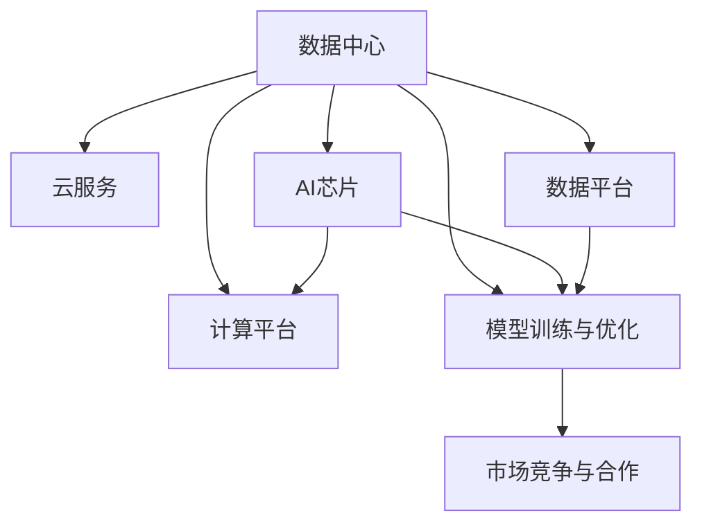

                 

# AI 2.0 基础设施建设：投资回报与商业模式

> 关键词：AI 2.0, 基础设施, 投资回报, 商业模式, 数据中心, 云计算, AI芯片, 数据平台, 市场竞争

## 1. 背景介绍

### 1.1 问题由来
随着人工智能技术的飞速发展，AI 2.0时代已经到来，这一时代的特点是人工智能系统变得日益复杂，应用场景越来越广泛，从医疗、金融、教育到制造业、农业等领域，人工智能正在逐步渗透到社会的各个角落。然而，实现AI 2.0的广泛应用，不仅需要强大的算法和模型，更需要先进的基础设施作为支撑。

基础设施是AI 2.0的核心竞争力之一，但同时也面临着巨大的投资压力和复杂的商业模式。如何合理规划AI基础设施的建设，最大化投资回报，成为当前AI产业的重大课题。本文将全面解析AI 2.0基础设施建设的核心概念、关键算法，以及如何通过合理的商业模式实现投资回报。

### 1.2 问题核心关键点
AI 2.0基础设施建设的核心关键点包括：

- **数据中心和云服务**：构建高效、可靠、可扩展的数据中心，提供高性能云服务。
- **AI芯片和计算平台**：研发高性能AI芯片，提供多层次的计算平台，支持各类AI应用。
- **数据平台与大数据处理**：建设统一、高效的数据平台，支持数据清洗、存储、分析和处理。
- **模型训练与优化**：构建高效、易用的模型训练和优化平台，提升模型性能和效果。
- **市场竞争与合作**：如何在市场竞争中寻找合作机会，形成共赢局面。

这些关键点共同构成了AI 2.0基础设施建设的全貌，需要在技术、资金、市场等多个层面进行全面规划和设计。

## 2. 核心概念与联系

### 2.1 核心概念概述

为更好地理解AI 2.0基础设施建设的内涵，本节将介绍几个核心概念及其相互联系：

- **AI 2.0**：指基于深度学习、自然语言处理、计算机视觉等前沿技术的智能系统，能够完成复杂任务，如自动驾驶、智能客服、医学诊断等。
- **数据中心和云服务**：包括物理硬件设施（服务器、存储设备、网络设施等）和云服务（计算、存储、网络等），支持AI 2.0模型的训练、推理、部署和应用。
- **AI芯片**：指专门为AI算法设计的专用硬件芯片，能够提供高效、低能耗、高并行的计算能力，加速AI模型的训练和推理。
- **计算平台**：提供高性能的计算资源和平台工具，支持各类AI算法的开发和部署。
- **数据平台**：建设统一、高效的数据管理系统，支持数据的收集、存储、清洗、标注和管理。
- **模型训练与优化**：构建高效的模型训练和优化平台，提升AI模型的性能和效果。
- **市场竞争与合作**：如何在市场竞争中寻找合作机会，形成共赢局面，是AI 2.0商业化的关键。

这些核心概念之间的逻辑关系可以通过以下Mermaid流程图来展示：



这个流程图展示了AI 2.0基础设施建设的关键组成部分及其相互关系：

1. **数据中心**：提供物理硬件设施和云服务。
2. **AI芯片**：加速模型训练和推理。
3. **计算平台**：提供高性能计算资源和平台工具。
4. **数据平台**：支持数据管理。
5. **模型训练与优化**：提升模型性能。
6. **市场竞争与合作**：构建共赢商业模式。

这些组成部分共同构成了AI 2.0基础设施的完整框架，为AI应用的广泛落地提供了坚实的基础。

## 3. 核心算法原理 & 具体操作步骤

### 3.1 算法原理概述

AI 2.0基础设施建设的算法原理，主要围绕如何最大化投资回报展开。具体而言，包括以下几个关键环节：

1. **数据中心建设与运维**：通过算法优化物理硬件布局和能效管理，降低运营成本，提高资源利用率。
2. **云服务设计与管理**：通过算法设计弹性计算资源调度策略，最大化资源利用率，降低单位成本。
3. **AI芯片与计算平台开发**：通过算法优化硬件设计，提高计算性能和能效比，降低硬件成本。
4. **数据平台建设与优化**：通过算法优化数据管理流程，提升数据处理效率，降低数据存储和处理成本。
5. **模型训练与优化算法**：通过算法优化模型训练流程，提升模型性能和效果，降低训练成本。

这些算法原理相互关联，共同支撑AI 2.0基础设施的建设和运营。

### 3.2 算法步骤详解

AI 2.0基础设施建设的算法步骤主要包括：

1. **需求分析与规划**：根据AI应用的需求，规划数据中心、云服务、AI芯片、计算平台、数据平台等基础设施。
2. **技术选型与方案设计**：选择符合需求的技术方案，设计基础设施的具体建设方案。
3. **投资预算与成本控制**：制定投资预算，优化成本控制策略，确保投资回报最大化。
4. **建设与运维**：按照设计方案进行建设，并进行运维管理，确保基础设施的正常运行。
5. **市场拓展与合作**：寻找市场机会，建立合作模式，形成共赢局面。

### 3.3 算法优缺点

AI 2.0基础设施建设的算法优点包括：

1. **提升AI性能**：通过优化基础设施，提升模型的训练和推理效率，提高AI应用的性能和效果。
2. **降低运营成本**：通过优化运维和管理策略，降低运营成本，提高资源利用率。
3. **支持多样应用**：通过构建多样化的基础设施，支持不同类型的AI应用。

算法缺点包括：

1. **初期投资较大**：基础设施的建设需要大量的初始投资，可能存在一定的资金压力。
2. **技术复杂度高**：涉及硬件、软件、运维等多个方面的技术，技术门槛较高。
3. **市场竞争激烈**：基础设施建设需要面对市场竞争，需要在技术、成本、服务等多个方面进行综合考虑。

### 3.4 算法应用领域

AI 2.0基础设施建设的算法广泛应用于以下领域：

1. **AI与云计算**：将AI模型部署在云平台上，通过云服务支持模型的训练和推理，提升AI应用的规模和效率。
2. **AI与边缘计算**：将AI计算能力部署在边缘设备上，支持实时应用场景，提高响应速度和稳定性。
3. **AI与大数据**：通过数据平台支持大规模数据处理和存储，提升AI模型的训练和优化效果。
4. **AI与智能硬件**：支持智能硬件设备的开发和部署，提升智能设备的性能和应用效果。
5. **AI与物联网**：支持物联网设备的连接和数据处理，提升物联网应用的效果和可靠性。

## 4. 数学模型和公式 & 详细讲解 & 举例说明

### 4.1 数学模型构建

本节将使用数学语言对AI 2.0基础设施建设的算法进行严格的数学建模。

记数据中心的建设成本为C，单位为元；云服务的运营成本为O，单位为元；AI芯片的成本为C_chip，单位为元；计算平台的成本为C_platform，单位为元；数据平台的成本为C_data，单位为元；模型训练与优化的成本为C_train，单位为元。则总投资成本为：

$$
Total\ Cost = C + O + C_{chip} + C_{platform} + C_{data} + C_{train}
$$

投资回报率（ROI）的计算公式为：

$$
ROI = \frac{Total\ Revenue}{Total\ Cost}
$$

其中，Total Revenue为总收入，可以通过模型训练和推理服务的收入计算得出。

### 4.2 公式推导过程

在理想情况下，假设所有收入来源于模型训练和推理服务，且服务收入为训练和推理的共同收入。则Total Revenue可以表示为：

$$
Total\ Revenue = Re_{train} + Re_{inference}
$$

其中，Re_{train}表示模型训练服务的收入，Re_{inference}表示模型推理服务的收入。假设每笔训练服务的价格为P_train，每笔推理服务的价格为P_inference，每笔服务的数量为N，则：

$$
Re_{train} = P_{train} \times N_{train}
$$

$$
Re_{inference} = P_{inference} \times N_{inference}
$$

$$
Total\ Revenue = P_{train} \times N_{train} + P_{inference} \times N_{inference}
$$

将这些公式代入投资回报率的计算公式中，得：

$$
ROI = \frac{P_{train} \times N_{train} + P_{inference} \times N_{inference}}{Total\ Cost}
$$

### 4.3 案例分析与讲解

以某AI公司为例，其AI基础设施建设的投资回报分析如下：

假设数据中心的建设成本为5000万，云服务的运营成本为1000万，AI芯片的成本为500万，计算平台的成本为2000万，数据平台的成本为1500万，模型训练与优化的成本为1000万，总投资成本为10000万。

假设每笔训练服务的价格为500元，每笔推理服务的价格为200元，每笔服务的数量为50000次，则Total Revenue可以计算为：

$$
Total\ Revenue = 500 \times 50000 + 200 \times 50000 = 10000000 + 10000000 = 20000000
$$

因此，ROI为：

$$
ROI = \frac{20000000}{100000000} = 0.2
$$

这意味着，该公司在投资AI基础设施建设后，预计在2年内可以回收成本，并获得20%的投资回报。

## 5. 项目实践：代码实例和详细解释说明

### 5.1 开发环境搭建

在进行AI 2.0基础设施建设的项目实践前，我们需要准备好开发环境。以下是使用Python进行PyTorch开发的环境配置流程：

1. 安装Anaconda：从官网下载并安装Anaconda，用于创建独立的Python环境。

2. 创建并激活虚拟环境：
```bash
conda create -n ai-infra-env python=3.8 
conda activate ai-infra-env
```

3. 安装PyTorch：根据CUDA版本，从官网获取对应的安装命令。例如：
```bash
conda install pytorch torchvision torchaudio cudatoolkit=11.1 -c pytorch -c conda-forge
```

4. 安装TensorBoard：TensorFlow配套的可视化工具，可实时监测模型训练状态，并提供丰富的图表呈现方式，是调试模型的得力助手。

5. 安装Weights & Biases：模型训练的实验跟踪工具，可以记录和可视化模型训练过程中的各项指标，方便对比和调优。

完成上述步骤后，即可在`ai-infra-env`环境中开始AI基础设施建设的实践。

### 5.2 源代码详细实现

这里我们以数据中心建设为例，给出使用Python进行数据中心投资的代码实现。

首先，定义数据中心的各项成本：

```python
costs = {
    'data_center': 5000e4,   # 数据中心建设成本
    'cloud_service': 1000e5, # 云服务运营成本
    'ai_chips': 500e4,      # AI芯片成本
    'compute_platform': 2000e4, # 计算平台成本
    'data_platform': 1500e4, # 数据平台成本
    'train_optimization': 1000e4 # 模型训练优化成本
}
```

然后，定义每笔训练和推理服务的收入：

```python
train_price = 500     # 每笔训练服务的价格
inference_price = 200  # 每笔推理服务的价格
service_count = 50000  # 每笔服务的数量
```

计算总投资成本和总收入：

```python
total_cost = sum(costs.values())
total_revenue = train_price * service_count + inference_price * service_count
```

计算投资回报率（ROI）：

```python
roi = total_revenue / total_cost
print(f"ROI: {roi:.2f}")
```

完整代码如下：

```python
costs = {
    'data_center': 5000e4,   # 数据中心建设成本
    'cloud_service': 1000e5, # 云服务运营成本
    'ai_chips': 500e4,      # AI芯片成本
    'compute_platform': 2000e4, # 计算平台成本
    'data_platform': 1500e4, # 数据平台成本
    'train_optimization': 1000e4 # 模型训练优化成本
}

train_price = 500     # 每笔训练服务的价格
inference_price = 200  # 每笔推理服务的价格
service_count = 50000  # 每笔服务的数量

total_cost = sum(costs.values())
total_revenue = train_price * service_count + inference_price * service_count

roi = total_revenue / total_cost
print(f"ROI: {roi:.2f}")
```

### 5.3 代码解读与分析

让我们再详细解读一下关键代码的实现细节：

**成本定义**：
- `costs`字典定义了数据中心、云服务、AI芯片、计算平台、数据平台、模型训练优化的各项成本。

**收入计算**：
- `train_price`和`inference_price`分别表示训练和推理服务的价格。
- `service_count`表示每笔服务的数量。

**投资回报率计算**：
- `total_cost`计算总投资成本，即各项成本之和。
- `total_revenue`计算总收入，即每笔训练和推理服务的收入总和。
- `roi`计算投资回报率。

通过这些代码，可以清晰地看到如何通过数学公式计算AI基础设施建设的投资回报率。

## 6. 实际应用场景

### 6.1 智能医疗

智能医疗是AI 2.0基础设施建设的典型应用场景之一。智能医疗系统通过AI算法进行疾病诊断、患者监护、药物推荐等，能够显著提升医疗服务的效率和质量。

在智能医疗的基础设施建设中，数据中心和云服务是核心组成部分。数据中心提供高可靠、高性能的物理硬件设施，云服务提供高效、可扩展的计算资源。AI芯片和计算平台提供高性能的计算能力，支持复杂的深度学习模型训练和推理。数据平台提供统一的数据管理服务，支持数据的收集、清洗、标注和存储。模型训练与优化平台提供高效的模型训练工具，支持大规模模型的训练和优化。

通过AI 2.0基础设施的支持，智能医疗系统能够处理海量医疗数据，实现高效、准确的疾病诊断和患者监护，为医生提供有力的辅助决策支持。

### 6.2 金融风控

金融风控是AI 2.0基础设施建设的另一重要应用场景。金融风控系统通过AI算法进行信用评估、欺诈检测、投资分析等，能够显著提升金融机构的风险管理能力。

在金融风控的基础设施建设中，数据中心和云服务提供高效、可靠的数据存储和处理能力。AI芯片和计算平台提供高性能的计算能力，支持复杂的深度学习模型训练和推理。数据平台提供统一的数据管理服务，支持数据的收集、清洗、标注和存储。模型训练与优化平台提供高效的模型训练工具，支持大规模模型的训练和优化。

通过AI 2.0基础设施的支持，金融风控系统能够处理海量金融数据，实现高效的信用评估、欺诈检测和投资分析，为金融机构提供有力的风险管理支持。

### 6.3 智能制造

智能制造是AI 2.0基础设施建设的典型应用场景之一。智能制造系统通过AI算法进行生产调度、质量控制、设备维护等，能够显著提升制造业的生产效率和产品质量。

在智能制造的基础设施建设中，数据中心和云服务提供高效、可靠的数据存储和处理能力。AI芯片和计算平台提供高性能的计算能力，支持复杂的深度学习模型训练和推理。数据平台提供统一的数据管理服务，支持数据的收集、清洗、标注和存储。模型训练与优化平台提供高效的模型训练工具，支持大规模模型的训练和优化。

通过AI 2.0基础设施的支持，智能制造系统能够处理海量生产数据，实现高效的生产调度、质量控制和设备维护，为制造业提供有力的生产支持。

### 6.4 未来应用展望

随着AI 2.0基础设施的不断发展，未来AI 2.0将在更多领域得到应用，为各行各业带来变革性影响。

1. **智慧城市**：AI 2.0基础设施将支持智慧城市建设，包括智能交通、公共安全、环境保护等多个领域。通过高效的数据中心和云服务，支持各类智能设备的连接和数据处理，提升城市管理的智能化水平。

2. **智慧教育**：AI 2.0基础设施将支持智慧教育发展，包括智能教室、智能学习平台、智能评估等多个领域。通过高效的数据中心和云服务，支持各类教育资源的管理和分发，提升教育质量和公平性。

3. **智能家居**：AI 2.0基础设施将支持智能家居发展，包括智能家电、智能安防、智能健康等多个领域。通过高效的数据中心和云服务，支持各类智能设备的连接和数据处理，提升家居生活的便利性和舒适度。

4. **智慧农业**：AI 2.0基础设施将支持智慧农业发展，包括智能种植、智能养殖、智能监测等多个领域。通过高效的数据中心和云服务，支持各类农业数据的收集和分析，提升农业生产效率和质量。

5. **智慧医疗**：AI 2.0基础设施将支持智慧医疗发展，包括智能诊断、智能治疗、智能监护等多个领域。通过高效的数据中心和云服务，支持各类医疗数据的收集和分析，提升医疗服务的效率和质量。

6. **智慧金融**：AI 2.0基础设施将支持智慧金融发展，包括智能理财、智能投顾、智能风控等多个领域。通过高效的数据中心和云服务，支持各类金融数据的收集和分析，提升金融服务的效率和质量。

7. **智慧制造**：AI 2.0基础设施将支持智慧制造发展，包括智能设计、智能生产、智能物流等多个领域。通过高效的数据中心和云服务，支持各类制造数据的收集和分析，提升制造生产的效率和质量。

这些领域的应用，将进一步推动AI 2.0基础设施的普及和发展，为各行各业带来更多的创新和机遇。

## 7. 工具和资源推荐

### 7.1 学习资源推荐

为了帮助开发者系统掌握AI 2.0基础设施建设的理论基础和实践技巧，这里推荐一些优质的学习资源：

1. **《AI基础设施建设指南》**：由AI技术专家编写的全面指南，涵盖了数据中心、云服务、AI芯片、计算平台、数据平台、模型训练与优化等多个方面的内容，适合各层次的开发者学习。

2. **《数据中心与云计算》课程**：由各大知名高校开设的云计算课程，包括数据中心建设、云服务设计、云计算运维等多个方面的内容，适合有志于进入云计算领域的学习者。

3. **《AI芯片设计与开发》书籍**：系统介绍了AI芯片的设计和开发流程，包括芯片架构、设计工具、仿真测试等多个方面的内容，适合硬件工程师和AI开发者学习。

4. **《计算平台与分布式系统》课程**：由各大知名高校开设的分布式系统课程，包括计算平台设计、分布式算法、系统运维等多个方面的内容，适合软件开发工程师和AI开发者学习。

5. **《数据平台设计与优化》书籍**：系统介绍了数据平台的设计和优化流程，包括数据存储、数据清洗、数据处理等多个方面的内容，适合数据工程师和AI开发者学习。

6. **《模型训练与优化》课程**：由各大知名高校开设的深度学习课程，包括模型训练流程、优化算法、模型调优等多个方面的内容，适合AI开发者学习。

通过对这些资源的学习实践，相信你一定能够快速掌握AI 2.0基础设施建设的精髓，并用于解决实际的AI问题。

### 7.2 开发工具推荐

高效的开发离不开优秀的工具支持。以下是几款用于AI 2.0基础设施开发的工具：

1. **PyTorch**：基于Python的开源深度学习框架，灵活动态的计算图，适合快速迭代研究。

2. **TensorFlow**：由Google主导开发的开源深度学习框架，生产部署方便，适合大规模工程应用。

3. **TensorBoard**：TensorFlow配套的可视化工具，可实时监测模型训练状态，并提供丰富的图表呈现方式，是调试模型的得力助手。

4. **Weights & Biases**：模型训练的实验跟踪工具，可以记录和可视化模型训练过程中的各项指标，方便对比和调优。

5. **Cloudify**：开源云服务编排工具，支持自动化部署和管理，适合企业级云服务建设。

6. **Ansible**：开源自动化运维工具，支持大规模系统部署和管理，适合数据中心和云服务运维。

7. **Docker**：开源容器化平台，支持应用和服务的打包和部署，适合云服务编排和运维。

8. **Kubernetes**：开源容器编排平台，支持大规模容器的自动化部署和管理，适合数据中心和云服务运维。

合理利用这些工具，可以显著提升AI 2.0基础设施开发的效率，加快创新迭代的步伐。

### 7.3 相关论文推荐

AI 2.0基础设施的发展源于学界的持续研究。以下是几篇奠基性的相关论文，推荐阅读：

1. **《数据中心设计与优化》**：深入介绍了数据中心的设计和优化方法，包括硬件选择、能效管理、运维策略等多个方面的内容，适合数据中心工程师学习。

2. **《云计算与虚拟化技术》**：全面介绍了云计算和虚拟化技术的发展现状，包括云服务设计、云服务运维、云服务安全性等多个方面的内容，适合云计算工程师学习。

3. **《AI芯片设计与开发》**：系统介绍了AI芯片的设计和开发流程，包括芯片架构、设计工具、仿真测试等多个方面的内容，适合硬件工程师和AI开发者学习。

4. **《计算平台与分布式系统》**：深入介绍了计算平台和分布式系统的设计方法，包括分布式算法、系统运维、系统优化等多个方面的内容，适合软件开发工程师和AI开发者学习。

5. **《数据平台设计与优化》**：全面介绍了数据平台的设计和优化流程，包括数据存储、数据清洗、数据处理等多个方面的内容，适合数据工程师和AI开发者学习。

6. **《模型训练与优化》**：深入介绍了模型训练和优化的算法方法，包括模型训练流程、优化算法、模型调优等多个方面的内容，适合AI开发者学习。

这些论文代表了大数据基础设施建设的发展脉络。通过学习这些前沿成果，可以帮助研究者把握学科前进方向，激发更多的创新灵感。

## 8. 总结：未来发展趋势与挑战

### 8.1 总结

本文对AI 2.0基础设施建设的投资回报与商业模式进行了全面系统的介绍。首先阐述了AI 2.0基础设施建设的核心概念和关键算法，明确了基础设施建设在AI 2.0发展中的重要地位。其次，从原理到实践，详细讲解了AI 2.0基础设施建设的数学模型和具体操作步骤，给出了完整的代码实例和详细解释说明。同时，本文还广泛探讨了AI 2.0基础设施在智能医疗、金融风控、智能制造等多个领域的应用前景，展示了基础设施建设的巨大潜力。此外，本文精选了AI 2.0基础设施的各类学习资源，力求为读者提供全方位的技术指引。

通过本文的系统梳理，可以看到，AI 2.0基础设施建设是实现AI 2.0广泛应用的重要基础，需要在技术、资金、市场等多个层面进行全面规划和设计。只有合理规划基础设施建设，才能最大化投资回报，实现AI 2.0应用的规模化落地。

### 8.2 未来发展趋势

展望未来，AI 2.0基础设施建设将呈现以下几个发展趋势：

1. **数据中心规模不断扩大**：随着AI应用的不断普及，数据中心规模将不断扩大，成为AI 2.0基础设施的重要组成部分。

2. **云服务计算能力不断增强**：云服务计算能力将不断增强，支持更大规模的AI模型训练和推理。

3. **AI芯片性能不断提升**：AI芯片性能将不断提升，支持更高效的AI模型训练和推理。

4. **计算平台多样化**：计算平台将逐渐多样化，支持不同类型的AI应用。

5. **数据平台智能化**：数据平台将逐渐智能化，支持更高效的数据管理和分析。

6. **模型训练与优化平台优化**：模型训练与优化平台将逐渐优化，支持更大规模、更高效的模型训练和优化。

以上趋势凸显了AI 2.0基础设施建设的广阔前景。这些方向的探索发展，必将进一步提升AI应用的性能和效果，为各行各业带来更多的创新和机遇。

### 8.3 面临的挑战

尽管AI 2.0基础设施建设已经取得了显著成果，但在迈向更加智能化、普适化应用的过程中，仍面临诸多挑战：

1. **资金压力**：AI基础设施建设需要大量的初期投资，资金压力较大。

2. **技术门槛高**：基础设施建设涉及硬件、软件、运维等多个方面的技术，技术门槛较高。

3. **市场竞争激烈**：基础设施建设需要面对市场竞争，需要在技术、成本、服务等多个方面进行综合考虑。

4. **数据安全与隐私**：数据中心和云服务需要处理海量敏感数据，数据安全与隐私保护成为重要课题。

5. **算力资源不足**：算力资源不足成为制约AI应用发展的瓶颈，需要不断提升基础设施的计算能力。

6. **系统复杂度高**：AI基础设施建设涉及多个方面的技术，系统复杂度较高，需要不断优化系统架构和管理策略。

这些挑战需要业界各方共同努力，积极探索解决途径，才能推动AI 2.0基础设施建设的健康发展。

### 8.4 研究展望

面对AI 2.0基础设施建设所面临的挑战，未来的研究需要在以下几个方面寻求新的突破：

1. **开源与共享**：推广开源基础设施平台，降低建设和运维成本，促进产业合作与共享。

2. **多层次计算**：开发多层次计算平台，支持不同规模和类型的AI应用。

3. **跨领域融合**：推动AI与大数据、物联网、区块链等技术的融合，提升基础设施的智能化和安全性。

4. **普适化设计**：设计普适化的基础设施，支持各类行业的AI应用。

5. **隐私保护**：研究隐私保护技术，确保数据安全与隐私。

6. **市场策略**：探索市场策略，促进基础设施的广泛应用。

这些研究方向的探索，必将引领AI 2.0基础设施建设迈向更高的台阶，为AI应用的广泛落地提供坚实的基础。面向未来，AI 2.0基础设施建设需要更多的新技术、新方法和新模式，以适应快速变化的市场需求和技术趋势。

## 9. 附录：常见问题与解答

**Q1：AI 2.0基础设施建设是否适合所有行业？**

A: AI 2.0基础设施建设适合各类行业，包括医疗、金融、教育、制造业、农业等。但不同的行业对基础设施的要求可能不同，需要根据具体需求进行设计和规划。

**Q2：如何选择合适的AI基础设施建设方案？**

A: 选择合适的AI基础设施建设方案需要考虑多方面因素，包括行业需求、业务规模、技术复杂度、成本预算等。可以通过市场调研、需求分析、技术评估等手段，制定合理的建设方案。

**Q3：AI基础设施建设如何优化投资回报？**

A: 优化投资回报需要从多方面进行综合考虑，包括合理规划建设规模和资源配置、优化技术方案和管理策略、提升系统性能和稳定性、降低运营成本和风险等。

**Q4：AI基础设施建设如何应对市场竞争？**

A: 应对市场竞争需要构建领先的技术优势、良好的用户体验和合理的价格策略。同时，通过合作与共享，形成共赢局面，提升市场竞争力。

**Q5：AI基础设施建设如何保障数据安全与隐私？**

A: 保障数据安全与隐私需要采取多重措施，包括数据加密、访问控制、安全审计、合规管理等。同时，遵循行业标准和法律法规，确保数据安全与隐私保护。

通过本文的系统梳理，可以看到，AI 2.0基础设施建设是实现AI 2.0广泛应用的重要基础，需要在技术、资金、市场等多个层面进行全面规划和设计。只有合理规划基础设施建设，才能最大化投资回报，实现AI 2.0应用的规模化落地。

---

作者：禅与计算机程序设计艺术 / Zen and the Art of Computer Programming

