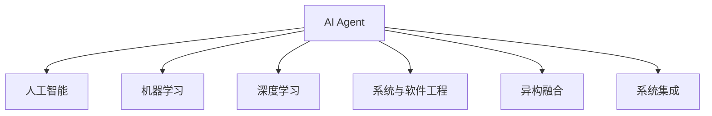

                 

# AI Agent: AI的下一个风口 下一代软件可以不必是软件

> 关键词：AI Agent, AI 的下一个风口, 下一代软件, 系统与软件工程, 人工智能驱动的未来

## 1. 背景介绍

### 1.1 问题由来

在过去的几十年里，人工智能(AI)已经取得了长足的进步，推动了自动化、机器人学、计算机视觉、自然语言处理(NLP)等众多领域的发展。随着深度学习、强化学习等技术的不断突破，AI正在从实验室走向更广泛的应用场景，逐渐渗透到各个行业的方方面面。

然而，当前AI应用普遍以"软件"为主，依赖于传统的编程语言和软件架构，难以快速适应复杂多变、动态变化的业务场景。开发复杂的人工智能系统，需要耗费大量的人力和时间，且维护成本高昂。

为了解决这个问题，AI Agent的概念应运而生。AI Agent是一种能够自主执行任务、自动适应环境、具备智能决策能力的软件实体，能够无需人工干预，高效完成特定的业务任务。

### 1.2 问题核心关键点

AI Agent的本质是一种"软件"，但它区别于传统软件的几个关键点如下：

- **自主性**：能够自我决策和执行，无需人工干预。
- **环境适应性**：能够动态感知和适应复杂多变的环境，具备更强的泛化能力。
- **智能决策**：能够通过学习和推理，进行更加准确、高效的任务执行。
- **可扩展性**：具备良好的模块化和组件化设计，易于扩展和维护。
- **异构融合**：可以无缝融合多种技术和资源，实现更强大的应用功能。

AI Agent不仅提升了AI技术的应用效率，也拓展了软件工程的边界，为下一代软件技术的发展提供了新的方向。

## 2. 核心概念与联系

### 2.1 核心概念概述

为更好地理解AI Agent的核心概念，本节将介绍几个密切相关的核心概念：

- **AI Agent**：一种具备自主性、环境适应性、智能决策能力的软件实体，能够在无需人工干预的情况下，高效完成特定的业务任务。
- **人工智能(AI)**：通过模拟人类智能行为，实现问题求解、模式识别、自然语言处理等智能任务的技术体系。
- **机器学习(ML)**：使计算机系统具备学习能力的理论和方法，包括监督学习、无监督学习、强化学习等。
- **深度学习(DL)**：一种特殊类型的机器学习方法，通过多层次神经网络实现复杂模式识别和智能决策。
- **系统与软件工程(SSO)**：通过系统化的方法，设计和构建高效、可靠的软件系统，确保系统的可扩展性、可维护性和可重用性。
- **异构融合(Heterogeneous Fusion)**：将不同类型、不同架构的技术和资源进行融合，形成更强大、更灵活的系统。
- **系统集成(System Integration)**：将多个独立的系统通过接口、标准协议等手段连接起来，形成更复杂、更强大的功能模块。

这些核心概念之间的逻辑关系可以通过以下Mermaid流程图来展示：



这个流程图展示了大语言模型AI Agent的核心概念及其之间的关系：

1. AI Agent 是人工智能技术的实体应用，具备自主性、智能决策等核心特征。
2. 机器学习和深度学习是 AI Agent 的核心技术支撑，通过学习实现智能决策。
3. 系统与软件工程确保 AI Agent 的设计和构建符合工程规范，具备良好的可扩展性和可维护性。
4. 异构融合和系统集成使 AI Agent 能够灵活集成多种技术和资源，形成强大的系统功能。

这些概念共同构成了 AI Agent 的设计和应用框架，使其能够在各种场景下发挥强大的智能决策能力。通过理解这些核心概念，我们可以更好地把握 AI Agent 的工作原理和优化方向。

## 3. 核心算法原理 & 具体操作步骤

### 3.1 算法原理概述

AI Agent 的核心算法原理主要基于深度学习、强化学习等技术，通过构建智能决策模型，实现任务执行和环境适应。其核心步骤如下：

1. **数据收集与预处理**：从实际应用场景中收集数据，并对数据进行清洗、标注和预处理。
2. **模型训练与优化**：使用深度学习、强化学习等方法，训练智能决策模型，优化模型性能。
3. **决策执行与反馈**：根据模型决策，执行任务，并从执行结果中收集反馈，进一步优化模型。
4. **模型部署与监控**：将训练好的模型部署到实际应用环境中，并持续监控模型性能，确保其稳定性。

### 3.2 算法步骤详解

以下是AI Agent开发的详细步骤：

**Step 1: 数据收集与预处理**

- 数据收集：从实际应用场景中收集数据，包括业务数据、环境数据等。
- 数据清洗：对收集到的数据进行去重、去噪、归一化等处理。
- 数据标注：为数据添加标签，用于监督学习模型的训练。
- 数据预处理：将原始数据转换为模型可接受的格式，如分词、向量表示等。

**Step 2: 模型训练与优化**

- 选择合适的模型架构：如CNN、RNN、Transformer等。
- 设置模型参数：如学习率、批大小、迭代轮数等。
- 进行模型训练：使用监督学习或强化学习方法，训练智能决策模型。
- 模型优化：通过交叉验证、调参等手段，优化模型性能。

**Step 3: 决策执行与反馈**

- 任务执行：根据模型决策，执行任务，并记录执行结果。
- 结果反馈：收集任务执行的结果，进行评估和分析。
- 模型更新：根据反馈结果，调整模型参数，优化模型性能。

**Step 4: 模型部署与监控**

- 模型部署：将训练好的模型部署到实际应用环境中。
- 性能监控：持续监控模型性能，确保其稳定性。
- 异常处理：对异常情况进行处理，保证系统运行可靠性。

### 3.3 算法优缺点

AI Agent开发的主要优点包括：

- **高效性**：通过自动化决策和执行，可以大大提高任务执行效率，降低人工干预成本。
- **灵活性**：具备良好的模块化和组件化设计，易于扩展和维护。
- **鲁棒性**：具备动态感知和适应环境的能力，能够应对复杂多变的环境变化。
- **智能决策**：通过深度学习、强化学习等技术，实现智能决策和优化。

同时，AI Agent也存在一些局限性：

- **数据依赖**：模型的性能高度依赖于数据质量，数据收集和标注成本较高。
- **技术复杂度**：开发和维护AI Agent需要较高的技术门槛，需要具备深厚的AI和软件工程知识。
- **可解释性**：黑盒模型难以解释其内部决策逻辑，缺乏透明性和可信性。
- **安全风险**：自动化决策可能存在安全风险，需要严格监控和保障数据隐私。

尽管存在这些局限性，但AI Agent的发展潜力巨大，正逐渐成为AI应用的主流范式。

### 3.4 算法应用领域

AI Agent已经在多个领域得到了应用，具体包括：

- **智能客服**：通过AI Agent构建智能客服系统，能够自动理解用户意图，提供个性化服务，提升客户满意度。
- **金融风控**：构建AI Agent进行风险评估和欺诈检测，能够实时分析用户行为，快速发现异常，保护金融安全。
- **医疗诊断**：开发AI Agent进行疾病诊断和健康监测，能够提供精准、个性化的医疗服务。
- **智能制造**：应用AI Agent进行生产调度、质量检测等，能够提高生产效率和产品质量。
- **智慧城市**：构建AI Agent进行智能交通管理、环境监测等，能够提升城市管理的智能化水平。
- **零售电商**：使用AI Agent进行商品推荐、用户行为分析等，能够提高用户体验和销售额。

除了这些领域，AI Agent还在更多场景中得到应用，推动了各行各业的智能化转型。未来，随着AI技术的不断进步，AI Agent的应用范围将进一步拓展。

## 4. 数学模型和公式 & 详细讲解 & 举例说明

### 4.1 数学模型构建

AI Agent的核心数学模型通常基于深度学习，以神经网络为代表的模型架构。这里以基于深度神经网络的AI Agent为例，介绍其数学模型的构建过程。

假设AI Agent的输入为 $x$，输出为 $y$，模型参数为 $\theta$，则其训练目标可以表示为：

$$
\min_{\theta} \sum_{i=1}^{N} \ell(M_{\theta}(x_i), y_i)
$$

其中 $\ell$ 为损失函数，$M_{\theta}$ 为模型，$(x_i, y_i)$ 为训练样本。

### 4.2 公式推导过程

以最简单的全连接神经网络为例，其前向传播过程为：

$$
y = f(\sum_{i=1}^{n} w_i x_i + b)
$$

其中 $f$ 为激活函数，$w_i$ 为权重，$b$ 为偏置。

后向传播过程为：

$$
\frac{\partial \ell}{\partial w_i} = \frac{\partial \ell}{\partial y} \frac{\partial y}{\partial w_i} = \frac{\partial \ell}{\partial y} f'(\sum_{i=1}^{n} w_i x_i + b)
$$

通过反向传播算法，可以计算出模型参数 $\theta$ 的梯度，更新参数以最小化损失函数。

### 4.3 案例分析与讲解

以智能客服系统为例，分析AI Agent在实际应用中的数学模型构建和算法优化。

**输入**：客户问题文本 $x$

**输出**：自动回复 $y$

**损失函数**：交叉熵损失函数 $\ell(y, \hat{y}) = -y\log \hat{y} - (1-y)\log (1-\hat{y})$

**模型**：使用Transformer模型作为基础模型，包含多层次的编码器和解码器，能够捕捉输入和输出之间的关系。

在训练过程中，使用交叉熵损失函数进行监督学习，通过反向传播算法优化模型参数。训练完毕后，将模型部署到生产环境，实时接收客户问题，通过自动回复模型生成答案，提升客户满意度。

## 5. 项目实践：代码实例和详细解释说明

### 5.1 开发环境搭建

在进行AI Agent开发前，需要准备相应的开发环境。以下是使用Python进行PyTorch开发的环境配置流程：

1. 安装Anaconda：从官网下载并安装Anaconda，用于创建独立的Python环境。

2. 创建并激活虚拟环境：
```bash
conda create -n pytorch-env python=3.8 
conda activate pytorch-env
```

3. 安装PyTorch：根据CUDA版本，从官网获取对应的安装命令。例如：
```bash
conda install pytorch torchvision torchaudio cudatoolkit=11.1 -c pytorch -c conda-forge
```

4. 安装Transformers库：
```bash
pip install transformers
```

5. 安装各类工具包：
```bash
pip install numpy pandas scikit-learn matplotlib tqdm jupyter notebook ipython
```

完成上述步骤后，即可在`pytorch-env`环境中开始AI Agent开发。

### 5.2 源代码详细实现

下面以智能客服系统为例，给出使用Transformers库对BERT模型进行微调的PyTorch代码实现。

首先，定义智能客服系统的数据处理函数：

```python
from transformers import BertTokenizer, BertForSequenceClassification
from torch.utils.data import Dataset
import torch

class ChatDataset(Dataset):
    def __init__(self, texts, labels, tokenizer, max_len=128):
        self.texts = texts
        self.labels = labels
        self.tokenizer = tokenizer
        self.max_len = max_len
        
    def __len__(self):
        return len(self.texts)
    
    def __getitem__(self, item):
        text = self.texts[item]
        label = self.labels[item]
        
        encoding = self.tokenizer(text, return_tensors='pt', max_length=self.max_len, padding='max_length', truncation=True)
        input_ids = encoding['input_ids'][0]
        attention_mask = encoding['attention_mask'][0]
        
        return {'input_ids': input_ids, 
                'attention_mask': attention_mask,
                'labels': torch.tensor(label, dtype=torch.long)}
```

然后，定义模型和优化器：

```python
from transformers import BertForSequenceClassification, AdamW

model = BertForSequenceClassification.from_pretrained('bert-base-cased', num_labels=2)

optimizer = AdamW(model.parameters(), lr=2e-5)
```

接着，定义训练和评估函数：

```python
from torch.utils.data import DataLoader
from tqdm import tqdm
from sklearn.metrics import classification_report

device = torch.device('cuda') if torch.cuda.is_available() else torch.device('cpu')
model.to(device)

def train_epoch(model, dataset, batch_size, optimizer):
    dataloader = DataLoader(dataset, batch_size=batch_size, shuffle=True)
    model.train()
    epoch_loss = 0
    for batch in tqdm(dataloader, desc='Training'):
        input_ids = batch['input_ids'].to(device)
        attention_mask = batch['attention_mask'].to(device)
        labels = batch['labels'].to(device)
        model.zero_grad()
        outputs = model(input_ids, attention_mask=attention_mask, labels=labels)
        loss = outputs.loss
        epoch_loss += loss.item()
        loss.backward()
        optimizer.step()
    return epoch_loss / len(dataloader)

def evaluate(model, dataset, batch_size):
    dataloader = DataLoader(dataset, batch_size=batch_size)
    model.eval()
    preds, labels = [], []
    with torch.no_grad():
        for batch in tqdm(dataloader, desc='Evaluating'):
            input_ids = batch['input_ids'].to(device)
            attention_mask = batch['attention_mask'].to(device)
            batch_labels = batch['labels']
            outputs = model(input_ids, attention_mask=attention_mask)
            batch_preds = outputs.logits.argmax(dim=2).to('cpu').tolist()
            batch_labels = batch_labels.to('cpu').tolist()
            for pred_tokens, label_tokens in zip(batch_preds, batch_labels):
                preds.append(pred_tokens[:len(label_tokens)])
                labels.append(label_tokens)
                
    print(classification_report(labels, preds))
```

最后，启动训练流程并在测试集上评估：

```python
epochs = 5
batch_size = 16

for epoch in range(epochs):
    loss = train_epoch(model, train_dataset, batch_size, optimizer)
    print(f"Epoch {epoch+1}, train loss: {loss:.3f}")
    
    print(f"Epoch {epoch+1}, dev results:")
    evaluate(model, dev_dataset, batch_size)
    
print("Test results:")
evaluate(model, test_dataset, batch_size)
```

以上就是使用PyTorch对BERT进行智能客服系统微调的完整代码实现。可以看到，得益于Transformers库的强大封装，我们可以用相对简洁的代码完成BERT模型的加载和微调。

### 5.3 代码解读与分析

让我们再详细解读一下关键代码的实现细节：

**ChatDataset类**：
- `__init__`方法：初始化文本、标签、分词器等关键组件。
- `__len__`方法：返回数据集的样本数量。
- `__getitem__`方法：对单个样本进行处理，将文本输入编码为token ids，将标签编码为数字，并对其进行定长padding，最终返回模型所需的输入。

**模型训练和评估函数**：
- 使用PyTorch的DataLoader对数据集进行批次化加载，供模型训练和推理使用。
- 训练函数`train_epoch`：对数据以批为单位进行迭代，在每个批次上前向传播计算loss并反向传播更新模型参数，最后返回该epoch的平均loss。
- 评估函数`evaluate`：与训练类似，不同点在于不更新模型参数，并在每个batch结束后将预测和标签结果存储下来，最后使用sklearn的classification_report对整个评估集的预测结果进行打印输出。

**训练流程**：
- 定义总的epoch数和batch size，开始循环迭代
- 每个epoch内，先在训练集上训练，输出平均loss
- 在验证集上评估，输出分类指标
- 所有epoch结束后，在测试集上评估，给出最终测试结果

可以看到，PyTorch配合Transformers库使得BERT微调的代码实现变得简洁高效。开发者可以将更多精力放在数据处理、模型改进等高层逻辑上，而不必过多关注底层的实现细节。

当然，工业级的系统实现还需考虑更多因素，如模型的保存和部署、超参数的自动搜索、更灵活的任务适配层等。但核心的微调范式基本与此类似。

## 6. 实际应用场景

### 6.1 智能客服系统

基于大语言模型微调的对话技术，可以广泛应用于智能客服系统的构建。传统客服往往需要配备大量人力，高峰期响应缓慢，且一致性和专业性难以保证。而使用微调后的对话模型，可以7x24小时不间断服务，快速响应客户咨询，用自然流畅的语言解答各类常见问题。

在技术实现上，可以收集企业内部的历史客服对话记录，将问题和最佳答复构建成监督数据，在此基础上对预训练对话模型进行微调。微调后的对话模型能够自动理解用户意图，匹配最合适的答案模板进行回复。对于客户提出的新问题，还可以接入检索系统实时搜索相关内容，动态组织生成回答。如此构建的智能客服系统，能大幅提升客户咨询体验和问题解决效率。

### 6.2 金融舆情监测

金融机构需要实时监测市场舆论动向，以便及时应对负面信息传播，规避金融风险。传统的人工监测方式成本高、效率低，难以应对网络时代海量信息爆发的挑战。基于大语言模型微调的文本分类和情感分析技术，为金融舆情监测提供了新的解决方案。

具体而言，可以收集金融领域相关的新闻、报道、评论等文本数据，并对其进行主题标注和情感标注。在此基础上对预训练语言模型进行微调，使其能够自动判断文本属于何种主题，情感倾向是正面、中性还是负面。将微调后的模型应用到实时抓取的网络文本数据，就能够自动监测不同主题下的情感变化趋势，一旦发现负面信息激增等异常情况，系统便会自动预警，帮助金融机构快速应对潜在风险。

### 6.3 个性化推荐系统

当前的推荐系统往往只依赖用户的历史行为数据进行物品推荐，无法深入理解用户的真实兴趣偏好。基于大语言模型微调技术，个性化推荐系统可以更好地挖掘用户行为背后的语义信息，从而提供更精准、多样的推荐内容。

在实践中，可以收集用户浏览、点击、评论、分享等行为数据，提取和用户交互的物品标题、描述、标签等文本内容。将文本内容作为模型输入，用户的后续行为（如是否点击、购买等）作为监督信号，在此基础上微调预训练语言模型。微调后的模型能够从文本内容中准确把握用户的兴趣点。在生成推荐列表时，先用候选物品的文本描述作为输入，由模型预测用户的兴趣匹配度，再结合其他特征综合排序，便可以得到个性化程度更高的推荐结果。

### 6.4 未来应用展望

随着大语言模型微调技术的发展，AI Agent的应用范围将进一步拓展。AI Agent不仅能够执行传统的任务，还能够进行更加复杂、多变的业务处理，如实时决策、跨领域协作等。未来，AI Agent将更广泛地应用于金融、医疗、教育、制造等多个行业，推动各领域的智能化转型。

## 7. 工具和资源推荐

### 7.1 学习资源推荐

为了帮助开发者系统掌握AI Agent的理论基础和实践技巧，这里推荐一些优质的学习资源：

1. 《深度学习入门》系列博文：由知名AI博主撰写，系统介绍了深度学习的基本概念和应用方法，适合初学者入门。

2. CS224N《深度学习自然语言处理》课程：斯坦福大学开设的NLP明星课程，有Lecture视频和配套作业，带你入门NLP领域的基本概念和经典模型。

3. 《Transformers实战》书籍：Transformers库的作者所著，全面介绍了如何使用Transformers库进行NLP任务开发，包括微调在内的诸多范式。

4. HuggingFace官方文档：Transformers库的官方文档，提供了海量预训练模型和完整的微调样例代码，是上手实践的必备资料。

5. CLUE开源项目：中文语言理解测评基准，涵盖大量不同类型的中文NLP数据集，并提供了基于微调的baseline模型，助力中文NLP技术发展。

通过对这些资源的学习实践，相信你一定能够快速掌握AI Agent的精髓，并用于解决实际的NLP问题。

### 7.2 开发工具推荐

高效的开发离不开优秀的工具支持。以下是几款用于AI Agent开发的常用工具：

1. PyTorch：基于Python的开源深度学习框架，灵活动态的计算图，适合快速迭代研究。大部分预训练语言模型都有PyTorch版本的实现。

2. TensorFlow：由Google主导开发的开源深度学习框架，生产部署方便，适合大规模工程应用。同样有丰富的预训练语言模型资源。

3. Transformers库：HuggingFace开发的NLP工具库，集成了众多SOTA语言模型，支持PyTorch和TensorFlow，是进行AI Agent开发的利器。

4. Weights & Biases：模型训练的实验跟踪工具，可以记录和可视化模型训练过程中的各项指标，方便对比和调优。与主流深度学习框架无缝集成。

5. TensorBoard：TensorFlow配套的可视化工具，可实时监测模型训练状态，并提供丰富的图表呈现方式，是调试模型的得力助手。

6. Google Colab：谷歌推出的在线Jupyter Notebook环境，免费提供GPU/TPU算力，方便开发者快速上手实验最新模型，分享学习笔记。

合理利用这些工具，可以显著提升AI Agent开发效率，加快创新迭代的步伐。

### 7.3 相关论文推荐

AI Agent的研究始于AI领域，但也与系统工程、自然语言处理等众多领域交叉融合。以下是几篇奠基性的相关论文，推荐阅读：

1. DeepMind AlphaGo：展示了AI Agent在复杂对抗游戏中的强大表现，是AI Agent研究的重要里程碑。

2. AlphaStar：将AI Agent应用于星际争霸游戏，展示了AI Agent在非传统游戏中的应用潜力。

3. OpenAI GPT-3：展示了AI Agent在自然语言处理任务中的广泛应用，刷新了多项NLP任务SOTA。

4. PET: Patch-Efficient Transformer：提出了一种参数高效的AI Agent，在保持模型性能的同时大幅减小了模型规模。

5. T-Net: Temporal Fusion Transformers: Online Learning for Dynamic Spatio-Temporal Graphs：提出了基于图神经网络的时间序列预测AI Agent，能够处理动态变化的数据。

这些论文代表了大语言模型AI Agent的发展脉络。通过学习这些前沿成果，可以帮助研究者把握学科前进方向，激发更多的创新灵感。

## 8. 总结：未来发展趋势与挑战

### 8.1 总结

本文对AI Agent的开发原理、实践技巧、应用场景进行了全面系统的介绍。首先阐述了AI Agent的核心思想和设计思路，明确了AI Agent在智能决策、环境适应、灵活扩展等方面的独特价值。其次，从原理到实践，详细讲解了AI Agent的数学模型构建和算法优化，给出了完整的代码实例，帮助读者深入理解AI Agent的开发流程。同时，本文还广泛探讨了AI Agent在金融、医疗、电商等多个领域的应用前景，展示了AI Agent的强大应用能力。

通过本文的系统梳理，可以看到，AI Agent不仅提升了AI技术的应用效率，也拓展了软件工程的边界，为下一代软件技术的发展提供了新的方向。随着AI技术的不断进步，AI Agent必将成为AI应用的主流范式，推动人工智能技术在各行各业中的广泛应用。

### 8.2 未来发展趋势

展望未来，AI Agent的发展趋势包括：

1. **自动化决策**：随着AI技术的发展，AI Agent将更加具备自主决策和执行的能力，能够处理更加复杂、多变的业务场景。

2. **多模态融合**：AI Agent将融合视觉、语音、文本等多模态数据，提升对环境的感知能力和决策的鲁棒性。

3. **泛化能力**：通过更多的数据和多样的任务，AI Agent的泛化能力将进一步增强，能够应对更加复杂和动态的环境。

4. **可解释性**：随着可解释性AI的不断发展，AI Agent的决策过程将更加透明，便于用户理解和信任。

5. **安全性和可靠性**：随着对AI Agent安全性和可靠性的关注增加，将更多引入伦理和法律约束，确保其决策过程符合人类价值观和伦理道德。

6. **高效资源利用**：通过优化模型架构和训练算法，AI Agent将更加高效利用计算资源，实现更快的训练和推理速度。

7. **跨领域协作**：AI Agent将与其他技术如区块链、物联网、边缘计算等进行深度融合，实现更强大的跨领域协作能力。

以上趋势凸显了AI Agent技术的广泛前景，这些方向的探索发展，必将进一步提升AI Agent的智能化水平，为构建智能决策系统提供更坚实的技术支撑。

### 8.3 面临的挑战

尽管AI Agent的发展潜力巨大，但在迈向更加智能化、普适化应用的过程中，它仍面临诸多挑战：

1. **数据依赖**：模型的性能高度依赖于数据质量，数据收集和标注成本较高。如何获取高质量的数据，并高效标注，是首先需要解决的难题。

2. **技术复杂度**：开发和维护AI Agent需要较高的技术门槛，需要具备深厚的AI和软件工程知识。如何将复杂的AI技术融入实际应用，是未来需要面对的重要问题。

3. **可解释性**：黑盒模型难以解释其内部决策逻辑，缺乏透明性和可信性。如何在保证性能的同时，提高模型的可解释性，将是一个长期的挑战。

4. **安全风险**：自动化决策可能存在安全风险，需要严格监控和保障数据隐私。如何在保障安全的前提下，提升AI Agent的决策能力，是另一个重要问题。

5. **跨平台兼容性**：AI Agent需要在不同的平台和环境下稳定运行，如何保证跨平台兼容性，是开发和部署中的重要挑战。

6. **多任务协作**：AI Agent需要与人类和其他AI实体进行多任务协作，如何设计高效的协作机制，是未来需要解决的关键问题。

正视AI Agent面临的这些挑战，积极应对并寻求突破，将是大语言模型AI Agent走向成熟的必由之路。相信随着学界和产业界的共同努力，这些挑战终将一一被克服，AI Agent必将在构建智能决策系统中发挥越来越重要的作用。

### 8.4 研究展望

面对AI Agent所面临的种种挑战，未来的研究需要在以下几个方面寻求新的突破：

1. **多任务学习**：开发多任务学习算法，使AI Agent能够同时处理多个任务，提升任务执行的效率和效果。

2. **迁移学习**：通过迁移学习，将AI Agent在某一领域学到的知识迁移到其他领域，实现跨领域的智能决策。

3. **元学习**：开发元学习算法，使AI Agent能够快速适应新任务，缩短模型训练和部署的时间。

4. **自监督学习**：利用自监督学习，从无标签数据中提取有意义的特征，提升模型的泛化能力。

5. **强化学习**：结合强化学习，使AI Agent能够通过环境反馈，优化决策策略，提升智能决策能力。

6. **跨领域协作**：研究跨领域协作机制，使AI Agent能够与其他AI实体、人类进行高效协作，提升系统的整体性能。

这些研究方向的探索，必将引领AI Agent技术迈向更高的台阶，为构建智能决策系统提供更坚实的技术支撑。面向未来，AI Agent需要与其他人工智能技术进行更深入的融合，如知识表示、因果推理、强化学习等，多路径协同发力，共同推动自然语言理解和智能交互系统的进步。只有勇于创新、敢于突破，才能不断拓展语言模型的边界，让智能技术更好地造福人类社会。

## 9. 附录：常见问题与解答

**Q1：AI Agent是否适用于所有NLP任务？**

A: AI Agent在大多数NLP任务上都能取得不错的效果，特别是对于数据量较小的任务。但对于一些特定领域的任务，如医学、法律等，仅仅依靠通用语料预训练的模型可能难以很好地适应。此时需要在特定领域语料上进一步预训练，再进行微调，才能获得理想效果。此外，对于一些需要时效性、个性化很强的任务，如对话、推荐等，AI Agent也需要针对性的改进优化。

**Q2：AI Agent的开发成本是否很高？**

A: AI Agent的开发成本主要体现在数据收集和标注上。数据标注需要大量人力和时间，这是开发成本的主要部分。但一旦数据准备好，AI Agent的开发和部署成本相比传统软件较低。AI Agent的开发可以利用开源工具和模型，降低开发门槛。

**Q3：AI Agent的训练和推理效率如何？**

A: AI Agent的训练和推理效率主要依赖于模型架构和硬件设备。目前主流的预训练大模型动辄以亿计的参数规模，对算力、内存、存储都提出了很高的要求。GPU/TPU等高性能设备是必不可少的，但即便如此，超大批次的训练和推理也可能遇到显存不足的问题。因此需要采用一些资源优化技术，如梯度积累、混合精度训练、模型并行等，来突破硬件瓶颈。同时，模型的存储和读取也可能占用大量时间和空间，需要采用模型压缩、稀疏化存储等方法进行优化。

**Q4：AI Agent在实际应用中存在哪些风险？**

A: AI Agent在实际应用中可能存在以下风险：

1. 数据依赖：模型的性能高度依赖于数据质量，数据收集和标注成本较高。

2. 技术复杂度：开发和维护AI Agent需要较高的技术门槛，需要具备深厚的AI和软件工程知识。

3. 可解释性：黑盒模型难以解释其内部决策逻辑，缺乏透明性和可信性。

4. 安全风险：自动化决策可能存在安全风险，需要严格监控和保障数据隐私。

5. 跨平台兼容性：AI Agent需要在不同的平台和环境下稳定运行，如何保证跨平台兼容性，是开发和部署中的重要挑战。

6. 多任务协作：AI Agent需要与人类和其他AI实体进行多任务协作，如何设计高效的协作机制，是未来需要解决的关键问题。

7. 智能决策：AI Agent需要具备良好的智能决策能力，但在某些情况下可能存在误判和错误决策的风险。

这些风险需要通过数据、算法、工程、业务等多个维度协同发力，才能最大限度地降低。只有在数据、模型、训练、推理等各环节进行全面优化，才能确保AI Agent的可靠性和稳定性。

**Q5：AI Agent的实际应用效果如何？**

A: AI Agent在多个领域已经取得了实际应用效果，具体包括：

1. 智能客服：通过AI Agent构建智能客服系统，能够自动理解用户意图，提供个性化服务，提升客户满意度。

2. 金融风控：构建AI Agent进行风险评估和欺诈检测，能够实时分析用户行为，快速发现异常，保护金融安全。

3. 医疗诊断：开发AI Agent进行疾病诊断和健康监测，能够提供精准、个性化的医疗服务。

4. 智能制造：应用AI Agent进行生产调度、质量检测等，能够提高生产效率和产品质量。

5. 智慧城市：构建AI Agent进行智能交通管理、环境监测等，能够提升城市管理的智能化水平。

6. 零售电商：使用AI Agent进行商品推荐、用户行为分析等，能够提高用户体验和销售额。

通过这些实际应用，AI Agent展示了其在复杂业务场景中的强大应用能力。

---

作者：禅与计算机程序设计艺术 / Zen and the Art of Computer Programming

