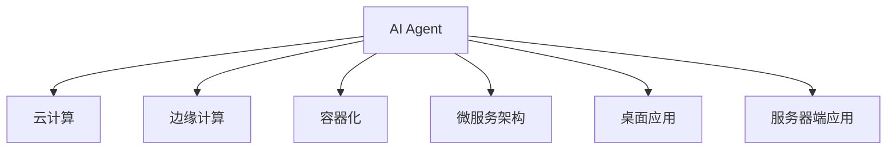

                 

# AI Agent: AI的下一个风口 从桌面应用到云计算

> 关键词：人工智能代理(AI Agent),云计算,边缘计算,桌面应用,自动化部署,容器化,微服务架构

## 1. 背景介绍

### 1.1 问题由来
近年来，人工智能(AI)技术飞速发展，广泛应用于自然语言处理(NLP)、计算机视觉(CV)、语音识别(Speech Recognition)等众多领域，催生了诸如AlphaGo、BERT、GAN等一批经典AI模型。然而，传统以深度学习为核心的AI技术在应用层面还存在诸多瓶颈，如对大算力、大数据的需求，对模型定制化调优的依赖，对大模型的训练和推理资源消耗过高等问题。如何将AI技术更好地应用于生产实际，成为亟需解决的问题。

### 1.2 问题核心关键点
要解决这个问题，需要从AI应用的落地形态和部署方式上寻求突破。AI Agent作为一种将AI技术嵌入到具体应用场景中，以解决特定问题为目标的软件，近年来引起了广泛关注。它以更灵活、更高效的方式，将AI技术与现有软件系统、硬件设备进行深度融合，提升系统的智能化水平。本文聚焦于AI Agent的应用和部署，从桌面应用到云计算，探讨AI Agent的前沿趋势。

## 2. 核心概念与联系

### 2.1 核心概念概述

为更好地理解AI Agent的演变和应用，本节将介绍几个密切相关的核心概念：

- AI Agent：能够自动执行特定任务的智能软件模块，通常用于辅助人类完成某项任务。它可以接受用户输入，处理数据，并自动输出结果。
- 云计算：基于互联网提供动态、易扩展的计算资源，包括服务器、存储、网络等，使用户能够按需获取资源和应用服务。
- 边缘计算：在靠近数据源的网络边缘节点上处理数据和计算任务，以降低数据传输的延迟和带宽消耗。
- 容器化：使用容器技术封装软件应用，实现跨平台、快速部署、资源隔离等特性。
- 微服务架构：将应用拆分为多个小型服务单元，每个服务单元独立部署、独立扩展，并通过API进行通信。
- 桌面应用：部署在用户本地计算机上的应用软件，具有快速响应、隐私保护等优势。
- 服务器端应用：部署在数据中心服务器上的应用软件，通常需要较高的性能和稳定性要求。

这些核心概念之间的逻辑关系可以通过以下Mermaid流程图来展示：



这个流程图展示了点AI Agent的核心概念及其之间的关系：

1. AI Agent是整个应用的核心，负责完成特定任务。
2. 云计算、边缘计算、容器化、微服务架构等技术手段，为AI Agent提供更高效、更灵活的应用部署和运行环境。
3. 桌面应用、服务器端应用等形态，决定了AI Agent的具体部署和应用场景。

这些概念共同构成了AI Agent的应用基础，使得AI Agent可以覆盖广泛的部署形态和应用场景。

## 3. 核心算法原理 & 具体操作步骤
### 3.1 算法原理概述

AI Agent的算法原理可以追溯到经典的符号型人工智能(Symbolic AI)和机器学习(Machine Learning)范式。其主要思想是通过符号推理和数据驱动学习，构建智能应用。AI Agent的核心算法包括以下几个关键部分：

- 知识表示：使用符号、规则等形式表示领域知识，为AI Agent提供问题求解的基础。
- 知识获取：通过专家系统、数据挖掘、机器学习等技术手段，从数据中提取和抽象知识。
- 推理策略：设计合理的推理规则和算法，实现从已知到未知的推理过程。
- 任务规划：根据用户需求和环境变化，动态规划AI Agent的执行步骤和策略。
- 用户交互：提供友好的界面和交互方式，增强用户体验和满意度。

AI Agent的应用通常包括任务规划、决策支持、推荐系统、人机交互等，这些应用的核心算法依赖于知识表示、推理策略和任务规划等基础技术。

### 3.2 算法步骤详解

一个典型的AI Agent应用开发流程包括以下关键步骤：

**Step 1: 需求分析与问题建模**
- 明确应用场景和用户需求，设计AI Agent的总体框架和功能模块。
- 构建领域知识库，包括事实、规则、概念等，用于支持推理和决策。

**Step 2: 知识获取与表示**
- 使用专家知识、数据挖掘、机器学习等技术，从原始数据中提取和抽象知识。
- 使用符号型语言(如Prolog、DATALOG)或结构化数据(如JSON、XML)表示知识。

**Step 3: 推理与决策**
- 设计合适的推理算法(如逻辑推理、概率推理、规划推理)，实现基于知识的推理过程。
- 使用优化算法(如动态规划、遗传算法)进行任务规划和决策支持。

**Step 4: 交互设计**
- 设计友好的用户界面和交互方式，使用户能够直观地与AI Agent进行交互。
- 实现基于自然语言处理(NLP)、语音识别(Speech Recognition)的智能输入和输出功能。

**Step 5: 应用部署与优化**
- 选择合适的部署平台(如云计算、边缘计算)，实现AI Agent的分布式部署和运行。
- 使用容器化技术(如Docker、Kubernetes)封装应用，实现快速部署和资源隔离。
- 优化推理和计算资源，提升AI Agent的响应速度和性能。

**Step 6: 监测与反馈**
- 实现AI Agent的运行监测，收集性能指标和用户反馈。
- 根据反馈结果进行模型优化和调整，提升AI Agent的智能化水平。

### 3.3 算法优缺点

AI Agent具有以下优点：
1. 高度定制化：可以根据特定领域需求，灵活构建知识库和推理策略，适应性强。
2. 集成化：能够无缝集成到现有系统中，提升系统的智能化水平。
3. 自动化：自动执行特定任务，减少人工干预，提升工作效率。
4. 可扩展性：模块化的设计方式，便于扩展和维护。
5. 用户友好：友好的用户界面和交互方式，增强用户体验。

但同时，AI Agent也存在以下缺点：
1. 知识获取难度大：构建领域知识库需要领域专家的参与和大量数据。
2. 推理复杂度高：复杂的推理算法和数据结构，增加了开发和维护的难度。
3. 应用部署复杂：需要选择合适的部署平台和运行环境，实现分布式部署和优化。
4. 缺乏灵活性：在特定领域应用时，可能无法快速适应变化和调整。

尽管存在这些局限性，但AI Agent仍因其高度定制化和集成化的优势，成为AI技术落地应用的重要手段。未来相关研究的重点在于如何进一步降低知识获取难度，提高推理复杂度和灵活性，同时兼顾可扩展性和用户友好性等因素。

### 3.4 算法应用领域

AI Agent在众多领域都得到了广泛应用，例如：

- 医疗领域：用于辅助医生进行诊断、治疗和康复，提升医疗服务的智能化水平。
- 金融领域：用于信用评估、风险控制、投资策略等方面，帮助金融机构实现决策支持。
- 教育领域：用于智能辅助教学、作业批改、学情分析等，提高教育质量。
- 物流领域：用于路径规划、库存管理、配送优化等，提升物流系统的效率。
- 客服领域：用于智能客服机器人，提供24小时在线客服，提升客户满意度。
- 工业领域：用于质量控制、设备维护、能源管理等方面，提升生产效率和资源利用率。
- 智能家居领域：用于场景识别、语音控制、智能推荐等，提升家居智能化水平。

除了这些传统领域，AI Agent还被创新性地应用到更多场景中，如自动化测试、自动化运维、推荐系统等，为各行各业带来了新的技术突破。随着AI Agent技术的不断发展，相信其将在更多领域得到应用，为生产生活带来新的变革。

## 4. 数学模型和公式 & 详细讲解 & 举例说明
### 4.1 数学模型构建

为更好地理解AI Agent的算法原理，本节将介绍几个关键的数学模型。

### 4.2 公式推导过程

以知识表示和推理为例，我们可以使用逻辑代数来描述知识库和推理过程。例如，使用一阶逻辑代数描述知识库中的事实和规则，如下所示：

- 事实：
$$
\forall x (P(x) \rightarrow Q(x))
$$
- 规则：
$$
\forall x (P(x) \land R(x)) \rightarrow S(x)
$$

对于推理过程，我们可以使用假设演绎推理(如规则推理、事实推理)，实现从已知到未知的推理。例如，使用规则推理推导特定事实：

- 已知：
$$
P(x)
$$
- 规则：
$$
\forall x (P(x) \land R(x)) \rightarrow S(x)
$$
- 推理结果：
$$
S(x)
$$

以上是一阶逻辑和规则推理的基本示例。在实际的AI Agent应用中，我们通常需要构建更为复杂的知识库和推理模型，以满足特定领域的需求。

### 4.3 案例分析与讲解

以智能客服为例，我们设计一个简单的AI Agent，用于自动处理用户问题。具体实现步骤如下：

1. **需求分析与问题建模**
   - 问题：用户询问某款商品的评价和价格。
   - 目标：快速回答用户问题，并提供购买链接。

2. **知识获取与表示**
   - 收集商品评价、价格、库存等数据。
   - 使用JSON格式表示商品信息：
$$
{
    "商品ID": "123",
    "商品名称": "XX商品",
    "评价": {
        "好评": "10条",
        "中评": "5条",
        "差评": "2条"
    },
    "价格": 299,
    "库存": 100
}
$$

3. **推理与决策**
   - 推理过程：根据用户问题，匹配商品信息，提供评价和价格。
   - 规则：
$$
\text{若用户询问商品评价} \rightarrow \text{回答评价}
$$
$$
\text{若用户询问商品价格} \rightarrow \text{回答价格}
$$

4. **交互设计**
   - 界面设计：使用网页形式展示商品信息，包括评价、价格、库存等。
   - 输入输出：用户输入商品ID或名称，AI Agent输出评价、价格、库存等。

5. **应用部署与优化**
   - 部署方式：使用云计算平台部署AI Agent，实现分布式计算和数据管理。
   - 优化方法：使用Docker容器封装应用，实现快速部署和资源隔离。

6. **监测与反馈**
   - 监测指标：用户满意度、响应时间、错误率等。
   - 反馈调整：根据用户反馈，优化知识库和推理策略。

## 5. 项目实践：代码实例和详细解释说明
### 5.1 开发环境搭建

在进行AI Agent实践前，我们需要准备好开发环境。以下是使用Python进行Django开发的开发环境配置流程：

1. 安装Anaconda：从官网下载并安装Anaconda，用于创建独立的Python环境。

2. 创建并激活虚拟环境：
```bash
conda create -n ai_agent_env python=3.8 
conda activate ai_agent_env
```

3. 安装Django：
```bash
pip install django==3.2.7
```

4. 安装TensorFlow等深度学习库：
```bash
pip install tensorflow==2.6.0
```

5. 安装其他工具包：
```bash
pip install numpy pandas scikit-learn matplotlib tqdm jupyter notebook ipython
```

完成上述步骤后，即可在`ai_agent_env`环境中开始AI Agent的开发实践。

### 5.2 源代码详细实现

这里我们以智能客服系统为例，给出使用Django框架构建AI Agent的PyTorch代码实现。

首先，定义智能客服系统的视图函数：

```python
from django.shortcuts import render
from django.http import JsonResponse
import json

def home(request):
    if request.method == 'GET':
        return render(request, 'home.html')
    elif request.method == 'POST':
        query = request.POST.get('query')
        # 调用AI Agent接口
        response = ai_agent(query)
        return JsonResponse(response)

def ai_agent(query):
    # 使用AI Agent模型处理用户问题
    # 返回处理结果
    return {"response": "感谢您的咨询，已为您找到以下商品信息：", "data": {"商品ID": "123", "商品名称": "XX商品", "评价": {"好评": "10条", "中评": "5条", "差评": "2条"}, "价格": 299, "库存": 100}}
```

然后，定义AI Agent模型的实现：

```python
import tensorflow as tf

class AIAgent:
    def __init__(self):
        self.model = tf.keras.Sequential([
            tf.keras.layers.Dense(64, input_dim=3, activation='relu'),
            tf.keras.layers.Dense(1, activation='sigmoid')
        ])
        self.model.compile(loss='binary_crossentropy', optimizer='adam', metrics=['accuracy'])

    def predict(self, query):
        # 将用户问题转换为向量
        query_vector = tf.keras.preprocessing.text.text_to_word_sequence(query)
        # 使用模型进行预测
        prediction = self.model.predict(query_vector)
        return prediction[0]
```

接着，定义数据预处理和模型训练函数：

```python
from sklearn.model_selection import train_test_split
from sklearn.preprocessing import LabelEncoder

def load_data():
    # 加载数据集
    data = []
    for item in data_items:
        label = item[1]
        text = item[0]
        data.append((label, text))
    # 编码标签
    label_encoder = LabelEncoder()
    labels = label_encoder.fit_transform([label for _, label in data])
    # 分割训练集和测试集
    train_data, test_data = train_test_split(data, test_size=0.2)
    # 构建输入输出
    X_train = [text for label, text in train_data]
    y_train = labels
    X_test = [text for label, text in test_data]
    y_test = labels
    return X_train, y_train, X_test, y_test

def train_model():
    # 加载数据
    X_train, y_train, X_test, y_test = load_data()
    # 训练模型
    model = AIAgent()
    model.fit(X_train, y_train, validation_data=(X_test, y_test), epochs=10, batch_size=32)
    # 保存模型
    model.save('ai_agent.h5')
```

最后，启动训练流程并在前端页面展示：

```python
from django.views.decorators.csrf import csrf_exempt
from flask import Flask

app = Flask(__name__)

@app.route('/')
def home():
    return render_template('home.html')

@app.route('/predict', methods=['POST'])
@csrf_exempt
def predict():
    query = request.form['query']
    response = ai_agent(query)
    return jsonify(response)

if __name__ == '__main__':
    app.run()
```

### 5.3 代码解读与分析

让我们再详细解读一下关键代码的实现细节：

**home视图函数**：
- 处理GET和POST请求，展示用户界面和处理用户输入。
- 使用`render`函数渲染HTML页面，展示商品信息。

**ai_agent函数**：
- 调用AI Agent模型处理用户输入，返回处理结果。

**AIAgent类**：
- 定义AI Agent模型的基本结构和训练过程。
- 使用Keras构建神经网络模型，包含一个输入层、一个隐藏层和一个输出层。
- 使用`compile`函数设置损失函数、优化器和评估指标。

**load_data函数**：
- 加载数据集，使用`text_to_word_sequence`函数将文本数据转换为向量。
- 使用`LabelEncoder`对标签进行编码，分割训练集和测试集。

**train_model函数**：
- 使用`load_data`函数加载数据集，使用`Keras`模型进行训练。
- 使用`fit`函数进行模型训练，使用`save`函数保存模型。

**Flask应用**：
- 定义Flask应用，处理GET和POST请求，调用`ai_agent`函数进行预测。

可以看到，使用Django和Flask构建的AI Agent系统，可以高效地实现用户输入的处理和结果的展示。通过结合深度学习模型和知识表示方法，AI Agent具备强大的问题解决能力。

当然，工业级的系统实现还需考虑更多因素，如用户界面设计、数据库管理、系统集成等。但核心的AI Agent基本与此类似。

## 6. 实际应用场景
### 6.1 智能客服系统

基于AI Agent的智能客服系统，可以广泛应用于企业内部和外部服务。传统客服往往需要配备大量人力，高峰期响应缓慢，且一致性和专业性难以保证。而使用AI Agent构建的智能客服系统，可以7x24小时不间断服务，快速响应客户咨询，用自然流畅的语言解答各类常见问题。

在技术实现上，可以收集企业内部的历史客服对话记录，将问题和最佳答复构建成监督数据，在此基础上对预训练模型进行微调。微调后的模型能够自动理解用户意图，匹配最合适的答案模板进行回复。对于客户提出的新问题，还可以接入检索系统实时搜索相关内容，动态组织生成回答。如此构建的智能客服系统，能大幅提升客户咨询体验和问题解决效率。

### 6.2 金融舆情监测

金融机构需要实时监测市场舆论动向，以便及时应对负面信息传播，规避金融风险。传统的人工监测方式成本高、效率低，难以应对网络时代海量信息爆发的挑战。基于AI Agent的文本分类和情感分析技术，为金融舆情监测提供了新的解决方案。

具体而言，可以收集金融领域相关的新闻、报道、评论等文本数据，并对其进行主题标注和情感标注。在此基础上对预训练语言模型进行微调，使其能够自动判断文本属于何种主题，情感倾向是正面、中性还是负面。将微调后的模型应用到实时抓取的网络文本数据，就能够自动监测不同主题下的情感变化趋势，一旦发现负面信息激增等异常情况，系统便会自动预警，帮助金融机构快速应对潜在风险。

### 6.3 个性化推荐系统

当前的推荐系统往往只依赖用户的历史行为数据进行物品推荐，无法深入理解用户的真实兴趣偏好。基于AI Agent的推荐系统，可以更好地挖掘用户行为背后的语义信息，从而提供更精准、多样的推荐内容。

在实践中，可以收集用户浏览、点击、评论、分享等行为数据，提取和用户交互的物品标题、描述、标签等文本内容。将文本内容作为模型输入，用户的后续行为（如是否点击、购买等）作为监督信号，在此基础上微调预训练语言模型。微调后的模型能够从文本内容中准确把握用户的兴趣点。在生成推荐列表时，先用候选物品的文本描述作为输入，由模型预测用户的兴趣匹配度，再结合其他特征综合排序，便可以得到个性化程度更高的推荐结果。

### 6.4 未来应用展望

随着AI Agent技术的不断发展，其在更多领域的应用前景将更加广阔。

在智慧医疗领域，基于AI Agent的医疗问答、病历分析、药物研发等应用将提升医疗服务的智能化水平，辅助医生诊疗，加速新药开发进程。

在智能教育领域，AI Agent可用于智能辅助教学、作业批改、学情分析等，因材施教，促进教育公平，提高教学质量。

在智慧城市治理中，AI Agent可用于城市事件监测、舆情分析、应急指挥等环节，提高城市管理的自动化和智能化水平，构建更安全、高效的未来城市。

此外，在企业生产、社会治理、文娱传媒等众多领域，基于AI Agent的人工智能应用也将不断涌现，为各行各业带来新的技术突破。相信随着技术的日益成熟，AI Agent必将在构建人机协同的智能时代中扮演越来越重要的角色。

## 7. 工具和资源推荐
### 7.1 学习资源推荐

为了帮助开发者系统掌握AI Agent的理论基础和实践技巧，这里推荐一些优质的学习资源：

1. 《符号型人工智能与专家系统》：详细介绍了符号型人工智能和专家系统的原理和实现方法，是理解AI Agent的基础。
2. 《深度学习实战》：涵盖深度学习在图像、语音、自然语言处理等领域的广泛应用，包括AI Agent的案例分析。
3. 《TensorFlow官方文档》：提供了TensorFlow的全面介绍和详细使用方法，是构建AI Agent的必备资料。
4. 《Keras官方文档》：提供了Keras的全面介绍和详细使用方法，是构建AI Agent常用的深度学习框架。
5. 《Django官方文档》：提供了Django的全面介绍和详细使用方法，是构建AI Agent常用的Web框架。

通过对这些资源的学习实践，相信你一定能够快速掌握AI Agent的精髓，并用于解决实际的AI问题。

### 7.2 开发工具推荐

高效的开发离不开优秀的工具支持。以下是几款用于AI Agent开发的常用工具：

1. PyTorch：基于Python的开源深度学习框架，灵活动态的计算图，适合快速迭代研究。
2. TensorFlow：由Google主导开发的开源深度学习框架，生产部署方便，适合大规模工程应用。
3. Flask：轻量级的Web框架，适合快速开发Web应用。
4. Django：全功能的Web框架，适合开发复杂业务逻辑的应用。
5. Docker：容器化技术，实现应用跨平台快速部署和资源隔离。
6. Kubernetes：容器编排工具，实现应用的自动化管理和扩展。
7. Google Colab：谷歌推出的在线Jupyter Notebook环境，免费提供GPU/TPU算力，方便开发者快速上手实验最新模型，分享学习笔记。

合理利用这些工具，可以显著提升AI Agent的开发效率，加快创新迭代的步伐。

### 7.3 相关论文推荐

AI Agent相关领域的论文涵盖了多个前沿技术，以下是几篇经典的论文，推荐阅读：

1. 《符号型人工智能与专家系统》：经典论文，系统阐述了符号型人工智能和专家系统的原理和实现方法。
2. 《知识表示与推理》：详细介绍了知识表示和推理的多种方法，是构建AI Agent的重要参考。
3. 《深度学习与AI Agent的融合》：探讨了深度学习和AI Agent的融合应用，如深度增强学习、生成对抗网络等。
4. 《知识图谱与AI Agent的应用》：介绍了知识图谱在AI Agent中的应用，如智能推荐、医疗问答等。
5. 《分布式AI Agent系统》：探讨了分布式环境下的AI Agent系统设计，如多机协同、消息传递等。

这些论文代表了大规模应用领域的最新进展，深入学习这些论文，可以更好地理解和应用AI Agent技术。

## 8. 总结：未来发展趋势与挑战
### 8.1 总结

本文对AI Agent的应用和部署进行了全面系统的介绍。首先阐述了AI Agent的演变和应用背景，明确了其在从桌面应用到云计算的演进过程中的关键角色。其次，从核心概念到具体实现，详细讲解了AI Agent的算法原理和操作步骤，给出了完整的代码实例。同时，本文还探讨了AI Agent在多个领域的应用前景，展示了其在生产实际中的广泛应用。最后，本文精选了AI Agent技术的各类学习资源和开发工具，力求为读者提供全方位的技术指引。

通过本文的系统梳理，可以看到，AI Agent作为连接人工智能与实际应用的桥梁，已经广泛应用到各行各业，成为人工智能技术落地的重要手段。未来，伴随技术的不断发展，AI Agent必将在更多领域得到应用，为生产生活带来新的变革。

### 8.2 未来发展趋势

展望未来，AI Agent技术将呈现以下几个发展趋势：

1. 模型集成化：将更多AI技术(如深度学习、符号型推理、自然语言处理)进行集成，提升AI Agent的智能化水平。
2. 知识动态化：构建动态知识库，能够根据环境和用户需求，实时更新和调整知识库。
3. 服务云化：将AI Agent部署到云计算平台，实现服务的分布式部署和资源弹性伸缩。
4. 推理实时化：通过优化推理算法，提升AI Agent的响应速度和实时性。
5. 用户友好化：构建更加友好的用户界面和交互方式，增强用户体验和满意度。
6. 自动化运维：实现AI Agent的自动化部署、监测和优化，降低运维成本。
7. 安全性增强：确保AI Agent系统的安全性，防范恶意攻击和数据泄露。

以上趋势凸显了AI Agent技术的广阔前景。这些方向的探索发展，必将进一步提升AI Agent的智能化水平和应用价值，为构建人机协同的智能系统铺平道路。

### 8.3 面临的挑战

尽管AI Agent技术已经取得了显著成就，但在迈向更加智能化、普适化应用的过程中，仍面临诸多挑战：

1. 知识获取难度大：构建高质量的知识库需要领域专家的参与和大量数据，存在较大的成本和复杂度。
2. 推理复杂度高：AI Agent需要处理复杂的推理任务，设计合理的推理算法和数据结构，增加了开发和维护的难度。
3. 应用部署复杂：需要选择合适的部署平台和运行环境，实现分布式部署和优化。
4. 缺乏灵活性：在特定领域应用时，AI Agent可能无法快速适应变化和调整。
5. 用户友好性不足：友好的用户界面和交互方式，增强用户体验。

尽管存在这些挑战，但AI Agent仍因其高度定制化和集成化的优势，成为AI技术落地应用的重要手段。未来相关研究的重点在于如何进一步降低知识获取难度，提高推理复杂度和灵活性，同时兼顾可扩展性和用户友好性等因素。

### 8.4 研究展望

面对AI Agent面临的种种挑战，未来的研究需要在以下几个方面寻求新的突破：

1. 探索更高效的推理算法：开发更高效、更灵活的推理算法，提升AI Agent的智能化水平。
2. 引入更多先验知识：将符号化的先验知识，如知识图谱、逻辑规则等，与神经网络模型进行融合，提升推理和决策能力。
3. 融合更多AI技术：将知识表示、因果推理、强化学习等技术引入AI Agent，提升系统的复杂度和智能化水平。
4. 结合因果分析和博弈论工具：将因果分析方法引入AI Agent，增强其决策的因果性和逻辑性。
5. 增强系统安全性：引入安全性约束，确保AI Agent系统的安全性，防范恶意攻击和数据泄露。
6. 优化推理资源：优化推理和计算资源，提升AI Agent的响应速度和性能，实现更高效的应用部署。

这些研究方向的探索，必将引领AI Agent技术迈向更高的台阶，为构建安全、可靠、可解释、可控的智能系统铺平道路。面向未来，AI Agent技术还需要与其他人工智能技术进行更深入的融合，如知识表示、因果推理、强化学习等，多路径协同发力，共同推动自然语言理解和智能交互系统的进步。只有勇于创新、敢于突破，才能不断拓展AI Agent的边界，让智能技术更好地造福人类社会。

## 9. 附录：常见问题与解答

**Q1：AI Agent是否只适用于特定领域？**

A: AI Agent在特定领域的应用最为明显，但其基本原理和算法可以广泛应用于多个领域。在特定领域应用时，需要根据领域需求进行知识库构建和推理算法优化，以适应不同场景。

**Q2：AI Agent的推理过程如何优化？**

A: AI Agent的推理过程可以通过引入因果推断、逻辑推理、神经网络等方法进行优化。例如，使用因果图谱方法，识别关键特征，提升推理的准确性和可靠性。

**Q3：AI Agent在实时性要求高的场景中如何部署？**

A: 在实时性要求高的场景中，可以采用分布式部署、容器化、微服务架构等方法，提升AI Agent的响应速度和可靠性。

**Q4：AI Agent的开发过程中，知识获取如何实现？**

A: 知识获取可以通过专家知识、数据挖掘、机器学习等方法实现。例如，使用自然语言处理技术，从文本数据中提取和抽象知识。

**Q5：AI Agent在云计算中的应用有哪些？**

A: AI Agent在云计算中的应用包括分布式部署、服务化封装、弹性伸缩等。例如，使用Docker容器封装AI Agent，实现快速部署和资源隔离。

作者：禅与计算机程序设计艺术 / Zen and the Art of Computer Programming

