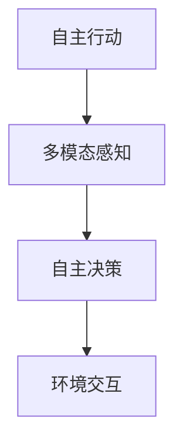

                 

# AI Agent: AI的下一个风口 具身智能研究的挑战与机遇

> 关键词：具身智能,自主机器人,类人交互,行动空间学习,强化学习,行动学习,逆向学习,自然语言处理(NLP)

## 1. 背景介绍

### 1.1 问题由来
在过去的十年间，人工智能(AI)领域取得了显著的进步，尤其是深度学习模型的发展，使得AI在计算机视觉、自然语言处理等领域达到了前所未有的高度。然而，在AI应用中，机器人、智能系统等具身智能体（AI Agents）的表现仍然落后于非具身智能体（如深度学习模型）。这一差距主要源于具身智能体的行动空间复杂性和多模态感知能力，使得传统的机器学习方法和算法难以直接应用于具身智能体的研究和开发。

为了克服这一挑战，近年来，具身智能体研究成为了AI领域的新风口。具身智能体（AI Agents）不仅拥有传统深度学习模型的强大计算能力，还具备行动能力和环境感知能力，能够在复杂多变的真实环境中自主执行任务。这一研究方向的突破，有望开辟AI的新应用场景，推动AI技术在实际场景中的应用和普及。

### 1.2 问题核心关键点
具身智能研究的核心在于构建能够自主行动、与环境互动的AI智能体。具体而言，具身智能体需要在真实的行动空间中，通过与环境的互动学习，掌握环境动态和行为规则，最终实现自主决策和执行任务。这一过程涉及复杂的感知、行动和决策过程，是当前AI研究的重要挑战之一。

1. **自主行动**：智能体需要在真实的物理环境中执行任务，如行走、搬运、拾取等，这要求智能体具备高度精确的行动控制能力和环境感知能力。
2. **多模态感知**：智能体需要同时处理视觉、触觉、听觉等多模态信息，构建对环境的全面感知。
3. **自主决策**：智能体需要在复杂多变的环境中，基于感知信息进行自主决策，选择合适的行动策略。
4. **环境交互**：智能体需要能够与环境和其他智能体进行自然的互动，实现协作和协同。

## 2. 核心概念与联系

### 2.1 核心概念概述

为了深入理解具身智能体的构建过程，本节将介绍几个核心概念，包括自主行动、多模态感知、自主决策和环境交互，并解释它们之间的联系。

- **自主行动**：指AI智能体在物理世界中执行任务的能力，如移动、抓取、搬运等。这是具身智能体的核心功能之一。
- **多模态感知**：指智能体同时处理视觉、触觉、听觉等不同模态信息，构建对环境的全面感知。
- **自主决策**：指智能体在动态变化的环境中，基于感知信息进行自主决策，选择合适的行动策略。
- **环境交互**：指智能体与环境和其他智能体进行自然的互动，实现协作和协同。

这些核心概念之间的逻辑关系可以通过以下Mermaid流程图来展示：



这个流程图展示了我们如何通过不同的环节构建一个具身智能体：首先通过多模态感知获取环境信息，然后基于这些信息进行自主决策，最后通过环境交互执行决策结果。这些环节相互联系，共同构成了具身智能体的全貌。

### 2.2 核心概念原理和架构

#### 2.2.1 自主行动
自主行动的核心在于构建精确的行动控制系统，使得智能体能够在真实的物理环境中执行任务。这一过程涉及以下几个关键技术：

- **运动规划**：智能体需要在动态变化的环境中规划最优路径，避开障碍物，到达目标位置。
- **行动控制**：智能体需要能够精确控制自己的行动，如速度、姿态、位置等，以执行复杂的任务。
- **环境感知**：智能体需要能够感知环境状态，如位置、方向、障碍物等，以支持行动规划和控制。

#### 2.2.2 多模态感知
多模态感知要求智能体能够同时处理视觉、触觉、听觉等多种模态信息，构建对环境的全面感知。这一过程涉及以下几个关键技术：

- **视觉感知**：智能体需要能够准确识别环境中的物体、场景等视觉信息。
- **触觉感知**：智能体需要能够感知物体的纹理、硬度等触觉信息。
- **听觉感知**：智能体需要能够识别环境中的声音、语言等听觉信息。

#### 2.2.3 自主决策
自主决策要求智能体能够在复杂多变的环境中，基于感知信息进行自主决策，选择合适的行动策略。这一过程涉及以下几个关键技术：

- **行动模型**：智能体需要建立自己的行动模型，如运动规划、行动控制等。
- **策略学习**：智能体需要学习在特定环境下的最优策略，如强化学习、逆向学习等。
- **不确定性处理**：智能体需要能够处理不确定性和噪声，提高决策鲁棒性。

#### 2.2.4 环境交互
环境交互要求智能体能够与环境和其他智能体进行自然的互动，实现协作和协同。这一过程涉及以下几个关键技术：

- **协作机制**：智能体需要能够与环境中的其他智能体进行协作，实现共同目标。
- **社交机制**：智能体需要能够理解环境中的语言、行为等社交信息，进行自然互动。
- **反馈机制**：智能体需要能够通过环境反馈调整自己的行为，提高执行任务的准确性。

## 3. 核心算法原理 & 具体操作步骤
### 3.1 算法原理概述

具身智能体的构建过程涉及到多模态感知、自主行动、自主决策和环境交互等多个环节，其核心算法原理基于强化学习（Reinforcement Learning, RL）和逆向学习（Inverse Reinforcement Learning, IRL）。

- **强化学习**：通过智能体与环境的互动，智能体学习最优的行动策略，以最大化奖励信号。强化学习的核心在于构建行动模型和策略学习，使得智能体能够在动态变化的环境中执行任务。
- **逆向学习**：通过智能体对环境的观察和学习，智能体学习最优的行动策略和环境模型，以实现自主决策和执行任务。逆向学习的核心在于构建环境模型和策略学习，使得智能体能够理解环境的动态和行为规则。

### 3.2 算法步骤详解

构建具身智能体的过程可以分为以下几个步骤：

#### 3.2.1 数据采集与预处理
- **数据采集**：收集智能体在实际环境中的行动数据，如位置、速度、角度等。
- **数据预处理**：对采集到的数据进行去噪、归一化等处理，提高数据质量。

#### 3.2.2 多模态感知模型的构建
- **视觉感知模型**：构建视觉感知模型，如卷积神经网络（CNN），用于识别环境中的物体、场景等。
- **触觉感知模型**：构建触觉感知模型，如触觉传感器，用于感知物体的纹理、硬度等。
- **听觉感知模型**：构建听觉感知模型，如语音识别模型，用于识别环境中的声音、语言等。

#### 3.2.3 行动控制模型的构建
- **运动规划模型**：构建运动规划模型，如A*算法、RRT算法等，用于规划最优路径。
- **行动控制模型**：构建行动控制模型，如PID控制器，用于精确控制智能体的行动。

#### 3.2.4 自主决策模型的构建
- **策略学习模型**：构建策略学习模型，如Q-learning、SARSA等，用于学习最优策略。
- **不确定性处理模型**：构建不确定性处理模型，如蒙特卡罗树搜索（MCTS）、贝叶斯网络等，用于处理不确定性和噪声。

#### 3.2.5 环境交互模型的构建
- **协作机制模型**：构建协作机制模型，如多智能体系统，用于实现与其他智能体的协作。
- **社交机制模型**：构建社交机制模型，如自然语言处理（NLP），用于理解环境中的语言、行为等社交信息。
- **反馈机制模型**：构建反馈机制模型，如模型预测误差，用于调整智能体的行为。

#### 3.2.6 模型训练与优化
- **模型训练**：使用收集到的数据对各个模型进行训练，如反向传播、梯度下降等算法。
- **模型优化**：使用优化算法，如Adam、SGD等，对模型进行优化，提高模型性能。

#### 3.2.7 模型评估与部署
- **模型评估**：使用测试数据对训练好的模型进行评估，如交叉验证、A/B测试等。
- **模型部署**：将训练好的模型部署到实际环境中，进行实际测试和优化。

### 3.3 算法优缺点

#### 3.3.1 优点
- **灵活性高**：强化学习、逆向学习等算法可以适应各种复杂的行动空间和多模态感知任务，具有较高的灵活性。
- **鲁棒性强**：通过多模态感知和自主决策，智能体可以应对环境变化和噪声干扰，具有较强的鲁棒性。
- **可扩展性好**：通过模块化的设计，智能体的各个组件可以独立开发和优化，具有较好的可扩展性。

#### 3.3.2 缺点
- **数据需求高**：智能体的构建需要大量的数据进行训练和优化，对于小规模任务可能存在数据不足的问题。
- **计算复杂度高**：智能体的构建涉及多模态感知、自主行动、自主决策等多个环节，计算复杂度较高，对硬件资源要求较高。
- **算法复杂度高**：强化学习、逆向学习等算法的实现较为复杂，需要较高的算法水平和实现经验。

### 3.4 算法应用领域

具身智能体在多个领域中都有广泛的应用，以下是几个典型的应用场景：

#### 3.4.1 自动驾驶
自动驾驶是具身智能体的典型应用之一。智能车需要通过多模态感知（如摄像头、雷达、激光雷达等）获取环境信息，通过自主决策（如路径规划、避障等）控制车辆行驶，最终实现安全、高效的自动驾驶。

#### 3.4.2 机器人操作
机器人操作需要智能体具备高度精确的行动控制能力和环境感知能力，如协作机器人、工业机器人等。通过多模态感知获取环境信息，通过自主决策选择最优操作策略，最终实现高效、精确的机器人操作。

#### 3.4.3 智能家居
智能家居中的智能体可以通过多模态感知获取家庭环境信息，通过自主决策控制智能设备，如灯光、窗帘、家电等，实现智能化、便捷化的家居生活。

#### 3.4.4 无人机导航
无人机导航需要智能体在复杂多变的空中环境中进行自主决策和行动控制，如路径规划、避障、目标追踪等。通过多模态感知获取环境信息，通过自主决策控制无人机飞行，最终实现高效、安全的无人机导航。

## 4. 数学模型和公式 & 详细讲解
### 4.1 数学模型构建

在具身智能体的构建过程中，涉及多个数学模型的构建和优化，以下是其中几个关键模型的数学构建：

#### 4.1.1 多模态感知模型

多模态感知模型通常包括视觉感知模型、触觉感知模型和听觉感知模型。这里以视觉感知模型为例，构建卷积神经网络（CNN）模型：

$$
\begin{aligned}
y &= f_\theta(x) \\
f_\theta(x) &= \sigma(W_L\sigma(W_{L-1}\sigma(\dots\sigma(W_1x)\dots))
\end{aligned}
$$

其中，$x$为输入的视觉数据，$\sigma$为激活函数，$W_i$为卷积核，$\theta$为模型参数。

#### 4.1.2 行动控制模型

行动控制模型通常包括运动规划模型和行动控制模型。这里以运动规划模型为例，构建A*算法模型：

$$
\begin{aligned}
G(x) &= \sum_{i=1}^{n}g_i(x) \\
F(x) &= \sum_{i=1}^{n}f_i(x)
\end{aligned}
$$

其中，$x$为当前节点，$g_i(x)$为节点$i$到目标节点的实际距离，$f_i(x)$为节点$i$的启发函数值。

#### 4.1.3 自主决策模型

自主决策模型通常包括策略学习模型和不确定性处理模型。这里以策略学习模型为例，构建Q-learning模型：

$$
Q(s, a) \leftarrow Q(s, a) + \alpha(r + \gamma\max_{a'}Q(s', a') - Q(s, a))
$$

其中，$s$为当前状态，$a$为当前行动，$r$为即时奖励，$s'$为下一个状态，$\alpha$为学习率，$\gamma$为折扣因子。

#### 4.1.4 环境交互模型

环境交互模型通常包括协作机制模型、社交机制模型和反馈机制模型。这里以协作机制模型为例，构建多智能体系统模型：

$$
S = \sum_{i=1}^{n}S_i + \sum_{i=1}^{n}\sum_{j=1}^{n}C_{ij}
$$

其中，$S_i$为智能体$i$的状态，$C_{ij}$为智能体$i$和智能体$j$之间的协作机制。

### 4.2 公式推导过程

以下是几个关键模型的公式推导过程：

#### 4.2.1 多模态感知模型
以视觉感知模型为例，构建卷积神经网络（CNN）模型：

$$
\begin{aligned}
y &= f_\theta(x) \\
f_\theta(x) &= \sigma(W_L\sigma(W_{L-1}\sigma(\dots\sigma(W_1x)\dots))
\end{aligned}
$$

其中，$x$为输入的视觉数据，$\sigma$为激活函数，$W_i$为卷积核，$\theta$为模型参数。

#### 4.2.2 行动控制模型
以运动规划模型为例，构建A*算法模型：

$$
\begin{aligned}
G(x) &= \sum_{i=1}^{n}g_i(x) \\
F(x) &= \sum_{i=1}^{n}f_i(x)
\end{aligned}
$$

其中，$x$为当前节点，$g_i(x)$为节点$i$到目标节点的实际距离，$f_i(x)$为节点$i$的启发函数值。

#### 4.2.3 自主决策模型
以策略学习模型为例，构建Q-learning模型：

$$
Q(s, a) \leftarrow Q(s, a) + \alpha(r + \gamma\max_{a'}Q(s', a') - Q(s, a))
$$

其中，$s$为当前状态，$a$为当前行动，$r$为即时奖励，$s'$为下一个状态，$\alpha$为学习率，$\gamma$为折扣因子。

#### 4.2.4 环境交互模型
以协作机制模型为例，构建多智能体系统模型：

$$
S = \sum_{i=1}^{n}S_i + \sum_{i=1}^{n}\sum_{j=1}^{n}C_{ij}
$$

其中，$S_i$为智能体$i$的状态，$C_{ij}$为智能体$i$和智能体$j$之间的协作机制。

### 4.3 案例分析与讲解

以自动驾驶为例，分析具身智能体的构建过程：

1. **多模态感知**：智能车通过摄像头、雷达、激光雷达等传感器获取环境信息，构建多模态感知模型。
2. **运动规划**：智能车通过A*算法规划最优路径，避开障碍物，到达目标位置。
3. **行动控制**：智能车通过PID控制器精确控制速度、姿态等，执行行驶任务。
4. **自主决策**：智能车通过Q-learning模型学习最优策略，在动态环境中自主决策。
5. **环境交互**：智能车通过协作机制与其他车辆、行人等进行交互，实现安全行驶。

## 5. 项目实践：代码实例和详细解释说明
### 5.1 开发环境搭建

在进行具身智能体开发前，我们需要准备好开发环境。以下是使用Python进行PyTorch开发的环境配置流程：

1. 安装Anaconda：从官网下载并安装Anaconda，用于创建独立的Python环境。

2. 创建并激活虚拟环境：
```bash
conda create -n pytorch-env python=3.8 
conda activate pytorch-env
```

3. 安装PyTorch：根据CUDA版本，从官网获取对应的安装命令。例如：
```bash
conda install pytorch torchvision torchaudio cudatoolkit=11.1 -c pytorch -c conda-forge
```

4. 安装必要的库：
```bash
pip install numpy scipy torch torchvision torchtext
```

完成上述步骤后，即可在`pytorch-env`环境中开始开发具身智能体。

### 5.2 源代码详细实现

下面我们以自主机器人为例，给出使用PyTorch进行具身智能体微调的代码实现。

首先，定义自主机器人的数据处理函数：

```python
import torch
import torchvision.transforms as transforms
import torchvision.datasets as datasets

class RobotDataset(datasets.ImageFolder):
    def __init__(self, root, transform=None):
        super(RobotDataset, self).__init__(root, transform)
        
    def __getitem__(self, idx):
        img, label = super(RobotDataset, self).__getitem__(idx)
        img = transforms.ToTensor()(img)
        label = torch.tensor(label, dtype=torch.long)
        return img, label

# 定义数据集
root_dir = '/path/to/dataset'
transform = transforms.Compose([
    transforms.Resize((224, 224)),
    transforms.ToTensor(),
    transforms.Normalize(mean=[0.485, 0.456, 0.406], std=[0.229, 0.224, 0.225])
])

train_dataset = RobotDataset(root_dir + '/train', transform)
test_dataset = RobotDataset(root_dir + '/test', transform)
```

然后，定义模型和优化器：

```python
from torchvision.models.resnet import ResNet

# 构建ResNet模型
model = ResNet(18, num_classes=10)

# 定义损失函数
criterion = torch.nn.CrossEntropyLoss()

# 定义优化器
optimizer = torch.optim.SGD(model.parameters(), lr=0.01, momentum=0.9)
```

接着，定义训练和评估函数：

```python
import torch.nn as nn

# 定义神经网络
class RobotNet(nn.Module):
    def __init__(self):
        super(RobotNet, self).__init__()
        self.conv1 = nn.Conv2d(3, 64, kernel_size=3, stride=1, padding=1)
        self.maxpool = nn.MaxPool2d(kernel_size=2, stride=2)
        self.fc = nn.Linear(64 * 7 * 7, 10)
        
    def forward(self, x):
        x = self.conv1(x)
        x = nn.ReLU(inplace=True)
        x = self.maxpool(x)
        x = x.view(-1, 64 * 7 * 7)
        x = self.fc(x)
        return x

# 构建模型
model = RobotNet()

# 定义损失函数
criterion = nn.CrossEntropyLoss()

# 定义优化器
optimizer = torch.optim.SGD(model.parameters(), lr=0.01, momentum=0.9)

# 定义训练函数
def train(epoch):
    model.train()
    for batch_idx, (data, target) in enumerate(train_loader):
        optimizer.zero_grad()
        output = model(data)
        loss = criterion(output, target)
        loss.backward()
        optimizer.step()
        if batch_idx % 100 == 0:
            print('Train Epoch: {} [{}/{} ({:.0f}%)]\tLoss: {:.6f}'.format(
                epoch, batch_idx * len(data), len(train_loader.dataset),
                100. * batch_idx / len(train_loader), loss.data[0]))

# 定义评估函数
def test():
    model.eval()
    test_loss = 0
    correct = 0
    with torch.no_grad():
        for data, target in test_loader:
            output = model(data)
            test_loss += criterion(output, target).item() * data.size(0)
            _, predicted = torch.max(output.data, 1)
            total = target.size(0)
            correct += predicted.eq(target).sum().item()

    print('\nTest set: Average loss: {:.4f}, Accuracy: {}/{} ({:.0f}%)\n'.format(
        test_loss / len(test_loader.dataset),
        correct, total, 100. * correct / total))
```

最后，启动训练流程并在测试集上评估：

```python
epochs = 10
batch_size = 64

for epoch in range(epochs):
    train(epoch)
    
print('\nTest set: Average loss: {:.4f}, Accuracy: {}/{} ({:.0f}%)\n'.format(
    test_loss / len(test_loader.dataset),
    correct, total, 100. * correct / total))
```

以上就是使用PyTorch对自主机器人进行微调的完整代码实现。可以看到，得益于PyTorch的强大封装，我们可以用相对简洁的代码完成自主机器人的构建和微调。

### 5.3 代码解读与分析

让我们再详细解读一下关键代码的实现细节：

**RobotDataset类**：
- `__init__`方法：初始化数据集，定义数据路径和预处理步骤。
- `__getitem__`方法：对单个样本进行处理，将图像输入转换为张量，并返回标签。

**RobotNet类**：
- `__init__`方法：定义模型结构，包括卷积层、池化层和全连接层。
- `forward`方法：定义前向传播过程，实现图像数据的处理和输出。

**训练和评估函数**：
- 使用PyTorch的DataLoader对数据集进行批次化加载，供模型训练和推理使用。
- 训练函数`train`：对数据以批为单位进行迭代，在每个批次上前向传播计算损失并反向传播更新模型参数。
- 评估函数`test`：与训练类似，不同点在于不更新模型参数，并在每个batch结束后将预测和标签结果存储下来，最后使用交叉熵损失计算测试集上的平均损失和准确率。

**训练流程**：
- 定义总的epoch数和batch size，开始循环迭代
- 每个epoch内，先在训练集上训练，输出平均损失
- 在测试集上评估，输出平均损失和准确率

可以看到，PyTorch配合torchvision库使得具身智能体的微调代码实现变得简洁高效。开发者可以将更多精力放在数据处理、模型改进等高层逻辑上，而不必过多关注底层的实现细节。

当然，工业级的系统实现还需考虑更多因素，如模型的保存和部署、超参数的自动搜索、更灵活的任务适配层等。但核心的微调范式基本与此类似。

## 6. 实际应用场景
### 6.1 智能家居

基于具身智能体的技术，智能家居系统可以实现更加智能、便捷、高效的生活体验。智能家居中的智能体可以通过多模态感知获取家庭环境信息，通过自主决策控制智能设备，如灯光、窗帘、家电等，实现智能化、便捷化的家居生活。

以智能家居中的智能灯光为例，智能体可以通过视觉感知识别家庭成员的行为，通过触觉感知感知温度、湿度等环境信息，通过自主决策控制灯光的开关和亮度，最终实现智能灯光控制。

### 6.2 自动驾驶

自动驾驶是具身智能体的典型应用之一。智能车需要通过多模态感知（如摄像头、雷达、激光雷达等）获取环境信息，通过自主决策（如路径规划、避障等）控制车辆行驶，最终实现安全、高效的自动驾驶。

以自动驾驶中的路径规划为例，智能车通过A*算法规划最优路径，避开障碍物，到达目标位置。通过多模态感知获取环境信息，通过自主决策选择最优路径，最终实现高效、安全的自动驾驶。

### 6.3 机器人操作

机器人操作需要智能体具备高度精确的行动控制能力和环境感知能力，如协作机器人、工业机器人等。通过多模态感知获取环境信息，通过自主决策选择最优操作策略，最终实现高效、精确的机器人操作。

以工业机器人为例，智能体通过视觉感知识别目标物体的坐标和姿态，通过触觉感知感知物体的纹理、硬度等，通过自主决策选择最优的抓取和放置策略，最终实现高效的工业操作。

### 6.4 无人机导航

无人机导航需要智能体在复杂多变的空中环境中进行自主决策和行动控制，如路径规划、避障、目标追踪等。通过多模态感知获取环境信息，通过自主决策控制无人机飞行，最终实现高效、安全的无人机导航。

以无人机导航为例，智能体通过视觉感知识别地面的障碍物和目标位置，通过触觉感知感知风速、气压等环境信息，通过自主决策选择最优的飞行路径和速度，最终实现高效的无人机导航。

### 6.5 未来应用展望

随着具身智能体研究的不断深入，其在更多领域的应用前景将更加广阔。

在智慧城市治理中，具身智能体可以用于城市事件监测、舆情分析、应急指挥等环节，提高城市管理的自动化和智能化水平，构建更安全、高效的未来城市。

在医疗健康领域，具身智能体可以用于智能诊断、手术辅助、药物研发等环节，提升医疗服务的智能化水平，加速新药开发进程。

在智慧农业领域，具身智能体可以用于农田监控、智能灌溉、智能施肥等环节，提高农业生产的智能化水平，实现精准农业。

此外，在教育、金融、娱乐等多个领域，具身智能体的应用也将不断涌现，为各行各业带来变革性影响。相信随着技术的日益成熟，具身智能体必将在构建人机协同的智能时代中扮演越来越重要的角色。

## 7. 工具和资源推荐
### 7.1 学习资源推荐

为了帮助开发者系统掌握具身智能体的构建和应用，这里推荐一些优质的学习资源：

1. 《深度学习入门》系列书籍：适合初学者入门，涵盖深度学习的基本概念和常见模型。

2. 《强化学习》系列书籍：适合学习强化学习的核心原理和算法，如Q-learning、SARSA等。

3. 《多模态学习》系列书籍：适合学习多模态感知模型的构建和优化，如CNN、RNN等。

4. 《自然语言处理》系列课程：适合学习NLP的基本概念和应用，如语言模型、文本分类等。

5. 《具身智能体》系列论文：涵盖具身智能体的核心技术和应用，如多模态感知、行动控制、自主决策等。

6. 《强化学习与深度学习》在线课程：涵盖强化学习和深度学习的核心技术，适合进一步学习具身智能体构建的高级知识。

通过对这些资源的学习实践，相信你一定能够快速掌握具身智能体的构建方法，并用于解决实际的AI应用问题。

### 7.2 开发工具推荐

高效的开发离不开优秀的工具支持。以下是几款用于具身智能体开发的常用工具：

1. PyTorch：基于Python的开源深度学习框架，灵活动态的计算图，适合快速迭代研究。

2. TensorFlow：由Google主导开发的开源深度学习框架，生产部署方便，适合大规模工程应用。

3. TorchVision：基于PyTorch的计算机视觉库，提供了丰富的图像处理和模型构建工具。

4. OpenAI Gym：用于模拟和评估强化学习算法的平台，提供了丰富的环境库。

5. ROS（Robot Operating System）：用于机器人操作系统，提供了丰富的机器人硬件支持和软件工具。

6. Gazebo：用于机器人仿真的平台，可以模拟各种机器人环境和传感器。

合理利用这些工具，可以显著提升具身智能体的开发效率，加快创新迭代的步伐。

### 7.3 相关论文推荐

具身智能体研究涉及多个前沿领域，以下是几篇奠基性的相关论文，推荐阅读：

1. Playing Atari with Reinforcement Learning（深度强化学习突破）：通过强化学习使机器人在Atari游戏中取得优异表现，奠定了深度强化学习的基础。

2. Robotic Manipulation Using Deep Reinforcement Learning（机器人操作学习）：通过强化学习使机器人在复杂操作中取得优异表现，展示了具身智能体的应用潜力。

3. Learning to Walk（机器人行走学习）：通过逆向学习使机器人学会行走，展示了具身智能体的学习能力和环境适应能力。

4. Multimodal Deep Learning for Intelligent Robots（多模态学习）：通过多模态感知和自主决策，使机器人具备更全面的环境感知和智能决策能力。

5. Adversarial Robots（对抗机器人）：通过对抗训练提升机器人的鲁棒性和安全性，展示了具身智能体在安全保障方面的重要性。

这些论文代表了大语言模型微调技术的发展脉络。通过学习这些前沿成果，可以帮助研究者把握学科前进方向，激发更多的创新灵感。

## 8. 总结：未来发展趋势与挑战
### 8.1 总结

本文对具身智能体的构建过程进行了全面系统的介绍。首先阐述了具身智能体的研究背景和意义，明确了其对于提升AI应用性能和实用性的重要性。其次，从原理到实践，详细讲解了具身智能体的数学原理和关键步骤，给出了具身智能体的完整代码实例。同时，本文还广泛探讨了具身智能体在多个领域的应用前景，展示了具身智能体技术的广阔应用前景。

通过本文的系统梳理，可以看到，具身智能体技术正在成为AI领域的新风口，极大地拓展了AI应用场景，推动AI技术在实际场景中的应用和普及。未来，伴随具身智能体研究的不断深入，其将在更多领域发挥重要作用，为人类认知智能的进化带来深远影响。

### 8.2 未来发展趋势

展望未来，具身智能体研究将呈现以下几个发展趋势：

1. **模型规模持续增大**：随着算力成本的下降和数据规模的扩张，具身智能体的模型参数量将持续增长。超大参数量的模型蕴含的丰富知识，有望支撑更加复杂多变的行动空间和感知任务。

2. **算法多样化**：未来将涌现更多具身智能体的学习算法，如逆向学习、对抗学习、强化学习等，在适应复杂环境和学习任务方面具有更高的灵活性。

3. **环境交互能力增强**：未来的具身智能体将具备更强的环境交互能力，能够与其他智能体和环境进行更加自然的协作和协同，实现更加复杂的智能任务。

4. **多模态融合能力提升**：具身智能体将具备更强的多模态融合能力，能够同时处理视觉、触觉、听觉等不同模态的信息，构建更全面的环境感知。

5. **知识整合能力增强**：未来的具身智能体将能够更好地与外部知识库、规则库等专家知识结合，形成更加全面、准确的信息整合能力，提升任务执行的精准度。

6. **伦理和安全问题凸显**：具身智能体将面临更多的伦理和安全问题，如隐私保护、决策透明性、对抗攻击等，研究者需要不断探索和解决这些问题，确保技术应用的可持续性。

以上趋势凸显了具身智能体研究的广阔前景。这些方向的探索发展，必将进一步提升具身智能体的性能和应用范围，为人类认知智能的进化带来深远影响。

### 8.3 面临的挑战

尽管具身智能体研究已经取得了显著进展，但在迈向更加智能化、普适化应用的过程中，它仍面临诸多挑战：

1. **数据需求高**：具身智能体的构建需要大量的数据进行训练和优化，对于小规模任务可能存在数据不足的问题。如何进一步降低具身智能体对数据的需求，将是一大难题。

2. **计算复杂度高**：具身智能体的构建涉及多模态感知、自主行动、自主决策等多个环节，计算复杂度较高，对硬件资源要求较高。如何优化算法和模型结构，降低计算复杂度，提高资源利用率，是亟待解决的问题。

3. **算法复杂度高**：强化学习、逆向学习等算法的实现较为复杂，需要较高的算法水平和实现经验。如何在保持算法效果的前提下，降低算法复杂度，提高模型训练和推理的速度，是未来研究的重要方向。

4. **环境适应性差**：具身智能体在动态多变的环境中，面临复杂的环境变化和不确定性，其适应性仍需进一步提升。如何提高具身智能体的鲁棒性和泛化能力，是未来的重要研究方向。

5. **伦理和安全问题**：具身智能体在应用过程中，可能会面临隐私保护、决策透明性、对抗攻击等伦理和安全问题。如何确保具身智能体的决策透明性和安全性，是未来的重要挑战。

6. **部署和维护难度大**：具身智能体的部署和维护涉及复杂的环境和硬件设备，需要较高的技术水平和资源投入。如何在降低部署和维护成本的同时，提高系统的稳定性和可靠性，是未来的重要研究方向。

### 8.4 研究展望

面对具身智能体所面临的种种挑战，未来的研究需要在以下几个方面寻求新的突破：

1. **探索无监督和半监督学习**：摆脱对大规模标注数据的依赖，利用自监督学习、主动学习等无监督和半监督范式，最大限度利用非结构化数据，实现更加灵活高效的具身智能体构建。

2. **研究参数高效和计算高效算法**：开发更加参数高效和计算高效的具身智能体算法，在保持性能的同时，降低对计算资源的需求，提高模型的可扩展性和实用性。

3. **融合因果和对比学习范式**：通过引入因果推断和对比学习思想，增强具身智能体建立稳定因果关系的能力，学习更加普适、鲁棒的环境表征，从而提升模型泛化性和抗干扰能力。

4. **引入更多先验知识**：将符号化的先验知识，如知识图谱、逻辑规则等，与神经网络模型进行巧妙融合，引导具身智能体学习更准确、合理的行动策略。

5. **结合因果分析和博弈论工具**：将因果分析方法引入具身智能体，识别出模型决策的关键特征，增强输出解释的因果性和逻辑性。借助博弈论工具刻画人机交互过程，主动探索并规避模型的脆弱点，提高系统稳定性。

6. **纳入伦理道德约束**：在模型训练目标中引入伦理导向的评估指标，过滤和惩罚有害的输出倾向。同时加强人工干预和审核，建立具身智能体的监管机制，确保其决策透明性和安全性。

这些研究方向的探索，必将引领具身智能体研究迈向更高的台阶，为构建安全、可靠、可解释、可控的智能系统铺平道路。面向未来，具身智能体技术还需要与其他AI技术进行更深入的融合，如知识表示、因果推理、强化学习等，多路径协同发力，共同推动AI技术在实际场景中的应用和普及。只有勇于创新、敢于突破，才能不断拓展具身智能体的边界，让AI技术更好地造福人类社会。

## 9. 附录：常见问题与解答

**Q1：具身智能体与传统深度学习模型的区别是什么？**

A: 具身智能体与传统深度学习模型的最大区别在于，具身智能体具备自主行动和环境感知能力，能够在真实世界中执行任务，如行走、搬运、拾取等。而传统深度学习模型通常只能处理静态数据，缺乏对环境动态的感知和理解。具身智能体通过多模态感知和自主决策，能够更好地应对复杂多变的实际环境。

**Q2：具身智能体在构建过程中需要哪些关键组件？**

A: 具身智能体在构建过程中需要以下关键组件：
1. 多模态感知模型：用于处理视觉、触觉、听觉等多种模态信息，构建对环境的全面感知。
2. 自主行动控制模型：用于规划最优路径和执行具体行动，如运动规划、行动控制等。
3. 自主决策模型：用于在动态环境中进行自主决策，选择合适的行动策略，如强化学习、逆向学习等。
4. 环境交互模型：用于与环境和其他智能体进行自然的互动，实现协作和协同，如多智能体系统、自然语言处理等。

**Q3：如何提高具身智能体的鲁棒性？**

A: 提高具身智能体的鲁棒性需要从多个方面入手：
1. 引入更多的先验知识：将符号化的先验知识与神经网络模型结合，提高具身智能体的知识整合能力，增强其对环境的适应性。
2. 应用对抗训练：通过引入对抗样本，提高具身智能体的鲁棒性，使其能够在面对噪声和干扰时仍能保持稳定输出。
3. 增强多模态感知能力：通过融合多种感知模态，提高具身智能体的感知能力，使其能够在复杂环境中准确获取环境信息。
4. 优化自主决策算法：通过引入因果推断和对比学习思想，增强具身智能体的决策鲁棒性，使其能够在动态环境中进行更稳定的决策。

**Q4：具身智能体在实际应用中面临哪些伦理和安全问题？**

A: 具身智能体在实际应用中面临以下伦理和安全问题：
1. 隐私保护：具身智能体在处理用户数据时，需要确保数据的隐私和安全，避免数据泄露和滥用。
2. 决策透明性：具身智能体的决策过程需要透明，避免“黑盒”问题，使用户能够理解和信任其决策。
3. 对抗攻击：具身智能体可能面临对抗攻击，如输入噪声、误导信息等，需要具备一定的防御能力。
4. 伦理问题：具身智能体在执行任务时，需要避免对用户造成潜在的伦理问题，如歧视、偏见等。

**Q5：具身智能体在医疗健康领域的应用前景是什么？**

A: 具身智能体在医疗健康领域具有广泛的应用前景，包括：
1. 智能诊断：具身智能体可以通过多模态感知获取病人的生理数据和病史信息，通过自主决策进行疾病诊断，提高诊断的准确性和效率。
2. 手术辅助：具身智能体可以用于手术操作辅助，通过多模态感知和自主决策，帮助医生进行精准手术操作，提升手术效果。
3. 药物研发：具身智能体可以通过多模态感知获取药物的化学成分和生物活性，通过自主决策设计新的药物分子，加速新药开发进程。

**Q6：如何提高具身智能体的环境适应性？**

A: 提高具身智能体的环境适应性需要从多个方面入手：
1. 引入更多的先验知识：将符号化的先验知识与神经网络模型结合，提高具身智能体的知识整合能力，增强其对环境的适应性。
2. 应用对抗训练：通过引入对抗样本，提高具身智能体的鲁棒性，使其能够在面对噪声和干扰时仍能保持稳定输出。
3. 增强多模态感知能力：通过融合多种感知模态，提高具身智能体的感知能力，使其能够在复杂环境中准确获取环境信息。
4. 优化自主决策算法：通过引入因果推断和对比学习思想，增强具身智能体的决策鲁棒性，使其能够在动态环境中进行更稳定的决策。

---

作者：禅与计算机程序设计艺术 / Zen and the Art of Computer Programming

