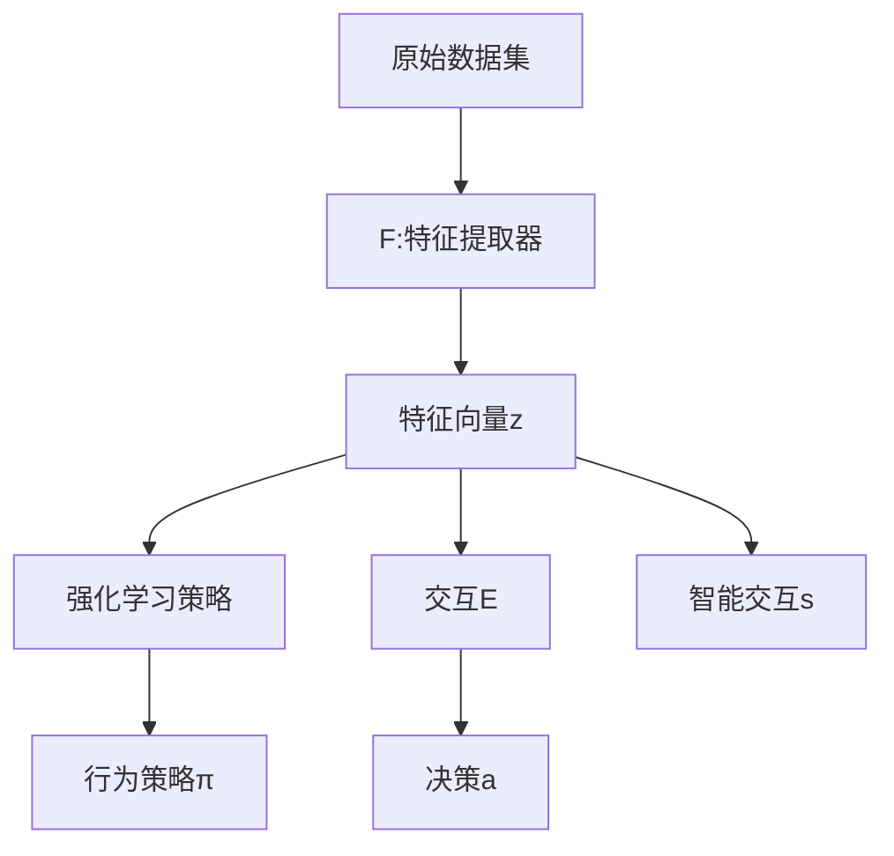

                 

# AI Agent: AI的下一个风口 对研究者和实践者的建议

## 1. 背景介绍

### 1.1 问题由来
人工智能(AI)在过去几十年的迅猛发展中，已经取得了诸多突破性成果。从图像识别、语音识别，到自然语言处理、机器学习，AI技术在各个领域都展现出了强大的能力。然而，这些技术往往只解决了AI某一方面的问题，难以跨界协同发挥更全面的能力。

### 1.2 问题核心关键点
AI Agent作为AI的下一代风口，是一种集成了多领域AI技术的新型AI形态，具备更强的自主决策、多任务处理、复杂交互能力，能够代替人类执行各种任务，如自动驾驶、智能客服、金融预测、机器人控制等。AI Agent的构建，不仅能提升人类生活质量，还能推动各行各业的数字化转型。

### 1.3 问题研究意义
研究AI Agent的构建方法，对提升AI技术的综合实力、促进跨领域应用、推动产业升级具有重要意义：

1. 综合实力提升：AI Agent将多种AI技术融合，形成更强大的整体能力，解决更复杂的问题。
2. 跨领域应用：AI Agent在多个领域中应用，打破原有技术的界限，开辟新的应用场景。
3. 产业升级：AI Agent在行业中的应用，能够大幅提升效率、降低成本，带来产业价值。

## 2. 核心概念与联系

### 2.1 核心概念概述

为更好地理解AI Agent构建方法，本节将介绍几个密切相关的核心概念：

- AI Agent：一种综合了多领域AI技术的新型AI形态，具备自主决策、多任务处理、复杂交互能力，能够执行各类任务。
- Multi-Agent System (MAS)：由多个AI Agent组成的协作系统，通过分布式协同处理复杂任务，具有强大的自组织能力。
- Reinforcement Learning (RL)：一种强化学习方法，通过与环境互动，不断调整策略以最大化奖励，训练AI Agent自主决策。
- Natural Language Processing (NLP)：一种AI技术，使AI Agent能够理解、处理自然语言，进行智能交互。
- Deep Learning：一种基于深度神经网络的AI技术，提供强大的模式识别、特征提取和预测能力，是构建AI Agent的重要基础。

这些核心概念之间的逻辑关系可以通过以下Mermaid流程图来展示：

```mermaid
graph TB
    A[AI Agent] --> B[Multi-Agent System (MAS)]
    A --> C[Reinforcement Learning (RL)]
    A --> D[Natural Language Processing (NLP)]
    A --> E[Deep Learning]
    E --> F[特征提取]
    C --> G[策略优化]
    D --> H[语义理解]
    G --> I[自主决策]
    H --> J[智能交互]
    F --> K[模式识别]
```

这个流程图展示了这个核心概念之间的逻辑关系：

1. AI Agent通过Deep Learning获取强大的特征提取能力，通过NLP实现语义理解，通过RL进行策略优化。
2. MAS通过分布式协作，提升AI Agent的综合能力。
3. 自主决策和智能交互是AI Agent的核心功能，能够自主执行复杂任务。

这些概念共同构成了AI Agent的基础框架，使得AI Agent具备强大的自主决策和交互能力，从而在多个领域中大显身手。

## 3. 核心算法原理 & 具体操作步骤

### 3.1 算法原理概述

构建AI Agent的核心思想是融合多领域AI技术，形成强大的自主决策和交互能力。这一过程通常包括以下几个步骤：

- **数据预处理**：从多个数据源中获取并整合数据，进行清洗、标注和预处理。
- **特征提取**：通过深度学习模型提取数据的高级特征表示。
- **模型训练**：使用深度学习、强化学习等方法训练AI Agent的行为策略。
- **交互与决策**：在实际应用场景中，AI Agent通过与环境的交互，自主做出决策，并进行智能交互。

AI Agent的构建过程可以用以下数学公式来描述：

- 假设原始数据集为 $D$，AI Agent的特征提取器为 $F$，训练策略为 $\pi$。
- 通过深度学习模型对数据集进行特征提取，得到表示向量 $z = F(D)$。
- 通过强化学习策略对特征向量 $z$ 进行优化，训练AI Agent的行为策略 $\pi(z)$。
- AI Agent在实际应用场景中，通过与环境的交互 $E$，输出决策 $a$，并进行智能交互 $s$。

上述过程可以用以下流程图表示：



通过这一流程，AI Agent能够实现自主决策和智能交互，具备多任务处理、复杂任务执行等能力。

### 3.2 算法步骤详解

构建AI Agent的一般步骤包括：

**Step 1: 数据预处理**
- 从多个数据源中收集数据，包括文本、图像、语音等。
- 对数据进行清洗、去噪、归一化、标注等预处理，以提高数据质量。
- 将不同领域的数据整合，形成统一的数据集 $D$。

**Step 2: 特征提取**
- 使用深度学习模型对数据集 $D$ 进行特征提取，得到表示向量 $z$。
- 常用的深度学习模型包括CNN、RNN、Transformer等，分别适用于图像、序列、文本等数据类型。
- 特征提取过程一般包括嵌入层、卷积层、池化层等组件。

**Step 3: 模型训练**
- 使用强化学习算法，对特征向量 $z$ 进行优化，训练AI Agent的行为策略 $\pi$。
- 强化学习算法包括Q-Learning、DQN、Policy Gradient等，根据具体任务选择。
- 训练过程一般包括策略评估和策略优化两个阶段，通过不断迭代，提升AI Agent的决策能力。

**Step 4: 交互与决策**
- 在实际应用场景中，AI Agent通过与环境的交互，自主做出决策 $a$。
- 通过智能交互 $s$，AI Agent能够与用户、机器人等进行实时互动，提升用户体验。

**Step 5: 应用部署**
- 将训练好的AI Agent部署到实际应用场景中，进行验证和优化。
- 持续收集反馈数据，不断优化AI Agent的行为策略和决策能力。

以上是构建AI Agent的一般流程。在实际应用中，还需要针对具体任务的特点，对各个环节进行优化设计，如改进特征提取模型、调整训练算法参数、增强交互接口等，以进一步提升AI Agent的性能。

### 3.3 算法优缺点

AI Agent构建方法具有以下优点：
1. 综合性强：融合了多领域AI技术，具备强大的自主决策和交互能力。
2. 可扩展性高：可以通过分布式协作，提升AI Agent的综合能力。
3. 适应性强：能够适应多种应用场景，提供灵活的解决方案。
4. 鲁棒性强：具备自我学习和适应能力，可以不断提升性能。

同时，该方法也存在一定的局限性：
1. 技术门槛高：需要掌握多领域的AI技术，开发和部署成本较高。
2. 数据需求大：需要大量的标注数据，数据获取和预处理复杂。
3. 模型复杂：构建AI Agent需要设计多个子系统，模型复杂度较高。
4. 维护成本高：AI Agent的部署和维护涉及多个组件，管理难度大。

尽管存在这些局限性，但就目前而言，构建AI Agent仍是AI技术领域的一大热门范式。未来相关研究的重点在于如何进一步降低技术门槛、提高模型效率和可扩展性，同时兼顾可解释性和伦理安全性等因素。

### 3.4 算法应用领域

AI Agent构建方法已经在多个领域得到了广泛应用，例如：

- 自动驾驶：AI Agent能够进行路况感知、路径规划、决策执行等任务，提升车辆的安全性和智能化水平。
- 智能客服：AI Agent能够处理客户咨询、自动生成回复，提升客户体验。
- 金融预测：AI Agent能够进行市场分析、风险评估、策略优化等任务，提升金融决策的准确性。
- 机器人控制：AI Agent能够控制机器人执行复杂任务，如搬运、装配、焊接等。
- 虚拟助手：AI Agent能够提供个性化服务，如日程安排、邮件管理、数据分析等。

除了上述这些经典任务外，AI Agent还被创新性地应用到更多场景中，如医疗辅助、教育智能化、城市管理等，为各行各业带来了新的突破。随着AI技术的不断进步，相信AI Agent将在更多领域得到应用，为人类社会带来新的变革。

## 4. 数学模型和公式 & 详细讲解 & 举例说明

### 4.1 数学模型构建

AI Agent的构建过程中，涉及多个领域的数学模型，包括深度学习模型、强化学习模型等。这里以深度学习模型为例，展示其构建和训练过程。

假设AI Agent的输入数据为 $x$，输出数据为 $y$，目标函数为 $L$。构建深度学习模型的过程如下：

- 定义神经网络结构，包括输入层、隐藏层、输出层等。
- 定义损失函数 $L$，用于衡量模型输出与真实标签之间的差异。
- 使用反向传播算法，计算模型参数的梯度，更新参数 $\theta$。
- 通过迭代训练，最小化损失函数 $L$，得到最优模型参数 $\theta^*$。

上述过程可以用以下数学公式来表示：

$$
L(\theta) = \frac{1}{N}\sum_{i=1}^N l(y_i, \hat{y}_i)
$$

其中，$l$ 为损失函数，$\hat{y}$ 为模型输出，$y$ 为真实标签，$N$ 为数据集大小。

通过最小化损失函数 $L$，可以训练得到最优模型参数 $\theta^*$。在实际应用中，一般使用反向传播算法进行梯度计算，使用随机梯度下降等优化算法更新参数。

### 4.2 公式推导过程

以下我们以卷积神经网络(CNN)为例，推导其损失函数和梯度计算过程。

假设CNN模型包含多个卷积层和池化层，输出特征图为 $z$。定义损失函数为交叉熵损失：

$$
l(y, \hat{y}) = -\frac{1}{N}\sum_{i=1}^N (y_i \log \hat{y}_i + (1-y_i) \log (1-\hat{y}_i))
$$

将损失函数代入经验风险公式：

$$
L(\theta) = \frac{1}{N}\sum_{i=1}^N l(y_i, \hat{y}_i)
$$

通过反向传播算法计算损失函数 $L(\theta)$ 对模型参数 $\theta$ 的梯度：

$$
\frac{\partial L(\theta)}{\partial \theta} = \frac{1}{N}\sum_{i=1}^N \frac{\partial l(y_i, \hat{y}_i)}{\partial z_i} \frac{\partial z_i}{\partial \theta}
$$

其中 $\frac{\partial l(y_i, \hat{y}_i)}{\partial z_i}$ 为损失函数对输出特征图的梯度，$\frac{\partial z_i}{\partial \theta}$ 为特征图对模型参数的梯度。通过计算梯度，可以使用随机梯度下降等优化算法更新模型参数 $\theta$。

### 4.3 案例分析与讲解

假设我们构建一个AI Agent用于医疗影像分类，使用卷积神经网络(CNN)进行特征提取。模型输入为医疗影像数据 $x$，输出为分类标签 $y$，损失函数为交叉熵损失。以下是构建CNN模型的代码实现：

```python
import torch
import torch.nn as nn
import torchvision.transforms as transforms
from torch.utils.data import DataLoader
from torchvision.datasets import CIFAR10

class CNN(nn.Module):
    def __init__(self):
        super(CNN, self).__init__()
        self.conv1 = nn.Conv2d(3, 32, kernel_size=3, padding=1)
        self.pool1 = nn.MaxPool2d(kernel_size=2, stride=2)
        self.conv2 = nn.Conv2d(32, 64, kernel_size=3, padding=1)
        self.pool2 = nn.MaxPool2d(kernel_size=2, stride=2)
        self.fc1 = nn.Linear(7*7*64, 512)
        self.fc2 = nn.Linear(512, 10)

    def forward(self, x):
        x = self.pool1(torch.relu(self.conv1(x)))
        x = self.pool2(torch.relu(self.conv2(x)))
        x = x.view(-1, 7*7*64)
        x = torch.relu(self.fc1(x))
        x = self.fc2(x)
        return x

# 构建CNN模型实例
model = CNN()

# 定义损失函数和优化器
criterion = nn.CrossEntropyLoss()
optimizer = torch.optim.SGD(model.parameters(), lr=0.01)

# 训练数据加载器
train_loader = DataLoader(CIFAR10(root='./data', train=True, download=True, transform=transforms.ToTensor()), batch_size=32)

# 训练过程
for epoch in range(10):
    running_loss = 0.0
    for i, data in enumerate(train_loader, 0):
        inputs, labels = data
        optimizer.zero_grad()
        outputs = model(inputs)
        loss = criterion(outputs, labels)
        loss.backward()
        optimizer.step()

        running_loss += loss.item()
        if i % 2000 == 1999:
            print('[%d, %5d] loss: %.3f' %
                  (epoch + 1, i + 1, running_loss / 2000))
            running_loss = 0.0

print('Finished Training')
```

上述代码展示了CNN模型的构建、损失函数定义、优化器配置和训练过程。通过使用反向传播算法，不断更新模型参数，可以训练得到高效的特征提取器。

## 5. 项目实践：代码实例和详细解释说明

### 5.1 开发环境搭建

在进行AI Agent构建实践前，我们需要准备好开发环境。以下是使用Python进行PyTorch开发的环境配置流程：

1. 安装Anaconda：从官网下载并安装Anaconda，用于创建独立的Python环境。

2. 创建并激活虚拟环境：
```bash
conda create -n pytorch-env python=3.8 
conda activate pytorch-env
```

3. 安装PyTorch：根据CUDA版本，从官网获取对应的安装命令。例如：
```bash
conda install pytorch torchvision torchaudio cudatoolkit=11.1 -c pytorch -c conda-forge
```

4. 安装TensorFlow：
```bash
conda install tensorflow
```

5. 安装各类工具包：
```bash
pip install numpy pandas scikit-learn matplotlib tqdm jupyter notebook ipython
```

完成上述步骤后，即可在`pytorch-env`环境中开始AI Agent构建实践。

### 5.2 源代码详细实现

这里我们以构建医疗影像分类AI Agent为例，给出使用PyTorch进行CNN模型的代码实现。

首先，定义模型结构：

```python
import torch.nn as nn

class CNN(nn.Module):
    def __init__(self):
        super(CNN, self).__init__()
        self.conv1 = nn.Conv2d(3, 32, kernel_size=3, padding=1)
        self.pool1 = nn.MaxPool2d(kernel_size=2, stride=2)
        self.conv2 = nn.Conv2d(32, 64, kernel_size=3, padding=1)
        self.pool2 = nn.MaxPool2d(kernel_size=2, stride=2)
        self.fc1 = nn.Linear(7*7*64, 512)
        self.fc2 = nn.Linear(512, 10)

    def forward(self, x):
        x = self.pool1(torch.relu(self.conv1(x)))
        x = self.pool2(torch.relu(self.conv2(x)))
        x = x.view(-1, 7*7*64)
        x = torch.relu(self.fc1(x))
        x = self.fc2(x)
        return x
```

然后，定义数据加载器和训练过程：

```python
import torch
from torchvision import datasets, transforms

# 数据预处理
transform = transforms.Compose([
    transforms.ToTensor(),
    transforms.Normalize((0.5, 0.5, 0.5), (0.5, 0.5, 0.5))
])

# 数据集加载
train_dataset = datasets.CIFAR10(root='./data', train=True, download=True, transform=transform)
test_dataset = datasets.CIFAR10(root='./data', train=False, download=True, transform=transform)

# 数据加载器
train_loader = torch.utils.data.DataLoader(train_dataset, batch_size=32, shuffle=True)
test_loader = torch.utils.data.DataLoader(test_dataset, batch_size=32, shuffle=False)

# 定义模型、损失函数和优化器
model = CNN()
criterion = nn.CrossEntropyLoss()
optimizer = torch.optim.SGD(model.parameters(), lr=0.01)

# 训练过程
num_epochs = 10
for epoch in range(num_epochs):
    running_loss = 0.0
    for i, data in enumerate(train_loader, 0):
        inputs, labels = data
        optimizer.zero_grad()
        outputs = model(inputs)
        loss = criterion(outputs, labels)
        loss.backward()
        optimizer.step()

        running_loss += loss.item()
        if i % 2000 == 1999:
            print('[%d, %5d] loss: %.3f' %
                  (epoch + 1, i + 1, running_loss / 2000))
            running_loss = 0.0

print('Finished Training')
```

最后，进行模型测试和评估：

```python
# 模型测试
correct = 0
total = 0
with torch.no_grad():
    for data in test_loader:
        inputs, labels = data
        outputs = model(inputs)
        _, predicted = torch.max(outputs.data, 1)
        total += labels.size(0)
        correct += (predicted == labels).sum().item()

print('Accuracy of the network on the 10000 test images: %d %%' % (
    100 * correct / total))
```

以上就是使用PyTorch构建CNN模型的完整代码实现。可以看到，得益于PyTorch的强大封装，我们可以用相对简洁的代码实现模型的构建和训练。

## 6. 实际应用场景

### 6.1 自动驾驶

AI Agent在自动驾驶领域的应用，通过整合多传感器数据，实现路况感知、路径规划、决策执行等功能。通过深度学习模型提取特征，强化学习优化策略，AI Agent能够在复杂交通环境中安全行驶。例如，自动驾驶汽车可以通过摄像头、雷达等传感器获取周围环境信息，使用CNN模型提取特征，并通过RL算法优化驾驶策略，实现自动避障、变道、停车等功能。

### 6.2 智能客服

AI Agent在智能客服领域的应用，通过自然语言处理(NLP)技术，实现语音识别、语义理解、智能回复等功能。通过深度学习模型提取特征，强化学习优化策略，AI Agent能够理解客户咨询意图，自动生成回复，提升客户体验。例如，智能客服机器人可以通过语音识别技术获取客户语音输入，使用RNN模型提取语音特征，并通过RL算法优化回复策略，实现自动回答客户问题。

### 6.3 金融预测

AI Agent在金融预测领域的应用，通过数据分析、市场分析等技术，实现股票预测、风险评估、策略优化等功能。通过深度学习模型提取特征，强化学习优化策略，AI Agent能够分析历史数据，预测股票走势，评估市场风险，优化投资策略。例如，金融预测AI Agent可以通过深度学习模型提取股票历史数据，使用LSTM模型提取时间序列特征，并通过RL算法优化预测策略，实现股票价格预测。

### 6.4 机器人控制

AI Agent在机器人控制领域的应用，通过多传感器数据融合、路径规划、决策执行等功能，实现机器人自主执行复杂任务。通过深度学习模型提取特征，强化学习优化策略，AI Agent能够自主执行搬运、装配、焊接等任务。例如，机器人控制AI Agent可以通过视觉传感器获取环境信息，使用CNN模型提取视觉特征，并通过RL算法优化控制策略，实现自动搬运任务。

### 6.5 虚拟助手

AI Agent在虚拟助手领域的应用，通过智能对话、任务管理等功能，实现个性化服务、日程安排、邮件管理等功能。通过深度学习模型提取特征，强化学习优化策略，AI Agent能够理解用户指令，自动生成回复，实现个性化服务。例如，虚拟助手AI Agent可以通过自然语言处理(NLP)技术理解用户指令，使用RNN模型提取语义特征，并通过RL算法优化回复策略，实现日程安排、邮件管理等功能。

## 7. 工具和资源推荐

### 7.1 学习资源推荐

为了帮助开发者系统掌握AI Agent的构建方法，这里推荐一些优质的学习资源：

1. 《深度学习》课程：斯坦福大学李飞飞教授主讲的深度学习课程，涵盖了深度学习的基本概念、模型构建和优化方法。

2. 《强化学习》课程：斯坦福大学Sebastian Thrun教授主讲的强化学习课程，介绍了强化学习的基本原理和算法。

3. 《自然语言处理》课程：斯坦福大学Christopher Manning教授主讲的自然语言处理课程，介绍了自然语言处理的基本技术和应用。

4. 《计算机视觉》课程：斯坦福大学Fei-Fei Li教授主讲的计算机视觉课程，介绍了计算机视觉的基本技术和应用。

5. 《TensorFlow官方文档》：Google官方发布的TensorFlow文档，提供了丰富的API和样例，方便开发者学习和使用。

6. 《PyTorch官方文档》：Facebook官方发布的PyTorch文档，提供了强大的深度学习框架和工具库。

通过这些资源的学习，相信你一定能够掌握AI Agent的构建方法和核心技术。

### 7.2 开发工具推荐

高效的开发离不开优秀的工具支持。以下是几款用于AI Agent开发的常用工具：

1. PyTorch：基于Python的开源深度学习框架，灵活的计算图，适合快速迭代研究。

2. TensorFlow：由Google主导开发的开源深度学习框架，生产部署方便，适合大规模工程应用。

3. Transformers：HuggingFace开发的NLP工具库，集成了众多SOTA语言模型，支持PyTorch和TensorFlow，是构建AI Agent的重要基础。

4. Jupyter Notebook：交互式编程环境，适合快速原型开发和调试。

5. Weights & Biases：模型训练的实验跟踪工具，可以记录和可视化模型训练过程中的各项指标，方便对比和调优。

6. Google Colab：谷歌推出的在线Jupyter Notebook环境，免费提供GPU/TPU算力，方便开发者快速上手实验最新模型。

合理利用这些工具，可以显著提升AI Agent的开发效率，加快创新迭代的步伐。

### 7.3 相关论文推荐

AI Agent的构建和优化涉及多个领域的最新研究成果，以下是几篇奠基性的相关论文，推荐阅读：

1. AlphaGo论文：DeepMind团队发表的AlphaGo论文，介绍了通过深度学习和强化学习构建AI Agent实现复杂任务的方法。

2. OpenAI Five论文：OpenAI团队发表的OpenAI Five论文，介绍了通过多智能体协同训练构建AI Agent实现复杂的协作任务。

3. GPT-3论文：OpenAI团队发表的GPT-3论文，介绍了通过大规模预训练语言模型构建AI Agent实现自然语言理解和生成。

4. TensorFlow official blog：Google官方博客发布的TensorFlow论文，涵盖了AI Agent的最新研究成果和应用案例。

5. PyTorch official blog：Facebook官方博客发布的PyTorch论文，涵盖了AI Agent的最新研究成果和应用案例。

这些论文代表了AI Agent构建和优化技术的最新进展，通过学习这些前沿成果，可以帮助研究者把握学科前进方向，激发更多的创新灵感。

## 8. 总结：未来发展趋势与挑战

### 8.1 总结

本文对AI Agent构建方法进行了全面系统的介绍。首先阐述了AI Agent的研究背景和意义，明确了构建AI Agent的综合实力提升、跨领域应用、产业升级等研究价值。其次，从原理到实践，详细讲解了AI Agent的构建过程，包括数据预处理、特征提取、模型训练、交互与决策等关键步骤，给出了代码实例和详细解释。同时，本文还广泛探讨了AI Agent在自动驾驶、智能客服、金融预测、机器人控制等多个领域的应用前景，展示了AI Agent的广阔应用空间。此外，本文精选了AI Agent构建方法的学习资源、开发工具和相关论文，力求为开发者提供全方位的技术指引。

通过本文的系统梳理，可以看到，AI Agent构建方法正在成为AI技术领域的重要范式，极大地拓展了AI技术的综合实力，推动了跨领域应用和产业升级。未来，伴随AI技术的不断进步，AI Agent必将在更多领域得到应用，为人类社会带来新的变革。

### 8.2 未来发展趋势

展望未来，AI Agent构建方法将呈现以下几个发展趋势：

1. 模型复杂度提升：随着深度学习、强化学习等技术的进步，AI Agent模型将越来越复杂，具备更强的自主决策和交互能力。

2. 多任务处理能力增强：通过多智能体协同学习，AI Agent能够同时处理多个任务，提升任务执行效率。

3. 跨领域融合增强：AI Agent能够将不同领域的知识进行整合，提升模型在多领域中的应用效果。

4. 自动化和可解释性提升：通过自动化训练和可解释性技术，AI Agent能够更加透明和可控，提升用户信任度。

5. 实时化能力增强：AI Agent能够实时处理大量数据，提升决策速度和响应效率。

6. 持续学习能力增强：AI Agent能够不断学习和适应新的环境变化，保持性能和稳定性。

以上趋势凸显了AI Agent构建方法的广阔前景。这些方向的探索发展，必将进一步提升AI Agent的综合实力，推动AI技术在更广阔的领域中发挥作用。

### 8.3 面临的挑战

尽管AI Agent构建方法已经取得了诸多突破性成果，但在迈向更加智能化、普适化应用的过程中，仍面临诸多挑战：

1. 技术门槛高：AI Agent构建涉及多个领域的最新技术，开发和部署成本较高。

2. 数据需求大：AI Agent需要大量的标注数据和多样化的数据源，数据获取和预处理复杂。

3. 模型复杂度提升：随着模型复杂度的提升，训练和推理成本增加，硬件资源需求高。

4. 可解释性不足：AI Agent的决策过程难以解释，难以进行调试和优化。

5. 安全性和伦理问题：AI Agent可能存在偏见和有害输出，需要进行伦理约束和安全性评估。

6. 多智能体协同困难：多智能体协同学习存在竞争和合作问题，需要高效的协调机制。

尽管存在这些挑战，但AI Agent构建方法仍然具有广阔的应用前景。未来，需要在技术、数据、伦理等多个方面进行优化和改进，才能真正实现AI Agent的全面应用。

### 8.4 研究展望

未来，AI Agent研究需要从以下几个方面进行突破：

1. 开发更加高效、可解释的AI Agent模型。

2. 探索更加高效的特征提取和模型训练方法。

3. 研究跨领域的知识整合方法，提升AI Agent的跨领域迁移能力。

4. 引入伦理约束和安全机制，提升AI Agent的可靠性和可控性。

5. 开发更加灵活、自动化的AI Agent训练方法。

6. 探索更加高效的跨智能体协同方法。

这些研究方向将引领AI Agent构建技术迈向新的台阶，为人工智能技术的发展提供新的动力。

## 9. 附录：常见问题与解答

**Q1: 什么是AI Agent？**

A: AI Agent是一种集成了多领域AI技术的新型AI形态，具备自主决策、多任务处理、复杂交互能力，能够执行各类任务。

**Q2: AI Agent在实际应用中需要注意哪些问题？**

A: AI Agent在实际应用中需要注意以下问题：

1. 数据获取和预处理：需要大量的标注数据，数据获取和预处理复杂。

2. 模型训练和优化：模型复杂度提升，训练和推理成本增加，需要高效的训练和优化方法。

3. 可解释性和安全性：AI Agent的决策过程难以解释，需要进行伦理约束和安全性评估。

4. 多智能体协同：多智能体协同学习存在竞争和合作问题，需要高效的协调机制。

**Q3: 如何提高AI Agent的可解释性？**

A: 提高AI Agent的可解释性，可以从以下几个方面进行改进：

1. 引入可解释性模型：使用可解释性模型，如LIME、SHAP等，解释AI Agent的决策过程。

2. 可视化输出结果：将AI Agent的输出结果进行可视化，展示决策过程和特征重要性。

3. 人工干预和审核：在AI Agent输出结果进行人工干预和审核，确保决策符合人类价值观和伦理道德。

4. 引入多领域知识：将符号化的先验知识，如知识图谱、逻辑规则等，与神经网络模型进行融合，提升可解释性。

这些方法可以帮助提高AI Agent的可解释性，提升用户信任度。

**Q4: AI Agent在构建过程中需要注意哪些技术细节？**

A: 构建AI Agent过程中需要注意以下技术细节：

1. 数据预处理：需要从多个数据源中获取数据，并进行清洗、去噪、归一化等预处理。

2. 特征提取：需要选择合适的深度学习模型，如CNN、RNN、Transformer等，提取数据的高级特征表示。

3. 模型训练：需要选择合适的深度学习、强化学习等方法，训练AI Agent的行为策略。

4. 交互与决策：需要设计合适的交互接口，实现AI Agent与环境的互动。

5. 模型评估：需要设计合适的评估指标，如准确率、召回率、F1分数等，评估AI Agent的性能。

这些细节的优化和改进，可以显著提升AI Agent的构建效率和性能。

---

作者：禅与计算机程序设计艺术 / Zen and the Art of Computer Programming

