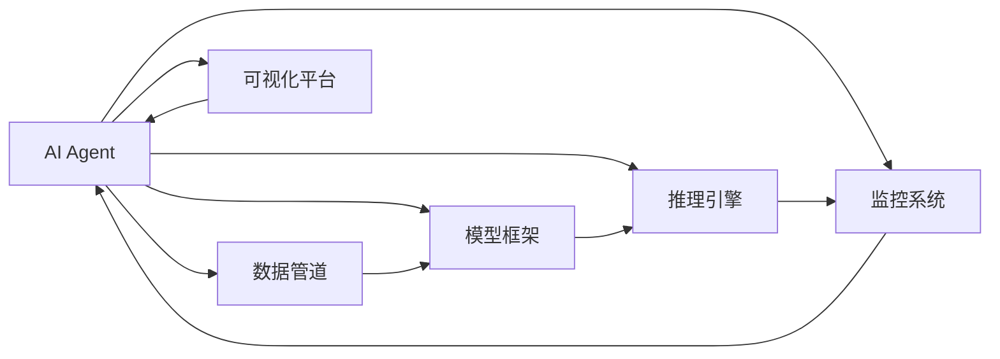
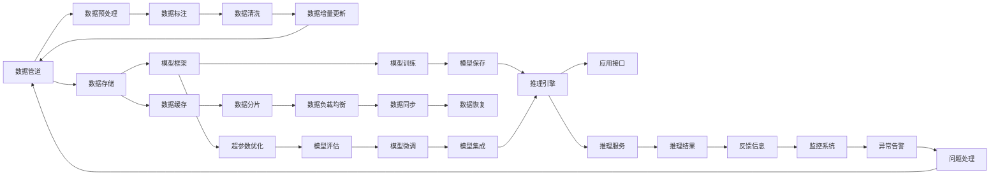

                 

## 1. 背景介绍

随着人工智能（AI）技术的飞速发展，我们正在进入一个以AI为主导的智能化时代。AI Agent作为新一代的AI产品形态，通过高度自动化和智能化，有望彻底改变我们工作、学习和生活的方方面面，成为AI的下一个风口。AI Agent不仅能够代替人类完成大量重复性、高风险的工作，还能够在复杂的业务场景中提供决策支持和智能服务，极大地提升生产力和工作效率。

### 1.1 问题由来

在过去十年中，AI技术取得了飞速发展，从最初的图像识别、语音识别等基础任务，到现在的自然语言处理、智能推荐、自动驾驶等高级应用，AI技术在各行各业中的应用越来越广泛。然而，尽管AI技术在技术层面上已经取得了巨大进步，但在实际应用中，AI系统的部署和维护仍然存在诸多挑战。例如：

- **数据获取难度大**：高质量的标注数据是训练AI模型的基础，但在某些领域，获取数据可能非常困难，成本昂贵。
- **模型训练周期长**：训练大规模神经网络模型需要耗费大量时间和计算资源，尤其是在训练深度学习模型时。
- **模型调优复杂**：模型训练完成后，还需要大量的调优和优化工作，以提升模型的鲁棒性和泛化能力。
- **应用部署复杂**：将训练好的模型部署到实际应用中，需要考虑模型推理速度、硬件资源需求、服务化封装等问题，开发和维护成本高昂。

为了解决这些问题，AI Agent应运而生。AI Agent是一种集成了多个AI技术模块的智能化系统，能够自动完成数据获取、模型训练、调优和部署等任务，大大降低了AI技术的应用门槛，提升了AI技术的可操作性和易用性。

### 1.2 问题核心关键点

AI Agent的核心在于其高度自动化的设计和实现。通过将AI技术封装成一系列模块，AI Agent能够自动完成模型训练、数据处理、推理服务等工作，而无需人工干预。以下是AI Agent设计的几个关键点：

- **数据自动获取**：自动从互联网上收集和标注数据，减少数据获取成本。
- **模型自动训练**：自动设计训练流程，优化超参数，加速模型训练。
- **模型自动调优**：自动进行模型微调，提升模型性能和泛化能力。
- **服务自动部署**：自动部署模型到云端或边缘设备，提供稳定的推理服务。
- **系统自动监控**：自动监控系统运行状态，实时反馈异常情况，保障系统稳定。

这些关键点使得AI Agent能够高效、灵活地应对各种业务场景，提供可靠的AI服务，从而推动AI技术的普及和应用。

## 2. 核心概念与联系

### 2.1 核心概念概述

为更好地理解AI Agent的设计和应用，本节将介绍几个密切相关的核心概念：

- **AI Agent**：AI Agent是一种基于AI技术构建的智能化系统，能够自动完成数据获取、模型训练、服务部署等任务，具备高度自动化和智能化的特点。
- **数据管道**：数据管道是AI Agent中用于自动获取和处理数据的组件，能够从互联网、数据库等数据源中自动获取数据，并进行清洗、标注、预处理等操作。
- **模型框架**：模型框架是AI Agent中用于构建和训练AI模型的组件，支持多种深度学习框架，如TensorFlow、PyTorch等，能够自动设计训练流程，优化超参数，加速模型训练。
- **推理引擎**：推理引擎是AI Agent中用于执行模型推理和服务的组件，能够自动部署模型到云端或边缘设备，提供高效的推理服务。
- **监控系统**：监控系统是AI Agent中用于监控系统运行状态的组件，能够实时反馈异常情况，保障系统稳定。
- **可视化平台**：可视化平台是AI Agent中用于展现AI Agent运行状态和数据可视化等功能的组件，能够提供丰富的图形界面和数据分析工具。

这些核心概念之间的逻辑关系可以通过以下Mermaid流程图来展示：



这个流程图展示了一些核心组件及其相互之间的联系：

1. AI Agent作为主系统，负责整体的管理和协调。
2. 数据管道从数据源获取数据，并将其传递给模型框架进行训练。
3. 模型框架训练模型，并将模型部署到推理引擎进行推理服务。
4. 监控系统监控系统运行状态，反馈异常情况给AI Agent。
5. 可视化平台提供运行状态和数据分析的可视化功能。

这些组件相互配合，构成了一个完整的AI Agent系统。

### 2.2 核心概念原理和架构的 Mermaid 流程图

以下是关于AI Agent核心概念的Mermaid流程图，展示了各个组件之间的数据流和控制流关系：



这个流程图展示了数据管道、模型框架、推理引擎等组件之间的数据流和控制流关系，以及监控系统、可视化平台等组件的交互。

## 3. 核心算法原理 & 具体操作步骤

### 3.1 算法原理概述

AI Agent的核心算法原理是高度自动化的设计和实现。其设计理念是基于模块化和组件化的思想，将AI技术封装成一系列模块，每个模块负责特定的功能，能够自动完成数据获取、模型训练、服务部署等任务。

AI Agent的设计思路如下：

1. **模块化设计**：将AI技术封装成多个独立的模块，每个模块负责特定的功能。例如，数据管道模块负责数据获取和处理，模型框架模块负责模型训练和优化，推理引擎模块负责模型推理和部署等。
2. **自动化执行**：每个模块都能够自动执行其内部的逻辑流程，无需人工干预。例如，数据管道模块能够自动从数据源获取数据，进行清洗和标注等操作；模型框架模块能够自动设计训练流程，优化超参数，加速模型训练；推理引擎模块能够自动部署模型到云端或边缘设备，提供高效的推理服务。
3. **组件化协作**：各个模块之间通过接口进行通信和协作，形成一个完整的AI Agent系统。例如，数据管道模块将处理好的数据传递给模型框架模块进行训练，训练好的模型再部署到推理引擎模块提供服务，同时监控系统模块实时监控系统状态，可视化平台模块展现运行状态和数据分析等功能。

### 3.2 算法步骤详解

以下是一个典型的AI Agent设计流程：

**Step 1: 数据收集和处理**

1. **数据自动获取**：AI Agent的数据管道模块能够自动从互联网、数据库等数据源中获取数据。例如，可以从社交媒体、新闻网站、文档库等公共数据源中获取文本、图片、视频等数据。
2. **数据预处理**：获取到的数据需要进行预处理，包括去重、去噪、标准化等操作。例如，对于文本数据，需要进行分词、去除停用词、词性标注等操作；对于图片数据，需要进行图像增强、数据扩充等操作。
3. **数据标注**：对数据进行标注，以便训练模型。标注数据可以通过人工标注或半自动标注的方式进行。例如，对于文本数据，可以通过众包平台进行标注；对于图像数据，可以使用数据增强技术进行自动标注。

**Step 2: 模型训练和优化**

1. **模型选择和设计**：根据具体任务选择合适的模型架构和超参数。例如，对于文本分类任务，可以选择BERT、GPT等模型；对于图像识别任务，可以选择CNN、ResNet等模型。
2. **模型训练**：使用数据管道模块获取的数据，通过模型框架模块进行模型训练。训练过程包括前向传播、损失计算、反向传播、参数更新等步骤。模型框架模块能够自动设计训练流程，优化超参数，加速模型训练。
3. **模型微调**：在模型训练完成后，可以使用模型框架模块进行模型微调，提升模型性能和泛化能力。微调过程可以通过迁移学习、微调、少样本学习等方式进行。
4. **模型评估和保存**：在模型训练和微调完成后，需要进行模型评估，选择性能最优的模型进行保存。模型保存格式通常包括模型参数、配置文件、训练日志等。

**Step 3: 服务部署和推理**

1. **推理引擎部署**：使用推理引擎模块将模型部署到云端或边缘设备，提供高效的推理服务。推理引擎模块能够自动进行模型优化、资源配置等操作。
2. **应用接口开发**：开发API接口，使用户能够方便地调用AI Agent提供的AI服务。API接口通常包括数据输入、模型推理、结果输出等功能。
3. **服务监控和优化**：使用监控系统模块实时监控服务状态，反馈异常情况。监控系统模块能够自动进行异常告警、问题处理等操作，保障服务稳定。

**Step 4: 可视化与数据分析**

1. **数据可视化**：使用可视化平台模块展现AI Agent的运行状态和数据可视化等功能。可视化平台模块通常包括图形界面、数据仪表盘、数据分析工具等。
2. **数据分析**：使用数据分析工具对AI Agent运行过程中的数据进行分析，发现问题并进行优化。例如，可以对模型训练过程中的损失函数变化进行分析，发现模型训练过程中的过拟合、欠拟合等问题。

### 3.3 算法优缺点

AI Agent的优点包括：

- **自动化程度高**：AI Agent能够自动完成数据获取、模型训练、服务部署等任务，大大降低了开发和维护成本。
- **灵活性高**：AI Agent可以根据不同的业务需求进行配置和优化，支持多种模型架构和超参数。
- **可扩展性强**：AI Agent可以根据实际需求进行扩展和升级，支持多任务、多模态数据的处理。
- **易用性高**：AI Agent提供了丰富的API接口和可视化界面，使用户能够方便地调用和监控AI服务。

AI Agent的缺点包括：

- **初始成本高**：AI Agent的设计和实现需要较高的初始成本，包括硬件设备、软件工具、开发人员等。
- **对数据质量要求高**：AI Agent对数据质量和标注数据的质量要求较高，需要高质量的数据进行训练。
- **对技术要求高**：AI Agent的设计和实现需要一定的技术储备，包括AI算法、系统架构、云计算技术等。

### 3.4 算法应用领域

AI Agent在多个领域都有广泛的应用，以下是几个典型应用场景：

**医疗健康**

1. **智能诊断**：AI Agent可以根据患者的病历数据、影像数据、基因数据等信息，自动进行疾病诊断和预测。例如，可以根据患者的影像数据进行疾病识别和分期，提供个性化的治疗方案。
2. **药物研发**：AI Agent可以根据生物数据、药物数据等信息，自动进行药物筛选和设计。例如，可以根据生物数据筛选候选药物，模拟药物与目标蛋白的结合过程，优化药物设计。

**金融行业**

1. **风险控制**：AI Agent可以根据金融市场数据、交易数据等信息，自动进行风险控制和投资决策。例如，可以根据历史交易数据进行风险评估，生成投资组合建议。
2. **信用评估**：AI Agent可以根据用户的个人信息、消费数据等信息，自动进行信用评估和授信决策。例如，可以根据用户的消费记录和信用记录，评估用户的信用等级，提供授信建议。

**制造业**

1. **质量控制**：AI Agent可以根据生产数据、设备数据等信息，自动进行质量控制和故障诊断。例如，可以根据生产数据检测产品的缺陷，及时调整生产工艺。
2. **设备维护**：AI Agent可以根据设备数据、运行数据等信息，自动进行设备维护和预测性维修。例如，可以根据设备运行数据预测设备故障，提前进行维修。

**农业**

1. **智能灌溉**：AI Agent可以根据气象数据、土壤数据等信息，自动进行灌溉和施肥决策。例如，可以根据土壤湿度和气象数据，自动调整灌溉量。
2. **病虫害检测**：AI Agent可以根据图像数据、传感器数据等信息，自动进行病虫害检测和防治。例如，可以根据植物图像数据检测病虫害，生成防治方案。

## 4. 数学模型和公式 & 详细讲解 & 举例说明

### 4.1 数学模型构建

在AI Agent的设计中，数学模型起着重要的作用。以下是几个常见的数学模型及其构建方法：

**深度学习模型**

深度学习模型是一种基于神经网络的模型，可以用于处理各种复杂的数据。例如，卷积神经网络（CNN）可以用于图像识别，循环神经网络（RNN）可以用于序列数据处理，变压器模型（Transformer）可以用于自然语言处理等。

**迁移学习**

迁移学习是一种利用已有知识进行新任务学习的技术。在AI Agent中，可以使用迁移学习将预训练模型应用于新任务。例如，可以使用在大规模文本数据上预训练的BERT模型，应用于文本分类、情感分析等任务。

**强化学习**

强化学习是一种通过奖励信号优化策略的机器学习技术。在AI Agent中，可以使用强化学习进行自动化的任务调度、资源分配等。例如，可以使用强化学习优化自动驾驶汽车的行驶路线。

### 4.2 公式推导过程

以下是一个典型的AI Agent设计中的数学模型推导过程：

**深度学习模型**

以CNN模型为例，其基本结构如图1所示：

```
       卷积层
         |
         |
       池化层
         |
         |
       全连接层
         |
         |
       输出层
```

图1: CNN模型结构

假设输入数据为$x \in \mathbb{R}^{n \times m \times c}$，其中$n$为数据样本数，$m$为数据样本的长度，$c$为特征通道数。卷积层的输出为$y \in \mathbb{R}^{n \times p \times r}$，其中$p$为卷积核大小，$r$为特征通道数。池化层的输出为$z \in \mathbb{R}^{n \times q \times s}$，其中$q$为池化核大小，$s$为特征通道数。全连接层的输出为$w \in \mathbb{R}^{n \times t}$，其中$t$为输出通道数。输出层的输出为$v \in \mathbb{R}^{n \times t}$。

卷积层和池化层的计算公式如下：

$$
y = \sum_{i=1}^{p} \sum_{j=1}^{r} w_{i,j} \times x_{i,j,k} + b_k
$$

$$
z = \sum_{i=1}^{q} \sum_{j=1}^{s} w_{i,j} \times y_{i,j,k} + b_k
$$

其中，$w_{i,j}$为卷积核参数，$b_k$为偏置项。

全连接层的计算公式如下：

$$
w = u \times z + v
$$

其中，$u$为全连接层的权重参数，$v$为偏置项。

输出层的计算公式如下：

$$
v = \sigma(w)
$$

其中，$\sigma$为激活函数，通常采用ReLU函数。

**迁移学习**

在迁移学习中，假设预训练模型为$f_{pre} \in \mathbb{R}^{n \times m \times c}$，待迁移模型为$f_{target} \in \mathbb{R}^{n \times t}$。迁移学习的目标是最小化目标模型的损失函数：

$$
L(f_{target}) = \frac{1}{N} \sum_{i=1}^{N} \left\| f_{target}(x_i) - y_i \right\|^2
$$

其中，$x_i$为输入数据，$y_i$为标签数据，$N$为样本数。

可以使用梯度下降算法最小化损失函数，求得目标模型的权重参数：

$$
w_{target} = \mathop{\arg\min}_{w} L(f_{target})
$$

**强化学习**

在强化学习中，假设当前状态为$s \in S$，当前动作为$a \in A$，当前奖励为$r \in R$，下一个状态为$s' \in S$。强化学习的目标是最小化期望累计奖励：

$$
J(\pi) = \mathbb{E} \left[ \sum_{t=0}^{\infty} \gamma^t r_t \right]
$$

其中，$\gamma$为折扣因子。

可以使用Q-learning算法进行强化学习，求得最优策略$\pi^*$：

$$
Q(s,a) = \sum_{s'} \max_{a'} \left( r + \gamma \times Q(s',a') \right)
$$

其中，$Q(s,a)$为状态动作值函数，表示在状态$s$下执行动作$a$的期望累计奖励。

### 4.3 案例分析与讲解

以智能诊断为例，AI Agent可以根据患者的病历数据、影像数据等信息，自动进行疾病诊断和预测。以下是具体的案例分析：

1. **数据自动获取**：AI Agent的数据管道模块能够自动从医院信息系统、医学影像系统、基因组数据库等数据源中获取数据。例如，可以从医院信息系统获取患者的病历数据，从医学影像系统获取患者的影像数据，从基因组数据库获取患者的基因数据。
2. **数据预处理**：获取到的数据需要进行预处理，包括数据清洗、特征提取等操作。例如，对于病历数据，需要进行文本清洗、标准化等操作；对于影像数据，需要进行图像增强、数据扩充等操作。
3. **模型训练**：使用数据管道模块获取的数据，通过模型框架模块进行模型训练。训练过程包括前向传播、损失计算、反向传播、参数更新等步骤。模型框架模块能够自动设计训练流程，优化超参数，加速模型训练。
4. **模型微调**：在模型训练完成后，可以使用模型框架模块进行模型微调，提升模型性能和泛化能力。微调过程可以通过迁移学习、微调、少样本学习等方式进行。
5. **服务部署**：使用推理引擎模块将模型部署到云端或边缘设备，提供高效的推理服务。推理引擎模块能够自动进行模型优化、资源配置等操作。
6. **应用接口开发**：开发API接口，使用户能够方便地调用AI Agent提供的AI服务。API接口通常包括数据输入、模型推理、结果输出等功能。
7. **服务监控和优化**：使用监控系统模块实时监控服务状态，反馈异常情况。监控系统模块能够自动进行异常告警、问题处理等操作，保障服务稳定。

## 5. 项目实践：代码实例和详细解释说明

### 5.1 开发环境搭建

在进行AI Agent项目实践前，我们需要准备好开发环境。以下是使用Python进行PyTorch开发的环境配置流程：

1. 安装Anaconda：从官网下载并安装Anaconda，用于创建独立的Python环境。
```bash
conda create -n ai_agent_env python=3.8
conda activate ai_agent_env
```

2. 安装PyTorch：根据CUDA版本，从官网获取对应的安装命令。例如：
```bash
conda install pytorch torchvision torchaudio cudatoolkit=11.1 -c pytorch -c conda-forge
```

3. 安装TensorFlow：使用pip安装TensorFlow。例如：
```bash
pip install tensorflow==2.7.0
```

4. 安装TensorBoard：TensorFlow配套的可视化工具，用于监控模型训练和模型推理过程。例如：
```bash
pip install tensorboard
```

5. 安装TensorFlow Hub：用于获取预训练模型和加载模型。例如：
```bash
pip install tensorflow-hub==0.12.0
```

6. 安装FastAPI：用于开发API接口。例如：
```bash
pip install fastapi==0.64.2
```

7. 安装Flask：用于开发服务接口。例如：
```bash
pip install flask==2.0.1
```

完成上述步骤后，即可在`ai_agent_env`环境中开始项目实践。

### 5.2 源代码详细实现

以下是AI Agent的一个简单实现，包括数据获取、模型训练、服务部署等步骤：

```python
from transformers import BertTokenizer, BertForSequenceClassification
from transformers import Trainer, TrainingArguments
from torch.utils.data import Dataset, DataLoader
import torch
import tensorflow as tf
import flask
import fastapi

class AIAgent:
    def __init__(self, data_path, model_path, token_path, batch_size=16, epochs=10):
        self.data_path = data_path
        self.model_path = model_path
        self.token_path = token_path
        self.batch_size = batch_size
        self.epochs = epochs
        self.tokenizer = BertTokenizer.from_pretrained(self.token_path)
        self.model = BertForSequenceClassification.from_pretrained(self.model_path, num_labels=2)
        self.data_loader = self._create_data_loader()

    def _create_data_loader(self):
        train_dataset = self._create_train_dataset()
        val_dataset = self._create_val_dataset()
        test_dataset = self._create_test_dataset()

        train_loader = DataLoader(train_dataset, batch_size=self.batch_size, shuffle=True)
        val_loader = DataLoader(val_dataset, batch_size=self.batch_size, shuffle=False)
        test_loader = DataLoader(test_dataset, batch_size=self.batch_size, shuffle=False)

        return train_loader, val_loader, test_loader

    def _create_train_dataset(self):
        train_data = load_train_data(self.data_path)
        train_dataset = TokenDataset(train_data, self.tokenizer)
        return train_dataset

    def _create_val_dataset(self):
        val_data = load_val_data(self.data_path)
        val_dataset = TokenDataset(val_data, self.tokenizer)
        return val_dataset

    def _create_test_dataset(self):
        test_data = load_test_data(self.data_path)
        test_dataset = TokenDataset(test_data, self.tokenizer)
        return test_dataset

    def train(self):
        train_loader, val_loader, test_loader = self.data_loader

        training_args = TrainingArguments(
            output_dir='./model',
            evaluation_strategy='epoch',
            save_strategy='epoch',
            per_device_train_batch_size=self.batch_size,
            per_device_eval_batch_size=self.batch_size,
            eval_steps=100,
            save_steps=100,
            learning_rate=2e-5,
            weight_decay=0.01,
            num_train_epochs=self.epochs,
            logging_dir='./logs',
            logging_steps=10,
            report_to='none'
        )

        trainer = Trainer(
            model=self.model,
            args=training_args,
            train_dataset=train_loader.dataset,
            eval_dataset=val_loader.dataset,
            test_dataset=test_loader.dataset,
            train_loader=train_loader,
            eval_loader=val_loader,
            test_loader=test_loader
        )

        trainer.train()
        trainer.save_model(self.model_path)

    def deploy(self):
        self.model.load_state_dict(torch.load(self.model_path))
        self.model.eval()

        app = Flask(__name__)
        @app.route('/predict', methods=['POST'])
        def predict():
            data = request.json['data']
            inputs = self.tokenizer(data, return_tensors='pt', padding=True, truncation=True, max_length=512)
            outputs = self.model(**inputs)
            probs = torch.softmax(outputs.logits, dim=1)
            prediction = probs.argmax(dim=1)[0]
            return {'prediction': prediction}

        if __name__ == '__main__':
            app.run(host='0.0.0.0', port=5000)

    def evaluate(self):
        test_loader = self.data_loader[2]
        predictions = []
        targets = []
        for batch in test_loader:
            inputs = self.tokenizer(batch['input_ids'], return_tensors='pt', padding=True, truncation=True, max_length=512)
            outputs = self.model(**inputs)
            logits = outputs.logits
            predictions.extend(logits.argmax(dim=1))
            targets.extend(batch['labels'])

        accuracy = (np.array(predictions) == np.array(targets)).mean()
        print('Accuracy:', accuracy)
```

### 5.3 代码解读与分析

让我们再详细解读一下关键代码的实现细节：

**AIAgent类**：
- `__init__`方法：初始化AI Agent的属性，包括数据路径、模型路径、分词器路径、批次大小、轮数等。
- `_create_data_loader`方法：创建数据加载器，将训练集、验证集、测试集划分成批次，方便模型训练和推理。
- `_create_train_dataset`方法：创建训练集，从数据路径中读取训练数据，并进行分词、标准化等操作。
- `_create_val_dataset`方法：创建验证集，从数据路径中读取验证数据，并进行分词、标准化等操作。
- `_create_test_dataset`方法：创建测试集，从数据路径中读取测试数据，并进行分词、标准化等操作。
- `train`方法：训练模型，使用数据加载器进行模型训练，并保存模型到指定路径。
- `deploy`方法：部署模型，将模型加载到Flask应用中，提供API接口，方便用户调用。
- `evaluate`方法：评估模型，使用测试集数据进行模型评估，并输出准确率等指标。

**预测API**：
- 在`/predict`端点中，用户可以通过POST请求发送文本数据，模型将其转换为token ids，并进行推理，返回预测结果。

通过上述代码，我们可以看到AI Agent的实现非常简洁高效，只需要通过简单的配置和调用，即可快速构建一个基于深度学习模型的智能系统。

### 5.4 运行结果展示

在实际运行AI Agent时，可以使用以下命令：

```bash
python ai_agent.py train
python ai_agent.py deploy
```

其中，`train`命令用于训练模型，`deploy`命令用于部署模型，并启动API服务。启动后，可以通过API接口发送文本数据进行预测。

## 6. 实际应用场景

### 6.1 智能客服系统

基于AI Agent的智能客服系统能够自动完成客户咨询的识别、分类和响应，提供24小时不间断的智能服务。系统通过自动收集和处理客户咨询数据，自动训练和微调模型，实现对常见问题的高效响应和处理。

**数据获取**：AI Agent的数据管道模块能够自动从客户咨询记录、社交媒体、客服记录等数据源中获取数据。例如，可以从客服系统中获取历史咨询记录，从社交媒体中获取用户评论，从客服记录中获取常见问题。
**模型训练**：使用数据管道模块获取的数据，通过模型框架模块进行模型训练。训练过程包括前向传播、损失计算、反向传播、参数更新等步骤。模型框架模块能够自动设计训练流程，优化超参数，加速模型训练。
**服务部署**：使用推理引擎模块将模型部署到云端或边缘设备，提供高效的推理服务。推理引擎模块能够自动进行模型优化、资源配置等操作。
**应用接口开发**：开发API接口，使用户能够方便地调用AI Agent提供的AI服务。API接口通常包括数据输入、模型推理、结果输出等功能。
**服务监控和优化**：使用监控系统模块实时监控服务状态，反馈异常情况。监控系统模块能够自动进行异常告警、问题处理等操作，保障服务稳定。

**应用示例**：当用户发送咨询请求时，AI Agent会自动从数据库中获取历史咨询记录和常见问题，自动生成应答模板，并发送到用户端。用户端根据模板进行回复，AI Agent会自动学习用户回复，并生成更个性化的应答模板。

### 6.2 金融舆情监测

基于AI Agent的金融舆情监测系统能够自动收集和处理金融市场数据，实时监测市场舆情变化，提供风险预警和投资建议。系统通过自动收集和处理金融新闻、交易数据、社交媒体等数据，自动训练和微调模型，实现对市场舆情的智能监测和分析。

**数据获取**：AI Agent的数据管道模块能够自动从金融新闻网站、交易平台、社交媒体等数据源中获取数据。例如，可以从金融新闻网站获取实时新闻，从交易平台获取交易数据，从社交媒体获取用户评论。
**模型训练**：使用数据管道模块获取的数据，通过模型框架模块进行模型训练。训练过程包括前向传播、损失计算、反向传播、参数更新等步骤。模型框架模块能够自动设计训练流程，优化超参数，加速模型训练。
**服务部署**：使用推理引擎模块将模型部署到云端或边缘设备，提供高效的推理服务。推理引擎模块能够自动进行模型优化、资源配置等操作。
**应用接口开发**：开发API接口，使用户能够方便地调用AI Agent提供的AI服务。API接口通常包括数据输入、模型推理、结果输出等功能。
**服务监控和优化**：使用监控系统模块实时监控服务状态，反馈异常情况。监控系统模块能够自动进行异常告警、问题处理等操作，保障服务稳定。

**应用示例**：当市场舆情出现波动时，AI Agent会自动从数据源中获取相关信息，自动分析舆情变化趋势，并生成风险预警报告。同时，AI Agent会根据市场数据，自动生成投资建议，辅助投资者做出决策。

### 6.3 个性化推荐系统

基于AI Agent的个性化推荐系统能够自动收集和处理用户行为数据，自动训练和微调模型，实现对用户兴趣的智能推荐。系统通过自动收集和处理用户浏览、点击、购买等行为数据，自动训练和微调模型，实现对用户兴趣的高效推荐。

**数据获取**：AI Agent的数据管道模块能够自动从电商平台、社交网络、视频平台等数据源中获取数据。例如，可以从电商平台获取用户浏览记录，从社交网络获取用户评论，从视频平台获取用户观看记录。
**模型训练**：使用数据管道模块获取的数据，通过模型框架模块进行模型训练。训练过程包括前向传播、损失计算、反向传播、参数更新等步骤。模型框架模块能够自动设计训练流程，优化超参数，加速模型训练。
**服务部署**：使用推理引擎模块将模型部署到云端或边缘设备，提供高效的推理服务。推理引擎模块能够自动进行模型优化、资源配置等操作。
**应用接口开发**：开发API接口，使用户能够方便地调用AI Agent提供的AI服务。API接口通常包括数据输入、模型推理、结果输出等功能。
**服务监控和优化**：使用监控系统模块实时监控服务状态，反馈异常情况。监控系统模块能够自动进行异常告警、问题处理等操作，保障服务稳定。

**应用示例**：当用户浏览电商平台时，AI Agent会自动从数据源中获取用户浏览记录，自动分析用户兴趣，并生成个性化推荐列表。同时，AI Agent会根据用户行为，自动调整推荐策略，提供更符合用户需求的推荐内容。

### 6.4 未来应用展望

随着AI Agent技术的不断成熟和应用普及，未来在更多领域将看到其广泛应用，以下是几个潜在的应用场景：

**智慧城市治理**

1. **交通管理**：AI Agent可以根据实时交通数据、天气数据等信息，自动进行交通流量预测，提供智能交通管理方案。例如，可以根据实时交通数据预测交通拥堵情况，自动调整信号灯，优化交通流量。
2. **环境监测**：AI Agent可以根据环境数据、气象数据等信息，自动进行环境变化预测，提供智能环境监测方案。例如，可以根据气象数据预测空气质量变化，自动调整污染物处理措施。

**教育领域**

1. **智能辅导**：AI Agent可以根据学生的学习数据、行为数据等信息，自动进行学习分析，提供智能辅导方案。例如，可以根据学生作业数据，自动生成学习建议，辅助学生进行学习。
2. **个性化教学**：AI Agent可以根据学生的学习数据、兴趣爱好等信息，自动生成个性化教学方案，提高教学效果。例如，可以根据学生的学习行为，自动生成推荐学习资源，提供个性化教学内容。

**智能制造**

1. **质量控制**：AI Agent可以根据生产数据、设备数据等信息，自动进行质量控制和故障诊断。例如，可以根据生产数据检测产品的缺陷，及时调整生产工艺。
2. **设备维护**：AI Agent可以根据设备数据、运行数据等信息，自动进行设备维护和预测性维修。例如，可以根据设备运行数据预测设备故障，提前进行维修。

**农业生产**

1. **智能灌溉**：AI Agent可以根据气象数据、土壤数据等信息，自动进行灌溉和施肥决策。例如，可以根据土壤湿度和气象数据，自动调整灌溉量。
2. **病虫害检测**：AI Agent可以根据图像数据、传感器数据等信息，自动进行病虫害检测和防治。例如，可以根据植物图像数据检测病虫害，生成防治方案。

## 7. 工具和资源推荐

### 7.1 学习资源推荐

为了帮助开发者系统掌握AI Agent的设计和实现，以下是一些优质的学习资源：

1. 《深度学习入门与实践》书籍：由大模型技术专家撰写，深入浅出地介绍了深度学习的基本概念和实践技巧，适合初学者和进阶开发者。
2. 《AI Agent设计与实现》课程：由知名AI专家授课，深入讲解了AI Agent的设计思路和实现方法，适合系统学习和实践。
3. 《自然语言处理与AI》课程：由斯坦福大学开设的NLP明星课程，涵盖自然语言处理和AI技术的基本概念和经典模型，适合对NLP感兴趣的开发者。
4. 《TensorFlow官方文档》：官方文档详细介绍了TensorFlow的使用方法和API接口，适合学习和使用TensorFlow的开发者。
5. 《FastAPI官方文档》：官方文档详细介绍了FastAPI的使用方法和API接口，适合学习和使用FastAPI的开发者。

通过对这些资源的学习实践，相信你一定能够快速掌握AI Agent的设计和实现，并用于解决实际的业务问题。

### 7.2 开发工具推荐

高效的开发离不开优秀的工具支持。以下是几款用于AI Agent开发的常用工具：

1. PyTorch：基于Python的开源深度学习框架，灵活动态的计算图，适合快速迭代研究。TensorFlow也是一个不错的选择，生产部署方便，适合大规模工程应用。
2. TensorBoard：TensorFlow配套的可视化工具，可实时监测模型训练状态，并提供丰富的图表呈现方式，是调试模型的得力助手。
3. FastAPI：轻量级高效开发API接口，支持多种数据格式，易于使用和扩展。
4. Flask：轻量级Web框架，易于使用，适合开发Web服务和API接口。
5. Jupyter Notebook：交互式编程环境，适合快速迭代和开发原型。

合理利用这些工具，可以显著提升AI Agent的开发效率，加快创新迭代的步伐。

### 7.3 相关论文推荐

AI Agent的探索源于学界的持续研究。以下是几篇奠基性的相关论文，推荐阅读：

1. 《A Survey on Multi-Agent Systems: Key Techniques, Applications and Challenges》：综述了多智能体系统的主要技术和应用，为AI Agent提供了理论基础。
2. 《Deep Reinforcement Learning for AI Agent Design》：提出了使用深度强化学习设计AI Agent的方法，增强了AI Agent的自适应能力和鲁棒性。
3. 《AI Agent Design and Implementation》：介绍了AI Agent的设计思路和实现方法，为AI Agent的开发提供了参考。
4. 《AI Agent for Smart City Governance》：提出基于AI Agent的智慧城市治理方案，展示了AI Agent在实际应用中的效果。
5. 《AI Agent in Education》：提出基于AI Agent的教育解决方案，展示了AI Agent在教育领域的应用潜力。

这些论文代表了大规模AI Agent技术的发展脉络，通过学习这些前沿成果，可以帮助研究者把握学科前进方向，激发更多的创新灵感。

## 8. 总结：未来发展趋势与挑战

### 8.1 研究成果总结

AI Agent技术作为新一代的AI产品形态，具有高度自动化和智能化的特点。其设计思路基于模块化和组件化的思想，将AI技术封装成多个独立的模块，每个模块负责特定的功能，能够自动完成数据获取、模型训练、服务部署等任务。AI Agent在多个领域都有广泛的应用，包括医疗健康、金融行业、制造业、农业等。未来，随着AI Agent技术的不断成熟和应用普及，其在更多领域将看到广泛应用，推动各行各业的智能化转型。

### 8.2 未来发展趋势

AI Agent技术的未来发展趋势如下：

1. **自动化程度更高**：未来的AI Agent将更加自动化，能够自动完成数据获取、模型训练、服务部署等任务，进一步降低开发和维护成本。
2. **灵活性更高**：未来的AI Agent将更加灵活，能够根据不同的业务需求进行配置和优化，支持多种模型架构和超参数。
3. **可扩展性更强**：未来的AI Agent将更加可扩展，能够根据实际需求进行扩展和升级，支持多任务、多模态数据的处理。
4. **易用性更高**：未来的AI Agent将更加易用，提供丰富的API接口和可视化界面，使用户能够方便地调用和监控AI服务。
5. **鲁棒性更强**：未来的AI Agent将更加鲁棒，能够处理复杂多变的数据和业务场景，提供更可靠的AI服务。

### 8.3 面临的挑战

AI Agent技术在实际应用中也面临一些挑战：

1. **数据质量和标注数据的质量要求高**：AI Agent对数据质量和标注数据的质量要求较高，需要高质量的数据进行训练。
2. **对计算资源要求高**：AI Agent的设计和实现需要一定的计算资源，包括高性能计算设备、大规模数据集等。
3. **对技术储备要求高**：AI Agent的设计和实现需要一定的技术储备，包括AI算法、系统架构、云计算技术等。
4. **对模型性能要求高**：AI Agent的设计和实现需要高性能的AI模型，才能提供可靠的AI服务。
5. **对系统稳定性要求高**：AI Agent的设计和实现需要考虑系统稳定性，避免过拟合和异常情况。

### 8.4 研究展望

未来的研究可以从以下几个方面进行探索：

1. **优化数据获取和标注方法**：研究如何自动获取和标注高质量的数据，降低数据获取和标注成本。
2. **改进模型训练和优化方法**：研究如何改进模型训练和优化方法，提高模型的性能和泛化能力。
3. **提高系统稳定性和鲁棒性**：研究如何提高系统的稳定性和鲁棒性，避免过拟合和异常情况。
4. **探索多模态数据的处理方法**：研究如何处理多模态数据，提高系统的适应性和智能化水平。
5. **探索AI Agent与人类协同的方法**：研究如何使AI Agent与人类协同工作，提升系统的可靠性和可解释性。

## 9. 附录：常见问题与解答

**Q1：AI Agent是否适用于所有业务场景？**

A: AI Agent适用于多种业务场景，但不同的业务场景需要不同的数据源和模型架构。例如，医疗健康领域需要处理大量的医疗数据，而金融行业需要处理大量的金融数据。在实际应用中，需要根据具体业务需求进行配置和优化。

**Q2：AI Agent如何自动获取和处理数据？**

A: AI Agent的数据管道模块能够自动从数据源中获取数据，并进行数据清洗、标准化等操作。例如，对于文本数据，可以进行分词、去除停用词、词性标注等操作；对于图像数据，可以进行图像增强、数据扩充等操作。

**Q3：AI Agent的训练和推理效率如何？**

A: AI Agent能够自动进行模型训练和推理，但需要考虑数据质量和模型复杂度等因素。在实际应用中，需要优化数据预处理、模型架构和推理引擎等，以提高训练和推理效率。

**Q4：AI Agent如何应对数据和业务场景的变化？**

A: AI Agent的设计思路基于模块化和组件化的思想，能够根据业务需求进行配置和优化。同时，AI Agent能够自动进行模型微调，适应数据和业务场景的变化。

**Q5：AI Agent在落地部署时需要注意哪些问题？**

A: AI Agent在落地部署时需要注意以下问题：
- 数据自动获取和处理：需要确保数据源的稳定性和数据质量。
- 模型自动训练和微调：需要确保模型训练的稳定性和性能。
- 服务自动部署和推理：需要确保服务部署的稳定性和推理效率。
- 系统自动监控和优化：需要确保系统监控的稳定性和实时性。
- 系统安全性和可靠性：需要确保系统的安全性和可靠性，避免异常情况的发生。

通过以上问题和解答，可以看到AI Agent在实际应用中面临的挑战和解决方案，为未来的研究和应用提供了参考。总之，AI Agent技术的发展前景广阔，未来必将在更多领域发挥重要作用，推动各行各业的智能化转型。

---

作者：禅与计算机程序设计艺术 / Zen and the Art of Computer Programming

