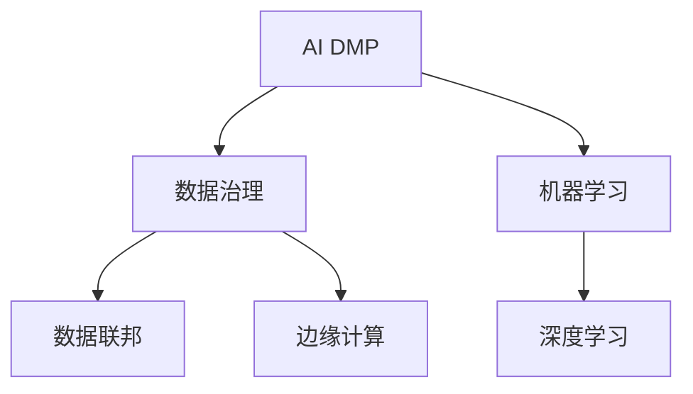

                 

## 1. 背景介绍

在数字经济时代，数据成为重要的生产要素和核心资产。作为数据治理体系的核心组成部分，AI DMP（人工智能驱动的数据管理平台）通过高效整合和利用用户行为数据，实现了精准的用户画像、场景分析与广告投放优化，有力推动了数据驱动型业务的发展。然而，随着用户数据隐私保护要求的提高，以及数据规模的持续增长，AI DMP的数据基建面临着诸多技术挑战。本文将深入探讨AI DMP数据基建的核心概念和关键技术，揭示其在数字营销、智能广告等领域的技术突破与应用潜力。

## 2. 核心概念与联系

### 2.1 核心概念概述

为便于深入理解，本节将首先介绍几个关键概念及其关联性：

- **AI DMP（人工智能驱动的数据管理平台）**：结合机器学习和人工智能技术，AI DMP通过分析用户行为数据，构建精准用户画像，为用户提供个性化推荐和广告投放优化，是数据驱动型业务的重要基础。

- **数据治理**：涉及数据收集、存储、管理、安全等多个环节，是确保数据质量和数据资产价值的基石。AI DMP作为数据治理体系的核心组成部分，通过数据标准化、数据质量控制、数据安全管理等手段，提升数据资产价值。

- **机器学习和深度学习**：通过训练模型学习数据规律，AI DMP能够高效利用海量数据，挖掘用户行为背后的深层次特征，实现精准用户画像和场景分析。

- **数据联邦与边缘计算**：解决用户隐私保护和数据集中存储的需求，通过数据联邦技术在多个数据源之间建立跨域信任机制，同时借助边缘计算技术实现数据分布式处理，减少数据传输和计算负担。

这些概念通过下图的Mermaid流程图展示了其间的联系：



### 2.2 核心概念原理和架构的 Mermaid 流程图


**说明**：这个流程图展示了AI DMP数据治理、机器学习和深度学习、数据联邦与边缘计算等关键组件的架构关系。其中，AI DMP为核心，机器学习和深度学习作为数据治理的重要支撑，数据联邦与边缘计算则优化了数据管理效率。

## 3. 核心算法原理 & 具体操作步骤

### 3.1 算法原理概述

AI DMP的核心算法包括用户画像构建、场景分析、广告投放优化等。本节将介绍这些算法的原理，并分析其核心步骤。

### 3.2 算法步骤详解

AI DMP的算法实现通常包括以下关键步骤：

**Step 1: 数据收集与清洗**

AI DMP首先需要收集用户行为数据，包括浏览、点击、购买等事件记录。在收集数据前，需要明确数据收集目标和来源，确保数据的质量和完整性。数据清洗旨在去除异常、缺失或重复的数据，提升数据可用性。

**Step 2: 数据标准化**

不同来源的数据格式和结构可能存在差异，数据标准化是将不同来源的数据转换为统一的格式和结构，以便后续分析和使用。数据标准化通常包括格式转换、数据类型统一、缺失值处理等操作。

**Step 3: 用户画像构建**

用户画像构建是AI DMP的核心功能之一。通过分析用户行为数据，AI DMP能够构建详细、精准的用户画像，涵盖用户的兴趣偏好、行为特征、消费能力等。构建用户画像时，通常使用机器学习算法，如K-means聚类、关联规则挖掘等，从大量数据中识别出用户的共同特征。

**Step 4: 场景分析**

场景分析是AI DMP的重要应用场景之一。通过分析用户在特定时间、地点、设备上的行为数据，AI DMP能够识别出不同的用户场景，如购物场景、娱乐场景、工作场景等。场景分析对于个性化推荐和广告投放优化具有重要意义。

**Step 5: 广告投放优化**

广告投放优化是AI DMP的核心功能之一。AI DMP通过分析用户画像和场景，结合广告素材和投放策略，进行精准的广告投放。广告投放优化通常包括预算分配、定向广告、实时竞价等环节，旨在最大化广告投放效果，提升广告主收益。

### 3.3 算法优缺点

AI DMP的算法具有以下优点：

- **高效利用数据**：通过机器学习和深度学习技术，AI DMP能够高效利用海量用户行为数据，挖掘深层次用户行为规律，构建精准用户画像。
- **提升广告效果**：结合用户画像和场景分析，AI DMP能够实现精准的广告投放，提升广告投放效果，最大化广告收益。
- **跨域数据融合**：通过数据联邦技术，AI DMP能够实现跨域数据融合，克服数据孤岛问题，提升数据治理效率。

同时，AI DMP的算法也存在一些缺点：

- **数据隐私问题**：在数据收集和分析过程中，用户隐私保护问题难以完全解决，存在数据泄露和隐私泄露的风险。
- **算法复杂度**：AI DMP的算法涉及数据治理、机器学习、深度学习等多个领域，算法实现复杂，需要较高的技术门槛。
- **计算资源需求**：AI DMP涉及大规模数据的处理和分析，对计算资源的需求较高，需配备高性能计算设备。

### 3.4 算法应用领域

AI DMP的算法在多个领域都有广泛应用，包括但不限于：

- **数字营销**：通过精准的用户画像和场景分析，AI DMP能够实现高效的营销策略和广告投放，提升广告效果和转化率。
- **智能广告**：结合用户画像和实时数据分析，AI DMP能够实现智能广告投放，提升广告投放的精准度和效果。
- **个性化推荐**：AI DMP能够构建详细用户画像，结合用户行为数据，实现个性化推荐服务，提升用户体验和满意度。
- **智能客服**：通过分析用户历史行为和实时对话，AI DMP能够提供智能客服解决方案，提升客户服务质量和效率。

这些应用场景展示了AI DMP的广泛应用前景，为数字化业务提供了有力的技术支撑。

## 4. 数学模型和公式 & 详细讲解 & 举例说明

### 4.1 数学模型构建

AI DMP的数学模型构建涉及数据标准化、用户画像构建、场景分析等多个环节。以下将以用户画像构建为例，介绍数学模型的构建过程。

假设用户行为数据为 $D=\{(x_i, y_i)\}_{i=1}^N$，其中 $x_i$ 为用户行为特征向量，$y_i$ 为标签。用户画像构建的目标是找到最优的聚类中心 $\mu_k$，使得 $k$ 个聚类的样本离散度最小。具体地，可以构建如下的k-means聚类模型：

$$
\min_{\mu_k, C} \sum_{i=1}^N \sum_{k=1}^K \rho(x_i, \mu_k)^2
$$

其中，$\rho$ 表示欧式距离，$C$ 为聚类标签，$K$ 为聚类数目。

### 4.2 公式推导过程

k-means聚类算法的具体推导过程如下：

1. 初始化 $K$ 个聚类中心 $\mu_k$。
2. 对于每个样本 $x_i$，计算其到各个聚类中心的距离，并将 $x_i$ 分配到距离最近的聚类中心对应的类别 $C_i$。
3. 更新每个聚类中心的坐标为样本 $x_i$ 的均值，即 $\mu_k = \frac{1}{N_k} \sum_{i \in C_k} x_i$，其中 $N_k$ 为类别 $C_k$ 的样本数量。
4. 重复步骤2和3，直至聚类中心不再变化。

### 4.3 案例分析与讲解

以电商平台的个性化推荐为例，用户画像构建可以采用协同过滤和基于内容的推荐算法。协同过滤算法通过分析用户之间的相似度，推荐相似用户喜爱的商品；基于内容的推荐算法通过分析商品的属性，推荐与用户历史行为相似的商品。

## 5. 项目实践：代码实例和详细解释说明

### 5.1 开发环境搭建

AI DMP的开发环境搭建主要包括以下几个步骤：

1. 安装Python：Python是AI DMP开发的主要语言。可以下载并安装Python解释器和相关依赖库。

2. 安装机器学习库：安装常用的机器学习库，如Scikit-learn、TensorFlow等，用于实现AI DMP的核心算法。

3. 安装数据处理库：安装Pandas、NumPy等数据处理库，用于数据清洗、数据标准化等操作。

4. 安装可视化库：安装Matplotlib、Seaborn等可视化库，用于数据可视化分析。

### 5.2 源代码详细实现

以下以协同过滤算法为例，展示AI DMP的用户画像构建过程。

```python
import numpy as np
from sklearn.cluster import KMeans

# 假设用户行为数据为 [(x1, y1), (x2, y2), ...]
data = np.array([[1, 2, 3], [4, 5, 6], [7, 8, 9], [10, 11, 12]])

# 初始化KMeans聚类模型
kmeans = KMeans(n_clusters=2)

# 拟合数据
kmeans.fit(data)

# 输出聚类中心
print("聚类中心：", kmeans.cluster_centers_)
```

### 5.3 代码解读与分析

以上代码实现了基本的k-means聚类算法，用于构建用户画像。具体步骤如下：

1. 使用NumPy创建用户行为数据。
2. 使用Scikit-learn的KMeans类初始化聚类模型，设置聚类数目为2。
3. 使用拟合函数fit(data)对数据进行聚类，得到聚类中心。
4. 输出聚类中心。

## 6. 实际应用场景

### 6.1 数字营销

在数字营销领域，AI DMP能够实现精准的用户画像和场景分析，实现高效的营销策略和广告投放。例如，电商平台可以利用AI DMP分析用户行为数据，构建详细的用户画像，结合用户兴趣和行为特征，实现精准的广告投放。同时，AI DMP能够实时分析用户行为数据，调整广告投放策略，提升广告效果。

### 6.2 智能广告

智能广告是AI DMP的重要应用场景之一。通过分析用户画像和实时数据分析，AI DMP能够实现智能广告投放，提升广告投放的精准度和效果。例如，新闻网站可以通过AI DMP分析用户历史浏览记录和实时浏览行为，实现个性化推荐和智能广告投放，提升用户点击率和广告收益。

### 6.3 个性化推荐

AI DMP在个性化推荐中具有重要应用。通过构建详细用户画像，AI DMP能够结合用户行为数据，实现个性化推荐服务。例如，视频平台可以利用AI DMP分析用户历史观看记录和实时观看行为，推荐用户可能感兴趣的视频内容，提升用户体验和满意度。

### 6.4 智能客服

智能客服是AI DMP的另一个重要应用场景。通过分析用户历史行为和实时对话，AI DMP能够提供智能客服解决方案，提升客户服务质量和效率。例如，电商平台可以通过AI DMP分析用户历史购买记录和实时咨询记录，实现智能客服，解答用户疑问，提升客户满意度。

## 7. 工具和资源推荐

### 7.1 学习资源推荐

为了帮助开发者掌握AI DMP的核心技术，以下是几个推荐的学习资源：

1. 《机器学习实战》：介绍机器学习算法的基本原理和实现方法，适合入门学习。
2. 《深度学习》：介绍深度学习算法的基本原理和实现方法，适合深入学习。
3. 《Python数据科学手册》：介绍Python数据处理和机器学习库的使用方法，适合实战练习。
4. 《TensorFlow官方文档》：提供TensorFlow库的详细文档和教程，适合深入学习。
5. 《KMeans算法原理及Python实现》：介绍KMeans算法的基本原理和Python实现，适合实战练习。

### 7.2 开发工具推荐

以下是几个推荐的开发工具：

1. PyCharm：功能强大的Python开发环境，支持代码调试、版本控制等功能。
2. Anaconda：Python环境管理工具，支持虚拟环境创建和管理。
3. Jupyter Notebook：交互式编程环境，支持Python代码的快速迭代和调试。
4. TensorBoard：TensorFlow配套的可视化工具，用于展示模型训练状态和结果。

### 7.3 相关论文推荐

以下是几篇推荐的相关论文：

1. 《K-means算法原理及Python实现》：详细介绍K-means算法的基本原理和Python实现，适合实战练习。
2. 《深度学习》：介绍深度学习算法的基本原理和实现方法，适合深入学习。
3. 《机器学习实战》：介绍机器学习算法的基本原理和实现方法，适合入门学习。

## 8. 总结：未来发展趋势与挑战

### 8.1 研究成果总结

本文详细介绍了AI DMP的数据基建技术，包括数据治理、机器学习和深度学习、数据联邦与边缘计算等核心技术。通过理论分析与代码实践，揭示了AI DMP在数字营销、智能广告、个性化推荐、智能客服等领域的广泛应用。未来，随着技术的不断进步，AI DMP的数据基建将进一步提升数据的治理效率，推动数据驱动型业务的持续发展。

### 8.2 未来发展趋势

未来，AI DMP的数据基建技术将呈现以下发展趋势：

1. **数据治理的智能化**：通过引入人工智能技术，AI DMP能够实现数据的智能治理，提升数据质量和数据价值。例如，AI DMP可以利用深度学习技术自动检测和修复数据质量问题，提升数据治理效率。
2. **数据联邦的分布式**：未来，AI DMP将进一步扩展数据联邦的范围，实现数据的分布式管理和分析。通过多中心的数据融合，AI DMP能够解决数据孤岛问题，提升数据治理效率和数据利用率。
3. **边缘计算的普及化**：随着边缘计算技术的普及，AI DMP将逐步实现数据的本地处理和分析。通过边缘计算技术，AI DMP能够减少数据传输和计算负担，提升数据处理效率。

### 8.3 面临的挑战

尽管AI DMP的数据基建技术在多个领域取得了显著进展，但在未来发展中仍面临以下挑战：

1. **数据隐私保护**：在数据治理过程中，如何保护用户隐私和数据安全，是AI DMP亟待解决的问题。需要引入隐私保护技术和加密算法，确保数据的安全和隐私保护。
2. **数据标准化**：不同来源的数据格式和结构可能存在差异，如何实现数据标准化和统一处理，是AI DMP需要解决的重要问题。
3. **算法复杂度**：AI DMP的算法涉及数据治理、机器学习、深度学习等多个领域，算法实现复杂，需要较高的技术门槛。

### 8.4 研究展望

未来的研究需要在以下几个方面寻求新的突破：

1. **数据治理的智能化**：引入人工智能技术，实现数据的自动检测和修复，提升数据治理效率。
2. **数据联邦的分布式**：拓展数据联邦的范围，实现数据的分布式管理和分析，提升数据治理效率和数据利用率。
3. **边缘计算的普及化**：通过边缘计算技术，实现数据的本地处理和分析，提升数据处理效率。
4. **数据隐私保护**：引入隐私保护技术和加密算法，确保数据的安全和隐私保护。

这些研究方向和突破将进一步推动AI DMP的数据基建技术的发展，为数字化业务提供更加高效、智能的数据治理方案。

## 9. 附录：常见问题与解答

**Q1: AI DMP如何实现高效的数据治理？**

A: AI DMP通过引入人工智能技术，实现数据的智能化治理。例如，AI DMP可以利用深度学习技术自动检测和修复数据质量问题，提升数据治理效率。此外，AI DMP还支持数据标准化和数据分类，提升数据治理的规范性和一致性。

**Q2: AI DMP如何实现数据的智能化处理？**

A: AI DMP通过机器学习和深度学习技术，实现数据的智能化处理。例如，AI DMP可以利用协同过滤算法和基于内容的推荐算法，构建详细用户画像，实现个性化推荐服务。此外，AI DMP还可以实现实时数据分析和场景分析，提升广告投放效果和用户满意度。

**Q3: AI DMP如何确保数据的安全和隐私保护？**

A: AI DMP通过引入隐私保护技术和加密算法，确保数据的安全和隐私保护。例如，AI DMP可以使用数据脱敏技术，去除敏感信息，确保数据的安全。此外，AI DMP还支持数据加密和访问控制，确保数据的使用受到严格的监管。

**Q4: AI DMP在数字营销中的具体应用是什么？**

A: AI DMP在数字营销中的具体应用包括精准用户画像、场景分析和广告投放优化。例如，电商平台可以利用AI DMP分析用户行为数据，构建详细的用户画像，结合用户兴趣和行为特征，实现精准的广告投放。同时，AI DMP能够实时分析用户行为数据，调整广告投放策略，提升广告效果。

**Q5: AI DMP在智能广告中的具体应用是什么？**

A: AI DMP在智能广告中的具体应用包括个性化推荐和智能广告投放。例如，新闻网站可以通过AI DMP分析用户历史浏览记录和实时浏览行为，实现个性化推荐和智能广告投放，提升用户点击率和广告收益。此外，AI DMP还可以实现实时数据分析，优化广告投放策略，提升广告效果。

---

作者：禅与计算机程序设计艺术 / Zen and the Art of Computer Programming

