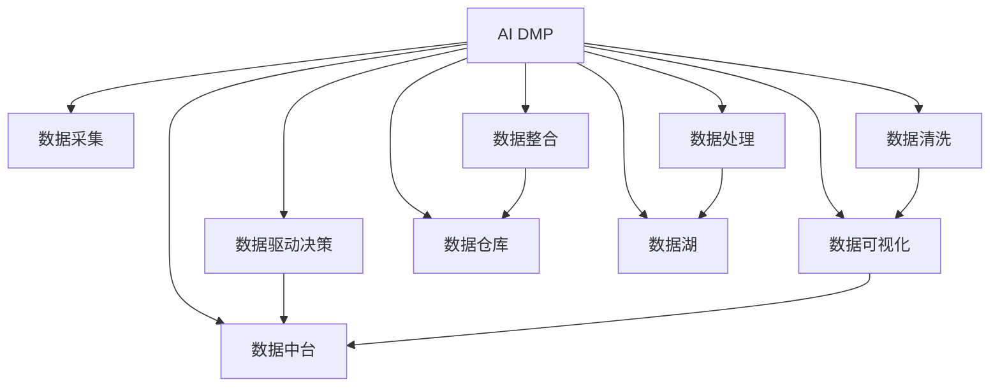

                 

# AI DMP 数据基建：构建数据驱动的营销生态

## 1. 背景介绍

### 1.1 问题由来
在数字化转型的浪潮下，数据驱动的营销生态成为企业获取竞争优势的重要手段。然而，传统的营销模式受限于数据孤岛、数据质量差、数据流动性低等问题，难以实现精准高效的客户管理和个性化营销。而人工智能驱动的数据管理平台（AI Data Management Platform, AI DMP），能够将企业内外部的数据统一管理，结合机器学习技术进行数据处理和分析，以数据驱动的方式优化营销策略，实现客户细分、个性化推荐、营销效果预测等应用场景，为营销生态带来革命性变化。

### 1.2 问题核心关键点
AI DMP的核心在于将数据资产转化为可操作的营销智能，为营销决策提供数据支持。具体包括：
1. 数据采集：从多个数据源（如网站、应用、社交媒体、CRM等）自动采集用户行为数据和属性数据。
2. 数据清洗：对采集到的数据进行去重、降噪、格式转换等预处理，确保数据质量。
3. 数据整合：将清洗后的数据进行统一存储和管理，构建完整的数据图谱。
4. 数据处理：应用机器学习技术对数据进行聚类、分类、回归等处理，提取用户行为和属性特征。
5. 数据驱动决策：通过数据可视化、用户画像、行为预测等工具，为营销决策提供数据支持，优化广告投放、客户细分、个性化推荐等策略。

## 2. 核心概念与联系

### 2.1 核心概念概述

为更好地理解AI DMP的构建，本节将介绍几个密切相关的核心概念：

- AI Data Management Platform (AI DMP)：利用AI技术对企业内外部的数据进行整合、清洗、处理，以数据驱动的方式优化营销策略的数据管理平台。
- Customer Data Platform (CDP)：一种数据管理平台，用于收集和管理客户数据，通过标签化、分段、个性化推荐等方式提升客户体验。
- 数据仓库(Data Warehouse)：集中存储企业历史业务数据的仓库，支持大规模数据存储、查询和分析。
- 数据湖(Data Lake)：一种大数据技术架构，支持海量非结构化数据的存储和分析。
- 数据中台(Data Platform)：集成了数据治理、数据管理、数据服务等功能，支持企业数据驱动决策的平台。
- 数据可视化(Dashboard)：利用图表、仪表盘等工具，将数据进行直观展示，辅助决策分析。

这些概念之间的逻辑关系可以通过以下Mermaid流程图来展示：



这个流程图展示了几大核心概念之间的联系：

1. AI DMP将数据采集、清洗、整合、处理和驱动决策环节集成，实现数据的全生命周期管理。
2. 数据仓库、数据湖、数据中台等功能模块，为AI DMP提供了数据管理和存储支持。
3. 数据可视化工具，使决策者能够直观地看到数据分布和趋势，辅助决策分析。
4. 数据驱动决策和数据仓库/数据湖/数据中台，构成了数据驱动决策的生态。

## 3. 核心算法原理 & 具体操作步骤
### 3.1 算法原理概述

AI DMP的核心算法原理主要基于数据清洗、数据整合、数据处理和数据驱动决策等几个关键环节，具体如下：

1. 数据清洗：通过数据去重、降噪、格式转换等预处理步骤，确保数据的完整性和一致性。
2. 数据整合：将不同来源的数据进行统一存储和管理，构建完整的数据图谱。
3. 数据处理：应用机器学习技术对数据进行聚类、分类、回归等处理，提取用户行为和属性特征。
4. 数据驱动决策：通过数据可视化、用户画像、行为预测等工具，为营销决策提供数据支持，优化广告投放、客户细分、个性化推荐等策略。

### 3.2 算法步骤详解

1. 数据采集：
   - 从网站、应用、社交媒体、CRM等数据源自动采集用户行为数据和属性数据。
   - 利用API接口或SDK插件，实现数据的实时抓取和采集。
   - 数据采集需遵循隐私合规要求，避免侵犯用户隐私。

2. 数据清洗：
   - 对采集到的数据进行去重、降噪、格式转换等预处理，确保数据的完整性和一致性。
   - 去除重复、异常、不完整的数据记录。
   - 对字符串、日期、数值等数据进行格式转换，统一标准。
   - 利用ETL工具（如Apache Nifi、Talend）进行数据清洗和转换。

3. 数据整合：
   - 将清洗后的数据进行统一存储和管理，构建完整的数据图谱。
   - 利用数据仓库或数据湖技术，实现数据的集中存储和管理。
   - 通过数据同步工具（如Apache Kafka、RabbitMQ）实现数据的实时同步和更新。
   - 构建统一的数据模型和元数据，方便后续的数据处理和分析。

4. 数据处理：
   - 应用机器学习技术对数据进行聚类、分类、回归等处理，提取用户行为和属性特征。
   - 利用深度学习模型（如K-means、SVM、神经网络等）对用户行为和属性进行建模。
   - 提取用户画像、行为特征、兴趣标签等关键信息，用于后续的营销决策。
   - 使用特征选择和降维技术（如PCA、LDA）优化特征集，提高数据处理效率。

5. 数据驱动决策：
   - 通过数据可视化、用户画像、行为预测等工具，为营销决策提供数据支持。
   - 利用数据仪表盘（如Tableau、Power BI）展示数据分布和趋势。
   - 生成用户画像，了解客户特征、行为和偏好。
   - 利用行为预测模型（如ARIMA、随机森林、梯度提升树）预测用户行为，优化广告投放、客户细分、个性化推荐等策略。

### 3.3 算法优缺点

AI DMP算法的主要优点包括：
1. 数据整合能力强大。通过数据采集、清洗、整合和处理，能够实现全生命周期的数据管理。
2. 支持多种数据源。支持从网站、应用、社交媒体、CRM等多个数据源采集数据，确保数据全面性。
3. 数据处理能力强。利用机器学习技术进行数据处理，提取用户行为和属性特征，提升数据利用率。
4. 数据驱动决策。通过数据可视化、用户画像和行为预测，为营销决策提供数据支持，优化广告投放、客户细分、个性化推荐等策略。

但该算法也存在一些局限性：
1. 数据采集成本高。需要投入大量人力和资源，实现对多个数据源的实时采集。
2. 数据处理复杂度高。需应用复杂的机器学习模型进行数据处理，对技术和资源要求较高。
3. 数据隐私问题。需注意数据采集和处理过程中的隐私保护，避免侵犯用户隐私。
4. 数据质量控制。数据清洗和预处理环节需确保数据质量和一致性，避免数据噪音对后续决策的影响。
5. 技术门槛较高。构建和维护AI DMP系统需要专业的数据科学家和工程师，技术门槛较高。

尽管存在这些局限性，但AI DMP以其强大的数据整合和处理能力，为营销生态带来显著的提升。未来相关研究的方向在于如何进一步降低数据采集成本、提高数据处理效率、保护数据隐私、降低技术门槛，使AI DMP更加普及和易用。

### 3.4 算法应用领域

AI DMP在多个领域都有广泛应用，如：

- 电子商务：通过用户行为数据和属性数据，进行客户细分、个性化推荐、广告投放优化等，提升电商转化率和用户体验。
- 金融服务：利用用户交易数据和信用数据，进行用户画像和行为预测，优化贷款审批、风险管理、个性化营销等策略。
- 旅游业：通过用户出行数据和偏好数据，进行客户细分和行为预测，优化旅游推荐和营销活动。
- 媒体和娱乐：利用用户观看和浏览数据，进行内容推荐、广告投放优化和用户画像，提升媒体和娱乐平台的用户粘性和收益。
- 健康医疗：通过患者医疗数据和健康数据，进行疾病预测、健康管理和个性化医疗，提升医疗服务质量和患者体验。

## 4. 数学模型和公式 & 详细讲解 & 举例说明

### 4.1 数学模型构建

AI DMP的数据处理过程涉及多个环节，包括数据采集、清洗、整合、处理和驱动决策等。以下将介绍几个关键的数学模型：

1. 数据清洗模型：用于处理数据去重、降噪、格式转换等预处理任务。
2. 数据整合模型：用于构建统一的数据图谱，支持数据的集中存储和管理。
3. 数据处理模型：用于提取用户行为和属性特征，包括聚类、分类、回归等处理。
4. 数据驱动决策模型：用于进行用户画像、行为预测等，支持营销决策。

### 4.2 公式推导过程

以用户画像生成为例，介绍核心数学模型的推导过程。

假设用户数据集为 $D=\{(x_i,y_i)\}_{i=1}^N, x_i \in \mathcal{X}, y_i \in \mathcal{Y}$，其中 $x_i$ 为特征向量， $y_i$ 为标签。用户画像的生成过程包括特征提取、聚类和降维等步骤。

特征提取：
假设特征提取模型为 $f(x_i)=\{f_1(x_i),f_2(x_i),...,f_k(x_i)\}$，其中 $f_j(x_i)$ 为第 $j$ 个特征提取器，将原始特征 $x_i$ 转化为向量 $f_j(x_i)$。

聚类：
假设聚类模型为 $k$ 均值聚类算法，将特征向量聚类为 $K$ 个簇 $C_k=\{C_1,...,C_K\}$。

降维：
假设降维模型为PCA算法，将特征向量 $x_i$ 降维到低维空间 $z_i=f_{PCA}(x_i)$，其中 $f_{PCA}(x_i)$ 为PCA降维映射函数。

用户画像生成过程的数学公式如下：

$$
y_i^* = \mathop{\arg\min}_{z_i} \|z_i - \mu_C\|^2 + \lambda \|z_i\|^2
$$

其中 $\mu_C$ 为簇 $C_k$ 的中心向量， $\lambda$ 为正则化系数。

通过上述公式，我们可以得到用户画像生成过程的数学模型，并利用优化算法求解最优解。

### 4.3 案例分析与讲解

假设某电商企业想要基于AI DMP构建个性化推荐系统，提升用户购物体验。数据采集阶段，企业从其网站和应用中收集用户的浏览、购买、评分等行为数据，并从社交媒体和第三方数据源获取用户的兴趣标签、人口统计信息等属性数据。

数据清洗阶段，利用数据去重、降噪、格式转换等预处理工具，确保数据质量和一致性。

数据整合阶段，将清洗后的数据存储到数据仓库中，构建统一的数据图谱，并实现数据的实时同步和更新。

数据处理阶段，利用深度学习模型对用户行为和属性数据进行处理，提取用户画像和行为特征。通过聚类算法，将用户分为不同的群体，生成用户画像。

数据驱动决策阶段，利用行为预测模型对用户行为进行预测，生成个性化推荐列表。通过数据仪表盘展示用户画像和行为预测结果，辅助营销决策。

## 5. 项目实践：代码实例和详细解释说明
### 5.1 开发环境搭建

在进行AI DMP项目实践前，我们需要准备好开发环境。以下是使用Python进行PySpark开发的环境配置流程：

1. 安装Anaconda：从官网下载并安装Anaconda，用于创建独立的Python环境。

2. 创建并激活虚拟环境：
```bash
conda create -n pyspark-env python=3.8 
conda activate pyspark-env
```

3. 安装PySpark：根据CUDA版本，从官网获取对应的安装命令。例如：
```bash
conda install pyspark -c conda-forge
```

4. 安装各类工具包：
```bash
pip install numpy pandas scikit-learn matplotlib tqdm jupyter notebook ipython
```

完成上述步骤后，即可在`pyspark-env`环境中开始AI DMP实践。

### 5.2 源代码详细实现

下面我们以用户画像生成为例，给出使用PySpark对用户行为数据进行处理的PySpark代码实现。

首先，定义数据处理函数：

```python
from pyspark.sql import SparkSession
from pyspark.sql.functions import col, split, struct, flatten, udf
from pyspark.ml import Pipeline
from pyspark.ml.feature import VectorAssembler, PCA

spark = SparkSession.builder.appName('UserProfiles').getOrCreate()

# 定义特征提取器
def extract_features(data):
    return [col('browsing').collect()[0], col('purchasing').collect()[0], col('rating').collect()[0], col('interests').collect()[0], col('age').collect()[0]]

# 定义聚类函数
from pyspark.ml.clustering import KMeans

def kmeans_clustering(data):
    kmeans = KMeans(k=3, initialSize=10)
    model = kmeans.fit(data)
    return model.transform(data)

# 定义降维函数
def pca_reduction(data):
    assembler = VectorAssembler(inputCols=['features'], outputCol='features')
    reduced = PCA(k=2, inputCol='features', outputCol='reduced')
    pipeline = Pipeline(stages=[assembler, reduced])
    model = pipeline.fit(data)
    return model.transform(data)

# 数据处理步骤
def data_processing():
    df = spark.read.format('csv').option('header', 'true').load('data.csv')
    features = extract_features(df)
    clusters = kmeans_clustering(features)
    reduced = pca_reduction(clusters)
    return reduced
```

然后，定义用户画像生成函数：

```python
def generate_user_profiles():
    reduced = data_processing()
    kmeans = KMeans(k=3, initialSize=10)
    model = kmeans.fit(reduced.select('reduced'))
    return model.transform(reduced.select('reduced'))
```

最后，启动数据处理和用户画像生成流程：

```python
from pyspark.sql.functions import col, split, struct, flatten, udf
from pyspark.ml import Pipeline
from pyspark.ml.feature import VectorAssembler, PCA
from pyspark.ml.clustering import KMeans

spark = SparkSession.builder.appName('UserProfiles').getOrCreate()

# 数据处理步骤
def data_processing():
    df = spark.read.format('csv').option('header', 'true').load('data.csv')
    features = extract_features(df)
    clusters = kmeans_clustering(features)
    reduced = pca_reduction(clusters)
    return reduced

# 用户画像生成函数
def generate_user_profiles():
    reduced = data_processing()
    kmeans = KMeans(k=3, initialSize=10)
    model = kmeans.fit(reduced.select('reduced'))
    return model.transform(reduced.select('reduced'))

# 启动数据处理和用户画像生成
profiles = generate_user_profiles()

# 输出用户画像结果
profiles.show()
```

以上就是使用PySpark对用户行为数据进行处理的完整代码实现。可以看到，得益于PySpark的强大分布式计算能力，用户画像生成过程的代码实现相对简洁。

### 5.3 代码解读与分析

让我们再详细解读一下关键代码的实现细节：

**数据处理函数**：
- `extract_features`函数：用于提取用户行为数据中的浏览、购买、评分和兴趣标签、人口统计信息等特征。
- `kmeans_clustering`函数：利用K均值聚类算法对用户特征进行聚类，生成用户画像。
- `pca_reduction`函数：利用PCA算法对用户特征进行降维处理，生成低维用户画像。

**用户画像生成函数**：
- 调用数据处理函数进行用户行为数据的特征提取和聚类处理。
- 利用K均值聚类算法生成用户画像。

**启动数据处理和用户画像生成**：
- 定义数据处理步骤，包括特征提取、聚类和降维。
- 定义用户画像生成函数，进行K均值聚类和用户画像生成。
- 启动数据处理和用户画像生成流程。

可以看到，PySpark提供了丰富的机器学习库和工具，使得数据处理和用户画像生成的代码实现变得相对简单。开发者可以将更多精力放在数据处理逻辑的优化和调整上，而不必过多关注底层实现细节。

当然，工业级的系统实现还需考虑更多因素，如数据源的多样性、数据流的实时性、系统的可扩展性等。但核心的数据处理逻辑基本与此类似。

## 6. 实际应用场景
### 6.1 智能推荐系统

AI DMP在智能推荐系统中有着广泛的应用。智能推荐系统利用用户行为数据和属性数据，通过聚类、分类、回归等处理，生成用户画像和行为特征，用于个性化推荐、广告投放优化等应用场景，提升推荐效果和用户体验。

在技术实现上，可以收集用户的历史浏览、购买、评分等行为数据，并从社交媒体和第三方数据源获取用户的兴趣标签、人口统计信息等属性数据。将数据输入到AI DMP系统中，通过数据处理和聚类，生成用户画像和行为特征。最后，利用行为预测模型对用户行为进行预测，生成个性化推荐列表，通过数据仪表盘展示用户画像和行为预测结果，辅助推荐策略的优化。

### 6.2 用户细分和行为预测

AI DMP还可以应用于用户细分和行为预测，帮助企业更精准地了解客户需求和行为模式，提升营销效果。通过用户行为数据和属性数据的清洗、整合和处理，生成用户画像和行为特征，对用户进行细分和聚类。利用行为预测模型对用户行为进行预测，预测用户的未来行为，优化营销策略和客户服务。

例如，某电商平台利用AI DMP对用户进行细分和行为预测，生成用户画像和行为特征，对用户进行精准推荐和营销。利用用户行为预测模型对用户未来的购买行为进行预测，提前预警用户流失，及时采取措施挽留用户，提升用户粘性和平台收益。

### 6.3 数据治理和数据治理

AI DMP还可以帮助企业进行数据治理和数据质量管理，确保数据的准确性、完整性和一致性，提升数据利用率。通过数据采集、清洗、整合和处理，生成统一的数据图谱，支持数据的集中管理和存储。利用数据可视化工具，对数据进行监控和分析，及时发现和修复数据质量问题，确保数据可用性和可靠性。

例如，某金融机构利用AI DMP对客户数据进行治理和质量管理，确保数据的准确性和完整性。通过数据采集、清洗、整合和处理，生成统一的数据图谱，支持数据的集中管理和存储。利用数据可视化工具，对数据进行监控和分析，及时发现和修复数据质量问题，确保数据可用性和可靠性。

### 6.4 未来应用展望

随着AI DMP技术的不断成熟，其在更多领域和场景中的应用前景将更加广阔。未来，AI DMP有望在以下几个方向实现突破：

1. 数据联邦和边缘计算：在数据联邦和边缘计算架构下，实现跨企业、跨区域的数据共享和协同，提升数据利用率。
2. 联邦学习：利用联邦学习技术，在保护用户隐私的前提下，实现跨企业的数据协同学习，提升模型性能。
3. 实时数据流处理：利用流式计算框架，实现实时数据流处理和分析，提升数据处理的时效性。
4. 边缘AI：在边缘计算环境下，实现数据处理和决策推理的本地化，降低数据传输成本，提升数据处理效率。
5. 跨模态数据融合：利用跨模态数据融合技术，实现视觉、语音、文本等多模态数据的整合和分析，提升数据的全面性和准确性。

这些方向的探索和发展，将进一步拓展AI DMP的应用范围和深度，为营销生态带来革命性变化。

## 7. 工具和资源推荐
### 7.1 学习资源推荐

为了帮助开发者系统掌握AI DMP的理论基础和实践技巧，这里推荐一些优质的学习资源：

1. 《Python数据科学手册》：详细介绍了数据处理、机器学习、数据可视化等基础概念和实践技巧。
2. 《机器学习实战》：介绍了机器学习算法和实现方法，适用于动手实践。
3. 《大数据处理》课程：斯坦福大学开设的大数据课程，涵盖Hadoop、Spark等大数据技术。
4. Kaggle竞赛平台：提供丰富的数据集和竞赛，有助于提高数据处理和机器学习技能。
5. Apache Spark官方文档：详细介绍了Spark的分布式计算框架和API接口。

通过对这些资源的学习实践，相信你一定能够快速掌握AI DMP的理论基础和实践技巧，并用于解决实际的AI DMP问题。

### 7.2 开发工具推荐

高效的开发离不开优秀的工具支持。以下是几款用于AI DMP开发的常用工具：

1. Apache Spark：Apache基金会开源的分布式计算框架，支持大规模数据处理和分析。
2. Hadoop：Apache基金会开源的大数据处理平台，支持大规模数据存储和处理。
3. PySpark：基于Python的Spark API，支持Spark的分布式计算和机器学习功能。
4. Apache Flink：Apache基金会开源的流式计算框架，支持实时数据流处理和分析。
5. Pandas：基于Python的数据处理库，支持数据清洗、处理和分析。
6. Scikit-learn：基于Python的机器学习库，支持数据建模、聚类、分类等。

合理利用这些工具，可以显著提升AI DMP开发和测试的效率，加快创新迭代的步伐。

### 7.3 相关论文推荐

AI DMP的开发和应用涉及多个前沿技术领域，以下几篇论文代表了大数据和机器学习领域的最新进展，推荐阅读：

1. "Data Mining: Concepts and Techniques"：数据挖掘领域经典教材，涵盖数据采集、处理、挖掘和应用等多个环节。
2. "Machine Learning Yearning"：Andrew Ng著，介绍了机器学习的基础概念和实践技巧，适用于动手实践。
3. "Big Data: Principles and Best Practices of Scalable Real-time Data Systems"：大数据领域经典教材，涵盖Hadoop、Spark等分布式计算框架的原理和应用。
4. "Federated Learning: A Systematic Survey"：综述了联邦学习领域的最新进展，适用于了解联邦学习的基本概念和应用场景。
5. "A Survey on Big Data Processing Technologies"：大数据处理领域综述性论文，涵盖了Hadoop、Spark、Flink等大数据处理框架的最新进展。

这些论文代表了大数据和机器学习领域的最新进展，通过学习这些前沿成果，可以帮助研究者把握学科前进方向，激发更多的创新灵感。

## 8. 总结：未来发展趋势与挑战

### 8.1 总结

本文对AI DMP的数据基建进行全面系统的介绍。首先阐述了AI DMP的构建背景和意义，明确了其在数据驱动营销生态中的重要作用。其次，从原理到实践，详细讲解了AI DMP的数据处理和驱动决策等关键环节，给出了AI DMP项目实践的完整代码实例。同时，本文还探讨了AI DMP在多个领域的应用场景，展示了其巨大的应用价值。最后，本文精选了AI DMP的学习资源、开发工具和相关论文，力求为开发者提供全方位的技术指引。

通过本文的系统梳理，可以看到，AI DMP技术通过数据采集、清洗、整合、处理和驱动决策等环节，实现了数据的全面管理和高效利用，为营销生态带来了革命性变化。未来，AI DMP将在更多领域和场景中得到应用，为各行各业带来更加智能化的营销服务。

### 8.2 未来发展趋势

展望未来，AI DMP技术将呈现以下几个发展趋势：

1. 数据联邦和边缘计算：在数据联邦和边缘计算架构下，实现跨企业、跨区域的数据共享和协同，提升数据利用率。
2. 联邦学习：利用联邦学习技术，在保护用户隐私的前提下，实现跨企业的数据协同学习，提升模型性能。
3. 实时数据流处理：利用流式计算框架，实现实时数据流处理和分析，提升数据处理的时效性。
4. 边缘AI：在边缘计算环境下，实现数据处理和决策推理的本地化，降低数据传输成本，提升数据处理效率。
5. 跨模态数据融合：利用跨模态数据融合技术，实现视觉、语音、文本等多模态数据的整合和分析，提升数据的全面性和准确性。

这些趋势将进一步拓展AI DMP的应用范围和深度，为营销生态带来更多创新和突破。

### 8.3 面临的挑战

尽管AI DMP技术已经取得了诸多进展，但在其发展过程中仍面临以下挑战：

1. 数据隐私问题：在数据采集和处理过程中，需注意数据隐私保护，避免侵犯用户隐私。
2. 数据质量控制：需确保数据清洗和预处理环节的数据质量和一致性，避免数据噪音对后续决策的影响。
3. 技术复杂度：AI DMP的构建和维护需要专业的数据科学家和工程师，技术门槛较高。
4. 系统可扩展性：需确保系统在处理大规模数据时的可扩展性和可靠性，避免系统性能瓶颈。
5. 数据孤岛问题：需打破数据孤岛，实现企业内外数据的整合和共享，提升数据利用率。

尽管存在这些挑战，但随着技术的不断进步和应用场景的不断拓展，AI DMP有望在更广泛的领域得到应用，提升企业的竞争力和市场地位。

### 8.4 研究展望

面向未来，AI DMP技术需要在以下几个方面进行研究：

1. 数据隐私保护：开发更加安全的数据采集和处理技术，确保用户隐私得到保护。
2. 数据质量控制：研究数据清洗和预处理的新方法，提高数据利用率。
3. 技术可扩展性：开发高效的分布式计算和流式计算技术，提升系统可扩展性。
4. 系统安全性：研究系统的安全防护机制，确保系统的稳定性和可靠性。
5. 跨模态数据融合：研究跨模态数据融合的新技术，提升数据的全面性和准确性。

这些研究方向将引领AI DMP技术的持续发展和创新，为各行各业带来更加智能化的营销服务。

## 9. 附录：常见问题与解答

**Q1：AI DMP是否适用于所有营销场景？**

A: AI DMP适用于需要大量数据支持的营销场景，如电子商务、金融服务、旅游业、媒体和娱乐等领域。但对于某些特定的营销场景，如个性化定制、品牌推广等，AI DMP可能存在局限性，需结合其他技术手段进行优化。

**Q2：如何选择合适的数据源？**

A: 在选择数据源时，需考虑数据的丰富性、准确性和实时性。一般来说，电商网站的交易数据、社交媒体的用户互动数据、第三方数据平台的数据等都是较好的数据源选择。需根据具体的营销需求和业务场景，选择合适的数据源进行数据采集。

**Q3：AI DMP的部署环境需考虑哪些因素？**

A: AI DMP的部署环境需考虑数据采集、数据处理和数据存储的物理位置，确保数据的实时性和可靠性。同时，需考虑系统的可扩展性、安全性、可用性等关键因素。一般来说，可以将AI DMP部署在云端或边缘计算环境中，实现数据的分布式管理和处理。

**Q4：AI DMP在数据处理过程中，如何保证数据隐私？**

A: 在数据处理过程中，需注意数据隐私保护，避免侵犯用户隐私。可以采用数据脱敏、数据匿名化、联邦学习等技术手段，确保数据隐私得到保护。同时，需建立完善的数据访问和权限管理机制，限制数据的访问和使用范围。

**Q5：AI DMP在实际应用中，如何优化模型性能？**

A: AI DMP在实际应用中，需结合数据采集、数据处理和数据驱动决策等多个环节进行优化。可以通过优化特征提取器、选择合适的聚类算法、应用行为预测模型等手段，提升模型性能。同时，需定期评估模型效果，及时调整和优化模型参数，确保模型始终处于最优状态。

**Q6：AI DMP在构建和维护过程中，需注意哪些问题？**

A: 在构建和维护AI DMP过程中，需注意数据隐私保护、数据质量控制、技术复杂度、系统可扩展性等多个问题。需建立完善的数据治理和质量管理机制，确保数据的准确性、完整性和一致性。同时，需确保系统的可扩展性和可靠性，避免系统性能瓶颈。

**Q7：AI DMP在实际应用中，如何确保数据的安全性和可靠性？**

A: 在实际应用中，需建立完善的数据访问和权限管理机制，确保数据的安全性和可靠性。可以采用数据加密、数据备份、灾备恢复等技术手段，防止数据丢失和泄露。同时，需建立完善的数据审计和监控机制，及时发现和修复数据质量问题，确保数据的可用性和可靠性。

总之，AI DMP作为数据驱动营销生态的重要工具，在多个领域和场景中得到了广泛应用，提升了营销效果和用户体验。未来，随着技术的不断进步和应用场景的不断拓展，AI DMP必将在更多领域得到应用，为各行各业带来更加智能化的营销服务。面向未来，AI DMP技术需要在数据隐私保护、数据质量控制、技术可扩展性、系统安全性等多个方面进行深入研究，确保数据驱动营销生态的健康发展。

---

作者：禅与计算机程序设计艺术 / Zen and the Art of Computer Programming

