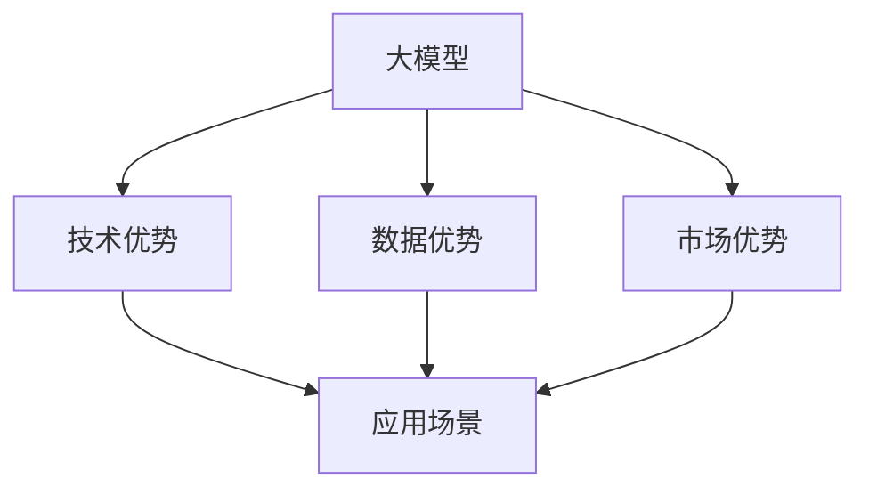

                 

## 1. 背景介绍

在过去的几年里，AI大模型的技术实力已经得到了显著提升，尤其在自然语言处理(NLP)、计算机视觉(CV)、语音识别等领域取得了重大突破。这些大模型不仅能够执行复杂的任务，还能在多领域、多场景中应用，因此具有极高的商业价值。然而，尽管大模型的技术实力强大，但将其转化为商业成功的关键在于如何利用这些优势。本文将探讨如何通过技术优势、数据优势和市场优势，实现AI大模型的商业化。

## 2. 核心概念与联系

### 2.1 核心概念概述

在深入讨论如何利用AI大模型的商业优势之前，首先需要明确一些核心概念：

- **大模型**：指通过大规模数据训练出来的模型，例如GPT-3、BERT、YOLO等。它们通常具有大规模的参数量和先进的架构设计，能够执行复杂的任务，并在多领域、多场景中应用。

- **商业优势**：指通过大模型的技术实力、数据优势和市场优势，在商业化过程中获得的竞争优势。

- **技术优势**：指大模型的先进算法、架构设计和高性能表现，使其在处理复杂任务时具有优势。

- **数据优势**：指大模型在处理大规模数据集时具有优势，能够通过海量数据进行学习和优化。

- **市场优势**：指大模型在市场应用中的竞争优势，包括用户体验、技术领先性和广泛的应用场景。

- **应用场景**：指大模型在不同领域和场景中的具体应用，如金融、医疗、教育、娱乐等。

### 2.2 核心概念原理和架构的 Mermaid 流程图



这个流程图展示了大模型在技术、数据和市场三个方面的优势，并说明了这些优势如何转化为应用场景。

## 3. 核心算法原理 & 具体操作步骤

### 3.1 算法原理概述

大模型的商业优势主要体现在其强大的技术实力、数据处理能力和市场潜力上。以下是这些优势的原理概述：

- **技术优势**：大模型通过先进的算法和架构设计，能够高效地处理大规模数据，并执行复杂的任务。这些优势包括但不限于：
  - **深度学习架构**：使用深度学习算法和大规模神经网络，能够更好地捕捉数据中的复杂关系。
  - **自监督学习**：在大规模无标签数据上进行预训练，学习通用的语言表示。
  - **迁移学习**：在大规模数据集上进行预训练后，能够迁移到下游任务中进行微调，提升任务性能。

- **数据优势**：大模型在处理大规模数据集时具有优势，能够通过海量数据进行学习和优化。这些优势包括但不限于：
  - **海量数据处理**：能够处理数以亿计的训练样本，从而获得更广泛的知识和更好的泛化能力。
  - **自适应学习**：能够根据数据分布的变化进行自我调整，适应不同的应用场景。
  - **数据增强**：通过数据增强技术，如回译、近义替换等，提高模型的鲁棒性。

- **市场优势**：大模型在市场应用中具有竞争优势，包括但不限于：
  - **用户体验**：提供更智能、更高效的服务，提升用户体验。
  - **技术领先性**：通过持续的技术创新和优化，保持技术领先。
  - **应用场景广泛**：应用于多个行业和领域，如金融、医疗、教育、娱乐等。

### 3.2 算法步骤详解

在实际操作中，利用大模型的商业优势需要经过以下几个关键步骤：

**Step 1: 选择合适的大模型**

- 根据应用场景和任务需求，选择合适的预训练模型，例如BERT用于文本分类，YOLO用于图像识别等。

**Step 2: 数据准备**

- 收集和处理相关领域的标注数据集，用于模型微调。标注数据集的质量和数量直接影响微调的效果。

**Step 3: 模型微调**

- 对预训练模型进行微调，以适应特定的任务和数据集。微调过程通常包括选择合适的损失函数、学习率和正则化方法等。

**Step 4: 部署和优化**

- 将微调后的模型部署到生产环境中，进行性能优化和监控。

**Step 5: 用户体验优化**

- 根据用户反馈和业务需求，不断优化模型性能和用户体验。

### 3.3 算法优缺点

大模型的商业优势具有以下优点：

- **高效处理复杂任务**：大模型能够处理复杂的自然语言处理任务，如图情感分析、问答系统等。
- **广泛应用**：大模型适用于多个行业和领域，具有广泛的商业应用前景。
- **数据增强**：通过数据增强技术，提高模型的鲁棒性和泛化能力。

但大模型也存在以下缺点：

- **资源消耗大**：大模型通常具有大量的参数和内存消耗，需要高性能的硬件设备进行训练和推理。
- **数据需求高**：大模型的训练需要大量的标注数据，标注成本较高。
- **可解释性差**：大模型通常被视为“黑盒”，难以解释其决策过程。

### 3.4 算法应用领域

大模型的商业优势广泛应用于多个领域，例如：

- **金融领域**：用于风险评估、贷款审批、股票预测等。
- **医疗领域**：用于疾病诊断、药物研发、健康管理等。
- **教育领域**：用于个性化推荐、智能辅导、作业批改等。
- **娱乐领域**：用于内容推荐、智能客服、游戏AI等。
- **智能家居**：用于语音识别、图像识别、自然语言处理等。

## 4. 数学模型和公式 & 详细讲解 & 举例说明

### 4.1 数学模型构建

大模型的商业优势可以通过以下数学模型进行描述：

设大模型为 $M_{\theta}$，其中 $\theta$ 为模型参数。假设应用场景为 $S$，大模型的技术优势为 $T$，数据优势为 $D$，市场优势为 $M$，应用场景的商业价值为 $V$。则商业优势的模型可以表示为：

$$
V = f(T, D, M, S)
$$

其中 $f$ 为非线性函数，表示大模型在不同场景下的商业价值。

### 4.2 公式推导过程

为了简化模型，我们假设 $f$ 为线性函数，则有：

$$
V = aT + bD + cM + dS
$$

其中 $a, b, c, d$ 为系数，表示各因素对商业价值的影响程度。

### 4.3 案例分析与讲解

以金融风险评估为例，分析大模型如何利用其技术优势、数据优势和市场优势：

- **技术优势**：大模型能够高效地处理文本数据，并通过深度学习算法学习复杂的风险特征。
- **数据优势**：大模型能够处理海量的金融数据，并通过自监督学习获得更好的泛化能力。
- **市场优势**：大模型能够提供精准的预测结果，提升用户体验和机构信任。

## 5. 项目实践：代码实例和详细解释说明

### 5.1 开发环境搭建

以下是使用Python进行TensorFlow开发的环境配置流程：

1. 安装Anaconda：从官网下载并安装Anaconda，用于创建独立的Python环境。

2. 创建并激活虚拟环境：
```bash
conda create -n tf-env python=3.8 
conda activate tf-env
```

3. 安装TensorFlow：根据CUDA版本，从官网获取对应的安装命令。例如：
```bash
conda install tensorflow==2.7 -c tf -c conda-forge
```

4. 安装各类工具包：
```bash
pip install numpy pandas scikit-learn matplotlib tqdm jupyter notebook ipython
```

完成上述步骤后，即可在`tf-env`环境中开始开发。

### 5.2 源代码详细实现

我们以金融风险评估为例，给出使用TensorFlow进行模型微调的代码实现：

```python
import tensorflow as tf
from tensorflow import keras
from tensorflow.keras import layers

# 加载预训练模型
model = keras.Sequential([
    layers.Embedding(input_dim=vocab_size, output_dim=embedding_dim),
    layers.LSTM(units=hidden_units),
    layers.Dense(units=num_classes, activation='softmax')
])

# 加载标注数据集
data = ...

# 定义损失函数和优化器
loss_fn = tf.keras.losses.CategoricalCrossentropy()
optimizer = tf.keras.optimizers.Adam()

# 定义训练函数
def train_step(data):
    with tf.GradientTape() as tape:
        predictions = model(data, training=True)
        loss = loss_fn(y_true, predictions)
    gradients = tape.gradient(loss, model.trainable_variables)
    optimizer.apply_gradients(zip(gradients, model.trainable_variables))
    return loss

# 训练模型
epochs = 10
batch_size = 64
for epoch in range(epochs):
    for batch in data.batch(batch_size):
        loss = train_step(batch)
        print('Epoch {}, Batch Loss: {}'.format(epoch+1, loss.numpy()))
```

### 5.3 代码解读与分析

让我们再详细解读一下关键代码的实现细节：

**keras模型定义**：
- 定义了一个包含嵌入层、LSTM层和全连接层的序列模型，用于处理输入数据。

**数据加载**：
- 加载标注数据集，并使用`data.batch`方法进行分批次加载，以便于模型训练。

**训练函数**：
- 使用`tf.GradientTape`记录梯度，并使用`optimizer.apply_gradients`更新模型参数。

**训练流程**：
- 定义总训练轮数和批次大小，开始循环迭代。
- 每个epoch内，循环迭代数据集，计算每个batch的损失。
- 打印每个epoch的平均损失。

## 6. 实际应用场景

### 6.4 未来应用展望

未来，大模型的商业优势将在更多领域得到应用，为传统行业带来变革性影响。以下是一些未来应用展望：

- **智能医疗**：用于疾病诊断、治疗方案推荐、健康管理等。
- **智能制造**：用于设备故障预测、生产优化、质量控制等。
- **智能农业**：用于作物识别、病虫害预测、精准施肥等。
- **智能交通**：用于交通流量预测、路况监测、智能驾驶等。
- **智能教育**：用于个性化推荐、智能辅导、作业批改等。

## 7. 工具和资源推荐

### 7.1 学习资源推荐

为了帮助开发者系统掌握大模型微调的理论基础和实践技巧，以下是一些优质的学习资源：

1. 《Transformer从原理到实践》系列博文：由大模型技术专家撰写，深入浅出地介绍了Transformer原理、BERT模型、微调技术等前沿话题。

2. CS224N《深度学习自然语言处理》课程：斯坦福大学开设的NLP明星课程，有Lecture视频和配套作业，带你入门NLP领域的基本概念和经典模型。

3. 《Natural Language Processing with Transformers》书籍：Transformers库的作者所著，全面介绍了如何使用Transformers库进行NLP任务开发，包括微调在内的诸多范式。

4. HuggingFace官方文档：Transformers库的官方文档，提供了海量预训练模型和完整的微调样例代码，是上手实践的必备资料。

5. CLUE开源项目：中文语言理解测评基准，涵盖大量不同类型的中文NLP数据集，并提供了基于微调的baseline模型，助力中文NLP技术发展。

通过对这些资源的学习实践，相信你一定能够快速掌握大模型微调的精髓，并用于解决实际的NLP问题。

### 7.2 开发工具推荐

高效的开发离不开优秀的工具支持。以下是几款用于大模型微调开发的常用工具：

1. PyTorch：基于Python的开源深度学习框架，灵活动态的计算图，适合快速迭代研究。大部分预训练语言模型都有PyTorch版本的实现。

2. TensorFlow：由Google主导开发的开源深度学习框架，生产部署方便，适合大规模工程应用。同样有丰富的预训练语言模型资源。

3. Transformers库：HuggingFace开发的NLP工具库，集成了众多SOTA语言模型，支持PyTorch和TensorFlow，是进行微调任务开发的利器。

4. Weights & Biases：模型训练的实验跟踪工具，可以记录和可视化模型训练过程中的各项指标，方便对比和调优。与主流深度学习框架无缝集成。

5. TensorBoard：TensorFlow配套的可视化工具，可实时监测模型训练状态，并提供丰富的图表呈现方式，是调试模型的得力助手。

6. Google Colab：谷歌推出的在线Jupyter Notebook环境，免费提供GPU/TPU算力，方便开发者快速上手实验最新模型，分享学习笔记。

合理利用这些工具，可以显著提升大模型微调任务的开发效率，加快创新迭代的步伐。

### 7.3 相关论文推荐

大模型和微调技术的发展源于学界的持续研究。以下是几篇奠基性的相关论文，推荐阅读：

1. Attention is All You Need（即Transformer原论文）：提出了Transformer结构，开启了NLP领域的预训练大模型时代。

2. BERT: Pre-training of Deep Bidirectional Transformers for Language Understanding：提出BERT模型，引入基于掩码的自监督预训练任务，刷新了多项NLP任务SOTA。

3. Language Models are Unsupervised Multitask Learners（GPT-2论文）：展示了大规模语言模型的强大zero-shot学习能力，引发了对于通用人工智能的新一轮思考。

4. Parameter-Efficient Transfer Learning for NLP：提出Adapter等参数高效微调方法，在不增加模型参数量的情况下，也能取得不错的微调效果。

5. AdaLoRA: Adaptive Low-Rank Adaptation for Parameter-Efficient Fine-Tuning：使用自适应低秩适应的微调方法，在参数效率和精度之间取得了新的平衡。

6. Fine-tuning Models to Learn from Non-standard Instructions：引入基于连续型Prompt的微调范式，为如何充分利用预训练知识提供了新的思路。

这些论文代表了大模型微调技术的发展脉络。通过学习这些前沿成果，可以帮助研究者把握学科前进方向，激发更多的创新灵感。

## 8. 总结：未来发展趋势与挑战

### 8.1 总结

本文对大模型在商业化过程中如何利用其技术优势、数据优势和市场优势进行了全面系统的介绍。首先阐述了大模型和商业优势的研究背景和意义，明确了利用大模型在商业化过程中获得的竞争优势。其次，从原理到实践，详细讲解了商业优势的数学模型和关键步骤，给出了商业化任务开发的完整代码实例。同时，本文还广泛探讨了大模型在金融、医疗、教育等多个行业领域的应用前景，展示了商业化范式的巨大潜力。此外，本文精选了商业化技术的各类学习资源，力求为读者提供全方位的技术指引。

通过本文的系统梳理，可以看到，大模型在商业化过程中可以通过技术优势、数据优势和市场优势获得巨大竞争优势。这种优势不仅体现在处理大规模数据和复杂任务的能力上，还在于其在多个行业和领域的广泛应用。未来，随着大模型技术的不断进步和应用领域的不断拓展，其商业化前景将更加广阔。

### 8.2 未来发展趋势

展望未来，大模型的商业优势将呈现以下几个发展趋势：

1. **技术实力持续提升**：大模型的技术实力将不断提升，能够处理更复杂的任务，实现更广泛的应用。

2. **数据优势不断扩大**：大模型的数据优势将不断扩大，能够处理更大规模、更多样化的数据集，提升模型的泛化能力。

3. **市场应用场景多样化**：大模型将在更多行业和领域得到应用，如智能医疗、智能制造、智能农业等，带来新的商业机会。

4. **用户体验不断优化**：大模型的用户体验将不断优化，提供更智能、更高效的服务，提升用户满意度和忠诚度。

5. **技术创新不断涌现**：大模型将不断涌现新技术，如深度学习、迁移学习、零样本学习等，推动商业化应用的发展。

以上趋势凸显了大模型在商业化过程中巨大的发展潜力，这些方向的探索和发展，必将进一步提升大模型的商业价值和应用范围。

### 8.3 面临的挑战

尽管大模型的商业优势已经取得了一些成就，但在迈向更加智能化、普适化应用的过程中，仍面临以下挑战：

1. **数据需求高**：大模型需要大量的标注数据进行训练和微调，标注成本较高。如何降低数据需求，提高数据质量，是一个重要的问题。

2. **计算资源消耗大**：大模型在训练和推理时，需要大量的计算资源，资源消耗大。如何优化模型结构，提高计算效率，是一个关键问题。

3. **可解释性差**：大模型通常被视为“黑盒”，难以解释其决策过程。如何提高模型的可解释性和透明性，是一个重要的问题。

4. **模型鲁棒性不足**：大模型在处理域外数据时，泛化性能往往大打折扣。如何提高模型的鲁棒性和泛化能力，是一个重要的问题。

5. **伦理安全性问题**：大模型可能会学习到有偏见、有害的信息，如何保证模型的伦理安全性和公正性，是一个重要的问题。

6. **技术落地难度大**：大模型的商业化需要将技术转化为实际应用，如何实现技术的落地和应用，是一个关键问题。

这些挑战都需要通过技术创新和工程实践进行解决，才能实现大模型的商业化应用。

### 8.4 研究展望

面向未来，大模型在商业化应用中的研究展望主要包括以下几个方向：

1. **参数高效微调技术**：开发更加参数高效的微调方法，在固定大部分预训练参数的情况下，只更新极少量的任务相关参数。

2. **模型压缩技术**：通过模型压缩技术，如剪枝、量化、蒸馏等，减少模型大小和计算资源消耗，提高模型的部署效率。

3. **多模态融合技术**：将文本、图像、语音等多模态数据进行融合，提升模型的泛化能力和应用范围。

4. **持续学习和在线学习**：实现模型的持续学习和在线学习，保持模型的时效性和适应性。

5. **伦理和安全性保障**：建立模型的伦理和安全性保障机制，确保模型输出的公正性和无害性。

6. **自动化和智能调度**：实现自动化的模型训练和智能调度，提高模型的开发和部署效率。

这些研究方向将引领大模型在商业化应用中的进一步发展，推动人工智能技术的规模化落地和普及。

## 9. 附录：常见问题与解答

**Q1：大模型微调需要大量的标注数据，如何降低数据需求？**

A: 大模型微调需要大量的标注数据，但可以通过以下方法降低数据需求：

1. **数据增强**：通过数据增强技术，如回译、近义替换等，扩充训练集，提高模型的鲁棒性和泛化能力。

2. **迁移学习**：利用已有的大规模预训练模型，进行迁移学习，减少对新任务的标注数据需求。

3. **零样本学习和少样本学习**：通过设计巧妙的输入格式，利用大模型的先验知识，实现零样本或少样本学习，减少标注数据需求。

4. **多任务学习**：在同一数据集上训练多个任务，提高数据利用率，减少标注数据需求。

**Q2：如何优化大模型的计算资源消耗？**

A: 大模型在训练和推理时，需要大量的计算资源，可以通过以下方法进行优化：

1. **模型压缩**：通过剪枝、量化、蒸馏等技术，减少模型大小和计算资源消耗。

2. **分布式训练**：通过分布式训练技术，将训练任务分散到多个计算节点上，提高训练效率。

3. **混合精度训练**：使用混合精度训练技术，降低计算资源消耗，提高训练效率。

4. **模型并行**：通过模型并行技术，将模型分成多个部分，在不同的计算节点上进行并行计算，提高计算效率。

**Q3：大模型的可解释性差，如何提高模型的可解释性？**

A: 大模型的可解释性差，可以通过以下方法提高模型的可解释性：

1. **可解释性模型**：使用可解释性模型，如LIME、SHAP等，分析模型的决策过程和特征重要性。

2. **可视化技术**：使用可视化技术，如特征热图、可视化嵌入等，展示模型的特征学习和决策过程。

3. **特征抽取**：使用特征抽取技术，提取模型的关键特征，便于理解模型的决策逻辑。

4. **规则和知识注入**：将规则和知识注入模型，增强模型的可解释性和透明性。

**Q4：大模型在处理域外数据时，泛化性能不足，如何提高模型的鲁棒性？**

A: 大模型在处理域外数据时，泛化性能不足，可以通过以下方法提高模型的鲁棒性：

1. **数据增强**：通过数据增强技术，如回译、近义替换等，扩充训练集，提高模型的鲁棒性和泛化能力。

2. **对抗训练**：引入对抗样本，提高模型对对抗攻击的鲁棒性。

3. **模型蒸馏**：通过模型蒸馏技术，将大模型知识传递到小模型，提高小模型的泛化能力。

4. **多任务学习**：在同一数据集上训练多个任务，提高模型的泛化能力。

5. **正则化技术**：使用正则化技术，如L2正则、Dropout等，防止模型过拟合。

**Q5：大模型如何实现持续学习和在线学习？**

A: 大模型实现持续学习和在线学习，可以通过以下方法：

1. **在线学习算法**：使用在线学习算法，如在线梯度下降、在线随机梯度下降等，实时更新模型参数。

2. **增量学习**：通过增量学习技术，在新的数据到来时，实时更新模型参数，保持模型的时效性和适应性。

3. **动态模型更新**：根据数据分布的变化，动态更新模型参数，保持模型的泛化能力。

4. **多任务学习**：在同一数据集上训练多个任务，提高模型的泛化能力和适应性。

通过以上方法，大模型可以实现持续学习和在线学习，保持模型的时效性和适应性，更好地适应数据分布的变化。

---

作者：禅与计算机程序设计艺术 / Zen and the Art of Computer Programming

