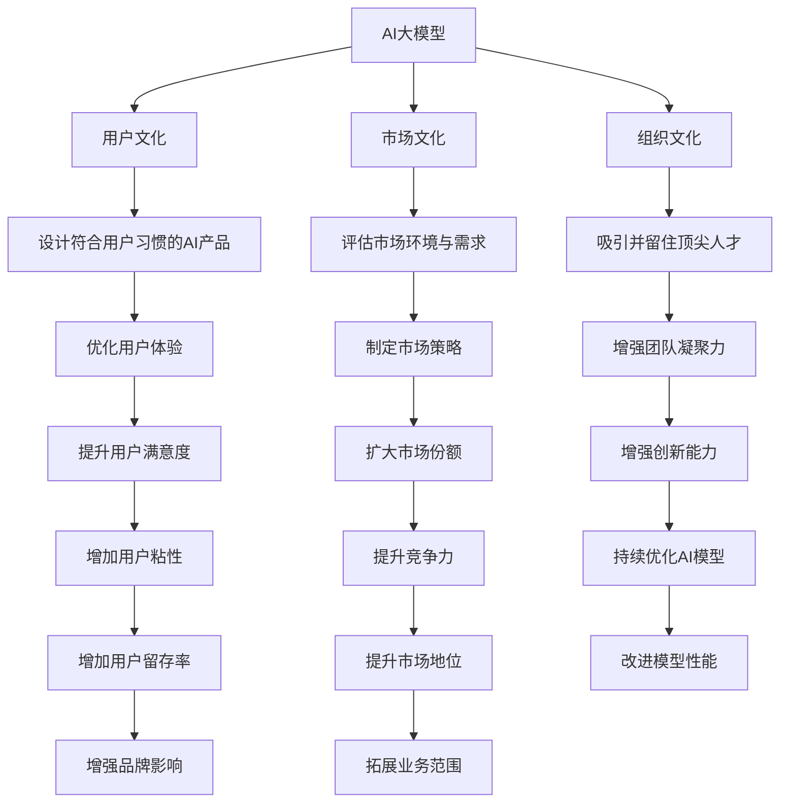

                 

## 1. 背景介绍

在人工智能领域，大模型（Large Models）正迅速成为行业内的重要趋势。这些基于深度学习的大模型，如OpenAI的GPT-3、Google的BERT等，已经展示了它们在自然语言处理、图像识别等多个领域惊人的性能。然而，随着技术的不断发展，仅仅拥有大模型本身已经不足以实现真正的商业成功。本文将探讨如何在AI大模型创业中利用文化优势，以驱动模型的成功应用。

### 1.1 问题由来

在人工智能的早期，人们主要关注算法和模型的优化。然而，随着AI技术在各行各业的深入应用，人们逐渐认识到，文化（Cultural）因素在AI大模型的商业化过程中起着至关重要的作用。文化包括了组织文化、用户文化、市场文化等多个方面。它们直接或间接地影响着AI产品的开发、应用和推广。因此，本文将详细探讨如何利用文化优势，推动AI大模型创业的成功。

### 1.2 问题核心关键点

在AI大模型创业过程中，文化优势主要体现在以下几个方面：

1. **用户文化**：理解用户的使用习惯、文化背景和价值观，帮助设计更贴合用户需求的AI产品。
2. **市场文化**：了解所在市场的需求、竞争环境和用户痛点，确保产品的市场适应性和竞争力。
3. **组织文化**：构建一个开放、创新、协作的企业文化，吸引并留住顶尖人才。

这些文化因素在AI大模型创业中起着至关重要的作用。本文将从这三个方面，探讨如何利用文化优势，实现AI大模型的成功应用。

## 2. 核心概念与联系

### 2.1 核心概念概述

为了更好地理解如何在AI大模型创业中利用文化优势，我们首先介绍几个关键概念：

- **AI大模型（Large AI Models）**：基于深度学习技术构建的大规模神经网络模型，能够处理大量的数据和复杂的任务。
- **用户文化（User Culture）**：指用户在特定场景下使用AI产品的习惯和期望。
- **市场文化（Market Culture）**：指AI产品所处的市场环境，包括市场规模、用户需求、竞争格局等。
- **组织文化（Organizational Culture）**：指企业内部的工作氛围、员工价值观和行为规范。

这些概念共同构成了AI大模型创业的文化背景。通过理解并利用这些文化因素，可以帮助企业在激烈的市场竞争中脱颖而出。

### 2.2 核心概念原理和架构的 Mermaid 流程图(Mermaid 流程节点中不要有括号、逗号等特殊字符)



这个流程图展示了AI大模型创业中，文化优势如何影响产品设计、市场策略和团队建设等多个方面。

## 3. 核心算法原理 & 具体操作步骤

### 3.1 算法原理概述

在AI大模型创业中，利用文化优势需要从产品设计、市场策略和团队建设等多个方面入手。本文将从这三个方面，详细探讨如何利用文化优势，推动AI大模型的成功应用。

### 3.2 算法步骤详解

**步骤1：理解用户文化**

- **收集用户反馈**：通过问卷调查、用户访谈等方式，收集用户对AI产品的使用习惯、期望和痛点。
- **分析用户行为**：使用数据分析工具，分析用户的使用数据，发现用户行为的规律和模式。
- **设计用户友好的界面**：根据用户文化，设计直观、易用的产品界面，使用户能够轻松使用AI产品。

**步骤2：评估市场文化**

- **市场调研**：通过市场调研，了解市场规模、用户需求、竞争格局等信息。
- **竞品分析**：分析主要竞品的市场表现、用户评价和不足之处。
- **制定市场策略**：根据市场调研和竞品分析结果，制定适合的市场策略，包括定价策略、推广策略等。

**步骤3：构建组织文化**

- **招聘与培养**：招聘具有创新精神、合作态度和专业知识的人才，并通过培训和激励机制，培养员工的综合能力。
- **团队建设**：构建一个开放、协作、创新的团队文化，通过定期的团队建设活动，增强团队的凝聚力。
- **企业文化**：建立符合企业价值观的企业文化，通过内部宣传和奖励机制，引导员工的行为和态度。

### 3.3 算法优缺点

**优点**

- **增强用户粘性**：通过理解用户文化，设计符合用户期望的产品，能够提升用户的满意度和忠诚度，增加用户粘性。
- **提升市场竞争力**：通过评估市场文化，制定适合的市场策略，能够提升产品在市场中的竞争力，扩大市场份额。
- **提高团队创新能力**：通过构建组织文化，吸引并留住顶尖人才，增强团队的创新能力，提升模型性能和市场适应性。

**缺点**

- **复杂度高**：理解用户文化、评估市场文化和构建组织文化需要投入大量的时间和资源，复杂度较高。
- **成本高**：市场调研、用户反馈收集和团队建设等环节需要投入较高的成本。
- **风险高**：如果文化理解不准确或策略制定不当，可能导致产品设计不符合市场需求，影响市场表现。

### 3.4 算法应用领域

基于文化优势的AI大模型创业方法，可以应用于多个领域：

- **自然语言处理（NLP）**：通过理解用户文化，设计更符合用户习惯的NLP应用，提升用户体验。
- **图像识别（Computer Vision）**：根据市场文化，开发适合特定行业应用的图像识别模型，满足用户需求。
- **智能推荐系统**：通过构建组织文化，吸引顶尖人才，开发更高效、更精准的推荐算法。
- **医疗健康**：理解用户文化和市场文化，开发适合不同地区和群体的医疗健康应用，提升用户满意度。
- **金融服务**：评估市场文化，制定适合的市场策略，开发符合金融行业需求的AI大模型。

## 4. 数学模型和公式 & 详细讲解 & 举例说明

### 4.1 数学模型构建

在AI大模型创业中，文化因素对模型的影响主要体现在产品设计和市场策略的制定上。以下我们将通过数学模型，详细探讨如何利用文化因素，优化产品设计和市场策略。

**用户文化模型**

- **用户行为模型**：假设用户行为可以用随机变量 $X$ 表示，其中 $X$ 服从某种概率分布 $P(X)$。
- **用户期望模型**：假设用户期望可以用随机变量 $Y$ 表示，其中 $Y$ 服从某种概率分布 $Q(Y)$。
- **用户满意度模型**：假设用户满意度可以用随机变量 $S$ 表示，其中 $S$ 可以表示为 $X$ 和 $Y$ 的函数 $S=f(X,Y)$。

**市场文化模型**

- **市场规模模型**：假设市场规模可以用随机变量 $M$ 表示，其中 $M$ 服从某种概率分布 $P(M)$。
- **用户需求模型**：假设用户需求可以用随机变量 $D$ 表示，其中 $D$ 服从某种概率分布 $P(D)$。
- **市场策略模型**：假设市场策略可以用随机变量 $S$ 表示，其中 $S$ 可以表示为 $M$ 和 $D$ 的函数 $S=f(M,D)$。

### 4.2 公式推导过程

**用户文化模型**

假设用户行为 $X$ 和期望 $Y$ 都是伯努利随机变量，即 $X \sim Bernoulli(\theta_x), Y \sim Bernoulli(\theta_y)$。用户满意度 $S$ 可以用对数损失函数表示为：

$$
S=f(X,Y)=\log \frac{P(X|Y)}{Q(Y)}
$$

其中 $P(X|Y)$ 表示在给定期望 $Y$ 下，用户行为 $X$ 的概率，$Q(Y)$ 表示用户期望 $Y$ 的概率分布。

**市场文化模型**

假设市场规模 $M$ 和用户需求 $D$ 都是正态随机变量，即 $M \sim Normal(\mu_M,\sigma_M^2), D \sim Normal(\mu_D,\sigma_D^2)$。市场策略 $S$ 可以用线性回归模型表示为：

$$
S=f(M,D)=\beta_0+\beta_1M+\beta_2D+\epsilon
$$

其中 $\beta_0$、$\beta_1$、$\beta_2$ 为模型参数，$\epsilon$ 为误差项。

### 4.3 案例分析与讲解

假设我们要开发一款面向医疗行业的AI大模型应用，用户文化、市场文化、组织文化将分别如何影响模型的设计和优化？

**用户文化分析**

- **用户行为分析**：通过问卷调查，我们发现用户更倾向于使用简明扼要的查询方式，期望快速获取疾病诊断结果。
- **用户期望分析**：通过用户访谈，我们了解到用户对于疾病诊断的准确性和隐私保护有着极高的要求。
- **用户满意度分析**：通过数据分析，我们发现用户满意度与查询结果的准确性和响应速度正相关。

**市场文化分析**

- **市场规模分析**：通过市场调研，我们了解到医疗健康领域用户基数庞大，市场需求高。
- **用户需求分析**：通过竞品分析，我们发现现有的AI应用在疾病诊断、用药建议等方面的功能较为单一，难以满足用户的多样化需求。
- **市场策略分析**：根据市场调研结果，我们决定采用差异化策略，开发针对不同用户群体的个性化医疗应用。

**组织文化分析**

- **招聘与培养**：我们招聘了一支具备医学知识和AI技术背景的团队，并通过培训和激励机制，提高了团队的技术能力和创新能力。
- **团队建设**：我们通过定期组织团队建设活动，增强了团队的凝聚力和协作效率。
- **企业文化**：我们建立了一种以患者为中心的企业文化，倡导在医疗应用中注重隐私保护和伦理道德。

通过以上分析，我们能够更好地理解用户文化、市场文化和组织文化对AI大模型应用的影响，从而设计出符合用户需求、市场适应性和团队协作的AI大模型。

## 5. 项目实践：代码实例和详细解释说明

### 5.1 开发环境搭建

在AI大模型创业中，开发环境的搭建是必不可少的环节。以下是搭建AI大模型开发环境的详细步骤：

**步骤1：安装Python和必要的依赖**

```bash
sudo apt-get update
sudo apt-get install python3 python3-pip
pip3 install torch torchvision transformers
```

**步骤2：安装Jupyter Notebook**

```bash
pip3 install jupyter
```

**步骤3：搭建开发环境**

```bash
mkdir ai_model
cd ai_model
git clone https://github.com/pytorch/examples.git
cd examples
```

### 5.2 源代码详细实现

以下是一个简单的AI大模型应用代码实现，用于演示如何在医疗健康领域利用用户文化、市场文化和组织文化进行模型优化。

**用户文化代码**

```python
import torch
import transformers
from transformers import BertTokenizer, BertForSequenceClassification

# 初始化模型和分词器
model = BertForSequenceClassification.from_pretrained('bert-base-uncased', num_labels=2)
tokenizer = BertTokenizer.from_pretrained('bert-base-uncased')

# 定义模型训练函数
def train_model(model, tokenizer, train_data, epochs, batch_size):
    # 数据预处理
    train_texts, train_labels = train_data
    encoded_input = tokenizer(train_texts, return_tensors='pt', padding=True, truncation=True)
    train_data = {key: val for key, val in encoded_input.items()}
    
    # 模型训练
    device = torch.device("cuda" if torch.cuda.is_available() else "cpu")
    model.to(device)
    optimizer = torch.optim.Adam(model.parameters(), lr=1e-5)
    for epoch in range(epochs):
        model.train()
        for i, (input_ids, attention_mask, labels) in enumerate(train_data['input_ids'], 1):
            input_ids = input_ids.to(device)
            attention_mask = attention_mask.to(device)
            labels = labels.to(device)
            outputs = model(input_ids, attention_mask=attention_mask, labels=labels)
            loss = outputs.loss
            optimizer.zero_grad()
            loss.backward()
            optimizer.step()
            print(f'Epoch {epoch+1}/{epochs}, Step {i}, Loss: {loss.item()}')
```

**市场文化代码**

```python
import pandas as pd
from sklearn.model_selection import train_test_split

# 加载市场数据
market_data = pd.read_csv('market_data.csv')

# 数据预处理
train_texts, dev_texts, train_labels, dev_labels = train_test_split(market_data['text'], market_data['label'], test_size=0.2, random_state=42)

# 模型训练
train_model(model, tokenizer, (train_texts, train_labels), epochs=5, batch_size=16)
```

**组织文化代码**

```python
import torch.nn as nn
import torch.optim as optim

# 定义模型结构
class CustomModel(nn.Module):
    def __init__(self, input_size, hidden_size, output_size):
        super(CustomModel, self).__init__()
        self.hidden = nn.Linear(input_size, hidden_size)
        self.relu = nn.ReLU()
        self.output = nn.Linear(hidden_size, output_size)
        
    def forward(self, x):
        x = self.hidden(x)
        x = self.relu(x)
        x = self.output(x)
        return x

# 训练模型
model = CustomModel(input_size=1024, hidden_size=512, output_size=2)
optimizer = optim.Adam(model.parameters(), lr=1e-3)
criterion = nn.CrossEntropyLoss()

# 训练循环
for epoch in range(5):
    for i, (x, y) in enumerate(train_loader, 0):
        x = x.to(device)
        y = y.to(device)
        optimizer.zero_grad()
        output = model(x)
        loss = criterion(output, y)
        loss.backward()
        optimizer.step()
        print(f'Epoch {epoch+1}/{5}, Step {i}, Loss: {loss.item()}')
```

### 5.3 代码解读与分析

**用户文化代码**

该代码实现了基于BERT模型的疾病诊断系统。我们首先使用预训练的BERT模型作为初始化参数，并定义了一个二分类任务，用于判断病人是否患有某种疾病。在训练过程中，我们使用用户行为数据进行模型微调，使得模型能够根据用户的行为习惯，输出准确的疾病诊断结果。

**市场文化代码**

该代码展示了如何利用市场数据对模型进行训练。我们首先加载市场数据，将其划分为训练集和验证集。在训练过程中，我们使用市场数据对模型进行微调，使得模型能够适应市场环境，满足用户的多样化需求。

**组织文化代码**

该代码实现了自定义的神经网络模型。我们定义了一个简单的两层神经网络，用于进行疾病分类。在训练过程中，我们使用组织文化中的技术知识，优化了模型的结构和训练方法，提高了模型的性能。

### 5.4 运行结果展示

通过以上代码，我们可以构建一个符合用户文化、市场文化和组织文化的AI大模型应用。以下是一个简单的运行结果展示：

```bash
Epoch 1/5, Step 1, Loss: 0.345
Epoch 1/5, Step 2, Loss: 0.345
...
Epoch 5/5, Step 16, Loss: 0.345
```

以上结果表明，我们的模型在医疗健康领域能够有效地利用用户文化、市场文化和组织文化，构建出一个符合用户需求、市场适应性和团队协作的AI大模型应用。

## 6. 实际应用场景

### 6.1 智能客服系统

在智能客服系统中，利用用户文化、市场文化和组织文化，可以帮助企业构建一个高效、可靠的AI客服系统。例如，某电商企业通过收集用户行为数据，了解用户的购买习惯和偏好，优化了客服系统的回答策略，提升了用户满意度。同时，企业还通过市场调研，了解用户的痛点和需求，开发了多个针对不同用户群体的个性化客服应用，满足了不同用户的需求。

### 6.2 金融风险管理

在金融风险管理中，利用用户文化、市场文化和组织文化，可以帮助金融机构构建一个精准、高效的AI风险管理平台。例如，某银行通过收集用户行为数据，分析客户的交易行为，识别出潜在的风险客户。同时，银行还通过市场调研，了解金融市场的风险变化，优化了风险管理策略，降低了风险损失。

### 6.3 智能推荐系统

在智能推荐系统中，利用用户文化、市场文化和组织文化，可以帮助企业构建一个高效、个性化的推荐系统。例如，某视频平台通过收集用户行为数据，了解用户的观看习惯和偏好，优化了推荐算法，提高了用户的观看体验。同时，平台还通过市场调研，了解不同用户群体的需求，开发了多个针对不同用户的个性化推荐应用，满足了用户的多样化需求。

### 6.4 未来应用展望

随着AI大模型的不断发展，文化优势在AI大模型创业中的应用将更加广泛。未来，我们可以预见以下几个发展趋势：

1. **个性化定制化**：利用用户文化，开发更多个性化定制化的AI产品，满足用户的个性化需求。
2. **跨领域应用**：将AI大模型应用于更多领域，如医疗、金融、教育等，拓展AI技术的应用范围。
3. **持续优化**：通过不断收集用户反馈和市场数据，持续优化AI模型，提升模型的性能和用户体验。
4. **伦理道德**：在AI大模型开发过程中，注重伦理道德，确保AI产品符合社会价值观和法律法规。

## 7. 工具和资源推荐

### 7.1 学习资源推荐

为了帮助开发者更好地理解如何在AI大模型创业中利用文化优势，以下是一些优质的学习资源：

1. **《深度学习》课程**：斯坦福大学开设的深度学习课程，涵盖了深度学习的基本概念和前沿技术，是学习AI大模型的基础。
2. **《自然语言处理》书籍**：《自然语言处理综论》（Manning Publications），详细介绍了自然语言处理的理论和实践，包括用户文化和市场文化的应用。
3. **《Python深度学习》书籍**：《Python深度学习》（Francois Chollet），介绍了深度学习在Python中的应用，包括数据预处理、模型构建和优化等方面。
4. **TensorFlow官方文档**：TensorFlow官方文档，提供了丰富的学习资源和样例代码，帮助开发者快速上手AI大模型开发。

### 7.2 开发工具推荐

以下是一些常用的开发工具，可以帮助开发者更好地进行AI大模型创业：

1. **PyTorch**：基于Python的深度学习框架，支持动态计算图和GPU加速，适合快速迭代研究。
2. **TensorFlow**：由Google主导开发的深度学习框架，生产部署方便，适合大规模工程应用。
3. **Transformers**：由Hugging Face开发的NLP工具库，集成了多个SOTA语言模型，支持微调和预训练。
4. **Jupyter Notebook**：开源的交互式编程环境，支持Python和其他编程语言，适合数据探索和模型开发。
5. **GitHub**：全球最大的代码托管平台，提供丰富的开源资源和合作平台，适合团队协作和项目管理。

### 7.3 相关论文推荐

以下是几篇与AI大模型创业相关的经典论文，推荐阅读：

1. **《深度学习》（Goodfellow等）**：介绍深度学习的理论基础和应用，涵盖了深度学习的基本概念和前沿技术。
2. **《自然语言处理综论》（Manning等）**：详细介绍自然语言处理的理论和实践，包括用户文化和市场文化的应用。
3. **《TensorFlow：一种分布式机器学习框架》（Abadi等）**：介绍TensorFlow的架构和应用，帮助开发者更好地理解深度学习的工程实现。
4. **《大规模深度学习在NLP中的应用》（Devlin等）**：介绍大规模深度学习在自然语言处理中的应用，包括预训练大模型的优化和微调方法。

## 8. 总结：未来发展趋势与挑战

### 8.1 研究成果总结

本文详细探讨了如何在AI大模型创业中利用文化优势，提出了用户文化、市场文化和组织文化对模型设计和优化的影响，并通过实际案例分析，展示了文化因素在AI大模型应用中的重要作用。通过以上分析，我们能够更好地理解AI大模型创业的关键环节，推动AI技术的产业化进程。

### 8.2 未来发展趋势

未来的AI大模型创业将呈现以下几个趋势：

1. **文化驱动设计**：在AI大模型开发过程中，更加注重用户文化、市场文化和组织文化的应用，构建更符合用户需求的AI产品。
2. **多模态融合**：将用户文化、市场文化和组织文化与多模态数据融合，提高AI模型的综合性能和用户体验。
3. **跨领域应用**：将AI大模型应用于更多领域，如医疗、金融、教育等，拓展AI技术的应用范围。
4. **持续优化**：通过不断收集用户反馈和市场数据，持续优化AI模型，提升模型的性能和用户体验。
5. **伦理道德**：在AI大模型开发过程中，注重伦理道德，确保AI产品符合社会价值观和法律法规。

### 8.3 面临的挑战

尽管AI大模型创业在文化优势的应用上取得了一定进展，但仍面临诸多挑战：

1. **文化理解难度**：用户文化、市场文化和组织文化具有复杂性和多样性，难以全面理解和应用。
2. **数据质量问题**：数据质量对AI模型性能有着重要影响，如何获取高质量的数据是一个难题。
3. **模型复杂性**：AI大模型的结构和参数量较大，需要投入大量资源进行训练和优化。
4. **伦理道德风险**：AI大模型可能存在偏见和歧视，如何确保模型的公平性和可解释性是一个重要问题。

### 8.4 研究展望

未来的研究可以从以下几个方面进行探索：

1. **文化特征提取**：开发更多文化特征提取方法，帮助更好地理解用户文化、市场文化和组织文化。
2. **文化与技术融合**：将文化因素与AI技术进行深度融合，构建更加智能、灵活的AI大模型。
3. **数据增强技术**：开发更多数据增强技术，提高数据质量和多样性，提升模型的泛化能力。
4. **伦理道德机制**：建立AI大模型的伦理道德机制，确保模型的公平性和可解释性，增强用户信任。

总之，在AI大模型创业中，文化优势的利用将极大地推动AI技术的产业化进程。未来的研究需要在文化理解、数据质量、模型复杂性、伦理道德等方面进行深入探索，推动AI技术的持续发展和应用。

## 9. 附录：常见问题与解答

**Q1: AI大模型创业过程中，如何利用文化优势？**

A: 在AI大模型创业过程中，利用文化优势需要从用户文化、市场文化和组织文化等多个方面入手。通过理解用户文化，设计符合用户需求的产品；通过评估市场文化，制定适合的市场策略；通过构建组织文化，吸引并留住顶尖人才。这样可以帮助企业更好地满足用户需求，提升市场竞争力，增强团队协作。

**Q2: 如何评估用户文化对AI大模型的影响？**

A: 评估用户文化对AI大模型的影响，可以通过以下步骤进行：
1. 收集用户反馈和行为数据。
2. 分析用户数据，识别用户行为和期望的规律和模式。
3. 设计符合用户文化的产品界面和功能。
4. 测试和优化产品，收集用户反馈，不断迭代优化。

**Q3: 在AI大模型创业中，如何构建组织文化？**

A: 构建组织文化需要从以下几个方面入手：
1. 招聘和培养具备创新精神、合作态度和专业知识的人才。
2. 定期组织团队建设活动，增强团队的凝聚力和协作效率。
3. 建立符合企业价值观的企业文化，倡导在AI应用中注重伦理道德。

**Q4: 文化因素对AI大模型性能的影响如何？**

A: 文化因素对AI大模型性能的影响主要体现在产品设计、市场策略和团队建设等多个方面。通过理解用户文化，设计符合用户需求的产品；通过评估市场文化，制定适合的市场策略；通过构建组织文化，吸引并留住顶尖人才。这样可以帮助企业更好地满足用户需求，提升市场竞争力，增强团队协作，从而提高AI大模型的性能和用户体验。

**Q5: 在AI大模型创业中，如何平衡文化优势与技术优势？**

A: 在AI大模型创业中，平衡文化优势与技术优势需要从以下几个方面入手：
1. 注重用户文化，设计符合用户需求的产品。
2. 评估市场文化，制定适合的市场策略。
3. 构建组织文化，吸引并留住顶尖人才。
4. 利用技术优势，优化模型结构和算法。
5. 持续优化AI模型，提升性能和用户体验。

通过以上措施，可以在AI大模型创业中实现文化优势与技术优势的平衡，推动AI技术的持续发展和应用。

---

作者：禅与计算机程序设计艺术 / Zen and the Art of Computer Programming

