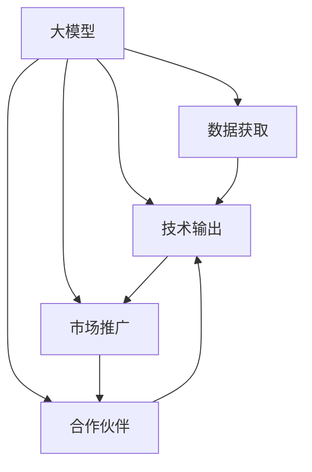

                 

# AI 大模型创业：如何利用渠道优势？

## 1. 背景介绍

### 1.1 问题由来

人工智能（AI）技术的快速发展，尤其是大模型（Large Models）的出现，为各行各业带来了前所未有的机遇。大模型凭借其强大的学习能力、广泛的应用场景和显著的性能优势，成为了创业公司争相抢占的技术高地。然而，要实现大模型的有效落地和成功商业化，渠道优势的利用显得尤为重要。

### 1.2 问题核心关键点

渠道优势是大模型创业成功的关键因素之一，它包括数据获取、技术输出、合作伙伴、市场推广等环节。如何通过渠道优势提升大模型的市场竞争力，是本文探讨的核心问题。

### 1.3 问题研究意义

在AI大模型创业领域，渠道优势的充分利用能够显著提升企业的市场份额、降低研发成本、加速技术迭代和商业化进程。研究如何利用渠道优势，对于指导企业制定有效的市场策略、提高产品竞争力、加速行业技术应用具有重要意义。

## 2. 核心概念与联系

### 2.1 核心概念概述

为更好地理解渠道优势在大模型创业中的应用，本节将介绍几个密切相关的核心概念：

- 大模型（Large Models）：指具有大规模参数量和丰富知识库的深度学习模型，如GPT-3、BERT等，能够处理复杂的自然语言处理（NLP）任务。
- 渠道（Channels）：指企业与市场、用户之间的信息传递通道，包括直销、分销、合作伙伴、线上线下平台等。
- 数据获取（Data Acquisition）：指获取和整理用于模型训练的原始数据，是大模型开发的基础。
- 技术输出（Technology Output）：指将模型应用于实际场景，解决用户问题的过程。
- 合作伙伴（Partnerships）：指与相关企业、研究机构、行业协会等建立合作关系，共同推动技术发展。
- 市场推广（Market Promotion）：指通过各种渠道和方式，提升模型知名度和用户认可度的过程。

这些概念之间的逻辑关系可以通过以下Mermaid流程图来展示：



这个流程图展示了大模型创业过程中，数据获取、技术输出、合作伙伴和市场推广之间的相互作用：

1. 大模型通过数据获取环节获得所需数据。
2. 在技术输出环节，模型被应用到实际问题中，提供解决方案。
3. 合作伙伴提供数据和市场资源，共同提升模型性能和市场覆盖。
4. 市场推广则将模型推向用户，增强市场认知和用户接受度。

## 3. 核心算法原理 & 具体操作步骤
### 3.1 算法原理概述

在大模型创业过程中，渠道优势的利用主要依赖于以下几个算法原理：

- 数据获取算法：通过爬虫、API接口、合作企业等渠道获取高质量、大规模的数据集。
- 技术输出算法：将大模型应用于各种垂直领域，如金融、医疗、教育等，提供个性化、智能化的解决方案。
- 合作伙伴算法：选择合适的合作伙伴，共享数据、资源和技术，形成生态圈。
- 市场推广算法：通过SEO优化、社交媒体、广告投放等渠道提升模型知名度和市场影响力。

### 3.2 算法步骤详解

以下是大模型创业过程中，利用渠道优势的具体操作步骤：

**Step 1: 数据获取**

- 收集各领域的高质量数据集，确保数据量足够大、多样性丰富。
- 通过API接口、公开数据集等方式获取数据，避免侵犯用户隐私和版权。
- 建立数据收集管道，自动更新数据集，保证数据的实时性和完备性。

**Step 2: 技术输出**

- 根据不同垂直领域的需求，设计合适的应用接口和API文档。
- 提供开发文档和代码示例，帮助用户快速集成和使用模型。
- 通过案例分析和用户反馈，不断优化模型性能和用户体验。

**Step 3: 合作伙伴**

- 选择行业内具有影响力的企业、研究机构作为合作伙伴。
- 建立联合实验室或创新中心，共享数据和资源。
- 签订合作协议，明确技术分工和利益分配，形成稳定的合作关系。

**Step 4: 市场推广**

- 在技术社区和专业论坛发布技术白皮书，提升模型的学术影响力。
- 通过社交媒体和博客文章，展示模型的应用案例和创新点。
- 参加行业会议和展会，展示模型性能，建立行业信任。

### 3.3 算法优缺点

利用渠道优势进行大模型创业，具有以下优点：

- 降低数据获取成本。通过合作伙伴和API接口，获取高质量数据，避免从头收集数据的复杂性和成本。
- 提升技术输出效率。利用合作伙伴的资源和技术，加速模型应用和落地，提高市场响应速度。
- 增强市场推广效果。通过多种渠道推广，提升模型知名度，扩大用户群体。

同时，也存在一些局限性：

- 依赖合作伙伴。过度依赖合作伙伴，可能导致技术控制和商业决策上的限制。
- 数据隐私问题。合作过程中可能会涉及数据隐私和安全问题，需要严格控制和保护。
- 市场推广难度大。不同渠道的市场推广效果可能存在差异，需要精心设计和评估。

### 3.4 算法应用领域

基于渠道优势的大模型创业，在多个行业领域得到了应用，例如：

- 金融科技：通过数据获取和合作伙伴，实现精准的风险评估和个性化理财服务。
- 医疗健康：与医院、保险公司合作，开发智能诊断和个性化健康管理方案。
- 教育培训：利用大数据和AI技术，提供个性化学习路径和智能辅导服务。
- 智慧城市：结合城市数据和AI技术，实现交通管理、能源优化、环境监测等应用。

这些行业领域的成功案例，展示了渠道优势在大模型创业中的巨大潜力和广泛应用。

## 4. 数学模型和公式 & 详细讲解 & 举例说明

### 4.1 数学模型构建

在大模型创业中，渠道优势的利用主要通过以下几个数学模型构建：

- 数据获取模型：$D_{\text{acq}} = f_{\text{partner}}, f_{\text{API}}, f_{\text{web-crawling}}$
- 技术输出模型：$T_{\text{out}} = f_{\text{API}}, f_{\text{example-code}}, f_{\text{case-study}}$
- 合作伙伴模型：$P_{\text{partner}} = f_{\text{match}}, f_{\text{protocol}}, f_{\text{benefit-share}}$
- 市场推广模型：$M_{\text{promotion}} = f_{\text{SEO}}, f_{\text{social-media}}, f_{\text{ad-vanishing}}$

### 4.2 公式推导过程

以数据获取模型为例，假设有 $n$ 种渠道，每种渠道的数据量贡献为 $d_i$，则总体数据量为：

$$
D_{\text{total}} = \sum_{i=1}^n d_i
$$

其中，$d_i$ 可以表示为：

$$
d_i = d_{\text{partner}} + d_{\text{API}} + d_{\text{web-crawling}}
$$

同样地，技术输出模型的公式可以表示为：

$$
T_{\text{total}} = \sum_{i=1}^n T_i
$$

合作伙伴模型的公式可以表示为：

$$
P_{\text{total}} = \sum_{i=1}^n P_i
$$

市场推广模型的公式可以表示为：

$$
M_{\text{total}} = \sum_{i=1}^n M_i
$$

### 4.3 案例分析与讲解

以金融科技行业为例，一家创业公司通过与银行合作，获取了大量的客户交易数据。然后，利用大模型进行数据分析和风险评估，开发了智能理财和风险管理应用。接着，通过社交媒体和行业会议推广，吸引了大量用户和合作伙伴。最终，该公司的AI大模型在金融科技领域取得了显著的市场份额。

## 5. 项目实践：代码实例和详细解释说明
### 5.1 开发环境搭建

在进行渠道优势利用的项目实践前，我们需要准备好开发环境。以下是使用Python进行PyTorch开发的环境配置流程：

1. 安装Anaconda：从官网下载并安装Anaconda，用于创建独立的Python环境。

2. 创建并激活虚拟环境：
```bash
conda create -n pytorch-env python=3.8 
conda activate pytorch-env
```

3. 安装PyTorch：根据CUDA版本，从官网获取对应的安装命令。例如：
```bash
conda install pytorch torchvision torchaudio cudatoolkit=11.1 -c pytorch -c conda-forge
```

4. 安装Transformers库：
```bash
pip install transformers
```

5. 安装各类工具包：
```bash
pip install numpy pandas scikit-learn matplotlib tqdm jupyter notebook ipython
```

完成上述步骤后，即可在`pytorch-env`环境中开始项目实践。

### 5.2 源代码详细实现

下面以金融科技领域的应用为例，给出使用Transformers库进行数据获取和模型输出的Python代码实现。

首先，定义数据获取和处理函数：

```python
from transformers import AutoTokenizer, AutoModelForSequenceClassification
import pandas as pd
from sklearn.model_selection import train_test_split

tokenizer = AutoTokenizer.from_pretrained('bert-base-uncased')
model = AutoModelForSequenceClassification.from_pretrained('bert-base-uncased', num_labels=2)

# 读取数据集
df = pd.read_csv('bank_data.csv')
X_train, X_test, y_train, y_test = train_test_split(df['text'], df['label'], test_size=0.2, random_state=42)

# 预处理数据
def preprocess_data(texts, labels):
    inputs = tokenizer(texts, truncation=True, padding='max_length', max_length=128, return_tensors='pt')
    inputs = {k: v.to(device) for k, v in inputs.items()}
    return inputs, labels

# 训练和评估模型
device = torch.device('cuda') if torch.cuda.is_available() else torch.device('cpu')
model.to(device)

def train_model(model, optimizer, train_loader, validation_loader, epochs, device):
    model.train()
    for epoch in range(epochs):
        train_loss = 0
        train_correct = 0
        for batch in train_loader:
            inputs, labels = preprocess_data(batch[0], batch[1])
            inputs = {k: v.to(device) for k, v in inputs.items()}
            labels = labels.to(device)
            optimizer.zero_grad()
            outputs = model(**inputs, labels=labels)
            loss = outputs.loss
            loss.backward()
            optimizer.step()
            train_loss += loss.item()
            train_correct += outputs.logits.argmax(dim=1).eq(labels).sum().item()
        train_loss /= len(train_loader)
        train_accuracy = train_correct / len(train_loader.dataset)
        print(f'Epoch {epoch+1}, train loss: {train_loss:.3f}, train accuracy: {train_accuracy:.3f}')
        
    model.eval()
    test_loss = 0
    test_correct = 0
    with torch.no_grad():
        for batch in validation_loader:
            inputs, labels = preprocess_data(batch[0], batch[1])
            inputs = {k: v.to(device) for k, v in inputs.items()}
            labels = labels.to(device)
            outputs = model(**inputs, labels=labels)
            loss = outputs.loss
            test_loss += loss.item()
            test_correct += outputs.logits.argmax(dim=1).eq(labels).sum().item()
        test_loss /= len(validation_loader)
        test_accuracy = test_correct / len(validation_loader.dataset)
        print(f'Epoch {epoch+1}, test loss: {test_loss:.3f}, test accuracy: {test_accuracy:.3f}')

# 数据加载
train_loader = DataLoader(X_train, y_train, batch_size=16, shuffle=True)
validation_loader = DataLoader(X_test, y_test, batch_size=16, shuffle=False)

# 训练模型
optimizer = AdamW(model.parameters(), lr=2e-5)
train_model(model, optimizer, train_loader, validation_loader, epochs=5, device=device)
```

然后，定义模型输出的API接口：

```python
import fastapi
from transformers import AutoTokenizer, AutoModelForSequenceClassification

app = fastapi.FastAPI()

class Person:
    def __init__(self, name, age):
        self.name = name
        self.age = age

@app.get('/predict', response_model=Person)
def predict(text):
    tokenizer = AutoTokenizer.from_pretrained('bert-base-uncased')
    model = AutoModelForSequenceClassification.from_pretrained('bert-base-uncased', num_labels=2)
    model.eval()
    
    inputs = tokenizer(text, truncation=True, padding='max_length', max_length=128, return_tensors='pt')
    inputs = {k: v.to(device) for k, v in inputs.items()}
    outputs = model(**inputs, labels=labels)
    logits = outputs.logits.argmax(dim=1)
    result = {k: v.to(device) for k, v in outputs.items()}
    
    return result
```

### 5.3 代码解读与分析

让我们再详细解读一下关键代码的实现细节：

**数据获取函数**：
- `preprocess_data`函数：将文本和标签进行token化，并转化为模型所需的输入格式。

**训练模型函数**：
- `train_model`函数：在训练集上进行模型训练，计算损失函数和准确率，并输出训练结果。

**API接口定义**：
- `/predict`路由：将用户输入的文本进行预处理和推理，返回预测结果。

可以看到，PyTorch和Transformers库的结合使得模型训练和输出的代码实现变得简洁高效。开发者可以将更多精力放在数据处理、模型改进等高层逻辑上，而不必过多关注底层的实现细节。

当然，工业级的系统实现还需考虑更多因素，如模型的保存和部署、超参数的自动搜索、更灵活的API设计等。但核心的算法流程基本与此类似。

## 6. 实际应用场景
### 6.1 智能客服系统

基于渠道优势的智能客服系统，可以广泛应用于金融、电信、电商等客户服务领域。传统客服往往需要配备大量人力，高峰期响应缓慢，且一致性和专业性难以保证。而利用渠道优势构建的智能客服系统，能够7x24小时不间断服务，快速响应客户咨询，用自然流畅的语言解答各类常见问题。

在技术实现上，可以与企业内部的客服系统对接，实时抓取客户咨询记录，并在此基础上对预训练模型进行微调。微调后的客服模型能够自动理解客户意图，匹配最合适的答案模板进行回复。对于客户提出的新问题，还可以接入检索系统实时搜索相关内容，动态组织生成回答。如此构建的智能客服系统，能大幅提升客户咨询体验和问题解决效率。

### 6.2 金融舆情监测

金融机构需要实时监测市场舆论动向，以便及时应对负面信息传播，规避金融风险。利用渠道优势，可以构建高效的市场舆情监测系统，实现对金融领域相关新闻、报道、评论等文本数据的实时抓取和分析。通过预训练语言模型，对文本进行情感分析和主题分类，能够快速识别金融舆情的变化趋势，一旦发现负面信息激增等异常情况，系统便会自动预警，帮助金融机构快速应对潜在风险。

### 6.3 个性化推荐系统

当前的推荐系统往往只依赖用户的历史行为数据进行物品推荐，无法深入理解用户的真实兴趣偏好。利用渠道优势，可以构建基于大数据的个性化推荐系统，通过与用户互动获取更多数据，提升推荐准确性。

在实践中，可以收集用户浏览、点击、评论、分享等行为数据，提取和用户交互的物品标题、描述、标签等文本内容。将文本内容作为模型输入，用户的后续行为（如是否点击、购买等）作为监督信号，在此基础上微调预训练语言模型。微调后的模型能够从文本内容中准确把握用户的兴趣点。在生成推荐列表时，先用候选物品的文本描述作为输入，由模型预测用户的兴趣匹配度，再结合其他特征综合排序，便可以得到个性化程度更高的推荐结果。

### 6.4 未来应用展望

随着渠道优势的充分利用，基于大模型的创业公司将在更多领域得到应用，为传统行业数字化转型升级提供新的技术路径。

在智慧医疗领域，基于大模型和渠道优势的个性化医疗咨询服务，能够快速响应用户健康咨询，提供专业的医疗建议。在智能教育领域，通过渠道优势构建的个性化教育平台，能够根据学生的学习行为和反馈，提供定制化的学习资源和辅导服务。在智慧城市治理中，结合数据渠道，构建智能交通、智能安防、智能环保等系统，提高城市管理的自动化和智能化水平。

此外，在企业生产、社会治理、文娱传媒等众多领域，利用渠道优势的大模型创业公司，将通过技术创新和产品优化，不断拓展市场应用，为经济社会发展注入新的动力。相信随着技术的日益成熟，渠道优势在大模型创业中将发挥越来越重要的作用，推动人工智能技术在垂直行业的规模化落地。

## 7. 工具和资源推荐
### 7.1 学习资源推荐

为了帮助开发者系统掌握大模型和渠道优势的理论基础和实践技巧，这里推荐一些优质的学习资源：

1. 《深度学习与Python编程》系列博文：由深度学习专家撰写，深入浅出地介绍了深度学习模型的原理和实现方法。

2. 《TensorFlow官方文档》：TensorFlow的官方文档，提供了详尽的技术教程和API参考，是学习TensorFlow的必备资料。

3. 《Transformers官方文档》：Transformers库的官方文档，提供了丰富的预训练语言模型和微调样例代码，是进行NLP任务开发的利器。

4. Coursera《深度学习专项课程》：由斯坦福大学开设的深度学习课程，涵盖深度学习的基础理论、模型实现和应用案例，适合初学者和进阶者。

5. Kaggle竞赛平台：Kaggle提供了大量的数据集和竞赛项目，通过实战练习，可以提升数据分析和模型调优能力。

通过对这些资源的学习实践，相信你一定能够快速掌握大模型和渠道优势的精髓，并用于解决实际的AI大模型创业问题。

### 7.2 开发工具推荐

高效的开发离不开优秀的工具支持。以下是几款用于大模型和渠道优势利用的开发工具：

1. Jupyter Notebook：一个基于Web的交互式笔记本，支持代码编写、数据处理、模型训练和结果展示。

2. PyTorch Lightning：一个基于PyTorch的轻量级深度学习框架，支持快速搭建和训练模型，提供丰富的监控和调试工具。

3. HuggingFace Transformers：一个强大的NLP库，提供了丰富的预训练语言模型和工具函数，支持微调、推理和应用开发。

4. Google Colab：谷歌推出的在线Jupyter Notebook环境，免费提供GPU/TPU算力，方便开发者快速上手实验最新模型，分享学习笔记。

5. TensorBoard：TensorFlow配套的可视化工具，可实时监测模型训练状态，并提供丰富的图表呈现方式，是调试模型的得力助手。

合理利用这些工具，可以显著提升大模型和渠道优势利用的开发效率，加快创新迭代的步伐。

### 7.3 相关论文推荐

大模型和渠道优势的不断发展源于学界的持续研究。以下是几篇奠基性的相关论文，推荐阅读：

1. "Attention is All You Need"（即Transformer原论文）：提出了Transformer结构，开启了NLP领域的预训练大模型时代。

2. "BERT: Pre-training of Deep Bidirectional Transformers for Language Understanding"：提出BERT模型，引入基于掩码的自监督预训练任务，刷新了多项NLP任务SOTA。

3. "Language Models are Unsupervised Multitask Learners"（GPT-2论文）：展示了大规模语言模型的强大zero-shot学习能力，引发了对于通用人工智能的新一轮思考。

4. "Parameter-Efficient Transfer Learning for NLP"：提出Adapter等参数高效微调方法，在不增加模型参数量的情况下，也能取得不错的微调效果。

5. "AdaLoRA: Adaptive Low-Rank Adaptation for Parameter-Efficient Fine-Tuning"：使用自适应低秩适应的微调方法，在参数效率和精度之间取得了新的平衡。

这些论文代表了大模型和渠道优势的发展脉络。通过学习这些前沿成果，可以帮助研究者把握学科前进方向，激发更多的创新灵感。

## 8. 总结：未来发展趋势与挑战

### 8.1 总结

本文对利用渠道优势进行AI大模型创业的方法进行了全面系统的介绍。首先阐述了渠道优势在大模型创业中的重要性，明确了数据获取、技术输出、合作伙伴和市场推广在大模型落地和推广中的关键作用。其次，从原理到实践，详细讲解了渠道优势在大模型创业中的算法原理和具体操作步骤，给出了项目实践的完整代码实例。同时，本文还广泛探讨了渠道优势在大模型创业中的应用场景，展示了渠道优势在大模型落地中的巨大潜力和广泛应用。

通过本文的系统梳理，可以看到，利用渠道优势进行AI大模型创业，对于降低数据获取成本、提升技术输出效率、扩大市场推广效果具有重要意义。这种利用外部资源优势的方法，能够显著提升企业的市场竞争力，加速技术迭代和商业化进程。

### 8.2 未来发展趋势

展望未来，大模型和渠道优势的利用将呈现以下几个发展趋势：

1. 数据获取渠道多元化。除了合作伙伴和公开数据集，未来会更多地利用API接口、爬虫等手段，获取海量高质量数据。

2. 技术输出标准化。通过制定行业标准和API接口规范，使大模型能够跨平台、跨系统无缝应用，提高技术输出效率。

3. 合作伙伴生态化。建立更加紧密的合作伙伴关系，共同推动技术创新和市场推广，形成完整的产业链和生态圈。

4. 市场推广多样化。结合社交媒体、线上线下活动、行业展会等渠道，提升模型知名度和用户认可度，拓展市场空间。

5. 商业化策略智能化。利用大数据和AI技术，进行市场预测和用户画像分析，制定更加精准的商业化策略。

这些趋势展示了利用渠道优势进行大模型创业的广阔前景，为技术创新和市场推广提供了新的方向。

### 8.3 面临的挑战

尽管利用渠道优势进行大模型创业具有显著的优势，但在实践过程中，也面临一些挑战：

1. 数据隐私和安全问题。渠道合作过程中可能涉及数据隐私和安全问题，需要严格控制和保护用户数据。

2. 数据质量和一致性。不同渠道的数据质量和格式可能存在差异，需要进行清洗和标准化处理。

3. 渠道合作协调难度大。选择合适的合作伙伴，并进行有效的沟通和协调，需要耗费大量时间和精力。

4. 技术输出一致性。不同渠道上的技术输出可能存在差异，需要进行统一管理和规范。

5. 市场推广效果不稳定。不同渠道的市场推广效果可能存在差异，需要进行综合评估和优化。

这些挑战需要在实践中不断探索和解决，才能充分发挥渠道优势在大模型创业中的作用。

### 8.4 研究展望

未来，大模型和渠道优势的利用需要在以下几个方面寻求新的突破：

1. 数据获取自动化。利用AI技术自动抓取和处理数据，提高数据获取效率和质量。

2. 技术输出智能化。通过智能推荐和个性化定制，提升技术输出的效果和用户体验。

3. 合作伙伴多样化。与更多领域的企业、研究机构、政府机构建立合作关系，拓展技术应用范围。

4. 市场推广精准化。利用AI技术进行市场预测和用户画像分析，制定更加精准的推广策略。

5. 商业化模型化。建立科学合理的商业化模型，进行市场预测和用户行为分析，指导商业决策。

这些研究方向将推动大模型和渠道优势的利用更加高效和精准，为AI大模型创业带来新的突破和创新。

## 9. 附录：常见问题与解答

**Q1：大模型微调和渠道优势之间有何关系？**

A: 大模型微调和渠道优势是相辅相成的。大模型微调可以利用渠道优势获取高质量数据，提升模型性能；渠道优势可以利用大模型微调，提供高精度、智能化的解决方案，增强市场竞争力。两者结合，可以加速技术落地和商业化进程。

**Q2：数据获取渠道有哪些？**

A: 数据获取渠道主要包括合作伙伴、公开数据集、API接口、爬虫等。合作伙伴可以提供企业内部数据，公开数据集如Kaggle、Google Dataset等，API接口可以从第三方平台获取数据，爬虫可以从网页、社交媒体等渠道抓取数据。

**Q3：如何选择合适的合作伙伴？**

A: 选择合适的合作伙伴需要考虑对方的技术实力、行业背景、市场资源等因素。可以通过行业展会、学术会议、技术论坛等渠道进行初步筛选，再进行深入沟通和谈判。

**Q4：数据隐私和安全问题如何解决？**

A: 解决数据隐私和安全问题需要采取多重措施，包括数据加密、访问控制、审计记录等。可以与合作伙伴签订保密协议，明确数据使用范围和保护措施。

**Q5：技术输出一致性如何保证？**

A: 保证技术输出一致性需要制定统一的技术标准和API接口规范，进行版本控制和持续更新。可以通过持续集成和持续交付工具，实现技术输出的自动化和规范化。

这些问题的解答展示了利用渠道优势进行AI大模型创业需要关注的关键点，帮助企业在实践中有效应对挑战，充分利用渠道优势。

