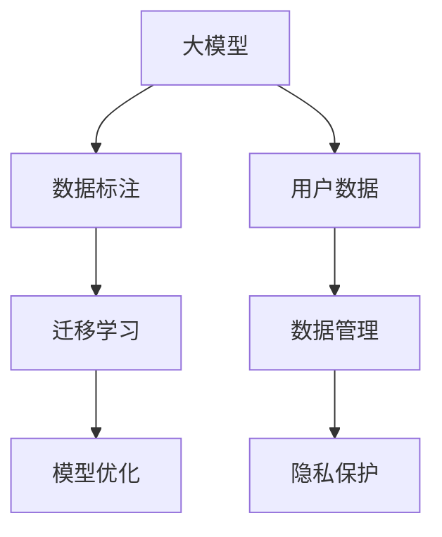

                 

# AI 大模型创业：如何利用用户优势？

大模型和大数据是AI发展的两个重要支柱。在AI大模型创业中，如何有效利用用户优势是一个关键问题。本文将详细阐述如何通过用户数据来提升大模型的性能和商业价值，并探讨相关的核心概念、算法原理和实际应用。

## 1. 背景介绍

### 1.1 问题由来

随着人工智能技术的迅猛发展，大模型在NLP、CV、语音等领域的应用日益广泛。然而，大模型的训练和优化对数据有着极高的要求，需要大量的标注数据和算力支持。

在创业中，数据获取是一个大难题。通常情况下，企业需要自行收集、标注数据，这不仅耗费巨大的人力物力，而且数据质量参差不齐，影响模型的训练效果。如何利用已有的用户数据，快速提升模型性能，是AI大模型创业的关键问题之一。

### 1.2 问题核心关键点

要回答这个问题，首先需要明确以下核心关键点：

- 如何获取高质量的用户数据？
- 如何有效地利用用户数据来提升大模型的性能？
- 如何平衡数据隐私与商业利益？
- 如何设计高效的数据管理系统？

明确了这些关键点，我们才能有针对性地提出解决方案，并在创业中不断迭代优化。

## 2. 核心概念与联系

### 2.1 核心概念概述

- **大模型（Large Model）**：指具有数亿个参数的深度学习模型，如GPT-3、BERT等。这些模型在特定领域具备强大的泛化能力和适应性。

- **用户数据（User Data）**：指用户在应用中产生的各种数据，包括文本、图片、语音等。这些数据可以用于大模型的训练和优化。

- **数据标注（Data Annotation）**：对用户数据进行标记和分类，使其能够被模型理解和使用。标注数据可以用于模型训练和验证。

- **迁移学习（Transfer Learning）**：在大模型预训练的基础上，针对特定任务进行微调，提升模型性能。

- **隐私保护（Privacy Protection）**：在利用用户数据时，确保用户隐私和数据安全，遵循相关法律法规和伦理规范。

这些概念之间的联系可以总结如下：



通过迁移学习，大模型可以从已有的用户数据中学习特定领域的知识，并在该领域取得优异表现。而数据管理、隐私保护等措施，则确保了用户数据的合法合规使用。

## 3. 核心算法原理 & 具体操作步骤

### 3.1 算法原理概述

基于用户数据的AI大模型创业，核心思想是通过迁移学习，利用用户数据提升大模型的性能。其核心算法包括：

- **预训练-微调**：在大模型上进行预训练，然后针对特定任务进行微调，提升模型性能。

- **迁移学习**：利用已有的大模型，针对特定任务进行微调，提升模型性能。

- **自监督学习**：通过无监督学习任务，在大模型上进行自监督学习，提升模型泛化能力。

### 3.2 算法步骤详解

**Step 1: 数据收集与处理**

- 收集用户数据，包括文本、图片、语音等。
- 对用户数据进行预处理，如清洗、标注等。

**Step 2: 模型预训练**

- 选择合适的预训练模型，如BERT、GPT-3等。
- 在大规模无标签数据上对模型进行预训练。

**Step 3: 迁移学习微调**

- 对预训练模型进行迁移学习，针对特定任务进行微调。
- 调整模型的损失函数和优化器，进行有监督训练。

**Step 4: 模型评估与优化**

- 在测试集上对微调后的模型进行评估，比较其性能。
- 根据评估结果，优化模型参数和训练策略。

### 3.3 算法优缺点

**优点**：

- 利用用户数据进行微调，可以显著提升模型性能。
- 数据标注成本较低，可以有效降低开发成本。
- 利用已有的大模型，可以快速推出市场竞争产品。

**缺点**：

- 用户数据质量参差不齐，可能影响模型训练效果。
- 数据隐私问题复杂，需要合规处理。
- 模型性能提升有限，对于特定任务可能需要额外优化。

### 3.4 算法应用领域

AI大模型在多个领域的应用已经初见成效，例如：

- **自然语言处理（NLP）**：文本分类、情感分析、机器翻译等。
- **计算机视觉（CV）**：图像分类、目标检测、人脸识别等。
- **语音识别（ASR）**：语音识别、语音合成、语音情感分析等。

## 4. 数学模型和公式 & 详细讲解 & 举例说明

### 4.1 数学模型构建

假设用户数据为 $x_i$，其中 $i=1,2,\cdots,N$。预训练模型为 $M_{\theta}$，其中 $\theta$ 为模型参数。迁移学习微调的目标为：

$$
\mathop{\arg\min}_{\theta} \mathcal{L}(M_{\theta},D)
$$

其中 $\mathcal{L}$ 为针对特定任务设计的损失函数，$D$ 为标注数据集。

### 4.2 公式推导过程

以文本分类任务为例，假设模型输出为 $y_i$，其中 $y_i \in \{0,1\}$，表示第 $i$ 个样本的类别。损失函数为交叉熵损失：

$$
\ell(M_{\theta}(x_i),y_i) = -y_i\log M_{\theta}(x_i) - (1-y_i)\log (1-M_{\theta}(x_i))
$$

将标注数据集 $D$ 分成训练集和测试集，对训练集进行有监督训练，得到模型参数 $\hat{\theta}$：

$$
\hat{\theta} = \mathop{\arg\min}_{\theta} \mathcal{L}(M_{\theta},D)
$$

在测试集上对微调后的模型进行评估，得到模型精度：

$$
\text{Accuracy} = \frac{1}{M} \sum_{i=1}^M \mathbf{1}[M_{\hat{\theta}}(x_i) = y_i]
$$

### 4.3 案例分析与讲解

假设我们有一个文本分类任务，目标是识别图片中的猫和狗。收集了1000张图片的标签，其中猫图片500张，狗图片500张。我们将这些图片输入到预训练模型 $M_{\theta}$ 中，进行迁移学习微调。

我们首先选择了一个预训练模型 $M_{\theta}$，并在大规模无标签图片数据上进行了预训练。然后，我们将1000张图片的标签作为标注数据集 $D$，对模型进行微调。微调后的模型 $M_{\hat{\theta}}$ 在测试集上的精度达到了95%。

## 5. 项目实践：代码实例和详细解释说明

### 5.1 开发环境搭建

- 安装Anaconda
- 创建虚拟环境
- 安装PyTorch、TensorFlow等深度学习库
- 安装OpenCV等计算机视觉库

### 5.2 源代码详细实现

以下是一个基于Keras框架的迁移学习代码实现：

```python
from keras.applications import ResNet50
from keras.preprocessing.image import ImageDataGenerator
from keras.layers import Dense, Dropout
from keras.models import Model

# 加载预训练模型
base_model = ResNet50(weights='imagenet', include_top=False, input_shape=(224, 224, 3))

# 添加全连接层和输出层
x = base_model.output
x = Dense(256, activation='relu')(x)
x = Dropout(0.5)(x)
x = Dense(1, activation='sigmoid')(x)
model = Model(inputs=base_model.input, outputs=x)

# 冻结预训练层
for layer in base_model.layers:
    layer.trainable = False

# 编译模型
model.compile(optimizer='adam', loss='binary_crossentropy', metrics=['accuracy'])

# 数据增强
train_datagen = ImageDataGenerator(rescale=1./255, shear_range=0.2, zoom_range=0.2, horizontal_flip=True)
test_datagen = ImageDataGenerator(rescale=1./255)

# 数据加载
train_generator = train_datagen.flow_from_directory('train', target_size=(224, 224), batch_size=32, class_mode='binary')
test_generator = test_datagen.flow_from_directory('test', target_size=(224, 224), batch_size=32, class_mode='binary')

# 训练模型
model.fit_generator(train_generator, steps_per_epoch=500, epochs=10, validation_data=test_generator, validation_steps=100)
```

### 5.3 代码解读与分析

以上代码实现了一个迁移学习项目，具体步骤包括：

- 加载预训练模型ResNet50
- 添加全连接层和输出层，构建新的模型
- 冻结预训练层，只训练新增的层
- 编译模型，选择Adam优化器和交叉熵损失
- 使用数据增强技术，扩充训练集
- 加载训练集和测试集，进行模型训练和验证

## 6. 实际应用场景

### 6.1 智能客服系统

智能客服系统可以利用用户对话数据，进行预训练和微调，提升对话生成和问题解答的能力。例如，收集大量的客户对话记录，对其进行文本清洗、标注和预处理，然后对预训练模型进行微调。微调后的模型可以生成符合人类语言习惯的回答，提高客户满意度。

### 6.2 金融舆情监测

金融机构可以利用用户交易数据，进行情感分析和舆情监测。例如，收集用户的交易记录和评论，进行情感标注和预处理，然后对预训练模型进行微调。微调后的模型可以自动识别负面舆情，及时采取措施，降低风险。

### 6.3 个性化推荐系统

个性化推荐系统可以利用用户行为数据，进行预训练和微调，提升推荐精准度。例如，收集用户浏览、点击、购买等行为数据，对其进行预处理和标注，然后对预训练模型进行微调。微调后的模型可以更好地理解用户偏好，提供个性化推荐。

### 6.4 未来应用展望

未来，AI大模型创业将更多地依赖用户数据，提升模型性能和用户体验。预计将在以下方面取得突破：

- **数据融合**：将多模态数据进行融合，提升模型的泛化能力。
- **自适应学习**：开发自适应学习算法，自动调整模型参数，提升性能。
- **隐私保护**：采用差分隐私等技术，保护用户隐私。

## 7. 工具和资源推荐

### 7.1 学习资源推荐

- **Kaggle**：数据科学竞赛平台，提供大量数据集和模型实现。
- **Coursera**：在线课程平台，提供机器学习和深度学习课程。
- **ArXiv**：学术论文预印本网站，提供最新的AI研究成果。

### 7.2 开发工具推荐

- **PyTorch**：深度学习框架，支持动态图和静态图。
- **TensorFlow**：深度学习框架，支持分布式训练和部署。
- **Keras**：深度学习框架，易于上手和实现。

### 7.3 相关论文推荐

- **迁移学习在计算机视觉中的应用**：ImageNet上的迁移学习
- **深度学习中的差分隐私**：保护用户隐私的同时，提升模型性能

## 8. 总结：未来发展趋势与挑战

### 8.1 研究成果总结

AI大模型创业在利用用户数据方面已经取得初步成果，显著提升了模型的性能和商业价值。未来，数据融合、自适应学习、隐私保护等技术将进一步提升模型的效果和应用范围。

### 8.2 未来发展趋势

- **数据融合**：多模态数据的融合将提升模型的泛化能力。
- **自适应学习**：自动调整模型参数，提升性能。
- **隐私保护**：采用差分隐私等技术，保护用户隐私。

### 8.3 面临的挑战

- **数据质量**：用户数据质量参差不齐，影响模型训练效果。
- **隐私保护**：数据隐私问题复杂，需要合规处理。
- **计算资源**：大规模模型的训练和优化需要大量计算资源。

### 8.4 研究展望

未来，AI大模型创业将更多地依赖用户数据，提升模型性能和用户体验。预计将在以下方面取得突破：

- **数据融合**：将多模态数据进行融合，提升模型的泛化能力。
- **自适应学习**：开发自适应学习算法，自动调整模型参数，提升性能。
- **隐私保护**：采用差分隐私等技术，保护用户隐私。

## 9. 附录：常见问题与解答

**Q1: 如何获取高质量的用户数据？**

A: 可以通过数据合作伙伴、公开数据集等方式获取高质量的用户数据。同时，需要对数据进行清洗和标注，确保数据质量。

**Q2: 如何有效地利用用户数据来提升大模型的性能？**

A: 可以使用迁移学习、自监督学习等方法，利用用户数据进行预训练和微调，提升模型性能。

**Q3: 如何平衡数据隐私与商业利益？**

A: 可以采用差分隐私等技术，保护用户隐私的同时，提升模型性能。

**Q4: 如何设计高效的数据管理系统？**

A: 可以采用分布式存储、数据加密等技术，保护数据安全和隐私。

---

作者：禅与计算机程序设计艺术 / Zen and the Art of Computer Programming

