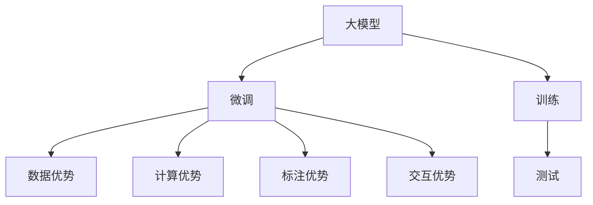

                 

# AI 大模型创业：如何利用用户优势？

## 1. 背景介绍

### 1.1 问题由来

近年来，人工智能大模型（如OpenAI的GPT、Google的BERT）在各行各业的应用变得越来越广泛。这些大模型能够理解自然语言，生成文本，进行图像和语音处理，甚至能够进行推荐和决策。但是，这些大模型在实际应用中存在一些问题，比如计算资源消耗大、训练时间长、成本高昂等。因此，如何利用用户优势，降低成本，提升效率，成为创业公司需要解决的一个重要问题。

### 1.2 问题核心关键点

利用用户优势，提升大模型的效率和性能，可以通过以下几种方式：

1. **数据优势**：利用用户的个性化数据，进行微调训练，提升模型对特定领域的适应能力。
2. **计算优势**：利用用户的计算资源，降低大规模模型的计算成本。
3. **标注优势**：利用用户标注的数据，进行监督学习，提升模型的准确性。
4. **交互优势**：利用用户的互动反馈，进行实时训练，提升模型的实时性和响应速度。

### 1.3 问题研究意义

利用用户优势，不仅能提升大模型的性能和效率，还能降低创业公司的成本，加速AI技术的普及和应用。此外，利用用户优势，还能提升模型的可解释性和安全性，减少偏见和误导，增强用户信任。

## 2. 核心概念与联系

### 2.1 核心概念概述

为了更好地理解如何利用用户优势，本节将介绍几个密切相关的核心概念：

- **大模型（Large Model）**：指在特定领域进行训练的大型神经网络模型，如BERT、GPT等。
- **微调（Fine-tuning）**：指在大模型的基础上，利用用户数据进行进一步的训练，提升模型对特定任务的适应能力。
- **数据优势**：指利用用户数据进行微调训练，提升模型对特定领域的适应能力。
- **计算优势**：指利用用户的计算资源，降低大规模模型的计算成本。
- **标注优势**：指利用用户标注的数据，进行监督学习，提升模型的准确性。
- **交互优势**：指利用用户的互动反馈，进行实时训练，提升模型的实时性和响应速度。

这些核心概念之间的逻辑关系可以通过以下Mermaid流程图来展示：



这个流程图展示了大模型微调的优势来源：

1. 大模型通过训练获取通用的语言表示，可以通过微调提升对特定任务的适应能力。
2. 数据优势、计算优势、标注优势和交互优势，都能进一步提升模型的性能和效率。

## 3. 核心算法原理 & 具体操作步骤
### 3.1 算法原理概述

利用用户优势进行大模型微调的算法原理基于监督学习和迁移学习。通过收集用户数据，对大模型进行微调，使其适应特定的任务和领域。具体来说，可以利用用户的数据优势、计算优势、标注优势和交互优势，对大模型进行微调训练。

### 3.2 算法步骤详解

基于用户优势的大模型微调一般包括以下几个关键步骤：

**Step 1: 数据收集与处理**
- 收集用户的个性化数据，如日志、标注数据、交互数据等。
- 对数据进行清洗和标注，确保数据质量和一致性。

**Step 2: 选择预训练模型**
- 选择合适的预训练模型作为初始化参数，如BERT、GPT等。
- 下载预训练模型的权重和配置文件。

**Step 3: 设计微调任务**
- 根据具体任务，设计合适的输出层和损失函数。
- 定义微调的目标和评价指标。

**Step 4: 设置微调参数**
- 选择合适的优化算法及其参数，如Adam、SGD等，设置学习率、批大小、迭代轮数等。
- 设置正则化技术及强度，包括权重衰减、Dropout、Early Stopping等。
- 确定冻结预训练参数的策略，如仅微调顶层，或全部参数都参与微调。

**Step 5: 执行梯度训练**
- 将训练集数据分批次输入模型，前向传播计算损失函数。
- 反向传播计算参数梯度，根据设定的优化算法和学习率更新模型参数。
- 周期性在验证集上评估模型性能，根据性能指标决定是否触发 Early Stopping。
- 重复上述步骤直到满足预设的迭代轮数或 Early Stopping 条件。

**Step 6: 测试和部署**
- 在测试集上评估微调后模型 $M_{\hat{\theta}}$ 的性能，对比微调前后的精度提升。
- 使用微调后的模型对新样本进行推理预测，集成到实际的应用系统中。
- 持续收集新的数据，定期重新微调模型，以适应数据分布的变化。

以上是基于用户优势的大模型微调的一般流程。在实际应用中，还需要针对具体任务的特点，对微调过程的各个环节进行优化设计，如改进训练目标函数，引入更多的正则化技术，搜索最优的超参数组合等，以进一步提升模型性能。

### 3.3 算法优缺点

利用用户优势进行大模型微调具有以下优点：

1. **高效性**：利用用户的计算资源和数据，可以降低模型训练和推理的成本。
2. **针对性**：利用用户数据进行微调，可以提升模型对特定领域的适应能力，提高模型的准确性。
3. **可解释性**：利用用户互动反馈进行实时训练，可以增强模型的可解释性和透明度。
4. **安全性和伦理性**：利用用户数据进行微调，可以减少偏见和误导，增强用户信任。

同时，该方法也存在一定的局限性：

1. **隐私问题**：收集和利用用户数据，需要遵守数据保护法规，保护用户隐私。
2. **数据质量**：用户数据的准确性和一致性直接影响模型的性能，需要注意数据质量问题。
3. **计算资源限制**：用户计算资源有限，可能需要与其他用户共享资源，影响训练效率。
4. **数据多样性**：用户数据可能存在样本不均衡问题，需要采取数据增强等方法提升模型泛化能力。

尽管存在这些局限性，但就目前而言，利用用户优势进行大模型微调仍然是一种有效的方式，能够显著降低创业公司的成本，加速AI技术的普及和应用。

### 3.4 算法应用领域

利用用户优势进行大模型微调的方法在多个领域得到了广泛应用，例如：

- **智能客服**：利用用户的互动数据，对客服系统进行微调，提升客服系统的响应速度和准确性。
- **金融风控**：利用用户的交易数据，对风险模型进行微调，提高金融风险预测的准确性。
- **医疗诊断**：利用用户的健康数据，对诊断模型进行微调，提升医疗诊断的准确性和可靠性。
- **推荐系统**：利用用户的兴趣数据，对推荐模型进行微调，提高推荐系统的个性化和准确性。
- **安防监控**：利用用户的交互数据，对监控系统进行微调，提高异常行为检测的准确性。

除了上述这些经典应用外，利用用户优势进行大模型微调的方法还将被创新性地应用到更多场景中，如智能家居、智慧城市、智能制造等，为AI技术在各行各业的应用提供新的思路。

## 4. 数学模型和公式 & 详细讲解  
### 4.1 数学模型构建

本节将使用数学语言对基于用户优势的大模型微调过程进行更加严格的刻画。

记预训练模型为 $M_{\theta}$，用户数据为 $D=\{(x_i, y_i)\}_{i=1}^N$，其中 $x_i$ 为输入，$y_i$ 为标签。定义模型 $M_{\theta}$ 在数据样本 $(x,y)$ 上的损失函数为 $\ell(M_{\theta}(x),y)$，则在数据集 $D$ 上的经验风险为：

$$
\mathcal{L}(\theta) = \frac{1}{N} \sum_{i=1}^N \ell(M_{\theta}(x_i),y_i)
$$

微调的优化目标是最小化经验风险，即找到最优参数：

$$
\theta^* = \mathop{\arg\min}_{\theta} \mathcal{L}(\theta)
$$

在实践中，我们通常使用基于梯度的优化算法（如SGD、Adam等）来近似求解上述最优化问题。设 $\eta$ 为学习率，$\lambda$ 为正则化系数，则参数的更新公式为：

$$
\theta \leftarrow \theta - \eta \nabla_{\theta}\mathcal{L}(\theta) - \eta\lambda\theta
$$

其中 $\nabla_{\theta}\mathcal{L}(\theta)$ 为损失函数对参数 $\theta$ 的梯度，可通过反向传播算法高效计算。

### 4.2 公式推导过程

以下我们以二分类任务为例，推导交叉熵损失函数及其梯度的计算公式。

假设模型 $M_{\theta}$ 在输入 $x$ 上的输出为 $\hat{y}=M_{\theta}(x) \in [0,1]$，表示样本属于正类的概率。真实标签 $y \in \{0,1\}$。则二分类交叉熵损失函数定义为：

$$
\ell(M_{\theta}(x),y) = -[y\log \hat{y} + (1-y)\log (1-\hat{y})]
$$

将其代入经验风险公式，得：

$$
\mathcal{L}(\theta) = -\frac{1}{N}\sum_{i=1}^N [y_i\log M_{\theta}(x_i)+(1-y_i)\log(1-M_{\theta}(x_i))]
$$

根据链式法则，损失函数对参数 $\theta_k$ 的梯度为：

$$
\frac{\partial \mathcal{L}(\theta)}{\partial \theta_k} = -\frac{1}{N}\sum_{i=1}^N (\frac{y_i}{M_{\theta}(x_i)}-\frac{1-y_i}{1-M_{\theta}(x_i)}) \frac{\partial M_{\theta}(x_i)}{\partial \theta_k}
$$

其中 $\frac{\partial M_{\theta}(x_i)}{\partial \theta_k}$ 可进一步递归展开，利用自动微分技术完成计算。

在得到损失函数的梯度后，即可带入参数更新公式，完成模型的迭代优化。重复上述过程直至收敛，最终得到适应下游任务的最优模型参数 $\theta^*$。

## 5. 项目实践：代码实例和详细解释说明
### 5.1 开发环境搭建

在进行微调实践前，我们需要准备好开发环境。以下是使用Python进行PyTorch开发的环境配置流程：

1. 安装Anaconda：从官网下载并安装Anaconda，用于创建独立的Python环境。

2. 创建并激活虚拟环境：
```bash
conda create -n pytorch-env python=3.8 
conda activate pytorch-env
```

3. 安装PyTorch：根据CUDA版本，从官网获取对应的安装命令。例如：
```bash
conda install pytorch torchvision torchaudio cudatoolkit=11.1 -c pytorch -c conda-forge
```

4. 安装Transformers库：
```bash
pip install transformers
```

5. 安装各类工具包：
```bash
pip install numpy pandas scikit-learn matplotlib tqdm jupyter notebook ipython
```

完成上述步骤后，即可在`pytorch-env`环境中开始微调实践。

### 5.2 源代码详细实现

下面我们以命名实体识别(NER)任务为例，给出使用Transformers库对BERT模型进行微调的PyTorch代码实现。

首先，定义NER任务的数据处理函数：

```python
from transformers import BertTokenizer
from torch.utils.data import Dataset
import torch

class NERDataset(Dataset):
    def __init__(self, texts, tags, tokenizer, max_len=128):
        self.texts = texts
        self.tags = tags
        self.tokenizer = tokenizer
        self.max_len = max_len
        
    def __len__(self):
        return len(self.texts)
    
    def __getitem__(self, item):
        text = self.texts[item]
        tags = self.tags[item]
        
        encoding = self.tokenizer(text, return_tensors='pt', max_length=self.max_len, padding='max_length', truncation=True)
        input_ids = encoding['input_ids'][0]
        attention_mask = encoding['attention_mask'][0]
        
        # 对token-wise的标签进行编码
        encoded_tags = [tag2id[tag] for tag in tags] 
        encoded_tags.extend([tag2id['O']] * (self.max_len - len(encoded_tags)))
        labels = torch.tensor(encoded_tags, dtype=torch.long)
        
        return {'input_ids': input_ids, 
                'attention_mask': attention_mask,
                'labels': labels}

# 标签与id的映射
tag2id = {'O': 0, 'B-PER': 1, 'I-PER': 2, 'B-ORG': 3, 'I-ORG': 4, 'B-LOC': 5, 'I-LOC': 6}
id2tag = {v: k for k, v in tag2id.items()}

# 创建dataset
tokenizer = BertTokenizer.from_pretrained('bert-base-cased')

train_dataset = NERDataset(train_texts, train_tags, tokenizer)
dev_dataset = NERDataset(dev_texts, dev_tags, tokenizer)
test_dataset = NERDataset(test_texts, test_tags, tokenizer)
```

然后，定义模型和优化器：

```python
from transformers import BertForTokenClassification, AdamW

model = BertForTokenClassification.from_pretrained('bert-base-cased', num_labels=len(tag2id))

optimizer = AdamW(model.parameters(), lr=2e-5)
```

接着，定义训练和评估函数：

```python
from torch.utils.data import DataLoader
from tqdm import tqdm
from sklearn.metrics import classification_report

device = torch.device('cuda') if torch.cuda.is_available() else torch.device('cpu')
model.to(device)

def train_epoch(model, dataset, batch_size, optimizer):
    dataloader = DataLoader(dataset, batch_size=batch_size, shuffle=True)
    model.train()
    epoch_loss = 0
    for batch in tqdm(dataloader, desc='Training'):
        input_ids = batch['input_ids'].to(device)
        attention_mask = batch['attention_mask'].to(device)
        labels = batch['labels'].to(device)
        model.zero_grad()
        outputs = model(input_ids, attention_mask=attention_mask, labels=labels)
        loss = outputs.loss
        epoch_loss += loss.item()
        loss.backward()
        optimizer.step()
    return epoch_loss / len(dataloader)

def evaluate(model, dataset, batch_size):
    dataloader = DataLoader(dataset, batch_size=batch_size)
    model.eval()
    preds, labels = [], []
    with torch.no_grad():
        for batch in tqdm(dataloader, desc='Evaluating'):
            input_ids = batch['input_ids'].to(device)
            attention_mask = batch['attention_mask'].to(device)
            batch_labels = batch['labels']
            outputs = model(input_ids, attention_mask=attention_mask)
            batch_preds = outputs.logits.argmax(dim=2).to('cpu').tolist()
            batch_labels = batch_labels.to('cpu').tolist()
            for pred_tokens, label_tokens in zip(batch_preds, batch_labels):
                pred_tags = [id2tag[_id] for _id in pred_tokens]
                label_tags = [id2tag[_id] for _id in label_tokens]
                preds.append(pred_tags[:len(label_tags)])
                labels.append(label_tags)
                
    print(classification_report(labels, preds))
```

最后，启动训练流程并在测试集上评估：

```python
epochs = 5
batch_size = 16

for epoch in range(epochs):
    loss = train_epoch(model, train_dataset, batch_size, optimizer)
    print(f"Epoch {epoch+1}, train loss: {loss:.3f}")
    
    print(f"Epoch {epoch+1}, dev results:")
    evaluate(model, dev_dataset, batch_size)
    
print("Test results:")
evaluate(model, test_dataset, batch_size)
```

以上就是使用PyTorch对BERT进行命名实体识别任务微调的完整代码实现。可以看到，得益于Transformers库的强大封装，我们可以用相对简洁的代码完成BERT模型的加载和微调。

### 5.3 代码解读与分析

让我们再详细解读一下关键代码的实现细节：

**NERDataset类**：
- `__init__`方法：初始化文本、标签、分词器等关键组件。
- `__len__`方法：返回数据集的样本数量。
- `__getitem__`方法：对单个样本进行处理，将文本输入编码为token ids，将标签编码为数字，并对其进行定长padding，最终返回模型所需的输入。

**tag2id和id2tag字典**：
- 定义了标签与数字id之间的映射关系，用于将token-wise的预测结果解码回真实的标签。

**训练和评估函数**：
- 使用PyTorch的DataLoader对数据集进行批次化加载，供模型训练和推理使用。
- 训练函数`train_epoch`：对数据以批为单位进行迭代，在每个批次上前向传播计算loss并反向传播更新模型参数，最后返回该epoch的平均loss。
- 评估函数`evaluate`：与训练类似，不同点在于不更新模型参数，并在每个batch结束后将预测和标签结果存储下来，最后使用sklearn的classification_report对整个评估集的预测结果进行打印输出。

**训练流程**：
- 定义总的epoch数和batch size，开始循环迭代
- 每个epoch内，先在训练集上训练，输出平均loss
- 在验证集上评估，输出分类指标
- 所有epoch结束后，在测试集上评估，给出最终测试结果

可以看到，PyTorch配合Transformers库使得BERT微调的代码实现变得简洁高效。开发者可以将更多精力放在数据处理、模型改进等高层逻辑上，而不必过多关注底层的实现细节。

当然，工业级的系统实现还需考虑更多因素，如模型的保存和部署、超参数的自动搜索、更灵活的任务适配层等。但核心的微调范式基本与此类似。

## 6. 实际应用场景
### 6.1 智能客服系统

基于大语言模型微调的对话技术，可以广泛应用于智能客服系统的构建。传统客服往往需要配备大量人力，高峰期响应缓慢，且一致性和专业性难以保证。而使用微调后的对话模型，可以7x24小时不间断服务，快速响应客户咨询，用自然流畅的语言解答各类常见问题。

在技术实现上，可以收集企业内部的历史客服对话记录，将问题和最佳答复构建成监督数据，在此基础上对预训练对话模型进行微调。微调后的对话模型能够自动理解用户意图，匹配最合适的答案模板进行回复。对于客户提出的新问题，还可以接入检索系统实时搜索相关内容，动态组织生成回答。如此构建的智能客服系统，能大幅提升客户咨询体验和问题解决效率。

### 6.2 金融舆情监测

金融机构需要实时监测市场舆论动向，以便及时应对负面信息传播，规避金融风险。传统的人工监测方式成本高、效率低，难以应对网络时代海量信息爆发的挑战。基于大语言模型微调的文本分类和情感分析技术，为金融舆情监测提供了新的解决方案。

具体而言，可以收集金融领域相关的新闻、报道、评论等文本数据，并对其进行主题标注和情感标注。在此基础上对预训练语言模型进行微调，使其能够自动判断文本属于何种主题，情感倾向是正面、中性还是负面。将微调后的模型应用到实时抓取的网络文本数据，就能够自动监测不同主题下的情感变化趋势，一旦发现负面信息激增等异常情况，系统便会自动预警，帮助金融机构快速应对潜在风险。

### 6.3 个性化推荐系统

当前的推荐系统往往只依赖用户的历史行为数据进行物品推荐，无法深入理解用户的真实兴趣偏好。基于大语言模型微调技术，个性化推荐系统可以更好地挖掘用户行为背后的语义信息，从而提供更精准、多样的推荐内容。

在实践中，可以收集用户浏览、点击、评论、分享等行为数据，提取和用户交互的物品标题、描述、标签等文本内容。将文本内容作为模型输入，用户的后续行为（如是否点击、购买等）作为监督信号，在此基础上微调预训练语言模型。微调后的模型能够从文本内容中准确把握用户的兴趣点。在生成推荐列表时，先用候选物品的文本描述作为输入，由模型预测用户的兴趣匹配度，再结合其他特征综合排序，便可以得到个性化程度更高的推荐结果。

### 6.4 未来应用展望

随着大语言模型微调技术的发展，基于用户优势的AI系统将在更多领域得到应用，为传统行业带来变革性影响。

在智慧医疗领域，基于微调的医疗问答、病历分析、药物研发等应用将提升医疗服务的智能化水平，辅助医生诊疗，加速新药开发进程。

在智能教育领域，微调技术可应用于作业批改、学情分析、知识推荐等方面，因材施教，促进教育公平，提高教学质量。

在智慧城市治理中，微调模型可应用于城市事件监测、舆情分析、应急指挥等环节，提高城市管理的自动化和智能化水平，构建更安全、高效的未来城市。

此外，在企业生产、社会治理、文娱传媒等众多领域，基于大模型微调的人工智能应用也将不断涌现，为经济社会发展注入新的动力。相信随着技术的日益成熟，利用用户优势进行大模型微调的方法将成为AI技术落地应用的重要手段，推动人工智能技术在各行各业的普及和应用。

## 7. 工具和资源推荐
### 7.1 学习资源推荐

为了帮助开发者系统掌握大语言模型微调的理论基础和实践技巧，这里推荐一些优质的学习资源：

1. 《Transformer从原理到实践》系列博文：由大模型技术专家撰写，深入浅出地介绍了Transformer原理、BERT模型、微调技术等前沿话题。

2. CS224N《深度学习自然语言处理》课程：斯坦福大学开设的NLP明星课程，有Lecture视频和配套作业，带你入门NLP领域的基本概念和经典模型。

3. 《Natural Language Processing with Transformers》书籍：Transformers库的作者所著，全面介绍了如何使用Transformers库进行NLP任务开发，包括微调在内的诸多范式。

4. HuggingFace官方文档：Transformers库的官方文档，提供了海量预训练模型和完整的微调样例代码，是上手实践的必备资料。

5. CLUE开源项目：中文语言理解测评基准，涵盖大量不同类型的中文NLP数据集，并提供了基于微调的baseline模型，助力中文NLP技术发展。

通过对这些资源的学习实践，相信你一定能够快速掌握大语言模型微调的精髓，并用于解决实际的NLP问题。
###  7.2 开发工具推荐

高效的开发离不开优秀的工具支持。以下是几款用于大语言模型微调开发的常用工具：

1. PyTorch：基于Python的开源深度学习框架，灵活动态的计算图，适合快速迭代研究。大部分预训练语言模型都有PyTorch版本的实现。

2. TensorFlow：由Google主导开发的开源深度学习框架，生产部署方便，适合大规模工程应用。同样有丰富的预训练语言模型资源。

3. Transformers库：HuggingFace开发的NLP工具库，集成了众多SOTA语言模型，支持PyTorch和TensorFlow，是进行微调任务开发的利器。

4. Weights & Biases：模型训练的实验跟踪工具，可以记录和可视化模型训练过程中的各项指标，方便对比和调优。与主流深度学习框架无缝集成。

5. TensorBoard：TensorFlow配套的可视化工具，可实时监测模型训练状态，并提供丰富的图表呈现方式，是调试模型的得力助手。

6. Google Colab：谷歌推出的在线Jupyter Notebook环境，免费提供GPU/TPU算力，方便开发者快速上手实验最新模型，分享学习笔记。

合理利用这些工具，可以显著提升大语言模型微调任务的开发效率，加快创新迭代的步伐。

### 7.3 相关论文推荐

大语言模型和微调技术的发展源于学界的持续研究。以下是几篇奠基性的相关论文，推荐阅读：

1. Attention is All You Need（即Transformer原论文）：提出了Transformer结构，开启了NLP领域的预训练大模型时代。

2. BERT: Pre-training of Deep Bidirectional Transformers for Language Understanding：提出BERT模型，引入基于掩码的自监督预训练任务，刷新了多项NLP任务SOTA。

3. Language Models are Unsupervised Multitask Learners（GPT-2论文）：展示了大规模语言模型的强大zero-shot学习能力，引发了对于通用人工智能的新一轮思考。

4. Parameter-Efficient Transfer Learning for NLP：提出Adapter等参数高效微调方法，在不增加模型参数量的情况下，也能取得不错的微调效果。

5. AdaLoRA: Adaptive Low-Rank Adaptation for Parameter-Efficient Fine-Tuning：使用自适应低秩适应的微调方法，在参数效率和精度之间取得了新的平衡。

这些论文代表了大语言模型微调技术的发展脉络。通过学习这些前沿成果，可以帮助研究者把握学科前进方向，激发更多的创新灵感。

## 8. 总结：未来发展趋势与挑战
### 8.1 总结

本文对利用用户优势进行大模型微调的方法进行了全面系统的介绍。首先阐述了大模型微调和用户优势的结合背景和意义，明确了利用用户数据提升模型性能的独特价值。其次，从原理到实践，详细讲解了基于用户优势的微调算法，给出了微调任务开发的完整代码实例。同时，本文还广泛探讨了微调方法在智能客服、金融舆情、个性化推荐等多个行业领域的应用前景，展示了利用用户优势进行微调的方法的强大潜力。此外，本文精选了微调技术的各类学习资源，力求为读者提供全方位的技术指引。

通过本文的系统梳理，可以看到，利用用户优势进行大模型微调，不仅能显著提升模型的性能和效率，还能降低创业公司的成本，加速AI技术的普及和应用。未来，伴随预训练语言模型和微调方法的持续演进，基于用户优势的微调方法必将在更多领域得到应用，为AI技术在各行各业的应用提供新的思路。

### 8.2 未来发展趋势

展望未来，利用用户优势进行大模型微调的技术将呈现以下几个发展趋势：

1. **数据优势不断增强**：随着AI技术的发展，越来越多的用户数据将被收集和利用，提升模型的泛化能力和适应性。
2. **计算优势多样化**：除了CPU/GPU，未来的计算资源将更加多样化，如边缘计算、量子计算等，为AI技术的应用提供更多可能性。
3. **标注优势智能化**：利用用户的互动反馈，实现实时标注，提升标注数据的准确性和多样性。
4. **交互优势更深入**：通过用户反馈进行实时训练，提升模型的实时性和响应速度，增强用户互动体验。
5. **多模态优势融合**：利用多模态数据进行微调，提升模型的感知能力和任务执行效果。
6. **伦理和安全优势**：通过用户数据进行微调，增强模型的可解释性和透明度，提升系统的伦理和安全性能。

以上趋势凸显了利用用户优势进行大模型微调技术的广阔前景。这些方向的探索发展，必将进一步提升AI系统的性能和应用范围，为AI技术在各行各业的应用提供新的思路。

### 8.3 面临的挑战

尽管利用用户优势进行大模型微调技术已经取得了瞩目成就，但在迈向更加智能化、普适化应用的过程中，它仍面临着诸多挑战：

1. **隐私保护问题**：收集和利用用户数据，需要遵守数据保护法规，保护用户隐私。
2. **数据质量问题**：用户数据的准确性和一致性直接影响模型的性能，需要注意数据质量问题。
3. **计算资源限制**：用户计算资源有限，可能需要与其他用户共享资源，影响训练效率。
4. **数据多样性问题**：用户数据可能存在样本不均衡问题，需要采取数据增强等方法提升模型泛化能力。
5. **伦理和安全问题**：利用用户数据进行微调，可能引入偏见和有害信息，需要加强伦理和安全保障。

尽管存在这些挑战，但就目前而言，利用用户优势进行大模型微调仍然是一种有效的方式，能够显著降低创业公司的成本，加速AI技术的普及和应用。

### 8.4 研究展望

面对利用用户优势进行大模型微调所面临的挑战，未来的研究需要在以下几个方面寻求新的突破：

1. **数据隐私保护技术**：研究数据加密、匿名化等技术，确保用户数据的安全和隐私。
2. **高效数据处理算法**：研究高效的数据清洗、标注和增强算法，提升数据质量。
3. **多模态融合技术**：研究多模态数据融合技术，提升模型的感知能力和泛化能力。
4. **可解释性增强技术**：研究模型可解释性增强技术，提升模型的透明性和可解释性。
5. **伦理和安全保障机制**：研究模型伦理和安全保障机制，确保模型的公平性和安全性。

这些研究方向的研究突破，必将进一步提升利用用户优势进行大模型微调技术的性能和应用范围，为AI技术在各行各业的应用提供新的思路。总之，利用用户优势进行大模型微调，将是大模型应用的重要范式，未来值得更多的关注和研究。

## 9. 附录：常见问题与解答

**Q1：利用用户优势进行大模型微调是否适用于所有NLP任务？**

A: 利用用户优势进行大模型微调在大多数NLP任务上都能取得不错的效果，特别是对于数据量较小的任务。但对于一些特定领域的任务，如医学、法律等，仅仅依靠通用语料预训练的模型可能难以很好地适应。此时需要在特定领域语料上进一步预训练，再进行微调，才能获得理想效果。此外，对于一些需要时效性、个性化很强的任务，如对话、推荐等，微调方法也需要针对性的改进优化。

**Q2：微调过程中如何选择合适的学习率？**

A: 微调的学习率一般要比预训练时小1-2个数量级，如果使用过大的学习率，容易破坏预训练权重，导致过拟合。一般建议从1e-5开始调参，逐步减小学习率，直至收敛。也可以使用warmup策略，在开始阶段使用较小的学习率，再逐渐过渡到预设值。需要注意的是，不同的优化器(如Adam、SGD等)以及不同的学习率调度策略，可能需要设置不同的学习率阈值。

**Q3：利用用户优势进行大模型微调时需要注意哪些问题？**

A: 利用用户优势进行大模型微调，需要注意以下问题：
1. 数据隐私保护：收集和利用用户数据，需要遵守数据保护法规，保护用户隐私。
2. 数据质量：用户数据的准确性和一致性直接影响模型的性能，需要注意数据质量问题。
3. 计算资源限制：用户计算资源有限，可能需要与其他用户共享资源，影响训练效率。
4. 数据多样性：用户数据可能存在样本不均衡问题，需要采取数据增强等方法提升模型泛化能力。
5. 伦理和安全问题：利用用户数据进行微调，可能引入偏见和有害信息，需要加强伦理和安全保障。

这些问题是利用用户优势进行大模型微调过程中需要注意的。只有在数据、模型、训练、推理等各环节进行全面优化，才能最大限度地发挥大模型微调的威力。

**Q4：如何缓解微调过程中的过拟合问题？**

A: 过拟合是微调面临的主要挑战，尤其是在标注数据不足的情况下。常见的缓解策略包括：
1. 数据增强：通过回译、近义替换等方式扩充训练集。
2. 正则化：使用L2正则、Dropout、Early Stopping等避免过拟合。
3. 对抗训练：引入对抗样本，提高模型鲁棒性。
4. 参数高效微调：只调整少量参数(如Adapter、Prefix等)，减小过拟合风险。
5. 多模型集成：训练多个微调模型，取平均输出，抑制过拟合。

这些策略往往需要根据具体任务和数据特点进行灵活组合。只有在数据、模型、训练、推理等各环节进行全面优化，才能最大限度地发挥大模型微调的威力。

**Q5：微调模型在落地部署时需要注意哪些问题？**

A: 将微调模型转化为实际应用，还需要考虑以下问题：
1. 模型裁剪：去除不必要的层和参数，减小模型尺寸，加快推理速度。
2. 量化加速：将浮点模型转为定点模型，压缩存储空间，提高计算效率。
3. 服务化封装：将模型封装为标准化服务接口，便于集成调用。
4. 弹性伸缩：根据请求流量动态调整资源配置，平衡服务质量和成本。
5. 监控告警：实时采集系统指标，设置异常告警阈值，确保服务稳定性。
6. 安全防护：采用访问鉴权、数据脱敏等措施，保障数据和模型安全。

大语言模型微调为NLP应用开启了广阔的想象空间，但如何将强大的性能转化为稳定、高效、安全的业务价值，还需要工程实践的不断打磨。唯有从数据、算法、工程、业务等多个维度协同发力，才能真正实现人工智能技术在垂直行业的规模化落地。总之，利用用户优势进行大模型微调，需要考虑多方面的因素，才能确保其高效性、安全性、可靠性，为AI技术在各行各业的应用提供新的思路。

---

作者：禅与计算机程序设计艺术 / Zen and the Art of Computer Programming

