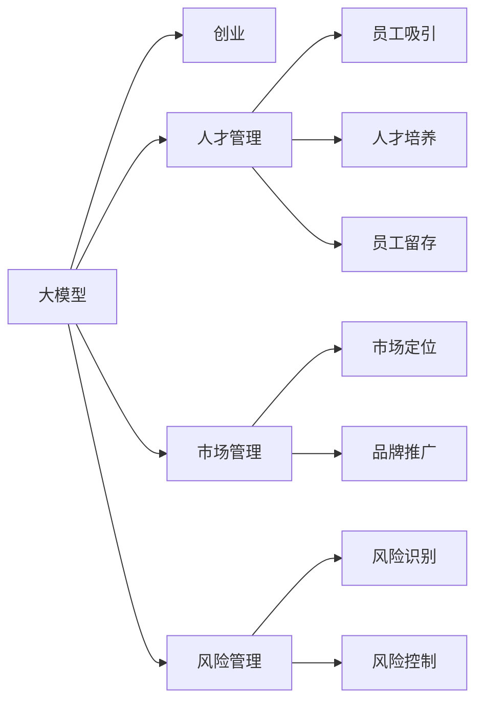

                 

# AI 大模型创业：如何利用管理优势？

大模型技术的发展正迅速改变着各行各业的格局，从传统的硬件驱动向软硬件并举转变。AI大模型创业公司如何在这个转型的过程中取得优势，如何通过管理来提升整体竞争力，成为了一个值得探讨的话题。本文将详细分析AI大模型创业公司在管理上的优势，以及如何利用这些优势来推动公司的发展。

## 1. 背景介绍

### 1.1 背景分析

随着人工智能技术的进步，大模型如BERT、GPT-3等逐渐走向成熟，大模型技术成为AI创业公司的核心竞争力之一。大模型公司不仅需要先进的算法和产品，还需要完善的管理体系和策略来支持其快速发展。公司如何在激烈的竞争中脱颖而出，利用管理优势成为关键。

### 1.2 当前形势

当前，AI大模型行业竞争激烈，公司需要不断创新才能保持领先地位。管理优势不仅能提升公司的技术竞争力，还能增强其品牌影响力和市场响应速度。管理优势不仅包括技术管理，还包括人才管理、市场管理、风险管理等多方面。

## 2. 核心概念与联系

### 2.1 核心概念概述

本节将介绍几个密切相关的核心概念，包括大模型、创业、管理优势、人才管理、市场管理、风险管理等。

- 大模型：指利用大规模数据训练得到的深度学习模型，如BERT、GPT-3等。
- 创业：指创建并发展一个新企业的过程，尤其是在科技领域。
- 管理优势：指公司在管理上超越竞争对手的能力，如高效的人才管理、灵活的市场策略、科学的决策机制等。
- 人才管理：指公司如何吸引、培养和留住人才，是管理中最重要的环节之一。
- 市场管理：指公司如何制定市场策略，定位目标市场，提升品牌影响力。
- 风险管理：指公司如何识别和控制可能影响公司运营和发展的各种风险。

这些核心概念之间的逻辑关系可以通过以下Mermaid流程图来展示：



这个流程图展示了大模型、创业、管理优势以及人才管理、市场管理、风险管理等概念之间的相互联系。

## 3. 核心算法原理 & 具体操作步骤

### 3.1 算法原理概述

AI大模型创业公司的管理优势可以概括为以下三个方面：

1. **高效的人才管理**：通过优化人才选拔和激励机制，吸引和留住优秀人才，提高团队整体竞争力。
2. **灵活的市场策略**：根据市场变化和客户需求，灵活调整市场策略，迅速响应市场变化。
3. **科学的决策机制**：建立科学的决策机制，确保公司决策的科学性和前瞻性，降低风险。

### 3.2 算法步骤详解

具体来说，公司可以通过以下步骤来实现管理优势：

1. **制定人才管理策略**：设计高效的人才选拔和激励机制，吸引和留住顶尖人才。通过合理的薪酬体系、职业发展路径和企业文化建设，提升团队凝聚力和战斗力。
2. **调整市场策略**：根据市场变化和客户需求，及时调整产品和市场策略。通过深入的市场调研和用户反馈，发现潜在需求，推出有竞争力的产品。
3. **建立决策机制**：建立科学的决策机制，如数据驱动的决策流程、跨部门协作的决策机制等。通过多角度、多层次的决策支持，确保公司决策的科学性和前瞻性。

### 3.3 算法优缺点

大模型创业公司通过管理优势的提升，可以带来以下优点：

1. **提升竞争力**：通过高效的人才管理，公司可以快速聚集和培养优秀人才，提高技术竞争力。
2. **灵活应对市场变化**：通过灵活的市场策略，公司能够迅速响应市场变化，抓住市场机遇。
3. **降低风险**：通过科学的决策机制，公司可以降低决策失误，减少运营风险。

然而，也存在一些潜在问题：

1. **高成本**：人才管理和市场调整都需要投入大量资源，对公司财务状况造成压力。
2. **管理复杂**：人才管理、市场策略和风险控制的各个环节都需要细致的管理和协调，容易陷入繁琐的管理工作中。
3. **短期效应**：市场策略和人才管理的效果可能存在一定滞后性，短期内难以看到明显成果。

### 3.4 算法应用领域

大模型创业公司管理优势的提升，主要应用在以下几个领域：

1. **人才管理**：吸引和留住顶尖人才，提升团队竞争力。
2. **市场管理**：灵活调整市场策略，迅速响应市场变化。
3. **风险管理**：识别和控制潜在风险，确保公司稳定发展。

## 4. 数学模型和公式 & 详细讲解 & 举例说明

### 4.1 数学模型构建

AI大模型创业公司的管理优势可以通过以下数学模型来表示：

$$
\text{管理优势} = f(\text{人才管理}, \text{市场管理}, \text{风险管理})
$$

其中，$f$表示函数关系，人才管理、市场管理和风险管理是管理优势的关键因素。

### 4.2 公式推导过程

具体推导过程如下：

1. **人才管理模型的建立**：
   $$
   \text{人才吸引力} = f_1(\text{薪酬体系}, \text{职业发展路径}, \text{企业文化})
   $$

2. **市场管理模型的建立**：
   $$
   \text{市场响应速度} = f_2(\text{市场调研}, \text{用户反馈}, \text{产品调整})
   $$

3. **风险管理模型的建立**：
   $$
   \text{风险控制能力} = f_3(\text{风险识别}, \text{风险评估}, \text{风险控制措施})
   $$

### 4.3 案例分析与讲解

以某知名AI大模型创业公司为例，分析其管理优势如何提升公司竞争力：

1. **人才管理**：该公司通过高薪酬、灵活的工作环境和明确的职业发展路径，吸引了大量顶尖人才。同时，公司内部建立了开放的创新文化，鼓励员工自由探索和创新，促进了人才的快速成长。
2. **市场管理**：该公司持续进行市场调研和用户反馈，及时调整产品策略，推出符合市场需求的产品。通过与行业领先企业合作，提升品牌影响力，吸引了更多客户。
3. **风险管理**：公司建立了一套科学的决策机制，包括数据驱动的决策流程和跨部门协作的机制。通过风险识别和评估，及时调整业务策略，规避了潜在的市场风险和运营风险。

## 5. 项目实践：代码实例和详细解释说明

### 5.1 开发环境搭建

在进行AI大模型创业公司的管理优势实践时，需要构建一个完整的开发环境。以下是Python开发环境搭建的具体步骤：

1. 安装Python：从官网下载并安装Python。
2. 安装Anaconda：用于创建独立的Python环境。
3. 创建虚拟环境：
   ```bash
   conda create -n my_env python=3.8 
   conda activate my_env
   ```
4. 安装必要的库：
   ```bash
   pip install pandas numpy scipy matplotlib jupyter notebook scikit-learn
   ```

### 5.2 源代码详细实现

以下是一个简单的Python代码示例，展示了如何使用Pandas库进行数据处理和分析：

```python
import pandas as pd

# 读取数据
df = pd.read_csv('data.csv')

# 数据清洗
df = df.dropna()

# 数据分析
mean = df['业绩'].mean()
median = df['业绩'].median()
std = df['业绩'].std()

# 输出结果
print(f'平均业绩: {mean}, 中位数业绩: {median}, 业绩标准差: {std}')
```

### 5.3 代码解读与分析

上述代码展示了如何使用Pandas库进行数据分析。具体步骤包括：

1. 读取数据：使用`pd.read_csv`函数读取数据集。
2. 数据清洗：使用`dropna`函数删除缺失值。
3. 数据分析：计算业绩的平均值、中位数和标准差。
4. 输出结果：使用`print`函数输出结果。

## 6. 实际应用场景

### 6.1 应用场景分析

AI大模型创业公司的管理优势在多个场景中得到应用：

1. **人才招聘**：通过建立高效的薪酬和职业发展体系，吸引和留住优秀人才。
2. **产品研发**：灵活调整产品策略，迅速响应市场需求。
3. **市场营销**：通过市场调研和用户反馈，优化产品设计和市场推广策略。
4. **风险控制**：通过风险识别和评估，制定合理的风险控制措施，降低公司运营风险。

### 6.2 未来应用展望

未来，AI大模型创业公司的管理优势将进一步扩展：

1. **跨行业合作**：通过跨行业的合作，共享技术和管理经验，提升公司的竞争力。
2. **国际市场拓展**：通过全球化战略，拓展国际市场，提升品牌影响力。
3. **技术创新**：通过持续的技术创新，保持公司技术领先地位。

## 7. 工具和资源推荐

### 7.1 学习资源推荐

为了帮助AI大模型创业公司提升管理优势，推荐以下学习资源：

1. 《深度学习》：Ian Goodfellow等著，全面介绍了深度学习的基础理论和应用。
2. 《人工智能创业指南》：杨健著，详细介绍了AI创业公司的管理经验和技术实践。
3. Coursera《深度学习》课程：由斯坦福大学教授Andrew Ng主讲，讲解深度学习的基础理论和实践。
4. Udacity《AI创业》课程：通过实际项目，学习AI创业公司的管理经验和技术实现。

### 7.2 开发工具推荐

以下是几款常用的开发工具，用于提升AI大模型创业公司的管理效率：

1. Jupyter Notebook：轻量级的开发环境，支持数据可视化、代码运行和文档撰写。
2. Python：高性能的编程语言，支持数据处理、分析和模型训练。
3. Pandas：数据处理库，支持数据清洗、分析和可视化。
4. Scikit-learn：机器学习库，支持模型训练和评估。

### 7.3 相关论文推荐

以下是几篇经典的AI大模型创业公司管理优势论文，推荐阅读：

1. "How to Build a Successful AI Startup"：Max Tegmark，探讨了AI创业公司的成功要素和管理经验。
2. "The AI Startup Playbook"：Andrew Ng，提供了AI创业公司的管理策略和实践经验。
3. "Towards a Theory of AI Startups"：Benedikt Lenoir，探讨了AI创业公司的管理挑战和解决方案。

## 8. 总结：未来发展趋势与挑战

### 8.1 研究成果总结

AI大模型创业公司的管理优势是其核心竞争力之一，通过高效的人才管理、灵活的市场策略和科学的决策机制，可以在激烈的市场竞争中脱颖而出。

### 8.2 未来发展趋势

未来，AI大模型创业公司将面临以下趋势：

1. **技术不断进步**：深度学习、自然语言处理等技术不断进步，推动公司技术创新。
2. **管理策略优化**：通过不断的管理实践，优化人才管理、市场策略和风险控制等环节。
3. **跨行业合作**：通过跨行业的合作，共享技术和管理经验，提升公司的竞争力。

### 8.3 面临的挑战

尽管AI大模型创业公司在管理优势方面具有优势，但依然面临一些挑战：

1. **人才竞争激烈**：吸引和留住顶尖人才是公司的首要任务，需要不断优化薪酬和职业发展体系。
2. **市场变化迅速**：市场变化迅速，公司需要灵活调整市场策略，迅速响应市场需求。
3. **风险控制难度大**：技术和管理风险难以避免，需要建立科学的决策机制，及时调整策略。

### 8.4 研究展望

未来，AI大模型创业公司需要在管理优势上不断创新，探索新的管理策略和技术手段，以应对新的挑战：

1. **人才激励机制创新**：通过创新的薪酬和职业发展机制，提升员工的满意度和忠诚度。
2. **市场策略创新**：通过创新的市场策略，提高公司的市场响应速度和竞争力。
3. **风险管理创新**：通过创新的风险管理机制，提高公司的风险控制能力和前瞻性。

## 9. 附录：常见问题与解答

**Q1: 如何构建高效的薪酬体系？**

A: 构建高效的薪酬体系需要考虑以下几个方面：
1. 公平性：确保薪酬体系的公平性，避免内部不公平和外部竞争力的缺失。
2. 激励性：设计具有激励性的薪酬体系，激励员工积极工作。
3. 透明性：确保薪酬体系的透明性，增强员工对薪酬的信任感。

**Q2: 如何设计灵活的市场策略？**

A: 设计灵活的市场策略需要考虑以下几个方面：
1. 市场调研：通过市场调研，了解市场需求和客户反馈。
2. 客户反馈：及时收集客户反馈，优化产品和服务。
3. 快速响应：根据市场变化，快速调整市场策略，提升响应速度。

**Q3: 如何建立科学的决策机制？**

A: 建立科学的决策机制需要考虑以下几个方面：
1. 数据驱动：基于数据驱动的决策流程，确保决策的科学性和前瞻性。
2. 跨部门协作：建立跨部门的协作机制，促进信息共享和决策协调。
3. 风险评估：对潜在风险进行评估，制定合理的风险控制措施。

**Q4: 如何实现跨行业合作？**

A: 实现跨行业合作需要考虑以下几个方面：
1. 共同目标：找到共同的目标和利益点，增强合作意愿。
2. 资源共享：共享技术和管理经验，提升合作效率。
3. 长期合作：建立长期合作关系，增强互信和合作深度。

---

作者：禅与计算机程序设计艺术 / Zen and the Art of Computer Programming

