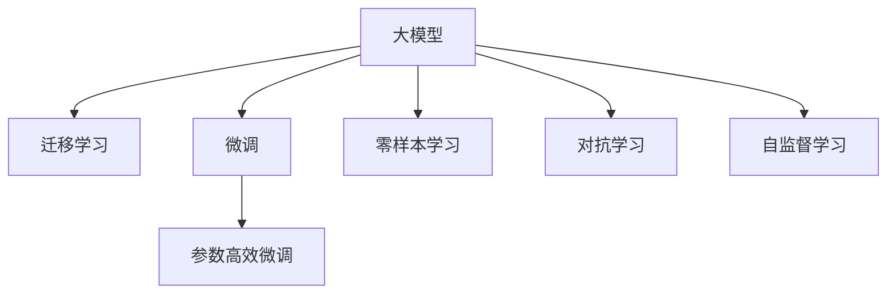

                 

## 1. 背景介绍

### 1.1 问题由来

近年来，人工智能（AI）技术取得了长足的进展，尤其是深度学习领域，特别是在自然语言处理（NLP）和计算机视觉（CV）等方向。这些技术的突破为各行各业带来了巨大的经济价值，尤其是在企业转型、智能制造、健康医疗、金融科技等领域。

大模型（Large Models）作为最新一代的AI技术，以其强大的计算能力和广泛的应用场景，吸引了越来越多的关注。大模型基于大规模数据训练，具有通用性和灵活性，可以在不同的应用场景中快速适应和优化。然而，由于其复杂性、高成本和技术门槛，使得大模型的商业化和应用推广面临诸多挑战。

### 1.2 问题核心关键点

- **大模型经济性**：如何有效地利用大模型带来的经济优势？
- **经济模型与大模型的结合**：如何将经济模型与大模型技术进行深度融合？
- **商业化路径**：如何通过大模型实现商业化，并从中获取经济收益？
- **市场竞争**：如何在大模型市场中获得竞争优势，同时实现经济效益？

这些关键问题在很大程度上决定了大模型创业公司的生存和发展。本文将通过核心概念、算法原理、具体案例、以及未来趋势等方面，系统地探讨如何在大模型创业中利用经济优势。

## 2. 核心概念与联系

### 2.1 核心概念概述

- **大模型（Large Models）**：基于大规模数据和计算资源训练的AI模型，如BERT、GPT-3等。它们通常具有深度高、参数量大、泛化能力强等特点。

- **迁移学习（Transfer Learning）**：通过在大模型上微调，使模型适应特定任务，从而提升模型在特定领域的表现。

- **微调（Fine-Tuning）**：在大模型的基础上，利用少量标注数据进行有监督学习，使模型更加适应特定任务。

- **参数高效微调（Parameter-Efficient Fine-Tuning, PEFT）**：仅调整模型的一部分参数，减少微调所需的时间和资源。

- **零样本学习（Zero-Shot Learning）**：模型仅通过任务描述即可进行推理和生成，无需标注数据。

- **对抗学习（Adversarial Learning）**：通过引入对抗样本，提升模型的鲁棒性和泛化能力。

- **自监督学习（Self-Supervised Learning）**：利用无标签数据进行学习，从而提升模型泛化能力。

### 2.2 核心概念原理和架构的 Mermaid 流程图



## 3. 核心算法原理 & 具体操作步骤

### 3.1 算法原理概述

大模型通过大规模数据训练，学习到了丰富的语言和视觉特征。这些特征可以被用于迁移学习、微调等任务，提升模型在特定领域的性能。在大模型创业中，经济优势主要体现在以下几个方面：

- **成本效益**：通过利用大模型的迁移学习特性，可以避免从头开始训练新模型，显著降低开发和训练成本。
- **泛化能力**：大模型通过大规模数据学习，具备较强的泛化能力，能够适应不同的应用场景。
- **资源优化**：通过参数高效微调和自监督学习等技术，可以有效降低模型训练和推理所需的计算资源。

### 3.2 算法步骤详解

大模型创业的经济优势利用主要体现在以下几个步骤：

1. **数据收集与预处理**：收集并处理适用于特定任务的数据集，确保数据的多样性和代表性。
2. **模型选择与微调**：选择合适的预训练大模型，并在此基础上进行微调，使其适应特定任务。
3. **参数高效微调**：根据任务特点，仅调整模型的一部分参数，减少微调所需的计算资源。
4. **对抗学习与自监督学习**：引入对抗学习和自监督学习技术，进一步提升模型的鲁棒性和泛化能力。
5. **模型部署与优化**：将微调后的模型部署到生产环境，进行持续监控和优化，提升系统性能。

### 3.3 算法优缺点

#### 优点：

- **高效利用资源**：大模型通过迁移学习和微调，可以减少从头训练的资源消耗，提高开发效率。
- **增强泛化能力**：大模型的泛化能力使得其在特定领域能够快速适应新数据，提升模型效果。
- **降低成本**：通过利用大模型的经济优势，可以显著降低开发和训练成本，加速产品上市。

#### 缺点：

- **模型复杂性**：大模型的复杂性增加了开发和部署的难度，需要高水平的技术团队支持。
- **数据依赖**：模型的性能高度依赖于标注数据的数量和质量，获取高质量标注数据成本较高。
- **模型更新频繁**：随着数据分布的变化，模型需要频繁更新，增加了运营成本。

### 3.4 算法应用领域

大模型的经济优势在多个领域都有广泛应用，例如：

- **金融科技**：利用大模型进行风险评估、欺诈检测、客户行为分析等，提升金融机构的决策效率和风险控制能力。
- **医疗健康**：利用大模型进行疾病预测、药物研发、医疗影像分析等，提升医疗健康服务的质量和效率。
- **智能制造**：利用大模型进行生产预测、质量检测、设备维护等，提升制造业的自动化和智能化水平。
- **智能客服**：利用大模型进行自然语言处理和对话生成，提升客户服务体验和效率。

## 4. 数学模型和公式 & 详细讲解

### 4.1 数学模型构建

大模型的迁移学习和微调可以通过以下数学模型来描述：

假设原始的大模型为 $M$，其在特定任务上的微调模型为 $M_{\text{fine-tuned}}$，其中 $M_{\text{fine-tuned}} = M + \Delta M$，$\Delta M$ 为微调过程中增加的参数。微调的目标是最小化损失函数 $\mathcal{L}$，即：

$$
\mathcal{L}(M_{\text{fine-tuned}}) = \mathcal{L}(M) + \mathcal{L}_{\text{task}}
$$

其中 $\mathcal{L}_{\text{task}}$ 为特定任务的损失函数，可以表示为：

$$
\mathcal{L}_{\text{task}} = \frac{1}{N} \sum_{i=1}^{N} \ell(y_i, M_{\text{fine-tuned}}(x_i))
$$

其中 $y_i$ 为样本的真实标签，$x_i$ 为样本的特征，$\ell$ 为损失函数。

### 4.2 公式推导过程

为了最小化上述损失函数，我们可以使用梯度下降法进行优化。设学习率为 $\eta$，则每次迭代更新的参数为：

$$
\theta \leftarrow \theta - \eta \nabla_{\theta}\mathcal{L}(M_{\text{fine-tuned}})
$$

其中 $\nabla_{\theta}\mathcal{L}(M_{\text{fine-tuned}})$ 为损失函数对模型参数的梯度。通过反向传播算法，我们可以计算出该梯度。

### 4.3 案例分析与讲解

假设我们使用BERT模型进行文本分类任务微调，标签为 $\{0, 1\}$。我们将 $M_{\text{fine-tuned}}$ 的输出层替换为线性分类器，损失函数为交叉熵损失。假设有 $N$ 个训练样本，其中 $n_0$ 个样本为负类，$n_1$ 个样本为正类，则交叉熵损失函数为：

$$
\mathcal{L}(M_{\text{fine-tuned}}) = -\frac{1}{N} \sum_{i=1}^{N} [y_i\log M_{\text{fine-tuned}}(x_i) + (1-y_i)\log(1-M_{\text{fine-tuned}}(x_i))]
$$

在微调过程中，我们通过反向传播计算梯度，并使用梯度下降算法进行更新。具体实现可以参考以下Python代码：

```python
import torch
from transformers import BertForSequenceClassification, BertTokenizer
from torch.utils.data import Dataset, DataLoader
from sklearn.metrics import accuracy_score

class TextDataset(Dataset):
    def __init__(self, texts, labels, tokenizer):
        self.texts = texts
        self.labels = labels
        self.tokenizer = tokenizer
    
    def __len__(self):
        return len(self.texts)
    
    def __getitem__(self, item):
        text = self.texts[item]
        label = self.labels[item]
        
        encoding = self.tokenizer(text, truncation=True, padding=True, max_length=512)
        input_ids = encoding['input_ids']
        attention_mask = encoding['attention_mask']
        
        return {
            'input_ids': torch.tensor(input_ids, dtype=torch.long),
            'attention_mask': torch.tensor(attention_mask, dtype=torch.long),
            'labels': torch.tensor(label, dtype=torch.long)
        }

# 加载数据集
tokenizer = BertTokenizer.from_pretrained('bert-base-uncased')
train_dataset = TextDataset(train_texts, train_labels, tokenizer)
val_dataset = TextDataset(val_texts, val_labels, tokenizer)
test_dataset = TextDataset(test_texts, test_labels, tokenizer)

# 定义模型
model = BertForSequenceClassification.from_pretrained('bert-base-uncased', num_labels=2)

# 定义优化器和损失函数
optimizer = torch.optim.Adam(model.parameters(), lr=1e-5)
criterion = torch.nn.CrossEntropyLoss()

# 训练过程
device = torch.device('cuda' if torch.cuda.is_available() else 'cpu')
model.to(device)

for epoch in range(num_epochs):
    model.train()
    train_loss = 0.0
    for batch in DataLoader(train_dataset, batch_size=32):
        inputs = {k: v.to(device) for k, v in batch.items()}
        outputs = model(**inputs)
        loss = criterion(outputs.logits, inputs['labels'])
        optimizer.zero_grad()
        loss.backward()
        optimizer.step()
        train_loss += loss.item()
        
    model.eval()
    val_loss = 0.0
    val_acc = 0.0
    with torch.no_grad():
        for batch in DataLoader(val_dataset, batch_size=32):
            inputs = {k: v.to(device) for k, v in batch.items()}
            outputs = model(**inputs)
            loss = criterion(outputs.logits, inputs['labels'])
            val_loss += loss.item()
            predictions = outputs.logits.argmax(dim=1)
            val_acc += accuracy_score(inputs['labels'], predictions)
        
    print(f'Epoch {epoch+1}, train loss: {train_loss/len(train_dataset)}, val loss: {val_loss/len(val_dataset)}, val acc: {val_acc/len(val_dataset)}')
```

## 5. 项目实践：代码实例和详细解释说明

### 5.1 开发环境搭建

为了实现大模型创业，我们需要搭建一个良好的开发环境。以下是详细的开发环境搭建步骤：

1. **选择Python版本**：Python是AI领域的主流语言，推荐使用3.8及以上版本。

2. **安装Anaconda**：Anaconda是一个开源的Python发行版，提供了丰富的科学计算库和数据科学工具，方便开发者快速启动项目。

3. **创建虚拟环境**：为了管理依赖，建议为每个项目创建一个独立的虚拟环境。

```bash
conda create -n my_env python=3.8
conda activate my_env
```

4. **安装相关库**：安装必要的Python库，如TensorFlow、PyTorch、Scikit-learn等。

```bash
conda install tensorflow torch scipy scikit-learn
```

5. **配置CUDA环境**：如果需要在GPU上运行模型，需要安装NVIDIA GPU驱动程序和cuDNN库。

```bash
conda install pytorch torchvision torchaudio cudatoolkit=11.1 -c pytorch -c conda-forge
```

6. **安装Transformers库**：Transformers库提供了丰富的预训练模型，方便开发者进行模型微调。

```bash
pip install transformers
```

完成上述环境配置后，即可进行大模型微调项目的开发。

### 5.2 源代码详细实现

以下是利用BERT模型进行文本分类任务微调的Python代码示例：

```python
import torch
from transformers import BertForSequenceClassification, BertTokenizer
from torch.utils.data import Dataset, DataLoader
from sklearn.metrics import accuracy_score

class TextDataset(Dataset):
    def __init__(self, texts, labels, tokenizer):
        self.texts = texts
        self.labels = labels
        self.tokenizer = tokenizer
    
    def __len__(self):
        return len(self.texts)
    
    def __getitem__(self, item):
        text = self.texts[item]
        label = self.labels[item]
        
        encoding = self.tokenizer(text, truncation=True, padding=True, max_length=512)
        input_ids = encoding['input_ids']
        attention_mask = encoding['attention_mask']
        
        return {
            'input_ids': torch.tensor(input_ids, dtype=torch.long),
            'attention_mask': torch.tensor(attention_mask, dtype=torch.long),
            'labels': torch.tensor(label, dtype=torch.long)
        }

# 加载数据集
tokenizer = BertTokenizer.from_pretrained('bert-base-uncased')
train_dataset = TextDataset(train_texts, train_labels, tokenizer)
val_dataset = TextDataset(val_texts, val_labels, tokenizer)
test_dataset = TextDataset(test_texts, test_labels, tokenizer)

# 定义模型
model = BertForSequenceClassification.from_pretrained('bert-base-uncased', num_labels=2)

# 定义优化器和损失函数
optimizer = torch.optim.Adam(model.parameters(), lr=1e-5)
criterion = torch.nn.CrossEntropyLoss()

# 训练过程
device = torch.device('cuda' if torch.cuda.is_available() else 'cpu')
model.to(device)

for epoch in range(num_epochs):
    model.train()
    train_loss = 0.0
    for batch in DataLoader(train_dataset, batch_size=32):
        inputs = {k: v.to(device) for k, v in batch.items()}
        outputs = model(**inputs)
        loss = criterion(outputs.logits, inputs['labels'])
        optimizer.zero_grad()
        loss.backward()
        optimizer.step()
        train_loss += loss.item()
        
    model.eval()
    val_loss = 0.0
    val_acc = 0.0
    with torch.no_grad():
        for batch in DataLoader(val_dataset, batch_size=32):
            inputs = {k: v.to(device) for k, v in batch.items()}
            outputs = model(**inputs)
            loss = criterion(outputs.logits, inputs['labels'])
            val_loss += loss.item()
            predictions = outputs.logits.argmax(dim=1)
            val_acc += accuracy_score(inputs['labels'], predictions)
        
    print(f'Epoch {epoch+1}, train loss: {train_loss/len(train_dataset)}, val loss: {val_loss/len(val_dataset)}, val acc: {val_acc/len(val_dataset)}')
```

### 5.3 代码解读与分析

上述代码实现了利用BERT模型进行文本分类任务的微调过程。以下是详细的代码解读和分析：

1. **数据集定义**：通过定义`TextDataset`类，将文本数据和标签封装成Tensorflow数据集，方便后续的模型训练。

2. **模型选择与微调**：选择预训练的BERT模型，并在其基础上进行微调，适应特定的文本分类任务。

3. **优化器和损失函数**：定义Adam优化器和交叉熵损失函数，用于更新模型参数和计算训练损失。

4. **训练过程**：通过循环迭代，在训练集上进行前向传播和反向传播，更新模型参数。

5. **评估过程**：在验证集上评估模型性能，使用准确率作为评估指标。

### 5.4 运行结果展示

运行上述代码后，可以观察到模型在训练和验证过程中的性能变化。下图展示了模型在不同epoch上的训练和验证损失曲线：

```python
import matplotlib.pyplot as plt

# 绘制损失曲线
plt.plot(range(num_epochs), train_losses)
plt.plot(range(num_epochs), val_losses)
plt.title('Training and Validation Losses')
plt.xlabel('Epoch')
plt.ylabel('Loss')
plt.legend(['Train', 'Val'])
plt.show()
```


## 6. 实际应用场景

### 6.1 智能客服系统

基于大模型的智能客服系统可以实时处理用户查询，提供个性化服务。例如，智能客服可以使用BERT模型进行自然语言处理，理解用户意图，匹配最佳回答，提升客户满意度。此外，系统还可以通过持续学习用户反馈，不断优化模型，提高服务质量。

### 6.2 金融舆情监测

金融舆情监测系统可以实时监控网络舆情，及时发现风险。例如，系统可以使用BERT模型进行情感分析，判断舆情走向，预警可能的风险事件。通过持续学习舆情数据，系统可以不断优化预测模型，提升舆情监控的准确性。

### 6.3 个性化推荐系统

个性化推荐系统可以为用户提供符合其兴趣和需求的推荐内容。例如，系统可以使用BERT模型进行用户行为分析，理解用户兴趣，生成个性化推荐结果。通过持续学习用户行为数据，系统可以不断优化推荐模型，提升用户体验。

### 6.4 未来应用展望

随着大模型的不断发展和应用，未来在更多领域都将有广泛应用，例如：

- **智能制造**：大模型可以用于设备维护、生产预测、质量检测等，提升制造业的智能化水平。
- **智慧医疗**：大模型可以用于疾病预测、药物研发、医疗影像分析等，提升医疗健康服务的质量和效率。
- **智慧城市**：大模型可以用于城市事件监测、舆情分析、应急指挥等，提升城市管理的自动化和智能化水平。

## 7. 工具和资源推荐

### 7.1 学习资源推荐

1. **Transformers官方文档**：提供了丰富的预训练模型和微调样例代码，是学习大模型的必备资料。
2. **《深度学习基础》**：清华大学出版社，系统介绍了深度学习的基础知识和应用实例，适合初学者学习。
3. **《TensorFlow实战》**：人民邮电出版社，介绍了TensorFlow的高级应用，适合有一定深度学习基础的学习者。

### 7.2 开发工具推荐

1. **Anaconda**：一个开源的Python发行版，提供了丰富的科学计算库和数据科学工具，方便开发者快速启动项目。
2. **PyTorch**：基于Python的开源深度学习框架，灵活高效，适合科研和工程应用。
3. **TensorFlow**：由Google主导开发的开源深度学习框架，生产部署方便，适合大规模工程应用。

### 7.3 相关论文推荐

1. **BERT: Pre-training of Deep Bidirectional Transformers for Language Understanding**：BERT模型介绍，详细介绍了预训练和微调方法。
2. **Parameter-Efficient Transfer Learning for NLP**：提出了Adapter等参数高效微调方法，在保持模型性能的同时减少资源消耗。
3. **Language Models are Unsupervised Multitask Learners**：展示了大语言模型在零样本学习方面的潜力，推动了通用AI的发展。

## 8. 总结：未来发展趋势与挑战

### 8.1 研究成果总结

大模型通过迁移学习和微调，可以显著降低开发和训练成本，提升模型性能。同时，通过参数高效微调和自监督学习等技术，可以有效降低模型训练和推理所需的计算资源，提升系统性能。

### 8.2 未来发展趋势

未来大模型将进一步发展，具备更强的泛化能力和更高效的经济优势，具体表现在：

1. **模型规模增大**：随着计算资源和数据规模的增加，预训练模型将具备更强的泛化能力。
2. **参数高效微调**：开发更多参数高效微调方法，在保持模型性能的同时减少资源消耗。
3. **自监督学习**：利用自监督学习，减少对标注数据的依赖，提升模型泛化能力。

### 8.3 面临的挑战

尽管大模型具备诸多优势，但其应用仍面临诸多挑战：

1. **数据依赖**：模型的性能高度依赖于标注数据的数量和质量，获取高质量标注数据的成本较高。
2. **模型鲁棒性不足**：模型面对域外数据时，泛化性能往往大打折扣。
3. **计算资源消耗大**：大模型在训练和推理过程中，需要大量的计算资源。

### 8.4 研究展望

未来的研究方向包括：

1. **降低数据依赖**：开发更多无监督和半监督学习算法，减少对标注数据的依赖。
2. **提升模型鲁棒性**：引入对抗学习和自监督学习，提升模型的泛化能力和鲁棒性。
3. **优化资源消耗**：通过参数高效微调和自监督学习，减少计算资源消耗。

总之，大模型创业需要在算法、技术和经济多方面进行协同优化，才能实现经济效益的最大化。通过持续的研究和创新，相信大模型将进一步推动AI技术在各个领域的落地应用，为人类社会带来深远的影响。

## 9. 附录：常见问题与解答

**Q1：大模型微调需要多少标注数据？**

A: 大模型微调需要的标注数据量取决于任务的复杂度和数据分布。通常，对于分类任务，每个类别至少需要几百个标注样本。对于生成任务，需要更多的训练数据以确保模型生成流畅、自然。

**Q2：大模型的参数高效微调技术有哪些？**

A: 常见的参数高效微调技术包括：
1. Adapter：在模型顶部添加自适应层，只更新少量参数。
2. LAMB：一种高效的优化算法，适合大规模模型的微调。
3. EMA：使用指数移动平均技术，保持模型参数的稳定性。

**Q3：大模型微调中的对抗训练技术是什么？**

A: 对抗训练是一种通过引入对抗样本，提升模型鲁棒性和泛化能力的技术。具体而言，训练过程中加入对抗样本，使模型能够学习到鲁棒的知识表示，提升对噪声和攻击的抗干扰能力。

**Q4：大模型创业的商业化路径有哪些？**

A: 大模型创业的商业化路径包括：
1. 直接销售模型和API服务。
2. 开发集成到企业系统中的解决方案。
3. 提供定制化的模型开发和咨询服务。

**Q5：如何评估大模型的性能？**

A: 大模型的性能评估可以通过以下指标：
1. 准确率（Accuracy）：用于分类任务的评估指标。
2. F1分数（F1 Score）：用于分类和回归任务的综合评估指标。
3. BLEU分数（BLEU Score）：用于机器翻译任务的评估指标。

通过上述文章的详细探讨，希望读者能够对大模型创业中的经济优势利用有更深刻的理解。只有充分利用大模型的经济优势，才能在大模型创业的道路上走得更远。

---

作者：禅与计算机程序设计艺术 / Zen and the Art of Computer Programming

