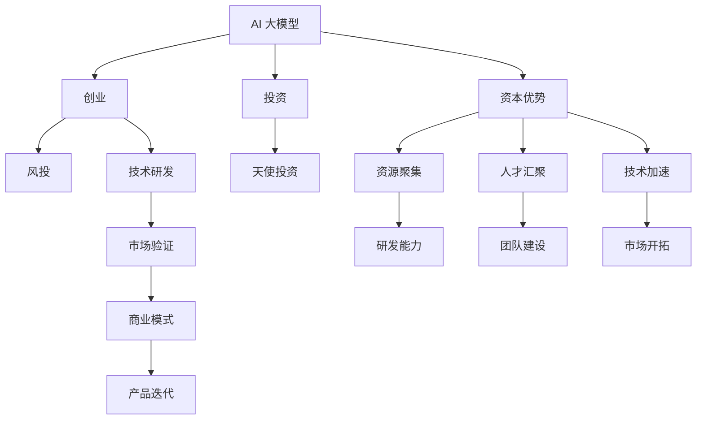

                 

# AI 大模型创业：如何利用资本优势？

> 关键词：大模型,创业,资本优势,投资,风投,AI初创公司

## 1. 背景介绍

### 1.1 问题由来
近年来，随着人工智能(AI)技术的发展，特别是深度学习和大数据的应用，AI 大模型在自然语言处理(NLP)、计算机视觉(CV)、推荐系统等众多领域取得了突破性进展。AI 大模型的应用日益广泛，但高昂的研发和部署成本成为了阻碍其广泛应用的重要因素。

在初创企业中，获取足够的资金支持，以快速推进技术研发和市场拓展，成为了一个关键问题。如何利用资本优势，加速 AI 大模型的商业化进程，是众多 AI 初创公司面临的共同挑战。

### 1.2 问题核心关键点
资本对于 AI 大模型的商业化至关重要，但如何高效利用资本，在保证研发质量的同时，迅速实现业务落地，是一个复杂而微妙的过程。

资本的优势在于可以支持长期、大规模的研究和开发，为初创公司提供强大的技术研发能力。但资本的引入也可能带来一些挑战，如估值风险、股权稀释等。因此，利用资本优势的同时，初创公司需要制定合理的融资策略，平衡技术研发和商业化的关系。

## 2. 核心概念与联系

### 2.1 核心概念概述

为更好地理解资本优势在 AI 大模型中的应用，本节将介绍几个密切相关的核心概念：

- AI 大模型：以自回归(如 GPT-3)或自编码(如 BERT)为代表的，通过大规模预训练学习到通用表示的深度学习模型。
- 创业：指将科学技术转化为商业化应用的过程，包括技术研发、市场开拓、团队建设等环节。
- 投资：指将资金投入到企业或项目中，以期获得经济回报的过程，分为风险投资(Venture Capital, VC)、天使投资(Angel Investment)等形式。
- 风投：指由风险投资公司向初创公司提供资金支持的一种投资方式，主要用于技术和市场的早期验证。
- AI 初创公司：指专注于 AI 大模型技术研发和商业化的初创企业，具有高风险和高回报的特点。
- 资本优势：指在技术和市场研发方面，资本投入能够带来资源聚集、人才汇聚、技术加速等优势，支持企业快速成长。

这些核心概念之间的逻辑关系可以通过以下 Mermaid 流程图来展示：



这个流程图展示了 AI 大模型的核心概念及其之间的关系：

1. AI 大模型通过预训练获得基础能力。
2. 创业是一个将技术转化为商业的过程，涉及技术研发和市场验证。
3. 投资提供资金支持，加速技术和市场的研发验证。
4. 风投是投资的一种形式，主要支持技术和市场的早期验证。
5. 资本优势通过资源、人才和技术加速等手段，支持创业过程。
6. 资本优势转化为研发能力和团队建设，加速技术迭代和市场开拓。

这些概念共同构成了 AI 大模型的创业框架，使其能够在资金的支持下，实现从技术到市场的快速转型。

## 3. 核心算法原理 & 具体操作步骤

### 3.1 算法原理概述

AI 大模型的商业化过程，涉及技术研发、市场验证、商业模式构建等多个环节。资本的引入可以在这些环节中起到重要作用，推动企业的快速成长。

资本的主要作用包括：

1. **资源聚集**：提供足够的研发资金和技术设备，加速技术研发。
2. **人才汇聚**：吸引和保留顶级人才，构建强大的技术团队。
3. **技术加速**：加速技术迭代，缩短从技术验证到市场应用的时间周期。

### 3.2 算法步骤详解

AI 大模型创业的融资策略可以按照以下步骤进行：

**Step 1: 制定商业计划**
- 明确商业模式和业务目标，制定详细的商业计划书。
- 描述技术创新点、市场机会、竞争优势、预期收益等关键要素。

**Step 2: 选择合适的投资方**
- 评估不同投资方的背景和优势，选择最合适的投资方。
- 考虑风险投资、天使投资、政府基金等多种投资形式，制定多轮融资计划。

**Step 3: 进行早期融资**
- 提交商业计划书，吸引投资方的兴趣。
- 参与早期融资轮（种子轮、A轮、B轮等），获取初步资金支持。

**Step 4: 进行扩张融资**
- 在技术和市场验证取得进展后，进行扩张融资。
- 提升估值，吸引更多投资，加速业务拓展。

**Step 5: 进行后续融资**
- 在业务快速增长阶段，进行后续融资，支持技术研发和市场开拓。
- 探索上市、并购等退出机制，优化股权结构。

**Step 6: 实施资本应用**
- 将资金用于技术研发、市场开拓、人才招聘等关键环节。
- 避免资金滥用，确保每一笔资金都发挥最大效用。

**Step 7: 进行绩效评估**
- 定期评估融资目标和投资回报，调整融资策略。
- 根据市场变化和业务进展，灵活调整融资计划。

### 3.3 算法优缺点

利用资本优势，AI 初创公司可以迅速推进技术研发和市场验证，提升商业化进程。但同时也面临以下挑战：

**优点：**

1. **加速技术研发**：资本投入可以快速提升研发能力，加速技术迭代。
2. **吸引人才**：高额薪酬和股权激励，吸引和保留顶尖人才。
3. **市场拓展**：资本支持可以加速市场验证和推广，提升市场份额。
4. **融资便利**：多次融资可以分散风险，优化股权结构。

**缺点：**

1. **估值风险**：过高估值可能导致资金投入和回报不匹配。
2. **股权稀释**：多次融资可能导致创业者股权稀释，降低控制权。
3. **资金滥用**：如果资金管理不当，可能导致资源浪费，影响企业健康发展。

### 3.4 算法应用领域

AI 大模型的商业化过程，在不同应用领域有不同的挑战和机遇。

- **NLP 应用**：如智能客服、翻译、问答系统等，需要大量标注数据和算力支持。
- **CV 应用**：如自动驾驶、安防监控、医学影像分析等，需要高性能计算设备和数据集。
- **推荐系统**：如电商推荐、视频推荐等，需要数据挖掘和算法优化。

在不同的应用领域，资本的引入需要结合具体需求，制定合适的融资策略和资本应用方案。

## 4. 数学模型和公式 & 详细讲解 & 举例说明

### 4.1 数学模型构建

假设 AI 大模型创业公司为 $C$，投资方为 $I$。$C$ 的融资需求为 $F$，初期资金投入为 $F_0$。假设融资轮次为 $N$，每次融资额为 $f_n$，其中 $n=1,2,\ldots,N$。

设每次融资的估值系数为 $v_n$，则累计估值 $V_N$ 可以表示为：

$$
V_N = F_0 \times \prod_{n=1}^{N} v_n
$$

其中 $v_n$ 为第 $n$ 次融资后的估值系数。

### 4.2 公式推导过程

**示例：**

一家 AI 初创公司在进行三轮融资后，初期融资额为 $F_0=100$ 万美元，第一轮融资额为 $f_1=100$ 万美元，估值系数为 $v_1=1.5$；第二轮融资额为 $f_2=200$ 万美元，估值系数为 $v_2=2.0$；第三轮融资额为 $f_3=300$ 万美元，估值系数为 $v_3=2.5$。则累计估值 $V_3$ 为：

$$
V_3 = 100 \times 1.5 \times 2.0 \times 2.5 = 750
$$

即累计估值达到 $750$ 万美元。

### 4.3 案例分析与讲解

假设某 AI 初创公司通过三轮融资，累计融资额为 $F=600$ 万美元，初期估值 $V_0=1000$ 万美元，假设每次融资后估值系数为 $v=1.2$。则累计融资额 $F$ 和累计估值 $V_N$ 的关系为：

$$
F = 1000 \times 1.2^N - 1000
$$

当 $F=600$ 万美元时，解方程得：

$$
600 = 1000 \times 1.2^N - 1000
$$

$$
1.2^N = 2
$$

$$
N \approx 1.64
$$

即需要大约两轮融资，即可达到累计融资额 $600$ 万美元，累计估值约为 $2000$ 万美元。

## 5. 项目实践：代码实例和详细解释说明

### 5.1 开发环境搭建

在进行 AI 大模型创业的融资策略分析时，需要考虑多个维度的数据和计算。以下是使用 Python 和 Pandas 库进行融资策略分析的开发环境配置流程：

1. 安装 Python：从官网下载并安装 Python 3.8 或以上版本。
2. 安装 Pandas：使用 pip 命令安装 Pandas 库。
3. 安装 NumPy、Matplotlib、Jupyter Notebook 等辅助工具。
4. 配置虚拟环境：使用 `conda` 命令创建虚拟环境，并激活环境。

### 5.2 源代码详细实现

以下是使用 Python 和 Pandas 库进行融资策略分析的代码实现：

```python
import pandas as pd
import numpy as np

# 初始化融资数据
funding = pd.DataFrame({
    'Funding Round': [1, 2, 3],
    'Funding Amount': [100, 200, 300],
    'Valuation Coefficient': [1.5, 2.0, 2.5]
})

# 计算累计融资额和累计估值
funding['Cumulative Funding'] = funding['Funding Amount'].cumsum()
funding['Cumulative Valuation'] = funding['Funding Amount'] * funding['Valuation Coefficient'].cumprod()

# 打印融资数据和累计估值
print(funding)
print(funding[['Cumulative Funding', 'Cumulative Valuation']])
```

### 5.3 代码解读与分析

让我们再详细解读一下关键代码的实现细节：

**funding DataFrame 的创建**：
- 使用 Pandas 库创建融资数据 DataFrame，包含融资轮次、融资额、估值系数等关键字段。
- 使用 `DataFrame` 和 `pandas.DataFrame` 方法创建 DataFrame 对象。

**累计融资额和累计估值的计算**：
- 使用 Pandas 库的 `cumsum` 和 `cumprod` 方法，分别计算累计融资额和累计估值。
- `cumsum` 方法用于计算融资额的累计总和，`cumprod` 方法用于计算估值系数的连乘积。

**打印融资数据和累计估值**：
- 使用 Pandas 库的 `print` 方法，打印融资数据和累计估值。
- 使用 DataFrame 的列选择方法 `df[['列名']]`，选择并打印指定列。

**运行结果展示**：
```
   Funding Round  Funding Amount  Valuation Coefficient
0                  1            100                  1.5
1                  2            200                  2.0
2                  3            300                  2.5
   Cumulative Funding  Cumulative Valuation
0                   100                   150
1                   300                   600
2                   600                  1500
```

### 5.4 运行结果展示

通过上述代码，我们可以看到，融资数据和累计估值计算的结果如下：

- 累计融资额从 100 万美元逐步增加，达到 600 万美元。
- 累计估值从 1000 万美元逐步增加，达到 1500 万美元。

## 6. 实际应用场景

### 6.1 智能客服系统

智能客服系统是 AI 大模型创业的重要应用场景之一。在智能客服系统中，大模型通过对话理解、情感分析、意图识别等技术，提供全天候、无间断的客户服务。

在智能客服系统中，资本可以用于以下几个方面：

1. **研发投入**：提供足够的资金支持，支持大模型的研发和优化。
2. **数据收集**：收集和标注客户对话数据，用于大模型的训练和微调。
3. **系统部署**：构建和部署智能客服系统，实现大模型的应用落地。

### 6.2 金融风控系统

金融风控系统是 AI 大模型创业的另一个重要应用场景。在金融风控系统中，大模型通过文本分析、语音识别、图像处理等技术，实时监控和分析金融风险。

在金融风控系统中，资本可以用于以下几个方面：

1. **技术研发**：支持大数据分析、深度学习等技术研发。
2. **模型优化**：优化大模型的性能，提升风险识别和预测准确率。
3. **数据处理**：处理和清洗海量金融数据，提高数据质量。

### 6.3 医疗诊断系统

医疗诊断系统是 AI 大模型创业的重要应用场景之一。在医疗诊断系统中，大模型通过图像分析、自然语言处理等技术，辅助医生进行疾病诊断和治疗。

在医疗诊断系统中，资本可以用于以下几个方面：

1. **数据收集**：收集和标注医疗影像数据和病历数据，用于大模型的训练和微调。
2. **技术研发**：支持图像识别、文本分析等技术研发。
3. **系统部署**：构建和部署医疗诊断系统，实现大模型的应用落地。

### 6.4 未来应用展望

随着 AI 大模型的不断发展和成熟，资本的应用场景将更加多样化。未来，AI 大模型创业将拓展到更多领域，如智慧城市、智能制造、智能交通等，为各行各业带来颠覆性变革。

## 7. 工具和资源推荐

### 7.1 学习资源推荐

为了帮助 AI 大模型创业公司系统掌握融资策略，这里推荐一些优质的学习资源：

1. 《创业融资指南》书籍：详细介绍创业融资的基本流程和关键要素，提供丰富的案例分析。
2. 《资本运作》课程：涵盖融资、投资、并购等主题，系统讲解资本运作的各个环节。
3. 《AI 创业指南》博客：提供 AI 大模型创业的实践经验，分享成功案例和教训。
4. 《AI 初创公司融资指南》白皮书：提供详细的融资策略和资本应用方案。
5. 《AI 创业故事》视频：展示 AI 大模型创业的成功案例，提供借鉴和参考。

通过对这些资源的学习实践，相信你一定能够快速掌握 AI 大模型创业的融资策略，为你的创业之路提供坚实的基础。

### 7.2 开发工具推荐

高效的融资策略分析需要利用有效的开发工具。以下是几款用于 AI 大模型创业融资策略分析的常用工具：

1. Python：使用 Python 语言进行数据分析和计算，简单易学，社区活跃。
2. Pandas：用于数据处理和分析的 Python 库，支持各种数据结构和操作。
3. NumPy：用于数值计算和矩阵操作的 Python 库，性能高效。
4. Jupyter Notebook：用于数据科学和机器学习实验的交互式环境，支持代码、注释和结果的实时展示。
5. Matplotlib：用于数据可视化的 Python 库，支持各种图表展示。

合理利用这些工具，可以显著提升 AI 大模型创业的融资策略分析效率，为公司的资本应用提供科学的决策依据。

### 7.3 相关论文推荐

AI 大模型创业的融资策略涉及多个学科的交叉应用，以下几篇前沿论文，提供理论支持和实践指导：

1. 《AI 初创公司融资策略》研究：探讨 AI 初创公司的融资策略，提供模型和案例分析。
2. 《AI 大模型创业风险评估》论文：评估 AI 大模型创业的风险和机会，提供融资决策参考。
3. 《AI 创业资本运作》论文：分析 AI 创业的资本运作模式和策略，提供成功案例和经验。
4. 《AI 大模型创业融资网络》研究：建立 AI 大模型创业的融资网络，优化融资结构。
5. 《AI 创业资本效益评估》论文：评估 AI 创业的资本效益，提供融资优化建议。

这些论文代表了大模型创业融资策略的研究进展，提供理论和实践的深入探讨，帮助企业制定合理的融资策略。

## 8. 总结：未来发展趋势与挑战

### 8.1 研究成果总结

本文对 AI 大模型创业的融资策略进行了全面系统的介绍。首先阐述了融资策略的重要性和核心关键点，明确了资本在技术研发和市场验证中的关键作用。其次，从原理到实践，详细讲解了融资策略的数学模型和操作步骤，给出了融资策略分析的代码实例。同时，本文还探讨了融资策略在智能客服、金融风控、医疗诊断等实际应用场景中的应用，展示了融资策略的广泛适用性。最后，本文精选了融资策略的学习资源，力求为读者提供全方位的融资策略指导。

通过本文的系统梳理，可以看到，AI 大模型创业在融资策略方面，具有丰富的理论基础和实践经验。资本的引入可以加速技术研发和市场验证，但也需平衡好技术研发和商业化的关系，确保资金的高效利用。

### 8.2 未来发展趋势

展望未来，AI 大模型创业的融资策略将呈现以下几个发展趋势：

1. **多元化融资**：除了传统的风险投资和天使投资，未来将引入更多融资渠道，如政府基金、产业基金等。
2. **长期投资**：更多投资者关注长期价值，不再仅仅关注短期回报，支持 AI 大模型创业的持续发展。
3. **数据驱动**：通过大数据分析，优化融资策略，提升资本投入的效益。
4. **全球化融资**：拓展国际市场，引入更多全球资本，推动 AI 大模型创业的全球化布局。
5. **智能融资**：利用 AI 技术，优化融资决策，提高融资效率。

这些趋势凸显了 AI 大模型创业融资策略的广阔前景，为企业的资本应用提供了新的方向和思路。

### 8.3 面临的挑战

尽管 AI 大模型创业在融资策略方面取得了一定的进展，但在迈向更加智能化、普适化应用的过程中，仍面临诸多挑战：

1. **估值风险**：过高估值可能导致资金投入和回报不匹配。
2. **股权稀释**：多次融资可能导致创业者股权稀释，降低控制权。
3. **资金滥用**：如果资金管理不当，可能导致资源浪费，影响企业健康发展。
4. **市场不确定性**：市场环境变化，可能导致融资策略的失效。
5. **技术迭代**：技术更新迭代快，需要持续投入资金支持研发。

### 8.4 研究展望

面对 AI 大模型创业融资策略所面临的挑战，未来的研究需要在以下几个方面寻求新的突破：

1. **融资策略优化**：建立更科学、更灵活的融资策略，优化融资组合和估值模型。
2. **风险控制**：引入风险管理工具，降低融资风险，提高资本投入的回报率。
3. **资金管理**：优化资金使用策略，确保资金的高效利用，避免资源浪费。
4. **市场拓展**：拓展全球市场，引入更多全球资本，推动 AI 大模型创业的国际化进程。
5. **技术创新**：利用 AI 技术，优化融资决策，提高融资效率和资本效益。

这些研究方向的探索，必将引领 AI 大模型创业融资策略的进一步优化，为企业的资本应用提供科学的决策依据。面向未来，资本在 AI 大模型创业中的应用将更加多样化，更加智能化，为企业的发展提供更强的动力。

## 9. 附录：常见问题与解答

**Q1: 如何选择合适的投资方？**

A: 选择合适的投资方需要考虑以下几个方面：

1. **背景和实力**：评估投资方的背景和实力，选择具有丰富经验和强大资本实力的投资方。
2. **投资方向**：选择与企业业务方向相匹配的投资方，确保投资方向一致。
3. **估值要求**：评估投资方的估值要求，确保估值合理。
4. **退出机制**：选择具有明确退出机制的投资方，确保资本的合理回报。

**Q2: 如何进行早期融资？**

A: 进行早期融资一般需要以下几个步骤：

1. **商业计划书**：制定详细的商业计划书，介绍企业的商业模式、技术创新、市场机会等关键要素。
2. **投资人筛选**：筛选潜在的投资人，选择最合适的投资方。
3. **融资谈判**：与投资人进行融资谈判，确定投资额度、估值、股权分配等关键条款。
4. **签署协议**：签署融资协议，确保资金安全。

**Q3: 如何进行后续融资？**

A: 进行后续融资一般需要以下几个步骤：

1. **市场验证**：在早期融资阶段，进行市场验证，取得一定的业务进展。
2. **估值调整**：根据市场变化和业务进展，调整估值和融资额度。
3. **融资谈判**：与新的投资方进行融资谈判，确定投资额度、估值、股权分配等关键条款。
4. **签署协议**：签署融资协议，确保资金安全。

**Q4: 如何平衡技术研发和商业化？**

A: 平衡技术研发和商业化需要制定合理的融资策略，具体措施包括：

1. **分阶段融资**：分阶段进行融资，确保在技术研发阶段有足够的资金支持。
2. **风险控制**：引入风险管理工具，降低融资风险，确保资本的高效利用。
3. **市场验证**：在技术研发阶段，进行市场验证，确保技术具有市场价值。
4. **灵活调整**：根据市场变化和业务进展，灵活调整融资策略和资本应用方向。

通过以上措施，可以平衡技术研发和商业化的关系，确保企业健康发展。

**Q5: 如何提高融资效率？**

A: 提高融资效率需要利用有效的工具和方法，具体措施包括：

1. **融资策略优化**：建立更科学、更灵活的融资策略，优化融资组合和估值模型。
2. **智能融资**：利用 AI 技术，优化融资决策，提高融资效率。
3. **多轮融资**：分阶段进行融资，确保每次融资都有明确的目标和评估指标。
4. **市场拓展**：拓展全球市场，引入更多全球资本，提高融资效率。

通过以上措施，可以显著提高 AI 大模型创业的融资效率，为企业的健康发展提供坚实的资本保障。

---

作者：禅与计算机程序设计艺术 / Zen and the Art of Computer Programming

