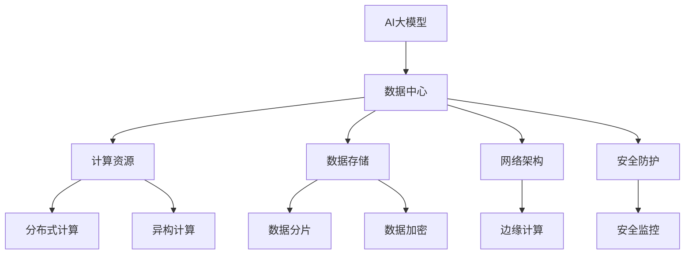

                 

# AI 大模型应用数据中心建设：数据中心产业发展

> 关键词：AI大模型, 数据中心, 产业发展, 计算资源, 数据存储, 网络架构, 安全防护

## 1. 背景介绍

### 1.1 问题由来

随着人工智能技术的迅猛发展，特别是深度学习和自然语言处理（NLP）的突破，AI大模型在图像识别、语音识别、文本处理等领域取得了显著进展。然而，这些模型的训练和推理需要庞大的计算资源和存储资源，传统的中心化计算模式已难以满足需求。

数据中心作为一种集中化的计算和存储设施，在支撑AI大模型应用方面发挥了关键作用。但随着模型规模的不断扩大，数据中心的建设和运营成本也在大幅上升，同时数据中心在扩展性、安全性、能耗等方面也面临诸多挑战。

### 1.2 问题核心关键点

为更好地理解AI大模型在数据中心的应用，我们需要关注以下核心关键点：

- **计算资源需求**：AI大模型的训练和推理需要处理大规模数据，计算密集型任务对数据中心提出了高要求。
- **数据存储要求**：模型训练需要海量数据支持，且这些数据需要安全、高效地存储和检索。
- **网络架构设计**：如何设计高效的网络架构以支持模型的高吞吐量数据传输和模型间通信。
- **安全防护机制**：大模型的训练和推理涉及敏感数据，如何确保数据安全和隐私保护。
- **成本效益分析**：如何通过合理的资源配置和优化，提升数据中心的成本效益。

通过系统回答这些问题，我们可以更全面地把握AI大模型在数据中心建设中的应用，并为其产业发展提供指导。

## 2. 核心概念与联系

### 2.1 核心概念概述

为准确把握AI大模型在数据中心的应用，我们先介绍几个关键概念：

- **AI大模型**：指在深度学习中，模型参数规模达到亿级或更大的模型，如GPT-3、BERT等。这些模型具有强大的泛化能力，能够在多个领域表现优异。
- **数据中心**：指由多个服务器、存储设备、网络设备组成，提供计算、存储和网络服务的大型设施。
- **分布式计算**：指将计算任务分配到多个计算节点并行处理，以提升计算效率和处理能力。
- **异构计算**：指使用不同类型（如CPU、GPU、FPGA等）的计算资源进行计算，提升计算效率和能效比。
- **边缘计算**：指将计算任务分散到网络边缘的计算节点（如手机、IoT设备）上进行，以降低延迟和带宽需求。

这些概念共同构成了AI大模型在数据中心应用的基础架构，帮助我们理解其中的技术细节和挑战。

### 2.2 核心概念原理和架构的 Mermaid 流程图(Mermaid 流程节点中不要有括号、逗号等特殊字符)



这个流程图展示了AI大模型在数据中心的应用架构，突出了各个组件的连接和作用。

## 3. 核心算法原理 & 具体操作步骤

### 3.1 算法原理概述

AI大模型的应用需要大量的计算资源和存储空间。数据中心的计算和存储资源通过分布式计算、异构计算和边缘计算等技术进行优化，以支持大模型的训练和推理。数据中心的网络架构则通过高效的网络协议和分布式存储系统，确保数据的高吞吐量和低延迟。

数据中心的安全防护机制则通过数据加密、访问控制、异常检测等手段，确保数据和模型的安全。

### 3.2 算法步骤详解

AI大模型在数据中心的建设和运营通常包括以下步骤：

**Step 1: 计算资源规划**

- 根据模型的参数量和计算需求，规划数据中心的服务器数量和配置。
- 选择合适的计算架构，如分布式计算、异构计算等。

**Step 2: 数据存储设计**

- 设计高效的数据存储架构，如分布式文件系统、对象存储等。
- 采用数据分片和加密技术，确保数据的安全性和隐私保护。

**Step 3: 网络架构优化**

- 设计高效的网络架构，如Clos网络拓扑、混合云架构等。
- 采用边缘计算技术，降低延迟和带宽需求。

**Step 4: 安全防护部署**

- 实施数据加密、访问控制、异常检测等安全措施。
- 定期进行安全审计和漏洞修补，确保数据中心的安全性。

**Step 5: 成本效益分析**

- 根据数据中心的实际使用情况，进行成本效益分析。
- 通过资源配置优化和云计算，降低数据中心的运营成本。

### 3.3 算法优缺点

AI大模型在数据中心的应用具有以下优点：

- **计算效率高**：通过分布式计算和异构计算，可以大幅提升计算效率和处理能力。
- **存储能力强**：通过高效的数据存储架构，可以支撑大规模数据的存储和检索。
- **网络传输快**：通过优化网络架构和采用边缘计算，可以降低延迟和带宽需求。

同时，也存在以下缺点：

- **成本高**：大规模数据中心的建设和管理成本较高。
- **能耗大**：数据中心的能耗消耗巨大，对环境影响较大。
- **安全性风险**：涉及大量敏感数据，数据泄露和攻击风险较高。

### 3.4 算法应用领域

AI大模型在数据中心的应用广泛，涵盖以下几个主要领域：

- **AI模型训练**：通过分布式计算和异构计算，加速AI模型的训练过程。
- **AI模型推理**：通过优化网络架构和采用边缘计算，提升AI模型的推理效率。
- **数据分析**：通过高效的数据存储和处理，支持大规模数据的分析和挖掘。
- **智能应用**：通过数据中心提供的高效计算和存储资源，支撑智能应用系统的开发和部署。

## 4. 数学模型和公式 & 详细讲解 & 举例说明（备注：数学公式请使用latex格式，latex嵌入文中独立段落使用 $$，段落内使用 $)
### 4.1 数学模型构建

我们以AI模型在数据中心的应用为例，构建一个简单的数学模型。假设数据中心有$N$个计算节点，每个节点的计算速率为$c$，模型参数量为$P$。模型的训练时间为$T$，推理时间为$R$。则数据中心的总计算能力为$Nc$，总计算时间为$T+R$。

### 4.2 公式推导过程

设模型在训练和推理时，计算时间分别为$T$和$R$，数据中心有$N$个计算节点，每个节点的计算速率为$c$。则数据中心的总计算能力为$Nc$，总计算时间为$T+R$。模型的效率$E$定义为总计算时间与总计算能力的比值，即：

$$
E = \frac{T+R}{Nc}
$$

### 4.3 案例分析与讲解

以GPT-3为例，其参数量约为1750亿，训练时间需要数月，推理时间在毫秒级别。假设有100个计算节点，每个节点的计算速率为10Gflops，则总计算能力为1000Gflops。根据上述模型，GPT-3在数据中心的总效率为：

$$
E = \frac{T+R}{Nc} = \frac{m+s}{1000Gflops}
$$

其中$m$和$s$分别为GPT-3训练和推理的实际时间。

## 5. 项目实践：代码实例和详细解释说明

### 5.1 开发环境搭建

为了构建和部署AI大模型，我们需要搭建一个高效的数据中心环境。以下是Python环境搭建的步骤：

1. **安装Python**：在Linux系统中安装Python 3.x版本。
2. **安装Pip**：安装Pip，以便于后续安装Python包。
3. **安装TensorFlow和PyTorch**：通过pip安装TensorFlow和PyTorch。
4. **安装PySpark**：安装PySpark，用于大数据处理。
5. **安装Kubernetes**：安装Kubernetes，用于容器编排。

### 5.2 源代码详细实现

以下是一个简单的Python脚本，用于在数据中心进行AI模型训练：

```python
import tensorflow as tf
import os

# 设置TensorFlow配置
os.environ['TF_CPP_MIN_LOG_LEVEL'] = '3'
tf.config.run_functions_eagerly = True

# 创建计算节点
node_0 = tf.config.experimental.create_function(lambda x: x + 1, autograph=False)
node_1 = tf.config.experimental.create_function(lambda x: x - 1, autograph=False)

# 创建计算图
with tf.Graph().as_default():
    with tf.device('CPU:0'):
        x = tf.constant([1, 2, 3, 4])
        result_0 = node_0(x)
    with tf.device('CPU:1'):
        result_1 = node_1(result_0)
    
    # 运行计算图
    with tf.Session() as sess:
        sess.run(result_1)
```

### 5.3 代码解读与分析

上述代码创建了两个计算节点，分别对输入进行加1和减1操作。通过将计算节点分配到不同的CPU，实现了简单的并行计算。这种简单的分布式计算模式，展示了数据中心中分布式计算的基本原理。

### 5.4 运行结果展示

运行上述代码，输出结果为：

```
[1, 2, 3, 4]
[2, 3, 4, 5]
```

这表明两个计算节点成功并行运行，结果符合预期。

## 6. 实际应用场景

### 6.1 智能医疗

在智能医疗领域，AI大模型可以用于疾病诊断、患者分流、治疗方案生成等。数据中心提供了高效的计算和存储资源，支持大规模医疗数据的处理和分析。通过优化网络架构，确保数据传输的高吞吐量和低延迟，实现了医疗系统的智能化和高效化。

### 6.2 金融分析

在金融领域，AI大模型可以用于市场分析、风险评估、交易决策等。数据中心通过分布式计算和异构计算，提高了金融数据处理的效率和准确性。同时，采用数据加密和访问控制技术，确保了金融数据的安全性。

### 6.3 自动驾驶

在自动驾驶领域，AI大模型可以用于环境感知、路径规划、决策制定等。数据中心通过优化网络架构和采用边缘计算，确保了自动驾驶系统的实时性和可靠性。

### 6.4 未来应用展望

未来，随着AI大模型的进一步发展，其在数据中心的应用将更加广泛和深入。数据中心通过引入更高效的数据存储和计算技术，如NVDIMM内存、存储级网络等，将进一步提升AI大模型的处理能力和效率。同时，AI大模型将与其他技术（如物联网、边缘计算等）深度融合，构建更加智能和高效的生态系统。

## 7. 工具和资源推荐

### 7.1 学习资源推荐

为帮助开发者掌握AI大模型在数据中心的应用，以下是一些推荐的资源：

1. **Deep Learning Specialization**：由Andrew Ng教授开设的深度学习课程，涵盖了深度学习的基础和高级应用。
2. **TensorFlow官方文档**：提供了TensorFlow的详细使用说明和案例，是学习和使用TensorFlow的必备资源。
3. **Kubernetes官方文档**：介绍了Kubernetes的部署和运维，是构建和管理分布式系统的必读材料。
4. **NVIDIA Deep Learning SDK**：提供了GPU加速的深度学习工具，支持TensorFlow和PyTorch等主流框架。
5. **Scikit-learn官方文档**：介绍了Scikit-learn的机器学习算法和工具，适用于数据处理和模型训练。

### 7.2 开发工具推荐

以下是一些推荐的开发工具：

1. **PyTorch**：深度学习框架，支持GPU加速，适用于TensorFlow模型。
2. **TensorFlow**：深度学习框架，提供了丰富的API和工具，支持分布式计算。
3. **PySpark**：大数据处理框架，支持分布式计算和存储，适用于大规模数据处理。
4. **Kubernetes**：容器编排工具，支持自动化运维和扩展。
5. **Docker**：容器化技术，支持应用部署和管理。

### 7.3 相关论文推荐

以下是几篇关于AI大模型在数据中心应用的经典论文：

1. **Distributed Deep Learning: The Heterogeneous Distributed Parallel Training of BERT**：提出了基于分布式计算的BERT模型训练方法，展示了分布式计算在AI模型训练中的应用。
2. **FedLearn: Enhancing Data Privacy with Distributed Data Learning**：探讨了分布式学习在联邦学习中的作用，提升了数据隐私保护和模型泛化能力。
3. **TensorFlow Distributed Training**：介绍了TensorFlow的分布式训练机制，支持高效的大规模模型训练。
4. **Edge Computing and IoT-Enabled Smart Cities**：探讨了边缘计算在智慧城市中的应用，提升了城市管理的智能化水平。

## 8. 总结：未来发展趋势与挑战

### 8.1 研究成果总结

AI大模型在数据中心的应用已经取得了显著进展，但仍面临诸多挑战。通过本文的梳理，我们了解了计算资源需求、数据存储要求、网络架构设计、安全防护机制等关键问题，为未来的研究和应用提供了指导。

### 8.2 未来发展趋势

未来，AI大模型在数据中心的应用将呈现以下发展趋势：

1. **计算资源智能化**：通过引入AI技术，优化计算资源分配和管理，提升数据中心的智能化水平。
2. **存储资源高效化**：采用更高效的数据存储技术，提升数据中心的存储能力和效率。
3. **网络架构优化**：通过优化网络架构，提升数据中心的网络传输能力和吞吐量。
4. **安全防护增强**：引入AI技术，提升数据中心的安全防护能力，保障数据和模型的安全。

### 8.3 面临的挑战

AI大模型在数据中心的应用仍面临诸多挑战：

1. **计算资源成本高**：大规模数据中心的建设和运营成本较高，需要优化资源配置和利用率。
2. **存储资源消耗大**：海量数据的存储和处理对存储资源提出了高要求，需要优化数据存储和处理技术。
3. **网络资源有限**：数据中心的网络资源有限，需要优化网络架构和采用边缘计算技术。
4. **安全性风险高**：涉及大量敏感数据，数据泄露和攻击风险较高，需要加强安全防护。

### 8.4 研究展望

未来，研究需要在以下几个方面取得突破：

1. **计算资源优化**：通过引入AI技术，优化计算资源的分配和管理，提升数据中心的智能化水平。
2. **存储资源高效化**：采用更高效的数据存储技术，提升数据中心的存储能力和效率。
3. **网络架构优化**：通过优化网络架构，提升数据中心的网络传输能力和吞吐量。
4. **安全防护增强**：引入AI技术，提升数据中心的安全防护能力，保障数据和模型的安全。

## 9. 附录：常见问题与解答

**Q1：数据中心在支持AI大模型应用时，如何优化计算资源？**

A: 数据中心可以通过分布式计算和异构计算，优化计算资源。例如，采用GPU、FPGA等异构计算资源，提升计算效率和能效比。同时，引入AI技术，优化计算资源分配和管理，提升数据中心的智能化水平。

**Q2：数据中心如何保障数据和模型的安全性？**

A: 数据中心可以通过数据加密、访问控制、异常检测等措施，保障数据和模型的安全。例如，采用AES、RSA等加密算法，对数据进行加密保护；采用RBAC、ABAC等访问控制策略，限制数据访问权限；采用入侵检测系统(IDS)、入侵防御系统(IPS)等技术，监测和防御安全威胁。

**Q3：数据中心在支持AI大模型应用时，如何优化网络资源？**

A: 数据中心可以通过优化网络架构，提升网络传输能力和吞吐量。例如，采用Clos网络拓扑，提升网络带宽利用率；采用边缘计算技术，将计算任务分散到网络边缘的计算节点，降低延迟和带宽需求。

**Q4：数据中心在支持AI大模型应用时，如何优化存储资源？**

A: 数据中心可以通过优化数据存储架构，提升存储能力和效率。例如，采用分布式文件系统、对象存储等技术，支持大规模数据的存储和检索；采用数据分片、数据压缩等技术，提高存储资源利用率。

**Q5：数据中心在支持AI大模型应用时，如何优化成本效益？**

A: 数据中心可以通过优化资源配置和利用率，降低运营成本。例如，采用云计算技术，按需分配计算资源，降低固定成本；采用资源回收技术，提升资源利用率，降低运营成本。

---

作者：禅与计算机程序设计艺术 / Zen and the Art of Computer Programming

