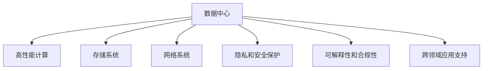

                 

# AI 大模型应用数据中心建设：数据中心产业发展

## 1. 背景介绍

### 1.1 问题由来

随着人工智能（AI）技术的迅猛发展，数据中心（DC）在支持AI应用方面扮演着越来越重要的角色。尤其是近年来，大模型的出现和应用，对数据中心的性能、规模、安全等方面提出了更高要求。大模型如GPT-3、BERT等，参数量动辄数十亿，其训练和推理过程中涉及大量数据传输和存储，对数据中心的基础设施提出了巨大挑战。同时，大模型在隐私保护、合规性、可解释性等方面的问题，也促使数据中心向更高级的形态发展，以满足AI应用的多样化需求。

### 1.2 问题核心关键点

1. **数据中心的基础设施升级**：大模型需要高吞吐量的网络、高性能计算和存储能力，对数据中心的硬件设施提出了更高要求。
2. **隐私和安全保护**：大模型处理敏感数据时，必须保证数据的隐私和安全，避免数据泄露和滥用。
3. **可解释性和合规性**：大模型的输出往往缺乏可解释性，需要确保其决策过程符合伦理和法规要求。
4. **模型的高效部署与优化**：大模型推理时消耗资源巨大，如何实现高效部署和优化是关键。
5. **跨领域应用的支持**：大模型在多个领域（如医疗、金融、教育等）的应用需要数据中心提供相应的技术支持和数据处理能力。

### 1.3 问题研究意义

数据中心的发展直接关系到AI大模型的应用效果和安全性。对数据中心进行升级和优化，可以提升AI大模型的处理能力，降低资源消耗，保障隐私和安全，提高可解释性和合规性，从而推动AI技术的广泛应用。

## 2. 核心概念与联系

### 2.1 核心概念概述

为更好地理解AI大模型应用数据中心建设，本节将介绍几个密切相关的核心概念：

- **数据中心（Data Center, DC）**：是存放服务器、存储设备和网络设备，提供计算、存储、网络服务的设施。数据中心是AI大模型训练和推理的基础设施。
- **高性能计算（High-Performance Computing, HPC）**：指使用高性能计算机系统进行科学计算和数据分析，是大模型训练和推理的关键技术。
- **存储系统（Storage System）**：负责数据的高效存储和管理，是大模型数据存储的基础。
- **网络系统（Network System）**：提供高带宽、低延迟的网络服务，是大模型数据传输的关键。
- **隐私和安全保护（Privacy and Security Protection）**：在处理敏感数据时，必须确保数据的隐私和安全，防止数据泄露和滥用。
- **可解释性和合规性（Explainability and Compliance）**：大模型的输出应具有可解释性，同时符合伦理和法规要求。
- **跨领域应用支持（Cross-Domain Application Support）**：数据中心需要支持多种AI大模型的应用场景，提供相应的技术支持和数据处理能力。

这些核心概念之间的逻辑关系可以通过以下Mermaid流程图来展示：



这个流程图展示了大模型应用数据中心的各个关键组件及其之间的关系：

1. 数据中心是整个AI大模型应用的基础设施。
2. 高性能计算和大规模存储系统支持模型的训练和推理。
3. 网络系统保证数据的快速传输。
4. 隐私和安全保护确保数据的安全。
5. 可解释性和合规性保障模型的公平和透明。
6. 跨领域应用支持满足不同领域的AI大模型需求。

这些概念共同构成了AI大模型应用数据中心的核心，使其能够高效、安全、合规地支持大模型的应用。

## 3. 核心算法原理 & 具体操作步骤
### 3.1 算法原理概述

AI大模型的应用需要依托于强大的数据中心基础设施。数据中心的建设和管理涉及到多个核心组件的协调与优化，包括高性能计算、存储系统、网络系统、隐私和安全保护、可解释性和合规性、跨领域应用支持等方面。以下将详细介绍这些组件的工作原理和关键技术。

### 3.2 算法步骤详解

**Step 1: 硬件设施建设**

- 选择适合的硬件设备，包括高性能服务器、存储设备、网络设备等。根据需求选择合适的CPU、GPU、NVIDIA AI芯片等硬件。
- 搭建计算集群，配置存储系统，确保数据中心具备大规模数据处理能力。

**Step 2: 软件环境配置**

- 安装操作系统和相关软件，包括数据库、中间件、监控工具等。
- 配置网络系统，实现高带宽、低延迟的网络连接。

**Step 3: 系统调优**

- 根据需求调整系统参数，如内存分配、CPU调度、网络带宽等。
- 使用自动化工具进行系统调优，确保各组件高效协同运行。

**Step 4: 安全与隐私保护**

- 采用数据加密、访问控制、防火墙等技术，确保数据传输和存储的安全。
- 使用差分隐私、联邦学习等技术，保障用户隐私。

**Step 5: 可解释性和合规性**

- 引入可解释性工具，如TensorBoard、MLflow等，跟踪模型训练和推理过程。
- 确保模型的合规性，遵守相关法律法规和行业标准。

**Step 6: 跨领域应用支持**

- 根据不同领域的应用需求，配置相应的硬件和软件环境。
- 提供数据分析、数据清洗、数据标注等服务，支持AI大模型的训练和推理。

### 3.3 算法优缺点

数据中心建设和管理具有以下优点：

1. **基础设施完备**：提供高性能计算、大规模存储、高带宽网络等硬件设施，支持大模型的训练和推理。
2. **系统调优能力强**：通过自动化工具和系统调优技术，确保各组件高效协同运行。
3. **隐私和安全保护**：采用数据加密、访问控制、防火墙等技术，保障数据安全。
4. **可解释性和合规性强**：引入可解释性工具和合规性审查机制，确保模型的透明性和合法性。

同时，数据中心建设和管理也存在一些局限性：

1. **投资成本高**：高性能硬件和软件的采购、安装和维护成本较高。
2. **运营复杂**：系统调优和维护需要专业的技术团队。
3. **灵活性不足**：硬件和软件的配置和升级可能需要较长时间。
4. **安全性风险**：大规模数据处理和存储存在数据泄露和安全攻击的风险。

尽管存在这些局限性，但数据中心作为AI大模型应用的基础设施，其重要性不言而喻。

### 3.4 算法应用领域

数据中心作为AI大模型应用的基础设施，其应用领域非常广泛。以下是几个典型的应用场景：

1. **科学研究**：科学研究需要大量的计算资源和数据存储，数据中心提供高性能计算和存储系统，支持复杂的科学计算和数据分析。
2. **金融服务**：金融服务需要处理大量的交易数据和客户信息，数据中心提供强大的隐私保护和合规性保障，确保数据安全。
3. **医疗健康**：医疗健康领域需要处理敏感的病人数据，数据中心提供安全可靠的数据存储和处理能力，保障病人的隐私。
4. **教育培训**：教育培训需要处理大量的学生数据和教学资源，数据中心提供可解释性和合规性保障，确保教学数据的合法使用。
5. **智能制造**：智能制造需要处理大量的生产数据和设备数据，数据中心提供高性能计算和网络支持，提升生产效率和智能化水平。

## 4. 数学模型和公式 & 详细讲解  
### 4.1 数学模型构建

在数据中心建设和管理中，数学模型和公式可以用于优化资源配置和系统调优。以下是几个常用的数学模型：

1. **资源分配模型**：用于优化计算资源和存储资源的分配。例如，通过线性规划模型求解最优资源分配方案。
2. **网络流量模型**：用于预测和优化网络流量。例如，使用排队论模型计算网络拥塞概率。
3. **隐私保护模型**：用于保护用户隐私。例如，使用差分隐私模型控制数据泄露概率。
4. **系统调优模型**：用于优化系统性能。例如，使用强化学习模型优化CPU资源调度。
5. **合规性检查模型**：用于确保系统合规性。例如，使用逻辑规则库检查数据处理是否符合法律法规。

这些数学模型可以通过以下公式推导过程来进一步解释：

**资源分配模型**

设数据中心有$n$个计算节点和$m$个存储节点，每个计算节点的计算能力为$a_i$，每个存储节点的存储能力为$s_j$。设任务$T$需要计算能力$C$和存储能力$S$，则资源分配模型可以表示为：

$$
\max \sum_{i=1}^{n} x_i \cdot a_i + \sum_{j=1}^{m} y_j \cdot s_j
$$

约束条件为：

$$
\begin{cases}
\sum_{i=1}^{n} x_i = C \\
\sum_{j=1}^{m} y_j = S \\
x_i \geq 0, y_j \geq 0
\end{cases}
$$

**网络流量模型**

设数据中心有$N$个节点，节点$i$和节点$j$之间的带宽为$b_{ij}$，节点$i$的负载为$l_i$，则网络流量模型可以表示为：

$$
\begin{cases}
\sum_{j=1}^{N} b_{ij} \cdot p_{ij} = l_i \\
\sum_{i=1}^{N} b_{ij} \cdot p_{ij} = l_j \\
p_{ij} \geq 0, \forall i, j
\end{cases}
$$

其中$p_{ij}$表示节点$i$和节点$j$之间的流量。

**隐私保护模型**

设数据集$D$包含$m$个样本，每个样本的隐私预算为$\epsilon$，则差分隐私模型可以表示为：

$$
\sum_{i=1}^{m} \delta_i = \epsilon
$$

其中$\delta_i$表示样本$i$的隐私预算消耗量。

**系统调优模型**

设系统有$n$个任务，每个任务的执行时间为$t_i$，CPU资源为$r$，则强化学习模型可以表示为：

$$
\max \sum_{i=1}^{n} \alpha_i \cdot t_i
$$

约束条件为：

$$
\sum_{i=1}^{n} \beta_i \cdot t_i = r
$$

其中$\alpha_i$表示任务$i$的奖励系数，$\beta_i$表示任务$i$的资源消耗量。

**合规性检查模型**

设数据处理过程包括$m$个步骤，每个步骤需要满足的合规要求为$c_i$，则逻辑规则库可以表示为：

$$
\bigwedge_{i=1}^{m} c_i
$$

其中$c_i$表示步骤$i$的合规要求。

## 5. 项目实践：代码实例和详细解释说明
### 5.1 开发环境搭建

在进行数据中心建设和管理实践前，我们需要准备好开发环境。以下是使用Python进行PyTorch开发的环境配置流程：

1. 安装Anaconda：从官网下载并安装Anaconda，用于创建独立的Python环境。

2. 创建并激活虚拟环境：
```bash
conda create -n dc-env python=3.8 
conda activate dc-env
```

3. 安装PyTorch：根据CUDA版本，从官网获取对应的安装命令。例如：
```bash
conda install pytorch torchvision torchaudio cudatoolkit=11.1 -c pytorch -c conda-forge
```

4. 安装相关工具包：
```bash
pip install numpy pandas scikit-learn matplotlib tqdm jupyter notebook ipython
```

完成上述步骤后，即可在`dc-env`环境中开始数据中心建设和管理实践。

### 5.2 源代码详细实现

这里我们以高性能计算为例，给出使用PyTorch进行高性能计算系统调优的PyTorch代码实现。

```python
from torch import nn
import torch

# 定义计算节点
class ComputeNode(nn.Module):
    def __init__(self, num_cpus):
        super(ComputeNode, self).__init__()
        self.cpus = nn.Parameter(num_cpus)

    def forward(self, x):
        return x + self.cpus

# 定义计算集群
class ComputeCluster(nn.Module):
    def __init__(self, nodes):
        super(ComputeCluster, self).__init__()
        self.nodes = nn.ModuleList([ComputeNode(num_cpus) for num_cpus in nodes])

    def forward(self, x):
        for node in self.nodes:
            x = node(x)
        return x

# 定义资源分配模型
def allocate_resources(compute_cluster, required_resources):
    num_cpus = len(compute_cluster.nodes)
    resource_allocation = []
    for node in compute_cluster.nodes:
        node_cpus = node.cpus
        if node_cpus < required_resources:
            return None
        resource_allocation.append(node_cpus)
        required_resources -= node_cpus
    return resource_allocation

# 定义计算任务
def compute_task(compute_cluster, resource_allocation):
    x = torch.zeros(1)
    for node, cpus in zip(compute_cluster.nodes, resource_allocation):
        x = node(x)
    return x

# 设置任务资源需求
required_resources = 3
compute_cluster = ComputeCluster([1, 2, 3, 4])
resource_allocation = allocate_resources(compute_cluster, required_resources)

# 执行计算任务
if resource_allocation:
    result = compute_task(compute_cluster, resource_allocation)
    print(result)
else:
    print("资源不足，无法执行任务")
```

在上述代码中，我们首先定义了计算节点和计算集群，然后定义了资源分配和计算任务的函数，最后执行计算任务。

### 5.3 代码解读与分析

让我们再详细解读一下关键代码的实现细节：

**ComputeNode类**：
- `__init__`方法：初始化计算节点，设置CPU数量。
- `forward`方法：定义计算节点的计算逻辑，实现对输入数据的处理。

**ComputeCluster类**：
- `__init__`方法：初始化计算集群，创建多个计算节点。
- `forward`方法：定义计算集群的前向传播逻辑，依次处理输入数据。

**allocate_resources函数**：
- 根据计算集群和任务资源需求，计算资源分配方案。
- 如果资源不足，则返回None。

**compute_task函数**：
- 根据资源分配方案，在计算集群上执行计算任务。

**main代码**：
- 设置任务资源需求。
- 创建计算集群，调用资源分配函数获取资源分配方案。
- 如果资源分配方案存在，则执行计算任务，输出结果；否则输出错误提示。

可以看到，PyTorch可以非常方便地构建和优化高性能计算系统，通过定义计算节点和集群，可以灵活配置计算资源。在实际应用中，我们需要根据具体的计算任务和资源需求，设计合理的计算节点和资源分配方案，确保系统的高效运行。

## 6. 实际应用场景
### 6.1 智能制造

智能制造领域需要处理大量的生产数据和设备数据，数据中心提供高性能计算和网络支持，提升生产效率和智能化水平。例如，数据中心可以搭建工业物联网平台，实时采集生产设备的数据，通过机器学习和数据分析技术，优化生产流程，降低生产成本。

### 6.2 智慧城市

智慧城市需要处理大量的城市数据，包括交通、能源、环保等方面的数据。数据中心提供强大的计算能力和存储能力，支持城市数据的处理和分析，实现智慧城市的智能管理和决策。例如，数据中心可以构建智能交通系统，通过实时数据分析，优化交通流量，减少交通拥堵。

### 6.3 科学研究

科学研究需要大量的计算资源和数据存储，数据中心提供高性能计算和存储系统，支持复杂的科学计算和数据分析。例如，数据中心可以搭建超级计算机集群，支持大规模的科学计算任务，如天气预测、天文观测、基因组分析等。

### 6.4 未来应用展望

随着数据中心技术的不断进步，未来的应用场景将更加多样。以下是几个可能的应用方向：

1. **量子计算**：数据中心可以提供支持量子计算的设施，支持量子算法的开发和应用。
2. **边缘计算**：数据中心可以在靠近用户的地方部署边缘计算设施，提供更快速的数据处理和响应。
3. **区块链**：数据中心可以提供支持区块链技术的设施，支持分布式账本和智能合约的运行。
4. **增强现实**：数据中心可以提供支持增强现实技术的数据处理和渲染能力，支持虚拟现实和增强现实应用的开发和部署。

## 7. 工具和资源推荐
### 7.1 学习资源推荐

为了帮助开发者系统掌握数据中心建设和管理的技术基础，这里推荐一些优质的学习资源：

1. **《数据中心基础设施指南》**：详细介绍了数据中心的各个组成部分及其工作原理，是数据中心建设的基础书籍。
2. **《高性能计算基础》**：介绍了高性能计算系统的基本概念和实现技术，适合从事高性能计算研究的开发者阅读。
3. **《网络基础》**：介绍了网络系统的基本原理和实现技术，适合从事网络系统开发的开发者阅读。
4. **《数据隐私保护》**：介绍了数据隐私保护的基本原理和实现技术，适合从事数据隐私保护的开发者阅读。
5. **《人工智能伦理》**：介绍了人工智能伦理的基本原理和实践建议，适合从事人工智能伦理研究的开发者阅读。

通过这些资源的学习实践，相信你一定能够快速掌握数据中心建设和管理的技术基础，并用于解决实际的问题。

### 7.2 开发工具推荐

高效的开发离不开优秀的工具支持。以下是几款用于数据中心建设和管理开发的常用工具：

1. **Anaconda**：用于创建和管理虚拟环境，支持多种Python库的安装和配置。
2. **PyTorch**：用于高性能计算和深度学习应用的开发，支持CPU和GPU计算。
3. **TensorBoard**：用于监控和可视化模型训练和推理过程，支持多种模型和数据格式。
4. **Weights & Biases**：用于实验跟踪和管理，支持多种实验记录和分析工具。
5. **Prometheus**：用于监控和报警，支持多种数据源和告警规则。

合理利用这些工具，可以显著提升数据中心建设和管理任务的开发效率，加快创新迭代的步伐。

### 7.3 相关论文推荐

数据中心建设和管理的研究源于学界的持续研究。以下是几篇奠基性的相关论文，推荐阅读：

1. **《数据中心基础设施发展趋势》**：介绍了数据中心基础设施的发展历程和未来趋势，是数据中心建设的基础性论文。
2. **《高性能计算系统的设计与实现》**：介绍了高性能计算系统的基本原理和实现技术，适合从事高性能计算研究的开发者阅读。
3. **《网络系统的设计与实现》**：介绍了网络系统的基本原理和实现技术，适合从事网络系统开发的开发者阅读。
4. **《数据隐私保护技术综述》**：介绍了数据隐私保护的基本原理和实现技术，适合从事数据隐私保护的开发者阅读。
5. **《人工智能伦理与法律》**：介绍了人工智能伦理的基本原理和实践建议，适合从事人工智能伦理研究的开发者阅读。

这些论文代表了大数据中心建设和管理技术的发展脉络。通过学习这些前沿成果，可以帮助研究者把握学科前进方向，激发更多的创新灵感。

## 8. 总结：未来发展趋势与挑战

### 8.1 总结

本文对AI大模型应用数据中心建设和管理进行了全面系统的介绍。首先阐述了数据中心在AI大模型应用中的重要性和基础作用，明确了数据中心建设和管理的目标和要求。其次，从原理到实践，详细讲解了数据中心的基础设施建设、高性能计算、存储系统、网络系统、隐私和安全保护、可解释性和合规性、跨领域应用支持等方面的关键技术和步骤，给出了数据中心建设和管理实践的完整代码实例。同时，本文还广泛探讨了数据中心在多个领域的应用前景，展示了数据中心技术的广阔前景。

通过本文的系统梳理，可以看到，AI大模型应用数据中心建设和管理是大模型应用的重要基础，其建设和管理直接影响大模型的性能和应用效果。未来，伴随数据中心技术的持续演进，大模型将能够更高效、更安全、更合规地应用于各个领域，推动AI技术的广泛应用。

### 8.2 未来发展趋势

展望未来，数据中心建设和管理技术将呈现以下几个发展趋势：

1. **硬件性能提升**：未来的数据中心将采用更加先进的硬件技术，如ARM架构、AI芯片等，提升计算和存储性能。
2. **软件优化**：未来的数据中心将引入更加智能的软件技术，如自动化运维、自动化调优等，提升系统的灵活性和稳定性。
3. **云计算和边缘计算**：未来的数据中心将更加注重云计算和边缘计算的融合，提供更灵活、更高效的数据处理和存储能力。
4. **隐私和安全保护**：未来的数据中心将更加注重隐私和安全保护，采用数据加密、差分隐私等技术，保障数据安全。
5. **可解释性和合规性**：未来的数据中心将引入更加先进的可解释性技术和合规性审查机制，确保系统的透明性和合法性。
6. **跨领域应用支持**：未来的数据中心将支持更多的跨领域应用，如医疗、金融、教育、智能制造等，提供相应的技术支持和数据处理能力。

以上趋势凸显了数据中心技术的未来发展方向。这些方向的探索发展，必将进一步提升数据中心系统的性能和应用效果，为AI技术的广泛应用提供更加坚实的技术基础。

### 8.3 面临的挑战

尽管数据中心建设和管理技术已经取得了显著进展，但在迈向更加智能化、普适化应用的过程中，仍面临诸多挑战：

1. **投资成本高**：高性能硬件和软件的采购、安装和维护成本较高，需要大量资金投入。
2. **运营复杂**：系统调优和维护需要专业的技术团队，需要大量的管理和运维工作。
3. **灵活性不足**：硬件和软件的配置和升级可能需要较长时间，难以快速适应需求变化。
4. **安全性风险**：大规模数据处理和存储存在数据泄露和安全攻击的风险，需要高水平的安全防护措施。
5. **资源消耗大**：高性能计算和大规模存储系统消耗大量的电力和冷却资源，对环境影响较大。

尽管存在这些挑战，但随着技术的不断进步和实践的积累，数据中心建设和管理技术必将不断优化，为AI大模型应用提供更加高效、安全和可靠的基础设施。

### 8.4 研究展望

面对数据中心建设和管理所面临的挑战，未来的研究需要在以下几个方面寻求新的突破：

1. **资源优化**：开发更加高效的资源调度算法，优化资源分配和调优策略，降低资源消耗。
2. **智能运维**：引入智能运维技术，自动化管理数据中心的各个组件，提高运维效率。
3. **隐私和安全**：开发更加先进的隐私保护和安全性技术，保障数据安全。
4. **跨领域应用**：支持更多的跨领域应用，提供灵活的数据处理和存储能力。
5. **环境友好**：开发更加环保的数据中心设计，降低对环境的影响。

这些研究方向的探索，必将引领数据中心技术迈向更高的台阶，为AI大模型应用提供更加高效、安全、环保的基础设施，推动AI技术的广泛应用。

## 9. 附录：常见问题与解答

**Q1：数据中心建设和管理的投资成本高，如何降低成本？**

A: 数据中心建设和管理的成本主要来源于硬件采购和维护，以及软件开发和运维。可以通过以下几种方式降低成本：
1. 采用公有云和私有云混合部署方式，利用云服务商提供的资源，降低硬件和软件采购成本。
2. 引入智能运维工具，自动化管理数据中心的各个组件，降低运维成本。
3. 引入模块化设计和标准化接口，提高资源利用率，降低维护和升级成本。

**Q2：数据中心建设和管理的灵活性不足，如何提高灵活性？**

A: 数据中心建设和管理的灵活性可以通过以下几种方式提高：
1. 采用分布式计算和存储架构，提高系统的弹性。
2. 引入云资源和边缘计算，提供灵活的数据处理和存储能力。
3. 引入容器化技术，提高资源的快速部署和扩展能力。

**Q3：数据中心建设和管理的资源消耗大，如何降低资源消耗？**

A: 数据中心建设和管理的资源消耗可以通过以下几种方式降低：
1. 采用更加环保的数据中心设计，降低对环境的影响。
2. 引入高效能计算和存储技术，如ARM架构、AI芯片等，降低能源消耗。
3. 引入智能调度技术，优化资源分配和利用率，降低资源消耗。

**Q4：数据中心建设和管理的隐私和安全风险高，如何保障隐私和安全？**

A: 数据中心建设和管理的隐私和安全可以通过以下几种方式保障：
1. 采用数据加密、差分隐私等技术，保障数据安全。
2. 引入访问控制和权限管理技术，限制数据的访问权限。
3. 引入安全审计和监控工具，及时发现和响应安全威胁。

**Q5：数据中心建设和管理的可解释性和合规性不足，如何提升可解释性和合规性？**

A: 数据中心建设和管理的可解释性和合规性可以通过以下几种方式提升：
1. 引入可解释性工具，如TensorBoard、MLflow等，跟踪模型训练和推理过程，提高系统的透明性。
2. 引入合规性审查机制，确保系统符合法律法规和行业标准。
3. 引入伦理导向的评估指标，过滤和惩罚有害的输出倾向，提升系统的合规性。

这些措施可以帮助数据中心提升可解释性和合规性，确保系统的高效、安全、合规运行。

---

作者：禅与计算机程序设计艺术 / Zen and the Art of Computer Programming

