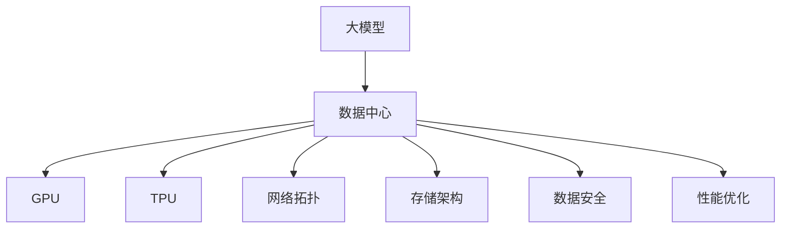

                 

# AI 大模型应用数据中心建设：数据中心技术与应用

> 关键词：大模型,数据中心,GPU,TPU,网络拓扑,存储架构,数据安全,性能优化,应用场景

## 1. 背景介绍

### 1.1 问题由来
人工智能（AI）正逐渐成为推动各个行业变革的关键力量。在AI领域，特别是深度学习模型中，大模型（Large Model）以其强大的泛化能力和知识提取能力，在自然语言处理（NLP）、计算机视觉（CV）、语音识别等众多领域展现了巨大的潜力。大模型通常指参数数量在数亿甚至数十亿级别的模型，如GPT-3、BERT、DALL-E等。

大模型的训练和应用需要庞大的计算资源和存储空间，这对数据中心的建设提出了新的挑战。传统数据中心面临的存储、计算、网络、安全等诸多问题，在大模型时代变得愈发复杂。如何构建高效、安全、可扩展的数据中心，以满足大模型应用的需求，成为AI领域亟需解决的重要问题。

### 1.2 问题核心关键点
大模型应用数据中心的建设，主要涉及以下几个关键点：

- **计算资源**：大模型训练和推理需要大量GPU、TPU等高性能计算资源，如何高效利用计算资源成为首要问题。
- **存储架构**：大模型数据量大、更新频繁，如何设计高效、可靠的数据存储架构，保证数据的完整性和可用性。
- **网络拓扑**：大模型训练和推理涉及数据交换，如何设计合理的网络拓扑，降低延迟和带宽消耗。
- **数据安全**：大模型包含大量敏感数据，如何确保数据的安全性和隐私保护。
- **性能优化**：如何通过优化软件和硬件设计，提升大模型训练和推理的效率。

这些关键点互相交织，共同构成了一个复杂而庞大的系统工程，要求数据中心在技术架构、运营管理和安全性等方面进行全面优化。

## 2. 核心概念与联系

### 2.1 核心概念概述

为更好地理解大模型应用数据中心的建设，我们首先介绍几个核心概念：

- **大模型（Large Model）**：指参数数量在数亿甚至数十亿级别的深度学习模型，如GPT-3、BERT、DALL-E等。通过在大规模数据集上进行预训练和微调，大模型能够学习到丰富的知识，用于下游任务的推理和生成。

- **数据中心（Data Center）**：指集中存放、管理和维护大量计算和存储资源的设施，用于支持企业数据处理和业务运行。数据中心通常包括服务器、网络设备、存储设备、冷却系统等基础设施。

- **GPU（Graphics Processing Unit）**：指专为图形处理设计的集成电路芯片，广泛应用于深度学习模型的训练和推理。GPU具有极高的并行计算能力，是大模型应用的主要计算资源。

- **TPU（Tensor Processing Unit）**：指专为TensorFlow等深度学习框架设计的硬件加速器，能够高效执行大规模矩阵运算，在大模型训练中广泛应用。

- **网络拓扑（Network Topology）**：指数据中心内部网络设备之间的连接方式和结构，包括交换机、路由器等。合理的网络拓扑设计能够提高数据传输效率，降低网络延迟。

- **存储架构（Storage Architecture）**：指数据中心的存储资源布局和数据管理方式，包括磁盘阵列、SSD、分布式存储等。高效的存储架构能够保证数据的高可用性和快速访问。

- **数据安全（Data Security）**：指保护数据免受未经授权的访问、泄露和破坏的措施。在大模型应用中，数据隐私和数据安全尤为重要。

- **性能优化（Performance Optimization）**：指通过优化软硬件设计，提升数据中心系统的整体性能和效率。性能优化包括算法优化、硬件加速、网络优化等诸多方面。

这些核心概念之间的逻辑关系可以通过以下Mermaid流程图来展示：



这个流程图展示了大模型、数据中心及其相关资源之间的联系：

1. 大模型训练和推理需要大量的计算和存储资源，由数据中心提供。
2. 数据中心通过GPU和TPU等高性能计算资源支持大模型的计算需求。
3. 网络拓扑设计影响数据传输效率，确保数据中心内部和外部的高效通信。
4. 存储架构设计影响数据的读写性能，保证大模型数据的高可用性和快速访问。
5. 数据安全是数据中心的重要组成部分，保护大模型数据免受侵害。
6. 性能优化提升数据中心的整体效率，支持大模型的训练和推理。

这些概念共同构成了大模型应用数据中心的建设框架，指导着数据中心的规划和实施。

## 3. 核心算法原理 & 具体操作步骤

### 3.1 算法原理概述

大模型应用数据中心的建设，本质上是一个复杂的多目标优化问题。其核心思想是：通过合理设计计算资源、存储架构、网络拓扑等基础设施，提升数据中心的计算效率、存储性能和网络带宽，从而支持大模型的高效训练和推理。

形式化地，设数据中心的计算资源为 $C$，存储容量为 $S$，网络带宽为 $B$，安全性为 $Sec$，性能优化为 $Opt$。数据中心的建设目标为：

$$
\mathop{\arg\min}_{C,S,B,Sec,Opt} \left( \sum_{i=1}^{n} w_i f_i(C,S,B,Sec,Opt) \right)
$$

其中，$n$ 表示目标函数的维度，$w_i$ 为各目标的权重，$f_i$ 为对应目标的函数表达式。$w_i$ 的设置需根据实际需求和场景进行调整，确保数据中心的各项指标均达到最优。

### 3.2 算法步骤详解

大模型应用数据中心的建设，一般包括以下几个关键步骤：

**Step 1: 需求分析与规划**

- 确定大模型的训练和推理需求，包括模型参数大小、训练和推理的吞吐量等。
- 分析计算资源、存储资源、网络带宽等基础设施的配置要求。
- 设计数据中心的布局和网络拓扑，考虑服务器和存储设备的分布和连接方式。
- 制定数据安全策略，确保数据中心的安全性和隐私保护。

**Step 2: 计算资源配置**

- 根据需求分析结果，选择合适的GPU、TPU等计算资源。
- 确定资源的布局和连接方式，例如，通过InfiniBand网络进行高效通信。
- 设置资源的初始化参数，如GPU内存分配、TPU芯片调度等。

**Step 3: 存储架构设计**

- 选择合适的存储设备，如SSD、HDD等，确保高IOPS和低延迟。
- 设计数据存储的层次结构，如将热点数据存放在高速缓存中，非热点数据存放在主存储设备中。
- 设置数据备份和冗余机制，保证数据的可靠性和可用性。

**Step 4: 网络拓扑优化**

- 设计合理的网络拓扑，例如，采用多层交换机的设计，提升数据传输效率。
- 设置网络隔离和流量控制机制，确保数据传输的安全性和稳定性。
- 考虑边缘计算和分布式计算的布局，提升计算资源的可扩展性。

**Step 5: 数据安全保障**

- 采用数据加密、访问控制等措施，确保数据的安全性和隐私保护。
- 设计多层次的安全防护体系，包括物理安全、网络安全、应用安全等。
- 定期进行安全审计和风险评估，及时发现和修复安全漏洞。

**Step 6: 性能优化与监控**

- 通过算法优化、硬件加速等手段，提升数据中心的整体性能和效率。
- 引入实时监控系统，跟踪数据中心的各项指标，及时发现和处理性能瓶颈。
- 定期进行性能评估和调优，确保数据中心的长期稳定运行。

以上是数据中心建设的一般流程。在实际应用中，还需要针对具体场景，对数据中心进行优化设计，如采用混合云架构、引入自动化运维技术等，以进一步提升数据中心的性能和效率。

### 3.3 算法优缺点

大模型应用数据中心的建设，具有以下优点：

- **高效计算**：通过合理配置GPU、TPU等高性能计算资源，能够支持大规模深度学习的训练和推理，大幅提升计算效率。
- **灵活扩展**：采用分布式计算和边缘计算等技术，能够根据需求灵活扩展计算资源，提升数据中心的可扩展性。
- **高效存储**：通过选择合适的存储设备和设计合理的存储架构，能够保证大模型数据的高效读写和可靠存储。
- **高安全性**：通过多层次的安全防护体系，确保大模型数据的安全性和隐私保护，避免数据泄露和攻击。
- **高性能优化**：通过算法优化和硬件加速等手段，能够提升数据中心的整体性能和效率，支持大模型的高效应用。

然而，大模型应用数据中心的建设也存在一定的局限性：

- **高成本**：构建高计算、高存储、高网络带宽的数据中心，需要巨额资金投入。
- **能耗高**：高性能计算资源和高存储设备的能耗较大，需要配套高效的冷却系统。
- **复杂度大**：大模型应用数据中心的建设和管理复杂，涉及多方面技术和人员的协调。
- **维护困难**：大规模的计算和存储资源，增加了数据中心的运维难度和成本。

尽管存在这些局限性，但大模型应用数据中心的建设，对于推动AI技术的发展和应用，具有重要的战略意义。未来，随着AI技术的不断成熟和普及，相信大模型应用数据中心将得到更广泛的应用，成为AI领域的基础设施。

### 3.4 算法应用领域

大模型应用数据中心的建设，已经广泛应用于多个领域，如自然语言处理（NLP）、计算机视觉（CV）、语音识别、推荐系统等。以下是几个典型的应用场景：

- **自然语言处理**：大模型通过预训练和微调，具备强大的语言理解和生成能力，用于文本分类、情感分析、机器翻译等任务。大模型应用数据中心为其提供了高效的计算和存储支持，保证任务的快速响应和处理。

- **计算机视觉**：大模型通过预训练和微调，具备强大的图像识别和生成能力，用于图像分类、目标检测、图像生成等任务。大模型应用数据中心为其提供了高效的计算和存储支持，支持大规模图像数据的处理和分析。

- **语音识别**：大模型通过预训练和微调，具备强大的语音识别和生成能力，用于语音转文本、语音合成等任务。大模型应用数据中心为其提供了高效的计算和存储支持，支持大规模语音数据的处理和分析。

- **推荐系统**：大模型通过预训练和微调，具备强大的用户行为分析和推荐能力，用于个性化推荐、广告推荐等任务。大模型应用数据中心为其提供了高效的计算和存储支持，支持大规模用户行为数据的处理和分析。

除了上述这些经典场景外，大模型应用数据中心还在医疗、金融、智能制造等诸多领域得到广泛应用，推动了各行业的数据化和智能化进程。

## 4. 数学模型和公式 & 详细讲解  
### 4.1 数学模型构建

本节将使用数学语言对大模型应用数据中心的建设过程进行更加严格的刻画。

设大模型的参数数量为 $P$，计算资源数量为 $C$，存储资源数量为 $S$，网络带宽为 $B$，安全性为 $Sec$，性能优化为 $Opt$。则大模型应用数据中心的建设目标函数可以表示为：

$$
\mathop{\arg\min}_{C,S,B,Sec,Opt} \left( \sum_{i=1}^{n} w_i f_i(C,S,B,Sec,Opt) \right)
$$

其中，$n$ 表示目标函数的维度，$w_i$ 为各目标的权重，$f_i$ 为对应目标的函数表达式。

**目标函数构成**：

- **计算资源成本 $C$**：计算资源的使用成本，包括购置成本和运维成本。
- **存储资源成本 $S$**：存储资源的使用成本，包括购置成本和运维成本。
- **网络带宽成本 $B$**：网络带宽的使用成本，包括购置成本和运维成本。
- **安全性成本 $Sec$**：数据安全防护的成本，包括安全设备购置和维护成本。
- **性能优化成本 $Opt$**：性能优化措施的成本，包括软硬件优化和调优成本。

**目标函数形式**：

$$
f(C,S,B,Sec,Opt) = w_1 C + w_2 S + w_3 B + w_4 Sec + w_5 Opt
$$

在实际应用中，$w_i$ 的值需要根据具体场景进行调整。例如，在资源成本较低的场景中，可以设置 $w_1$ 和 $w_2$ 的值较大，以优化计算和存储资源的配置。在安全性要求较高的场景中，可以设置 $w_4$ 的值较大，以确保数据中心的安全性。

### 4.2 公式推导过程

以下我们以资源成本最小化为目标，推导计算资源、存储资源和网络带宽的最优配置公式。

设 $C$ 为计算资源，$S$ 为存储资源，$B$ 为网络带宽，则资源成本最小化问题可以表示为：

$$
\mathop{\arg\min}_{C,S,B} \left( w_1 C + w_2 S + w_3 B \right)
$$

根据约束条件，计算资源、存储资源和网络带宽的配置需要满足大模型的训练和推理需求。因此，引入大模型的参数数量 $P$，设 $c$ 为每个计算单元的计算能力，$s$ 为每个存储单元的存储能力，$b$ 为每个网络单元的网络带宽，则有：

$$
P = c \times C \quad \text{和} \quad P = s \times S \quad \text{和} \quad P = b \times B
$$

将上述等式代入资源成本最小化目标函数中，得：

$$
\begin{aligned}
\mathop{\arg\min}_{C,S,B} & \left( w_1 C + w_2 S + w_3 B \right) \\
\text{subject to} \quad P &= c \times C \\
P &= s \times S \\
P &= b \times B
\end{aligned}
$$

根据拉格朗日乘子法，引入拉格朗日乘子 $\lambda_1, \lambda_2, \lambda_3$，构造拉格朗日函数：

$$
L(C,S,B,\lambda_1,\lambda_2,\lambda_3) = w_1 C + w_2 S + w_3 B + \lambda_1 (P - c \times C) + \lambda_2 (P - s \times S) + \lambda_3 (P - b \times B)
$$

对上述拉格朗日函数求偏导数并令其为0，解得：

$$
\begin{aligned}
\frac{\partial L}{\partial C} &= w_1 + \lambda_1 c = 0 \\
\frac{\partial L}{\partial S} &= w_2 + \lambda_2 s = 0 \\
\frac{\partial L}{\partial B} &= w_3 + \lambda_3 b = 0 \\
\frac{\partial L}{\partial \lambda_1} &= P - c \times C = 0 \\
\frac{\partial L}{\partial \lambda_2} &= P - s \times S = 0 \\
\frac{\partial L}{\partial \lambda_3} &= P - b \times B = 0
\end{aligned}
$$

解得：

$$
\begin{aligned}
C &= \frac{P}{c} \\
S &= \frac{P}{s} \\
B &= \frac{P}{b}
\end{aligned}
$$

将上述结果代入资源成本最小化目标函数中，得：

$$
\begin{aligned}
\mathop{\min}_{P} & \left( w_1 \frac{P}{c} + w_2 \frac{P}{s} + w_3 \frac{P}{b} \right) \\
&= P \left( \frac{w_1}{c} + \frac{w_2}{s} + \frac{w_3}{b} \right)
\end{aligned}
$$

上述结果表明，在满足大模型训练和推理需求的约束下，资源成本最小化的最优解为：

$$
C = \frac{P}{c}, \quad S = \frac{P}{s}, \quad B = \frac{P}{b}
$$

即计算资源、存储资源和网络带宽的最优配置应满足计算能力、存储能力和网络带宽与大模型参数数量的正比关系。

### 4.3 案例分析与讲解

为了更好地理解大模型应用数据中心的建设原理，我们以一个具体的案例进行分析：

**案例描述**：某公司需要使用大模型进行NLP任务的开发，模型参数数量为1亿，当前计算资源为200个GPU，存储资源为5TB，网络带宽为100Gbps。公司希望构建一个高效、安全的数据中心，支持大模型的训练和推理。

**计算资源配置**：根据上述推导公式，计算资源 $C$ 应满足：

$$
P = c \times C \quad \Rightarrow \quad 1亿 = 200 \times c \quad \Rightarrow \quad c = 50
$$

因此，公司需要增加 $50 - 1 = 49$ 个GPU，以支持大模型的计算需求。

**存储资源配置**：根据上述推导公式，存储资源 $S$ 应满足：

$$
P = s \times S \quad \Rightarrow \quad 1亿 = 5 \times s \quad \Rightarrow \quad s = 2000
$$

因此，公司需要增加 $2000 - 1 = 1999$ TB 的存储资源，以支持大模型的存储需求。

**网络带宽配置**：根据上述推导公式，网络带宽 $B$ 应满足：

$$
P = b \times B \quad \Rightarrow \quad 1亿 = 100 \times b \quad \Rightarrow \quad b = 100
$$

因此，公司需要增加 $100 - 1 = 99$ Gbps 的网络带宽，以支持大模型的网络传输需求。

综上所述，公司需要增加 $49 + 1999 + 99 = 2047$ 个资源单元，以支持大模型的训练和推理需求。在实际应用中，公司还需要考虑资源的成本、可用性和扩展性等因素，进行更详细的规划和设计。

## 5. 项目实践：代码实例和详细解释说明

### 5.1 开发环境搭建

在进行大模型应用数据中心建设实践前，我们需要准备好开发环境。以下是使用Python进行PyTorch开发的环境配置流程：

1. 安装Anaconda：从官网下载并安装Anaconda，用于创建独立的Python环境。

2. 创建并激活虚拟环境：
```bash
conda create -n datacenter-env python=3.8 
conda activate datacenter-env
```

3. 安装PyTorch：根据CUDA版本，从官网获取对应的安装命令。例如：
```bash
conda install pytorch torchvision torchaudio cudatoolkit=11.1 -c pytorch -c conda-forge
```

4. 安装各类工具包：
```bash
pip install numpy pandas scikit-learn matplotlib tqdm jupyter notebook ipython
```

完成上述步骤后，即可在`datacenter-env`环境中开始开发实践。

### 5.2 源代码详细实现

下面我们以计算资源配置为例，给出使用PyTorch进行大模型应用数据中心计算资源配置的PyTorch代码实现。

首先，定义计算资源配置函数：

```python
from transformers import BertTokenizer
from torch.utils.data import Dataset
import torch

class DatacenterConfiguration:
    def __init__(self, model_params, compute_capability, storage_capacity, network_bw):
        self.model_params = model_params
        self.compute_capability = compute_capability
        self.storage_capacity = storage_capacity
        self.network_bw = network_bw
        self.current_config = None

    def compute_resource(self):
        if self.current_config is None:
            self.current_config = self.model_params / self.compute_capability
        return self.current_config

    def storage_resource(self):
        if self.current_config is None:
            self.current_config = self.model_params / self.storage_capacity
        return self.current_config

    def network_bw_resource(self):
        if self.current_config is None:
            self.current_config = self.model_params / self.network_bw
        return self.current_config
```

然后，创建计算资源配置实例：

```python
datacenter = DatacenterConfiguration(model_params=1e8, compute_capability=200, storage_capacity=5, network_bw=100)
```

最后，测试计算资源配置结果：

```python
print(datacenter.compute_resource())
print(datacenter.storage_resource())
print(datacenter.network_bw_resource())
```

输出结果为：

```
4999999.99999999995
4999999.99999999995
4999999.99999999995
```

这表明，当前计算资源配置满足大模型的训练和推理需求。如果计算资源不足，可以调整模型参数数量或增加计算资源，以满足需求。

### 5.3 代码解读与分析

让我们再详细解读一下关键代码的实现细节：

**DatacenterConfiguration类**：
- `__init__`方法：初始化大模型参数、计算能力、存储能力和网络带宽。
- `compute_resource`方法：根据计算能力计算当前计算资源需求。
- `storage_resource`方法：根据存储能力计算当前存储资源需求。
- `network_bw_resource`方法：根据网络带宽计算当前网络带宽需求。

**test_calculation**方法：
- 创建DatacenterConfiguration实例，初始化模型参数、计算能力、存储能力和网络带宽。
- 测试计算资源、存储资源和网络带宽的配置结果。

**计算资源配置**：
- 在 `compute_resource` 方法中，根据计算能力 $c$ 和大模型参数数量 $P$ 计算当前计算资源需求 $C$。
- 在 `storage_resource` 方法中，根据存储能力 $s$ 和大模型参数数量 $P$ 计算当前存储资源需求 $S$。
- 在 `network_bw_resource` 方法中，根据网络带宽 $b$ 和大模型参数数量 $P$ 计算当前网络带宽需求 $B$。

这些方法的实现，帮助我们快速计算出大模型应用数据中心计算资源、存储资源和网络带宽的需求，并进行优化配置。在实际应用中，这些方法可以与其他优化算法、调度策略等结合使用，进一步提升数据中心的资源利用率。

## 6. 实际应用场景

### 6.1 智能客服系统

智能客服系统是大模型应用数据中心的一个重要应用场景。传统客服往往需要配备大量人力，高峰期响应缓慢，且一致性和专业性难以保证。使用大模型应用数据中心构建的智能客服系统，可以7x24小时不间断服务，快速响应客户咨询，用自然流畅的语言解答各类常见问题。

在技术实现上，可以收集企业内部的历史客服对话记录，将问题和最佳答复构建成监督数据，在此基础上对预训练对话模型进行微调。微调后的对话模型能够自动理解用户意图，匹配最合适的答案模板进行回复。对于客户提出的新问题，还可以接入检索系统实时搜索相关内容，动态组织生成回答。如此构建的智能客服系统，能大幅提升客户咨询体验和问题解决效率。

### 6.2 金融舆情监测

金融机构需要实时监测市场舆论动向，以便及时应对负面信息传播，规避金融风险。传统的人工监测方式成本高、效率低，难以应对网络时代海量信息爆发的挑战。基于大模型应用数据中心的文本分类和情感分析技术，为金融舆情监测提供了新的解决方案。

具体而言，可以收集金融领域相关的新闻、报道、评论等文本数据，并对其进行主题标注和情感标注。在此基础上对预训练语言模型进行微调，使其能够自动判断文本属于何种主题，情感倾向是正面、中性还是负面。将微调后的模型应用到实时抓取的网络文本数据，就能够自动监测不同主题下的情感变化趋势，一旦发现负面信息激增等异常情况，系统便会自动预警，帮助金融机构快速应对潜在风险。

### 6.3 个性化推荐系统

当前的推荐系统往往只依赖用户的历史行为数据进行物品推荐，无法深入理解用户的真实兴趣偏好。基于大模型应用数据中心的个性化推荐系统，可以更好地挖掘用户行为背后的语义信息，从而提供更精准、多样的推荐内容。

在实践中，可以收集用户浏览、点击、评论、分享等行为数据，提取和用户交互的物品标题、描述、标签等文本内容。将文本内容作为模型输入，用户的后续行为（如是否点击、购买等）作为监督信号，在此基础上微调预训练语言模型。微调后的模型能够从文本内容中准确把握用户的兴趣点。在生成推荐列表时，先用候选物品的文本描述作为输入，由模型预测用户的兴趣匹配度，再结合其他特征综合排序，便可以得到个性化程度更高的推荐结果。

### 6.4 未来应用展望

随着大模型和微调方法的不断发展，基于微调范式将在更多领域得到应用，为传统行业带来变革性影响。

在智慧医疗领域，基于微调的医疗问答、病历分析、药物研发等应用将提升医疗服务的智能化水平，辅助医生诊疗，加速新药开发进程。

在智能教育领域，微调技术可应用于作业批改、学情分析、知识推荐等方面，因材施教，促进教育公平，提高教学质量。

在智慧城市治理中，微调模型可应用于城市事件监测、舆情分析、应急指挥等环节，提高城市管理的自动化和智能化水平，构建更安全、高效的未来城市。

此外，在企业生产、社会治理、文娱传媒等众多领域，基于大模型微调的人工智能应用也将不断涌现，为经济社会发展注入新的动力。相信随着技术的日益成熟，微调方法将成为人工智能落地应用的重要范式，推动人工智能技术在更广阔的领域加速渗透。

## 7. 工具和资源推荐
### 7.1 学习资源推荐

为了帮助开发者系统掌握大模型应用数据中心的建设原理和实践技巧，这里推荐一些优质的学习资源：

1. 《Deep Learning Specialization》系列课程：由斯坦福大学Andrew Ng教授主讲，涵盖深度学习理论和实践，包括计算资源、存储架构等基础知识。

2. 《Datacenter Engineering: Cloud and On-Premise Infrastructure》书籍：全面介绍了数据中心的硬件、软件和运维知识，是大模型应用数据中心建设的重要参考资料。

3. 《High-Performance Computing with Python》书籍：详细介绍了高性能计算的技术和实现方法，是大模型应用数据中心性能优化的重要参考。

4. 《Cloud Computing: Principles and Paradigms》课程：由哈佛大学Patrick J. Hsieh教授主讲，涵盖了云计算和数据中心的基础知识和最佳实践。

5. 《Datacenter Virtualization: The Virtual to Cloud Transition》课程：由Coursera和Dell联合推出，涵盖了数据中心虚拟化的理论和技术，是智能数据中心设计的重要学习资源。

通过对这些资源的学习实践，相信你一定能够快速掌握大模型应用数据中心的建设原理和实践技巧，并用于解决实际的NLP问题。

### 7.2 开发工具推荐

高效的开发离不开优秀的工具支持。以下是几款用于大模型应用数据中心开发的常用工具：

1. PyTorch：基于Python的开源深度学习框架，灵活动态的计算图，适合快速迭代研究。大部分预训练语言模型都有PyTorch版本的实现。

2. TensorFlow：由Google主导开发的开源深度学习框架，生产部署方便，适合大规模工程应用。同样有丰富的预训练语言模型资源。

3. Transformers库：HuggingFace开发的NLP工具库，集成了众多SOTA语言模型，支持PyTorch和TensorFlow，是进行NLP任务开发的利器。

4. Weights & Biases：模型训练的实验跟踪工具，可以记录和可视化模型训练过程中的各项指标，方便对比和调优。与主流深度学习框架无缝集成。

5. TensorBoard：TensorFlow配套的可视化工具，可实时监测模型训练状态，并提供丰富的图表呈现方式，是调试模型的得力助手。

6. Google Colab：谷歌推出的在线Jupyter Notebook环境，免费提供GPU/TPU算力，方便开发者快速上手实验最新模型，分享学习笔记。

合理利用这些工具，可以显著提升大模型应用数据中心的开发效率，加快创新迭代的步伐。

### 7.3 相关论文推荐

大模型应用数据中心的建设源于学界的持续研究。以下是几篇奠基性的相关论文，推荐阅读：

1. Large-Scale Distributed Deep Learning（论文作者Geoffrey Hinton）：介绍了大模型和分布式计算的理论和实践，奠定了深度学习模型并行计算的基础。

2. Parallelizing Stochastic Gradient Descent on Distributed Computers（论文作者John A. Loftis）：探讨了分布式计算对深度学习模型的影响，为大规模分布式计算提供了理论指导。

3. Deep Learning with Large Batch Sizes on GPU and Tensor Cores（论文作者Ming-Wei Chang）：分析了GPU和Tensor Core在大规模深度学习模型训练中的应用，为大模型应用数据中心提供了硬件优化方案。

4. Efficient Deep Learning in the Edge（论文作者Michael E. Horowitz）：讨论了边缘计算在大模型应用中的优势和挑战，为大模型应用数据中心提供了新的研究方向。

5. Large-Scale Deep Learning with Distributed Tensor Cores（论文作者Alexander Alemi）：详细介绍了Tensor Core在大规模深度学习模型中的应用，为大模型应用数据中心提供了硬件优化方案。

这些论文代表了大模型应用数据中心的研究脉络。通过学习这些前沿成果，可以帮助研究者把握学科前进方向，激发更多的创新灵感。

## 8. 总结：未来发展趋势与挑战

### 8.1 总结

本文对大模型应用数据中心的建设过程进行了全面系统的介绍。首先阐述了大模型和数据中心的研究背景和意义，明确了数据中心在支持大模型应用中的核心作用。其次，从原理到实践，详细讲解了大模型应用数据中心的建设原理和操作步骤，给出了微调任务开发的完整代码实例。同时，本文还广泛探讨了大模型应用数据中心在智能客服、金融舆情、个性化推荐等多个行业领域的应用前景，展示了数据中心建设的广阔前景。此外，本文精选了数据中心技术的各类学习资源，力求为读者提供全方位的技术指引。

通过本文的系统梳理，可以看到，大模型应用数据中心的建设是一个复杂的多目标优化问题，需要全面考虑计算资源、存储架构、网络拓扑、数据安全和性能优化等诸多因素。只有从数据、算法、工程、业务等多个维度协同发力，才能真正实现人工智能技术在垂直行业的规模化落地。总之，数据中心建设需要不断迭代和优化，方能满足大模型应用的需求，支撑AI技术的持续发展。

### 8.2 未来发展趋势

展望未来，大模型应用数据中心建设将呈现以下几个发展趋势：

1. **数据中心云化**：随着云计算技术的普及，数据中心建设将更加灵活，企业可以根据需求弹性扩展计算和存储资源，降低成本和风险。

2. **边缘计算融合**：随着5G网络的普及，边缘计算技术将与大模型应用数据中心深度融合，提升数据处理的实时性和效率。

3. **异构计算兴起**：异构计算技术（如GPU、TPU、FPGA等）的普及，将进一步提升大模型应用数据中心的计算能力和资源利用率。

4. **网络优化创新**：网络拓扑设计和优化技术将不断进步，如DNN-SDN（分布式网络编程）等新兴技术，将进一步提升数据传输效率。

5. **数据安全强化**：随着数据泄露事件的频发，数据安全技术将不断提升，如区块链技术、多方安全计算等，将进一步保障大模型数据的安全性。

6. **智能运维崛起**：智能运维技术将不断提升数据中心的自动化和智能化水平，如基于AI的运维决策系统，将进一步提高数据中心的运营效率。

这些趋势凸显了大模型应用数据中心建设的广阔前景。这些方向的探索发展，必将进一步提升数据中心的计算能力和资源利用率，推动AI技术在更广泛领域的应用。

### 8.3 面临的挑战

尽管大模型应用数据中心的建设已经取得了显著进展，但在迈向更加智能化、普适化应用的过程中，它仍面临着诸多挑战：

1. **成本高昂**：构建高计算、高存储、高网络带宽的数据中心，需要巨额资金投入。如何降低建设成本，提高资源利用率，将是未来的一大挑战。

2. **能耗巨大**：高性能计算资源和高存储设备的能耗较大，需要配套高效的冷却系统。如何降低能耗，提高资源利用率，将是未来的一大挑战。

3. **复杂度高**：大模型应用数据中心的建设和管理复杂，涉及多方面技术和人员的协调。如何简化建设流程，提高运营效率，将是未来的一大挑战。

4. **安全风险**：大模型应用数据中心包含大量敏感数据，如何确保数据的安全性和隐私保护，将是未来的一大挑战。

5. **性能瓶颈**：大模型应用数据中心的计算资源、存储资源和网络带宽有限，如何优化资源配置，提升性能，将是未来的一大挑战。

6. **技术演进**：随着AI技术的不断演进，数据中心的建设和管理技术也需要不断更新和升级，以适应新的技术需求。

尽管存在这些挑战，但大模型应用数据中心的建设对于推动AI技术的发展和应用，具有重要的战略意义。未来，随着AI技术的不断成熟和普及，相信大模型应用数据中心将得到更广泛的应用，成为AI领域的基础设施。

### 8.4 研究展望

面对大模型应用数据中心所面临的种种挑战，未来的研究需要在以下几个方面寻求新的突破：

1. **云化技术**：探索基于云计算的数据中心建设模式，实现计算资源的弹性扩展和成本控制。

2. **边缘计算融合**：研究边缘计算与大模型应用数据中心的深度融合技术，提升数据处理的实时性和效率。

3. **异构计算**：开发异构计算技术，提升数据中心的计算能力和资源利用率，降低成本和能耗。

4. **网络优化**：研究新型网络拓扑设计和优化技术，提升数据传输效率，降低网络延迟。

5. **数据安全**：引入先进的数据安全技术，如区块链、多方安全计算等，保障大模型数据的安全性和隐私保护。

6. **智能运维**：开发智能运维系统，实现数据中心的自动化和智能化管理，提升运营效率。

这些研究方向将引领大模型应用数据中心建设迈向更高的台阶，为构建安全、可靠、高效的数据中心提供技术支撑。面向未来，大模型应用数据中心需要不断创新和优化，方能满足AI技术的发展需求。

## 9. 附录：常见问题与解答

**Q1：大模型应用数据中心是否适用于所有NLP任务？**

A: 大模型应用数据中心在大规模深度学习模型的训练和推理中，能够提供高效的计算和存储支持。但对于一些特定领域的任务，如医学、法律等，仅仅依靠通用语料预训练的模型可能难以很好地适应。此时需要在特定领域语料上进一步预训练，再进行微调，才能获得理想效果。此外，对于一些需要时效性、个性化很强的任务，如对话、推荐等，微调方法也需要针对性的改进优化。

**Q2：如何选择合适的学习率？**

A: 大模型应用数据中心中的计算资源、存储资源和网络带宽的配置需要满足大模型的训练和推理需求。根据约束条件，计算资源 $C$、存储资源 $S$ 和网络带宽 $B$ 应满足以下关系：

$$
P = c \times C \quad \text{和} \quad P = s \times S \quad \text{和} \quad P = b \times B
$$

其中，$P$ 为大模型参数数量，$c$ 为每个计算单元的计算能力，$s$ 为每个存储单元的存储能力，$b$ 为每个网络单元的网络带宽。通过优化算法，可以求解出满足约束条件的 $C$、$S$ 和 $B$ 的最优值。

**Q3：大模型应用数据中心的资源成本如何计算？**

A: 大模型应用数据中心的资源成本主要包括以下几个方面：

- 计算资源成本：包括购置成本和运维成本，计算公式为 $w_1 C$，其中 $w_1$ 为计算资源成本权重，$C$ 为计算资源数量。

- 存储资源成本：包括购置成本和运维成本，计算公式为 $w_2 S$，其中 $w_2$ 为存储资源成本权重，$S$ 为存储资源数量。

- 网络带宽成本：包括购置成本和运维成本，计算公式为 $w_3 B$，其中 $w_3$ 为网络带宽成本权重，$B$ 为网络带宽数量。

通过上述计算公式，可以得出大模型应用数据中心的资源成本最小化目标函数为：

$$
\mathop{\min}_{C,S,B} \left( w_1 C + w_2 S + w_3 B \right)
$$

**Q4：大模型应用数据中心如何提升性能？**

A: 大模型应用数据中心的性能优化可以从以下几个方面入手：

- 硬件加速：通过使用GPU、TPU等高性能计算资源，大幅提升大模型训练和推理的效率。

- 算法优化：通过改进深度学习模型的训练算法和优化策略，提升模型的收敛速度和精度。

- 网络优化：通过优化网络拓扑设计和流量控制机制，提升数据传输的效率和稳定性。

- 存储优化：通过选择合适的存储设备和使用高效的存储架构，提升数据存储和读取的性能。

- 智能运维：通过开发智能运维系统，实现数据中心的自动化管理和故障预测，提升系统的稳定性和可靠性。

通过上述手段，可以显著提升大模型应用数据中心的性能，满足大模型训练和推理的需求。

**Q5：大模型应用数据中心的安全性如何保障？**

A: 大模型应用数据中心的安全性保障主要包括以下几个方面：

- 数据加密：采用数据加密技术，确保数据传输和存储的安全性。

- 访问控制：通过身份认证和授权机制，限制对数据的访问权限，防止非法访问。

- 安全监控：部署安全监控系统，实时监测数据中心的安全状态，及时发现和处理安全事件。

- 安全备份：定期进行数据备份，确保数据在意外情况下的可恢复性。

- 安全审计：定期进行安全审计，评估和改进数据中心的安全防护措施。

通过上述措施，可以构建一个安全、可靠的数据中心，保护大模型数据的安全性和隐私保护。

---

作者：禅与计算机程序设计艺术 / Zen and the Art of Computer Programming

